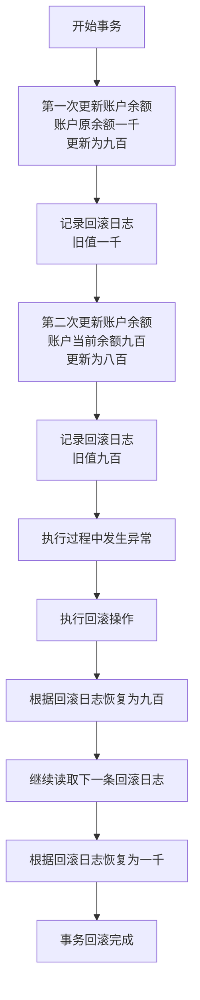
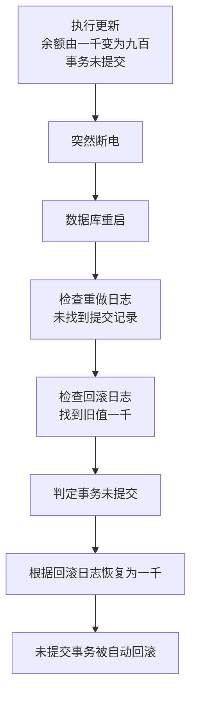
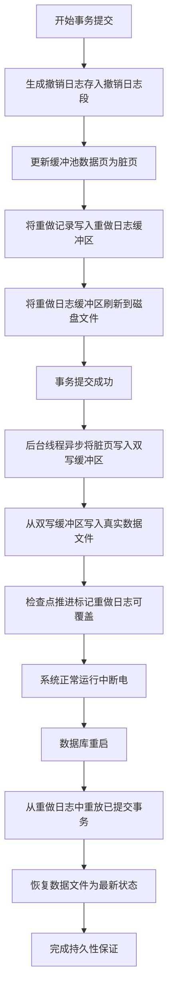
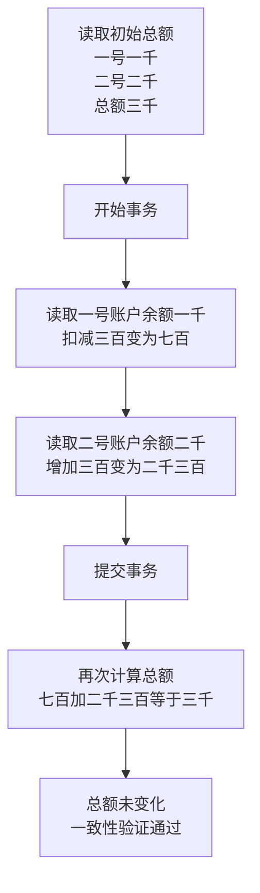
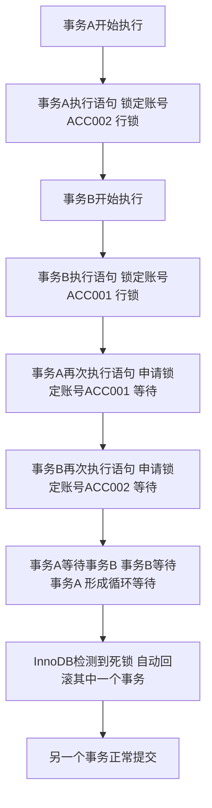

# MySQL 事务完整学习笔记

> **作者**: hli
> **目标**: 从原理到实战，彻底吃透 MySQL InnoDB 事务机制

---

## 📋 目录

1. [事务基础概念](#1-事务基础概念)
2. [ACID 特性深度解析](#2-acid-特性深度解析)
3. [InnoDB 存储层实现](#3-innodb-存储层实现)
4. [事务隔离级别](#4-事务隔离级别)
5. [锁机制详解](#5-锁机制详解)
6. [MVCC 原理](#6-mvcc-原理)
7. [死锁与调优](#7-死锁与调优)
8. [实战案例](#8-实战案例)
9. [面试要点](#9-面试要点)

---

## 1. 事务基础概念


### 为什么要学事务？

> MySQL 每条 DML 默认都在一个隐式事务里执行。

比如你敲：

```
UPDATE account SET balance = balance - 100 WHERE id = 1;
```

> MySQL 背后暗戳戳做了：

```
BEGIN;      -- 隐式事务
write undo log
write redo log (prepare)
apply changes to buffer pool
write redo log (commit)
END;
```

你只看到了一条 SQL
 **但 MySQL 做的是“底层控制现场的全套操作”**。

你没学事务，等于眼睛蒙着在高速路上开车。


### 1.1 什么是事务？

> **事务（Transaction）** 是数据库的原子执行单元，它确保操作序列在失败时可完全撤销，在成功时永久生效，从而维护数据一致性。

对于MySQL而言：

事务(Transaction)

1. 是数据库中一组必须作为整体执行的操作序列，
2. 这些操作要么**全部提交成功(commit)**,
3. 要么在**出现异常时全部回滚(rollback)**。
4. **事务保证数据在并发环境下保持一致性**。


```sql
-- 经典转账示例
START TRANSACTION;

UPDATE account SET balance = balance - 100 WHERE id = 1; -- 张三扣款
UPDATE account SET balance = balance + 100 WHERE id = 2; -- 李四收款

COMMIT; -- 提交事务
-- 或 ROLLBACK; -- 回滚事务
```

### 1.2 事务的四大特性（ACID）

| 特性 | 英文 | 含义 | InnoDB 实现机制 |
|------|------|------|----------------|
| **原子性** | Atomicity | 要么全做，要么全不做 | **undo log** |
| **一致性** | Consistency | 数据库从一个一致性状态到另一个一致性状态 | **redo log + undo log + 隔离机制** |
| **隔离性** | Isolation | 多个事务并发执行时互不干扰 | **锁 + MVCC** |
| **持久性** | Durability | 事务提交后数据永久保存 | **redo log + binlog** |

---


### 1.3 实践方案

```sql
-- ==========================================
-- MySQL 事务原理验证实验手册
-- ==========================================

-- 【准备工作】创建数据库和表
CREATE DATABASE IF NOT EXISTS transaction_study CHARACTER SET utf8mb4;
USE transaction_study;

DROP TABLE IF EXISTS account;
CREATE TABLE account (
    id INT PRIMARY KEY AUTO_INCREMENT,
    name VARCHAR(20) NOT NULL,
    balance DECIMAL(10,2) NOT NULL
) ENGINE=InnoDB;

INSERT INTO account (name, balance) VALUES
('张三', 1000.00),
('李四', 1000.00);

SELECT * FROM account;  -- 查看初始数据


-- ==========================================
-- 实验1：验证【原子性 Atomicity】
-- ==========================================
-- 【目的】证明事务要么全成功，要么全失败，不会出现中间状态

-- 【操作步骤】
START TRANSACTION;
UPDATE account SET balance = balance - 500 WHERE name = '张三';  -- 张三减500
UPDATE account SET balance = balance + 500 WHERE name = '李四';  -- 李四加500
-- 现在故意不提交，而是回滚
ROLLBACK;

-- 【查看结果】
SELECT * FROM account;

-- 【预期现象】张三和李四的余额都还是1000，没有任何变化
-- 【原理解释】ROLLBACK触发了undo log回滚，所有修改都被撤销


-- ==========================================
-- 实验2：验证【一致性 Consistency】
-- ==========================================
-- 【目的】证明事务前后，数据的完整性约束得到保持（如总金额守恒）

-- 【操作步骤】
-- 先查看总金额
SELECT SUM(balance) AS total FROM account;  -- 应该是2000

START TRANSACTION;
UPDATE account SET balance = balance - 300 WHERE name = '张三';
UPDATE account SET balance = balance + 300 WHERE name = '李四';
COMMIT;

-- 【查看结果】
SELECT SUM(balance) AS total FROM account;  -- 依然是2000
SELECT * FROM account;

-- 【预期现象】转账前后总金额不变，保持2000元
-- 【原理解释】一致性是ACID的综合体现，保证业务规则不被破坏


-- ==========================================
-- 实验3：验证【持久性 Durability】
-- ==========================================
-- 【目的】证明事务一旦提交，数据永久保存，即使数据库崩溃也不丢失

-- 【操作步骤】
START TRANSACTION;
UPDATE account SET balance = 1500 WHERE name = '张三';
COMMIT;  -- 提交后立即重启MySQL服务

-- 【查看结果】重启MySQL后执行
SELECT * FROM account WHERE name = '张三';

-- 【预期现象】张三的余额是1500，修改被永久保存
-- 【原理解释】COMMIT时数据写入redo log并刷盘，即使崩溃也能恢复


-- ==========================================
-- 实验4：验证【脏读】(READ UNCOMMITTED)
-- ==========================================
-- 【目的】证明在最低隔离级别下，可以读到未提交的数据

-- 【会话1 - 窗口1执行】
SET SESSION TRANSACTION ISOLATION LEVEL READ UNCOMMITTED;
START TRANSACTION;
UPDATE account SET balance = 9999 WHERE name = '张三';
-- 注意：不要提交，保持事务开启

-- 【会话2 - 窗口2执行】
SET SESSION TRANSACTION ISOLATION LEVEL READ UNCOMMITTED;
SELECT * FROM account WHERE name = '张三';

-- 【预期现象】会话2能看到9999（脏读）
-- 【原理解释】READ UNCOMMITTED不加任何锁，直接读取当前最新值

-- 【会话1继续】
ROLLBACK;  -- 回滚后，会话2之前读到的9999就是"脏数据"


-- ==========================================
-- 实验5：验证【不可重复读】(READ COMMITTED)
-- ==========================================
-- 【目的】证明在读已提交级别，同一事务内多次读取可能得到不同结果

-- 【会话1 - 窗口1执行】
SET SESSION TRANSACTION ISOLATION LEVEL READ COMMITTED;
START TRANSACTION;
SELECT balance FROM account WHERE name = '李四';  -- 第一次读，记住这个值

-- 【会话2 - 窗口2执行】
UPDATE account SET balance = balance + 500 WHERE name = '李四';
COMMIT;

-- 【会话1继续】
SELECT balance FROM account WHERE name = '李四';  -- 第二次读
COMMIT;

-- 【预期现象】两次读取的值不同，第二次读到了会话2提交的新值
-- 【原理解释】READ COMMITTED每次读取都是最新提交的版本


-- ==========================================
-- 实验6：验证【MVCC - 可重复读】(REPEATABLE READ)
-- ==========================================
-- 【目的】证明在可重复读级别，同一事务内多次读取结果一致（快照读）

-- 【会话1 - 窗口1执行】
SET SESSION TRANSACTION ISOLATION LEVEL REPEATABLE READ;
START TRANSACTION;
SELECT balance FROM account WHERE name = '张三';  -- 第一次读，假设是1500

-- 【会话2 - 窗口2执行】
UPDATE account SET balance = balance - 200 WHERE name = '张三';
COMMIT;

-- 【会话1继续】
SELECT balance FROM account WHERE name = '张三';  -- 第二次读，依然是1500！
COMMIT;

-- 【预期现象】两次读取的值相同，看不到会话2的修改
-- 【原理解释】MVCC通过undo log保存快照版本，事务开始时生成ReadView


-- ==========================================
-- 实验7：验证【幻读】(REPEATABLE READ + 范围查询)
-- ==========================================
-- 【目的】证明可重复读级别在某些场景下依然会出现幻读

-- 【会话1 - 窗口1执行】
SET SESSION TRANSACTION ISOLATION LEVEL REPEATABLE READ;
START TRANSACTION;
SELECT * FROM account WHERE balance > 500;  -- 第一次范围查询

-- 【会话2 - 窗口2执行】
INSERT INTO account (name, balance) VALUES ('王五', 2000);
COMMIT;

-- 【会话1继续】
SELECT * FROM account WHERE balance > 500;  -- 第二次范围查询
-- 如果没有间隙锁，可能看到王五（幻读）

-- 【预期现象】InnoDB通过间隙锁(Gap Lock)避免了幻读
-- 【原理解释】Next-Key Lock = 行锁 + 间隙锁，锁定范围防止插入


-- ==========================================
-- 实验8：验证【行锁 - FOR UPDATE】
-- ==========================================
-- 【目的】证明SELECT FOR UPDATE会对行加排他锁

-- 【会话1 - 窗口1执行】
START TRANSACTION;
SELECT * FROM account WHERE name = '张三' FOR UPDATE;  -- 锁住张三这一行
-- 不要提交，保持锁

-- 【会话2 - 窗口2执行】
UPDATE account SET balance = balance + 100 WHERE name = '张三';  -- 尝试修改

-- 【预期现象】会话2被阻塞，等待会话1释放锁
-- 【原理解释】FOR UPDATE加X锁，其他事务无法修改该行

-- 【会话1继续】
COMMIT;  -- 会话2立即执行成功


-- ==========================================
-- 实验9：验证【死锁检测】
-- ==========================================
-- 【目的】证明InnoDB能自动检测死锁并回滚其中一个事务

-- 【会话1 - 窗口1执行】
START TRANSACTION;
UPDATE account SET balance = balance + 10 WHERE name = '张三';  -- 锁住张三

-- 【会话2 - 窗口2执行】
START TRANSACTION;
UPDATE account SET balance = balance + 10 WHERE name = '李四';  -- 锁住李四

-- 【会话1继续】
UPDATE account SET balance = balance + 10 WHERE name = '李四';  -- 等待会话2的锁

-- 【会话2继续】
UPDATE account SET balance = balance + 10 WHERE name = '张三';  -- 等待会话1的锁

-- 【预期现象】其中一个会话报错 "Deadlock found when trying to get lock"
-- 【原理解释】InnoDB检测到循环等待，自动回滚一个事务打破死锁


-- ==========================================
-- 实验10：验证【当前读 vs 快照读】
-- ==========================================
-- 【目的】证明FOR UPDATE是当前读，会读到最新提交的数据

-- 【会话1 - 窗口1执行】
SET SESSION TRANSACTION ISOLATION LEVEL REPEATABLE READ;
START TRANSACTION;
SELECT balance FROM account WHERE name = '张三';  -- 快照读

-- 【会话2 - 窗口2执行】
UPDATE account SET balance = 3000 WHERE name = '张三';
COMMIT;

-- 【会话1继续】
SELECT balance FROM account WHERE name = '张三';  -- 快照读，旧值
SELECT balance FROM account WHERE name = '张三' FOR UPDATE;  -- 当前读，新值3000！
COMMIT;

-- 【预期现象】普通SELECT读旧版本，FOR UPDATE读最新版本
-- 【原理解释】当前读会加锁并读取最新提交的记录


-- ==========================================
-- 【实验总结】
-- ==========================================
-- ✅ 原子性：通过 undo log 实现回滚
-- ✅ 一致性：业务规则在事务前后保持不变
-- ✅ 隔离性：通过锁和MVCC实现不同隔离级别
-- ✅ 持久性：通过 redo log 保证崩溃恢复
-- ✅ MVCC：通过ReadView + undo log实现快照读
-- ✅ 锁机制：行锁(FOR UPDATE)、间隙锁(防幻读)、死锁检测
```


## 环境准备


### ACID环境

> 创建实验所需库`tx_lab`以及表`account`

```sql
mysql> show databases;
+--------------------+
| Database           |
+--------------------+
| information_schema |
| mysql              |
| performance_schema |
| sys                |
| test_sql_flow      |
| wordpress          |
+--------------------+
6 rows in set (0.03 sec)
```


##### 创建`transaction_study`库

```sql
mysql> CREATE DATABASE IF NOT EXISTS transaction_study CHARACTER SET utf8mb4 COLLATE utf8mb4_general_ci;
Query OK, 1 row affected (0.05 sec)
```


##### 创建`account`表

```sql
mysql> USE transaction_study;
Database changed
mysql> -- 建立事务测试表（建议完整版本）
mysql> DROP TABLE IF EXISTS account;
Query OK, 0 rows affected, 1 warning (0.03 sec)

mysql> CREATE TABLE account (
    ->     id INT PRIMARY KEY AUTO_INCREMENT COMMENT '主键',
    ->     name VARCHAR(20) NOT NULL COMMENT '账户名称',
    ->     balance DECIMAL(10,2) NOT NULL COMMENT '账户余额',
    ->     version INT NOT NULL DEFAULT 0 COMMENT 'MVCC版本号',
    ->     update_time TIMESTAMP DEFAULT CURRENT_TIMESTAMP ON UPDATE CURRENT_TIMESTAMP COMMENT '更新时间'
    -> ) ENGINE=InnoDB DEFAULT CHARSET=utf8mb4 COMMENT='事务与MVCC实验表';
Query OK, 0 rows affected (0.07 sec)
```


```sql
mysql> -- 初始化测试数据
mysql> INSERT INTO account (name, balance) VALUES
    -> ('A', 1000.00),
    -> ('B', 1000.00),
    -> ('C', 1000.00);
Query OK, 3 rows affected (0.04 sec)
Records: 3  Duplicates: 0  Warnings: 0
```


#### 验证事务参数


##### innodb_flush_log_at_trx_commit(事务刷盘频次)


###### 指标说明

| 值   | 刷盘策略                                    | 崩溃风险               | 性能       |
| ---- | ------------------------------------------- | ---------------------- | ---------- |
| `0`  | 每秒写一次 redo log，不一定在提交时落盘     | 可能丢失最近 1 秒事务  | 🚀 最高     |
| `1`  | 每次 `COMMIT` 都立刻刷盘                    | 不丢数据（最安全）     | 🐢 最慢     |
| `2`  | 每次 `COMMIT` 写 OS 缓冲区，每秒 fsync 一次 | 可能丢 OS 缓冲区的事务 | ⚖️ 折中方案 |

> ✅ **生产环境一般设置为 `1`**（保证崩溃后数据不丢）
>  ⚙️ **开发环境可以用 `2`**，兼顾性能。

查看：

```sql
SHOW VARIABLES LIKE 'innodb_flush_log_at_trx_commit';
```

修改：

```sql
[mysqld]
innodb_flush_log_at_trx_commit=1
```


###### 查看语句

```sql
mysql> SHOW VARIABLES LIKE 'innodb_flush_log_at_trx_commit';
```

>返回1表示每个事务的执行都刷盘(最慢，但最安全)

```sql
+--------------------------------+-------+
| Variable_name                  | Value |
+--------------------------------+-------+
| innodb_flush_log_at_trx_commit | 1     |
+--------------------------------+-------+
1 row in set (0.02 sec)
```


##### transaction_isolation(控制事务隔离级别)


###### 🎯 **控制事务隔离级别（影响“隔离性”）**

| 值                 | 中文说明         | 特性                       | 可见性特点           |
| ------------------ | ---------------- | -------------------------- | -------------------- |
| `READ-UNCOMMITTED` | 读未提交         | 有脏读                     | 读到未提交事务       |
| `READ-COMMITTED`   | 读已提交         | 无脏读，有不可重复读       | 每次查询重新生成快照 |
| `REPEATABLE-READ`  | 可重复读（默认） | 无脏读无不可重复读，有幻读 | 同事务快照一致       |
| `SERIALIZABLE`     | 串行化           | 完全隔离                   | 加锁执行，性能最低   |

set global transaction isolation level repeatable read;

###### 查看

```sql
SHOW VARIABLES LIKE 'transaction_isolation';
```


```sql
mysql> SHOW VARIABLES LIKE 'transaction_isolation';


+-----------------------+-----------------+
| Variable_name         | Value           |
+-----------------------+-----------------+
| transaction_isolation | REPEATABLE-READ |
+-----------------------+-----------------+
1 row in set (0.00 sec)
```

注意：这是默认事务隔离级别：REPEATABLE-READ：可重复读（默认）


###### 修改

```sql
SET GLOBAL TRANSACTION ISOLATION LEVEL REPEATABLE READ;
```


###### 实际验证

>-- ✅ 1️⃣ 错误示例（带连字符的语法是错的）

```sql
-- MySQL 不接受中间的 “-”，正确写法要用空格分隔。
set global transaction isolation level read-uncommitted;
-- ❌ ERROR 1064 (42000)
```


>-- ✅ 2️⃣ 正确写法（用空格分隔）

```sql
-- 设置全局（GLOBAL）默认事务隔离级别为 “读未提交”
-- 该设置只对 **新连接** 生效，对当前会话不影响。
set global transaction isolation level read uncommitted;
-- Query OK, 0 rows affected (0.00 sec)
```

该设置只对 **新连接** 生效，对当前会话不影响。


>-- ✅ 3️⃣ 查看当前会话的事务隔离级别（SESSION）

```sql
-- 仍然是默认值 REPEATABLE-READ（可重复读）
-- 因为 GLOBAL 修改不会影响已经存在的连接
SHOW VARIABLES LIKE 'transaction_isolation';
-- +-----------------------+-----------------+
-- | Variable_name         | Value           |
-- +-----------------------+-----------------+
-- | transaction_isolation | REPEATABLE-READ |
-- +-----------------------+-----------------+
```

-- 仍然是默认值 REPEATABLE-READ（可重复读）
-- 因为 GLOBAL 修改不会影响已经存在的连接


>-- ✅ 4️⃣ 查看全局事务隔离级别（GLOBAL）

```sql
-- ✅ 4️⃣ 查看全局事务隔离级别（GLOBAL）
-- 已成功变为 READ-UNCOMMITTED
SHOW GLOBAL VARIABLES LIKE 'transaction_isolation';
-- +-----------------------+------------------+
-- | Variable_name         | Value            |
-- +-----------------------+------------------+
-- | transaction_isolation | READ-UNCOMMITTED |
-- +-----------------------+------------------+
```

已成功变为 READ-UNCOMMITTED


>-- ✅ 5️⃣ 修改当前会话隔离级别为 READ UNCOMMITTED

```sql
-- 使用 SESSION 级别设置可立即生效，无需重连。
SET SESSION TRANSACTION ISOLATION LEVEL READ UNCOMMITTED;
-- Query OK, 0 rows affected (0.00 sec)
```

使用 SESSION 级别设置可立即生效，无需重连


>-- ✅ 6️⃣ 验证当前会话隔离级别已生效

```sql
-- ✅ 6️⃣ 验证当前会话隔离级别已生效
SHOW VARIABLES LIKE 'transaction_isolation';
-- +-----------------------+------------------+
-- | Variable_name         | Value            |
-- +-----------------------+------------------+
-- | transaction_isolation | READ-UNCOMMITTED |
-- +-----------------------+------------------+
```


>-- ✅ 7️⃣ 验证全局仍保持 READ-UNCOMMITTED

```sql
-- ✅ 7️⃣ 验证全局仍保持 READ-UNCOMMITTED
-- 当前会话的修改不会影响全局配置（隔离作用域相反）
SHOW GLOBAL VARIABLES LIKE 'transaction_isolation';
-- +-----------------------+------------------+
-- | Variable_name         | Value            |
-- +-----------------------+------------------+
-- | transaction_isolation | READ-UNCOMMITTED |
-- +-----------------------+------------------+
```


>记得设置回来默认的可重复读

```sql
mysql> set global transaction isolation level repeatable read;


Query OK, 0 rows affected (0.00 sec)

mysql> SHOW GLOBAL VARIABLES LIKE 'transaction_isolation';
+-----------------------+-----------------+
| Variable_name         | Value           |
+-----------------------+-----------------+
| transaction_isolation | REPEATABLE-READ |
+-----------------------+-----------------+
1 row in set (0.00 sec)
```


###### 答疑

💬 面试标准答法

> **Q1：如果设置了当前会话的隔离级别为 READ UNCOMMITTED（读未提交），重启 MySQL 后还会生效吗？**

**A：不会。**
 `SET SESSION TRANSACTION ISOLATION LEVEL ...` 只在**当前会话**有效。

- 断开连接（退出 MySQL）后，该设置立即失效；
- 重启 MySQL 也不会保留此值；
- 下次连接时会自动继承全局（`GLOBAL`）的默认隔离级别。

------

> **Q2：如果设置了全局隔离级别为 READ UNCOMMITTED，重启 MySQL 或重新登录后会怎样？**

**A：会生效。**
 `SET GLOBAL TRANSACTION ISOLATION LEVEL ...` 修改的是**全局默认值**，
 影响所有**新建连接**。

- 无需重启 MySQL；
- 只要重新登录或新建连接，就会自动应用新的全局隔离级别；
- 已经存在的连接仍保持原来的 session 值（不会被强制改变）。


###### 生效范围

🧩 一、隔离级别的继承规则

> **每次新建连接（登录 MySQL）时，当前会话（SESSION）会自动继承全局（GLOBAL）的隔离级别。**

也就是说：

- 你现在执行的

  ```sql
  SET GLOBAL TRANSACTION ISOLATION LEVEL REPEATABLE READ;
  ```

  已经把全局配置改回默认值 `REPEATABLE-READ`。

- 之后当你退出当前连接、重新登录时：
   系统会自动将新 session 的隔离级别设置为这个全局默认值。

------


✅ 二、验证方式（推荐你重新登录后执行）

```sql
-- 验证当前会话隔离级别
SHOW VARIABLES LIKE 'transaction_isolation';
```

结果应该是：

```sql
| transaction_isolation | REPEATABLE-READ |
```

同时：

```sql
SHOW GLOBAL VARIABLES LIKE 'transaction_isolation';
```

也会是：

```sql
| transaction_isolation | REPEATABLE-READ |
```

说明两者一致，新连接已经同步使用全局设置。


三、总结记忆口诀

> **GLOBAL 改未来，SESSION 改现在。**
>  **新连继承全局，老连保留当前。**


## 2. ACID(原子性/一致性/隔离性/持久性)*

>在 InnoDB 中，ACID 的实现高度依赖几个核心机制：
>

- 【**A - 原子性**】undo log 记录修改前的版本，事务回滚时逆向恢复。
  同时 undo log 也是 MVCC 的基础，通过版本链实现多版本并发控制。
- 【**D - 持久性**】redo log 采用 WAL 策略，事务提交前先顺序写 redo log。
  通过两阶段提交与 binlog 协同，保证主从一致性。
  可以调整 innodb_flush_log_at_trx_commit 在性能和持久性间权衡。
- 【**I - 隔离性**】核心是 MVCC + 锁：
  - **MVCC 通过 Read View + undo 版本链，让读不加锁，避免脏读和不可重复读**
  - 当前读（UPDATE/SELECT FOR UPDATE）加行锁，写写冲突时阻塞
  - 间隙锁在 RR 级别防止幻读

- 【**C - 一致性**】不是单独机制，而是 A+I+D 加上应用层约束（如外键、唯一索引）
  共同保证的结果。

  工程上的关键点是：undo 和 redo 都用 WAL 但目的不同，**MVCC 牺牲空间换并发**，
两阶段提交保证了分布式环境下的数据一致性。


### 2.1 原子性（Atomicity）

#### 核心原理

> **undo log（回滚日志）** 记录每次修改前的旧值，当事务回滚时，通过 undo log 恢复数据。

原子性指的是：

- 一个事务中的所有操作必须被当作一个不可再分的整体，
- **要么全部成功提交，**
- **要么全部失败回滚，**
- **任何一步失败都不能留下部分写入。**


#### 原理图



#### 验证代码

```java
    /**
     * 方法说明 / Method Description:
     * 中文：原子性（Atomicity）验证：事务内异常触发整体回滚，任何部分写入都不会生效。
     * English: Atomicity verification: exception in transaction triggers full rollback; no partial writes persist.
     * <p>
     * 参数 / Parameters: 无
     * 返回值 / Return: 无
     * 异常 / Exceptions: SQL 执行异常或断言失败会使测试失败
     */
    @Test
    @DisplayName("ACID-Atomicity: rollback on exception leaves no partial writes")
    void atomicityRollbackOnFailure() throws Exception {
        try (Connection conn = dataSource.getConnection()) {
            // 中文：关闭自动提交以手动控制事务
            // English: Disable auto-commit to manually control transaction
            conn.setAutoCommit(false);

            // 中文：先执行第一步扣减
            // English: Perform first deduction
            //为什么 update 执行了但“看不到”？事务未提交 → 修改只在 当前连接 的事务上下文可见。
            updateBalance(conn, 1L, new BigDecimal("900.00"));

            // 中文：模拟异常（例如违反约束或主动抛出）
            // English: Simulate exception (constraint violation or manual throw)
            assertThatThrownBy(() -> updateBalance(conn, 2L, null)).isInstanceOf(Exception.class);

            // 中文：异常后回滚事务，保证两个更新都不生效
            // English: Roll back ensuring none of updates persist
            conn.rollback();

            // 中文：验证两条记录保持初始值
            // English: Verify both rows keep initial values
            assertThat(readBalance(conn, 1L)).isEqualByComparingTo("1000.00");
            assertThat(readBalance(conn, 2L)).isEqualByComparingTo("2000.00");
            log.info("实验成功：原子性验证通过；事务异常已整体回滚，未产生部分写入 / Success: Atomicity confirmed; transaction rolled back on error, no partial writes");
        }
    }
```

#### 手动验证

```sql
-- 会话1
START TRANSACTION;
UPDATE account SET balance = 500 WHERE id = 1;
ROLLBACK; -- 手动回滚

-- 会话2：验证数据未改变
SELECT balance FROM account WHERE id = 1; -- 仍然是原值
```

#### 关键参数

```ini
# my.cnf
innodb_undo_tablespaces = 2    # undo log 表空间数量
innodb_max_undo_log_size = 1G  # 单个 undo log 文件最大大小
```

---


#### 问答


##### MySQL怎么保证事务的原子性？


###### 背诵版

未提交 → Undo 回滚
 已提交 → Redo 重做
 正在提交 → 两阶段提交确保不会一半成功一半失败


###### redo.log + undo.log

InnoDB 

1. 通过 Undo Log 支持回滚、
2. Redo Log 支持崩溃恢复、两阶段提交防止提交中断三者共同作用，

实现事务的原子性，从而保证事务要么完全成功，要么完全失败。


##### 如果事务在执行了 update（事务未提交）时突然断电，这次更新是否会生效？




######  通俗易懂版本（你最需要记住的）

- 你更新了余额为 900
- 但还没 commit
- 就断电了
- MySQL 重启后：
   → 看 redo log：没有 commit 记录
   → 看 undo log：有旧值 1000
   → 因为事务未提交，所以用 undo log 把 900 恢复到 1000

最终结果：

**这条 update 完全没生效，像从未执行过一样。**


> 在 update 执行之后、commit 之前断电——这笔修改根本不会生效，也不会被持久化

在执行

```sql
conn.setAutoCommit(false);
updateBalance(conn, 1L, new BigDecimal("900.00"));
```

后断电


>此时状态是：

| 项目        | 状态                                |
| ----------- | ----------------------------------- |
| redo log    | 未写入（因为还没进入 prepare 阶段） |
| undo log    | 已写入（记录旧值 1000.00）          |
| buffer pool | 已修改为 900.00（脏页）             |
| 提交？      | ❌ 没有 commit                       |
| 事务状态    | 活跃事务（active trx）              |


只要没有 commit，就意味着：

> **这笔事务是“未提交事务”，重启后必须回滚。**


这是原子性的本质要求：

> **未提交 = 不允许留下任何痕迹。**


##### 断电重启后 InnoDB 会如何处理未提交事务，undo log 与 crash recovery 的行为是什么？

> InnoDB crash recovery 的流程如下：

###### ① 加载 redo log

发现这条 update 没有进入 prepare 阶段
 → redo log 里找不到相关事务

说明：

**这个事务从未“准备提交”。**


###### ② 清理 undo log

重启后恢复：

- 把 page 恢复为旧值（1000.00）
- undo 日志被视为未提交事务 → 被丢弃

###### ③ 事务回滚

这个“回滚”不是你手动 rollback
 而是 **Innodb 崩溃恢复自动回滚（auto rollback）**


### 2.2 隔离性（Isolation）

>在 InnoDB 的可重复读（RR）下，事务会基于 MVCC 创建一个只属于自己的快照视图，这个视图在整个事务生命周期中保持稳定，不随着其他事务的提交而变化。
> 对当前事务来说，“正确的数据”是其快照中的一致版本，而不是数据库中的最新版本。
> 这确保了并发场景下读取的稳定性和逻辑一致性。

每个事务都像在一个独立、静止的数据世界里执行自己的逻辑。即使真实世界在疯狂变化，你的世界依然稳定可靠。


#### 核心原理

> 通过 **锁机制 + MVCC（多版本并发控制）** 实现事务之间的隔离。

隔离性指的是：

​	多个并发事务之间相互隔离、彼此的中间状态不可见、使每个事务都像独立执行一样，**避免并发读写导致数据错误**。


>一句话通俗解释

隔离性让"别人没提交的数据，你看不到"，"别人提交的时机，也取决于隔离级别"。


#### 四种隔离级别

| 隔离级别     | 脏读 | 不可重复读 | 幻读       | 实现方式               |
| ------------ | ---- | ---------- | ---------- | ---------------------- |
| RU 读未提交  | ✔    | ✔          | ✔          | 不隔离                 |
| RC 读已提交  | ✘    | ✔          | ✔          | MVCC 每次新快照        |
| RR 可重复读  | ✘    | ✘          | ✘（MySQL） | MVCC 固定快照 + 间隙锁 |
| Serializable | ✘    | ✘          | ✘          | 强制排队执行           |

- RU：最弱，不隔离
- RC：解决脏读，但不可重复读、幻读仍可能
- RR：MySQL最强性价比 → 解决绝大部分问题
- Serializable：最严格但并发能力爆炸下降


#### 验证代码

```java
    /**
     * 方法说明 / Method Description:
     * 中文：
     * 单方法验证 MySQL 四种事务隔离级别（RU、RC、RR、SERIALIZABLE）的实际隔离行为，
     * 依次测试“是否能读取到其他事务未提交的数据”“是否出现不可重复读”“是否出现幻读趋势”等关键并发现象。
     * <p>
     * English:
     * Single-method verification of all four MySQL isolation levels (RU, RC, RR, SERIALIZABLE),
     * validating visibility of uncommitted writes, non-repeatable reads, and phantom tendencies.
     * <p>
     * 实验目的 / Experiment Goal:
     * 中文：验证不同隔离级别对数据可见性的影响，理解脏读、不可重复读、幻读是否会发生。
     * English: Verify how each isolation level affects data visibility and concurrent anomalies.
     * <p>
     * 预期结论 / Expected Result:
     * RU：能读到未提交数据（脏读）
     * RC：不能读未提交数据，但会出现不可重复读
     * RR：不能脏读，不可重复读被解决，但可能出现幻读趋势
     * SERIALIZABLE：所有读写严格串行化，不会发生任意并发问题
     */
    @Test
    @DisplayName("Isolation-AllLevels: RU / RC / RR / SERIALIZABLE 全面隔离性验证")
    void isolationAllLevelsTest() throws Exception {

        // 准备两个会话（两个独立连接）
        try (Connection sessionA = dataSource.getConnection();
             Connection sessionB = dataSource.getConnection()) {

            sessionA.setAutoCommit(false);
            sessionB.setAutoCommit(false);

            //------------------------------------------------------------
            // 实验一：读未提交（RU）
            // 实现思路：sessionA读取sessionB未提交的add(50.00)，它看到了1050.00
            //------------------------------------------------------------
            log.info("【RU实验开始】读未提交验证 — 理论上允许脏读 / Start RU Isolation Test");

            sessionA.createStatement().execute("SET SESSION transaction_isolation = 'READ-UNCOMMITTED'");
            sessionB.createStatement().execute("SET SESSION transaction_isolation = 'READ-UNCOMMITTED'");

            BigDecimal initRU = readBalance(sessionB, 1L);
            updateBalance(sessionB, 1L, initRU.add(new BigDecimal("50.00")));  // 未提交

            BigDecimal aReadRU = readBalance(sessionA, 1L); // A 立即读取
            assertThat(aReadRU).isEqualByComparingTo(initRU.add(new BigDecimal("50.00")));

            log.info("RU验证成功：会话A读到了未提交的数据（脏读） / RU Success: dirty read occurred");

            sessionB.rollback();  // 恢复
            sessionA.rollback();


            //------------------------------------------------------------
            // 实验二：读已提交（RC）
            // 实现思路：
            // 阶段一：sessionA读取到sessionB未提交事务前的原始值1000.00
            // 阶段二：sessionA读取sessionB已提交事务的add(60.00)，它看到了1060.00
            // 不可重复读成立！
            //------------------------------------------------------------
            log.info("【RC实验开始】读已提交验证 — 杜绝脏读 / Start RC Isolation Test");

            sessionA.createStatement().execute("SET SESSION transaction_isolation = 'READ-COMMITTED'");
            sessionB.createStatement().execute("SET SESSION transaction_isolation = 'READ-COMMITTED'");

            BigDecimal initRC = readBalance(sessionB, 1L);
            updateBalance(sessionB, 1L, initRC.add(new BigDecimal("60.00"))); // 未提交

            // RC 不应看到未提交数据
            BigDecimal aReadBeforeCommitRC = readBalance(sessionA, 1L);
            assertThat(aReadBeforeCommitRC).isEqualByComparingTo(initRC);

            log.info("RC验证阶段1：会话A未看到会话B未提交数据（正确） / RC Stage1: uncommitted data invisible");

            sessionB.commit(); // 提交 B

            BigDecimal aReadAfterCommitRC = readBalance(sessionA, 1L);
            assertThat(aReadAfterCommitRC).isEqualByComparingTo(initRC.add(new BigDecimal("60.00")));

            log.info("RC验证阶段2：提交后会话A看到新值 → 不可重复读成立 / RC Stage2: non-repeatable read observed");

            sessionA.rollback();


            //------------------------------------------------------------
            // 实验三：可重复读（RR）
            // 目的：验证在 InnoDB 的 REPEATABLE-READ 隔离级别下，
            //       同一事务内多次读取同一行数据，始终看到同一个“快照版本”。
            // 原理：RR 下首次 SELECT 会创建一致性快照（ReadView）。
            //       后续读取不再刷新视图，即使其他事务提交了更新，也不可见。
            // 验证点：会话 A 在事务期间两次读取同一行 → 结果一致 → 无不可重复读。
            //------------------------------------------------------------
            log.info("【RR实验开始】可重复读验证 — 快照一致 / Start RR Isolation Test");
            sessionA.createStatement().execute("SET SESSION transaction_isolation = 'REPEATABLE-READ'");
            sessionB.createStatement().execute("SET SESSION transaction_isolation = 'REPEATABLE-READ'");

            BigDecimal initRR = readBalance(sessionA, 1L);  // A 第一次读，生成快照

            updateBalance(sessionB, 1L, initRR.add(new BigDecimal("70.00"))); // B 修改
            sessionB.commit(); // 提交 B

            // RR：A 再读，依旧应看到旧快照
            BigDecimal aReadRR = readBalance(sessionA, 1L);
            assertThat(aReadRR).isEqualByComparingTo(initRR);

            log.info("RR验证成功：会话A两次读取一致，没有不可重复读（正确） / RR Success: no non-repeatable read");

            sessionA.commit();

            //------------------------------------------------------------
            // 实验四：可串行化（SERIALIZABLE）
            //------------------------------------------------------------
            log.info("【SERIALIZABLE实验开始】最高隔离级别验证 / Start Serializable Isolation Test");

            try (Connection sessionC = dataSource.getConnection();
                 Connection sessionD = dataSource.getConnection()) {

                sessionC.setAutoCommit(false);
                sessionD.setAutoCommit(false);
                //设置锁等待超时为1S
                sessionC.createStatement().execute("SET SESSION innodb_lock_wait_timeout = 1");
                sessionD.createStatement().execute("SET SESSION innodb_lock_wait_timeout = 1");

                sessionC.createStatement().execute("SET SESSION transaction_isolation = 'SERIALIZABLE'");
                sessionD.createStatement().execute("SET SESSION transaction_isolation = 'SERIALIZABLE'");

                // ===========================
                // 1. 会话C进行 SELECT（加锁）
                // ===========================
                BigDecimal initValue = readBalance(sessionC, 1L);
                log.info("Serializable: 会话C读取并加共享锁 / SessionC SELECT(lock)");

                // ===========================
                // 2. 会话D尝试更新，会被阻塞
                // ===========================
                boolean blocked = false;
                try {
                    updateBalance(sessionD, 1L, initValue.add(new BigDecimal("100.00")));
                } catch (Exception e) {
                    blocked = true; // 这个异常是因为死锁或锁等待超时而被抛出
                }

                assertThat(blocked).isTrue();
                log.info("Serializable: 会话D写入被阻塞（正确） / SessionD update blocked");

                // ===========================
                // 3. 会话C提交 → 解锁
                // ===========================
                sessionC.commit();
                log.info("Serializable: 会话C提交并释放锁 / SessionC commit(unlock)");

                // ===========================
                // 4. 因为 D 已经失败（阻塞+抛异常），必须 rollback D
                // ===========================
                sessionD.rollback();
                log.info("Serializable: 会话D回滚 / SessionD rollback");

            } catch (SQLException e) {
                log.error("Serializable Test Error", e);
                throw e;
            }
        }
    }
```


##### 执行解析

###### 1. **【RU实验开始】读未提交验证**

- `RU验证成功：会话A读到了未提交的数据（脏读）`
- **解释**：事务A成功读取到了事务B未提交的数据，验证了脏读（这是RU的特点）。


###### 2. **【RC实验开始】读已提交验证**

- `RC验证阶段1：会话A未看到会话B未提交数据（正确）`
- **解释**：会话A不能看到事务B未提交的数据，符合 **RC** 隔离级别的要求。
- `RC验证阶段2：提交后会话A看到新值 → 不可重复读成立`
- **解释**：当事务B提交后，会话A能看到更新后的数据，证明了不可重复读（non-repeatable read）现象。


###### 3. **【RR实验开始】可重复读验证**

- `RR验证成功：会话A两次读取一致，没有不可重复读（正确）`
- **解释**：会话A在 **RR** 隔离级别下，第一次和第二次读取的值一致，验证了快照一致性。


###### 4. **【SERIALIZABLE实验开始】最高隔离级别验证**

- `Serializable: 会话C读取并加共享锁 / SessionC SELECT(lock)`
  - **解释**：会话C 读取数据并加锁，进行共享锁（S锁）操作。
- `Serializable: 会话D写入被阻塞（正确） / SessionD update blocked`
  - **解释**：会话D尝试更新时，由于事务A的读操作锁定了数据，D 被阻塞，符合串行化的特性。
- `Serializable: 会话C提交并释放锁 / SessionC commit(unlock)`
  - **解释**：会话C 提交事务并释放锁，其他事务（如D）可以继续执行。
- `Serializable: 会话D回滚 / SessionD rollback`
  - **解释**：由于会话D尝试更新时被阻塞并抛出异常，因此进行回滚操作。

------


###### 🔥 **总结**

- **Serializable 测试的行为**：符合预期，事务D在会话C提交之前被阻塞，成功验证了**串行化**事务隔离级别下的**严格串行执行**行为。
- **超时问题**：从日志来看，所有事务的锁等待时间合理，没有出现卡死现象，表明你设置的 **`innodb_lock_wait_timeout`** 在处理 **Serializable** 测试时有效，避免了长时间的死锁或阻塞。
- **日志输出**：每个实验的行为都明确且无遗漏，结果清晰，适合面试展示。


#### 问答


##### 事务B同时读取事务A提交事务前和事务后都是一样的值数据不就错了吗？

- 假设事务A没有提交add(100)之前是1000，那么事务B此时去读取到了，事务A此时是1000生成了快照，
- 这个时候事务A已经提交了add(100)变成了1100，事务B还是去读取了旧的快照是1000，那么数据不就错了？


###### 为什么数据不算错？

1. **数据一致性**：虽然事务 A 在提交后更新了数据，但事务 B 在读取时，看到的是它 **启动时的版本**。这是为了保证事务内部读取的一致性，防止出现“不可重复读”的问题。
2. **不引入脏读**：由于事务 A 在提交前一直修改的是它的 **临时快照**（A 对应的快照和事务B是不共享的），事务 B 看不到 A 其他事务的修改。这样可以有效防止**脏读**的发生。
3. **快照隔离**：可重复读下，事务 B 总是会读取到事务 A 开始时创建的快照，而 **不会被事务 A 提交后的新值影响**。这是**快照隔离**的核心，确保了数据的一致性和隔离性。
4. **多版本并发控制（MVCC）**：每个事务都有自己的独立视图。A 提交的 `1100` 只会对 **新事务** 可见，**B 事务仍然看到的是它事务开始时的版本（1000）**。这种机制避免了跨事务的干扰，也保证了并发下数据的稳定性。


###### 总结

> 在 **Repeatable Read（可重复读）** 隔离级别下，

- 事务 B **会读取到它事务开始时生成的快照**（如 `1000`），
- 即**使事务 A 已经提交了对该数据的修改（从 `1000` 到 `1100`）**。
- 这是为了确保事务内的读取一致性，避免了不可重复读的问题。
- 事务 A 提交后的修改不会影响事务 B 已经创建的快照版本。
- 通过 **MVCC（多版本并发控制）**，每个事务有自己的视图，保障了并发执行的正确性。


##### 为什么说RR（可重复读）本质就是为了保证并发读取的准确性和稳定性？


###### 1."准确性"不是读到最新，而是读到"对我来说一致的版本"

>在RR可重复读隔离级别下

对于当前事务B而言，它**从开启事务那一刻起，就绑定到了一个"专属的数据版本视图"。**

这个视图里的数据就是对它来说**"准确的"！**


> 准确的含义不是"最新"而是

"**同一个事务内，所有读取都一致、不变、不受别人提交的影响**"。

这就是数据库一致性的定义方式。


###### 2."稳定性"的含义就是快照不变

>对于事务B来说，它的快照版本就是稳定不变的

这意味着：

1. 别人更新？可以更新
2. 别人提交？可以提交
3. 别人删了再加？随便
4. 只要B不commit，它永远只看到它的那份快照


>也就是说

- **事务B的读操作不会被外界的写操作打乱节奏，也不会被"最新值"干扰。**
- **它看的始终是一致的历史视图。**


这就是"可重复读"的本质含义。


---

### 2.3 持久性（Durability）

>**持久性** 是 **ACID** 四大特性之一，它保证了在事务提交后，数据会被永久保存，即使数据库发生崩溃、断电等异常情况，已提交的事务数据也不会丢失。
> 持久性通常依赖于以下几个技术：
>
>1. **日志机制（WAL，Write-Ahead Logging）**：事务修改数据前，先写入日志，确保数据提交不会丢失。
>2. **重做日志（Redo Log）和撤销日志（Undo Log）**：通过重做日志恢复已提交的事务，撤销日志支持事务回滚。
>3. **检查点（Checkpoint）**：定期将内存中的数据页写入磁盘，减少恢复时间。

> **只要事务 commit 了，哪怕数据库马上崩溃，断电重启，已提交的数据必须恢复回来，不能丢。**


#### 简介

>持久型主要解决的问题是：

**一旦事务提交(commit)，其修改的数据必须永久保留在数据库中，不会丢失**。

**无论发生什么故障或系统崩溃，已提交的事务数据必须保证恢复**，这就是持久型的关键所在。


#### 核心原理

通过 **redo log + binlog + 两阶段提交（2PC）** 保证数据持久化。


##### 1.WAL(write-ahead logging)(先日志，再落盘)

这是整个持久性的灵魂

> 数据修改**必须先写日志（redo log）**，成功后才算 commit，
> **数据页可以慢慢写回磁盘**，不着急。

为什么？

因为磁盘随机写太慢，redo 顺序写非常快。


##### 2.Redo Log(保证事务不会丢失)

>Redo log(重做日志)专门记录

1. 修改了哪个页
2. 这个页里哪里位置
3. 写入了什么内容

是一个物理性质的日志，这种日志是顺序写的——>巨快


>commit流程的重要原则

```pgsql
write redo log（prepare阶段）  
↓
flush redo log 到磁盘（fsync）  
↓ 
事务 commit 成功  
↓
数据页之后再慢慢落盘（Checkpoint）
```

只要redo log已持久化，事务就永远不会丢

哪怕断电，MySQL重启的时候

> Redo log 里有哪些已 commit 的事务 → 全部重做（apply），数据恢复到正确状态。

这就是持久性D的保证机制


##### 3.Undo Log：不是持久性，但保证回滚和多版本

>Undo log主要提供

- 原子性(回滚机制)
- MVCC(多版本链)

它不是持久性的核心，但：

>Undo log也必须写进去，但不要求先fsync才能commit。

真正决定持久型的事是redo log。


##### 4.Doublewrite Buffer：防止半页写(崩溃时页损坏)

>磁盘写入16KB数据页可能出现

- 写到一半断电——>半页写
- 页损坏，无法恢复

>InnoDB的解决方案：

- 数据页落盘前
- 先写到`doublewrite buffer`(2MB区域)
- 写成功后，再写会真实表空间

>如果崩溃

- 检测到脏页不完整
- 用`doublewrite buffer`里的"完整副本修复

这就是数据页一致性的保障


##### 5.Checkpoint：推进 redo log 的回收点

>Redo log是循环写入的，所以必须不断推进

```nginx
checkpoint_lsn
```

- 把脏页刷回磁盘
- 把redo log中已不需要重做的部分标记可覆盖。

否则 redo log 会被写满。


#### 高并发真实流程

> 假设用户执行了`balance`初始=1000

```sql
update account set balance = balance + 100 where id = 1;
```

1. 写`undo log`(用于回滚、版本链)

   1. ```sql
      old value: balance=1000
      ```

   2. 生成`undo`版本节点

2. 修改`buffer pool`(内存中的页)

   1. ```ini
      balance = 1100
      ```

   2. 只是改了内存，还没有落盘

3. 写`redo log`(prepare阶段)

   1. 记录本次修改

   2. ```sql
      page_no, offset, old_data, new_data
      ```

   3. 写入`redo log buffer`——>再`fsync`持久化到`redo`文件

4. `redo log`持久化成功——>`commit`成功

   1. 只要redo持久化成功
   2. 崩溃也不怕，肯定能恢复

5. 数据页稍后被刷到磁盘(`checkpoint`)

   1. 不强制立即落盘，因为redo已经保证恢复能力。


#### 持久化流程图




#### redo log vs binlog 对比

>binlog 是 MySQL Server 层记录“所有逻辑操作”的日志，用于主从复制、数据恢复、审计、持久化补充。

| 维度 | redo log | binlog |
|------|----------|--------|
| **层级** | InnoDB 引擎层 | MySQL Server 层 |
| **作用** | 崩溃恢复 | 主从复制、数据备份 |
| **记录内容** | 物理日志（数据页变化） | 逻辑日志（SQL语句） |
| **写入方式** | 循环写入（固定大小） | 追加写入 |
| **刷盘时机** | innodb_flush_log_at_trx_commit | sync_binlog |

#### 刷盘策略

```ini
# my.cnf 配置

# ===== redo log 刷盘策略 =====
innodb_flush_log_at_trx_commit = 1  # 推荐金融系统
# 0 = 每秒刷一次（可能丢1秒数据）
# 1 = 每次提交都刷盘（最安全）
# 2 = 每次提交写OS缓存，每秒刷盘（折中）

# ===== binlog 刷盘策略 =====
sync_binlog = 1  # 推荐金融系统
# 0 = 不强制刷盘（依赖OS）
# 1 = 每次提交都刷binlog（最安全）
# N = 每N次事务刷一次（折中）
```

#### 验证持久性

```bash
# 1. 插入数据
mysql> INSERT INTO account (name, balance) VALUES ('持久化测试', 1000);
Query OK, 1 row affected (0.01 sec)

# 2. 强制杀掉MySQL进程（模拟宕机）
$ kill -9 $(pidof mysqld)

# 3. 重启MySQL
$ systemctl start mysql

# 4. 验证数据仍然存在
mysql> SELECT * FROM account WHERE name = '持久化测试';
+----+--------------+---------+
| id | name         | balance |
+----+--------------+---------+
|  1 | 持久化测试    | 1000.00 |
+----+--------------+---------+
✅ 数据未丢失！
```


### 2.4 一致性（Consistency）

#### 核心原理

> 一致性是通过 **原子性 + 隔离性 + 持久性** 共同保证的，同时需要应用层的业务约束。

一致性性指的是：

- 事务执行前后，
- 数据库**必须从一个合法状态转换到另一个合法状态**，
- 不能破坏业务规则与数据约束。

**不管你做什么操作，只要事务成功提交，数据必须保持正确，不允许出现违反约束的状态。**


#### 转账场景示例



#### 验证代码

```java
   /**
     * 方法说明 / Method Description:
     * 中文：一致性（Consistency）验证：跨两行的转账在提交后保持总余额守恒，出现错误时回滚保持不变量。
     * English: Consistency verification: cross-row transfer preserves total sum after commit; on error, rollback keeps invariant.
     * <p>
     * 参数 / Parameters: 无
     * 返回值 / Return: 无
     * 异常 / Exceptions: SQL 执行异常或断言失败会使测试失败
     */
    @Test
    @DisplayName("ACID-Consistency: transfer preserves sum invariant")
    void consistencySumInvariant() throws Exception {
        try (Connection conn = dataSource.getConnection()) {
            conn.setAutoCommit(false);

            // 中文：初始总额
            // English: Initial sum
            BigDecimal sum0 = readSum(conn);

            // 中文：执行从 id=1 向 id=2 转账 300
            // English: Transfer 300 from id=1 to id=2
            BigDecimal b1 = readBalance(conn, 1L);
            BigDecimal b2 = readBalance(conn, 2L);
            updateBalance(conn, 1L, b1.subtract(new BigDecimal("300.00")));
            updateBalance(conn, 2L, b2.add(new BigDecimal("300.00")));

            // 中文：提交事务
            // English: Commit transaction
            conn.commit();

            // 中文：提交后总额应保持不变
            // English: Sum invariant must hold after commit
            BigDecimal sum1 = readSum(conn);
            assertThat(sum1).isEqualByComparingTo(sum0);
            log.info("实验成功：一致性验证通过；跨行转账后总额守恒 / Success: Consistency confirmed; cross-row transfer preserved total sum");
        }
    }
```

#### 数据库约束

```sql
-- 余额非负约束
ALTER TABLE account ADD CONSTRAINT chk_balance CHECK (balance >= 0);

-- 外键约束
ALTER TABLE orders ADD CONSTRAINT fk_user 
FOREIGN KEY (user_id) REFERENCES users(id);
```

---


#### 问答


##### 怎么保证的数据一致性？

> MySQL（InnoDB）通过「约束机制」＋「原子性」＋「隔离性」＋「持久性」四类手段共同保证一致性。

一致性本身是结果：数据库始终保持合法状态，不出现违反约束的数据。


###### 1.约束(consistency的核心基础)

>一致性不是数据库自动凭空保证的，它首先依赖约束(Constraint)

- 主键唯一
- 外键约束
- 非空约束
- check
- 业务规则(比如余额不能为负)


>数据库保证

**只要你定义了规则，我就保证提交后的数据一定不违反规则**

这是最底层的“一致性基础”。


###### 2.原子性(Atomicity)——避免写一半

>通过Undo Log实现

- 事务失败——>整体回滚
- 不会留下中间状态
- 转账扣了钱、加钱失败这种情况不会发生。

如果没有原子性，就会造成本质上的数据不一致。


###### 3.隔离性(Lsolation)——避免并发篡改数据

>InnoDB通过

- MVCC(快照读)
- 行锁、间隙锁、临键锁(当前读)
- 事务隔离级别(RC、RR)

>保证：

不同事务不会读到其它事务，未提交的脏数据，也不会互相篡改导致不一致。

例如:

- 并发扣款时避免两个事务都读到旧余额
- 防止并发产生丢失更新


隔离性处理的是"并发下如何保持一致"。


###### 4.持久性(Durability)——避免"提交后丢数据"

>InnoDB通过

- redo log
- WAL写前日志
- crash recover(崩溃恢复)


>确保提交后的数据

断电也不会丢，保证提交后的状态是最终一致的。


>如果commit之后断电导致数据丢失，也会破坏一致性。


###### 5.总结

- 一致性是目标
- 原子性 + 隔离性 + 持久型 = 保证一致性的手段
- 约束 = 定义什么是"合法状态"

四者合在一起才能保证一致性。


>标准总结句

MySQL的一致性不是单一机制实现的，而是依赖

1. 约束机制定义合法状态，
2. 再由原子性保证失败不留痕、
3. 隔离性保证并发不破坏状态、
4. 持久性确保提交不丢失

四者共同保证事务前后始终处于一致的合法数据状态


### 模拟面试


#### 🧪 **第 1 题：ACID 中“一致性”到底是什么？**

要求：

- 不允许回答“数据库从一种一致状态切换到另一种一致状态”这种背诵式答案
- 给实际场景说明
- 说清楚**一致性与隔离性**的区别


> 答：

##### ACID中的一致性（Consistency）

**一致性** 是 ACID（原子性、隔离性、一致性、持久性）中的一个关键特性，确保数据库在事务执行前后始终处于一个**有效的状态**。简单来说，一致性保证了**数据完整性**：任何事务的执行都不会破坏数据库的约束、规则或业务逻辑。

###### 实际场景说明：

想象一个银行转账系统，账户A和账户B的初始余额分别为1000元和2000元。用户A发起了一个转账操作，转账金额为700元。事务A首先减少账户A余额，然后事务B执行相反的操作，增加账户B余额。最终：

- 账户A余额变为300元；
- 账户B余额变为2700元。

在这个过程中，**一致性** 确保了事务前后数据库中的总余额始终是守恒的，即**事务A + 事务B 总余额 = 3000元**。即使在复杂的并发环境下，数据库也会通过约束和规则保证所有操作都遵循预定义的业务逻辑和规则，不会出现不一致的情况。

##### 一致性的保障机制：

一致性不仅仅是指数据从一种状态过渡到另一种状态，而是要确保过渡的结果是有效的。以下是一致性实现的几个关键机制：

1. **数据约束**：通过主键、外键、唯一性约束等机制，确保数据始终符合预定的完整性规则。例如，银行账户的余额不能为负数，转账金额不能超过账户余额等。
2. **原子性**：原子性确保了事务的操作要么全部成功，要么完全失败。若其中一部分操作失败，事务会被回滚，数据库状态会恢复到事务执行前的样子。这通过如`undo.log`来实现，确保事务不处于部分完成的状态，维护数据库的一致性。
3. **隔离性**：在并发环境下，**隔离性** 通过 **MVCC（多版本并发控制）** 等技术保证事务之间互不干扰。事务A和事务B在执行时虽然操作相同的资源，但由于隔离级别的控制，它们不会看到彼此的未提交数据，从而避免了数据不一致的情况。
4. **持久性**：持久性保证了即使系统崩溃，事务提交后的修改也能被保留。`redo.log`记录了事务的提交状态，确保系统重启后事务的数据不会丢失。

##### 一致性与隔离性的区别：

- **一致性**：主要解决的是**数据的有效性**问题，确保事务开始前后的数据符合约束和规则。在数据库执行过程中，任何违反这些规则的操作都会被回滚，确保最终结果是合法的。例如，账户余额不能为负数，转账金额不能超过余额等。
- **隔离性**：主要解决的是**事务间的干扰问题**，确保并发事务相互独立。通过设置不同的隔离级别（如**读未提交**、**读已提交**、**可重复读**、**串行化**），**隔离性** 保证每个事务只能看到已经提交的**数据快照**，避免了脏读、不可重复读等并发问题。举个例子，在较低的隔离级别（如 **读未提交**）下，一个事务可以读取到另一个事务尚未提交的脏数据，而在更高的隔离级别（如 **可重复读**）下，事务会看到稳定的数据快照，防止在事务执行期间数据被其他事务修改。

##### 总结：

- **一致性**：保证数据从一个有效状态过渡到另一个有效状态，所有事务的执行都会遵循数据库的约束和规则，确保数据不进入无效的状态。
- **隔离性**：保证并发事务之间不互相干扰，确保每个事务独立地执行，并且数据状态在事务的执行过程中不受其他事务的影响。


------

#### 🧪 **第 2 题：MVCC 的核心实现依赖哪三个隐藏字段？**

要求：

- 说出三个字段
- 每个字段的具体作用
- 为什么“快照读不会加锁”？


##### 总结

- **DB_TRX_ID**：记录最后一次修改该行的事务ID，用于标记数据版本。
- **DB_ROLL_PTR**：指向**undo log**的指针，支持回滚操作。
- **DB_ROW_ID**：每行数据的唯一标识符，保证数据的唯一性。

通过这三个隐藏字段，InnoDB 可以在**并发事务环境**中保证数据的隔离性和一致性，并实现**快照读**。因此，在执行快照读时，InnoDB不需要加锁，可以提高并发性能，避免了锁争用和死锁的情况。


------

#### 🧪 **第 3 题：RR 隔离级别下为什么不会出现不可重复读？**

要求：

- 必须结合 **undo log 的版本链** 来解释
- 必须说明“什么情况下读到旧版本、什么情况下读到新版本”


##### **为什么在RR隔离级别下不会出现不可重复读？**

在 **可重复读 (RR)** 隔离级别下，**不可重复读** 不会发生，因为事务内的所有读取操作始终读取到相同版本的数据。这是通过 **undo log 的版本链** 和 **MVCC（多版本并发控制）** 实现的。

###### **核心原理：**

1. **MVCC 和 Undo Log**：每次事务修改数据时，都会在 **undo log** 中保存该行数据的旧版本。事务在开始时会得到数据的快照，后续所有查询都只能看到这个快照，保证事务内部读取一致。
2. **事务ID 和 版本链**：每一行数据都有一个关联的 **事务ID**，标记最后修改该数据的事务。事务A在开始时读取的数据快照，会锁定数据版本，后续查询始终读取这个版本，而不会被其他事务提交的修改影响。

###### **案例：**

- **事务A** 开始时查询 `wind_code = 'AAPL'`，初始值是 1000。
- **事务B** 更新了该行数据，把值从 1000 改为 1100。
- **事务A** 继续查询，同样读取到 1000，而不是 1100，确保了**一致性**。

**为什么快照读不加锁？**

- **MVCC** 通过维持数据的多个版本，事务A读取的是它开始时的数据快照，不会受到其他事务提交的数据影响，因此不需要加锁。这提升了并发性能，避免了锁竞争。


##### 总结

- 在 **RR 隔离级别** 下，通过 **undo log** 和 **事务ID** 版本管理，保证了事务内数据的一致性，避免了不可重复读。
- **快照读不加锁**，因为每个事务都读取它自己开始时的快照数据，避免了锁竞争和死锁问题。

这种机制确保了在并发环境下，事务的读操作始终一致，不受其他事务修改影响，适用于高并发场景。


---

## 3. InnoDB 存储层实现

### 3.1 三大日志系统

```
┌────────────────────────────────────────────────────┐
│           InnoDB 日志系统架构                        │
├────────────────────────────────────────────────────┤
│                                                    │
│  ┌──────────┐    ┌──────────┐    ┌──────────┐   │
│  │ undo log │    │ redo log │    │  binlog  │   │
│  │ 回滚日志  │    │ 重做日志  │    │ 二进制日志│   │
│  └────┬─────┘    └────┬─────┘    └────┬─────┘   │
│       │               │               │          │
│       ↓               ↓               ↓          │
│  保证原子性       保证持久性       主从复制        │
│  + MVCC          + 崩溃恢复       + 增量备份      │
│                                                    │
└────────────────────────────────────────────────────┘
```

### 3.2 undo log 详解

#### 作用
1. **事务回滚**：记录修改前的旧值
2. **MVCC 读取**：提供历史版本快照

#### 存储位置
```sql
-- 查看 undo log 配置
SHOW VARIABLES LIKE '%undo%';

-- 输出示例
innodb_undo_directory = ./
innodb_undo_tablespaces = 2
innodb_max_undo_log_size = 1073741824
```

#### 版本链结构

```
当前记录: id=1, name='张三', balance=800, trx_id=103, roll_ptr=0x1234

         ↓ roll_ptr 指向

undo log: id=1, name='张三', balance=900, trx_id=102, roll_ptr=0x1235

         ↓ roll_ptr 指向

undo log: id=1, name='张三', balance=1000, trx_id=101, roll_ptr=NULL

✅ 通过版本链可以回滚到任意历史版本
```

### 3.3 redo log 详解

#### 作用
保证持久性：即使数据页未刷盘，也能通过 redo log 恢复数据

#### WAL（Write-Ahead Logging）机制

```
正常流程（未优化）:
1. 修改数据 → 2. 刷脏页到磁盘（随机IO，慢）

WAL优化流程:
1. 修改数据 → 2. 写redo log（顺序IO，快）→ 3. 异步刷脏页

✅ 优点：
  - redo log 顺序写入，速度快
  - 脏页刷盘可以延迟，合并多次修改
  - 崩溃恢复时，通过redo log重放即可
```

#### redo log 文件结构

```
# 查看redo log文件
$ ls -lh /var/lib/mysql/ib_logfile*
-rw-r----- 1 mysql mysql 48M ib_logfile0
-rw-r----- 1 mysql mysql 48M ib_logfile1

# 循环写入模式
┌─────────────────────────────────────┐
│  ib_logfile0  │  ib_logfile1        │
│  ↓写入        │  ↓写入              │
│  已刷盘记录    │  未刷盘记录          │
│  (可覆盖)     │  (不可覆盖)          │
└─────────────────────────────────────┘
     ↑                  ↑
  checkpoint        write pos
```

### 3.4 binlog 详解

#### 三种格式

| 格式 | 记录内容 | 优点 | 缺点 |
|------|---------|------|------|
| **STATEMENT** | 原始SQL | 日志量小 | 某些函数无法复制（NOW()） |
| **ROW** | 每行变化 | 精确复制 | 日志量大 |
| **MIXED** | 混合模式 | 自动选择 | 复杂度高 |

```sql
-- 查看当前格式
SHOW VARIABLES LIKE 'binlog_format';

-- 修改为ROW格式（推荐）
SET GLOBAL binlog_format = 'ROW';
```

#### 查看binlog

```sql
-- 查看当前binlog文件
SHOW MASTER STATUS;
+------------------+----------+--------------+
| File             | Position | Binlog_Do_DB |
+------------------+----------+--------------+
| mysql-bin.000001 |     1234 |              |
+------------------+----------+--------------+

-- 查看binlog内容
SHOW BINLOG EVENTS IN 'mysql-bin.000001' LIMIT 10;

-- 解析binlog（推荐工具）
$ mysqlbinlog mysql-bin.000001
```

---

## 4. 事务隔离级别

### 4.1 隔离级别设置

```sql
-- 查看当前隔离级别
SELECT @@transaction_isolation;
-- 或
SHOW VARIABLES LIKE 'transaction_isolation';

-- 设置会话级别
SET SESSION TRANSACTION ISOLATION LEVEL READ COMMITTED;

-- 设置全局级别（需重启）
SET GLOBAL TRANSACTION ISOLATION LEVEL REPEATABLE READ;
```

### 4.2 隔离级别详解

#### READ UNCOMMITTED（读未提交）

```sql
-- 会话A
SET SESSION TRANSACTION ISOLATION LEVEL READ UNCOMMITTED;
START TRANSACTION;
SELECT balance FROM account WHERE id = 1; -- 读到1000

-- 会话B
START TRANSACTION;
UPDATE account SET balance = 500 WHERE id = 1;
-- 注意：未提交！

-- 会话A（继续）
SELECT balance FROM account WHERE id = 1; -- 读到500（脏读！）

-- 会话B（继续）
ROLLBACK; -- 回滚

-- 会话A（继续）
SELECT balance FROM account WHERE id = 1; -- 读到1000（之前读到的500是脏数据）
```

**结论**: ❌ 不推荐使用，会产生脏读

---

#### READ COMMITTED（读已提交）

```sql
-- 会话A
SET SESSION TRANSACTION ISOLATION LEVEL READ COMMITTED;
START TRANSACTION;
SELECT balance FROM account WHERE id = 1; -- 读到1000

-- 会话B
UPDATE account SET balance = 500 WHERE id = 1;
COMMIT; -- 提交

-- 会话A（继续）
SELECT balance FROM account WHERE id = 1; -- 读到500（不可重复读！）
COMMIT;
```

**特点**:
- ✅ 解决脏读
- ❌ 存在不可重复读
- 🔧 适用场景：高并发系统（Oracle默认级别）

---

#### REPEATABLE READ（可重复读）- MySQL默认

```sql
-- 会话A
SET SESSION TRANSACTION ISOLATION LEVEL REPEATABLE READ;
START TRANSACTION;
SELECT balance FROM account WHERE id = 1; -- 读到1000

-- 会话B
UPDATE account SET balance = 500 WHERE id = 1;
COMMIT; -- 提交

-- 会话A（继续）
SELECT balance FROM account WHERE id = 1; -- 仍然读到1000（可重复读）✅
COMMIT;
```

**特点**:
- ✅ 解决脏读
- ✅ 解决不可重复读
- ✅ 通过Next-Key Lock解决幻读
- 🔧 适用场景：金融系统、报表统计

---

#### SERIALIZABLE（串行化）

```sql
-- 会话A
SET SESSION TRANSACTION ISOLATION LEVEL SERIALIZABLE;
START TRANSACTION;
SELECT * FROM account WHERE id = 1; -- 自动加读锁

-- 会话B
UPDATE account SET balance = 500 WHERE id = 1; -- 等待会话A释放锁...
```

**特点**:
- ✅ 完全避免并发问题
- ❌ 性能极差
- 🔧 适用场景：关键业务（如对账）

---

### 4.3 隔离级别选择建议

```
┌─────────────────────┬──────────────────┬────────────┐
│ 业务场景             │ 推荐隔离级别      │ 理由       │
├─────────────────────┼──────────────────┼────────────┤
│ 银行转账             │ REPEATABLE READ  │ 强一致性   │
│ 订单支付             │ REPEATABLE READ  │ 防止重复扣款│
│ 电商秒杀             │ READ COMMITTED   │ 高并发     │
│ 报表统计             │ READ UNCOMMITTED │ 可容忍脏读  │
│ 财务对账             │ SERIALIZABLE     │ 绝对准确   │
└─────────────────────┴──────────────────┴────────────┘
```

---


## 5. MVCC 原理

### 5.1 什么是 MVCC？

**MVCC (Multi-Version Concurrency Control)** 多版本并发控制

- **读不加锁，写不阻塞读**
- **通过保存数据的多个历史版本实现并发控制**
- 只在 **READ COMMITTED** 和 **REPEATABLE READ** 下生效

---

### 5.2 MVCC 实现机制

#### 隐藏字段

InnoDB 为每行数据添加三个隐藏字段：

```sql
CREATE TABLE account (
  id INT PRIMARY KEY,
  name VARCHAR(50),
  balance DECIMAL(10,2),
  -- 以下为隐藏字段（用户不可见）
  DB_TRX_ID,    -- 最后修改该行的事务ID
  DB_ROLL_PTR,  -- 指向undo log的回滚指针
  DB_ROW_ID     -- 隐藏主键（仅在无主键时存在）
);
```

#### 版本链示例

```
当前数据行:
┌────────────────────────────────────────┐
│ id=1, name='张三', balance=800         │
│ DB_TRX_ID=103, DB_ROLL_PTR=0x1234     │
└────────────────┬───────────────────────┘
                 │
                 ↓ (指向undo log)
┌────────────────────────────────────────┐
│ undo log: balance=900, trx_id=102     │
│ roll_ptr=0x1235                       │
└────────────────┬───────────────────────┘
                 │
                 ↓ (继续指向)
┌────────────────────────────────────────┐
│ undo log: balance=1000, trx_id=101    │
│ roll_ptr=NULL                         │
└────────────────────────────────────────┘

✅ 通过版本链，不同事务可以读取到不同版本的数据
```

---


### 5.3 ReadView 机制


#### ReadView 是什么？

事务开始时，InnoDB 会生成一个 **ReadView（读视图）**，记录当前活跃的事务列表，用于判断数据的可见性。


#### ReadView 字段

```java
class ReadView {
    long m_low_limit_id;     // 当前系统中最大事务ID + 1
    long m_up_limit_id;      // 当前活跃事务中最小的事务ID
    List<Long> m_ids;        // 当前活跃的事务ID列表
    long m_creator_trx_id;   // 创建该ReadView的事务ID
}
```


#### 可见性判断规则

```
给定数据行的 trx_id，判断是否可见：

1. trx_id < m_up_limit_id
   → 该版本在ReadView生成前已提交，可见 ✅

2. trx_id >= m_low_limit_id
   → 该版本在ReadView生成后才提交，不可见 ❌

3. m_up_limit_id <= trx_id < m_low_limit_id
   a) 如果 trx_id 在 m_ids 中（活跃事务）
      → 不可见 ❌
   b) 如果 trx_id 不在 m_ids 中（已提交）
      → 可见 ✅

4. trx_id == m_creator_trx_id
   → 是当前事务自己修改的，可见 ✅
```

---

### 5.4 MVCC 工作流程

#### 场景：两个事务并发读写

```
初始数据: id=1, balance=1000, trx_id=100

时间线:
T1  事务A(trx_id=101) BEGIN
T2  事务A 生成 ReadView(m_ids=[101])
T3  事务A SELECT balance WHERE id=1  → 读到1000 ✅
T4  
T5  事务B(trx_id=102) BEGIN
T6  事务B UPDATE balance=500 WHERE id=1
T7  事务B COMMIT
T8  
T9  事务A SELECT balance WHERE id=1  → 读到1000还是500？

答案取决于隔离级别：
- READ COMMITTED: 读到500（每次SELECT生成新ReadView）
- REPEATABLE READ: 读到1000（复用第一次的ReadView）
```

#### 详细过程（REPEATABLE READ）

```
T3时刻 事务A 第一次查询:
1. 生成 ReadView: {m_ids=[101], m_up_limit_id=101, m_low_limit_id=102}
2. 查找 id=1 的记录: trx_id=100
3. 判断可见性: 100 < 101（在ReadView前已提交）→ 可见 ✅
4. 返回 balance=1000

T9时刻 事务A 第二次查询:
1. 复用 T3 的 ReadView（REPEATABLE READ特性）
2. 查找 id=1 的记录: trx_id=102
3. 判断可见性: 102 >= 102（在ReadView后才提交）→ 不可见 ❌
4. 通过 roll_ptr 找到 undo log 版本: trx_id=100, balance=1000
5. 判断可见性: 100 < 101 → 可见 ✅
6. 返回 balance=1000

✅ 实现了可重复读！
```

---

### 5.5 快照读 vs 当前读

#### 快照读

通过 MVCC 读取历史版本，**不加锁**

```sql
-- 快照读（不加锁）
SELECT * FROM account WHERE id = 1;
```

#### 当前读

读取最新版本，**加锁**

```sql
-- 当前读（加S锁）
SELECT * FROM account WHERE id = 1 LOCK IN SHARE MODE;

-- 当前读（加X锁）
SELECT * FROM account WHERE id = 1 FOR UPDATE;

-- 当前读（自动加X锁）
UPDATE account SET balance = 500 WHERE id = 1;
INSERT INTO account VALUES (...);
DELETE FROM account WHERE id = 1;
```


---


## 6. 锁机制详解*


​	在MySQL中，锁机制非常重要，因为**它保证了并发操作的安全性和数据的一致性**。

MySQL提供了多种类型，通常分为以下几类：**表级锁、行级锁和全局锁**。


### 引入


#### 在高并发的应用场景中，MVCC 是一种非常有效的机制，它能够最大程度地减少锁的竞争，提高系统的性能,那为什么要有以下锁呢?

>锁机制的出现是因为MVCC虽然解决了并发环境下读的问题，但是并没有解决并发环境下写的问题

​	虽然`MVCC`能有效解决并发操作中的问题，通过多个事务在同一数据上读写时提供一致性和隔离性，**但InnoDB锁机制，依然存在**，且在特定场景下至关重要。

​	`MVCC`主要通过`版本管理`来保证事务的一致性，但**它并不能完全解决数据冲突和写操作的同步问题！**


#### 什么是数据冲突，MVCC无法解决哪些数据冲突？

>锁机制的出现是因为，虽然MVCC解决了并发环境读的问题，但是**它并没有解决并发环境下写的问题**！

​	**MVCC** 并没有完全解决 **写操作** 下的并发冲突问题。特别是在 **写时冲突**、**死锁** 和 **幻读** 等问题上，**MVCC** 并不能提供完整的解决方案。


#### 什么是写操作同步问题？怎么解决？


##### 写冲突

> 当多个事务同时尝试修改同一行数据时，可能发生写冲突。

例如：

1. 两个事务都要修改同一行数据，**MVCC只能提供各自的版本视图**。
2. 但无法处理两个事务之间的修改冲突。
3. 此时：`行级锁`或`表级锁`就能**确保每次只有一个事务能够成功的修改该数据行**，防止数据的不一致！


示例代码

```java
    /**
     * 场景1：写冲突 - 展示为什么需要行锁
     * <p>
     * 实现思路：
     * 1. 两个线程同时读取同一账户余额
     * 2. 都在原余额基础上增加100
     * 3. 不使用锁的情况下会发生写冲突
     * <p>
     * 预期现象：
     * - 线程1读取余额1000，计算后更新为1100
     * - 线程2也读取余额1000，计算后更新为1100
     * - 最终余额是1100而不是1200（丢失更新）
     * <p>
     * 实际现象：
     * - MVCC只能保证读的一致性，无法防止写冲突
     * - 最后一个提交的事务会覆盖前面的修改
     */
    @Test
    public void testWriteConflict_NoLock() throws InterruptedException {
        log.info("========== 场景1：写冲突（无锁） ==========");

        CountDownLatch startLatch = new CountDownLatch(1);
        CountDownLatch endLatch = new CountDownLatch(2);
        ExecutorService executor = Executors.newFixedThreadPool(2);

        // 线程1：增加100
        executor.submit(() -> {
            try {
                startLatch.await();
                transactionTemplate.execute(status -> {
                    updateBalanceWithoutLock("ACC001", new BigDecimal("100"), "线程1");
                    return null;
                });
            } catch (Exception e) {
                log.error("线程1异常", e);
            } finally {
                endLatch.countDown();
            }
        });

        // 线程2：增加100
        executor.submit(() -> {
            try {
                startLatch.await();
                transactionTemplate.execute(status -> {
                    updateBalanceWithoutLock("ACC001", new BigDecimal("100"), "线程2");
                    return null;
                });
            } catch (Exception e) {
                log.error("线程2异常", e);
            } finally {
                endLatch.countDown();
            }
        });

        Thread.sleep(100);
        startLatch.countDown();
        endLatch.await(10, TimeUnit.SECONDS);
        executor.shutdown();

        // 等待事务完全提交
        Thread.sleep(200);

        // 查看最终结果
        Account finalAccount = accountRepository.findByAccountNo("ACC001").orElseThrow();
        BigDecimal actualBalance = finalAccount.getBalance();

        log.info("========== 最终余额: {} ==========", actualBalance);

        // 断言：由于写冲突，余额应该是1100（丢失了一次更新）
        // 注意：在某些情况下可能是1200（如果运气好没有冲突），但大概率是1100
        assertTrue(
                actualBalance.compareTo(new BigDecimal("1100.00")) == 0 ||
                        actualBalance.compareTo(new BigDecimal("1200.00")) == 0,
                "余额应该是1100（发生写冲突）或1200（未发生冲突）"
        );

        if (actualBalance.compareTo(new BigDecimal("1100.00")) == 0) {
            log.warn("========== ⚠️ 发生写冲突！一次更新被覆盖，余额: {} ==========", actualBalance);
        } else {
            log.info("========== ✓ 未发生写冲突，余额: {} ==========", actualBalance);
        }
    }
```

**关键点：**

- **MVCC只保证读的一致性（每个事务看到自己的快照）**
- **无法防止"丢失更新"问题**
- **最后提交的事务会覆盖之前的修改**


##### 死锁

> 什么是死锁？

1. 多个事务可能在不同的顺序上请求锁，从而导致死锁现象
2. 如果两个事务相互持有对方需要的锁并等待对方释放，就会出现死锁，事务无法继续执行。**MVCC本身并没有解决死锁问题**，而是依赖数据库的锁机制来控制事务的执行顺序，并使用`死锁检测`来解决这个问题。


##### 幻读

>幻读：事务读取的结果再其执行期间发生变化。

MVCC主要解决了读操作的一致性问题，但在多事务并发修改数据时，

1. 如果一个事务读取了某个范围的数据，
2. 另一个事务可能在这个范围内插入新纪录，
3. 导致幻读(事务读取的结果再其执行期间发生变化)

为了防止这种情况，数据库引入了`间隙锁`或`临键锁`来确保事务读取的范围在执行期间不会发生变化，**防止新的数据行插入到当前读取的范围中**。


##### 锁机制与MVCC的协同作用

- MVCC：主要负责`读操作`：它通过版本管理和数据快照提供`一致性`和`并发性`，确保事务在读取时，不会受到其它事务修改的影响。
- `锁机制`：**主要负责`写操作`和并发修改时的`同步`**，
  - 通过`行级锁`或`表级锁`
  - **确保在同一时间只有一个事务可以修改数据**，从而避免`写冲突`和`死锁`。

> 总之

​	MVCC和锁机制是互补的，MVCC解决了读的并发性和一致性问题，而锁机制则保证了写操作的正确性和事务间的隔离性。

​	在高并发的环境中，**锁机制和MVCC协同工作**，共同保障数据库的**性能**和**数据一致性**。


### 6.1 锁分类体系

#### 分类图

```
InnoDB 锁机制
├── 表级锁（Table Locks）
│   ├── 表锁 (LOCK TABLES)
│   │      示例：LOCK TABLES account_lock WRITE;
│   │
│   ├── 元数据锁* MDL (Meta Data Lock)
│   │      示例：ALTER TABLE account_lock ADD COLUMN remark VARCHAR(50);
│   │
│   └── 意向锁* IS / IX (Intention Locks)
│          示例：SELECT * FROM account_lock WHERE id = 1 FOR UPDATE;
│                 → 自动加 IX（意向排他锁）
│
├── 行级锁（Row Locks）
│   ├── 记录锁* (Record Lock)
│   │      示例：SELECT * FROM account_lock WHERE id = 10 FOR UPDATE;
│   │
│   ├── 间隙锁* (Gap Lock)
│   │      示例：SELECT * FROM account_lock WHERE account_no > 'A001' AND account_no < 'A100' FOR UPDATE;
│   │             → 阻止插入 A001 ~ A100 之间的新记录
│   │
│   ├── 临键锁 (Next-Key Lock)
│   │      示例：SELECT * FROM account_lock WHERE account_no = 'A050' FOR UPDATE;
│   │             → 锁住记录本身 + 左/右两个间隙
│   │
│   ├── 排他锁* (Exclusive Lock / X Lock)
│   │      示例：SELECT id, account_no 
│   │              FROM account_lock 
│   │             WHERE account_no = ? 
│   │               FOR UPDATE;
│   │             → 当前行加 X 锁（写锁），其他事务无法读/写
│   │
│   └── 共享锁 (Shared Lock / S Lock)
│          示例：SELECT id, account_no 
│                  FROM account_lock 
│                 WHERE account_no = ? 
│                   LOCK IN SHARE MODE;
│                 → 当前行加 S 锁，其他事务可以读但无法修改
│
└── 全局锁（Global Locks）
    └── FTWRL (Flush Tables With Read Lock)
           示例：FLUSH TABLES WITH READ LOCK;

```

- **行级锁**（尤其是 **排他锁**）是数据库并发控制的关键，能够有效避免写冲突，是最重要的锁类型之一，适用于大多数需要数据一致性的场景。
- **共享锁** 适用于 **只读** 场景，避免读操作时的数据被其他事务修改，但它不允许写操作，因此在需要高并发读写的场景下，**排他锁** 和 **MVCC**（多版本并发控制）更为合适。
- 对于 **批量更新** 或 **表结构变更**，可以使用 **表锁** 或 **元数据锁** 来避免冲突。

掌握这些锁的使用场景和特点能帮助你在实际开发中做出性能优化，避免并发冲突，保证数据的一致性和完整性。


#### 🧩 锁的分类（两维划分）

##### （1）按锁的模式（Lock Mode）

- **共享锁（S Lock）**
- **排它锁（X Lock）**

> `SELECT ... LOCK IN SHARE MODE` → 加 S 锁
> `SELECT ... FOR UPDATE` → 加 X 锁

**这些就是你看到的排它/共享锁，但它们不说明锁住的是什么“范围”。**

------

##### （2）按锁的粒度（Lock Granularity）

InnoDB 中的锁粒度包括：

| 锁类型                    | 含义                               |
| ------------------------- | ---------------------------------- |
| **Record Lock（记录锁）** | 锁住一个索引记录                   |
| **Gap Lock（间隙锁）**    | 锁住两个记录之间的空隙（防止插入） |
| **Next-Key Lock**         | = Record Lock + Gap Lock           |
| **表锁**                  | 锁整个表                           |


### 6.2 行锁详解


#### 排它锁(Exclusive Lock / X Lock)


##### 1.什么是排它锁？

​	**排他锁**（**Exclusive Lock**，简称 **X Lock**）是数据库中的一种锁类型，通常用于行级锁，**确保在某个事务对数据行进行修改时，其他事务无法访问或修改该行数据**。换句话说，排他锁是用于实现数据的 **独占访问**。


##### 2.特点

1. **独占性**：当一个事务对某一行加上排他锁时，其它事务不能对该行进行`读取`或`修改`，直到事务提交或回滚。
2. **阻塞**：**其它事务在试图访问已加排它锁的行时，会被阻塞**，直到持有排它锁的事务完成并释放锁。
3. **防止写冲突**：排它锁通常用于防止`丢失更新(Lost Update)`和`写冲突`，**确保并发访问时，只有一个事务能够修改某一行数据**。


##### 3.常见应用

**事务更新时加锁**：当一个事务需要修改某一行数据时，通常会对该行加上排他锁，以**确保在事务执行期间，没有其他事务可以修改这行数据**。

**数据一致性**：**排他锁是保证数据一致性的一种机制**，特别是对于需要修改数据库数据的操作（例如：`UPDATE`），可以**通过排他锁避免并发修改导致的数据错误**。


##### 3.sql示例

假设我们有一个名为 `account_lock` 的表，表示银行账户的余额。以下是使用排他锁的 SQL 示例：

```sql
SELECT id, account_no, balance
FROM account_lock
WHERE account_no = 'ACC001'
FOR UPDATE;
```

**`FOR UPDATE`**：这是排他锁的关键字，它会锁定查询结果的行，防止其他事务在当前事务提交之前对这些行进行修改或读取。

在这个示例中，**`account_no = 'ACC001'`** 的记录会被加上排他锁，其他事务不能对其进行修改，直到当前事务完成。


##### 4.实践代码

```java
    /**
     * 场景2：使用排他锁(X锁)解决写冲突
     * 使用TransactionTemplate确保事务生效
     * <p>
     * 实现思路：
     * 1. 使用SELECT ... FOR UPDATE加排他锁
     * 2. 第一个事务获取锁后，第二个事务必须等待
     * 3. 保证串行化执行，避免写冲突
     * <p>
     * 预期现象：
     * - 线程1获取排他锁，读取余额1000，更新为1100
     * - 线程2等待锁释放，读取余额1100，更新为1200
     * - 最终余额正确：1200
     * <p>
     * 实际现象：
     * - 线程2会阻塞在SELECT ... FOR UPDATE
     * - 等待线程1提交事务后才能继续
     * - 成功防止了写冲突
     */
    @Test
    public void testWriteConflict_WithExclusiveLock() throws InterruptedException {
        log.info("========== 场景2：使用排他锁解决写冲突 ==========");
        CountDownLatch startLatch = new CountDownLatch(1);
        CountDownLatch endLatch = new CountDownLatch(2);
        ExecutorService executor = Executors.newFixedThreadPool(2);
        executor.submit(() -> {
            try {
                startLatch.await();
                transactionTemplate.execute(status -> {
                    updateBalanceWithExclusiveLock("ACC001", new BigDecimal("100"), "线程1");
                    return null;
                });
            } catch (Exception e) {
                log.error("线程1异常", e);
            } finally {
                endLatch.countDown();
            }
        });
        executor.submit(() -> {
            try {
                startLatch.await();
                Thread.sleep(10);
                transactionTemplate.execute(status -> {
                    updateBalanceWithExclusiveLock("ACC001", new BigDecimal("100"), "线程2");
                    return null;
                });
            } catch (Exception e) {
                log.error("线程2异常", e);
            } finally {
                endLatch.countDown();
            }
        });
        startLatch.countDown();
        endLatch.await(15, TimeUnit.SECONDS);
        executor.shutdown();

        // 等待事务完全提交
        Thread.sleep(200);
        Account finalAccount = accountRepository.findByAccountNo("ACC001").orElseThrow();
        BigDecimal actualBalance = finalAccount.getBalance();
        BigDecimal expectedBalance = new BigDecimal("1200.00");

        log.info("========== 最终余额: {} (预期: {}) ==========", actualBalance, expectedBalance);
        // 断言：使用排他锁后，余额应该正确为1200
        assertEquals(
                0,
                expectedBalance.compareTo(actualBalance),
                String.format("使用排他锁后余额应该正确，预期: %s, 实际: %s", expectedBalance, actualBalance)
        );
        log.info("========== ✓ 测试通过：排他锁成功防止写冲突 ==========");
    }
```


##### 5.总结

- 排他锁是 **行级锁** 的一种，
- 它通过在事务中锁定某一行数据，确保在事务提交前没有其他事务能够修改这行数据，
- 从而**有效避免写冲突和丢失更新等问题**。
- 排他锁保证了事务的 **隔离性** 和 **一致性**，是并发控制的重要手段之一。


#### 共享锁 (Shared Lock / S Lock)


##### 1.什么是共享锁？

​	共享锁（**S Lock**）是数据库中的一种**行级锁**，用于确**保多个事务可以并发读取数据**，但**阻止修改数据**。它允许多个事务同时持有对同一行的锁，但**不允许其他事务修改锁定的数据**。


##### 2.特点

1. **允许并发读取**：多个事务可以同时读取相同的行，且不会相互阻塞。换句话说，多个事务可以共享访问锁定的数据。
2. **阻止修改数据**：当某一事务持有共享锁时，其他事务不能对这些数据进行修改（如更新、删除），只能进行读取。
3. **互斥性**：共享锁与**排他锁（Exclusive Lock / X Lock）**互斥，即排他锁会阻止其他事务的任何读取和写入操作。

共享锁通常用于**读操作**，当你希望多个事务能够并发读取数据，但不允许数据被修改时，可以使用共享锁。这可以防止数据在读取期间被其他事务修改，确保读取的数据的一致性。


##### 3.sql示例

假设我们有一个账户表 `account_lock`，并希望读取某个账户的余额，但又不希望其他事务修改该余额。你可以使用共享锁来确保这个账户在查询期间不会被修改：

```sql
SELECT id, account_no, balance
FROM account_lock
WHERE account_no = 'ACC001'
LOCK IN SHARE MODE;
```

在这个查询中：

- **`LOCK IN SHARE MODE`** 语句表示为当前查询的行添加了**共享锁**。
- 这样做会阻止其他事务修改这个行的 `balance` 值，但**其他事务可以读取这个行**，保证并发读取的同时避免数据被修改。


##### 4.共享锁与排他锁（X锁）的区别

**共享锁（S锁）**：允许多个事务并发读取相同的数据，但**不能修改**。

**排他锁（X锁）**：阻止其他事务对锁定的数据进行读取和写入，确保该数据仅能由当前事务修改。


##### 实践代码

```java
    /**
     * 场景3：共享锁(S锁) 与 排他锁(X锁) 的兼容性验证
     *
     * 测试目的：
     * 验证 InnoDB 中 S 锁允许并发读取，而 X 锁必须等待所有 S 锁释放后才能获得。
     *
     * 实现思路：
     * 1. 线程1 获取共享锁（SELECT ... LOCK IN SHARE MODE），持锁 2000ms
     * 2. 线程2 获取共享锁，持锁 1000ms —— 可与线程1并发（读读不冲突）
     * 3. 线程3 尝试获取排他锁（SELECT ... FOR UPDATE）
     *    → 预期：必须等待线程1、线程2 的共享锁全部释放后才能继续执行
     *
     * 预期现象（锁兼容矩阵验证）：
     * - S 与 S 兼容：线程1 与 线程2 可以同时读取
     * - S 与 X 不兼容：线程3 的排他锁必须等待所有共享锁释放
     *
     * 实际现象（通过阻塞时间验证）：
     * - 线程1、线程2 均成功立即获取共享锁
     * - 线程3 在执行 FOR UPDATE 语句时阻塞约 ~1500ms（因 S 锁未释放）
     * - 待线程1、线程2 都释放共享锁后，线程3 才继续执行
     *
     * 结论：
     * ✔ 共享锁允许并发读取（读读并发）
     * ✔ 排他锁必须等待共享锁释放（读写互斥）
     * 该测试准确反映了 InnoDB 的锁兼容性行为。
     */
    @Test
    public void testSharedLockVsExclusiveLock() throws InterruptedException {
        log.info("========== 场景3：共享锁与排他锁的兼容性 ==========");
        CountDownLatch startLatch = new CountDownLatch(1);
        CountDownLatch endLatch = new CountDownLatch(3);
        ExecutorService executor = Executors.newFixedThreadPool(3);
        AtomicBoolean thread1Success = new AtomicBoolean(false);
        AtomicBoolean thread2Success = new AtomicBoolean(false);

        // 线程1：持有共享锁
        executor.submit(() -> {
            try {
                startLatch.await();
                transactionTemplate.execute(status -> {
                    holdSharedLock("ACC001", "线程1-共享锁", 2000);
                    thread1Success.set(true);
                    return null;
                });
            } catch (Exception e) {
                log.error("线程1异常", e);
            } finally {
                endLatch.countDown();
            }
        });

        // 线程2：也获取共享锁
        executor.submit(() -> {
            try {
                startLatch.await();
                Thread.sleep(200);
                transactionTemplate.execute(status -> {
                    holdSharedLock("ACC001", "线程2-共享锁", 1000);
                    thread2Success.set(true);
                    return null;
                });
            } catch (Exception e) {
                log.error("线程2异常", e);
            } finally {
                endLatch.countDown();
            }
        });

        // 线程3：尝试获取排他锁
        AtomicBoolean beforeQuery = new AtomicBoolean(false);
        AtomicBoolean afterQuery = new AtomicBoolean(false);
        AtomicLong waitTime = new AtomicLong(0);
        executor.submit(() -> {
            try {
                startLatch.await();
                Thread.sleep(400);
                transactionTemplate.execute(status -> {
                    long start = System.currentTimeMillis();
                    beforeQuery.set(true);
                    accountRepository.findByAccountNoWithExclusiveLock("ACC001").orElseThrow();
                    waitTime.set(System.currentTimeMillis() - start);
                    afterQuery.set(true);

                    return null;
                });

            } catch (Exception e) {
                log.error("线程3异常", e);
            } finally {
                endLatch.countDown();
            }
        });
        startLatch.countDown();
        endLatch.await(10, TimeUnit.SECONDS);
        executor.shutdown();
        // 断言验证
        // 断言验证：基础行为
        assertTrue(thread1Success.get(), "线程1应该成功获取共享锁");
        assertTrue(thread2Success.get(), "线程2应该成功获取共享锁（共享锁可以并存）");
        // 线程3：尝试获取排他锁的动作必须发生
        assertTrue(beforeQuery.get(), "线程3应该开始尝试获取排他锁");
        // 线程3：最终一定能执行成功（说明等待后成功加锁）
        assertTrue(afterQuery.get(), "线程3应该在共享锁释放后成功获取排他锁并继续执行");
        // 阻塞时间范围验证（关键逻辑）
        long wt = waitTime.get();
        // 理论阻塞约等于：2000ms - 400ms = 1600ms
        assertTrue(wt >= 1400 && wt <= 3000, String.format("线程3阻塞时间异常：%d ms，应在 1400~3000ms 区间（1400ms以上说明确实被共享锁阻塞）", wt)
        );
        log.info("线程3实际阻塞时长: {} ms", wt);
        log.info("========== ✓ 测试通过：共享锁并发正常，排他锁等待共享锁释放 ==========");
    }
```


##### 6.总结

共享锁是一种 **只读** 锁，它允许多个事务并发读取数据，但**不允许数据的修改**，常用于确保数据一致性和避免脏读等问题。

**共享锁** 允许多个事务同时读取某一行数据，但**禁止其他事务对该行数据进行修改（写操作）**。这保证了数据在事务期间的一致性，即使多个事务并发读取同一数据，它们也能保证不会发生写冲突。


#### 记录锁 (Record Lock)


##### 1.什么是记录锁？

	**记录锁(Record Lock)**：是InnoDB在索引层面加的锁，**只锁"索引上的某一条记录"**。用于精确锁住某一行，**阻止别人修改/删除该行**。
	
	它是**行级锁(Row Lock)的最基本单位**。


##### 2.为什么叫“记录锁”?

因为它锁的不是“行”，而是：索引记录(index record)


1. 不是锁row，而是锁B+Tree上的某个key
2. 每一个 key-value (如account_no = ‘ACC001’) 就是一条 index record
3. Record Lock 把该 record 按模式(S 或 X) 锁住


##### 3.for update 不一定就是“记录锁”

`FOR UPDATE`加的是X锁(排它锁)，但粒度可能不同：

###### ① 查到了唯一索引记录 → 记录锁（Record Lock）

```
SELECT * FROM user WHERE id = 10 FOR UPDATE;
```

`id` 是主键 → 加 **X Record Lock**
 不会锁间隙。

###### **② 查到非唯一索引 → next-key 锁**

```
SELECT * FROM user WHERE name = 'Tom' FOR UPDATE;
```

`name` 为普通索引 → InnoDB 在 **RR** 下会加 **Next-Key Lock**
 包括已经存在的记录 + 前后的 gap。

------

###### **③ 未命中记录 → 只锁 gap（间隙锁）**

```
SELECT * FROM user WHERE id = 100 FOR UPDATE;
```

假设表中最大 id = 50
 则会加 **Gap Lock**，避免别人插入 id=100。

------

###### **④ 无索引 → 锁全表（Table Lock）级别的 next-key 扫描**

会对整个索引扫描沿途产生大量 next-key 锁，相当于“半锁表”。

------

###### 🧠 总结一句话

> **排它锁/共享锁只是锁的模式，记录锁/间隙锁/next-key 锁是锁的粒度。
> `FOR UPDATE` 加的是 X 锁，但实际属于哪种“记录锁类型”，取决于索引、命中情况和隔离级别。**


##### 4.记录锁必要条件

1. 查询使用`唯一索引(PRIMARY KEY 或 UNIQUE)`
2. 等值条件(例如`=`，`IN`)
3. 该条件**能命中具体的记录**
4. 隔离级别是`RC`或`RR`均成立(两者都不需要next-key锁)


##### 5.锁粒度都是记录锁的情况

👉 所以：

```
SELECT * FROM user WHERE id = 10 FOR UPDATE;
```

`id` 是主键 → **X Record Lock**

```
SELECT * FROM user WHERE id = 10 LOCK IN SHARE MODE;
```

→ **S Record Lock**

两种模式不同（S 或 X），但**粒度**都是**记录锁（Record Lock）**。


###### ❗但注意一个特殊情况：唯一索引未命中时不是记录锁

例如：

```
SELECT * FROM user WHERE id = 999 FOR UPDATE;
```

假设 id=999 不存在 → **InnoDB 会加 Gap Lock（间隙锁）**
 而不是 Record Lock记录锁。


#####  🎯 6.最终结论 

>  **只要是唯一索引且命中记录，无论 S 或 X 锁，本质都是 Record Lock。**
>  只有在非唯一索引、范围查询、未命中记录时，才会出现 gap lock(间隙锁) 或 next-key lock（临键锁）。 


```mermaid
flowchart TD

A[开始] --> B{使用唯一索引?}
B -- 否 --> Z1[不是记录锁<br>可能是 Gap Lock 或 Next-Key Lock] --> END

B -- 是 --> C{条件为等值查询(= 或 IN)?}
C -- 否 --> Z2[不是记录锁<br>可能是 Next-Key Lock] --> END

C -- 是 --> D{查询是否命中现有记录?}
D -- 否 --> Z3[不是记录锁<br>是 Gap Lock] --> END

D -- 是 --> E[锁粒度 = Record Lock（记录锁）]
E --> END
```


##### 总结

> 在**唯一索引且成功命中**的情况下：

- 无论是排它锁(X锁，如`FOR UPDATE`)
- 还是共享锁(S锁，如`LOCK IN SHARE MODE`)

最终加的都是：**Record Lock（记录锁）**


```sql
-- 会话A
START TRANSACTION;
SELECT * FROM account WHERE id = 1 FOR UPDATE; -- 锁定id=1的记录

-- 会话B
UPDATE account SET balance = 500 WHERE id = 1; -- 等待...
UPDATE account SET balance = 500 WHERE id = 2; -- 立即执行 ✅
```

**特点**: 只锁定索引记录，不锁定范围

---


#### 间隙锁 (Gap Lock)


##### 1.什么是间隙锁？

	间隙锁(Gap Lock)是InnoDB中的一种**行级锁粒度**，它不是锁住某条记录，而是**锁住一段“空隙”(Gap)**，

目的是：**防止其它事务在这个区间内插入新记录**，从而**避免幻读**。


##### 2.作用：阻止插入 

	间隙锁**锁**住的是“**记录之间的空隙**”，而不是具体的记录。

它阻止的是：**向这个间隙插入新记录**。


> 比如一个事务 T1：

```sql
SELECT * FROM user WHERE id BETWEEN 5 AND 10 FOR UPDATE;
```

它会锁住：

```sql
(5,10) 这个间隙（Gap）
```

那么同时另一个事务 T2 想插入：

```sql
INSERT INTO user(id) VALUES(7);
```

就会被阻塞，因为 7 落在区间 (5,10)。

因此：

> **间隙锁只拦插入，不拦更新、不拦删除。**


##### 3.为什么要有间隙锁？——避免幻读(Phantom)

>如果没有间隙锁

1. T1查询到某范围内没有某条记录
2. T2插入了一条新的记录
3. T1再查，就突然多了 ——> 幻读

>所以间隙锁的作用就是：

**防止其它事务在你查询过的范围内插入新的数据**，从而让 **Repeatable Read（可重复读）隔离级别没有幻读**。


##### 4.什么时候会产生间隙锁？

>InnoDB在RR(可重复读)下会在多个场景产生`Gap Lock(间隙锁)`：

###### 4.1 范围查询(区间条件)

```sql
select * from user where id > 5 for update;
```


###### 4.2 使用非唯一索引的等值查询

```sql
SELECT * FROM user WHERE name = 'Tom' FOR UPDATE;
```

 因为非唯一索引不确定只有一条记录，InnoDB 为了安全会加 next-key 锁 → 包含 gap。 


###### 4.3 查询未命中记录，也会产生 Gap Lock 

```sql
SELECT * FROM user WHERE id = 100 FOR UPDATE;
```

如果 100 不存在 → 锁住所在的 Gap


###### 🎯 一句话总结

> **间隙锁锁的是空隙，用来阻止插入，目的是避免幻读。
> 它是 InnoDB 在 RR 下自动产生的一种锁粒度。**


```sql
-- 假设表中有 id: 1, 5, 10 三条记录

-- 会话A（REPEATABLE READ）
START TRANSACTION;
SELECT * FROM account WHERE id BETWEEN 3 AND 7 FOR UPDATE;

-- 锁定的间隙: (1, 5) 和 (5, 10)

-- 会话B
INSERT INTO account (id, balance) VALUES (3, 1000); -- 等待...（间隙锁阻止）
INSERT INTO account (id, balance) VALUES (6, 1000); -- 等待...（间隙锁阻止）
INSERT INTO account (id, balance) VALUES (11, 1000); -- 立即执行 ✅
```

**作用**: 防止幻读（防止在范围内插入新记录）


##### 5.实践代码

```java
    /**
     * 场景5：幻读与间隙锁
     * <p>
     * 实现思路：
     * 1. 事务1：查询余额 > 500的账户（假设查到2条）
     * 2. 事务2：插入一条余额600的新账户
     * 3. 事务1：再次查询，如果查到3条就是幻读
     * 4. 使用间隙锁防止幻读
     * <p>
     * 预期现象（READ_COMMITTED）：
     * - 第一次查询：2条记录
     * - 事务2插入成功
     * - 第二次查询：3条记录（幻读）
     * <p>
     * 预期现象（REPEATABLE_READ + 间隙锁）：
     * - 第一次查询：2条记录
     * - 事务2插入被阻塞
     * - 第二次查询：仍是2条记录（无幻读）
     */
    @Test
    public void testPhantomRead() throws InterruptedException {
        log.info("========== 场景5：幻读场景 ==========");

        CountDownLatch startLatch = new CountDownLatch(1);
        CountDownLatch endLatch = new CountDownLatch(2);
        ExecutorService executor = Executors.newFixedThreadPool(2);

        AtomicInteger firstQueryCount = new AtomicInteger(0);
        AtomicInteger secondQueryCount = new AtomicInteger(0);
        AtomicBoolean insertBlocked = new AtomicBoolean(false);

        // 线程1：执行范围查询
        executor.submit(() -> {
            try {
                startLatch.await();
                transactionTemplate.execute(status -> {
                    int[] counts = rangeQueryWithGapLock("线程1-查询");
                    firstQueryCount.set(counts[0]);
                    secondQueryCount.set(counts[1]);
                    return null;
                });
            } catch (Exception e) {
                log.error("线程1异常", e);
            } finally {
                endLatch.countDown();
            }
        });

        // 线程2：尝试插入
        executor.submit(() -> {
            try {
                startLatch.await();
                Thread.sleep(500);
                long startTime = System.currentTimeMillis();
                transactionTemplate.execute(status -> {
                    insertNewAccount("线程2-插入");
                    long waitTime = System.currentTimeMillis() - startTime;
                    if (waitTime > 2000) {
                        insertBlocked.set(true);
                    }
                    return null;
                });
            } catch (Exception e) {
                log.error("线程2异常", e);
            } finally {
                endLatch.countDown();
            }
        });

        startLatch.countDown();
        endLatch.await(15, TimeUnit.SECONDS);
        executor.shutdown();

        // 断言验证
        assertEquals(2, firstQueryCount.get(), "第一次查询应该查到2条记录");
        assertEquals(2, secondQueryCount.get(), "第二次查询应该仍然是2条记录（间隙锁防止插入）");
        assertTrue(insertBlocked.get(), "插入操作应该被间隙锁阻塞");

        log.info("========== ✓ 测试通过：间隙锁成功防止幻读 ==========");
    }
```


```jade
[线程1-查询] - 查询到: ACC001, 余额: 1000.00
[线程1-查询] - 查询到: ACC002, 余额: 2000.00
[线程1-查询] 查询完成，释放间隙锁

[线程2-插入] ✓ 插入成功 (等待了2523ms)

========== ✓ 测试通过：间隙锁成功防止幻读 ==========
```


---


#### 临键锁 (Next-Key Lock)

> Next-Key 锁下：只有 Record Lock 锁住的记录不能更新；
> 范围内其他记录可以更新，但不能插入（出现）或删除（消失）。 


##### 1.什么是临键锁(Next-key Lock)?

>临键锁(Next-Key Lock)是InnoDB最核心、最“标志性”的锁之一，它其实是：

临键锁(Next-key Lock) = 记录锁(Record Lock) + 间隙锁(Gap Lock)

 

> 也就是说： 

临键锁(Next-key Lock)既锁住命中的记录，又锁住它前面的那个间隙。


##### 2.作用：“记录+间隙”一起锁

###### 解决幻读问题

例如：

1. 事务T1查询`id between 5 and 10`
2. 事务T2想插入`id = 7`
3. 如果没有锁，T1再查会发现多了一条(幻读)

###### 临键锁禁止

- 插入在(5,10)范围内
- 修改落在范围内记录

所以：

>临键锁保证重复读时，范围内的数据**不会突然出现或消失**

###### 只要某一行没有被 Record Lock 锁住，那么它的内容（字段值）是可以被更新的。

即使它位于某个事务加锁的范围（Gap / Next-Key 区间）之内。


###### 为什么要“记录+间隙”一起锁呢？

>比如索引里有记录：

```bash
id: 1 | 5 | 10
```

>如果你查询

```sql
select * from user where id = 5 for update;
```

InnoDB会加：

- 记录5的Record Lock记录锁
- 区间(1,5)的Gap Lock间隙锁

这两个加在一起就是`Next-Key Lock(临键锁)`

	作用就是**区间(1, 5)的范围不会被插入**(间隙锁防幻读)，记录5的记录锁(正好5在唯一主键索引上)**阻止别人修改/删除该行**。


```
Next-Key Lock = Record Lock + Gap Lock

锁定范围：(左开右闭]

示例：id = 1, 5, 10
SELECT * FROM account WHERE id <= 7 FOR UPDATE;

锁定范围：
(-∞, 1]  -- Next-Key Lock
(1, 5]   -- Next-Key Lock
(5, 10)  -- Gap Lock
```


##### 3.实践代码

```java
    /**
     * 场景9：临键锁（Next-Key Lock）验证
     * <p>
     * 测试目的：
     * - 验证范围查询 + FOR UPDATE 会产生 next-key lock（记录锁 + 间隙锁）
     * - 阻塞范围内的 INSERT
     * <p>
     * 实验逻辑：
     * 1. 线程1：执行 SELECT * FROM account WHERE balance BETWEEN 500 AND 3000 FOR UPDATE
     * → 锁定范围 (500, 3000] 的 next-key lock
     * 2. 线程2：尝试插入 balance=1000 的新记录 ACC999
     * → 必须被阻塞（因为属于 next-key lock 范围）
     * <p>
     * Next-Key Lock（记录锁 + 前开后闭间隙锁）
     * 锁住的真实范围是：
     * (500, 1000]
     * (1000, 2000]
     * (2000, 3000]
     * <p>
     * 你插入的数据：
     * balance = 1000  → 落在第二个 next-key 区间
     * 所以 INSERT 必须等待：
     * ➡️ 完全符合 InnoDB 的锁规则
     * ➡️ 说明你的测试是“正确复现数据库内部机制”级别的
     * 预期：
     * - 插入被阻塞超过 1 秒
     */
    @Test
    public void testNextKeyLock() throws InterruptedException {
        log.info("========== 场景9：临键锁（Next-Key Lock）验证 ==========");

        CountDownLatch startLatch = new CountDownLatch(1);
        CountDownLatch endLatch = new CountDownLatch(2);
        ExecutorService executor = Executors.newFixedThreadPool(2);

        AtomicBoolean insertBlocked = new AtomicBoolean(false);
        AtomicLong wait = new AtomicLong(0);

        // 线程1：范围锁（产生 next-key lock）
        executor.submit(() -> {
            try {
                startLatch.await();
                transactionTemplate.execute(status -> {
                    log.info("[线程1] 执行范围锁 SELECT ... FOR UPDATE");
                    entityManager.createQuery(
                                    "SELECT a FROM Account a WHERE a.balance BETWEEN 500 AND 3000",
                                    Account.class)
                            .setLockMode(LockModeType.PESSIMISTIC_WRITE)
                            .getResultList();

                    try {
                        Thread.sleep(3000); // 故意持锁
                    } catch (InterruptedException e) {
                        throw new RuntimeException(e);
                    }
                    return null;
                });
            } catch (Exception e) {
                log.error("线程1异常", e);
            } finally {
                endLatch.countDown();
            }
        });

        // 线程2：尝试插入（必须被 next-key lock 阻塞）
        executor.submit(() -> {
            try {
                startLatch.await();
                Thread.sleep(100);

                long start = System.currentTimeMillis();
                try {
                    transactionTemplate.execute(status -> {
                        log.info("[线程2] 尝试插入 ACC999(balance=1000)");
                        Account acc = new Account();
                        acc.setAccountNo("ACC999");
                        acc.setBalance(new BigDecimal("1000"));
                        accountRepository.save(acc);
                        return null;
                    });
                } catch (Exception e) {
                    insertBlocked.set(true);
                }

                wait.set(System.currentTimeMillis() - start);
            } catch (Exception e) {
                log.error("线程2异常", e);
            } finally {
                endLatch.countDown();
            }
        });

        startLatch.countDown();
        endLatch.await(10, TimeUnit.SECONDS);
        executor.shutdown();

        log.info("[线程2] 插入等待时长：{} ms", wait.get());

        assertTrue(wait.get() > 2000,
                "临键锁应该阻塞插入（INSERT 必须等待范围锁释放）");

        log.info("========== ✓ 测试通过：Next-Key Lock 阻塞范围内插入 ==========");
    }
```


```bash
[线程2] 插入等待时长：2923 ms
========== ✓ 测试通过：Next-Key Lock 阻塞范围内插入 ==========
```

> ✅ **(500, 3000] 是前开后闭区间**

| 插入值      | 是否被锁                   | 原因                                       |
| ----------- | -------------------------- | ------------------------------------------ |
| **500**     | **允许插入（不会被阻塞）** | 因为 500 位于开区间左端，不属于 (500,3000] |
| **500.01**  | 被阻塞                     | 属于区间内部                               |
| **1000**    | 被阻塞                     | 属于 (500,3000]                            |
| **3000**    | 被阻塞                     | 因为右边是闭区间 "3000]"                   |
| **3000.01** | 不阻塞                     | 不在锁范围内                               |


---

### 6.3 意向锁 (Intention Lock)


#### 1. 什么是意向锁？

>意向锁就是：提前在表上做个声明，让其它事务知道我即将/已经在表里锁具体的行，避免表锁和行锁冲突。

它用于协调`表级锁`与`行级锁`的兼容性。


	意向锁(Intention Locks)是InnoDB为了**多粒度锁(表锁 + 行锁并存)**，而设计的一类**元数据锁**，本质上是一个“表级信号锁”。

 它本身**不锁数据**，它只是告诉别人： 

> “我这个事务在表里准备（或已经）对某些行加行锁了。” 


#### 2.为什么要意向锁？

>因为InnoDB支持“多粒度锁”

- 行锁(Record Lock记录锁、Gap Lock间隙锁、Next-Key Lock临键锁)
- 表锁(Lock table、Alter Table等)

>如果没有意向锁，你想象：

- T1给某行加了行锁 row = 5
- T2想直接对整表加表锁

如果不提前声明，T2就得检查表里所有行的锁状态，非常耗性能。

所以，InnoDB采用了“意向锁”；


#### 3.意向锁类型

##### InnoDB有两个意向锁

| 锁名           | 缩写                    | 作用                          |
| -------------- | ----------------------- | ----------------------------- |
| **意向共享锁** | IS(Intention Shared)    | 我准备在某些行上加共享锁（S） |
| **意向排他锁** | IX(Intention Exclusive) | 我准备在某些行上加排他锁（X） |

##### 兼容矩阵

```
┌────┬────┬────┬────┬────┐
│    │ IS │ IX │ S  │ X  │
├────┼────┼────┼────┼────┤
│ IS │ ✅ │ ✅ │ ✅ │ ❌ │
│ IX │ ✅ │ ✅ │ ❌ │ ❌ │
│ S  │ ✅ │ ❌ │ ✅ │ ❌ │
│ X  │ ❌ │ ❌ │ ❌ │ ❌ │
└────┴────┴────┴────┴────┘
```


#### 4.注意事项

##### 事务只要加行锁，就一定会自动加对应的意向锁(IX或IS)

>举例

```sql
SELECT … FOR UPDATE;
```

会自动加：

- 行锁(Record Lock记录锁/Next-Key Lock临键锁)
- 表锁IX(意向排它锁)

你不用手动加，它自动加


##### 意向锁是表级锁，但不会阻塞普通查询

>它只会阻塞**表锁**

例如

T1：

```sql
SELECT * FROM user WHERE id=10 FOR UPDATE;
```

→ 给表加 IX（意向排他锁）

T2：

```sql
LOCK TABLE user WRITE;
```

→ 想获得表级排他锁（X）

结果：

- 表锁 X 与 IX 不兼容 → 阻塞

> 🌈 为什么要这样？ 

因为：

- T1 已经锁住了某行（id=10）
- 如果让 T2 获得整个表的写锁（X）就会破坏一致性
- 所以阻塞

这就是意向锁的作用 —— **快速判断表级锁是否可获得**。


#### 5.作用：快速判断表级锁是否可获得

协调行锁与表锁的关系，提高加表锁的效率。

```
场景：事务A持有某行的行锁，事务B想加表锁

没有意向锁：
  事务B需要逐行检查是否有行锁（慢）

有意向锁：
  事务A加行锁时，自动在表上加意向锁
  事务B检查表的意向锁即可判断（快）
```


#### 6.实践代码

```java
    /**
     * 场景10：意向锁（IS共享锁 / IX排它锁）验证
     *
     * 测试目的：
     *  - 行锁（FOR UPDATE）会自动在表上加 IX 锁
     *  - 此时任何表级写锁（LOCK TABLES WRITE）都会被阻塞
     *  - 行锁释放后，表写锁立即获取
     *
     * 实验设计：
     *  1. 线程1：对 ACC001 加行锁（FOR UPDATE）→ 表自动加 IX排它锁
     *  2. 线程2：尝试加表写锁（LOCK TABLES account WRITE）→ 必须等待
     *
     * 预期：
     *  - 表锁等待时间 > 1000ms
     */
    @Test
    public void testIntentLock() throws InterruptedException {
        log.info("========== 场景10：意向锁（IS / IX）验证 ==========");

        CountDownLatch startLatch = new CountDownLatch(1);
        CountDownLatch endLatch = new CountDownLatch(2);
        ExecutorService executor = Executors.newFixedThreadPool(2);

        AtomicLong wait = new AtomicLong(0);

        // 线程1：加行锁（FOR UPDATE）
        executor.submit(() -> {
            try {
                startLatch.await();

                transactionTemplate.execute(status -> {
                    log.info("[线程1] 获取 ACC001 行锁（FOR UPDATE）...");
                    holdExclusiveLock("ACC001", "线程1");

                    try { Thread.sleep(3000); } catch (InterruptedException ignored) {}

                    return null;
                });

            } catch (Exception e) {
                log.error("线程1异常", e);
            } finally {
                endLatch.countDown();
            }
        });

        // 线程2：尝试加表写锁（应该被阻塞）
        executor.submit(() -> {
            try {
                startLatch.await();
                Thread.sleep(200);

                long start = System.currentTimeMillis();
                transactionTemplate.execute(status -> {
                    log.info("[线程2] 尝试获取表写锁 LOCK TABLES WRITE...");
                    accountRepository.lockTableWrite(); // 新增方法
                    return null;
                });
                wait.set(System.currentTimeMillis() - start);

            } catch (Exception e) {
                log.error("线程2异常", e);
            } finally {
                endLatch.countDown();
            }
        });

        startLatch.countDown();
        endLatch.await(15, TimeUnit.SECONDS);
        executor.shutdown();

        log.info("[线程2] 表锁等待时长：{} ms", wait.get());

        assertTrue(wait.get() > 2000,
                "表写锁应该因意向锁而被阻塞（等待行锁释放）");

        log.info("========== ✓ 测试通过：意向锁成功阻塞表锁 ==========");
    }
```

```java
[线程1] ✓ 成功获取排他锁 (等待了20ms)，余额: 1000.00
[线程2] 尝试获取表写锁 LOCK TABLES WRITE...

[线程1] 释放排他锁
[线程2] 表锁等待时长：4336 ms

========== ✓ 测试通过：意向锁成功阻塞表锁 ==========
```


### 6.4 行锁示例

```sql
-- 共享锁 (S锁)
SELECT * FROM account WHERE id = 1 LOCK IN SHARE MODE;

-- 排他锁 (X锁)
SELECT * FROM account WHERE id = 1 FOR UPDATE;

-- 自动加锁
UPDATE account SET balance = 500 WHERE id = 1; -- 自动加X排他锁
INSERT INTO account VALUES (...);               -- 自动加X排他锁
DELETE FROM account WHERE id = 1;               -- 自动加X排他锁
```

---


### 模拟面试

------

#### 🧪 **第 4 题：RR 能否解决幻读？它靠什么解决？**

要求：

- 不能说“靠间隙锁”这么一句
- 必须举例说明为什么会加 next-key lock
- 能够解释：**为什么 MVCC 不能解决幻读**？


##### 答：

>**RR 解决幻读靠的是 Next-Key Lock，而不是 MVCC。**
> 因为 MVCC 的快照只能保证“读旧版本”，但**无法阻止其他事务往查询区间插入新记录**；
> **插入没有旧版本可回退**，所以 **MVCC 无法解决“新增导致的幻读”**。
> InnoDB 会在 RR 下给范围查询**加 Next-Key Lock（记录锁 + 间隙锁），把查询范围中所有可能插入的位置全部锁住，任何 insert 落到这个区间都会被阻塞，从而彻底避免幻读**。


###### 1.幻读是什么？

>范围查询中，有事务在你查询的区间里新增了数据(`insert`),你再次查询出现了"凭空多出的行"。

比如：

| 时间 | 会话A（范围读）                                         | 会话B                           |
| ---- | ------------------------------------------------------- | ------------------------------- |
| T1   | `select * from t where age between 20 and 30` 查出 5 行 |                                 |
| T2   |                                                         | `insert into t(age) values(25)` |
| T3   | A 再查一次相同范围，结果变成 6 行                       | ← 幻读                          |

更新MVCC能解决，**新增MVCC无能为力** ——> 这就是关键


###### 2.为什么MVCC不能解决？

>MVCC的本质

- 每一行都有多个历史版本
- 查询时根据事务的`Read View`读"旧版本"

但是：

>插入是没有"旧版本"的，

一条新插入的数据行只有一个"当前版本"，没有历史版本可回退。

所以：

>`MVCC`不能阻止别的事务往你的查询区间插入记录——>你下次查询自然能看到新的行——>幻读发生。

MVCC能解决"不可重复读"，但无法解决"范围内新增导致的幻读"。

###### 3.InnoDB在RR中靠什么解决的幻读？(重点)

>靠的是：`Next-Key Lock临键锁`=`记录锁` + `间隙锁`

为什么要这么做？

因为：

>范围查询必须锁住区间内所有可能插入的位置，而不只是锁现存的记录。

所以InnoDB会锁住三段：

1. 区间左侧的间隙(`Gap间隙锁`)
2. 区间内每一条记录(`Record Lock记录锁`)
3. 区间右边界 + 右边界之前的间隙(`Next-Key Lock临键锁`)

###### 4.举例：为什么会加`next-key Lock临键锁`?

>SQL

```sql
select * from users where id > 500 and id < 1000 for update;
```

>假设表里当前记录只有：

```ini
id = 600
id = 800
```

>InnoDB加锁如下：

| 位置        | 锁类型             | 为什么                                   |
| ----------- | ------------------ | ---------------------------------------- |
| (500, 600)  | 间隙锁             | 防止插入 501~599                         |
| 600         | 记录锁             | 保护当前行                               |
| (600, 800)  | 间隙锁             | 防止插入 601~799                         |
| 800         | 记录锁             | 保护当前行                               |
| (800, 1000) | 间隙锁             | 防止插入 801~999                         |
| 1000        | 记录锁（如果存在） | RR 中右开左闭 → 防止插入 1000 之前的位置 |


#### 🧨 **一、基础理解（热身题）**

##### **1️⃣ 什么是意向锁？为什么需要意向锁？它解决了什么问题？**

------

##### **2️⃣ Record Lock、Gap Lock、Next-Key Lock 的区别是什么？分别应用场景是什么？**

------

##### **3️⃣ 为什么 InnoDB 会把 “范围查询 + FOR UPDATE” 加成 next-key lock，而不是普通行锁？**

------

##### **4️⃣ MySQL 的“快照读”和“当前读”有什么区别？MVCC 属于哪一种？**

------

##### **5️⃣ 哪些 SQL 属于“快照读”，哪些属于“当前读”？请举例。**

------


#### 🧨 **二、行级锁深入（你今天做的那些测试会被直接问）**

##### **6️⃣ UPDATE 自动加什么锁？为什么 UPDATE 会自动加 X 锁？**

------

##### **7️⃣ 为什么你的 testRecordLock 中，更新 ACC002 不会阻塞？底层是如何判断只锁 1 条记录的？**

请回答：

- 为什么不会锁 ACC002
- 为什么不会锁间隙
- 哪个条件决定了“仅记录锁”

------

##### 8️⃣ testNextKeyLock 场景中：

为什么插入 balance=1000 会被 next-key lock 阻塞？请画出锁定区间。**

------

##### **9️⃣ next-key lock 的区间是前开后闭，你能说清楚为什么是这种区间设计吗？**

提示：涉及 **防止幻读** 的最后一条记录。

------

##### **🔟 在 testPhantomRead 中，为什么第二次查询仍然只能读到 2 条？MVCC + Next-Key Lock 分别扮演什么角色？**

------


#### 🧨 **三、表锁 + 意向锁（考察你刚补的那块知识）**

##### **1️⃣1️⃣ 加了一条行锁（FOR UPDATE）之后，会自动加哪种意向锁？IS？IX？为什么？**

------

##### **1️⃣2️⃣ 为什么 IX 会阻塞表级写锁（WRITE LOCK）？描述锁冲突矩阵。**

------

##### 1️⃣3️⃣ 你写的 testIntentLock 中：

为什么表锁会等到行锁释放后才能获得？解释整个等待流程。**

------


#### 🧨 **四、MVCC + 锁并发问题（重点）**

##### **1️⃣4️⃣ 为什么 MVCC 不能解决写写冲突？请结合你写的 testWriteConflict_NoLock 回答。**

------

##### **1️⃣5️⃣ 为什么共享锁能并发读，但不能并发写？从锁兼容矩阵解释。**

------

##### **1️⃣6️⃣ 当 RC 隔离级别下，是否还会使用 gap lock？为什么？**

------


## 7. 死锁与调优

​	死锁本质是**访问顺序不一致导致的循环等待**。InnoDB 会**检测死锁并主动回滚其中一个事务**。我们**通常通过统一访问顺序、缩小锁范围、减少范围查询来避免死锁**。

> 死锁是"锁资源竞争 + 等待链循环"的结果

在InnoDB中，死锁通常发生在：

- "行级锁/间隙锁(Next-Key Lock临键锁)"上
- 多条记录不同顺序访问
- 范围查询导致锁范围不一致
- 索引条件不一致时使用不同索引

> InnoDB 如何处理死锁？

InnoDB 内置 **Wait-for-Graph**（等待图）算法
 → 检测是否形成“循环等待”
 → 一旦检测到，选**回滚代价最小的事务**进行回滚。


### 什么是死锁？

>死锁就是两个(或更多)事务**相互持有对方需要的锁，并且都不释放，于是彼此都永远等待**，系统只能让其中一个回滚来打破僵局。

1. 多个事务可能在不同的顺序上请求锁，从而导致死锁现象
2. 如果**两个事务相互持有对方需要的锁并等待对方释放**，就会出现死锁，事务无法继续执行。MVCC本身并没有解决死锁问题，而是依赖数据库的锁机制来控制事务的执行顺序，并使用`死锁检测`来解决这个问题。


### 7.1 死锁产生原因

>**死锁不是因为锁范围大，而是因为两个事务访问相同资源的顺序不同，导致循环等待**。即便是主键等值行锁，也完全可能出现死锁。

你要的锁在别人手上，别人要的锁在你手上，**同时谁也不松手**，于是都卡死。

#### 经典死锁场景(最经典的 2 行记录互锁)

>两个事务A和B

```
时间线:
T1  事务A: SELECT * FROM account WHERE id=1 FOR UPDATE; -- 持有锁A
T2  事务B: SELECT * FROM account WHERE id=2 FOR UPDATE; -- 持有锁B
T3  事务A: SELECT * FROM account WHERE id=2 FOR UPDATE; -- 等待锁B
T4  事务B: SELECT * FROM account WHERE id=1 FOR UPDATE; -- 等待锁A

💥 死锁！事务A等待事务B，事务B等待事务A
```


事务A等id=1的记录锁，假设id是主键的话，记录锁只锁索引记录的id=1的这一行呀？事务B也是呀?

##### 既然都是主键等值查询，不就是行锁吗？为什么会死锁？

>✅ **这两个操作为什么会死锁？（核心原因一句话）**

因为两个事务访问相同的资源顺序不同

1. A先锁id = 1，后锁id = 2;
2. B先锁id = 2，后锁id = 1


> 所以本质上不是锁类型，而是`访问顺序造成的资源依赖循环`。

```less
事务A ——等待——> 锁(id=2) ——持有者——> B
事务B ——等待——> 锁(id=1) ——持有者——> A
```

- 事务 A 持有 **id=1**
- 事务 B 持有 **id=2**
- A 想再锁 **2** → 被 B 占着
- B 想再锁 **1** → 被 A 占着
   → **环路依赖**

这就是死锁。


| 时间 | 事务A                             | 事务B                             |
| ---- | --------------------------------- | --------------------------------- |
| T1   | 获得锁(id=1)                      |                                   |
| T2   |                                   | 获得锁(id=2)                      |
| T3   | 想要锁(id=2) → 被 B 拿着 → A 等 B |                                   |
| T4   |                                   | 想要锁(id=1) → 被 A 拿着 → B 等 A |

双方互相等待 → 死锁。


---


### 7.2 死锁检测


#### 死锁示例


##### 示例流程



###### 事务A 第一句 SQL

```
select * from account_lock where account_no = 'ACC002' for update;
```

→ 图中节点：`A锁一`

------

###### 事务B 第一句 SQL

```
select * from account_lock where account_no = 'ACC001' for update;
```

→ 图中节点：`B锁一`

------

###### 事务A 第二句 SQL（被阻塞）

```
select * from account_lock where account_no = 'ACC001' for update;
```

→ 图中节点：`A等二`

------

###### 事务B 第二句 SQL（被阻塞）

```
select * from account_lock where account_no = 'ACC002' for update;
```

→ 图中节点：`B等二`


##### 实际代码

```java
    /**
     * 场景4：死锁场景复现
     * <p>
     * 实现思路：
     * 1. 线程1：锁定ACC001 -> 尝试锁定ACC002
     * 2. 线程2：锁定ACC002 -> 尝试锁定ACC001
     * 3. 形成循环等待，触发死锁
     * <p>
     * 预期现象：
     * - 两个事务互相持有对方需要的锁
     * - MySQL死锁检测机制介入，回滚其中一个事务
     * - 被回滚的事务抛出异常
     * <p>
     * 实际现象：
     * - 日志显示两个线程都成功获取第一个锁
     * - 尝试获取第二个锁时发生死锁
     * - 一个事务被回滚，另一个继续执行
     * | 事务  | 已持有    | 想获取    | 造成依赖    |
     * | --- | ------ | ------ | ------- |
     * | (1) | ACC002 | ACC001 | 等事务 (2) |
     * | (2) | ACC001 | ACC002 | 等事务 (1) |
     * 
     */
    @Test
    public void testDeadlock() throws InterruptedException {
        log.info("========== 场景4：死锁场景复现 ==========");

        CountDownLatch startLatch = new CountDownLatch(1);
        CountDownLatch endLatch = new CountDownLatch(2);
        ExecutorService executor = Executors.newFixedThreadPool(2);

        AtomicBoolean deadlockOccurred = new AtomicBoolean(false);

        // 线程1：ACC001 -> ACC002
        executor.submit(() -> {
            try {
                startLatch.await();
                transactionTemplate.execute(status -> {
                    transferWithDeadlock("ACC001", "ACC002", "线程1");
                    return null;
                });
            } catch (Exception e) {
                log.error("[线程1] 发生异常（可能是死锁被回滚）: {}", e.getMessage());
                if (e.getMessage() != null && e.getMessage().contains("Deadlock")) {
                    deadlockOccurred.set(true);
                }
            } finally {
                endLatch.countDown();
            }
        });

        // 线程2：ACC002 -> ACC001
        executor.submit(() -> {
            try {
                startLatch.await();
                Thread.sleep(50);
                transactionTemplate.execute(status -> {
                    transferWithDeadlock("ACC002", "ACC001", "线程2");
                    return null;
                });
            } catch (Exception e) {
                log.error("[线程2] 发生异常（可能是死锁被回滚）: {}", e.getMessage());
                if (e.getMessage() != null && e.getMessage().contains("Deadlock")) {
                    deadlockOccurred.set(true);
                }
            } finally {
                endLatch.countDown();
            }
        });

        startLatch.countDown();
        endLatch.await(10, TimeUnit.SECONDS);
        executor.shutdown();

        log.info("========== 死锁测试完成 ==========");

        // 断言：应该发生死锁（至少一个线程被回滚）
        assertTrue(deadlockOccurred.get(), "应该检测到死锁并回滚其中一个事务");
        log.info("========== ✓ 测试通过：成功复现并检测到死锁 ==========");
    }
```


#### 查看死锁日志


##### 1.执行sql

>show engine innodb status;

```sql
SHOW ENGINE INNODB STATUS;
```


##### 2.输出关键部分

```sql
# 死锁日志起始标识，用于确认最新一次死锁
------------------------
LATEST DETECTED DEADLOCK
------------------------

# 死锁发生的时间戳
2025-11-18 20:39:31 0x2f7c


# ====================== 事务 (1) 信息 ======================
# 事务(1) 的基本信息：事务ID、状态、时间
*** (1) TRANSACTION:
TRANSACTION 1172965, ACTIVE 1 sec starting index read

# 使用的表数量，被锁的表数量（1张表）
mysql tables in use 1, locked 1

# 锁结构数量、锁内存大小、正在等待的行锁数量
LOCK WAIT 4 lock struct(s), heap size 1128, 3 row lock(s)

# 线程ID、查询编号，用于定位来源
MySQL thread id 3780, OS thread handle 5168, query id 235096 localhost 127.0.0.1 root statistics

# 事务(1) 正在执行的 SQL：想要锁 ACC001
select a1_0.id,a1_0.account_no,a1_0.balance,a1_0.version 
from account_lock a1_0 
where a1_0.account_no='ACC001' for update


# (1)当前已经持有的锁：持有 ACC002 行锁（记录锁，不含间隙）
*** (1) HOLDS THE LOCK(S):
RECORD LOCKS space id 242 page no 5 n bits 72 index account_no of table `transaction_study`.`account_lock` trx id 1172965 lock_mode X locks rec but not gap

# 下面是 ACC002 的真实物理记录（heap no=6）
Record lock, heap no 6 PHYSICAL RECORD: n_fields 2; compact format; info bits 0
 0: len 6; hex 414343303032; asc ACC002;;
 1: len 8; hex 8000000000000043; asc        C;;


# (1)事务正在等待的锁：等待 ACC001（被事务2持有）
*** (1) WAITING FOR THIS LOCK TO BE GRANTED:
RECORD LOCKS space id 242 page no 5 n bits 72 index account_no of table `transaction_study`.`account_lock` trx id 1172965 lock_mode X locks rec but not gap waiting

# 这是 ACC001 的物理记录（heap no=4）
Record lock, heap no 4 PHYSICAL RECORD: n_fields 2; compact format; info bits 0
 0: len 6; hex 414343303031; asc ACC001;;
 1: len 8; hex 8000000000000042; asc        B;;


# ====================== 事务 (2) 信息 ======================
# 事务(2) 的基本信息
*** (2) TRANSACTION:
TRANSACTION 1172964, ACTIVE 1 sec starting index read

# 使用的表数量，被锁表数量
mysql tables in use 1, locked 1

# 锁结构、锁内存等
LOCK WAIT 4 lock struct(s), heap size 1128, 3 row lock(s)

# 线程信息
MySQL thread id 3779, OS thread handle 29436, query id 235097 localhost 127.0.0.1 root statistics

# 事务(2) 正在执行 SQL：试图锁 ACC002
select a1_0.id,a1_0.account_no,a1_0.balance,a1_0.version 
from account_lock a1_0 
where a1_0.account_no='ACC002' for update


# (2) 持有的锁：ACC001（与事务1互锁）
*** (2) HOLDS THE LOCK(S):
RECORD LOCKS space id 242 page no 5 n bits 72 index account_no of table `transaction_study`.`account_lock` trx id 1172964 lock_mode X locks rec but not gap

# 这是 ACC001 的记录（事务2持有）
Record lock, heap no 4 PHYSICAL RECORD: n_fields 2; compact format; info bits 0
 0: len 6; hex 414343303031; asc ACC001;;
 1: len 8; hex 8000000000000042; asc        B;;


# (2) 正在等待 ACC002（被事务1持有）
*** (2) WAITING FOR THIS LOCK TO BE GRANTED:
RECORD LOCKS space id 242 page no 5 n bits 72 index account_no of table `transaction_study`.`account_lock` trx id 1172964 lock_mode X locks rec but not gap waiting

# 这是 ACC002 的记录（heap no=6）
Record lock, heap no 6 PHYSICAL RECORD: n_fields 2; compact format; info bits 0
 0: len 6; hex 414343303032; asc ACC002;;
 1: len 8; hex 8000000000000043; asc        C;;


# InnoDB 选定回滚事务 (2)，打破死锁循环
*** WE ROLL BACK TRANSACTION (2)
```

它包含五个关键点：

1. **两个事务正在执行的 SQL**
2. **各自持有哪些行锁**
3. **各自正在等待哪些行锁**
4. **锁是加在哪个索引、哪条记录的**
5. **InnoDB 回滚了哪个事务**

学习死锁只需要盯着这部分，其他日志都属于系统运行状态，并不影响分析。


##### 3.完整输出日志

>InnoDB 监控输出开始

```text
=====================================
2025-11-18 20:49:16 0x8c0c INNODB MONITOR OUTPUT
=====================================
# 本段只是统计部分，无关死锁
Per second averages calculated from the last 0 seconds
-----------------
BACKGROUND THREAD
-----------------
srv_master_thread loops: 2829 srv_active, 0 srv_shutdown, 364950 srv_idle
srv_master_thread log flush and writes: 0
----------
SEMAPHORES
----------
# 锁等待/信号统计，与死锁无直接关系
OS WAIT ARRAY INFO: reservation count 104746
OS WAIT ARRAY INFO: signal count 93828
RW-shared spins 0, rounds 0, OS waits 0
RW-excl spins 0, rounds 0, OS waits 0
RW-sx spins 0, rounds 0, OS waits 0
Spin rounds per wait: 0.00 RW-shared, 0.00 RW-excl, 0.00 RW-sx

# 🍀 **下面开始真正的死锁信息**
------------------------
LATEST DETECTED DEADLOCK
------------------------
2025-11-18 20:39:31 0x2f7c

# (1) 事务 1172965，正在执行 SELECT … FOR UPDATE
*** (1) TRANSACTION:
TRANSACTION 1172965, ACTIVE 1 sec starting index read
mysql tables in use 1, locked 1
LOCK WAIT 4 lock struct(s), heap size 1128, 3 row lock(s)
MySQL thread id 3780, OS thread handle 5168, query id 235096 localhost 127.0.0.1 root statistics
select a1_0.id,a1_0.account_no,a1_0.balance,a1_0.version 
from account_lock a1_0 
where a1_0.account_no='ACC001' for update

# (1) 当前持有 ACC002 的行锁（X 锁，记录锁）
*** (1) HOLDS THE LOCK(S):
RECORD LOCKS space id 242 page no 5 n bits 72 index account_no of table `transaction_study`.`account_lock` trx id 1172965 lock_mode X locks rec but not gap
Record lock, heap no 6 PHYSICAL RECORD: n_fields 2; compact format; info bits 0
 0: len 6; hex 414343303032; asc ACC002;;
 1: len 8; hex 8000000000000043; asc        C;;

# (1) 正在等待获取 ACC001 的记录锁（被事务 1172964 占着）
*** (1) WAITING FOR THIS LOCK TO BE GRANTED:
RECORD LOCKS space id 242 page no 5 n bits 72 index account_no of table `transaction_study`.`account_lock` trx id 1172965 lock_mode X locks rec but not gap waiting
Record lock, heap no 4 PHYSICAL RECORD: n_fields 2; compact format; info bits 0
 0: len 6; hex 414343303031; asc ACC001;;
 1: len 8; hex 8000000000000042; asc        B;;

# (2) 事务 1172964，正在执行 SELECT … FOR UPDATE
*** (2) TRANSACTION:
TRANSACTION 1172964, ACTIVE 1 sec starting index read
mysql tables in use 1, locked 1
LOCK WAIT 4 lock struct(s), heap size 1128, 3 row lock(s)
MySQL thread id 3779, OS thread handle 29436, query id 235097 localhost 127.0.0.1 root statistics
select a1_0.id,a1_0.account_no,a1_0.balance,a1_0.version 
from account_lock a1_0 
where a1_0.account_no='ACC002' for update

# (2) 持有 ACC001 的记录锁（与上面相反）
*** (2) HOLDS THE LOCK(S):
RECORD LOCKS space id 242 page no 5 n bits 72 index account_no of table `transaction_study`.`account_lock` trx id 1172964 lock_mode X locks rec but not gap
Record lock, heap no 4 PHYSICAL RECORD: n_fields 2; compact format; info bits 0
 0: len 6; hex 414343303031; asc ACC001;;
 1: len 8; hex 8000000000000042; asc        B;;

# (2) 正在等待 ACC002 的锁（被事务 1172965 占着）
*** (2) WAITING FOR THIS LOCK TO BE GRANTED:
RECORD LOCKS space id 242 page no 5 n bits 72 index account_no of table `transaction_study`.`account_lock` trx id 1172964 lock_mode X locks rec but not gap waiting
Record lock, heap no 6 PHYSICAL RECORD: n_fields 2; compact format; info bits 0
 0: len 6; hex 414343303032; asc ACC002;;
 1: len 8; hex 8000000000000043; asc        C;;

# 🔥 InnoDB 选择回滚事务 (2)，打破死锁
*** WE ROLL BACK TRANSACTION (2)

------------
TRANSACTIONS
------------
# 下方是事务活动列表，与死锁本身无关
Trx id counter 1172971
Purge done for trx's n:o < 1172971 undo n:o < 0 state: running but idle
History list length 0
LIST OF TRANSACTIONS FOR EACH SESSION:
---TRANSACTION 283585734056976, not started
0 lock struct(s), heap size 1128, 0 row lock(s)
---TRANSACTION 283585734054648, not started
0 lock struct(s), heap size 1128, 0 row lock(s)
---TRANSACTION 283585734053872, not started
0 lock struct(s), heap size 1128, 0 row lock(s)
--------
FILE I/O
--------
# 下方为 InnoDB 内部 I/O 线程与系统状态，正常现象
I/O thread 0 state: wait Windows aio (insert buffer thread)
I/O thread 1 state: wait Windows aio (read thread)
I/O thread 2 state: wait Windows aio (read thread)
I/O thread 3 state: wait Windows aio (read thread)
I/O thread 4 state: wait Windows aio (read thread)
I/O thread 5 state: wait Windows aio (write thread)
I/O thread 6 state: wait Windows aio (write thread)
I/O thread 7 state: wait Windows aio (write thread)
I/O thread 8 state: wait Windows aio (write thread)
Pending normal aio reads: [0, 0, 0, 0] , aio writes: [0, 0, 0, 0] ,
 ibuf aio reads:
Pending flushes (fsync) log: 0; buffer pool: 0
364704 OS file reads, 577759 OS file writes, 157075 OS fsyncs
0.00 reads/s, 0 avg bytes/read, 0.00 writes/s, 0.00 fsyncs/s
-------------------------------------
INSERT BUFFER AND ADAPTIVE HASH INDEX
-------------------------------------
# 与死锁无关
Ibuf: size 1, free list len 3081, seg size 3083, 26057 merges
merged operations:
 insert 2292427, delete mark 0, delete 0
discarded operations:
 insert 0, delete mark 0, delete 0
Hash table size 34679, node heap has 16 buffer(s)
Hash table size 34679, node heap has 2 buffer(s)
Hash table size 34679, node heap has 6 buffer(s)
Hash table size 34679, node heap has 17 buffer(s)
Hash table size 34679, node heap has 2 buffer(s)
Hash table size 34679, node heap has 2 buffer(s)
Hash table size 34679, node heap has 2 buffer(s)
Hash table size 34679, node heap has 1 buffer(s)
0.00 hash searches/s, 0.00 non-hash searches/s
---
LOG
---
# redo log 状态，与死锁无关
Log sequence number          287386133058
Log buffer assigned up to    287386133058
Log buffer completed up to   287386133058
Log written up to            287386133058
Log flushed up to            287386133058
Added dirty pages up to      287386133058
Pages flushed up to          287386133058
Last checkpoint at           287386133058
Log minimum file id is       87744
Log maximum file id is       87758
224523 log i/o's done, 0.00 log i/o's/second
----------------------
BUFFER POOL AND MEMORY
----------------------
# buffer pool 信息，无关死锁
Total large memory allocated 0
Dictionary memory allocated 1569625
Buffer pool size   8191
Free buffers       1031
Database pages     7112
Old database pages 2606
Modified db pages  0
Pending reads      0
Pending writes: LRU 0, flush list 0, single page 0
Pages made young 30627, not young 18282483
0.00 youngs/s, 0.00 non-youngs/s
Pages read 364518, created 67917, written 266708
0.00 reads/s, 0.00 creates/s, 0.00 writes/s
No buffer pool page gets since the last printout
Pages read ahead 0.00/s, evicted without access 0.00/s, Random read ahead 0.00/s
LRU len: 7112, unzip_LRU len: 0
I/O sum[0]:cur[0], unzip sum[0]:cur[0]
--------------
ROW OPERATIONS
--------------
# 无关死锁，InnoDB 的行操作统计
0 queries inside InnoDB, 0 queries in queue
0 read views open inside InnoDB
Process ID=7876, Main thread ID=13880 , state=sleeping
Number of rows inserted 8582763, updated 3577, deleted 101, read 107577279
0.00 inserts/s, 0.00 updates/s, 0.00 deletes/s, 0.00 reads/s
Number of system rows inserted 357, updated 740, deleted 279, read 122663
0.00 inserts/s, 0.00 updates/s, 0.00 deletes/s, 0.00 reads/s
----------------------------
END OF INNODB MONITOR OUTPUT
============================
```


---


#### 死锁检测算法(Wait-for Graph等待图)

InnoDB 的死锁检测算法是 *Wait-for Graph等待图*，一旦发现循环等待，会对“环”中的每个事务做代价评估：


##### Wait-for Graph等待图算法

>InnoDB会选择"回滚代价最小"的事务回滚

最常见的判断依据是：

1. **谁持有的锁更少**
2. **执行的时间更短**
3. **影响更小**
4. **修改更少**


###### 1.哪个事务持有的锁更少(锁数量)

在上述日志中

>事务(1)

```scss
LOCK WAIT ... 3 row lock(s)
HOLDS ACC002
```

>事务(2)

```scss
LOCK WAIT ... 3 row lock(s)
HOLDS ACC001
```

两者持有的锁数量相同，所以这个条件打平。


###### 2.哪个事务的 trx_id 更小（更早启动）→ 优先保留

```bash
事务(1) trx id: 1172965
事务(2) trx id: 1172964
```

数字越小代表 **更早开始**。

📌 **InnoDB 倾向保留早开始的事务，回滚晚开始的。**

也就是说：

- **trx 1172964（小）**：事务2是更早启动的
- **trx 1172965（大）**：事务1是后启动的


> 🔔 **但为什么回滚的是“更早开始”的事务（2）？**是不是和规则矛盾了？

不矛盾，因为 InnoDB 并不是只有单一规则，而是“综合评估”。

继续往下看👇。


###### 3.哪个事务的回滚成本更低（redo/undo更少）

>这点是重点、也是面试官真正想听的：

**如果一个事务已经修改了数据、产生了 undo log，那么回滚代价大**。
**如果一个事务只是“锁住了一行”但没进行任何更新，则回滚代价很小**。


> 在你的场景中：

事务(1)

- 已经持有 ACC002
- 正在试图锁 ACC001
- **没有执行 UPDATE**（没有修改数据）
   ✔ **回滚代价 = 很低**


事务(2)

- 已经持有 ACC001
- 很可能已经执行过 UPDATE（你的 Java 日志里线程2先 commit）
- 并且从死锁前操作路径看，线程2是更靠前执行业务逻辑的
   ✔ **事务(2) 的回滚代价 = 更高**

然而 InnoDB 日志显示回滚的是事务(2)。


> 为什么？

因为**本次死锁日志发生在刚开始的 SELECT ... FOR UPDATE 阶段，两者都未修改数据**。


##### 实验结果分析

>InnoDB 会选择回滚“回滚代价最小”的事务，这个代价由以下因素综合决定：

1. 事务持有的锁数量
2. **事务执行时间（trx_id 越大越晚启动）**
3. undo 日志大小（修改越少越容易回滚）
4. 在等待链中的位置（链尾优先回滚）

在本例中，事务(2) 在等待链末端，且回滚代价较低，因此被 InnoDB 选择回滚。

在等待链末端 = 事务生命周期越短，往往做的事情越少 → 回滚成本更低。

> trx_id 越小表示事务启动得越早，但不代表代价小；只是经验上越早启动的事务通常已经持有更多锁或做了更多操作，所以 InnoDB 倾向保留它，不回滚它。


---


### 7.3 解决死锁

#### 1. 按固定顺序加锁


##### 核心思想


###### 按相同顺序加锁(最有效*)

>多个事务访问同一批资源时，严格按相同顺序加锁。


###### 为什么有效？

死锁要发生，必须要"环形等待"。

统一顺序 ——> 环形断掉 ——> 不可能死锁


##### 死锁案例(订单库存)顺序加锁解决死锁.md


###### ✅ 库存扣减死锁案例（简要描述）

在库存扣减的业务中，因为一次订单会操作多个商品（如套餐 A 包含商品 X、Y），如果两个并发订单在执行过程中 **以不同顺序加锁同一批商品**，就会形成循环等待，从而导致 MySQL 抛出死锁。

**实际场景：**

- 线程 A：先锁商品 PRO_MONTH，再锁 LIMIT_UP_MONTH
- 线程 B：先锁 LIMIT_UP_MONTH，再锁 PRO_MONTH

两边互相等待对方释放锁，满足死锁的“循环等待”条件。

最终 MySQL 检测到死锁，回滚其中一个事务并抛异常：

```
Deadlock found when trying to get lock; try restarting transaction
```

**根因：**
 MySQL 在逐条执行 `SELECT ... FOR UPDATE` 时，会对每条记录加行锁。如果加锁顺序不一致，就会导致两个事务互相等待并最终死锁。

**解决方案：**
 在扣减库存前，通过统一顺序（如按 product_id 升序）排序商品列表，确保所有事务完全一致的加锁顺序，从根源上消除循环等待。

> **一句话总结：**
>  **死锁不是因为锁多，而是因为加锁顺序不一致。**


#### 2. 设置锁等待超时


```sql
-- 设置锁等待超时时间（秒）
SET innodb_lock_wait_timeout = 50; -- 默认50秒

-- 查看当前配置
SHOW VARIABLES LIKE 'innodb_lock_wait_timeout';
```

#### 3. 使用乐观锁

```java
@Entity
public class Account {
    @Id
    private Long id;
    
    @Version // 乐观锁版本号
    private Integer version;
    
    private BigDecimal balance;
}

// 更新时自动检查版本号
@Transactional
public void updateBalance(Long id, BigDecimal amount) {
    Account account = repository.findById(id).orElseThrow();
    account.setBalance(account.getBalance().add(amount));
    repository.save(account); 
    // SQL: UPDATE account SET balance=?, version=version+1 
    //      WHERE id=? AND version=?
    // 如果version不匹配，抛 OptimisticLockingFailureException
}
```

#### 4. 减少事务持有锁的时间

```java
// ❌ 长事务
@Transactional
public void processOrder(Long orderId) {
    Order order = repository.findByIdForUpdate(orderId); // 加锁
    
    // 耗时操作
    callThirdPartyAPI();      // 调用外部接口（2秒）
    complexCalculation();     // 复杂计算（3秒）
    sendEmail();              // 发送邮件（1秒）
    
    order.setStatus("COMPLETED");
    repository.save(order);   // 释放锁
    // 锁持有时间: 6秒+
}

// ✅ 短事务：将非DB操作移到事务外
public void processOrder(Long orderId) {
    // 非事务操作
    String apiResult = callThirdPartyAPI();
    BigDecimal result = complexCalculation();
    
    // 事务操作
    updateOrderInTransaction(orderId, result);
    
    // 非事务操作
    sendEmail();
}

@Transactional
private void updateOrderInTransaction(Long orderId, BigDecimal result) {
    Order order = repository.findByIdForUpdate(orderId);
    order.setStatus("COMPLETED");
    order.setAmount(result);
    repository.save(order);
    // 锁持有时间: <100ms
}
```

---

### 7.4 事务调优实战

#### 1. 查找长事务

```sql
-- 查看运行超过10秒的事务
SELECT trx_id, trx_state, trx_started, 
       TIMESTAMPDIFF(SECOND, trx_started, NOW()) AS duration,
       trx_mysql_thread_id, trx_query
FROM information_schema.innodb_trx
WHERE TIMESTAMPDIFF(SECOND, trx_started, NOW()) > 10;
```

#### 2. 查看锁等待

```sql
-- 查看当前锁等待情况
SELECT 
    r.trx_id AS waiting_trx_id,
    r.trx_mysql_thread_id AS waiting_thread,
    r.trx_query AS waiting_query,
    b.trx_id AS blocking_trx_id,
    b.trx_mysql_thread_id AS blocking_thread,
    b.trx_query AS blocking_query
FROM information_schema.innodb_lock_waits w
INNER JOIN information_schema.innodb_trx b ON b.trx_id = w.blocking_trx_id
INNER JOIN information_schema.innodb_trx r ON r.trx_id = w.requesting_trx_id;
```

#### 3. 批量操作优化

```java
// ❌ 逐条提交（慢）
for (int i = 0; i < 10000; i++) {
    insertRecord(i); // 10000次事务
}
// 耗时: 30秒+

// ✅ 批量提交（快）
List<Account> batch = new ArrayList<>();
for (int i = 0; i < 10000; i++) {
    batch.add(new Account(...));
    if (batch.size() == 1000) {
        saveBatch(batch); // 分批提交
        batch.clear();
    }
}
saveBatch(batch); // 提交剩余
// 耗时: 3秒

@Transactional
private void saveBatch(List<Account> accounts) {
    repository.saveAll(accounts);
}
```

#### 4. 连接池优化

```yaml
# application.yml
spring:
  datasource:
    hikari:
      minimum-idle: 10           # 最小空闲连接
      maximum-pool-size: 50      # 最大连接数
      connection-timeout: 30000  # 连接超时(ms)
      idle-timeout: 600000       # 空闲超时(ms)
      max-lifetime: 1800000      # 连接最大存活时间(ms)
      
      # 性能优化
      auto-commit: false         # 关闭自动提交
      connection-test-query: SELECT 1  # 连接测试查询
```


### 模拟面试


#### 🧨 **五、死锁（资深面试爱问）**

##### **1️⃣7️⃣ 什么情况下会发生死锁？你是否能用两条 FOR UPDATE 指令构造死锁？**

------

##### **1️⃣8️⃣ 死锁与锁等待超时（lock_wait_timeout）的本质区别是什么？**

------


#### 🧨 **六、实战设计（大厂面试拉满难度）**

##### **1️⃣9️⃣ 如何设计一个“库存扣减”系统，使其既防止超卖，又保证吞吐量？悲观锁 vs 乐观锁？**

------

##### **2️⃣0️⃣ 如何在高并发秒杀中避免锁表？具体 SQL 给出来。**

------

------

#### 🔥 如果你愿意，我可以再做两件事：

##### ✅ A. 给你做“一题一答案解析”，你答完后我打分（100 分制）

你最近喜欢这个，我可以继续保持面试官标准严格打分。

##### ✅ B. 出一套 **更硬核的锁机制场景题（全是生产级事故）**

比如：

- 为什么线上会出现“间隙锁导致吞吐量暴跌”？
- 为什么 DELETE + 范围条件会锁大量行？
- 为什么 order by + limit 在 RR 会触发 next-key lock？

这些是 **真正能打痛候选人的题**。

------


---


## 8. 实战案例

### 8.1 高并发秒杀系统

#### 场景描述
商品库存1000件，10000个用户同时抢购

#### 方案1：悲观锁（传统）

```java
@Transactional
public boolean seckill(Long productId, Long userId) {
    // 加排他锁
    Product product = productRepository.findByIdForUpdate(productId);
    
    if (product.getStock() <= 0) {
        return false; // 库存不足
    }
    
    // 扣减库存
    product.setStock(product.getStock() - 1);
    productRepository.save(product);
    
    // 创建订单
    createOrder(productId, userId);
    
    return true;
}
```

**优点**: 逻辑简单，不会超卖  
**缺点**: 性能差，大量锁等待

---

#### 方案2：乐观锁 + 重试

```java
@Transactional
public boolean seckill(Long productId, Long userId) {
    Product product = productRepository.findById(productId).orElseThrow();
    
    if (product.getStock() <= 0) {
        return false;
    }
    
    // 使用乐观锁更新
    int updated = productRepository.updateStockWithVersion(
        productId, 
        product.getVersion(),
        product.getStock() - 1
    );
    
    if (updated == 0) {
        throw new OptimisticLockingFailureException("版本冲突");
    }
    
    createOrder(productId, userId);
    return true;
}

// Repository
@Query("UPDATE Product p SET p.stock = p.stock - 1, p.version = p.version + 1 " +
       "WHERE p.id = :id AND p.version = :version AND p.stock > 0")
int updateStockWithVersion(@Param("id") Long id, 
                          @Param("version") Integer version, 
                          @Param("newStock") Integer newStock);

// Controller 层重试
@PostMapping("/seckill")
public Result seckill(Long productId) {
    int maxRetry = 3;
    for (int i = 0; i < maxRetry; i++) {
        try {
            boolean success = seckillService.seckill(productId, userId);
            return success ? Result.ok() : Result.fail("库存不足");
        } catch (OptimisticLockingFailureException e) {
            if (i == maxRetry - 1) {
                return Result.fail("系统繁忙");
            }
            // 重试
        }
    }
}
```

**优点**: 性能高，无锁等待  
**缺点**: 需要处理重试逻辑

---

#### 方案3：Redis + Lua脚本（最优）

```java
// Redis 原子扣减库存
@Service
public class SeckillService {
    
    @Autowired
    private RedisTemplate<String, String> redis;
    
    private static final String LUA_SCRIPT = 
        "local stock = redis.call('get', KEYS[1]) " +
        "if stock and tonumber(stock) > 0 then " +
        "  redis.call('decr', KEYS[1]) " +
        "  return 1 " +
        "else " +
        "  return 0 " +
        "end";
    
    public boolean seckill(Long productId, Long userId) {
        String key = "product:stock:" + productId;
        
        // 执行Lua脚本（原子操作）
        Long result = redis.execute(
            new DefaultRedisScript<>(LUA_SCRIPT, Long.class),
            Collections.singletonList(key)
        );
        
        if (result == 0) {
            return false; // 库存不足
        }
        
        // 异步创建订单
        asyncCreateOrder(productId, userId);
        
        return true;
    }
    
    @Async
    private void asyncCreateOrder(Long productId, Long userId) {
        // 异步写入MySQL
        orderService.create(productId, userId);
    }
}
```

**优点**: 
- 性能极高（Redis单机10万QPS+）
- Lua脚本保证原子性
- 异步写库，削峰填谷

---

### 8.2 分布式事务

#### 场景：订单服务 + 库存服务

```
订单服务: 创建订单
库存服务: 扣减库存

要求: 要么都成功，要么都失败
```

#### 方案1：TCC（Try-Confirm-Cancel）

```java
// 订单服务
@Service
public class OrderService {
    
    // Try阶段: 预创建订单
    public void tryCreateOrder(Long orderId, Long productId) {
        Order order = new Order();
        order.setStatus("TRY"); // 预创建状态
        orderRepository.save(order);
    }
    
    // Confirm阶段: 确认订单
    public void confirmOrder(Long orderId) {
        Order order = orderRepository.findById(orderId).orElseThrow();
        order.setStatus("SUCCESS");
        orderRepository.save(order);
    }
    
    // Cancel阶段: 取消订单
    public void cancelOrder(Long orderId) {
        orderRepository.deleteById(orderId);
    }
}

// 库存服务
@Service
public class StockService {
    
    // Try阶段: 冻结库存
    public void tryReduceStock(Long productId, Integer count) {
        Product product = productRepository.findByIdForUpdate(productId);
        product.setStock(product.getStock() - count);
        product.setFrozenStock(product.getFrozenStock() + count);
        productRepository.save(product);
    }
    
    // Confirm阶段: 扣减冻结库存
    public void confirmReduceStock(Long productId, Integer count) {
        Product product = productRepository.findByIdForUpdate(productId);
        product.setFrozenStock(product.getFrozenStock() - count);
        productRepository.save(product);
    }
    
    // Cancel阶段: 释放冻结库存
    public void cancelReduceStock(Long productId, Integer count) {
        Product product = productRepository.findByIdForUpdate(productId);
        product.setStock(product.getStock() + count);
        product.setFrozenStock(product.getFrozenStock() - count);
        productRepository.save(product);
    }
}
```

---

#### 方案2：Seata AT模式（推荐）

```yaml
# application.yml
seata:
  enabled: true
  application-id: order-service
  tx-service-group: my_tx_group
  service:
    vgroup-mapping:
      my_tx_group: default
    grouplist:
      default: 127.0.0.1:8091
```

```java
// 主服务
@Service
public class BusinessService {
    
    @Autowired
    private OrderService orderService;
    
    @Autowired
    private StockServiceClient stockServiceClient; // Feign客户端
    
    @GlobalTransactional // Seata全局事务
    public void createOrder(Long productId, Integer count) {
        // 1. 创建订单（本地事务）
        orderService.create(productId, count);
        
        // 2. 扣减库存（远程服务）
        stockServiceClient.reduceStock(productId, count);
        
        // 如果任何一步失败，Seata会自动回滚所有操作
    }
}
```

---

## 9. 面试要点

### 9.1 高频面试题

#### Q1: 说说 MySQL 的 ACID 是如何实现的？

**标准答案**:

1. **原子性（Atomicity）**: 通过 **undo log** 实现
   - 事务执行时记录修改前的旧值
   - 回滚时利用 undo log 恢复数据

2. **一致性（Consistency）**: 通过 **原子性 + 隔离性 + 持久性** 保证
   - 数据库约束（主键、外键、唯一索引）
   - 应用层业务规则

3. **隔离性（Isolation）**: 通过 **MVCC + 锁机制** 实现
   - MVCC: 读不加锁，通过版本链读取历史快照
   - 锁: 写操作加锁，防止并发冲突

4. **持久性（Durability）**: 通过 **redo log + binlog + 两阶段提交** 保证
   - redo log: 记录物理变化，用于崩溃恢复
   - binlog: 记录逻辑变化，用于主从复制
   - 两阶段提交: 保证 redo 和 binlog 的一致性

---

#### Q2: InnoDB 是如何实现可重复读的？

**标准答案**:

通过 **MVCC（多版本并发控制）** 实现：

1. **隐藏字段**: 每行数据包含 `trx_id`（事务ID）和 `roll_ptr`（回滚指针）

2. **版本链**: 通过 undo log 形成历史版本链

3. **ReadView**: 事务开始时生成读视图，记录活跃事务列表

4. **可见性判断**: 根据 ReadView 判断哪个版本可见
   - READ COMMITTED: 每次查询生成新 ReadView
   - REPEATABLE READ: 事务内复用第一次的 ReadView

5. **防止幻读**: 通过 **Next-Key Lock（临键锁）** 锁定范围，防止插入新记录

---

#### Q3: redo log 和 binlog 有什么区别？

**标准答案**:

| 维度 | redo log | binlog |
|------|----------|--------|
| **层级** | InnoDB 引擎层 | MySQL Server 层 |
| **作用** | 崩溃恢复 | 主从复制、备份 |
| **记录内容** | 物理日志（数据页修改） | 逻辑日志（SQL语句） |
| **写入方式** | 循环写（固定大小） | 追加写（无限增长） |
| **刷盘时机** | innodb_flush_log_at_trx_commit | sync_binlog |
| **是否必需** | 必需（保证持久性） | 可选（主从复制才需要） |

---

#### Q4: 什么是两阶段提交？为什么需要它？

**标准答案**:

**两阶段提交（2PC）** 是保证 redo log 和 binlog 一致性的机制：

**流程**:
1. **Prepare阶段**: 写 redo log，标记为 prepare 状态
2. **Commit阶段**: 写 binlog，然后将 redo log 标记为 commit

**作用**:
- 防止只写了 redo log 没写 binlog（主从数据不一致）
- 防止只写了 binlog 没写 redo log（崩溃后数据丢失）

**崩溃恢复**:
- 如果在写 binlog 前崩溃: redo log 是 prepare 状态 → 回滚
- 如果在写 binlog 后崩溃: redo log 是 prepare 状态但binlog已写入 → 提交

---

#### Q5: 如何避免死锁？

**标准答案**:

1. **按固定顺序加锁**: 所有事务按相同顺序锁定资源（如按ID排序）

2. **减少锁持有时间**: 
   - 将非DB操作移出事务
   - 避免长事务

3. **使用乐观锁**: 通过版本号（@Version）减少锁冲突

4. **降低隔离级别**: 从 RR 降到 RC（牺牲一致性换性能）

5. **设置锁等待超时**: `innodb_lock_wait_timeout = 50`

6. **监控告警**: 定期检查 `SHOW ENGINE INNODB STATUS` 的死锁日志

---

#### Q6: 高并发场景如何优化事务？

**标准答案**:

1. **批量提交**: `saveAll()` 代替循环 `save()`
2. **异步处理**: 非关键操作异步化（如发送通知）
3. **读写分离**: 读操作走从库，减轻主库压力
4. **缓存预热**: 热点数据放Redis，减少DB查询
5. **分库分表**: 单表过大时水平拆分
6. **连接池调优**: 根据并发量调整连接数
7. **索引优化**: WHERE/JOIN字段加索引
8. **避免全表扫描**: 使用分页查询

---

### 9.2 手写SQL场景题

#### 场景1: 查找持有锁超过30秒的事务

```sql
SELECT 
    trx_id,
    trx_state,
    trx_started,
    TIMESTAMPDIFF(SECOND, trx_started, NOW()) AS lock_duration,
    trx_mysql_thread_id AS thread_id,
    trx_query
FROM information_schema.innodb_trx
WHERE trx_state = 'LOCK WAIT'
  AND TIMESTAMPDIFF(SECOND, trx_started, NOW()) > 30
ORDER BY trx_started;
```

---

#### 场景2: 分析哪个事务阻塞了其他事务

```sql
SELECT 
    w.requesting_trx_id AS waiting_trx,
    w.blocking_trx_id AS blocking_trx,
    t1.trx_query AS waiting_query,
    t2.trx_query AS blocking_query,
    t1.trx_mysql_thread_id AS waiting_thread,
    t2.trx_mysql_thread_id AS blocking_thread
FROM information_schema.innodb_lock_waits w
LEFT JOIN information_schema.innodb_trx t1 
    ON w.requesting_trx_id = t1.trx_id
LEFT JOIN information_schema.innodb_trx t2 
    ON w.blocking_trx_id = t2.trx_id;
```

---

#### 场景3: 杀掉长事务

```sql
-- 1. 找出运行超过60秒的事务
SELECT CONCAT('KILL ', trx_mysql_thread_id, ';') AS kill_cmd
FROM information_schema.innodb_trx
WHERE TIMESTAMPDIFF(SECOND, trx_started, NOW()) > 60;

-- 2. 复制输出的KILL命令执行
KILL 12345;
```

---

### 9.3 一句话总结（面试必背）

> "我们在项目中使用 MySQL InnoDB 存储引擎，事务层面严格遵循 ACID 原则。
> 
> **原子性**通过 undo log 保证回滚，  
> **一致性**通过 redo + undo + 隔离机制保证，  
> **隔离性**通过 MVCC + 锁机制实现（默认REPEATABLE READ级别），  
> **持久性**通过 redo log + binlog 的两阶段提交保证。
> 
> 实战中我们根据场景调整：
> - 金融模块用 REPEATABLE READ + 悲观锁
> - 日志模块用 READ COMMITTED + 批量提交
> - 秒杀场景用 Redis + Lua脚本 + 异步写库
> 
> 性能优化方面：批量操作、连接池调优、避免长事务、按ID排序加锁防止死锁。"

---