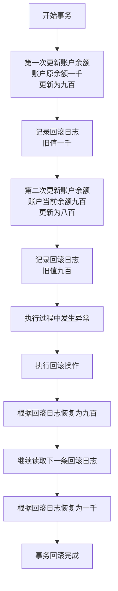
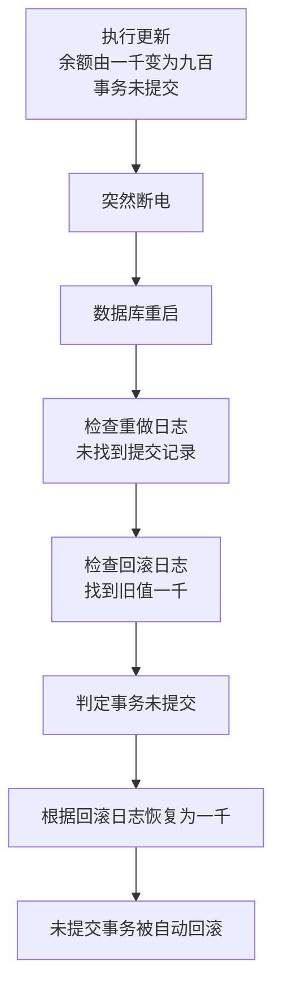
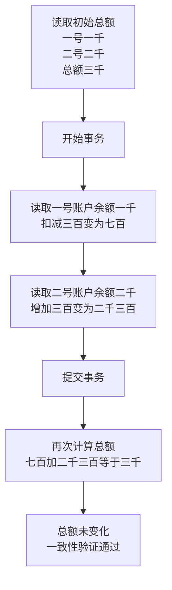

# MySQL 事务完整学习笔记

> **作者**: hli
> **目标**: 从原理到实战，彻底吃透 MySQL InnoDB 事务机制

---

## 📋 目录

1. [事务基础概念](#1-事务基础概念)
2. [ACID 特性深度解析](#2-acid-特性深度解析)
3. [InnoDB 存储层实现](#3-innodb-存储层实现)
4. [事务隔离级别](#4-事务隔离级别)
5. [锁机制详解](#5-锁机制详解)
6. [MVCC 原理](#6-mvcc-原理)
7. [死锁与调优](#7-死锁与调优)
8. [实战案例](#8-实战案例)
9. [面试要点](#9-面试要点)

---

## 1. 事务基础概念


### 为什么要学事务？

> MySQL 每条 DML 默认都在一个隐式事务里执行。

比如你敲：

```
UPDATE account SET balance = balance - 100 WHERE id = 1;
```

> MySQL 背后暗戳戳做了：

```
BEGIN;      -- 隐式事务
write undo log
write redo log (prepare)
apply changes to buffer pool
write redo log (commit)
END;
```

你只看到了一条 SQL
 **但 MySQL 做的是“底层控制现场的全套操作”**。

你没学事务，等于眼睛蒙着在高速路上开车。


### 1.1 什么是事务？

> **事务（Transaction）** 是数据库的原子执行单元，它确保操作序列在失败时可完全撤销，在成功时永久生效，从而维护数据一致性。

对于MySQL而言：

事务(Transaction)

1. 是数据库中一组必须作为整体执行的操作序列，
2. 这些操作要么**全部提交成功(commit)**,
3. 要么在**出现异常时全部回滚(rollback)**。
4. **事务保证数据在并发环境下保持一致性**。


```sql
-- 经典转账示例
START TRANSACTION;

UPDATE account SET balance = balance - 100 WHERE id = 1; -- 张三扣款
UPDATE account SET balance = balance + 100 WHERE id = 2; -- 李四收款

COMMIT; -- 提交事务
-- 或 ROLLBACK; -- 回滚事务
```

### 1.2 事务的四大特性（ACID）

| 特性 | 英文 | 含义 | InnoDB 实现机制 |
|------|------|------|----------------|
| **原子性** | Atomicity | 要么全做，要么全不做 | **undo log** |
| **一致性** | Consistency | 数据库从一个一致性状态到另一个一致性状态 | **redo log + undo log + 隔离机制** |
| **隔离性** | Isolation | 多个事务并发执行时互不干扰 | **锁 + MVCC** |
| **持久性** | Durability | 事务提交后数据永久保存 | **redo log + binlog** |

---


### 1.3 实践方案

```sql
-- ==========================================
-- MySQL 事务原理验证实验手册
-- ==========================================

-- 【准备工作】创建数据库和表
CREATE DATABASE IF NOT EXISTS transaction_study CHARACTER SET utf8mb4;
USE transaction_study;

DROP TABLE IF EXISTS account;
CREATE TABLE account (
    id INT PRIMARY KEY AUTO_INCREMENT,
    name VARCHAR(20) NOT NULL,
    balance DECIMAL(10,2) NOT NULL
) ENGINE=InnoDB;

INSERT INTO account (name, balance) VALUES
('张三', 1000.00),
('李四', 1000.00);

SELECT * FROM account;  -- 查看初始数据


-- ==========================================
-- 实验1：验证【原子性 Atomicity】
-- ==========================================
-- 【目的】证明事务要么全成功，要么全失败，不会出现中间状态

-- 【操作步骤】
START TRANSACTION;
UPDATE account SET balance = balance - 500 WHERE name = '张三';  -- 张三减500
UPDATE account SET balance = balance + 500 WHERE name = '李四';  -- 李四加500
-- 现在故意不提交，而是回滚
ROLLBACK;

-- 【查看结果】
SELECT * FROM account;

-- 【预期现象】张三和李四的余额都还是1000，没有任何变化
-- 【原理解释】ROLLBACK触发了undo log回滚，所有修改都被撤销


-- ==========================================
-- 实验2：验证【一致性 Consistency】
-- ==========================================
-- 【目的】证明事务前后，数据的完整性约束得到保持（如总金额守恒）

-- 【操作步骤】
-- 先查看总金额
SELECT SUM(balance) AS total FROM account;  -- 应该是2000

START TRANSACTION;
UPDATE account SET balance = balance - 300 WHERE name = '张三';
UPDATE account SET balance = balance + 300 WHERE name = '李四';
COMMIT;

-- 【查看结果】
SELECT SUM(balance) AS total FROM account;  -- 依然是2000
SELECT * FROM account;

-- 【预期现象】转账前后总金额不变，保持2000元
-- 【原理解释】一致性是ACID的综合体现，保证业务规则不被破坏


-- ==========================================
-- 实验3：验证【持久性 Durability】
-- ==========================================
-- 【目的】证明事务一旦提交，数据永久保存，即使数据库崩溃也不丢失

-- 【操作步骤】
START TRANSACTION;
UPDATE account SET balance = 1500 WHERE name = '张三';
COMMIT;  -- 提交后立即重启MySQL服务

-- 【查看结果】重启MySQL后执行
SELECT * FROM account WHERE name = '张三';

-- 【预期现象】张三的余额是1500，修改被永久保存
-- 【原理解释】COMMIT时数据写入redo log并刷盘，即使崩溃也能恢复


-- ==========================================
-- 实验4：验证【脏读】(READ UNCOMMITTED)
-- ==========================================
-- 【目的】证明在最低隔离级别下，可以读到未提交的数据

-- 【会话1 - 窗口1执行】
SET SESSION TRANSACTION ISOLATION LEVEL READ UNCOMMITTED;
START TRANSACTION;
UPDATE account SET balance = 9999 WHERE name = '张三';
-- 注意：不要提交，保持事务开启

-- 【会话2 - 窗口2执行】
SET SESSION TRANSACTION ISOLATION LEVEL READ UNCOMMITTED;
SELECT * FROM account WHERE name = '张三';

-- 【预期现象】会话2能看到9999（脏读）
-- 【原理解释】READ UNCOMMITTED不加任何锁，直接读取当前最新值

-- 【会话1继续】
ROLLBACK;  -- 回滚后，会话2之前读到的9999就是"脏数据"


-- ==========================================
-- 实验5：验证【不可重复读】(READ COMMITTED)
-- ==========================================
-- 【目的】证明在读已提交级别，同一事务内多次读取可能得到不同结果

-- 【会话1 - 窗口1执行】
SET SESSION TRANSACTION ISOLATION LEVEL READ COMMITTED;
START TRANSACTION;
SELECT balance FROM account WHERE name = '李四';  -- 第一次读，记住这个值

-- 【会话2 - 窗口2执行】
UPDATE account SET balance = balance + 500 WHERE name = '李四';
COMMIT;

-- 【会话1继续】
SELECT balance FROM account WHERE name = '李四';  -- 第二次读
COMMIT;

-- 【预期现象】两次读取的值不同，第二次读到了会话2提交的新值
-- 【原理解释】READ COMMITTED每次读取都是最新提交的版本


-- ==========================================
-- 实验6：验证【MVCC - 可重复读】(REPEATABLE READ)
-- ==========================================
-- 【目的】证明在可重复读级别，同一事务内多次读取结果一致（快照读）

-- 【会话1 - 窗口1执行】
SET SESSION TRANSACTION ISOLATION LEVEL REPEATABLE READ;
START TRANSACTION;
SELECT balance FROM account WHERE name = '张三';  -- 第一次读，假设是1500

-- 【会话2 - 窗口2执行】
UPDATE account SET balance = balance - 200 WHERE name = '张三';
COMMIT;

-- 【会话1继续】
SELECT balance FROM account WHERE name = '张三';  -- 第二次读，依然是1500！
COMMIT;

-- 【预期现象】两次读取的值相同，看不到会话2的修改
-- 【原理解释】MVCC通过undo log保存快照版本，事务开始时生成ReadView


-- ==========================================
-- 实验7：验证【幻读】(REPEATABLE READ + 范围查询)
-- ==========================================
-- 【目的】证明可重复读级别在某些场景下依然会出现幻读

-- 【会话1 - 窗口1执行】
SET SESSION TRANSACTION ISOLATION LEVEL REPEATABLE READ;
START TRANSACTION;
SELECT * FROM account WHERE balance > 500;  -- 第一次范围查询

-- 【会话2 - 窗口2执行】
INSERT INTO account (name, balance) VALUES ('王五', 2000);
COMMIT;

-- 【会话1继续】
SELECT * FROM account WHERE balance > 500;  -- 第二次范围查询
-- 如果没有间隙锁，可能看到王五（幻读）

-- 【预期现象】InnoDB通过间隙锁(Gap Lock)避免了幻读
-- 【原理解释】Next-Key Lock = 行锁 + 间隙锁，锁定范围防止插入


-- ==========================================
-- 实验8：验证【行锁 - FOR UPDATE】
-- ==========================================
-- 【目的】证明SELECT FOR UPDATE会对行加排他锁

-- 【会话1 - 窗口1执行】
START TRANSACTION;
SELECT * FROM account WHERE name = '张三' FOR UPDATE;  -- 锁住张三这一行
-- 不要提交，保持锁

-- 【会话2 - 窗口2执行】
UPDATE account SET balance = balance + 100 WHERE name = '张三';  -- 尝试修改

-- 【预期现象】会话2被阻塞，等待会话1释放锁
-- 【原理解释】FOR UPDATE加X锁，其他事务无法修改该行

-- 【会话1继续】
COMMIT;  -- 会话2立即执行成功


-- ==========================================
-- 实验9：验证【死锁检测】
-- ==========================================
-- 【目的】证明InnoDB能自动检测死锁并回滚其中一个事务

-- 【会话1 - 窗口1执行】
START TRANSACTION;
UPDATE account SET balance = balance + 10 WHERE name = '张三';  -- 锁住张三

-- 【会话2 - 窗口2执行】
START TRANSACTION;
UPDATE account SET balance = balance + 10 WHERE name = '李四';  -- 锁住李四

-- 【会话1继续】
UPDATE account SET balance = balance + 10 WHERE name = '李四';  -- 等待会话2的锁

-- 【会话2继续】
UPDATE account SET balance = balance + 10 WHERE name = '张三';  -- 等待会话1的锁

-- 【预期现象】其中一个会话报错 "Deadlock found when trying to get lock"
-- 【原理解释】InnoDB检测到循环等待，自动回滚一个事务打破死锁


-- ==========================================
-- 实验10：验证【当前读 vs 快照读】
-- ==========================================
-- 【目的】证明FOR UPDATE是当前读，会读到最新提交的数据

-- 【会话1 - 窗口1执行】
SET SESSION TRANSACTION ISOLATION LEVEL REPEATABLE READ;
START TRANSACTION;
SELECT balance FROM account WHERE name = '张三';  -- 快照读

-- 【会话2 - 窗口2执行】
UPDATE account SET balance = 3000 WHERE name = '张三';
COMMIT;

-- 【会话1继续】
SELECT balance FROM account WHERE name = '张三';  -- 快照读，旧值
SELECT balance FROM account WHERE name = '张三' FOR UPDATE;  -- 当前读，新值3000！
COMMIT;

-- 【预期现象】普通SELECT读旧版本，FOR UPDATE读最新版本
-- 【原理解释】当前读会加锁并读取最新提交的记录


-- ==========================================
-- 【实验总结】
-- ==========================================
-- ✅ 原子性：通过 undo log 实现回滚
-- ✅ 一致性：业务规则在事务前后保持不变
-- ✅ 隔离性：通过锁和MVCC实现不同隔离级别
-- ✅ 持久性：通过 redo log 保证崩溃恢复
-- ✅ MVCC：通过ReadView + undo log实现快照读
-- ✅ 锁机制：行锁(FOR UPDATE)、间隙锁(防幻读)、死锁检测
```


## 环境准备


### ACID环境

> 创建实验所需库`tx_lab`以及表`account`

```sql
mysql> show databases;
+--------------------+
| Database           |
+--------------------+
| information_schema |
| mysql              |
| performance_schema |
| sys                |
| test_sql_flow      |
| wordpress          |
+--------------------+
6 rows in set (0.03 sec)
```


##### 创建`transaction_study`库

```sql
mysql> CREATE DATABASE IF NOT EXISTS transaction_study CHARACTER SET utf8mb4 COLLATE utf8mb4_general_ci;
Query OK, 1 row affected (0.05 sec)
```


##### 创建`account`表

```sql
mysql> USE transaction_study;
Database changed
mysql> -- 建立事务测试表（建议完整版本）
mysql> DROP TABLE IF EXISTS account;
Query OK, 0 rows affected, 1 warning (0.03 sec)

mysql> CREATE TABLE account (
    ->     id INT PRIMARY KEY AUTO_INCREMENT COMMENT '主键',
    ->     name VARCHAR(20) NOT NULL COMMENT '账户名称',
    ->     balance DECIMAL(10,2) NOT NULL COMMENT '账户余额',
    ->     version INT NOT NULL DEFAULT 0 COMMENT 'MVCC版本号',
    ->     update_time TIMESTAMP DEFAULT CURRENT_TIMESTAMP ON UPDATE CURRENT_TIMESTAMP COMMENT '更新时间'
    -> ) ENGINE=InnoDB DEFAULT CHARSET=utf8mb4 COMMENT='事务与MVCC实验表';
Query OK, 0 rows affected (0.07 sec)
```


```sql
mysql> -- 初始化测试数据
mysql> INSERT INTO account (name, balance) VALUES
    -> ('A', 1000.00),
    -> ('B', 1000.00),
    -> ('C', 1000.00);
Query OK, 3 rows affected (0.04 sec)
Records: 3  Duplicates: 0  Warnings: 0
```


#### 验证事务参数


##### innodb_flush_log_at_trx_commit(事务刷盘频次)


###### 指标说明

| 值   | 刷盘策略                                    | 崩溃风险               | 性能       |
| ---- | ------------------------------------------- | ---------------------- | ---------- |
| `0`  | 每秒写一次 redo log，不一定在提交时落盘     | 可能丢失最近 1 秒事务  | 🚀 最高     |
| `1`  | 每次 `COMMIT` 都立刻刷盘                    | 不丢数据（最安全）     | 🐢 最慢     |
| `2`  | 每次 `COMMIT` 写 OS 缓冲区，每秒 fsync 一次 | 可能丢 OS 缓冲区的事务 | ⚖️ 折中方案 |

> ✅ **生产环境一般设置为 `1`**（保证崩溃后数据不丢）
>  ⚙️ **开发环境可以用 `2`**，兼顾性能。

查看：

```sql
SHOW VARIABLES LIKE 'innodb_flush_log_at_trx_commit';
```

修改：

```sql
[mysqld]
innodb_flush_log_at_trx_commit=1
```


###### 查看语句

```sql
mysql> SHOW VARIABLES LIKE 'innodb_flush_log_at_trx_commit';
```

>返回1表示每个事务的执行都刷盘(最慢，但最安全)

```sql
+--------------------------------+-------+
| Variable_name                  | Value |
+--------------------------------+-------+
| innodb_flush_log_at_trx_commit | 1     |
+--------------------------------+-------+
1 row in set (0.02 sec)
```


##### transaction_isolation(控制事务隔离级别)


###### 🎯 **控制事务隔离级别（影响“隔离性”）**

| 值                 | 中文说明         | 特性                       | 可见性特点           |
| ------------------ | ---------------- | -------------------------- | -------------------- |
| `READ-UNCOMMITTED` | 读未提交         | 有脏读                     | 读到未提交事务       |
| `READ-COMMITTED`   | 读已提交         | 无脏读，有不可重复读       | 每次查询重新生成快照 |
| `REPEATABLE-READ`  | 可重复读（默认） | 无脏读无不可重复读，有幻读 | 同事务快照一致       |
| `SERIALIZABLE`     | 串行化           | 完全隔离                   | 加锁执行，性能最低   |

set global transaction isolation level repeatable read;

###### 查看

```sql
SHOW VARIABLES LIKE 'transaction_isolation';
```


```sql
mysql> SHOW VARIABLES LIKE 'transaction_isolation';


+-----------------------+-----------------+
| Variable_name         | Value           |
+-----------------------+-----------------+
| transaction_isolation | REPEATABLE-READ |
+-----------------------+-----------------+
1 row in set (0.00 sec)
```

注意：这是默认事务隔离级别：REPEATABLE-READ：可重复读（默认）


###### 修改

```sql
SET GLOBAL TRANSACTION ISOLATION LEVEL REPEATABLE READ;
```


###### 实际验证

>-- ✅ 1️⃣ 错误示例（带连字符的语法是错的）

```sql
-- MySQL 不接受中间的 “-”，正确写法要用空格分隔。
set global transaction isolation level read-uncommitted;
-- ❌ ERROR 1064 (42000)
```


>-- ✅ 2️⃣ 正确写法（用空格分隔）

```sql
-- 设置全局（GLOBAL）默认事务隔离级别为 “读未提交”
-- 该设置只对 **新连接** 生效，对当前会话不影响。
set global transaction isolation level read uncommitted;
-- Query OK, 0 rows affected (0.00 sec)
```

该设置只对 **新连接** 生效，对当前会话不影响。


>-- ✅ 3️⃣ 查看当前会话的事务隔离级别（SESSION）

```sql
-- 仍然是默认值 REPEATABLE-READ（可重复读）
-- 因为 GLOBAL 修改不会影响已经存在的连接
SHOW VARIABLES LIKE 'transaction_isolation';
-- +-----------------------+-----------------+
-- | Variable_name         | Value           |
-- +-----------------------+-----------------+
-- | transaction_isolation | REPEATABLE-READ |
-- +-----------------------+-----------------+
```

-- 仍然是默认值 REPEATABLE-READ（可重复读）
-- 因为 GLOBAL 修改不会影响已经存在的连接


>-- ✅ 4️⃣ 查看全局事务隔离级别（GLOBAL）

```sql
-- ✅ 4️⃣ 查看全局事务隔离级别（GLOBAL）
-- 已成功变为 READ-UNCOMMITTED
SHOW GLOBAL VARIABLES LIKE 'transaction_isolation';
-- +-----------------------+------------------+
-- | Variable_name         | Value            |
-- +-----------------------+------------------+
-- | transaction_isolation | READ-UNCOMMITTED |
-- +-----------------------+------------------+
```

已成功变为 READ-UNCOMMITTED


>-- ✅ 5️⃣ 修改当前会话隔离级别为 READ UNCOMMITTED

```sql
-- 使用 SESSION 级别设置可立即生效，无需重连。
SET SESSION TRANSACTION ISOLATION LEVEL READ UNCOMMITTED;
-- Query OK, 0 rows affected (0.00 sec)
```

使用 SESSION 级别设置可立即生效，无需重连


>-- ✅ 6️⃣ 验证当前会话隔离级别已生效

```sql
-- ✅ 6️⃣ 验证当前会话隔离级别已生效
SHOW VARIABLES LIKE 'transaction_isolation';
-- +-----------------------+------------------+
-- | Variable_name         | Value            |
-- +-----------------------+------------------+
-- | transaction_isolation | READ-UNCOMMITTED |
-- +-----------------------+------------------+
```


>-- ✅ 7️⃣ 验证全局仍保持 READ-UNCOMMITTED

```sql
-- ✅ 7️⃣ 验证全局仍保持 READ-UNCOMMITTED
-- 当前会话的修改不会影响全局配置（隔离作用域相反）
SHOW GLOBAL VARIABLES LIKE 'transaction_isolation';
-- +-----------------------+------------------+
-- | Variable_name         | Value            |
-- +-----------------------+------------------+
-- | transaction_isolation | READ-UNCOMMITTED |
-- +-----------------------+------------------+
```


>记得设置回来默认的可重复读

```sql
mysql> set global transaction isolation level repeatable read;


Query OK, 0 rows affected (0.00 sec)

mysql> SHOW GLOBAL VARIABLES LIKE 'transaction_isolation';
+-----------------------+-----------------+
| Variable_name         | Value           |
+-----------------------+-----------------+
| transaction_isolation | REPEATABLE-READ |
+-----------------------+-----------------+
1 row in set (0.00 sec)
```


###### 答疑

💬 面试标准答法

> **Q1：如果设置了当前会话的隔离级别为 READ UNCOMMITTED（读未提交），重启 MySQL 后还会生效吗？**

**A：不会。**
 `SET SESSION TRANSACTION ISOLATION LEVEL ...` 只在**当前会话**有效。

- 断开连接（退出 MySQL）后，该设置立即失效；
- 重启 MySQL 也不会保留此值；
- 下次连接时会自动继承全局（`GLOBAL`）的默认隔离级别。

------

> **Q2：如果设置了全局隔离级别为 READ UNCOMMITTED，重启 MySQL 或重新登录后会怎样？**

**A：会生效。**
 `SET GLOBAL TRANSACTION ISOLATION LEVEL ...` 修改的是**全局默认值**，
 影响所有**新建连接**。

- 无需重启 MySQL；
- 只要重新登录或新建连接，就会自动应用新的全局隔离级别；
- 已经存在的连接仍保持原来的 session 值（不会被强制改变）。


###### 生效范围

🧩 一、隔离级别的继承规则

> **每次新建连接（登录 MySQL）时，当前会话（SESSION）会自动继承全局（GLOBAL）的隔离级别。**

也就是说：

- 你现在执行的

  ```sql
  SET GLOBAL TRANSACTION ISOLATION LEVEL REPEATABLE READ;
  ```

  已经把全局配置改回默认值 `REPEATABLE-READ`。

- 之后当你退出当前连接、重新登录时：
   系统会自动将新 session 的隔离级别设置为这个全局默认值。

------


✅ 二、验证方式（推荐你重新登录后执行）

```sql
-- 验证当前会话隔离级别
SHOW VARIABLES LIKE 'transaction_isolation';
```

结果应该是：

```sql
| transaction_isolation | REPEATABLE-READ |
```

同时：

```sql
SHOW GLOBAL VARIABLES LIKE 'transaction_isolation';
```

也会是：

```sql
| transaction_isolation | REPEATABLE-READ |
```

说明两者一致，新连接已经同步使用全局设置。


三、总结记忆口诀

> **GLOBAL 改未来，SESSION 改现在。**
>  **新连继承全局，老连保留当前。**


## 2. ACID(原子性/一致性/隔离性/持久性)


### 2.1 原子性（Atomicity）

#### 核心原理

> **undo log（回滚日志）** 记录每次修改前的旧值，当事务回滚时，通过 undo log 恢复数据。

原子性指的是：

- 一个事务中的所有操作必须被当作一个不可再分的整体，
- **要么全部成功提交，**
- **要么全部失败回滚，**
- **任何一步失败都不能留下部分写入。**


#### 原理图



#### 验证代码

```java
    /**
     * 方法说明 / Method Description:
     * 中文：原子性（Atomicity）验证：事务内异常触发整体回滚，任何部分写入都不会生效。
     * English: Atomicity verification: exception in transaction triggers full rollback; no partial writes persist.
     * <p>
     * 参数 / Parameters: 无
     * 返回值 / Return: 无
     * 异常 / Exceptions: SQL 执行异常或断言失败会使测试失败
     */
    @Test
    @DisplayName("ACID-Atomicity: rollback on exception leaves no partial writes")
    void atomicityRollbackOnFailure() throws Exception {
        try (Connection conn = dataSource.getConnection()) {
            // 中文：关闭自动提交以手动控制事务
            // English: Disable auto-commit to manually control transaction
            conn.setAutoCommit(false);

            // 中文：先执行第一步扣减
            // English: Perform first deduction
            //为什么 update 执行了但“看不到”？事务未提交 → 修改只在 当前连接 的事务上下文可见。
            updateBalance(conn, 1L, new BigDecimal("900.00"));

            // 中文：模拟异常（例如违反约束或主动抛出）
            // English: Simulate exception (constraint violation or manual throw)
            assertThatThrownBy(() -> updateBalance(conn, 2L, null)).isInstanceOf(Exception.class);

            // 中文：异常后回滚事务，保证两个更新都不生效
            // English: Roll back ensuring none of updates persist
            conn.rollback();

            // 中文：验证两条记录保持初始值
            // English: Verify both rows keep initial values
            assertThat(readBalance(conn, 1L)).isEqualByComparingTo("1000.00");
            assertThat(readBalance(conn, 2L)).isEqualByComparingTo("2000.00");
            log.info("实验成功：原子性验证通过；事务异常已整体回滚，未产生部分写入 / Success: Atomicity confirmed; transaction rolled back on error, no partial writes");
        }
    }
```

#### 手动验证

```sql
-- 会话1
START TRANSACTION;
UPDATE account SET balance = 500 WHERE id = 1;
ROLLBACK; -- 手动回滚

-- 会话2：验证数据未改变
SELECT balance FROM account WHERE id = 1; -- 仍然是原值
```

#### 关键参数

```ini
# my.cnf
innodb_undo_tablespaces = 2    # undo log 表空间数量
innodb_max_undo_log_size = 1G  # 单个 undo log 文件最大大小
```

---


#### 问答


##### MySQL怎么保证事务的原子性？


###### 背诵版

未提交 → Undo 回滚
 已提交 → Redo 重做
 正在提交 → 两阶段提交确保不会一半成功一半失败


###### redo.log + undo.log

InnoDB 

1. 通过 Undo Log 支持回滚、
2. Redo Log 支持崩溃恢复、两阶段提交防止提交中断三者共同作用，

实现事务的原子性，从而保证事务要么完全成功，要么完全失败。


##### 如果事务在执行了 update（事务未提交）时突然断电，这次更新是否会生效？




######  通俗易懂版本（你最需要记住的）

- 你更新了余额为 900
- 但还没 commit
- 就断电了
- MySQL 重启后：
   → 看 redo log：没有 commit 记录
   → 看 undo log：有旧值 1000
   → 因为事务未提交，所以用 undo log 把 900 恢复到 1000

最终结果：

**这条 update 完全没生效，像从未执行过一样。**


> 在 update 执行之后、commit 之前断电——这笔修改根本不会生效，也不会被持久化

在执行

```sql
conn.setAutoCommit(false);
updateBalance(conn, 1L, new BigDecimal("900.00"));
```

后断电


>此时状态是：

| 项目        | 状态                                |
| ----------- | ----------------------------------- |
| redo log    | 未写入（因为还没进入 prepare 阶段） |
| undo log    | 已写入（记录旧值 1000.00）          |
| buffer pool | 已修改为 900.00（脏页）             |
| 提交？      | ❌ 没有 commit                       |
| 事务状态    | 活跃事务（active trx）              |


只要没有 commit，就意味着：

> **这笔事务是“未提交事务”，重启后必须回滚。**


这是原子性的本质要求：

> **未提交 = 不允许留下任何痕迹。**


##### 断电重启后 InnoDB 会如何处理未提交事务，undo log 与 crash recovery 的行为是什么？

> InnoDB crash recovery 的流程如下：

###### ① 加载 redo log

发现这条 update 没有进入 prepare 阶段
 → redo log 里找不到相关事务

说明：

**这个事务从未“准备提交”。**


###### ② 清理 undo log

重启后恢复：

- 把 page 恢复为旧值（1000.00）
- undo 日志被视为未提交事务 → 被丢弃

###### ③ 事务回滚

这个“回滚”不是你手动 rollback
 而是 **Innodb 崩溃恢复自动回滚（auto rollback）**


### 2.2 隔离性（Isolation）

>在 InnoDB 的可重复读（RR）下，事务会基于 MVCC 创建一个只属于自己的快照视图，这个视图在整个事务生命周期中保持稳定，不随着其他事务的提交而变化。
> 对当前事务来说，“正确的数据”是其快照中的一致版本，而不是数据库中的最新版本。
> 这确保了并发场景下读取的稳定性和逻辑一致性。

每个事务都像在一个独立、静止的数据世界里执行自己的逻辑。即使真实世界在疯狂变化，你的世界依然稳定可靠。


#### 核心原理

> 通过 **锁机制 + MVCC（多版本并发控制）** 实现事务之间的隔离。

隔离性指的是：

​	多个并发事务之间相互隔离、彼此的中间状态不可见、使每个事务都像独立执行一样，**避免并发读写导致数据错误**。


>一句话通俗解释

隔离性让"别人没提交的数据，你看不到"，"别人提交的时机，也取决于隔离级别"。


#### 四种隔离级别

| 隔离级别     | 脏读 | 不可重复读 | 幻读       | 实现方式               |
| ------------ | ---- | ---------- | ---------- | ---------------------- |
| RU 读未提交  | ✔    | ✔          | ✔          | 不隔离                 |
| RC 读已提交  | ✘    | ✔          | ✔          | MVCC 每次新快照        |
| RR 可重复读  | ✘    | ✘          | ✘（MySQL） | MVCC 固定快照 + 间隙锁 |
| Serializable | ✘    | ✘          | ✘          | 强制排队执行           |

- RU：最弱，不隔离
- RC：解决脏读，但不可重复读、幻读仍可能
- RR：MySQL最强性价比 → 解决绝大部分问题
- Serializable：最严格但并发能力爆炸下降


#### 验证代码

```java
    /**
     * 方法说明 / Method Description:
     * 中文：
     * 单方法验证 MySQL 四种事务隔离级别（RU、RC、RR、SERIALIZABLE）的实际隔离行为，
     * 依次测试“是否能读取到其他事务未提交的数据”“是否出现不可重复读”“是否出现幻读趋势”等关键并发现象。
     * <p>
     * English:
     * Single-method verification of all four MySQL isolation levels (RU, RC, RR, SERIALIZABLE),
     * validating visibility of uncommitted writes, non-repeatable reads, and phantom tendencies.
     * <p>
     * 实验目的 / Experiment Goal:
     * 中文：验证不同隔离级别对数据可见性的影响，理解脏读、不可重复读、幻读是否会发生。
     * English: Verify how each isolation level affects data visibility and concurrent anomalies.
     * <p>
     * 预期结论 / Expected Result:
     * RU：能读到未提交数据（脏读）
     * RC：不能读未提交数据，但会出现不可重复读
     * RR：不能脏读，不可重复读被解决，但可能出现幻读趋势
     * SERIALIZABLE：所有读写严格串行化，不会发生任意并发问题
     */
    @Test
    @DisplayName("Isolation-AllLevels: RU / RC / RR / SERIALIZABLE 全面隔离性验证")
    void isolationAllLevelsTest() throws Exception {

        // 准备两个会话（两个独立连接）
        try (Connection sessionA = dataSource.getConnection();
             Connection sessionB = dataSource.getConnection()) {

            sessionA.setAutoCommit(false);
            sessionB.setAutoCommit(false);

            //------------------------------------------------------------
            // 实验一：读未提交（RU）
            // 实现思路：sessionA读取sessionB未提交的add(50.00)，它看到了1050.00
            //------------------------------------------------------------
            log.info("【RU实验开始】读未提交验证 — 理论上允许脏读 / Start RU Isolation Test");

            sessionA.createStatement().execute("SET SESSION transaction_isolation = 'READ-UNCOMMITTED'");
            sessionB.createStatement().execute("SET SESSION transaction_isolation = 'READ-UNCOMMITTED'");

            BigDecimal initRU = readBalance(sessionB, 1L);
            updateBalance(sessionB, 1L, initRU.add(new BigDecimal("50.00")));  // 未提交

            BigDecimal aReadRU = readBalance(sessionA, 1L); // A 立即读取
            assertThat(aReadRU).isEqualByComparingTo(initRU.add(new BigDecimal("50.00")));

            log.info("RU验证成功：会话A读到了未提交的数据（脏读） / RU Success: dirty read occurred");

            sessionB.rollback();  // 恢复
            sessionA.rollback();


            //------------------------------------------------------------
            // 实验二：读已提交（RC）
            // 实现思路：
            // 阶段一：sessionA读取到sessionB未提交事务前的原始值1000.00
            // 阶段二：sessionA读取sessionB已提交事务的add(60.00)，它看到了1060.00
            // 不可重复读成立！
            //------------------------------------------------------------
            log.info("【RC实验开始】读已提交验证 — 杜绝脏读 / Start RC Isolation Test");

            sessionA.createStatement().execute("SET SESSION transaction_isolation = 'READ-COMMITTED'");
            sessionB.createStatement().execute("SET SESSION transaction_isolation = 'READ-COMMITTED'");

            BigDecimal initRC = readBalance(sessionB, 1L);
            updateBalance(sessionB, 1L, initRC.add(new BigDecimal("60.00"))); // 未提交

            // RC 不应看到未提交数据
            BigDecimal aReadBeforeCommitRC = readBalance(sessionA, 1L);
            assertThat(aReadBeforeCommitRC).isEqualByComparingTo(initRC);

            log.info("RC验证阶段1：会话A未看到会话B未提交数据（正确） / RC Stage1: uncommitted data invisible");

            sessionB.commit(); // 提交 B

            BigDecimal aReadAfterCommitRC = readBalance(sessionA, 1L);
            assertThat(aReadAfterCommitRC).isEqualByComparingTo(initRC.add(new BigDecimal("60.00")));

            log.info("RC验证阶段2：提交后会话A看到新值 → 不可重复读成立 / RC Stage2: non-repeatable read observed");

            sessionA.rollback();


            //------------------------------------------------------------
            // 实验三：可重复读（RR）
            // 目的：验证在 InnoDB 的 REPEATABLE-READ 隔离级别下，
            //       同一事务内多次读取同一行数据，始终看到同一个“快照版本”。
            // 原理：RR 下首次 SELECT 会创建一致性快照（ReadView）。
            //       后续读取不再刷新视图，即使其他事务提交了更新，也不可见。
            // 验证点：会话 A 在事务期间两次读取同一行 → 结果一致 → 无不可重复读。
            //------------------------------------------------------------
            log.info("【RR实验开始】可重复读验证 — 快照一致 / Start RR Isolation Test");
            sessionA.createStatement().execute("SET SESSION transaction_isolation = 'REPEATABLE-READ'");
            sessionB.createStatement().execute("SET SESSION transaction_isolation = 'REPEATABLE-READ'");

            BigDecimal initRR = readBalance(sessionA, 1L);  // A 第一次读，生成快照

            updateBalance(sessionB, 1L, initRR.add(new BigDecimal("70.00"))); // B 修改
            sessionB.commit(); // 提交 B

            // RR：A 再读，依旧应看到旧快照
            BigDecimal aReadRR = readBalance(sessionA, 1L);
            assertThat(aReadRR).isEqualByComparingTo(initRR);

            log.info("RR验证成功：会话A两次读取一致，没有不可重复读（正确） / RR Success: no non-repeatable read");

            sessionA.commit();

            //------------------------------------------------------------
            // 实验四：可串行化（SERIALIZABLE）
            //------------------------------------------------------------
            log.info("【SERIALIZABLE实验开始】最高隔离级别验证 / Start Serializable Isolation Test");

            try (Connection sessionC = dataSource.getConnection();
                 Connection sessionD = dataSource.getConnection()) {

                sessionC.setAutoCommit(false);
                sessionD.setAutoCommit(false);
                //设置锁等待超时为1S
                sessionC.createStatement().execute("SET SESSION innodb_lock_wait_timeout = 1");
                sessionD.createStatement().execute("SET SESSION innodb_lock_wait_timeout = 1");

                sessionC.createStatement().execute("SET SESSION transaction_isolation = 'SERIALIZABLE'");
                sessionD.createStatement().execute("SET SESSION transaction_isolation = 'SERIALIZABLE'");

                // ===========================
                // 1. 会话C进行 SELECT（加锁）
                // ===========================
                BigDecimal initValue = readBalance(sessionC, 1L);
                log.info("Serializable: 会话C读取并加共享锁 / SessionC SELECT(lock)");

                // ===========================
                // 2. 会话D尝试更新，会被阻塞
                // ===========================
                boolean blocked = false;
                try {
                    updateBalance(sessionD, 1L, initValue.add(new BigDecimal("100.00")));
                } catch (Exception e) {
                    blocked = true; // 这个异常是因为死锁或锁等待超时而被抛出
                }

                assertThat(blocked).isTrue();
                log.info("Serializable: 会话D写入被阻塞（正确） / SessionD update blocked");

                // ===========================
                // 3. 会话C提交 → 解锁
                // ===========================
                sessionC.commit();
                log.info("Serializable: 会话C提交并释放锁 / SessionC commit(unlock)");

                // ===========================
                // 4. 因为 D 已经失败（阻塞+抛异常），必须 rollback D
                // ===========================
                sessionD.rollback();
                log.info("Serializable: 会话D回滚 / SessionD rollback");

            } catch (SQLException e) {
                log.error("Serializable Test Error", e);
                throw e;
            }
        }
    }
```


##### 执行解析

###### 1. **【RU实验开始】读未提交验证**

- `RU验证成功：会话A读到了未提交的数据（脏读）`
- **解释**：事务A成功读取到了事务B未提交的数据，验证了脏读（这是RU的特点）。


###### 2. **【RC实验开始】读已提交验证**

- `RC验证阶段1：会话A未看到会话B未提交数据（正确）`
- **解释**：会话A不能看到事务B未提交的数据，符合 **RC** 隔离级别的要求。
- `RC验证阶段2：提交后会话A看到新值 → 不可重复读成立`
- **解释**：当事务B提交后，会话A能看到更新后的数据，证明了不可重复读（non-repeatable read）现象。


###### 3. **【RR实验开始】可重复读验证**

- `RR验证成功：会话A两次读取一致，没有不可重复读（正确）`
- **解释**：会话A在 **RR** 隔离级别下，第一次和第二次读取的值一致，验证了快照一致性。


###### 4. **【SERIALIZABLE实验开始】最高隔离级别验证**

- `Serializable: 会话C读取并加共享锁 / SessionC SELECT(lock)`
  - **解释**：会话C 读取数据并加锁，进行共享锁（S锁）操作。
- `Serializable: 会话D写入被阻塞（正确） / SessionD update blocked`
  - **解释**：会话D尝试更新时，由于事务A的读操作锁定了数据，D 被阻塞，符合串行化的特性。
- `Serializable: 会话C提交并释放锁 / SessionC commit(unlock)`
  - **解释**：会话C 提交事务并释放锁，其他事务（如D）可以继续执行。
- `Serializable: 会话D回滚 / SessionD rollback`
  - **解释**：由于会话D尝试更新时被阻塞并抛出异常，因此进行回滚操作。

------


###### 🔥 **总结**

- **Serializable 测试的行为**：符合预期，事务D在会话C提交之前被阻塞，成功验证了**串行化**事务隔离级别下的**严格串行执行**行为。
- **超时问题**：从日志来看，所有事务的锁等待时间合理，没有出现卡死现象，表明你设置的 **`innodb_lock_wait_timeout`** 在处理 **Serializable** 测试时有效，避免了长时间的死锁或阻塞。
- **日志输出**：每个实验的行为都明确且无遗漏，结果清晰，适合面试展示。


#### 问答


##### 事务B同时读取事务A提交事务前和事务后都是一样的值数据不就错了吗？

- 假设事务A没有提交add(100)之前是1000，那么事务B此时去读取到了，事务A此时是1000生成了快照，
- 这个时候事务A已经提交了add(100)变成了1100，事务B还是去读取了旧的快照是1000，那么数据不就错了？


###### 为什么数据不算错？

1. **数据一致性**：虽然事务 A 在提交后更新了数据，但事务 B 在读取时，看到的是它 **启动时的版本**。这是为了保证事务内部读取的一致性，防止出现“不可重复读”的问题。
2. **不引入脏读**：由于事务 A 在提交前一直修改的是它的 **临时快照**（A 对应的快照和事务B是不共享的），事务 B 看不到 A 其他事务的修改。这样可以有效防止**脏读**的发生。
3. **快照隔离**：可重复读下，事务 B 总是会读取到事务 A 开始时创建的快照，而 **不会被事务 A 提交后的新值影响**。这是**快照隔离**的核心，确保了数据的一致性和隔离性。
4. **多版本并发控制（MVCC）**：每个事务都有自己的独立视图。A 提交的 `1100` 只会对 **新事务** 可见，**B 事务仍然看到的是它事务开始时的版本（1000）**。这种机制避免了跨事务的干扰，也保证了并发下数据的稳定性。


###### 总结

> 在 **Repeatable Read（可重复读）** 隔离级别下，

- 事务 B **会读取到它事务开始时生成的快照**（如 `1000`），
- 即**使事务 A 已经提交了对该数据的修改（从 `1000` 到 `1100`）**。
- 这是为了确保事务内的读取一致性，避免了不可重复读的问题。
- 事务 A 提交后的修改不会影响事务 B 已经创建的快照版本。
- 通过 **MVCC（多版本并发控制）**，每个事务有自己的视图，保障了并发执行的正确性。


##### 为什么说RR（可重复读）本质就是为了保证并发读取的准确性和稳定性？


###### 1."准确性"不是读到最新，而是读到"对我来说一致的版本"

>在RR可重复读隔离级别下

对于当前事务B而言，它**从开启事务那一刻起，就绑定到了一个"专属的数据版本视图"。**

这个视图里的数据就是对它来说**"准确的"！**


> 准确的含义不是"最新"而是

"**同一个事务内，所有读取都一致、不变、不受别人提交的影响**"。

这就是数据库一致性的定义方式。


###### 2."稳定性"的含义就是快照不变

>对于事务B来说，它的快照版本就是稳定不变的

这意味着：

1. 别人更新？可以更新
2. 别人提交？可以提交
3. 别人删了再加？随便
4. 只要B不commit，它永远只看到它的那份快照


>也就是说

- **事务B的读操作不会被外界的写操作打乱节奏，也不会被"最新值"干扰。**
- **它看的始终是一致的历史视图。**


这就是"可重复读"的本质含义。


---

### 2.3 持久性（Durability）

>**持久性** 是 **ACID** 四大特性之一，它保证了在事务提交后，数据会被永久保存，即使数据库发生崩溃、断电等异常情况，已提交的事务数据也不会丢失。
> 持久性通常依赖于以下几个技术：
>
>1. **日志机制（WAL，Write-Ahead Logging）**：事务修改数据前，先写入日志，确保数据提交不会丢失。
>2. **重做日志（Redo Log）和撤销日志（Undo Log）**：通过重做日志恢复已提交的事务，撤销日志支持事务回滚。
>3. **检查点（Checkpoint）**：定期将内存中的数据页写入磁盘，减少恢复时间。

> **只要事务 commit 了，哪怕数据库马上崩溃，断电重启，已提交的数据必须恢复回来，不能丢。**


#### 简介

>持久型主要解决的问题是：

**一旦事务提交(commit)，其修改的数据必须永久保留在数据库中，不会丢失**。

**无论发生什么故障或系统崩溃，已提交的事务数据必须保证恢复**，这就是持久型的关键所在。


#### 核心原理

通过 **redo log + binlog + 两阶段提交（2PC）** 保证数据持久化。


#### 核心规则

> 数据修改**必须先写日志（redo log）**，成功后才算 commit，
> **数据页可以慢慢写回磁盘**，不着急。

为什么？

因为磁盘随机写太慢，redo 顺序写非常快。


#### 两阶段提交流程图

```
┌──────────────────────────────────────────────────┐
│            MySQL 两阶段提交（2PC）                  │
├──────────────────────────────────────────────────┤
│                                                  │
│  1. 执行SQL并更新内存                              │
│     ↓                                            │
│  2. 写 redo log (prepare 状态) ───┐              │
│     ↓                              │              │
│  3. 写 binlog                      │ 阶段1: Prepare│
│     ↓                              │              │
│  4. 调用存储引擎提交接口 ───────────┘              │
│     ↓                                            │
│  5. 写 redo log (commit 状态) ────┐              │
│     ↓                              │ 阶段2: Commit │
│  6. 事务提交完成 ──────────────────┘              │
│                                                  │
│  ✅ 如果在步骤3-4之间崩溃，重启后：                │
│     - redo log 有 prepare 标记                    │
│     - binlog 已写入                               │
│     → 自动提交事务                                 │
│                                                  │
│  ✅ 如果在步骤2-3之间崩溃，重启后：                │
│     - redo log 有 prepare 标记                    │
│     - binlog 未写入                               │
│     → 自动回滚事务                                 │
└──────────────────────────────────────────────────┘
```

#### redo log vs binlog 对比

| 维度 | redo log | binlog |
|------|----------|--------|
| **层级** | InnoDB 引擎层 | MySQL Server 层 |
| **作用** | 崩溃恢复 | 主从复制、数据备份 |
| **记录内容** | 物理日志（数据页变化） | 逻辑日志（SQL语句） |
| **写入方式** | 循环写入（固定大小） | 追加写入 |
| **刷盘时机** | innodb_flush_log_at_trx_commit | sync_binlog |

#### 刷盘策略

```ini
# my.cnf 配置

# ===== redo log 刷盘策略 =====
innodb_flush_log_at_trx_commit = 1  # 推荐金融系统
# 0 = 每秒刷一次（可能丢1秒数据）
# 1 = 每次提交都刷盘（最安全）
# 2 = 每次提交写OS缓存，每秒刷盘（折中）

# ===== binlog 刷盘策略 =====
sync_binlog = 1  # 推荐金融系统
# 0 = 不强制刷盘（依赖OS）
# 1 = 每次提交都刷binlog（最安全）
# N = 每N次事务刷一次（折中）
```

#### 验证持久性

```bash
# 1. 插入数据
mysql> INSERT INTO account (name, balance) VALUES ('持久化测试', 1000);
Query OK, 1 row affected (0.01 sec)

# 2. 强制杀掉MySQL进程（模拟宕机）
$ kill -9 $(pidof mysqld)

# 3. 重启MySQL
$ systemctl start mysql

# 4. 验证数据仍然存在
mysql> SELECT * FROM account WHERE name = '持久化测试';
+----+--------------+---------+
| id | name         | balance |
+----+--------------+---------+
|  1 | 持久化测试    | 1000.00 |
+----+--------------+---------+
✅ 数据未丢失！
```


### 2.4 一致性（Consistency）

#### 核心原理

> 一致性是通过 **原子性 + 隔离性 + 持久性** 共同保证的，同时需要应用层的业务约束。

一致性性指的是：

- 事务执行前后，
- 数据库**必须从一个合法状态转换到另一个合法状态**，
- 不能破坏业务规则与数据约束。

**不管你做什么操作，只要事务成功提交，数据必须保持正确，不允许出现违反约束的状态。**


#### 转账场景示例



#### 验证代码

```java
   /**
     * 方法说明 / Method Description:
     * 中文：一致性（Consistency）验证：跨两行的转账在提交后保持总余额守恒，出现错误时回滚保持不变量。
     * English: Consistency verification: cross-row transfer preserves total sum after commit; on error, rollback keeps invariant.
     * <p>
     * 参数 / Parameters: 无
     * 返回值 / Return: 无
     * 异常 / Exceptions: SQL 执行异常或断言失败会使测试失败
     */
    @Test
    @DisplayName("ACID-Consistency: transfer preserves sum invariant")
    void consistencySumInvariant() throws Exception {
        try (Connection conn = dataSource.getConnection()) {
            conn.setAutoCommit(false);

            // 中文：初始总额
            // English: Initial sum
            BigDecimal sum0 = readSum(conn);

            // 中文：执行从 id=1 向 id=2 转账 300
            // English: Transfer 300 from id=1 to id=2
            BigDecimal b1 = readBalance(conn, 1L);
            BigDecimal b2 = readBalance(conn, 2L);
            updateBalance(conn, 1L, b1.subtract(new BigDecimal("300.00")));
            updateBalance(conn, 2L, b2.add(new BigDecimal("300.00")));

            // 中文：提交事务
            // English: Commit transaction
            conn.commit();

            // 中文：提交后总额应保持不变
            // English: Sum invariant must hold after commit
            BigDecimal sum1 = readSum(conn);
            assertThat(sum1).isEqualByComparingTo(sum0);
            log.info("实验成功：一致性验证通过；跨行转账后总额守恒 / Success: Consistency confirmed; cross-row transfer preserved total sum");
        }
    }
```

#### 数据库约束

```sql
-- 余额非负约束
ALTER TABLE account ADD CONSTRAINT chk_balance CHECK (balance >= 0);

-- 外键约束
ALTER TABLE orders ADD CONSTRAINT fk_user 
FOREIGN KEY (user_id) REFERENCES users(id);
```

---


#### 问答


##### 怎么保证的数据一致性？

> MySQL（InnoDB）通过「约束机制」＋「原子性」＋「隔离性」＋「持久性」四类手段共同保证一致性。

一致性本身是结果：数据库始终保持合法状态，不出现违反约束的数据。


###### 1.约束(consistency的核心基础)

>一致性不是数据库自动凭空保证的，它首先依赖约束(Constraint)

- 主键唯一
- 外键约束
- 非空约束
- check
- 业务规则(比如余额不能为负)


>数据库保证

**只要你定义了规则，我就保证提交后的数据一定不违反规则**

这是最底层的“一致性基础”。


###### 2.原子性(Atomicity)——避免写一半

>通过Undo Log实现

- 事务失败——>整体回滚
- 不会留下中间状态
- 转账扣了钱、加钱失败这种情况不会发生。

如果没有原子性，就会造成本质上的数据不一致。


###### 3.隔离性(Lsolation)——避免并发篡改数据

>InnoDB通过

- MVCC(快照读)
- 行锁、间隙锁、临键锁(当前读)
- 事务隔离级别(RC、RR)

>保证：

不同事务不会读到其它事务，未提交的脏数据，也不会互相篡改导致不一致。

例如:

- 并发扣款时避免两个事务都读到旧余额
- 防止并发产生丢失更新


隔离性处理的是"并发下如何保持一致"。


###### 4.持久性(Durability)——避免"提交后丢数据"

>InnoDB通过

- redo log
- WAL写前日志
- crash recover(崩溃恢复)


>确保提交后的数据

断电也不会丢，保证提交后的状态是最终一致的。


>如果commit之后断电导致数据丢失，也会破坏一致性。


###### 5.总结

- 一致性是目标
- 原子性 + 隔离性 + 持久型 = 保证一致性的手段
- 约束 = 定义什么是"合法状态"

四者合在一起才能保证一致性。


>标准总结句

MySQL的一致性不是单一机制实现的，而是依赖

1. 约束机制定义合法状态，
2. 再由原子性保证失败不留痕、
3. 隔离性保证并发不破坏状态、
4. 持久性确保提交不丢失

四者共同保证事务前后始终处于一致的合法数据状态


---

## 3. InnoDB 存储层实现

### 3.1 三大日志系统

```
┌────────────────────────────────────────────────────┐
│           InnoDB 日志系统架构                        │
├────────────────────────────────────────────────────┤
│                                                    │
│  ┌──────────┐    ┌──────────┐    ┌──────────┐   │
│  │ undo log │    │ redo log │    │  binlog  │   │
│  │ 回滚日志  │    │ 重做日志  │    │ 二进制日志│   │
│  └────┬─────┘    └────┬─────┘    └────┬─────┘   │
│       │               │               │          │
│       ↓               ↓               ↓          │
│  保证原子性       保证持久性       主从复制        │
│  + MVCC          + 崩溃恢复       + 增量备份      │
│                                                    │
└────────────────────────────────────────────────────┘
```

### 3.2 undo log 详解

#### 作用
1. **事务回滚**：记录修改前的旧值
2. **MVCC 读取**：提供历史版本快照

#### 存储位置
```sql
-- 查看 undo log 配置
SHOW VARIABLES LIKE '%undo%';

-- 输出示例
innodb_undo_directory = ./
innodb_undo_tablespaces = 2
innodb_max_undo_log_size = 1073741824
```

#### 版本链结构

```
当前记录: id=1, name='张三', balance=800, trx_id=103, roll_ptr=0x1234

         ↓ roll_ptr 指向

undo log: id=1, name='张三', balance=900, trx_id=102, roll_ptr=0x1235

         ↓ roll_ptr 指向

undo log: id=1, name='张三', balance=1000, trx_id=101, roll_ptr=NULL

✅ 通过版本链可以回滚到任意历史版本
```

### 3.3 redo log 详解

#### 作用
保证持久性：即使数据页未刷盘，也能通过 redo log 恢复数据

#### WAL（Write-Ahead Logging）机制

```
正常流程（未优化）:
1. 修改数据 → 2. 刷脏页到磁盘（随机IO，慢）

WAL优化流程:
1. 修改数据 → 2. 写redo log（顺序IO，快）→ 3. 异步刷脏页

✅ 优点：
  - redo log 顺序写入，速度快
  - 脏页刷盘可以延迟，合并多次修改
  - 崩溃恢复时，通过redo log重放即可
```

#### redo log 文件结构

```
# 查看redo log文件
$ ls -lh /var/lib/mysql/ib_logfile*
-rw-r----- 1 mysql mysql 48M ib_logfile0
-rw-r----- 1 mysql mysql 48M ib_logfile1

# 循环写入模式
┌─────────────────────────────────────┐
│  ib_logfile0  │  ib_logfile1        │
│  ↓写入        │  ↓写入              │
│  已刷盘记录    │  未刷盘记录          │
│  (可覆盖)     │  (不可覆盖)          │
└─────────────────────────────────────┘
     ↑                  ↑
  checkpoint        write pos
```

### 3.4 binlog 详解

#### 三种格式

| 格式 | 记录内容 | 优点 | 缺点 |
|------|---------|------|------|
| **STATEMENT** | 原始SQL | 日志量小 | 某些函数无法复制（NOW()） |
| **ROW** | 每行变化 | 精确复制 | 日志量大 |
| **MIXED** | 混合模式 | 自动选择 | 复杂度高 |

```sql
-- 查看当前格式
SHOW VARIABLES LIKE 'binlog_format';

-- 修改为ROW格式（推荐）
SET GLOBAL binlog_format = 'ROW';
```

#### 查看binlog

```sql
-- 查看当前binlog文件
SHOW MASTER STATUS;
+------------------+----------+--------------+
| File             | Position | Binlog_Do_DB |
+------------------+----------+--------------+
| mysql-bin.000001 |     1234 |              |
+------------------+----------+--------------+

-- 查看binlog内容
SHOW BINLOG EVENTS IN 'mysql-bin.000001' LIMIT 10;

-- 解析binlog（推荐工具）
$ mysqlbinlog mysql-bin.000001
```

---

## 4. 事务隔离级别

### 4.1 隔离级别设置

```sql
-- 查看当前隔离级别
SELECT @@transaction_isolation;
-- 或
SHOW VARIABLES LIKE 'transaction_isolation';

-- 设置会话级别
SET SESSION TRANSACTION ISOLATION LEVEL READ COMMITTED;

-- 设置全局级别（需重启）
SET GLOBAL TRANSACTION ISOLATION LEVEL REPEATABLE READ;
```

### 4.2 隔离级别详解

#### READ UNCOMMITTED（读未提交）

```sql
-- 会话A
SET SESSION TRANSACTION ISOLATION LEVEL READ UNCOMMITTED;
START TRANSACTION;
SELECT balance FROM account WHERE id = 1; -- 读到1000

-- 会话B
START TRANSACTION;
UPDATE account SET balance = 500 WHERE id = 1;
-- 注意：未提交！

-- 会话A（继续）
SELECT balance FROM account WHERE id = 1; -- 读到500（脏读！）

-- 会话B（继续）
ROLLBACK; -- 回滚

-- 会话A（继续）
SELECT balance FROM account WHERE id = 1; -- 读到1000（之前读到的500是脏数据）
```

**结论**: ❌ 不推荐使用，会产生脏读

---

#### READ COMMITTED（读已提交）

```sql
-- 会话A
SET SESSION TRANSACTION ISOLATION LEVEL READ COMMITTED;
START TRANSACTION;
SELECT balance FROM account WHERE id = 1; -- 读到1000

-- 会话B
UPDATE account SET balance = 500 WHERE id = 1;
COMMIT; -- 提交

-- 会话A（继续）
SELECT balance FROM account WHERE id = 1; -- 读到500（不可重复读！）
COMMIT;
```

**特点**:
- ✅ 解决脏读
- ❌ 存在不可重复读
- 🔧 适用场景：高并发系统（Oracle默认级别）

---

#### REPEATABLE READ（可重复读）- MySQL默认

```sql
-- 会话A
SET SESSION TRANSACTION ISOLATION LEVEL REPEATABLE READ;
START TRANSACTION;
SELECT balance FROM account WHERE id = 1; -- 读到1000

-- 会话B
UPDATE account SET balance = 500 WHERE id = 1;
COMMIT; -- 提交

-- 会话A（继续）
SELECT balance FROM account WHERE id = 1; -- 仍然读到1000（可重复读）✅
COMMIT;
```

**特点**:
- ✅ 解决脏读
- ✅ 解决不可重复读
- ✅ 通过Next-Key Lock解决幻读
- 🔧 适用场景：金融系统、报表统计

---

#### SERIALIZABLE（串行化）

```sql
-- 会话A
SET SESSION TRANSACTION ISOLATION LEVEL SERIALIZABLE;
START TRANSACTION;
SELECT * FROM account WHERE id = 1; -- 自动加读锁

-- 会话B
UPDATE account SET balance = 500 WHERE id = 1; -- 等待会话A释放锁...
```

**特点**:
- ✅ 完全避免并发问题
- ❌ 性能极差
- 🔧 适用场景：关键业务（如对账）

---

### 4.3 隔离级别选择建议

```
┌─────────────────────┬──────────────────┬────────────┐
│ 业务场景             │ 推荐隔离级别      │ 理由       │
├─────────────────────┼──────────────────┼────────────┤
│ 银行转账             │ REPEATABLE READ  │ 强一致性   │
│ 订单支付             │ REPEATABLE READ  │ 防止重复扣款│
│ 电商秒杀             │ READ COMMITTED   │ 高并发     │
│ 报表统计             │ READ UNCOMMITTED │ 可容忍脏读  │
│ 财务对账             │ SERIALIZABLE     │ 绝对准确   │
└─────────────────────┴──────────────────┴────────────┘
```

---

## 5. 锁机制详解

### 5.1 锁分类体系

```
InnoDB 锁机制
├── 表级锁
│   ├── 表锁 (LOCK TABLES)
│   ├── 元数据锁 (MDL)
│   └── 意向锁 (IS/IX)
│
├── 行级锁
│   ├── 记录锁 (Record Lock)
│   ├── 间隙锁 (Gap Lock)
│   └── 临键锁 (Next-Key Lock)
│
└── 全局锁
    └── FTWRL (Flush Tables With Read Lock)
```

### 5.2 行锁详解

#### 记录锁 (Record Lock)

```sql
-- 会话A
START TRANSACTION;
SELECT * FROM account WHERE id = 1 FOR UPDATE; -- 锁定id=1的记录

-- 会话B
UPDATE account SET balance = 500 WHERE id = 1; -- 等待...
UPDATE account SET balance = 500 WHERE id = 2; -- 立即执行 ✅
```

**特点**: 只锁定索引记录，不锁定范围

---

#### 间隙锁 (Gap Lock)

```sql
-- 假设表中有 id: 1, 5, 10 三条记录

-- 会话A（REPEATABLE READ）
START TRANSACTION;
SELECT * FROM account WHERE id BETWEEN 3 AND 7 FOR UPDATE;

-- 锁定的间隙: (1, 5) 和 (5, 10)

-- 会话B
INSERT INTO account (id, balance) VALUES (3, 1000); -- 等待...（间隙锁阻止）
INSERT INTO account (id, balance) VALUES (6, 1000); -- 等待...（间隙锁阻止）
INSERT INTO account (id, balance) VALUES (11, 1000); -- 立即执行 ✅
```

**作用**: 防止幻读（防止在范围内插入新记录）

---

#### 临键锁 (Next-Key Lock)

```
Next-Key Lock = Record Lock + Gap Lock

锁定范围：(左开右闭]

示例：id = 1, 5, 10
SELECT * FROM account WHERE id <= 7 FOR UPDATE;

锁定范围：
(-∞, 1]  -- Next-Key Lock
(1, 5]   -- Next-Key Lock
(5, 10)  -- Gap Lock
```

---

### 5.3 意向锁 (Intention Lock)

#### 作用

协调行锁与表锁的关系，提高加表锁的效率。

```
场景：事务A持有某行的行锁，事务B想加表锁

没有意向锁：
  事务B需要逐行检查是否有行锁（慢）

有意向锁：
  事务A加行锁时，自动在表上加意向锁
  事务B检查表的意向锁即可判断（快）
```

#### 类型

- **IS (Intention Shared)**：意向共享锁
- **IX (Intention Exclusive)**：意向排他锁

#### 兼容矩阵

```
┌────┬────┬────┬────┬────┐
│    │ IS │ IX │ S  │ X  │
├────┼────┼────┼────┼────┤
│ IS │ ✅ │ ✅ │ ✅ │ ❌ │
│ IX │ ✅ │ ✅ │ ❌ │ ❌ │
│ S  │ ✅ │ ❌ │ ✅ │ ❌ │
│ X  │ ❌ │ ❌ │ ❌ │ ❌ │
└────┴────┴────┴────┴────┘
```

---

### 5.4 加锁示例

```sql
-- 共享锁 (S锁)
SELECT * FROM account WHERE id = 1 LOCK IN SHARE MODE;

-- 排他锁 (X锁)
SELECT * FROM account WHERE id = 1 FOR UPDATE;

-- 自动加锁
UPDATE account SET balance = 500 WHERE id = 1; -- 自动加X锁
INSERT INTO account VALUES (...);               -- 自动加X锁
DELETE FROM account WHERE id = 1;               -- 自动加X锁
```

---

## 6. MVCC 原理

### 6.1 什么是 MVCC？

**MVCC (Multi-Version Concurrency Control)** 多版本并发控制

- 读不加锁，写不阻塞读
- 通过保存数据的多个历史版本实现并发控制
- 只在 **READ COMMITTED** 和 **REPEATABLE READ** 下生效

---

### 6.2 MVCC 实现机制

#### 隐藏字段

InnoDB 为每行数据添加三个隐藏字段：

```sql
CREATE TABLE account (
  id INT PRIMARY KEY,
  name VARCHAR(50),
  balance DECIMAL(10,2),
  -- 以下为隐藏字段（用户不可见）
  DB_TRX_ID,    -- 最后修改该行的事务ID
  DB_ROLL_PTR,  -- 指向undo log的回滚指针
  DB_ROW_ID     -- 隐藏主键（仅在无主键时存在）
);
```

#### 版本链示例

```
当前数据行:
┌────────────────────────────────────────┐
│ id=1, name='张三', balance=800         │
│ DB_TRX_ID=103, DB_ROLL_PTR=0x1234     │
└────────────────┬───────────────────────┘
                 │
                 ↓ (指向undo log)
┌────────────────────────────────────────┐
│ undo log: balance=900, trx_id=102     │
│ roll_ptr=0x1235                       │
└────────────────┬───────────────────────┘
                 │
                 ↓ (继续指向)
┌────────────────────────────────────────┐
│ undo log: balance=1000, trx_id=101    │
│ roll_ptr=NULL                         │
└────────────────────────────────────────┘

✅ 通过版本链，不同事务可以读取到不同版本的数据
```

---

### 6.3 ReadView 机制

#### ReadView 是什么？

事务开始时，InnoDB 会生成一个 **ReadView（读视图）**，记录当前活跃的事务列表，用于判断数据的可见性。

#### ReadView 字段

```java
class ReadView {
    long m_low_limit_id;     // 当前系统中最大事务ID + 1
    long m_up_limit_id;      // 当前活跃事务中最小的事务ID
    List<Long> m_ids;        // 当前活跃的事务ID列表
    long m_creator_trx_id;   // 创建该ReadView的事务ID
}
```

#### 可见性判断规则

```
给定数据行的 trx_id，判断是否可见：

1. trx_id < m_up_limit_id
   → 该版本在ReadView生成前已提交，可见 ✅

2. trx_id >= m_low_limit_id
   → 该版本在ReadView生成后才提交，不可见 ❌

3. m_up_limit_id <= trx_id < m_low_limit_id
   a) 如果 trx_id 在 m_ids 中（活跃事务）
      → 不可见 ❌
   b) 如果 trx_id 不在 m_ids 中（已提交）
      → 可见 ✅

4. trx_id == m_creator_trx_id
   → 是当前事务自己修改的，可见 ✅
```

---

### 6.4 MVCC 工作流程

#### 场景：两个事务并发读写

```
初始数据: id=1, balance=1000, trx_id=100

时间线:
T1  事务A(trx_id=101) BEGIN
T2  事务A 生成 ReadView(m_ids=[101])
T3  事务A SELECT balance WHERE id=1  → 读到1000 ✅
T4  
T5  事务B(trx_id=102) BEGIN
T6  事务B UPDATE balance=500 WHERE id=1
T7  事务B COMMIT
T8  
T9  事务A SELECT balance WHERE id=1  → 读到1000还是500？

答案取决于隔离级别：
- READ COMMITTED: 读到500（每次SELECT生成新ReadView）
- REPEATABLE READ: 读到1000（复用第一次的ReadView）
```

#### 详细过程（REPEATABLE READ）

```
T3时刻 事务A 第一次查询:
1. 生成 ReadView: {m_ids=[101], m_up_limit_id=101, m_low_limit_id=102}
2. 查找 id=1 的记录: trx_id=100
3. 判断可见性: 100 < 101（在ReadView前已提交）→ 可见 ✅
4. 返回 balance=1000

T9时刻 事务A 第二次查询:
1. 复用 T3 的 ReadView（REPEATABLE READ特性）
2. 查找 id=1 的记录: trx_id=102
3. 判断可见性: 102 >= 102（在ReadView后才提交）→ 不可见 ❌
4. 通过 roll_ptr 找到 undo log 版本: trx_id=100, balance=1000
5. 判断可见性: 100 < 101 → 可见 ✅
6. 返回 balance=1000

✅ 实现了可重复读！
```

---

### 6.5 快照读 vs 当前读

#### 快照读

通过 MVCC 读取历史版本，**不加锁**

```sql
-- 快照读（不加锁）
SELECT * FROM account WHERE id = 1;
```

#### 当前读

读取最新版本，**加锁**

```sql
-- 当前读（加S锁）
SELECT * FROM account WHERE id = 1 LOCK IN SHARE MODE;

-- 当前读（加X锁）
SELECT * FROM account WHERE id = 1 FOR UPDATE;

-- 当前读（自动加X锁）
UPDATE account SET balance = 500 WHERE id = 1;
INSERT INTO account VALUES (...);
DELETE FROM account WHERE id = 1;
```

---

## 7. 死锁与调优

### 7.1 死锁产生原因

#### 经典死锁场景

```
时间线:
T1  事务A: SELECT * FROM account WHERE id=1 FOR UPDATE; -- 持有锁A
T2  事务B: SELECT * FROM account WHERE id=2 FOR UPDATE; -- 持有锁B
T3  事务A: SELECT * FROM account WHERE id=2 FOR UPDATE; -- 等待锁B
T4  事务B: SELECT * FROM account WHERE id=1 FOR UPDATE; -- 等待锁A

💥 死锁！事务A等待事务B，事务B等待事务A
```

---

### 7.2 死锁检测

#### 查看死锁日志

```sql
SHOW ENGINE INNODB STATUS\G

-- 输出示例（关键部分）
------------------------
LATEST DETECTED DEADLOCK
------------------------
2024-11-11 10:30:00 0x7f8b9c001700
*** (1) TRANSACTION:
TRANSACTION 12345, ACTIVE 2 sec starting index read
mysql tables in use 1, locked 1
LOCK WAIT 2 lock struct(s), heap size 1136, 1 row lock(s)
MySQL thread id 10, OS thread handle 140243567890432, query id 100 localhost root
UPDATE account SET balance=500 WHERE id=2

*** (1) WAITING FOR THIS LOCK TO BE GRANTED:
RECORD LOCKS space id 2 page no 3 n bits 72 index PRIMARY of table `test`.`account` 
trx id 12345 lock_mode X locks rec but not gap waiting

*** (2) TRANSACTION:
TRANSACTION 12346, ACTIVE 1 sec starting index read
mysql tables in use 1, locked 1
2 lock struct(s), heap size 1136, 1 row lock(s)
MySQL thread id 11, OS thread handle 140243567894528, query id 101 localhost root
UPDATE account SET balance=500 WHERE id=1

*** (2) HOLDS THE LOCK(S):
RECORD LOCKS space id 2 page no 3 n bits 72 index PRIMARY of table `test`.`account`
trx id 12346 lock_mode X locks rec but not gap

*** WE ROLL BACK TRANSACTION (1)
```

---

### 7.3 死锁预防策略

#### 1. 按固定顺序加锁

```java
// ❌ 错误示例：可能死锁
@Transactional
public void transfer(Long fromId, Long toId, BigDecimal amount) {
    Account from = repository.findByIdForUpdate(fromId); // 先锁from
    Account to = repository.findByIdForUpdate(toId);     // 再锁to
    // 如果另一个事务先锁to再锁from，就会死锁
}

// ✅ 正确示例：按ID排序加锁
@Transactional
public void transfer(Long fromId, Long toId, BigDecimal amount) {
    Long firstId = Math.min(fromId, toId);
    Long secondId = Math.max(fromId, toId);
    
    Account first = repository.findByIdForUpdate(firstId);  // 始终先锁小ID
    Account second = repository.findByIdForUpdate(secondId); // 再锁大ID
    
    // 执行转账逻辑
}
```

#### 2. 设置锁等待超时

```sql
-- 设置锁等待超时时间（秒）
SET innodb_lock_wait_timeout = 50; -- 默认50秒

-- 查看当前配置
SHOW VARIABLES LIKE 'innodb_lock_wait_timeout';
```

#### 3. 使用乐观锁

```java
@Entity
public class Account {
    @Id
    private Long id;
    
    @Version // 乐观锁版本号
    private Integer version;
    
    private BigDecimal balance;
}

// 更新时自动检查版本号
@Transactional
public void updateBalance(Long id, BigDecimal amount) {
    Account account = repository.findById(id).orElseThrow();
    account.setBalance(account.getBalance().add(amount));
    repository.save(account); 
    // SQL: UPDATE account SET balance=?, version=version+1 
    //      WHERE id=? AND version=?
    // 如果version不匹配，抛 OptimisticLockingFailureException
}
```

#### 4. 减少事务持有锁的时间

```java
// ❌ 长事务
@Transactional
public void processOrder(Long orderId) {
    Order order = repository.findByIdForUpdate(orderId); // 加锁
    
    // 耗时操作
    callThirdPartyAPI();      // 调用外部接口（2秒）
    complexCalculation();     // 复杂计算（3秒）
    sendEmail();              // 发送邮件（1秒）
    
    order.setStatus("COMPLETED");
    repository.save(order);   // 释放锁
    // 锁持有时间: 6秒+
}

// ✅ 短事务：将非DB操作移到事务外
public void processOrder(Long orderId) {
    // 非事务操作
    String apiResult = callThirdPartyAPI();
    BigDecimal result = complexCalculation();
    
    // 事务操作
    updateOrderInTransaction(orderId, result);
    
    // 非事务操作
    sendEmail();
}

@Transactional
private void updateOrderInTransaction(Long orderId, BigDecimal result) {
    Order order = repository.findByIdForUpdate(orderId);
    order.setStatus("COMPLETED");
    order.setAmount(result);
    repository.save(order);
    // 锁持有时间: <100ms
}
```

---

### 7.4 事务调优实战

#### 1. 查找长事务

```sql
-- 查看运行超过10秒的事务
SELECT trx_id, trx_state, trx_started, 
       TIMESTAMPDIFF(SECOND, trx_started, NOW()) AS duration,
       trx_mysql_thread_id, trx_query
FROM information_schema.innodb_trx
WHERE TIMESTAMPDIFF(SECOND, trx_started, NOW()) > 10;
```

#### 2. 查看锁等待

```sql
-- 查看当前锁等待情况
SELECT 
    r.trx_id AS waiting_trx_id,
    r.trx_mysql_thread_id AS waiting_thread,
    r.trx_query AS waiting_query,
    b.trx_id AS blocking_trx_id,
    b.trx_mysql_thread_id AS blocking_thread,
    b.trx_query AS blocking_query
FROM information_schema.innodb_lock_waits w
INNER JOIN information_schema.innodb_trx b ON b.trx_id = w.blocking_trx_id
INNER JOIN information_schema.innodb_trx r ON r.trx_id = w.requesting_trx_id;
```

#### 3. 批量操作优化

```java
// ❌ 逐条提交（慢）
for (int i = 0; i < 10000; i++) {
    insertRecord(i); // 10000次事务
}
// 耗时: 30秒+

// ✅ 批量提交（快）
List<Account> batch = new ArrayList<>();
for (int i = 0; i < 10000; i++) {
    batch.add(new Account(...));
    if (batch.size() == 1000) {
        saveBatch(batch); // 分批提交
        batch.clear();
    }
}
saveBatch(batch); // 提交剩余
// 耗时: 3秒

@Transactional
private void saveBatch(List<Account> accounts) {
    repository.saveAll(accounts);
}
```

#### 4. 连接池优化

```yaml
# application.yml
spring:
  datasource:
    hikari:
      minimum-idle: 10           # 最小空闲连接
      maximum-pool-size: 50      # 最大连接数
      connection-timeout: 30000  # 连接超时(ms)
      idle-timeout: 600000       # 空闲超时(ms)
      max-lifetime: 1800000      # 连接最大存活时间(ms)
      
      # 性能优化
      auto-commit: false         # 关闭自动提交
      connection-test-query: SELECT 1  # 连接测试查询
```

---

## 8. 实战案例

### 8.1 高并发秒杀系统

#### 场景描述
商品库存1000件，10000个用户同时抢购

#### 方案1：悲观锁（传统）

```java
@Transactional
public boolean seckill(Long productId, Long userId) {
    // 加排他锁
    Product product = productRepository.findByIdForUpdate(productId);
    
    if (product.getStock() <= 0) {
        return false; // 库存不足
    }
    
    // 扣减库存
    product.setStock(product.getStock() - 1);
    productRepository.save(product);
    
    // 创建订单
    createOrder(productId, userId);
    
    return true;
}
```

**优点**: 逻辑简单，不会超卖  
**缺点**: 性能差，大量锁等待

---

#### 方案2：乐观锁 + 重试

```java
@Transactional
public boolean seckill(Long productId, Long userId) {
    Product product = productRepository.findById(productId).orElseThrow();
    
    if (product.getStock() <= 0) {
        return false;
    }
    
    // 使用乐观锁更新
    int updated = productRepository.updateStockWithVersion(
        productId, 
        product.getVersion(),
        product.getStock() - 1
    );
    
    if (updated == 0) {
        throw new OptimisticLockingFailureException("版本冲突");
    }
    
    createOrder(productId, userId);
    return true;
}

// Repository
@Query("UPDATE Product p SET p.stock = p.stock - 1, p.version = p.version + 1 " +
       "WHERE p.id = :id AND p.version = :version AND p.stock > 0")
int updateStockWithVersion(@Param("id") Long id, 
                          @Param("version") Integer version, 
                          @Param("newStock") Integer newStock);

// Controller 层重试
@PostMapping("/seckill")
public Result seckill(Long productId) {
    int maxRetry = 3;
    for (int i = 0; i < maxRetry; i++) {
        try {
            boolean success = seckillService.seckill(productId, userId);
            return success ? Result.ok() : Result.fail("库存不足");
        } catch (OptimisticLockingFailureException e) {
            if (i == maxRetry - 1) {
                return Result.fail("系统繁忙");
            }
            // 重试
        }
    }
}
```

**优点**: 性能高，无锁等待  
**缺点**: 需要处理重试逻辑

---

#### 方案3：Redis + Lua脚本（最优）

```java
// Redis 原子扣减库存
@Service
public class SeckillService {
    
    @Autowired
    private RedisTemplate<String, String> redis;
    
    private static final String LUA_SCRIPT = 
        "local stock = redis.call('get', KEYS[1]) " +
        "if stock and tonumber(stock) > 0 then " +
        "  redis.call('decr', KEYS[1]) " +
        "  return 1 " +
        "else " +
        "  return 0 " +
        "end";
    
    public boolean seckill(Long productId, Long userId) {
        String key = "product:stock:" + productId;
        
        // 执行Lua脚本（原子操作）
        Long result = redis.execute(
            new DefaultRedisScript<>(LUA_SCRIPT, Long.class),
            Collections.singletonList(key)
        );
        
        if (result == 0) {
            return false; // 库存不足
        }
        
        // 异步创建订单
        asyncCreateOrder(productId, userId);
        
        return true;
    }
    
    @Async
    private void asyncCreateOrder(Long productId, Long userId) {
        // 异步写入MySQL
        orderService.create(productId, userId);
    }
}
```

**优点**: 
- 性能极高（Redis单机10万QPS+）
- Lua脚本保证原子性
- 异步写库，削峰填谷

---

### 8.2 分布式事务

#### 场景：订单服务 + 库存服务

```
订单服务: 创建订单
库存服务: 扣减库存

要求: 要么都成功，要么都失败
```

#### 方案1：TCC（Try-Confirm-Cancel）

```java
// 订单服务
@Service
public class OrderService {
    
    // Try阶段: 预创建订单
    public void tryCreateOrder(Long orderId, Long productId) {
        Order order = new Order();
        order.setStatus("TRY"); // 预创建状态
        orderRepository.save(order);
    }
    
    // Confirm阶段: 确认订单
    public void confirmOrder(Long orderId) {
        Order order = orderRepository.findById(orderId).orElseThrow();
        order.setStatus("SUCCESS");
        orderRepository.save(order);
    }
    
    // Cancel阶段: 取消订单
    public void cancelOrder(Long orderId) {
        orderRepository.deleteById(orderId);
    }
}

// 库存服务
@Service
public class StockService {
    
    // Try阶段: 冻结库存
    public void tryReduceStock(Long productId, Integer count) {
        Product product = productRepository.findByIdForUpdate(productId);
        product.setStock(product.getStock() - count);
        product.setFrozenStock(product.getFrozenStock() + count);
        productRepository.save(product);
    }
    
    // Confirm阶段: 扣减冻结库存
    public void confirmReduceStock(Long productId, Integer count) {
        Product product = productRepository.findByIdForUpdate(productId);
        product.setFrozenStock(product.getFrozenStock() - count);
        productRepository.save(product);
    }
    
    // Cancel阶段: 释放冻结库存
    public void cancelReduceStock(Long productId, Integer count) {
        Product product = productRepository.findByIdForUpdate(productId);
        product.setStock(product.getStock() + count);
        product.setFrozenStock(product.getFrozenStock() - count);
        productRepository.save(product);
    }
}
```

---

#### 方案2：Seata AT模式（推荐）

```yaml
# application.yml
seata:
  enabled: true
  application-id: order-service
  tx-service-group: my_tx_group
  service:
    vgroup-mapping:
      my_tx_group: default
    grouplist:
      default: 127.0.0.1:8091
```

```java
// 主服务
@Service
public class BusinessService {
    
    @Autowired
    private OrderService orderService;
    
    @Autowired
    private StockServiceClient stockServiceClient; // Feign客户端
    
    @GlobalTransactional // Seata全局事务
    public void createOrder(Long productId, Integer count) {
        // 1. 创建订单（本地事务）
        orderService.create(productId, count);
        
        // 2. 扣减库存（远程服务）
        stockServiceClient.reduceStock(productId, count);
        
        // 如果任何一步失败，Seata会自动回滚所有操作
    }
}
```

---

## 9. 面试要点

### 9.1 高频面试题

#### Q1: 说说 MySQL 的 ACID 是如何实现的？

**标准答案**:

1. **原子性（Atomicity）**: 通过 **undo log** 实现
   - 事务执行时记录修改前的旧值
   - 回滚时利用 undo log 恢复数据

2. **一致性（Consistency）**: 通过 **原子性 + 隔离性 + 持久性** 保证
   - 数据库约束（主键、外键、唯一索引）
   - 应用层业务规则

3. **隔离性（Isolation）**: 通过 **MVCC + 锁机制** 实现
   - MVCC: 读不加锁，通过版本链读取历史快照
   - 锁: 写操作加锁，防止并发冲突

4. **持久性（Durability）**: 通过 **redo log + binlog + 两阶段提交** 保证
   - redo log: 记录物理变化，用于崩溃恢复
   - binlog: 记录逻辑变化，用于主从复制
   - 两阶段提交: 保证 redo 和 binlog 的一致性

---

#### Q2: InnoDB 是如何实现可重复读的？

**标准答案**:

通过 **MVCC（多版本并发控制）** 实现：

1. **隐藏字段**: 每行数据包含 `trx_id`（事务ID）和 `roll_ptr`（回滚指针）

2. **版本链**: 通过 undo log 形成历史版本链

3. **ReadView**: 事务开始时生成读视图，记录活跃事务列表

4. **可见性判断**: 根据 ReadView 判断哪个版本可见
   - READ COMMITTED: 每次查询生成新 ReadView
   - REPEATABLE READ: 事务内复用第一次的 ReadView

5. **防止幻读**: 通过 **Next-Key Lock（临键锁）** 锁定范围，防止插入新记录

---

#### Q3: redo log 和 binlog 有什么区别？

**标准答案**:

| 维度 | redo log | binlog |
|------|----------|--------|
| **层级** | InnoDB 引擎层 | MySQL Server 层 |
| **作用** | 崩溃恢复 | 主从复制、备份 |
| **记录内容** | 物理日志（数据页修改） | 逻辑日志（SQL语句） |
| **写入方式** | 循环写（固定大小） | 追加写（无限增长） |
| **刷盘时机** | innodb_flush_log_at_trx_commit | sync_binlog |
| **是否必需** | 必需（保证持久性） | 可选（主从复制才需要） |

---

#### Q4: 什么是两阶段提交？为什么需要它？

**标准答案**:

**两阶段提交（2PC）** 是保证 redo log 和 binlog 一致性的机制：

**流程**:
1. **Prepare阶段**: 写 redo log，标记为 prepare 状态
2. **Commit阶段**: 写 binlog，然后将 redo log 标记为 commit

**作用**:
- 防止只写了 redo log 没写 binlog（主从数据不一致）
- 防止只写了 binlog 没写 redo log（崩溃后数据丢失）

**崩溃恢复**:
- 如果在写 binlog 前崩溃: redo log 是 prepare 状态 → 回滚
- 如果在写 binlog 后崩溃: redo log 是 prepare 状态但binlog已写入 → 提交

---

#### Q5: 如何避免死锁？

**标准答案**:

1. **按固定顺序加锁**: 所有事务按相同顺序锁定资源（如按ID排序）

2. **减少锁持有时间**: 
   - 将非DB操作移出事务
   - 避免长事务

3. **使用乐观锁**: 通过版本号（@Version）减少锁冲突

4. **降低隔离级别**: 从 RR 降到 RC（牺牲一致性换性能）

5. **设置锁等待超时**: `innodb_lock_wait_timeout = 50`

6. **监控告警**: 定期检查 `SHOW ENGINE INNODB STATUS` 的死锁日志

---

#### Q6: 高并发场景如何优化事务？

**标准答案**:

1. **批量提交**: `saveAll()` 代替循环 `save()`
2. **异步处理**: 非关键操作异步化（如发送通知）
3. **读写分离**: 读操作走从库，减轻主库压力
4. **缓存预热**: 热点数据放Redis，减少DB查询
5. **分库分表**: 单表过大时水平拆分
6. **连接池调优**: 根据并发量调整连接数
7. **索引优化**: WHERE/JOIN字段加索引
8. **避免全表扫描**: 使用分页查询

---

### 9.2 手写SQL场景题

#### 场景1: 查找持有锁超过30秒的事务

```sql
SELECT 
    trx_id,
    trx_state,
    trx_started,
    TIMESTAMPDIFF(SECOND, trx_started, NOW()) AS lock_duration,
    trx_mysql_thread_id AS thread_id,
    trx_query
FROM information_schema.innodb_trx
WHERE trx_state = 'LOCK WAIT'
  AND TIMESTAMPDIFF(SECOND, trx_started, NOW()) > 30
ORDER BY trx_started;
```

---

#### 场景2: 分析哪个事务阻塞了其他事务

```sql
SELECT 
    w.requesting_trx_id AS waiting_trx,
    w.blocking_trx_id AS blocking_trx,
    t1.trx_query AS waiting_query,
    t2.trx_query AS blocking_query,
    t1.trx_mysql_thread_id AS waiting_thread,
    t2.trx_mysql_thread_id AS blocking_thread
FROM information_schema.innodb_lock_waits w
LEFT JOIN information_schema.innodb_trx t1 
    ON w.requesting_trx_id = t1.trx_id
LEFT JOIN information_schema.innodb_trx t2 
    ON w.blocking_trx_id = t2.trx_id;
```

---

#### 场景3: 杀掉长事务

```sql
-- 1. 找出运行超过60秒的事务
SELECT CONCAT('KILL ', trx_mysql_thread_id, ';') AS kill_cmd
FROM information_schema.innodb_trx
WHERE TIMESTAMPDIFF(SECOND, trx_started, NOW()) > 60;

-- 2. 复制输出的KILL命令执行
KILL 12345;
```

---

### 9.3 一句话总结（面试必背）

> "我们在项目中使用 MySQL InnoDB 存储引擎，事务层面严格遵循 ACID 原则。
> 
> **原子性**通过 undo log 保证回滚，  
> **一致性**通过 redo + undo + 隔离机制保证，  
> **隔离性**通过 MVCC + 锁机制实现（默认REPEATABLE READ级别），  
> **持久性**通过 redo log + binlog 的两阶段提交保证。
> 
> 实战中我们根据场景调整：
> - 金融模块用 REPEATABLE READ + 悲观锁
> - 日志模块用 READ COMMITTED + 批量提交
> - 秒杀场景用 Redis + Lua脚本 + 异步写库
> 
> 性能优化方面：批量操作、连接池调优、避免长事务、按ID排序加锁防止死锁。"

---