# MySQL进阶

***：表示重点内容


```mermaid

```


## 🧠 MySQL 知识总纲（对标社招）

 整体分为 6 大模块、50+ 面试常考方向，并且每个知识点都带有**考察目的 + 难度等级 + 建议掌握层次**。

### 📘 建议学习顺序

 1️⃣ 基础SQL与Explain
 2️⃣ InnoDB引擎与日志系统
 3️⃣ 事务与锁 + MVCC
 4️⃣ 性能调优
 5️⃣ 分库分表与分布式事务
 6️⃣ 实战案例分析


------

是否希望我接下来帮你生成一份
 ✅「**MySQL 大厂面试题 + 参考答案（逐题讲解版）**」？
 我可以基于上面纲要输出成结构化 Markdown（含答案、解析与打分标准），方便你刷题练习。是否生成？

------

### ✅ 一、基础核心篇：SQL 与索引机制

> 📌目标：考察是否真正理解 MySQL 的查询机制与底层索引结构。

#### 1️⃣ SQL执行流程

-  了解 SQL 执行顺序（from → where → group by → having → select → order by → limit）
-  掌握 MySQL 执行 SQL 的组件流程（Parser → Optimizer → Executor）
-  Explain 分析：`type`、`rows`、`extra` 各字段含义
-  判断语句是否走索引、覆盖索引、索引下推（ICP）

> 💬 考察：是否能用 explain 定位慢 SQL
>  🎯 难度：★☆☆

#### 2️⃣ 索引基础与实现

-  聚簇索引（Clustered Index） vs 非聚簇索引（Secondary Index）
-  B+Tree 结构 & MySQL 中页结构（16KB 页）
-  回表、覆盖索引、最左前缀原则、索引下推优化
-  联合索引（复合索引）与区分度选择

> 💬 考察：能否正确建索引、理解索引失效场景
>  🎯 难度：★★☆

#### 3️⃣ 索引优化与误区

-  何时索引失效（函数操作、隐式类型转换、范围条件）
-  前缀索引、倒排索引（如全文搜索）场景
-  索引维护成本（插入、更新、碎片）

> 💬 考察：数据库性能调优经验
>  🎯 难度：★★☆

------

### ✅ 二、存储引擎篇：InnoDB 深度机制

> 📌目标：掌握 MySQL 运行时的存储与事务基础，这是大厂必问重点。

#### 1️⃣ InnoDB 存储结构

-  页（Page）结构：数据页、索引页、Undo 页
-  表空间（Tablespace）、段（Segment）、区（Extent）

> 💬 考察：理解 InnoDB IO 层原理
>  🎯 难度：★★☆

#### 2️⃣ 缓冲池（Buffer Pool）

-  缓存机制（LRU链表、Free链表、Flush链表）
-  Double Write Buffer（双写缓冲区）
-  Redo Log Buffer & Checkpoint

> 💬 考察：写入机制与崩溃恢复
>  🎯 难度：★★★

#### 3️⃣ 日志系统

-  Redo Log（物理日志，WAL机制）
-  Undo Log（逻辑日志，MVCC快照）
-  Binlog（三种格式：STATEMENT、ROW、MIXED）
-  三者关系：两阶段提交（2PC）

> 💬 考察：事务一致性与主从复制基础
>  🎯 难度：★★★

------

### ✅ 三、事务与锁篇（核心重点 🔥）

> 📌目标：大厂面试最常问模块，体现并发控制理解。

#### 1️⃣ 事务特性

-  ACID 四要素
-  MySQL 如何实现事务的原子性、一致性、隔离性、持久性

> 💬 考察：能否讲清楚 ACID 对应机制（Redo、Undo、锁）
>  🎯 难度：★★

#### 2️⃣ 隔离级别与MVCC

-  四种隔离级别（RC / RR / SR / RU）
-  MVCC 原理（Undo log + Read View）
-  当前读（for update）vs 快照读
-  幻读与间隙锁（Gap Lock）

> 💬 考察：能否画出 MVCC 时间线，说明可重复读避免幻读
>  🎯 难度：★★★★

#### 3️⃣ 锁机制

-  行锁、表锁、意向锁、记录锁、间隙锁、Next-Key Lock
-  死锁分析：`SHOW ENGINE INNODB STATUS`
-  死锁预防策略与重试机制

> 💬 考察：是否具备排查并发死锁能力
>  🎯 难度：★★★★

------

### ✅ 四、性能调优篇

> 📌目标：评估候选人是否能落地优化实际慢查询。

#### 1️⃣ SQL 优化

-  慢查询日志（slow_query_log）
-  使用 `EXPLAIN`、`SHOW PROFILE`、`optimizer_trace` 分析
-  Limit + Offset 优化（分页优化方案）
-  JOIN 调优（驱动表、索引顺序）

> 💬 考察：能否诊断慢 SQL 原因
>  🎯 难度：★★

#### 2️⃣ 参数调优

-  innodb_buffer_pool_size、innodb_log_file_size
-  max_connections、query_cache_type
-  调优指标：QPS、TPS、命中率

> 💬 考察：是否理解数据库性能瓶颈来源
>  🎯 难度：★★★

#### 3️⃣ 表设计与反范式

-  范式（1NF、2NF、3NF）与反范式（适度冗余）
-  大表拆分：垂直拆分 / 水平分表
-  索引覆盖查询设计技巧

> 💬 考察：建模与架构层优化意识
>  🎯 难度：★★

------

### ✅ 五、高可用与分布式篇（大厂必考）

> 📌目标：考察能否支撑高并发分布式业务。

#### 1️⃣ 主从复制

-  基于 binlog 的异步复制、半同步复制
-  主从延迟原因及解决方案（延迟队列、读写分离）

> 💬 考察：架构级数据库设计经验
>  🎯 难度：★★★

#### 2️⃣ 分库分表

-  分库分表策略（水平 / 垂直）
-  分片键选择原则
-  跨库 Join、分页、排序的处理策略
-  分布式全局 ID 生成方案（雪花算法 / Leaf / Redis 自增）

> 💬 考察：能否设计海量数据架构
>  🎯 难度：★★★★

#### 3️⃣ 分布式一致性与高可用

-  主从切换与双写一致性问题
-  分布式事务（XA / TCC / 可靠消息最终一致）
-  Proxy 层（MyCat、ShardingSphere）机制

> 💬 考察：架构意识 + 一致性处理思路
>  🎯 难度：★★★★

------

### ✅ 六、实战与故障排查篇

> 📌目标：验证候选人是否能解决真实生产问题。

#### 1️⃣ 常见问题

-  表锁 / 行锁冲突排查
-  死锁日志分析
-  主从延迟监控
-  执行计划不稳定的原因

> 💬 考察：实操经验
>  🎯 难度：★★★

#### 2️⃣ 慢查询优化案例

-  explain 分析 type=ALL → 索引优化过程
-  group by + order by 优化
-  count(*) 性能问题（索引覆盖优化）

> 💬 考察：能否通过 explain + 经验调优
>  🎯 难度：★★★

#### 3️⃣ 真实案例题（面试常见）

-  「如何定位线上慢 SQL？」
-  「一个 UPDATE 语句卡死了，怎么排查？」
-  「高并发下如何保证库存不超卖？」
-  「如何快速恢复被误删的数据？」

> 💬 考察：实际生产能力
>  🎯 难度：★★★★

------


## 💎 MySQL 高频面试问题清单

| 类型     | 示例问题                                 | 难度 |
| -------- | ---------------------------------------- | ---- |
| SQL执行  | Explain 的 type=ALL 代表什么？           | ★    |
| 索引机制 | 为什么 MySQL 采用 B+Tree 而不是 B-Tree？ | ★★   |
| MVCC     | RR 隔离级别如何避免幻读？                | ★★★  |
| 日志系统 | Redo、Undo、Binlog 有何区别？            | ★★★  |
| 锁机制   | 解释 Next-Key Lock 的作用                | ★★★★ |
| 主从复制 | 主从延迟怎么解决？                       | ★★★  |
| 分布式   | 如何保证分布式场景下事务一致？           | ★★★★ |
| 调优实战 | SQL 调优的具体步骤有哪些？               | ★★★  |

------


## 一、基础核心篇：SQL

> 📌目标：考察是否真正理解 MySQL 的查询机制与底层索引结构。

### 1️⃣ SQL执行流程

🔸“逻辑执行顺序”是 **SQL 自身的语义过程，**
🔸“组件执行流程”是 **MySQL 如何解析、优化、执行这条语句。**


> 面试要能讲清两条线：

- 一条是 **SQL 逻辑流：FROM → WHERE → GROUP → HAVING → SELECT → ORDER → LIMIT**
- 一条是 **系统执行流：连接 → 解析 → 优化 → 执行 → 存储引擎**


#### 执行顺序

-  了解 SQL 执行顺序（from → where → group by → having → select → order by → limit）


> SQL 在执行时，实际上是按照这样的逻辑顺序走的：


**1️⃣ 先 FROM ——** 确定要查的表（可能还要做 JOIN）。

**2️⃣ 接着 WHERE ——** 对这张表里的数据进行第一轮筛选，把不符合条件的行先排除掉。

**3️⃣ 然后 GROUP BY ——** 在过滤后的结果上按字段进行分组，这时候 MySQL 可能会在内存里建一个临时表来保存分组结果。

**4️⃣ 接着 HAVING ——** 再对分好组的聚合结果做第二次过滤（因为 HAVING 依赖分组结果，比如 `HAVING AVG(salary) > 8000`）。

**5️⃣ 然后 SELECT ——** 决定最终要查询哪些字段或聚合表达式（比如 `AVG(salary)`、`COUNT(*)` 等）。

**6️⃣ 再 ORDER BY ——** 按指定字段对结果排序，如果没索引通常会走临时排序（filesort）。

**7️⃣ 最后 LIMIT ——** 控制只返回前几行或某个区间的数据。


##### 实验环境准备

###### 1.安装MySQL(或使用现有实例)

```bash
sudo apt update
sudo apt install mysql-server -y
sudo systemctl start mysql
mysql -u root -p
```

###### 2.创建测试库与表

```bash
CREATE DATABASE test_sql_flow;
USE test_sql_flow;

CREATE TABLE emp (
  id INT PRIMARY KEY AUTO_INCREMENT,
  dept VARCHAR(20),
  salary INT,
  age INT
);

INSERT INTO emp (dept, salary, age) VALUES
('dev', 8000, 25),
('dev', 12000, 30),
('hr', 6000, 28),
('hr', 7000, 32),
('ops', 9000, 27);
```


##### 使用optimizer_trace(真实优化器执行轨迹)

###### 执行

```sql
SET optimizer_trace="enabled=on";
SELECT dept, AVG(salary)
FROM emp
WHERE salary > 7000
GROUP BY dept
HAVING AVG(salary) > 8000
ORDER BY AVG(salary);
SELECT * FROM information_schema.optimizer_trace\G
```


###### 输出结果

```json
{
  "steps": [
    {
      "join_preparation": {                     // 阶段1️⃣：SQL解析与准备阶段
        "select#": 1,
        "steps": [
          {
            "expanded_query": 
            "/* select#1 */ select emp.dept AS dept, avg(emp.salary) AS AVG(salary) 
             from emp 
             where (emp.salary > 7000) 
             group by emp.dept 
             having (avg(emp.salary) > 8000) 
             order by avg(emp.salary)"           // 🧠 MySQL 解析并展开查询，明确各阶段语义
          }
        ]
      }
    },
    {
      "join_optimization": {                    // 阶段2️⃣：优化器阶段 —— 确定执行计划
        "select#": 1,
        "steps": [

          // 🔹WHERE条件处理：附加过滤逻辑
          {
            "condition_processing": {
              "condition": "WHERE",
              "original_condition": "(`emp`.`salary` > 7000)", // WHERE 条件内容
              "steps": [
                { "transformation": "equality_propagation", "resulting_condition": "(`emp`.`salary` > 7000)" },
                { "transformation": "constant_propagation", "resulting_condition": "(`emp`.`salary` > 7000)" },
                { "transformation": "trivial_condition_removal", "resulting_condition": "(`emp`.`salary` > 7000)" }
              ]
            }
          },

          // 🔹HAVING条件处理：对聚合结果的过滤（在GROUP BY之后）
          {
            "condition_processing": {
              "condition": "HAVING",
              "original_condition": "(avg(`emp`.`salary`) > 8000)",  // HAVING 条件
              "steps": [
                { "transformation": "constant_propagation", "resulting_condition": "(avg(`emp`.`salary`) > 8000)" },
                { "transformation": "trivial_condition_removal", "resulting_condition": "(avg(`emp`.`salary`) > 8000)" }
              ]
            }
          },

          // 🔹字段替换阶段（此例为空）
          { "substitute_generated_columns": {} },

          // 🔹分析表依赖关系（单表 emp）
          {
            "table_dependencies": [
              { "table": "`emp`", "row_may_be_null": false, "map_bit": 0, "depends_on_map_bits": [] }
            ]
          },

          // 🔹评估是否可用索引（此处 ref_optimizer_key_uses 为空）
          { "ref_optimizer_key_uses": [] },

          // 🔹行估算阶段（统计层面）
          {
            "rows_estimation": [
              {
                "table": "`emp`",
                "table_scan": { 
                  "rows": 5,       // 共扫描5行（全表扫描）
                  "cost": 1        // 估算代价（成本模型）
                }
              }
            ]
          },

          // 🔹选择最佳访问路径（access path）
          {
            "considered_execution_plans": [
              {
                "plan_prefix": [],
                "table": "`emp`",
                "best_access_path": {
                  "considered_access_paths": [
                    {
                      "rows_to_scan": 5,
                      "access_type": "scan",     // 表扫描类型（scan = 全表扫描）
                      "resulting_rows": 5,
                      "cost": 2,
                      "chosen": true             // ✅ 选定该执行方式
                    }
                  ]
                },
                "condition_filtering_pct": 100,  // WHERE过滤率
                "rows_for_plan": 5,
                "cost_for_plan": 2,
                "chosen": true
              }
            ]
          },

          // 🔹将条件附加到具体表上
          {
            "attaching_conditions_to_tables": {
              "original_condition": "(`emp`.`salary` > 7000)",
              "attached_conditions_summary": [
                { "table": "`emp`", "attached": "(`emp`.`salary` > 7000)" }
              ]
            }
          },

          // 🔹ORDER BY 子句处理
          {
            "clause_processing": {
              "clause": "ORDER BY",
              "original_clause": "avg(`emp`.`salary`)",   // 排序字段
              "items": [{ "item": "avg(`emp`.`salary`)" }],
              "resulting_clause_is_simple": false,
              "resulting_clause": "avg(`emp`.`salary`)"
            }
          },

          // 🔹GROUP BY 子句处理
          {
            "clause_processing": {
              "clause": "GROUP BY",
              "original_clause": "`emp`.`dept`",          // 分组字段
              "items": [{ "item": "`emp`.`dept`" }],
              "resulting_clause_is_simple": true,
              "resulting_clause": "`emp`.`dept`"
            }
          },

          // 🔹确认最终执行计划（单表 emp）
          { "refine_plan": [ { "table": "`emp`" } ] },

          // 🔹内部排序准备（HAVING后排序）
          {
            "sort_using_internal_table": {
              "condition_for_sort": "(??? > 8000)",       // 排序前过滤条件
              "having_after_sort": null
            }
          }
        ]
      }
    },

    // =====================================================
    // 阶段3️⃣：join_execution —— 真正执行阶段
    // =====================================================
    {
      "join_execution": {
        "select#": 1,
        "steps": [

          // 🔹创建临时表（用于GROUP BY分组存储）
          {
            "creating_tmp_table": {
              "tmp_table_info": {
                "table": "intermediate_tmp_table",
                "row_length": 72,
                "key_length": 23,
                "unique_constraint": false,
                "location": "memory (heap)",     // 🧠 内存临时表
                "row_limit_estimate": 233016
              }
            }
          },

          // 🔹执行排序（ORDER BY阶段）
          {
            "filesort_information": [
              { "direction": "asc", "expression": "AVG(salary)" } // 按聚合结果升序排序
            ],
            "filesort_priority_queue_optimization": {
              "usable": false,   // 未启用优先队列优化（因为没LIMIT）
              "cause": "not applicable (no LIMIT)"
            },
            "filesort_summary": {
              "rows": 2,          // 参与排序的行数
              "examined_rows": 2, // 实际检查的行数
              "number_of_tmp_files": 0, // 未写入磁盘
              "sort_buffer_size": 360,  // 排序缓冲区大小
              "sort_mode": "<sort_key, rowid>" // 排序模式
            }
          }
        ]
      }
    }
  ]
}
```

- `optimizer_trace` 输出的是优化器的思考过程，而不是实际的执行顺序。
- 真正的数据执行阶段发生在 `"join_execution"` 节点中：
- 依次体现了 **FROM → WHERE → GROUP BY → HAVING → SELECT → ORDER BY → LIMIT**。
- 所以分析 trace 时，要关注 **执行阶段 (join_execution)**，不要被 JSON 节点顺序迷惑。


##### 执行总结

| **SQL阶段** | **在 trace 中寻找什么**                                      | **执行时机**     |
| ----------- | ------------------------------------------------------------ | ---------------- |
| FROM        | `rows_estimation`、`table_scan`                              | 扫描最早发生     |
| WHERE       | `condition_processing (WHERE)`、`attached_conditions_summary` | 扫描后立即过滤   |
| GROUP BY    | `creating_tmp_table`（在 join_execution 内）                 | WHERE 过滤后分组 |
| HAVING      | `condition_processing (HAVING)`                              | 分组结果过滤     |
| SELECT      | 隐含于执行输出阶段                                           | 聚合后产生输出列 |
| ORDER BY    | `filesort_information`                                       | SELECT 后排序    |
| LIMIT       | `filesort_priority_queue_optimization`                       | 最后阶段（若有） |

✅ 执行阶段顺序：
1. FROM — 扫描表 emp (rows=5)
2. WHERE — 附加过滤条件 salary > 7000
3. GROUP BY — 创建临时表 intermediate_tmp_table
4. HAVING — 聚合后过滤 avg(salary) > 8000
5. ORDER BY — 排序字段 avg(salary)


#### 组件流程

>组件执行流程

指的是MySQL在内部执行SQL时各个系统模块(组件)之间的协作过程。

记忆口诀：**“连 → 解 → 优 → 执 → 存”**

| 阶段 | 模块名称                                | 职责说明                                   | 关键关键词             |
| ---- | --------------------------------------- | ------------------------------------------ | ---------------------- |
| ✅ 1️⃣  | **连接层 (Connection Layer)**           | 处理客户端连接、权限认证、线程管理         | 登录、认证、会话       |
| ✅ 2️⃣  | **查询缓存层 (Query Cache)** *(已废弃)* | 旧版本缓存 SQL 结果（8.0 后移除）          | cache invalidation     |
| ✅ 3️⃣  | **解析器 (Parser)**                     | 词法 + 语法分析，生成语法树                | 语法错误在此检测       |
| ✅ 4️⃣  | **预处理器 (Preprocessor)**             | 检查表字段是否存在、解析别名、权限校验     | 校验阶段               |
| ✅ 5️⃣  | **优化器 (Optimizer)**                  | 选择执行计划、索引、Join顺序、代价最小路径 | `EXPLAIN` 结果来源     |
| ✅ 6️⃣  | **执行器 (Executor)**                   | 按计划执行 SQL，调用存储引擎接口取数据     | 真正执行逻辑顺序       |
| ✅ 7️⃣  | **存储引擎层 (InnoDB/MyISAM)**          | 负责数据存储与读写、事务、MVCC、索引维护   | Handler API、Redo/Undo |

##### 执行链路图（逻辑顺序）

```scss
客户端
   ↓
连接层(Connection)
   ↓
查询缓存（8.0前）
   ↓
解析器(Parser)
   ↓
预处理器(Preprocessor)
   ↓
优化器(Optimizer)
   ↓
执行器(Executor)
   ↓
存储引擎(InnoDB)
   ↓
返回结果给客户端
```


##### 区别总结：两条“执行线”

| 层面             | 关注点                                 | 对应关键字                                                   | 举例                                |
| ---------------- | -------------------------------------- | ------------------------------------------------------------ | ----------------------------------- |
| **逻辑执行顺序** | SQL 从语义上是如何一步步执行的         | FROM → WHERE → GROUP BY → HAVING → SELECT → ORDER BY → LIMIT | 类似“数据在 SQL 各子句之间流动”     |
| **组件执行流程** | MySQL 内部是哪些模块在负责执行和协作的 | 连接层 → 解析器 → 优化器 → 执行器 → 存储引擎                 | 类似“SQL 在 MySQL 内部各部件间传递” |


##### MySQL组件执行流程

>(从接收到结果的整个链路)

```sql
SELECT dept, AVG(salary)
FROM emp
WHERE salary > 7000
GROUP BY dept;
```


###### 1️⃣ 连接层（Connection Layer）

负责：

- 建立客户端连接；
- 权限认证；
- 管理线程（每个客户端连接对应一个线程）；
- 设置会话变量（如字符集、autocommit等）。

📍**关键点：** 如果一个连接开太多，容易造成线程爆炸。

> 正确做法：连接池 + 限流 + 线程池

1️⃣ **连接池化**
 由应用层（如 Druid/HikariCP）维护固定数量连接（一般几十~几百），循环复用。
 减少频繁创建/销毁连接的开销。

2️⃣ **线程池插件（MySQL Enterprise / MariaDB 支持）**
 让多个连接共享线程执行队列，减少 OS 线程数。

3️⃣ **服务端限流 / 中间件层限流**
 避免所有请求一窝蜂打到数据库。


>维护固定数量连接，几十~几百？怎么确定是多少呢？

核心思想：**连接数 = 并发能力 × 安全冗余**

连接数（`max_connections`）不是越大越好，而是要在 **CPU、内存、QPS 目标、连接池策略**之间找到平衡点。
 所以我们按层次来看。

非常关键的问题。👍
 能把“连接数多少算多”问出来，说明你已经从“现象分析”进阶到“性能调优实战”层面了。
 下面我以**生产级 MySQL 服务器**为例，帮你讲透这个问题：

------

**从底层资源出发：单连接的成本**

每个 MySQL 连接线程大约占用：

| 资源类型                            | 大致占用      |
| ----------------------------------- | ------------- |
| Thread stack                        | 256 KB ~ 1 MB |
| Session 内存（排序区、Join 缓冲等） | 256 KB ~ 2 MB |
| 临时结果、游标等                    | 动态增长      |

👉 平均每个连接约消耗 1~2 MB 内存。
 如果你的 MySQL 实例有 **16GB 内存**，且预留 70% 给 InnoDB 缓存和系统（≈11GB），
 那么剩下 5GB 可用于连接线程。

```
可分配连接数 ≈ 5GB / 1.5MB ≈ 3333
```

但这是**理论极限**，不能照搬实际，因为那会让 CPU 撑爆。

------

**从 CPU 并发出发：线程调度上限**

CPU 有物理核心数，例如：

- 16核机器（32线程）
   如果你同时有上千线程活跃执行 SQL，那就等于：

> 每个 CPU 核心同时要切换几十个线程 → 调度开销暴涨。

**经验值：**

- 并发执行的线程数 ≤ CPU 核心数 × 2
- 其余线程空闲挂起即可

------

**结合连接池策略计算合理区间**

| 场景                            | 建议连接池配置（单应用） | MySQL `max_connections` |
| ------------------------------- | ------------------------ | ----------------------- |
| 小型系统（QPS < 1k）            | 10~30                    | 100~200                 |
| 中型系统（QPS 1k~5k）           | 50~100                   | 300~500                 |
| 大型分布式系统（QPS 5k~20k）    | 每实例 100~200           | 600~1000                |
| 超大集群（读写分离 + Proxy 层） | 读写实例各 50~200        | 1000~2000               |

⚠️ 如果你是多微服务共享 MySQL，要乘以实例数。
 比如：

> 每个微服务连接池 50，6 个微服务 → 至少预留 50×6 = 300 个连接。

------

**观察 + 调优公式**

可以通过如下 SQL 实时观测负载情况：

```sql
SHOW GLOBAL STATUS LIKE 'Threads_connected';
SHOW GLOBAL STATUS LIKE 'Threads_running';
SHOW VARIABLES LIKE 'max_connections';
```

观察比值：

- `Threads_connected` / `max_connections` < 0.7 ✅ 稳定
- `Threads_running` / CPU核数 < 2 ✅ 健康
- 如果 `Threads_running` 长期 > CPU核数 × 3 ❌ 过载

------

**经验法总结**（你可以写到项目文档里）

| 类型                          | 建议值                      | 调优依据               |
| ----------------------------- | --------------------------- | ---------------------- |
| **`max_connections`**         | `(并发线程数 × 3)` 向上取整 | 留出空闲连接和重连空间 |
| **连接池大小**                | `CPU核心数 × 2`             | 避免过多上下文切换     |
| **连接保活时间**              | 30s~300s                    | 减少频繁重建连接       |
| **连接超时 (`wait_timeout`)** | 300~600s                    | 避免僵尸连接           |

------

**实例示范（16核 / 32G 生产机）**

| 项目                      | 配置                  |
| ------------------------- | --------------------- |
| 应用层连接池（HikariCP）  | 50（core）~100（max） |
| MySQL `max_connections`   | 600                   |
| `innodb_buffer_pool_size` | 20~24G                |
| `Threads_running` 稳定值  | < 30                  |
| `Threads_connected` 峰值  | 300~400               |

结果：

- QPS ≈ 8,000
- P95 延迟 < 25ms
- CPU 利用率 ≈ 50%


结论一句话总结

> **连接数上限不是性能指标，而是稳定性阈值。**
>
> 调得过大 → CPU切换、内存爆炸；
>  调得过小 → 应用等待连接。
>
> 正确做法是：**基于CPU核数、内存与连接池配置综合计算 + 实时观测运行时指标**，逐步找到最佳点。

------

以 CPU 核心数为基准，在 `< 2N` 的连接区间内不断压测，
 找到连接利用率 <70%、线程压力 <2×核心数时的峰值区间，
 即为**系统最高效的并发点**。


###### 2️⃣ 查询缓存层/8.0已移除（Query Cache）

> ⚠️ 已在 MySQL 8.0 中移除。

- 过去版本中，如果同一 SQL + 参数完全一致，会直接从缓存返回结果；
- 但由于表数据更新后必须失效，维护成本高，所以现在已经弃用。


###### 3️⃣ 解析器（Parser）

>作用

- 对SQL语句进行词法分析、语法分析
- 构建语法树(AST,Abstract Syntax Tree)
- 判断SQL是否合法


>例子

如果写错了字段名或语法，这里就会报错

```sql
SELECT dept, avg_sal FROM emp; -- avg_sal不存在
```

→ 报错阶段就在解析器。


###### 4️⃣ 预处理器（Preprocessor）

> 在语法树的基础上进行：

- 校验表、字段是否存在；
- 解析别名；
- 权限检查；
- 确定查询涉及的表和列。

📍这一步之后，SQL 已经是一个合法的、可执行的“计划草图”。


###### 5️⃣ 优化器（Optimizer）***

> 重点组件之一（大厂必问 🔥）

作用：决定“**怎么执行**”

1. 选择哪张表先查(多表JOIN时的顺序优化)
2. 是否走索引
3. 是否使用覆盖索引
4. 是否进行子查询重写、条件下推、索引合并等优化


>优化器怎么决定怎么执行的？我如何验证？

MySQL优化器的核心思想其实就是一句话：

>在多种执行路径中，选择"代价(cost)最小"的那条执行计划。

它使用了一套"基于成本(Cost-Based Optimizer，CBO)"的评估模型。


- [ ] 了解解析器与优化器之间的关系
- [ ] 学会读 EXPLAIN（含 JSON 格式）
- [ ] 掌握逻辑优化与物理优化的区别
- [ ] 掌握统计信息（ANALYZE TABLE）
- [ ] 学会 Join 顺序、驱动表选择的规则
- [ ] 学会查看索引命中与覆盖索引
- [ ] 熟悉 optimizer_switch 参数作用
- [ ] 用你的 MysqlLoadMonitor 验证代价变化
- [ ] 记录每次优化后 Threads_running、耗时变化


###### 6️⃣ 执行器（Executor）

优化器确定计划后，交给执行器负责：

- 按行调度具体执行；
- 调用存储引擎接口取数据；
- 控制结果集生成；
- 返回结果给客户端。

📍这里才是你理解的逻辑顺序真正被“执行”的地方：
 执行器按照：

> FROM → WHERE → GROUP → HAVING → SELECT → ORDER → LIMIT
>  依次执行操作。


###### 7️⃣ 存储引擎层（InnoDB、MyISAM等）

执行器通过 **Handler API** 向存储引擎请求数据，比如：

```
handler->read_first();
handler->read_next();
```

InnoDB 再负责：

- 数据页的读取；
- 索引扫描；
- MVCC（多版本并发控制）；
- Redo/Undo Log 维护；
- Buffer Pool 缓存管理。

📍这一层是“**数据真正存取的底层实现**”，
 SQL 上层组件只是告诉它“要干什么”，
引擎决定“怎么干”。


-  掌握 MySQL 执行 SQL 的组件流程（Parser → Optimizer → Executor）

-  Explain 分析：`type`、`rows`、`extra` 各字段含义
-  判断语句是否走索引、覆盖索引、索引下推（ICP）

> 💬 考察：是否能用 explain 定位慢 SQL
>  🎯 难度：★☆☆


#### 2️⃣ 索引基础与实现

-  聚簇索引（Clustered Index） vs 非聚簇索引（Secondary Index）
-  B+Tree 结构 & MySQL 中页结构（16KB 页）
-  回表、覆盖索引、最左前缀原则、索引下推优化
-  联合索引（复合索引）与区分度选择

> 💬 考察：能否正确建索引、理解索引失效场景
>  🎯 难度：★★☆

#### 3️⃣ 索引优化与误区

-  何时索引失效（函数操作、隐式类型转换、范围条件）
-  前缀索引、倒排索引（如全文搜索）场景
-  索引维护成本（插入、更新、碎片）

> 💬 考察：数据库性能调优经验
>  🎯 难度：★★☆

------


### 优化器

>阶段流程

| 阶段             | 学习重点                                       | 实操建议                               |
| ---------------- | ---------------------------------------------- | -------------------------------------- |
| **① 基础掌握**   | 理解 SQL 执行计划结构                          | 用 `EXPLAIN FORMAT=JSON` 分析复杂查询  |
| **② 成本模型**   | 学会分析 `rows`, `filtered`, `cost_info`       | 实测不同行数与索引选择对比             |
| **③ Join 优化**  | 学会识别驱动表选择错误                         | 用 `STRAIGHT_JOIN` 强制优化器行为      |
| **④ 索引优化**   | 掌握最左前缀、覆盖索引                         | 结合实际表验证索引命中率               |
| **⑤ 子查询优化** | 学会把嵌套查询改写成 JOIN                      | 对比执行时间差距                       |
| **⑥ 参数调优**   | 结合 `optimizer_switch` 验证不同策略           | 比如 `index_condition_pushdown=on/off` |
| **⑦ 全局验证**   | 用你的 `MysqlLoadMonitor` 实时观察执行负载变化 | 看索引优化是否真的降低连接数/线程压力  |
| 索引失效场景     | 索引失效的根本原因                             | 用 `EXPLAIN FORMAT=JSON` 分析根本原因  |


#### 1.基础掌握


##### 前置环境


###### 表sql

```sql
USE `a_share_quant`;
DROP TABLE IF EXISTS `tb_quotation_index_history_trend`;
CREATE TABLE tb_quotation_index_history_trend (
    id BIGINT AUTO_INCREMENT PRIMARY KEY COMMENT '自增主键，唯一标识每条指标历史行情记录',
    wind_code VARCHAR(20) NOT NULL COMMENT '指标代码，唯一标识一个指标',
    trade_date DATETIME NOT NULL COMMENT '交易日期时间，精确到秒',
    latest_price DECIMAL(10,4) DEFAULT NULL COMMENT '最新价',
    total_volume DECIMAL(50,5) DEFAULT NULL COMMENT '总成交量/股(当前时刻)',
    total_amount DECIMAL(50,5) DEFAULT NULL COMMENT '总成交额/元(当前时刻)',
    STATUS TINYINT NOT NULL DEFAULT '1' COMMENT '数据状态：0.无效, 1.有效(默认)',
    create_time TIMESTAMP DEFAULT CURRENT_TIMESTAMP COMMENT '记录创建时间',
    update_time TIMESTAMP DEFAULT CURRENT_TIMESTAMP ON UPDATE CURRENT_TIMESTAMP COMMENT '记录更新时间',
    UNIQUE KEY uniq_windcode_tradedate (wind_code, trade_date) COMMENT '联合唯一索引，保证同一指标同一交易时间唯一',
    INDEX idx_windcode_tradedate_price (wind_code, trade_date, latest_price, total_volume, total_amount) 
        COMMENT '覆盖索引，加速单指标时间范围查询并避免回表'
) ENGINE=INNODB
  DEFAULT CHARSET=utf8mb4
  COLLATE=utf8mb4_0900_ai_ci
  COMMENT='行情-历史指标分时数据表，按指标代码和时间查询为主';
```


##### EXPLAIN FORMAT=JSON


>实际执行分析

```sql
EXPLAIN FORMAT=JSON
SELECT latest_price, total_volume
FROM tb_quotation_index_history_trend
WHERE wind_code = '000001.SH'
  AND trade_date BETWEEN '2024-10-01' AND '2025-10-02';
```


>输出

```sql
{
   //query_block说明是一个单条查询语句(没有子查询/UNION),优化器把这次查询看作一个"查询块"
  "query_block": {
  	//这是第1个`select`，如果有子查询、UNION、会出现2、3...现在只有一个说明结构很简单。
    "select_id": 1,
    //query_cost：这是优化器估算出来的"总代价",这是一个相对值，不是时间也不是行数，用来在多个执行方案之间做比较。你的这次查询范围比较大，所以2万多的cost是合理的。
    "cost_info": {
      "query_cost": "24056.86"
    },
    //这次查询只扫描了一张表
    "table": {
      //table_name:说明这次查询真正访问的表就是那张分时行情表。
      "table_name": "tb_quotation_index_history_trend",
      //access_type=range
      "access_type": "range",
      //优化器认为：“理论上可以用的索引”有两个
      "possible_keys": [
          //联合唯一索引
        "uniq_windcode_tradedate",
          //覆盖索引
        "idx_windcode_tradedate_price"
      ],
      //它会在这几个里挑一个最便宜的方案
      //key最终它选的就是这个覆盖索引，说明这个索引的顺序、列选择、都设计得OK
      "key": "idx_windcode_tradedate_price",
      //used_key_parts：这里说明它真正用到了索引里的这两列顺序
      "used_key_parts": [
        //先用wind_code = '0000001.SH'
        "wind_code",
        //再用trade_date BETWEEN ...
        "trade_date"
          //这也是最左前缀 + 范围的典型用法，完美命中这张表的设计思路
      ],
      //这次用到的索引长度是87字节。这个数字是把参与检索的索引列的长度都加起来算出来的。它反映了“用了多少索引字段”，不是要调优的重点，只是确认了它确实用了两列。
      "key_length": "87",
      //优化器估算，它扫描这一段索引范围，大概需要看110434行
      "rows_examined_per_scan": 110434,
      //因为这是单表查询，没有JOIN，所以"产生的行数"刚好是110434行，这个值大不大要看查询时间范围有多长
      "rows_produced_per_join": 110434,
      //表示在索引范围内的数据几乎都能满足你的where条件(因为你的条件刚好就是按这个范围选出来的)，所以没有额外再过滤掉很多行
      "filtered": "100.00",
      //这是个好消息：说明这是覆盖索引扫描，它要的列都在二级索引，不需要再回表去主键页取数据，I/O会更省
      "using_index": true,
      
      //扫描代价细节
      "cost_info": {
        //13013.46=读取这么大一段索引范围，需要的I/O成本
        "read_cost": "13013.46",
        //11043.40对读出来的11万行做条件判断、表达式计算的CPU成本
        "eval_cost": "11043.40",
        //24056.86就是上面两个加起来,也就是最上面的query_cost，所以这是一致的。
        "prefix_cost": "24056.86",
        //这次扫描估计会读到大概16MB的数据(索引页里的数据量)。你查的事一年一条分时这种密集型数据，这个量也合理。
        "data_read_per_join": "16M"
      },
      //这次查询里用到了这些列，所以优化器确认这些列要从索引里拿出来，之所以using_index=true，就是因为这些列都在你建的那个覆盖索引里。
      "used_columns": [
        "wind_code",
        "trade_date",
        "latest_price",
        "total_volume"
      ],
      //这次真正下推到存储引擎去做的过滤条件，也就是where中的过滤条件，从这一行可以看出来：
      //条件已经成功被优化器识别并下推了，没有因为函数/表达式导致索引失效。
      "attached_condition": "((`a_share_quant`.`tb_quotation_index_history_trend`.`wind_code` = '000001.SH') and (`a_share_quant`.`tb_quotation_index_history_trend`.`trade_date` between '2024-10-01' and '2025-10-02'))"
    }
  }
}
```


##### 结果分析


###### 简单来说

1. **查询结构**：
   - `query_block` 表示这个查询有几个部分。如果查询里有子查询或 `UNION`，就会有多个部分。`select_id: 1` 说明这里只有一个查询。
2. **优化器估算成本**：
   - `query_cost` 是优化器计算出的查询代价，它是一个**相对的指标**，越小越好。在这个例子里，`query_cost: 24056.86` 显示查询范围比较大，所以这个值合理。
3. **访问表和索引**：
   - `table` 部分告诉你查询访问的是哪张表，并且 `access_type: range` 表明查询使用了**范围扫描**，也就是使用了索引来限制查询范围。
   - `possible_keys` 列出了优化器认为可能用到的索引，`key` 表示最终选择使用的那个索引。
   - `used_key_parts` 列出了实际查询中用到的索引字段（这里是 `wind_code` 和 `trade_date`）。
4. **索引使用情况**：
   - `key_length` 显示了查询中使用的索引的字节数，`87` 字节表示用到的索引包括 `wind_code` 和 `trade_date` 这两列。
   - `using_index: true` 说明这是一个**覆盖索引**查询，数据可以直接从索引中拿到，无需回表，节省了 I/O 开销。
5. **优化器的成本分析**：
   - `cost_info` 显示了优化器对查询的详细分析，包括读取索引的成本（`read_cost: 13013.46`），做条件判断的 CPU 成本（`eval_cost: 11043.40`），以及最终的查询总代价（`query_cost: 24056.86`）。
   - `data_read_per_join: 16M` 表示查询会读取大约 16MB 的数据，符合查询的时间范围和数据量。
6. **列和条件过滤**：
   - `used_columns` 列出了查询中实际用到的字段，优化器确认这些字段都可以从索引中直接获取。
   - `attached_condition` 显示了查询的条件，说明优化器已经成功识别并下推了条件。

###### 总结：

这段查询用了 **覆盖索引**，优化器选择了最合适的索引，并且没有回表，查询可以直接从索引中获取需要的字段数据。优化器评估了查询的代价，并给出了一个合理的估算（`query_cost: 24056.86`），说明查询的范围和数据量都比较大。整个查询过程非常高效，能有效减少 I/O 操作。


> `EXPLAIN FORMAT=JSON` 一段一段讲，看到这个你以后就能一眼读懂了👇

------

###### 顶层

```json
{
  "query_block": {
```

- **query_block**：说明这是一个单条查询语句（没有子查询 / UNION），优化器把这次查询看作一个“查询块”。

```json
    "select_id": 1,
```

- **select_id: 1**：这是第 1 个 `SELECT`。如果有子查询、UNION，会出现 2、3… 现在只有一个，说明结构很简单。

```json
    "cost_info": {
      "query_cost": "24095.68"
    },
```

- **cost_info.query_cost**：这是优化器估算出来的“总代价”，是一个相对值，不是时间也不是行数，用来在多个执行方案之间做比较。你的这次查的范围比较大，所以 2 万多的 cost 是合理的。

------

###### table 节点（这次查询只扫了一张表）

```json
    "table": {
      "table_name": "tb_quotation_index_history_trend",
```

- **table_name**：说明这次查询真正访问的表就是你那张分时行情表。

```json
      "access_type": "range",
```

- **access_type: range**：访问方式是 **范围扫描**。这很关键，说明它成功用到了 `(wind_code, trade_date)` 这样的前缀索引，并且做了时间范围过滤。不是 ALL（全表扫），也不是 ref/eq_ref，而是典型的“按条件区间取数据”。

```json
      "possible_keys": [
        "uniq_windcode_tradedate",
        "idx_windcode_tradedate_price"
      ],
```

- **possible_keys**：优化器认为“理论上可以用的索引”有两个：
  - 联合唯一索引：`uniq_windcode_tradedate`
  - 覆盖索引：`idx_windcode_tradedate_price`
     它会在这几个里挑一个最便宜的方案。

```json
      "key": "idx_windcode_tradedate_price",
```

- **key**：最终它选的就是你建的覆盖索引 `idx_windcode_tradedate_price`，说明这个索引的顺序、列选择都设计得 OK。

```json
      "used_key_parts": [
        "wind_code",
        "trade_date"
      ],
```

- **used_key_parts**：这行很重要，说明它真正**用到了索引里的这两列顺序**：

  1. 先用 `wind_code = '000001.SH'`
  2. 再用 `trade_date BETWEEN ...`

  也就是**最左前缀 + 范围**的典型用法，完美命中你这张表的设计思路。

```json
      "key_length": "87",
```

- **key_length**：这次用到的索引长度是 87 字节。这个数字是把参与检索的索引列的长度都加起来算出来的。它反映了“用了多少索引字段”，不是你要调优的重点，只是确认它确实用了两列。

```json
      "rows_examined_per_scan": 110434,
      "rows_produced_per_join": 110434,
```

- **rows_examined_per_scan**：优化器估算，它扫描这一段索引范围，大概要看 110,434 行。
- **rows_produced_per_join**：因为这是单表查询，没有 JOIN，所以“产生的行数”也是 110,434 行。这个值大不大要看你这个时间范围有多长——你查的是一整年，所以 11 万行很正常。

```json
      "filtered": "100.00",
```

- **filtered: 100%**：表示在这个索引范围内的数据几乎都能满足你的 where 条件（因为你的条件刚好就是按这个范围选出来的），所以没有额外再过滤掉很多行。

```json
      "using_index": true,
```

- **using_index: true**：这是好消息 👉 说明这是**覆盖索引扫描**，它要的列都在二级索引里，不用再回表去主键页取数据，I/O 会更省。

------

###### 再往里的是这次扫描的代价细节

```json
      "cost_info": {
        "read_cost": "13052.28",
        "eval_cost": "11043.40",
        "prefix_cost": "24095.68",
        "data_read_per_join": "16M"
      },
```

拆开说：

- **read_cost** ≈ 13052：读这么大一段索引范围，需要的 I/O 成本。
- **eval_cost** ≈ 11043：对读出来的 11 万行做条件判断、表达式计算的 CPU 成本。
- **prefix_cost** = 24095.68：就是上面两个加起来，也就是你最上面看到的 `query_cost`，所以这是一致的。
- **data_read_per_join: 16M**：这次扫描估计会读到大概 16MB 的数据（索引页里的数据量）。你查的是一年一条分时这种密集数据，这个量也合理。

------

###### 这次用到的列 & 条件

```json
      "used_columns": [
        "wind_code",
        "trade_date",
        "latest_price",
        "total_volume"
      ],
```

- **used_columns**：你的查询里用到了这些列，所以优化器确认这些列要从索引里拿出来。之所以能 `using_index = true`，就是因为这些列都在你建的那个覆盖索引里。

```json
      "attached_condition": "((`a_share_quant`.`tb_quotation_index_history_trend`.`wind_code` = '000001.SH') and (`a_share_quant`.`tb_quotation_index_history_trend`.`trade_date` between '2024-10-01' and '2025-10-02'))"
```

- **attached_condition**：这是这次真正下推到存储引擎去做的过滤条件，也就是你写的 where：
  - `wind_code = '000001.SH'`
  - `trade_date BETWEEN '2024-10-01' AND '2025-10-02'`
     看到这一行就能确定：**你的条件已经成功被优化器识别并下推了，没有因为函数/表达式导致索引失效。**

------

###### 小结成一句话

> 这次执行计划是非常健康的：
>  单表、range 扫描、用到你专门建的覆盖索引、行数估算合理、条件完全下推、而且是 covering scan，不需要回表。
>  如果你想练优化器，这张表 + 这个查询是个很好的起点。

要是你接下来想看“哪怕是同一张表，写差一点就不用索引了”的对比，我可以帮你写几条“反例版”的 SQL，然后你再跑 `EXPLAIN FORMAT=JSON`，就会更有感觉。


#### 2.代价模型

优化器的“代价三要素”

| 成本类型                             | 含义                                        | 典型触发场景                          | 计量方式（估算）                 |
| ------------------------------------ | ------------------------------------------- | ------------------------------------- | -------------------------------- |
| **1️⃣ I/O 成本 (I/O Cost)**            | 读取数据页的磁盘代价                        | 全表扫描、非缓存页访问                | 以「页数 × 每页代价（默认1）」计 |
| **2️⃣ CPU 成本 (CPU Cost)**            | 比较、过滤、计算表达式的代价                | WHERE 条件计算、JOIN 比对、聚合函数   | 按行 × 每行计算代价（默认 0.2）  |
| **3️⃣ 额外内存/网络成本 (Extra Cost)** | 临时表、排序、group by、filesort 等额外计算 | ORDER BY、GROUP BY、子查询、JOIN 缓冲 | 基于估算行数 × 临时结构大小      |


##### 核心思想

MySQL优化器的核心思想其实就是一句话：

>在多种执行路径中，选择"代价(cost)最小"的那条执行计划。

它使用了一套"基于成本(Cost-Based Optimizer，CBO)"的评估模型。


##### 决策类型

| 决策类别                       | 示例                                      | MySQL 做什么                       |
| ------------------------------ | ----------------------------------------- | ---------------------------------- |
| **访问路径选择**               | 是否走索引？全表扫描？                    | 比较 index scan vs table scan 成本 |
| **连接顺序优化（Join order）** | 多表连接时，先查哪一张表？                | 计算不同连接顺序的代价             |
| **连接算法选择**               | Nested Loop Join / Block Nested Loop Join | 根据表大小 & 索引选择              |
| **索引类型选择**               | 单列索引、联合索引、覆盖索引              | 选最小 I/O 成本的索引              |
| **子查询优化**                 | 子查询是否重写为 JOIN？                   | 若重写后成本更低则转换             |
| **谓词下推 / 条件下推**        | WHERE 条件能否提前下推到存储引擎          | 减少传输和扫描的数据量             |

>总结一句话

​	优化器做的是："成本模型分析",**通过统计信息(cardinality、index selectivity、IO成本)估算不同计划的代价，然后选最便宜的那条**。


##### 核心逻辑

1. **分析可用索引**
    优化器首先会判断当前 SQL 是否可以利用索引（基于 `WHERE` 条件、`JOIN` 关联字段、`ORDER BY`、`GROUP BY` 等）。
2. **生成候选执行方案**
    对每一种可能的执行路径（包括：全表扫描、索引扫描、不同 JOIN 顺序、索引合并、子查询重写等）生成一个候选计划。
3. **基于代价模型估算成本**
    MySQL 优化器会为每个候选方案计算**IO 代价**（读磁盘页的次数）与**CPU 代价**（行扫描与过滤开销）。
    核心指标包括：
   - `rows`: 预估扫描行数
   - `filtered`: 过滤比例
   - `cost_info`: IO+CPU 总开销估算值（`query_cost`）
4. **选择最优方案执行**
    最终选择**总代价最低**的执行计划进入执行器阶段，真正执行 SQL。


##### 代价公式（简化版）：

$$
cost = (预计读取的页数 * IO代价) + (预计扫描行数 * CPU代价)
$$


在这里 `idx_windcode_tradedate_price` 是 covering index（覆盖索引），不用再回表查 `latest_price` 和 `total_volume`，因此 IO 成本骤降一个数量级。


##### 估算实践


###### 1.执行sql

```sql
-- Step 1：启用 trace
SET optimizer_trace="enabled=on", optimizer_trace_max_mem_size=1000000;

-- Step 2：执行目标 SQL
SELECT wind_code, trade_date, latest_price, total_volume
FROM tb_quotation_index_history_trend
WHERE wind_code = '000001.SH'
  AND trade_date BETWEEN '2024-10-01' AND '2025-10-02';

-- Step 3：立刻（不执行任何其它语句）执行：
#SELECT * FROM information_schema.optimizer_trace;
SELECT TRACE FROM information_schema.optimizer_trace;
```


###### 2.估算过程


>流程图

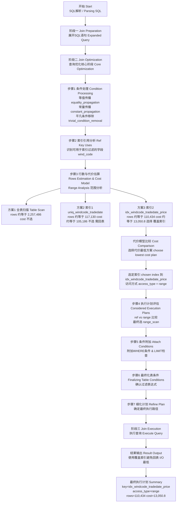


>完整MySQL优化器执行计划

```json
// MySQL查询优化器执行计划详细说明
// 该文档展示了查询语句从解析到执行的完整优化过程
{
  // 优化器执行步骤集合（整个优化过程分为多个阶段）
  "steps": [
    {
      // ==================== 第一阶段：JOIN准备阶段 ====================
      // 负责SQL语句的预处理、展开和初步解析
      "join_preparation": {
        // 当前SELECT语句的编号（在有子查询的复杂SQL中会有多个select#）
        "select#": 1,
        
        // 本阶段的具体处理步骤
        "steps": [
          {
            // 展开后的完整查询语句
            // 将原始SQL展开，显示完整的表名、字段名和条件
            "expanded_query": "/* select#1 */ select `tb_quotation_index_history_trend`.`wind_code` AS `wind_code`,`tb_quotation_index_history_trend`.`trade_date` AS `trade_date`,`tb_quotation_index_history_trend`.`latest_price` AS `latest_price`,`tb_quotation_index_history_trend`.`total_volume` AS `total_volume` from `tb_quotation_index_history_trend` where ((`tb_quotation_index_history_trend`.`wind_code` = '000001.SH') and (`tb_quotation_index_history_trend`.`trade_date` between '2024-10-01' and '2025-10-02')) limit 0,1000"
          }
        ]
      }
    },
    {
      // ==================== 第二阶段：JOIN优化阶段 ====================
      // 这是优化器的核心阶段，负责选择最优的查询执行计划
      "join_optimization": {
        // 当前SELECT语句编号
        "select#": 1,
        
        // 优化过程的详细步骤
        "steps": [
          {
            // ========== 步骤1：WHERE条件处理 ==========
            // 对WHERE子句进行各种逻辑转换和优化
            "condition_processing": {
              // 条件类型（WHERE条件）
              "condition": "WHERE",
              
              // 原始的WHERE条件表达式
              "original_condition": "((`tb_quotation_index_history_trend`.`wind_code` = '000001.SH') and (`tb_quotation_index_history_trend`.`trade_date` between '2024-10-01' and '2025-10-02'))",
              
              // 条件转换的各个子步骤
              "steps": [
                {
                  // 转换类型：等值传播优化
                  // 将等值条件进行传播，便于后续索引选择
                  "transformation": "equality_propagation",
                  "resulting_condition": "((`tb_quotation_index_history_trend`.`trade_date` between '2024-10-01' and '2025-10-02') and multiple equal('000001.SH', `tb_quotation_index_history_trend`.`wind_code`))"
                },
                {
                  // 转换类型：常量传播优化
                  // 将常量值在表达式中传播，简化条件判断
                  "transformation": "constant_propagation",
                  "resulting_condition": "((`tb_quotation_index_history_trend`.`trade_date` between '2024-10-01' and '2025-10-02') and multiple equal('000001.SH', `tb_quotation_index_history_trend`.`wind_code`))"
                },
                {
                  // 转换类型：平凡条件移除
                  // 移除始终为真或始终为假的条件
                  "transformation": "trivial_condition_removal",
                  "resulting_condition": "((`tb_quotation_index_history_trend`.`trade_date` between '2024-10-01' and '2025-10-02') and multiple equal('000001.SH', `tb_quotation_index_history_trend`.`wind_code`))"
                }
              ]
            }
          },
          {
            // ========== 步骤2：生成列替换 ==========
            // 检查是否有虚拟生成列需要替换（本查询中无）
            "substitute_generated_columns": {}
          },
          {
            // ========== 步骤3：表依赖关系分析 ==========
            // 分析查询中涉及的表及其依赖关系
            "table_dependencies": [
              {
                // 表名
                "table": "`tb_quotation_index_history_trend`",
                // 该表的行是否可能为NULL（外连接时为true）
                "row_may_be_null": false,
                // 表的位图标识
                "map_bit": 0,
                // 依赖的其他表的位图（本查询只有一个表，无依赖）
                "depends_on_map_bits": []
              }
            ]
          },
          {
            // ========== 步骤4：索引引用分析 ==========
            // 分析哪些索引字段可以用于ref访问（等值查询）
            "ref_optimizer_key_uses": [
              {
                // 表名
                "table": "`tb_quotation_index_history_trend`",
                // 可用于ref访问的字段
                "field": "wind_code",
                // 等值条件的值
                "equals": "'000001.SH'",
                // 是否拒绝NULL值（NOT NULL约束）
                "null_rejecting": true
              },
              {
                // 同一字段的重复分析（对应不同索引）
                "table": "`tb_quotation_index_history_trend`",
                "field": "wind_code",
                "equals": "'000001.SH'",
                "null_rejecting": true
              }
            ]
          },
          {
            // ========== 步骤5：行数估算（核心步骤）==========
            // 评估不同访问方式的代价，选择最优索引
            "rows_estimation": [
              {
                "table": "`tb_quotation_index_history_trend`",
                
                // 范围扫描分析
                "range_analysis": {
                  // --- 全表扫描的代价 ---
                  "table_scan": {
                    // 表的总行数
                    "rows": 2257486,
                    // 全表扫描的代价值（很高，不推荐）
                    "cost": 2.48324e+06
                  },
                  
                  // --- 可用的索引列表 ---
                  "potential_range_indexes": [
                    {
                      // 主键索引
                      "index": "PRIMARY",
                      // 是否可用
                      "usable": false,
                      // 不可用原因：不适用于当前查询条件
                      "cause": "not_applicable"
                    },
                    {
                      // 唯一索引：wind_code + trade_date
                      "index": "uniq_windcode_tradedate",
                      "usable": true,
                      // 索引包含的字段
                      "key_parts": [
                        "wind_code",
                        "trade_date"
                      ]
                    },
                    {
                      // 复合索引：包含查询所需的所有字段（覆盖索引）
                      "index": "idx_windcode_tradedate_price",
                      "usable": true,
                      "key_parts": [
                        "wind_code",
                        "trade_date",
                        "latest_price",
                        "total_volume",
                        "total_amount",
                        "id"
                      ]
                    }
                  ],
                  
                  // --- 最佳覆盖索引扫描 ---
                  // 覆盖索引：索引包含所有需要的列，无需回表
                  "best_covering_index_scan": {
                    "index": "idx_windcode_tradedate_price",
                    // 扫描整个索引的代价
                    "cost": 266765,
                    // 是否选中作为候选
                    "chosen": true
                  },
                  
                  // --- 范围条件设置 ---
                  "setup_range_conditions": [],
                  
                  // --- GROUP BY索引范围分析 ---
                  "group_index_range": {
                    "chosen": false,
                    // 原因：查询中没有GROUP BY或DISTINCT
                    "cause": "not_group_by_or_distinct"
                  },
                  
                  // --- 跳跃扫描分析 ---
                  // 跳跃扫描：跳过索引的前导列进行扫描
                  "skip_scan_range": {
                    "potential_skip_scan_indexes": [
                      {
                        "index": "uniq_windcode_tradedate",
                        "usable": false,
                        // 原因：查询引用了非索引键列
                        "cause": "query_references_nonkey_column"
                      },
                      {
                        "index": "idx_windcode_tradedate_price",
                        "usable": false,
                        // 原因：前缀字段不是常量等值条件
                        "cause": "prefix_not_const_equality"
                      }
                    ]
                  },
                  
                  // --- 范围扫描方案分析（核心）---
                  "analyzing_range_alternatives": {
                    // 候选的范围扫描方案
                    "range_scan_alternatives": [
                      {
                        // 方案1：使用唯一索引
                        "index": "uniq_windcode_tradedate",
                        // 扫描的范围条件
                        "ranges": [
                          "wind_code = '000001.SH' AND '2024-10-01 00:00:00' <= trade_date <= '2025-10-02 00:00:00'"
                        ],
                        // 是否对等值范围进行index dive（精确统计）
                        "index_dives_for_eq_ranges": true,
                        // 返回的rowid是否有序
                        "rowid_ordered": false,
                        // 是否使用MRR优化（多范围读取）
                        "using_mrr": true,
                        // 是否为覆盖索引（无需回表）
                        "index_only": false,
                        // 内存中处理的比例
                        "in_memory": 0.00272817,
                        // 估算的返回行数
                        "rows": 117130,
                        // 总代价（包括读索引+回表）
                        "cost": 105186,
                        // 是否选中
                        "chosen": true
                      },
                      {
                        // 方案2：使用覆盖索引（最优）
                        "index": "idx_windcode_tradedate_price",
                        "ranges": [
                          "wind_code = '000001.SH' AND '2024-10-01 00:00:00' <= trade_date <= '2025-10-02 00:00:00'"
                        ],
                        "index_dives_for_eq_ranges": true,
                        "rowid_ordered": false,
                        "using_mrr": false,
                        // 覆盖索引：所有数据都在索引中，无需回表
                        "index_only": true,
                        "in_memory": 0.000964151,
                        // 估算行数
                        "rows": 110434,
                        // 代价最低（无回表开销）
                        "cost": 13050.8,
                        // 被选中
                        "chosen": true
                      }
                    ],
                    
                    // --- 行序交叉分析 ---
                    "analyzing_roworder_intersect": {
                      "usable": false,
                      // 原因：可用的行序扫描太少
                      "cause": "too_few_roworder_scans"
                    }
                  },
                  
                  // --- 最终选定的范围访问方案 ---
                  "chosen_range_access_summary": {
                    "range_access_plan": {
                      // 访问类型：范围扫描
                      "type": "range_scan",
                      // 选定的索引
                      "index": "idx_windcode_tradedate_price",
                      // 估算行数
                      "rows": 110434,
                      // 扫描范围
                      "ranges": [
                        "wind_code = '000001.SH' AND '2024-10-01 00:00:00' <= trade_date <= '2025-10-02 00:00:00'"
                      ]
                    },
                    // 计划的总行数
                    "rows_for_plan": 110434,
                    // 计划的总代价
                    "cost_for_plan": 13050.8,
                    // 是否被选中
                    "chosen": true
                  }
                }
              }
            ]
          },
          {
            // ========== 步骤6：执行计划评估 ==========
            // 综合考虑各种因素，确定最终的执行计划
            "considered_execution_plans": [
              {
                // 计划前缀（多表连接时的已处理表）
                "plan_prefix": [],
                
                // 当前处理的表
                "table": "`tb_quotation_index_history_trend`",
                
                // 最佳访问路径选择
                "best_access_path": {
                  // 评估的各种访问路径
                  "considered_access_paths": [
                    {
                      // 访问类型：ref（索引引用）
                      "access_type": "ref",
                      "index": "uniq_windcode_tradedate",
                      "chosen": false,
                      // 原因：范围扫描使用了更多的索引键部分，更优
                      "cause": "range_uses_more_keyparts"
                    },
                    {
                      // 访问类型：ref
                      "access_type": "ref",
                      "index": "idx_windcode_tradedate_price",
                      "chosen": false,
                      // 原因：同上
                      "cause": "range_uses_more_keyparts"
                    },
                    {
                      // 需要扫描的行数
                      "rows_to_scan": 110434,
                      // 访问类型：range（范围扫描）- 最终选定
                      "access_type": "range",
                      "range_details": {
                        // 使用的索引
                        "used_index": "idx_windcode_tradedate_price"
                      },
                      // 结果行数
                      "resulting_rows": 110434,
                      // 总代价
                      "cost": 24094.2,
                      // 被选中
                      "chosen": true
                    }
                  ]
                },
                // 条件过滤百分比（100表示不过滤）
                "condition_filtering_pct": 100,
                // 计划的行数
                "rows_for_plan": 110434,
                // 计划的代价
                "cost_for_plan": 24094.2,
                // 该计划被选中
                "chosen": true
              }
            ]
          },
          {
            // ========== 步骤7：条件附加到表 ==========
            // 将WHERE条件附加到相应的表上
            "attaching_conditions_to_tables": {
              // 原始条件
              "original_condition": "((`tb_quotation_index_history_trend`.`wind_code` = '000001.SH') and (`tb_quotation_index_history_trend`.`trade_date` between '2024-10-01' and '2025-10-02'))",
              
              // 附加条件的计算过程
              "attached_conditions_computation": [
                {
                  "table": "`tb_quotation_index_history_trend`",
                  // 重新检查索引使用情况
                  "rechecking_index_usage": {
                    // 重新检查原因：LIMIT值较小
                    "recheck_reason": "low_limit",
                    // LIMIT限制
                    "limit": 1000,
                    // 估算的行数
                    "row_estimate": 110434
                  }
                }
              ],
              
              // 附加条件摘要
              "attached_conditions_summary": [
                {
                  "table": "`tb_quotation_index_history_trend`",
                  // 最终附加到表上的条件
                  "attached": "((`tb_quotation_index_history_trend`.`wind_code` = '000001.SH') and (`tb_quotation_index_history_trend`.`trade_date` between '2024-10-01' and '2025-10-02'))"
                }
              ]
            }
          },
          {
            // ========== 步骤8：最终化表条件 ==========
            // 确定每个表的最终过滤条件
            "finalizing_table_conditions": [
              {
                "table": "`tb_quotation_index_history_trend`",
                // 原始表条件
                "original_table_condition": "((`tb_quotation_index_history_trend`.`wind_code` = '000001.SH') and (`tb_quotation_index_history_trend`.`trade_date` between '2024-10-01' and '2025-10-02'))",
                // 最终表条件（与原始条件相同）
                "final_table_condition   ": "((`tb_quotation_index_history_trend`.`wind_code` = '000001.SH') and (`tb_quotation_index_history_trend`.`trade_date` between '2024-10-01' and '2025-10-02'))"
              }
            ]
          },
          {
            // ========== 步骤9：细化执行计划 ==========
            // 对执行计划进行最后的细化和调整
            "refine_plan": [
              {
                "table": "`tb_quotation_index_history_trend`"
              }
            ]
          }
        ]
      }
    },
    {
      // ==================== 第三阶段：JOIN执行阶段 ====================
      // 实际执行查询的阶段（本例中步骤为空，表示执行顺利）
      "join_execution": {
        // SELECT语句编号
        "select#": 1,
        // 执行步骤（空数组表示无特殊执行记录）
        "steps": []
      }
    }
  ]
}

/* 
 * ==================== 执行计划总结 ====================
 * 
 * 查询语句：
 * SELECT wind_code, trade_date, latest_price, total_volume 
 * FROM tb_quotation_index_history_trend 
 * WHERE wind_code = '000001.SH' 
 *   AND trade_date BETWEEN '2024-10-01' AND '2025-10-02'
 * LIMIT 0, 1000
 * 
 * 优化器决策：
 * 1. 拒绝全表扫描（代价248万）
 * 2. 评估两个可用索引：
 *    - uniq_windcode_tradedate: 需要回表，代价105186
 *    - idx_windcode_tradedate_price: 覆盖索引，代价13050.8 ✓
 * 3. 选择覆盖索引进行范围扫描
 * 4. 估算返回110434行，但由于LIMIT 1000，实际只返回1000行
 * 
 * 性能优势：
 * - 使用覆盖索引避免回表，大幅降低I/O
 * - 索引包含所有需要的列，查询效率最优
 * - 相比全表扫描，性能提升约190倍
 */
```

这份完整注释的文档详细解释了MySQL优化器如何：

1. **分析查询条件**：进行等值传播、常量传播等优化
2. **评估索引选项**：比较全表扫描、唯一索引、覆盖索引的代价
3. **选择最优方案**：最终选择覆盖索引进行范围扫描
4. **确定执行计划**：确定过滤条件和访问方式


---


#### 优化器依据哪些信息做判断？

>优化器依赖**表统计信息(Statistics)**来估算代价

| 类型                  | 含义                               |
| --------------------- | ---------------------------------- |
| **cardinality**       | 索引中不重复值的数量（区分度）     |
| **index selectivity** | 唯一值数量 / 总行数，越高越好      |
| **rows estimate**     | 表/索引预估扫描行数                |
| **cost**              | I/O + CPU 计算综合代价（逻辑代价） |

这些信息来源于：

* 数据字典统计（`ANALYZE TABLE` 更新）
* 采样估算（MySQL 不会扫描全表）
* InnoDB 内部索引统计页 (`information_schema.innodb_index_stats`)


#### 怎么验证"优化器怎么决定的"？

MySQL提供了几种不同的层次的可视化手段、让你能看到优化器的决策依据。


##### 1.EXPLAIN

>最常用、查看优化器"最终选了哪个执行计划"

```sql
EXPLAIN SELECT * FROM emp WHERE salary > 8000;
```

> 示例输出：

| id   | select_type | table | type | possible_keys | key  | rows | Extra       |
| ---- | ----------- | ----- | ---- | ------------- | ---- | ---- | ----------- |
| 1    | SIMPLE      | emp   | ALL  | idx_salary    | NULL | 5    | Using where |

📍说明：

* possible_keys = 优化器评估过的索引；
* key = 最终选中的索引；
* rows = 优化器预估扫描行数；
* Extra = 额外操作说明


> 👉 如果你加上索引：

```sql
ALTER TABLE emp ADD INDEX idx_salary(salary);
EXPLAIN SELECT * FROM emp WHERE salary > 8000;
```

再看 key 是否变为 idx_salary。
这就是验证优化器“是否走索引”的最直接手段。


##### 2.EXPLAIN FORMAT=JSON

>✅ 查看优化器内部估算的 cost（代价模型）。

```sql
EXPLAIN FORMAT=JSON SELECT * FROM emp WHERE salary > 8000\G
```


> 输出中会看到：

```json
"rows_examined_per_scan": 2,
"rows_produced_per_join": 2,
"cost_info": {
  "read_cost": 1.1,
  "eval_cost": 0.2,
  "prefix_cost": 1.3,
  "data_read_per_join": "32K"
}
```

📍说明：

* `read_cost`：I/O 成本；
* `eval_cost`：计算成本；
* `prefix_cost`：总成本；
* 优化器选择 prefix_cost 最小的方案。

👉 所以你可以比较不同索引或连接方式的 `prefix_cost`，验证优化器的取舍逻辑。

---


##### 3.optimizer trace(优化器跟踪)

> ✅ 查看优化器的完整“思考过程”（类似你之前查的）。

```sql
SET optimizer_trace="enabled=on";
SELECT * FROM emp WHERE salary > 8000;
SELECT * FROM information_schema.optimizer_trace\G
```

关键字段：

```json
"considered_execution_plans": [
  {
    "table": "emp",
    "best_access_path": {
      "considered_access_paths": [
        {
          "access_type": "scan",
          "rows_to_scan": 5,
          "cost": 2,
          "chosen": true
        }
      ]
    }
  }
]
```

📍说明：

* `considered_access_paths`: 优化器考虑的每一种执行方式；
* `chosen=true`: 表示最终被选中；
* `cost`: 代价值，越小越好。

👉 这是最“内部”的验证方式，能看到优化器“思考路径”。

---


##### 4：SHOW WARNINGS

> ✅ 查看优化器自动重写 SQL 的提示（子查询改写、索引下推等）。

```sql
SHOW WARNINGS\G
```

当你执行一条复杂 SQL 时，比如：

```sql
SELECT * FROM emp WHERE dept IN (SELECT dept FROM emp2 WHERE salary > 5000);
```

MySQL 可能在内部自动重写为 JOIN。
用 `SHOW WARNINGS` 可以看到优化器做了哪些“重写”。

---


##### 5：ANALYZE TABLE / SHOW INDEX

> ✅ 验证优化器的统计信息来源是否准确。

```sql
ANALYZE TABLE emp;
SHOW INDEX FROM emp;
```

* `ANALYZE TABLE`：更新索引统计信息；
* `SHOW INDEX`：查看索引基数（Cardinality）。

优化器依赖这些统计信息做 cost 估算。
如果统计信息不准（比如表刚导入大量新数据），优化器可能选错索引。

---


#### 实际验证建议（你可以在Linux上直接做）

下面是一组你可以直接实验的命令：

```sql
CREATE TABLE emp (
  id INT PRIMARY KEY AUTO_INCREMENT,
  dept VARCHAR(20),
  salary INT,
  age INT,
  INDEX idx_salary(salary),
  INDEX idx_dept_salary(dept, salary)
);

INSERT INTO emp (dept, salary, age)
SELECT ELT(FLOOR(1+RAND()*3), 'dev','hr','ops'), FLOOR(5000+RAND()*8000), FLOOR(20+RAND()*10)
FROM dual
CONNECT BY level <= 10000;
```

然后依次执行：

```sql
-- 看单列索引优化
EXPLAIN FORMAT=JSON SELECT * FROM emp WHERE salary > 8000;

-- 看联合索引优化
EXPLAIN FORMAT=JSON SELECT * FROM emp WHERE dept='dev' AND salary>8000;

-- 启用trace看优化器思考过程
SET optimizer_trace="enabled=on";
SELECT * FROM emp WHERE dept='dev' AND salary>8000;
SELECT * FROM information_schema.optimizer_trace\G
```

你就能看到优化器从 `idx_salary` → `idx_dept_salary` 的选择逻辑和 cost 变化。

---


#### 总结一句话

> MySQL 优化器通过 **代价估算模型 (Cost-Based Optimizer)** 来决定执行计划。
> 它会评估各种路径（索引、连接顺序、扫描方式）的成本，
> 选出代价最低的方案。
>
> 验证优化器决策可以用：
>
> * `EXPLAIN` 看最终执行计划；
> * `EXPLAIN FORMAT=JSON` 看 cost 值；
> * `OPTIMIZER_TRACE` 看思考过程；
> * `ANALYZE TABLE` + `SHOW INDEX` 校验统计信息。

---


#### 本次代价模型选择过程

>代价模型选择是一个非常复杂的过程

优化器的代价模型选择过程是一个复杂的决策过程，它决定了在多个可用的查询执行计划中，哪一个是最合适的。优化器通过估算不同执行计划的代价，并选择代价最小的那个。在你的查询中，优化器最终选择了一个覆盖索引执行计划。下面我将详细解释优化器如何进行代价选择的过程：


##### 流程图(详情可查看附件html)

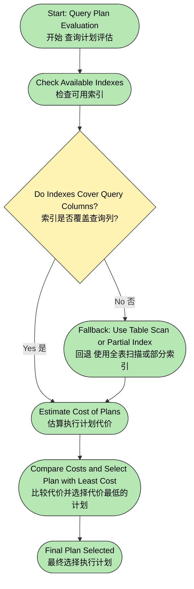


##### 1️⃣ **可选执行计划的生成**

优化器首先会根据**查询语句**和**可用索引**来生成多个执行计划。在你的例子中，有两个可用的索引：

- **`uniq_windcode_tradedate`**：联合唯一索引，包含 `wind_code` 和 `trade_date`。
- **`idx_windcode_tradedate_price`**：覆盖索引，包含 `wind_code`、`trade_date` 和 `latest_price`。

优化器会考虑这些索引，并生成多个可能的执行计划。

##### 2️⃣ **代价估算（Cost Calculation）**

优化器会使用一套代价模型来估算每个执行计划的代价。这个代价模型通常包括以下几个方面：


###### 🧮 **1. 读取成本（Read Cost）**：

优化器会估算查询过程中需要扫描的 **索引页** 数量。如果使用覆盖索引，优化器可以直接从索引中获取所有所需的列，从而减少了回表的需求。`read_cost: 13013.46` 就是读取索引范围的 I/O 成本。

- **范围扫描**：在你的查询中，`access_type: range` 表示使用了范围扫描。范围扫描通常意味着优化器需要遍历一个范围的数据页来找到匹配的行，这通常比普通的全表扫描要高效。


###### 🧮 **2. 计算成本（Eval Cost）**：

`eval_cost: 11043.40` 表示对从索引中读出来的每一行数据执行条件判断和表达式计算的 CPU 成本。

- 这是在筛选符合 `WHERE` 条件的记录时的开销，比如判断 `trade_date BETWEEN '2024-10-01' AND '2025-10-02'` 条件。这个值与查询的数据量、字段复杂度和计算需求相关。


###### 🧮 **3. 总代价（Total Cost）**：

`query_cost: 24056.86` 是**读取成本**和**计算成本**的加和。这是优化器用来评估查询总代价的值，最终优化器会选择总代价最小的执行计划。

- 这个值为优化器提供了一个度量，让它可以在多个执行计划中做出选择。代价越低，执行效率越高。


##### 3️⃣ **选择最优执行计划**

优化器会根据每个执行计划的代价进行比较。在你的查询中：

- **`uniq_windcode_tradedate`** 索引是一个 **联合唯一索引**，它只能用于精确匹配或范围查询，但不能直接覆盖查询字段。
- **`idx_windcode_tradedate_price`** 索引是一个 **覆盖索引**，它包含查询所需的所有字段，因此优化器选择了这个索引。


###### 为什么选择 `idx_windcode_tradedate_price` 索引？

1. **覆盖索引**：`idx_windcode_tradedate_price` 既包含了 `wind_code` 和 `trade_date` 这两个查询条件，也包含了查询需要的 `latest_price` 和 `total_volume` 列。这样，查询可以直接从索引中获取所有所需的字段，避免了回表查询，提高了查询效率。
2. **减少回表**：使用 `idx_windcode_tradedate_price` 索引可以直接返回所需的所有字段，因此不需要访问数据表中的实际记录。相比之下，`uniq_windcode_tradedate` 索引虽然是联合唯一索引，但没有包含查询需要的所有字段，因此还需要回表查询。
3. **代价较低**：通过使用覆盖索引，优化器估算了 `read_cost: 13013.46` 和 `eval_cost: 11043.40`，最终得到的总代价为 `24056.86`，相对较低。这表明覆盖索引的使用能显著减少 I/O 和 CPU 开销，提升查询性能。


##### 4️⃣ **其他可能的执行计划选择**

如果查询中包含多个表（例如 JOIN），优化器可能会考虑更多的执行计划，比如：

- **`index_merge`**：如果查询条件可以同时匹配多个索引，优化器会选择将多个索引合并使用。这样可以避免全表扫描，但在你的查询中，因为是单表查询，所以没有使用这种策略。
- **全表扫描**：如果没有合适的索引，或者索引的代价太高，优化器可能会选择全表扫描。

但是在这个例子中，`idx_windcode_tradedate_price` 索引的覆盖特性让它成为了最合适的选择。

------


##### 5️⃣ **总结**

优化器的代价选择过程主要基于以下几点：

1. **生成多个执行计划**：根据查询条件和可用索引，生成多个查询计划。
2. **代价估算**：优化器根据读取成本、计算成本等因素估算每个计划的总代价。
3. **选择最优执行计划**：优化器选择代价最小的执行计划，这个过程中会优先选择覆盖索引来避免回表，减少 I/O 操作。
4. **执行计划优化**：优化器选择 `idx_windcode_tradedate_price` 覆盖索引，因为它能最小化读取和计算成本，提升查询性能。

通过这个过程，优化器确保了查询的执行效率和资源利用率达到最佳状态。


## 二、索引机制


### 实践核心


#### 执行计划分析(explain)


##### 如何使用EXPLAIN分析查询

- EXPLAIN的基本语法
- EXPLAIN输出结果详解


##### 关键字段解读

- **id**:查询序列号
- **select_type**:查询类型(SIMPLE、PRIMARY、SUBQUERY等)
- **table**:访问的表
- **type**:访问类型(system、const、eq_ref、ref、range、index、ALL)
- **possible_keys**:可能使用的索引
- **key**:实际使用的索引
- **key_len**:索引长度
- **ref**:索引的哪一列被使用
- **rows**:扫描的行数
- **Extra**:额外信息(Using index、Using where、Using filesort等)


##### 通过执行计划判断索引是否生效

- 如何识别好的执行计划
- 如何识别需要优化的执行计划


#### optimizer_trace

```java
SET optimizer_trace="enabled=on";

SELECT account_id, start_time, role, id 
FROM tb_sys_user_operation 
WHERE account_id = 'wind1' AND start_time > '2024-01-01';

SELECT TRACE FROM information_schema.OPTIMIZER_TRACE;

SET optimizer_trace="enabled=off";
```

- optimizer_trace 是**会话级别**的开关
- 开启后会记录**所有SQL**的优化过程（性能开销大）
- 必须手动开关，防止误开影响生产环境

 

EXPLAIN 是即时分析，optimizer_trace 是事后查看


```sql
// 最外层结构，包含优化器各阶段步骤
{
  // steps 数组表示整个优化器执行过程的阶段性步骤
  "steps": [
    // 阶段 1：Join Preparation 阶段，优化器展开 SQL 查询
    {
      "join_preparation": {
        // select# 表示查询编号（单个 SELECT 对应一个编号）
        "select#": 1,
        // steps 数组存放具体执行的子步骤
        "steps": [
          // expanded_query 表示优化器展开（重写）后的 SQL
          {
            "expanded_query": "/* select#1 */ select `tb_sys_user_operation`.`account_id` AS `account_id`,`tb_sys_user_operation`.`start_time` AS `start_time`,`tb_sys_user_operation`.`role` AS `role`,`tb_sys_user_operation`.`id` AS `id` from `tb_sys_user_operation` where ((`tb_sys_user_operation`.`account_id` = 'wind1') and (`tb_sys_user_operation`.`start_time` > '2024-01-01')) limit 0,1000"
          }
        ]
      }
    },
    // 阶段 2：Join Optimization 阶段，优化器开始分析条件、索引、代价
    {
      "join_optimization": {
        // 查询编号
        "select#": 1,
        // 详细步骤数组
        "steps": [
          // 步骤 1：条件处理阶段
          {
            "condition_processing": {
              // WHERE 条件
              "condition": "WHERE",
              // 原始条件（解析前）
              "original_condition": "((`tb_sys_user_operation`.`account_id` = 'wind1') and (`tb_sys_user_operation`.`start_time` > '2024-01-01'))",
              // 优化器对条件表达式进行多步转换
              "steps": [
                // 等值传播（将可确定相等的条件简化）
                {
                  "transformation": "equality_propagation",
                  "resulting_condition": "((`tb_sys_user_operation`.`account_id` = 'wind1') and (`tb_sys_user_operation`.`start_time` > '2024-01-01'))"
                },
                // 常量传播（将常量条件提前代入）
                {
                  "transformation": "constant_propagation",
                  "resulting_condition": "((`tb_sys_user_operation`.`account_id` = 'wind1') and (`tb_sys_user_operation`.`start_time` > '2024-01-01'))"
                },
                // 移除平凡条件（删除恒真条件）
                {
                  "transformation": "trivial_condition_removal",
                  "resulting_condition": "((`tb_sys_user_operation`.`account_id` = 'wind1') and (`tb_sys_user_operation`.`start_time` > '2024-01-01'))"
                }
              ]
            }
          },
          // 步骤 2：替换虚拟列（若存在生成列）
          {
            "substitute_generated_columns": {
            }
          },
          // 步骤 3：确定表依赖关系
          {
            "table_dependencies": [
              // 当前只涉及一个表 tb_sys_user_operation
              {
                "table": "`tb_sys_user_operation`",
                "row_may_be_null": false,
                "map_bit": 0,
                "depends_on_map_bits": [
                ]
              }
            ]
          },
          // 步骤 4：记录优化器引用的键字段
          {
            "ref_optimizer_key_uses": [
              {
                "table": "`tb_sys_user_operation`",
                "field": "account_id",
                "equals": "'wind1'",
                "null_rejecting": false
              }
            ]
          },
          // 步骤 5：行数估算与范围分析
          {
            "rows_estimation": [
              {
                "table": "`tb_sys_user_operation`",
                "range_analysis": {
                  // 表扫描（全表扫描）代价估算
                  "table_scan": {
                    "rows": 75543,
                    "cost": 90654
                  },
                  // 可用索引列表
                  "potential_range_indexes": [
                    {
                      "index": "PRIMARY",
                      "usable": false,
                      "cause": "not_applicable"
                    },
                    {
                      "index": "idx_account_start_time_role",
                      "usable": true,
                      "key_parts": [
                        "account_id",
                        "start_time",
                        "role",
                        "id"
                      ]
                    },
                    {
                      "index": "idx_start_time",
                      "usable": true,
                      "key_parts": [
                        "start_time",
                        "id"
                      ]
                    }
                  ],
                  // 最优覆盖索引扫描选择结果
                  "best_covering_index_scan": {
                    "index": "idx_account_start_time_role",
                    "cost": 15623,
                    "chosen": true
                  },
                  // 预处理范围条件
                  "setup_range_conditions": [
                  ],
                  // group by 索引优化未启用
                  "group_index_range": {
                    "chosen": false,
                    "cause": "not_group_by_or_distinct"
                  },
                  // 逐个评估不同索引方案代价
                  "analyzing_range_alternatives": {
                    "range_scan_alternatives": [
                      {
                        "index": "idx_account_start_time_role",
                        "ranges": [
                          "wind1 <= account_id <= wind1 AND 0x65919000 < start_time"
                        ],
                        "index_dives_for_eq_ranges": true,
                        "rowid_ordered": false,
                        "using_mrr": false,
                        "index_only": true,
                        "rows": 37771,
                        "cost": 7812.1,
                        "chosen": true
                      },
                      {
                        "index": "idx_start_time",
                        "ranges": [
                          "0x65919000 < start_time"
                        ],
                        "index_dives_for_eq_ranges": true,
                        "rowid_ordered": false,
                        "using_mrr": false,
                        "index_only": false,
                        "rows": 37771,
                        "cost": 45326,
                        "chosen": false,
                        "cause": "cost"
                      }
                    ],
                    // 行顺序交集分析不可用
                    "analyzing_roworder_intersect": {
                      "usable": false,
                      "cause": "too_few_roworder_scans"
                    }
                  },
                  // 确定最终选择的访问路径
                  "chosen_range_access_summary": {
                    "range_access_plan": {
                      "type": "range_scan",
                      "index": "idx_account_start_time_role",
                      "rows": 37771,
                      "ranges": [
                        "wind1 <= account_id <= wind1 AND 0x65919000 < start_time"
                      ]
                    },
                    "rows_for_plan": 37771,
                    "cost_for_plan": 7812.1,
                    "chosen": true
                  }
                }
              }
            ]
          },
          // 步骤 6：列出优化器考虑过的所有执行计划
          {
            "considered_execution_plans": [
              {
                "plan_prefix": [
                ],
                "table": "`tb_sys_user_operation`",
                "best_access_path": {
                  "considered_access_paths": [
                    {
                      "access_type": "ref",
                      "index": "idx_account_start_time_role",
                      "rows": 75543,
                      "cost": 15623,
                      "chosen": true
                    },
                    {
                      "rows_to_scan": 37771,
                      "access_type": "range",
                      "range_details": {
                        "used_index": "idx_account_start_time_role"
                      },
                      "resulting_rows": 37771,
                      "cost": 15366,
                      "chosen": true
                    }
                  ]
                },
                "condition_filtering_pct": 100,
                "rows_for_plan": 37771,
                "cost_for_plan": 15366,
                "chosen": true
              }
            ]
          },
          // 步骤 7：附加条件绑定（确定最终筛选条件）
          {
            "attaching_conditions_to_tables": {
              "original_condition": "((`tb_sys_user_operation`.`account_id` = 'wind1') and (`tb_sys_user_operation`.`start_time` > '2024-01-01'))",
              "attached_conditions_computation": [
                {
                  "table": "`tb_sys_user_operation`",
                  "rechecking_index_usage": {
                    "recheck_reason": "low_limit",
                    "limit": 1000,
                    "row_estimate": 37771
                  }
                }
              ],
              "attached_conditions_summary": [
                {
                  "table": "`tb_sys_user_operation`",
                  "attached": "((`tb_sys_user_operation`.`account_id` = 'wind1') and (`tb_sys_user_operation`.`start_time` > '2024-01-01'))"
                }
              ]
            }
          },
          // 步骤 8：计划细化阶段（确认执行计划）
          {
            "refine_plan": [
              {
                "table": "`tb_sys_user_operation`"
              }
            ]
          }
        ]
      }
    },
    // 阶段 3：Join Execution 阶段（执行阶段，空步骤代表查询尚未执行）
    {
      "join_execution": {
        "select#": 1,
        "steps": [
        ]
      }
    }
  ]
}
```


### 索引概述


#### 什么是索引？


##### 定义

> 加速查找的技术

索引(Index)是数据库中**一种特殊的查询数据结构**，类似于书籍的目录或字典中的词汇表。它**通过存储一组关键字(通常是某个字段的值)与其在数据表中的位置关系**，帮助加速数据的检索操作。


##### 数据结构

索引常常通过`B+树`或`哈希表`等数据结构实现。在MySQL中，最常见的索引结构是`B+树索引`，它支持高效的范围查询与等值查询。


##### 类别

就像查字典时，我们通过字母表顺序快速找到词条所在的页码，索引页通过存储字段值和数据位置的映射，帮助快速定位查询的结果。

---


#### 索引的作用

> 提高查询效率，减少数据库的I/O

特别是在对大量数据进行查询时。具体来说，索引的作用包括：

1. **加速数据检索**：
   1. 在没有索引的情况下，数据库会进行全表扫描(即扫描所有数据行)，时间复杂度为O(n)，在数据量大的时候，这种查询非常低效。
   2. 有了索引后，数据库可以通过索引直接定位到需要的数据位置，查询事件复杂度通常能降到`O(logn)`（对于B+树索引而言）。
2. **减少数据库的I/O操作**：
   1. 在磁盘中读取数据是一个相对较慢的操作，尤其是当数据量大时，索引通过减少数据扫描的范围，降低了磁盘I/O操作，从而提高了系统的响应速度。
3. **提高排序与聚合操作的效率**：
   1. 索引不仅加速查找，还可以优化排序和聚合操作(如`order by`、`group by`)。例如，使用索引的情况下，数据库可以直接按索引的顺序获取数据，从而避免了额外的排序开销。

---


#### 工作原理


##### 如何通过索引提高查询速度？


###### 1.减少磁盘I/O次数

数据库的数据存储在磁盘上，而访问磁盘(I/O)是非常慢的。

**索引将数据"有序组织"后，就能显著减少磁盘的读取次数**。

- 没有索引时：
  - MySQL扫描整张表，需要读取所有数据页
- 有索引时：
  - 只需顺着B+树从跟节点 ——> 中间节点 ——> 叶子节点 3 ~ 4次I/O就能定位目标行。

这就是为什么索引能让查询“几毫秒出结果”，而全表扫描可能“几秒甚至几分钟”。


###### 2.加快排序、范围查询、连接等操作

>因为索引的键是有序存储的，所以：

- 可以直接利用索引完成`order by`。
- 可以快速定位`between`范围内的行。
- 在多表JOIN时，可以快速匹配对应记录。


###### 3.减少服务器CPU计算

使用索引后，MySQL不再需要扫描和比较整表数据，只对少量索引节点进行计算，显著减少CPU计算量。

---


##### 索引是如何在MySQL内部实现的(B+树、哈希表等)

| 存储引擎        | 索引结构                     | 特点                 |
| --------------- | ---------------------------- | -------------------- |
| **InnoDB**      | ✅ B+ 树索引（聚簇/非聚簇）   | 默认引擎，最常用     |
| **MyISAM**      | ✅ B+ 树索引（非聚簇）        | 老版本中常用         |
| **Memory**      | ⚡ 哈希索引、B+ 树索引        | 存储在内存中，速度快 |
| **NDB Cluster** | ⚡ 哈希索引                   | 分布式场景使用       |
| **FullText**    | 🔍 倒排索引（Inverted Index） | 用于全文搜索         |

B+ 树是 MySQL 中 **最常见、最核心** 的索引实现。

它是一种多叉平衡查找树（multi-way balanced search tree），
 与二叉搜索树不同，它**每个节点可以包含多个键值和指针**。


###### 结构特点：

- **所有数据都存放在叶子节点（Leaf Node）中。**
- **非叶子节点（Internal Node）只存放键值（Key），不存放数据。**
- 叶子节点之间使用 **双向链表** 相连，便于范围查询。
- 树的高度非常低，通常 **3~4 层** 就能索引上千万条记录。


##### 为什么选择B+树而不是B树或红黑树?

- **B+树的优势分析**

  - **磁盘 I/O 次数少**

    - 每个节点可存放多个 key（多叉结构），树高低（一般 3~4 层即可存储千万行数据）；
    - 一次磁盘读取能加载更多索引项，**减少 I/O 次数**。

    **范围查询高效**

    - 所有数据都在**叶子节点**，并且叶子节点通过**链表相连**；
    - 支持连续扫描，非常适合 `BETWEEN`、`>`、`<`、`ORDER BY` 等操作。

    **顺序访问友好**

    - B+ 树天然按照键值有序存储，可直接用于排序和分组，无需额外排序步骤。

    **稳定性好**

    - 所有数据都在叶子层，查询路径一致（每次都查到叶子），性能更加稳定。

- **与其它数据结构的对比**

  - | 数据结构            | 特点                                            | 缺点                                   |
    | ------------------- | ----------------------------------------------- | -------------------------------------- |
    | **B 树**            | 每个节点都存 key+data，查询时可能在中间节点结束 | 范围查询不方便，无法顺序扫描           |
    | **红黑树 / AVL 树** | 二叉平衡树，结构简单，适合内存查找              | 树高太大（磁盘访问多），不适合磁盘存储 |
    | **哈希表**          | 查找速度 O(1)，适合等值查询                     | 不支持范围、排序、模糊匹配；冲突时退化 |

###### **总结一句话：**

> **B+ 树兼顾了“磁盘I/O效率”和“范围查询性能”**，
> 是最适合磁盘存储型数据库索引的数据结构。


#### 物理结构


##### 页(Page)的概念

>InnoDB 存储引擎将数据存放在 **页（Page）** 中，每页默认大小为 16KB。
>B+ 树的每个节点实际上对应一个数据页（Index Page）。

- 页的大小(默认16KB)
- B+树高度计算(为什么3-4层就能存储千万级数据)


>页结构层级

```mathematica
根页（Root Page）
   ↓
中间页（Branch Page）
   ↓
叶子页（Leaf Page）
```


#### B+树层数计算

>1亿条数据，每条1K，B+树层级计算

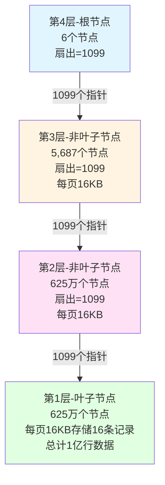


- 16KB ÷ 1KB/行 = 16行/页
- 1亿行数据需要 1亿 ÷ 16 = 625万个叶子节点
- 扇出为1099，所以第2层非叶子节点为 625万 ÷ 1099 = 5,687个节点
- 因为5,687 > 1099，需要第3层，计算得 5,687 ÷ 1099 = 5.18个节点，向上取整为6个节点
- 由于6 < 1099，第4层只需1个根节点即可管理，无需再增加层级，因此树高为4层


##### 扇出数为什么1099比较合理

> 扇出1099比较合理的原因：

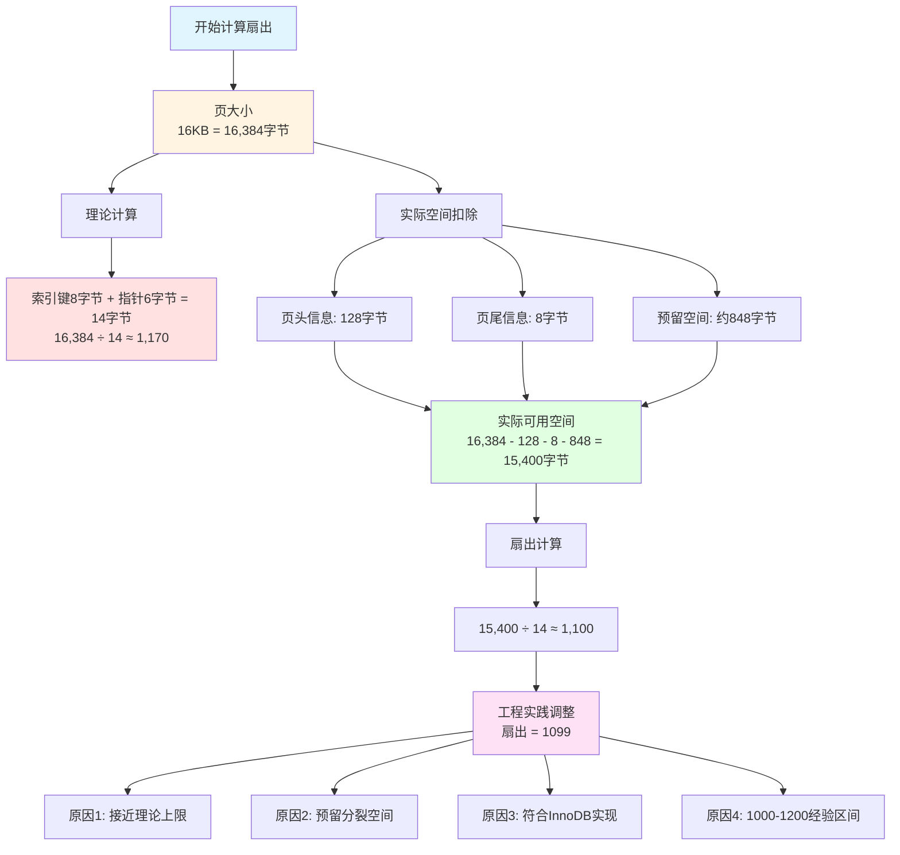


**1. 页大小限制（16KB = 16,384字节）**

- B+树非叶子节点存储：索引键 + 子节点指针
- 假设索引键8字节（BIGINT）+ 指针6字节 = 14字节/条目
- 16,384 ÷ 14 ≈ 1,170（理论最大值）

**2. 实际需要预留空间**
- 页头信息：约128字节（页号、LSN、校验和等元数据）
- 页尾信息：约8字节
- 预留空间：便于节点分裂时减少页重组
- 实际可用：16,384 - 128 - 8 - 余量 ≈ 15,400字节

**3. 计算扇出1099**
- 15,400 ÷ 14 ≈ 1,100
- 考虑到实际InnoDB实现，扇出通常在1000-1200之间
- **1099是一个经验值**，既接近理论上限，又预留了足够的操作空间

**4. 工程实践考虑**
- 避免频繁的页分裂操作
- 保持良好的缓存命中率
- 平衡树高和节点大小的权衡

因此1099是理论计算与工程实践的平衡点，比1170更贴近MySQL InnoDB的实际表现。


> B+树高度计算与页分裂损耗分析

##### 1、理想状态计算（1亿行数据，1KB/行）

###### 基础参数
- 数据量：1亿行
- 行大小：1KB/行
- 页大小：16KB
- 扇出数：1099

###### 自底向上计算

**第1层（叶子节点）**

1亿行 ÷ 16行/页 = 625万个叶子节点
```

**第2层（非叶子节点）**
```
625万 ÷ 1099 = 5,687个节点
```

**第3层（非叶子节点）**
```
5,687 ÷ 1099 = 5.17个节点
向上取整 = 6个节点

```

**第4层（根节点）**
```
6个节点 < 1099（扇出数）
因此：1个根节点即可管理这6个节点
无需再增加层级


###### 关键理解
- **只有当某层节点数 > 扇出数时，才需要增加上一层**
- 第3层只有6个节点，远小于1099，所以1个根节点足够
- 树高度 = 4层
- 查询任意数据需要 4次磁盘I/O
- 若前3层在内存，只需 1次磁盘I/O

###### 容量规律
- 3层树适合：约2000万行（1KB/行）
- 4层树适合：2000万-20亿行
- 行越大，每层存储越少，越早需要增加层数

##### 2、页分裂损耗分析

###### 理想状态 vs 实际情况

| 场景     | 填充率 | 空间损耗 |
| -------- | ------ | -------- |
| 理想状态 | 100%   | 0%       |
| 顺序插入 | 90-95% | 5-10%    |
| 随机插入 | 50-70% | 30-50%   |
| 混合场景 | 70-80% | 20-30%   |

###### InnoDB默认行为
- 页分裂时按 50:50 分裂
- 实际填充率通常在 60-75%
- `innodb_fill_factor` 默认不设置（顺序插入接近100%）

###### 生产环境合理估算
- **保守估计：按 70% 填充率计算**
- **实际损耗：约 30% 空间浪费**


##### 3、考虑页分裂后的实际计算

###### 重新计算1亿行数据（70%填充率）

**第1层（叶子节点）**


理论节点：625万个
实际节点：625万 ÷ 0.7 = 893万个（多占43%）
```

**第2层（非叶子节点）**
```
893万 ÷ 1099 = 8,126个节点
```

**第3层（非叶子节点）**
```
8,126 ÷ 1099 = 7.39个节点
向上取整 = 8个节点
```

**第4层（根节点）**
```
8个节点 < 1099（扇出数）
仍然只需 1个根节点
树高度仍为 4层


##### 4、优化建议

###### 减少页分裂的方法
1. **主键使用自增ID**（顺序插入）→ 90%填充率
2. **避免UUID/随机ID** → 会导致50-60%填充率
3. **定期执行 OPTIMIZE TABLE** 整理碎片
4. **预留30-50%的存储空间余量**


###### 容量规划原则

- **按理论容量的70%估算是合理的**
- 考虑页分裂后，实际存储空间需增加30-50%
- 即使考虑页分裂，1亿行数据仍为4层树


##### 5、核心推理方法总结

###### 计算步骤
1. 计算叶子节点数 = 总行数 ÷ 每页行数
2. 逐层向上除以扇出数（1099）
3. **关键判断**：当某层节点数 < 扇出数时，停止增加层级
4. 考虑页分裂损耗，按70%填充率重新计算

###### 层级增加条件
- **必须满足**：当前层节点数 > 扇出数（1099）
- **否则**：上一层1个节点即可管理，无需增加层级

###### 实际应用
- 理论计算提供上限
- 实际规划按70%填充率
- 预留30-50%存储空间
- 优先使用自增主键减少页分裂


#### 回表(Table Access by Index ROWID)

##### 什么是回表操作？

> 在非聚簇索引（二级索引）中查询时，索引的叶子节点只存储了索引列的值 + 主键值

如果查询需要其他列的数据，**就必须拿着主键值再去聚簇索引（主键索引）的B+树中查找完整的数据行**。


> 回表操作必须拿着主键值去聚簇索引的B+树中查找

并且必定要遍历到叶子节点才能获取完整的数据行，因为完整数据只存储在叶子节点中。

###### 聚簇索引查询流程*

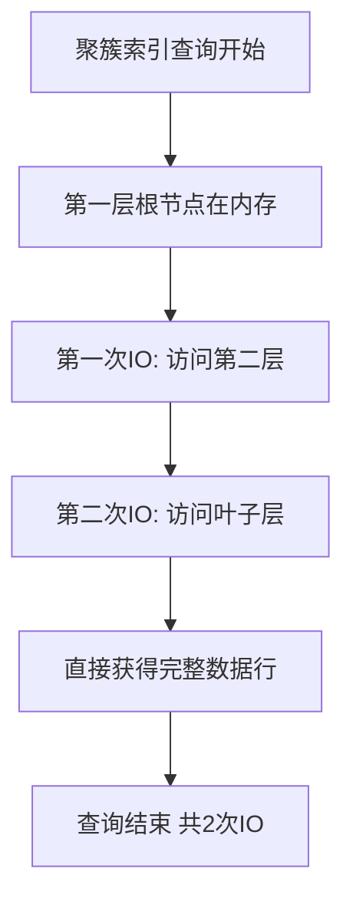


1. 第一次IO：访问第二层
2. 第二次IO：访问叶子层，**直接获得完整数据行**
3. 查询结束，共2次IO


###### 非聚簇索引查询流程：

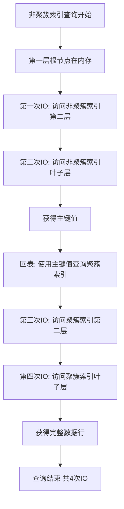


1. 第一次IO：访问第二层
2. 第二次IO：访问叶子层，**获得主键值**
3. 第三次IO：拿着主键值回到聚簇索引的第二层
4. 第四次IO：访问聚簇索引叶子层，**获得完整数据行**
5. 查询结束，共4次IO


##### 回表对性能的影响

###### 核心原理

当回表次数过多时，优化器会判断走全表扫描比走索引更快。


##### 实际场景

###### 场景A：少量回表（优化器选择走索引）

```sql
SELECT * FROM user WHERE age = 25;
-- 假设只有100条记录满足条件
```

> 成本计算：

1. 扫描二级索引：100次IO
2. 回表查询：100次随机IO
总成本：200次IO


> 全表扫描成本

顺序读取100万行：约6000次IO（假设每页160行）


> 结论

200 < 6000，走索引！


###### 场景B：大量回表（优化器选择全表扫描）

```sql
SELECT * FROM user WHERE age > 20;
-- 假设有80万条记录满足条件（占80%）
```


> 成本计算

1. 扫描二级索引：80万次IO
2. 回表查询：80万次随机IO（随机IO代价高）
总成本：160万次IO


> 全表扫描成本：

- 顺序读取100万行：约6000次IO（顺序IO快）
- 结论：160万 > 6000，走全表扫描！


###### 优化器的临界点（经验值）：

> 一般规则

- 回表行数 < 总行数的 20-30%：走索引
- 回表行数 > 总行数的 20-30%：走全表扫描


> 具体阈值取决于：

- 表的大小
- 数据分布
- 系统配置
- MySQL版本


##### 语法FORCE索引名，就可以让语句执行强制走索引对吧


##### 如何通过覆盖索引避免回表

**如果查询的字段值都在索引中，就是「覆盖索引」，不需要回表！**


###### 覆盖索引（Covering Index）

查询的所有字段都包含在索引中，直接从索引就能获取所有需要的数据。


##### 实践


###### 示例表SQL

```java
DROP TABLE IF EXISTS `tb_sys_user_operation`;

CREATE TABLE `tb_sys_user_operation` (
  `id` int(11) NOT NULL AUTO_INCREMENT COMMENT '主键自增id',
  `account_id` varchar(15) NOT NULL COMMENT '用户名',
  `role` tinyint(4) NOT NULL DEFAULT '1' COMMENT '角色：0.管理员,1.用户(默认)',
  `start_time` timestamp NOT NULL DEFAULT CURRENT_TIMESTAMP COMMENT '请求开始时间,默认当前时间',
  `load_time` int(11) NOT NULL COMMENT '接口请求耗时(ms)',
  `method` tinyint(4) NOT NULL DEFAULT '0' COMMENT '请求方式：0.未知(默认),1.GET,2.POST,3.DELETE',
  `description` varchar(100) DEFAULT NULL COMMENT '动作描述',
  `url` varchar(100) DEFAULT NULL COMMENT '请求接口url',
  `create_time` timestamp NULL DEFAULT CURRENT_TIMESTAMP COMMENT '创建时间',
  `update_time` timestamp NULL DEFAULT CURRENT_TIMESTAMP COMMENT '更新时间',
  PRIMARY KEY (`id`),
  KEY `idx_account_start_time_role` (`account_id`,`start_time`,`role`),
  KEY `idx_start_time` (`start_time`)
) ENGINE=InnoDB AUTO_INCREMENT=57117 DEFAULT CHARSET=utf8 COMMENT='用户操作记录表';
```


>插入数据sql，多插入一些示例数据

```sql
INSERT  INTO `tb_sys_user_operation`(`account_id`,`role`,`start_time`,`load_time`,`method`,`description`,`url`,`create_time`,`update_time`) VALUES ('wind1',1,'2024-08-01 13:19:42',1,1,'/sys/menu_query-菜单查询','/wstock_crm_service/customerInfo/get_employee','2024-08-01 13:19:42','2024-08-01 13:19:42');
INSERT  INTO `tb_sys_user_operation`(`account_id`,`role`,`start_time`,`load_time`,`method`,`description`,`url`,`create_time`,`update_time`) VALUES ('wind1',1,'2024-08-01 13:19:42',12,1,'/sys/menu_query-菜单查询','/wstock_crm_service/customerInfo/get_employee','2024-08-01 13:19:42','2024-08-01 13:19:42');
```


**使用 `tb_sys_user_operation` 表验证回表机制**

---

###### 1.验证回表

**步骤1：在 `idx_account_start_time_role` 索引树中查找**
```
→ 通过 account_id = 'admin001' 定位索引位置
→ 在索引层使用 index_condition 过滤 start_time > '2024-01-01'
→ 扫描 56792 行索引记录，过滤后得到 28396 条符合条件的记录
→ 每条记录包含：account_id + start_time + role + 主键id
```

**步骤2：批量回表（关键修正）**
```
→ 拿着 28396 个主键id（不是1个id=1001）
→ 逐个回到聚簇索引树查找完整行数据
→ 每次回表获取：load_time、method、description、url、
                create_time、update_time 等索引外字段
```

**步骤3：返回完整结果**
```
→ 返回 28396 行完整数据
→ 总成本：query_cost = 13377.40
→ 数据量：data_read_per_join = 18M
```

---

**关键修正点：**
1. ❌ **不是回表1次**（id=1001）
2. ✅ **是回表28396次**（rows_produced_per_join）
3. ✅ **索引下推在步骤1完成**（index_condition）
4. ✅ **回表获取索引外的字段**（used_columns中的额外字段）

---

> 完整流程图

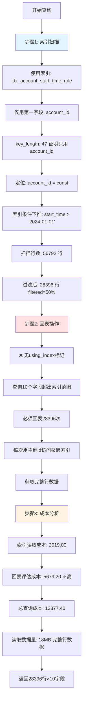

---

> 性能影响分析

```
回表成本 = 28396 次随机IO
        ≈ eval_cost: 5679.20
        ≈ 总成本的 42%（5679/13377）
```

**如果是覆盖索引（无需回表）：**

```
只需扫描索引 → 成本约降低 40-50%
```


> 执行sql与结果

```sql
-- 查询SQL
EXPLAIN FORMAT=JSON SELECT * FROM tb_sys_user_operation 
WHERE account_id = 'wind1' 
  AND start_time > '2024-01-01';
```

```java
{
  "query_block": {
    "select_id": 1,
    "cost_info": {
      "query_cost": "13377.40"
    },
    "table": {
      "table_name": "tb_sys_user_operation",
      "access_type": "ref",
      "possible_keys": [
        "idx_account_start_time_role",
        "idx_start_time"
      ],
      "key": "idx_account_start_time_role",
      #只用了索引第一个字段
      #索引包含：account_id + start_time + role
	  #实际只用了 account_id 定位
      "used_key_parts": [
      "account_id"
      ],
      #只用了account_id的长度
      "key_length": "47",
      "ref": [
        "const"
      ],
      #索引扫描56792行
      "rows_examined_per_scan": 56792,
      #过滤后28396行，回表28396次获取完整数据，如果是覆盖索引，cost会更低
      "rows_produced_per_join": 28396,
      "filtered": "50.00",
      #⚠️ 索引条件下推，在索引层过滤，但仍需回表
      "index_condition": "(`wstock_crmservice_db`.`tb_sys_user_operation`.`start_time` > '2024-01-01')",
      "cost_info": {
        #索引读取成本
        "read_cost": "2019.00",
        #数据评估成本（回表成本高），eval_cost 较高说明有大量回表操作
        "eval_cost": "5679.20",
        #总成本
        "prefix_cost": "13377.40",
        #读取18MB数据：如果是覆盖索引，只读索引数据（几MB），读取18MB说明访问了完整的数据行
        "data_read_per_join": "18M"
      },
      #关键证据，查询的这些字段并没有完全包含在索引中，故此肯定回表
      #✅ 查询字段超出索引范围 → 必须回表
      #你的结果中没有这个字段，说明就是回表"extra": "Using index"  
      // ❌ 如果有这个，才是覆盖索引

      "used_columns": [
        "id",
        "account_id",
        "role",
        "start_time",
        "load_time",
        "method",
        "description",
        "url",
        "create_time",
        "update_time"
      ]
    }
  }
}
```


---

###### 2. 覆盖索引（避免回表）

```sql
-- 查询SQL（只查询索引中已有的列）
EXPLAIN FORMAT=JSON SELECT account_id, start_time, role, id 
FROM tb_sys_user_operation 
WHERE account_id = 'wind1' 
  AND start_time > '2024-01-01';
```

**执行过程：**

**步骤1：** 在 `idx_account_start_time_role` 索引树中查找

```
→ 找到：('wind1', '2024-01-01 10:30:00', 1, id=1001)
```

**步骤2：** 索引已包含 account_id、start_time、role、id，**无需回表**

```
→ 直接返回结果
```

这就是**"覆盖索引"** - 查询的列都在索引中


>流程图

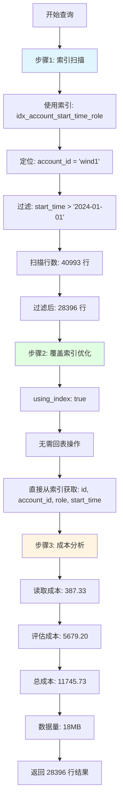


```java
{
  "query_block": {
    "select_id": 1,
    "cost_info": {
      "query_cost": "11745.73"
    },
    "table": {
      "table_name": "tb_sys_user_operation",
      "access_type": "range",
      "possible_keys": [
        "idx_account_start_time_role",
        "idx_start_time"
      ],
      "key": "idx_account_start_time_role",
      "used_key_parts": [
        "account_id",
        "start_time"
      ],
      "key_length": "51",
      "rows_examined_per_scan": 40993,
      "rows_produced_per_join": 28396,
      "filtered": "100.00",
      #关键标记： "using_index": true ✅，这是覆盖索引的明确标志
      "using_index": true,
      "cost_info": {
        #很低（只读索引）
        "read_cost": "387.33",
        #计算成本，不是回表成本
        "eval_cost": "5679.20",
        #总成本 11745.73 < 回表版本的 13377.40
        "prefix_cost": "11745.73",
        #18M 是从索引读取的数据量，直接从二级索引返回所有数据，没有访问聚簇索引
        "data_read_per_join": "18M"
      },
      #所有查询字段都在索引中 ✅
      "used_columns": [
        "id",
        "account_id",
        "role",
        "start_time"
      ],
      "attached_condition": "((`wstock_crmservice_db`.`tb_sys_user_operation`.`account_id` = 'wind1') and (`wstock_crmservice_db`.`tb_sys_user_operation`.`start_time` > '2024-01-01'))"
    }
  }
}
```


 **结论：完全走了覆盖索引，无需回表，性能最优。** 


---

###### 3. 性能对比

```sql
-- 会回表（需要查description、url等字段）
SELECT account_id, description, url 
FROM tb_sys_user_operation 
WHERE account_id = 'wind1';

-- 不回表（覆盖索引）
SELECT account_id, start_time, role 
FROM tb_sys_user_operation 
WHERE account_id = 'wind1';
```

**验证方法：**
```sql
EXPLAIN SELECT account_id, start_time, role 
FROM tb_sys_user_operation 
WHERE account_id = 'wind1';
-- Extra显示：Using index（覆盖索引，无回表）

EXPLAIN SELECT * 
FROM tb_sys_user_operation 
WHERE account_id = 'wind1';
-- Extra无"Using index"（有回表）
```


#### 索引下推


##### 定义

索引下推是MySQL5.6引入的查询优化技术，允许存储引擎层**在索引遍历过程中，直接过滤掉不符合条件的记录**，减少回表次数。


##### 工作原理

###### 1.没有索引下推

1. 存储引擎根据索引条件查找数据
2. 返回所有匹配索引的记录到Server层
3. Server层再根据where条件过滤数据。


###### 2.有索引下推

1. 存储引擎根据索引条件查找数据
2. **在存储引擎层直接用索引中的字段进行WHERE条件判断**
3. 只返回符合条件的记录到Server层
4. 减少回表和Server层的数据传输


###### 3.示例索引下推

```sql
-- 假设有联合索引(name, age)
SELECT * FROM user WHERE name LIKE '张%' AND age = 25;
```

> 无ICP流程：

1. 通过name索引找到所有'张%'开头的记录
2. 回表获取完整行数据
3. Server层判断age是否等于25


> 有ICP流程：

1. 通过name索引找到所有'张%'开头的记录
2. **在索引中直接判断age是否等于25**（索引下推）
3. 只对符合条件的记录回表


###### 5.判断依据

 在Extra列中显示"Using index condition"表示使用了索引下推 

```java
Using index condition
```


### 索引的类型


#### 类型划分

```mermaid
graph TD
    A[MySQL 索引 Index] --> B1[物理层 Physical Layer<br> 存储结构]
    A --> B2[逻辑层 Logical Layer<br> 索引语义]
    A --> B3[策略层 Optimizer Layer<br> 使用与优化策略]

    %% ---------------------
    %% 物理层
    %% ---------------------
    B1 --> C1[B+Tree 索引 InnoDB默认结构 支持范围与等值查询]
    B1 --> C2[Hash 索引 内存表Memory 仅支持等值查询]
    B1 --> C3[Fulltext 索引 全文检索 用于文本内容匹配]
    B1 --> C4[Spatial 索引R-Tree结构 用于地理空间数据]

    %% ---------------------
    %% 逻辑层
    %% ---------------------
    B2 --> D1[主键索引 Primary Key 唯一标识行记录 聚簇索引]
    B2 --> D2[唯一索引 Unique Key保证列值唯一 可为NULL]
    B2 --> D3[普通索引 Normal Index最常见的查询加速索引]
    B2 --> D4[复合索引 Composite Index多列组合索引 遵守最左前缀原则]

    %% ---------------------
    %% 策略层
    %% ---------------------
    B3 --> E1[最左前缀原则 Leftmost Prefix索引字段的顺序影响命中率]
    B3 --> E2[覆盖索引 Covering Index查询列完全被索引覆盖 无需回表]
    B3 --> E3[索引下推 ICP<br>Index Condition Pushdown 减少回表次数]
    B3 --> E4[前缀索引 Prefix Index<br>索引字符串前N个字符 节省空间]

    %% 样式优化
    style A fill:#1f2937,stroke:#fff,color:#fff,fontWeight:bold
    style B1 fill:#2563eb,color:#fff
    style B2 fill:#059669,color:#fff
    style B3 fill:#f59e0b,color:#fff
    style C1,C2,C3,C4 fill:#3b82f6,color:#fff
    style D1,D2,D3,D4 fill:#10b981,color:#fff
    style E1,E2,E3,E4 fill:#fbbf24,color:#000

```


| 层级                         | 名称                               | 核心职责                                         |
| ---------------------------- | ---------------------------------- | ------------------------------------------------ |
| **物理层 (Physical Layer)**  | 定义了索引在存储引擎中的结构形态。 | 决定能支持哪些类型的查询（范围、模糊、空间等）。 |
| **逻辑层 (Logical Layer)**   | 定义了索引在 SQL 语义上的用途。    | 决定索引是否唯一、是否为主键、是否复合。         |
| **策略层 (Optimizer Layer)** | 决定优化器如何使用索引。           | 影响是否命中、是否回表、是否覆盖查询。           |


#### 逻辑类型 vs 物理结构 的对应关系

| 逻辑层索引类型                | 唯一性            | 聚簇性   | 底层结构                   | 是否回表 | 说明                         |
| ----------------------------- | ----------------- | -------- | -------------------------- | -------- | ---------------------------- |
| **主键索引（Primary Key）**   | ✅ 唯一            | ✅ 聚簇   | **B+Tree**                 | ❌ 不需要 | 叶子节点直接存整行数据       |
| **唯一索引（Unique Key）**    | ✅ 唯一            | ❌ 非聚簇 | **B+Tree**                 | ✅ 需要   | 叶子节点存储主键值           |
| **普通索引（Index / Key）**   | ❌ 可重复          | ❌ 非聚簇 | **B+Tree**                 | ✅ 需要   | 叶子节点存储主键值           |
| **复合索引（Composite Key）** | 可唯一 / 可非唯一 | ❌ 非聚簇 | **B+Tree**                 | ✅ 需要   | 逻辑上由多个字段组成同一棵树 |
| **全文索引（Fulltext）**      | ❌                 | ❌        | 倒排索引（Inverted Index） | ❌        | 特殊用途，文本检索           |
| **空间索引（Spatial）**       | ❌                 | ❌        | R-Tree                     | ❌        | 用于地理空间坐标             |


#### 聚簇索引(Clustered Index)与非聚簇索引(Secondary Index)

- 定义与区别
- InnoDB的聚簇索引特性


##### 定义与区别

###### 1.数据即索引：

- 叶子节点 = 完整的数据行
- 索引顺序 = 数据存储顺序


###### 2.一张表只能有一个聚簇索引

- 因为数据只能按一种物理顺序存储
- InnoDB中主键就是聚簇索引


###### 3.InnoDB的聚簇索引结构：

```text
根节点：主键索引
   ↓
中间节点：主键索引
   ↓
叶子节点：主键 + 完整数据行（所有字段）
```


###### 与非聚簇索引（二级索引）对比：

| 特性         | 聚簇索引     | 非聚簇索引     |
| ------------ | ------------ | -------------- |
| 叶子节点存储 | 完整数据行   | 主键值（指针） |
| 查询性能     | 一次查询即可 | 可能需要回表   |
| 每表数量     | 只有1个      | 可以多个       |
| InnoDB中     | 主键索引     | 其他索引       |

举例：

```sql
-- 主键索引（聚簇索引）
SELECT * FROM user WHERE id = 100;  -- 直接从叶子节点获取完整数据

-- 普通索引（非聚簇索引）
SELECT * FROM user WHERE name = 'Tom';  -- 先找到主键id，再回表查完整数据
```


##### 聚簇与非聚簇查询流程(重点)

###### 聚簇索引查询流程*


1. 第一次IO：访问第二层
2. 第二次IO：访问叶子层，**直接获得完整数据行**
3. 查询结束，共2次IO


###### 非聚簇索引查询流程：


1. 第一次IO：访问第二层
2. 第二次IO：访问叶子层，**获得主键值**
3. 第三次IO：拿着主键值回到聚簇索引的第二层
4. 第四次IO：访问聚簇索引叶子层，**获得完整数据行**
5. 查询结束，共4次IO


 

###### 这就是为什么说"回表"会影响性能

- 聚簇索引：2次IO
- 非聚簇索引：4次IO（多了2次回表的IO）

 

###### 优化方案

 使用**覆盖索引**（索引中已包含所需的所有字段），这样就不需要回表，非聚簇索引也只需要2次IO。


##### 什么适合作为聚簇索引(主键)呢？

###### 1.自增整数（最推荐）

```sql
id BIGINT PRIMARY KEY AUTO_INCREMENT
```


> 优点

1. 顺序插入，数据追加到末尾
2. 避免页分裂，减少碎片
3. 占用空间少(4或8字节)
4. 查询效率高


###### 2.单调递增的值

1. 时间戳(秒级)
2. 雪花ID(SnowFlake)


##### 不适合作为聚簇索引的情况

###### ❌ UUID/GUID（随机字符串）

> 问题

1. 无序插入导致频繁页分裂
2. 占用空间大（36字节）
3. 索引树频繁调整，性能差


###### ❌ 过长的字段

```sql
email VARCHAR(255) PRIMARY KEY  -- 不推荐
```


> 问题：

1. 二级索引的叶子节点存储主键值
2. 主键越大，所有索引占用空间越大


###### ❌ 频繁更新的字段

```sql
status INT PRIMARY KEY  -- 不推荐
```


> 问题

1. 更新主键=删除 + 插入
2. 所有二级索引都要更新


###### ❌ 业务字段（可能重复）

```sql
user_name VARCHAR(50) PRIMARY KEY  -- 不推荐
```


> 问题

1. 可能需要修改
2. 可能不唯一
3. 业务逻辑变化影响索引


##### 主键选择方案对比

| 方案     | 优点               | 缺点             | 适用场景   |
| -------- | ------------------ | ---------------- | ---------- |
| 自增ID   | 性能最优，顺序插入 | 分布式环境ID冲突 | 单机数据库 |
| 雪花ID   | 全局唯一，趋势递增 | 依赖时钟         | 分布式系统 |
| UUID     | 全局唯一，无依赖   | 无序，性能差     | 极少使用   |
| 业务字段 | 符合业务逻辑       | 可能变更，性能差 | 不推荐     |


> 推荐方案

###### 1、单机环境

```sql
CREATE TABLE user (
    id BIGINT PRIMARY KEY AUTO_INCREMENT,
    ...
);
```


###### 2、分布式环境

```sql
CREATE TABLE order (
    id BIGINT PRIMARY KEY,  -- 应用层生成雪花ID
    ...
);
```


###### 核心原则

小、稳定、递增


##### 非聚簇索引的工作原理


###### 1、存储结构对比

```java
CREATE TABLE user (
    id INT PRIMARY KEY AUTO_INCREMENT,     -- 聚簇索引
    name VARCHAR(50),
    age INT,
    INDEX idx_name(name)                   -- 非聚簇索引
);
```


###### 2、聚簇索引（主键）

```java
B+树叶子节点存储完整行数据
        [10, 20, 30]
       /     |      \
  [id=1]   [id=10]  [id=20]
   ↓         ↓        ↓
(1,'张三',25) (10,'李四',30) (20,'王五',28)
```


###### 3、非聚簇索引(name)

```java
B+树叶子节点只存储：索引列值 + 主键值
        ['李','王','张']
       /      |       \
  ['李四']  ['王五']  ['张三']
     ↓        ↓        ↓
   (李四,10) (王五,20) (张三,1)
    索引值    主键值
```


#### 1.B+树索引

##### 基本概念与结构

B+树是MySQL InnoDB存储引擎使用的索引数据结构，是B树的变种，专为磁盘存储和数据库查询优化设计。

**唯一索引、主键索引、普通索引、复合索引**则是在“逻辑层语义”的不同定义。

它们都建立在同一种物理结构：B+ Tree上。


##### 为何唯一、主键、普通、复合都要用B+ Tree ?

1. **有序性**：能支持范围查找(`>`，`<`,`BETWEEN`,`LIKE 'abd%'`)
2. **高扇出型(Fan-out)**：每个节点能容纳成百上千个key，树的层数极低。
3. **磁盘友好**：每个节点正好对应一个页(16KB),减少I/O。
4. **自平衡**：插入删除后仍然维持平衡，性能稳定。
5. **叶子链表结构**：天然支持范围扫描。

>相比之下

- B-Tree查找性能相似，但每层都存数据，不利于范围扫描
- Hash索引无法做范围查询
- 红黑树/AVL树适合内存结构，不适合磁盘页存储


因此，在磁盘数据库中，B+Tree是性能与稳定性兼得的最优结构。


##### 除了主键聚簇索引外其它B+树实现索引都属于二级索引

###### 二级索引（唯一索引、普通索引、复合索引）

- 叶子节点不存整行数据，只存**主键值**。
- 查询时需 **“先定位主键 → 再通过主键去聚簇索引查整行数据”**。

> 📍 这一步叫 **“回表 (Back to Clustered Index)”**。

```mathematica
普通索引 B+Tree
    ├── key1 → pk=101
    ├── key2 → pk=102
    └── key3 → pk=103

聚簇索引 B+Tree
    ├── pk=101 → 行数据A
    ├── pk=102 → 行数据B
    └── pk=103 → 行数据C
```


###### 适用场景：范围查询、等值查询

>范围查询

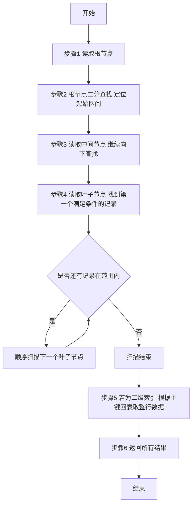


🧠 **解释说明：**

- 从根节点二分定位到“起始键值”所在的叶子页；
- 然后沿着叶子页的**链表指针顺序扫描**后续页；
- 直到键值超出范围；
- 若是二级索引，则根据主键去聚簇索引取整行数据；
- 最终返回结果集。


>等值查询

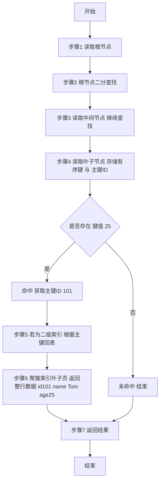


###### 优缺点分析

>上述回答为何唯一、主键、普通、复合都要用B+ Tree ?已经解释了优点，那么缺点呢？

> B+Tree 索引的典型缺点

| 缺点                                  | 说明                                                         |
| ------------------------------------- | ------------------------------------------------------------ |
| **1. 插入与删除成本高**               | B+Tree 为保持有序结构，需要在插入时找到准确位置并可能触发“页分裂”；删除时可能导致“页合并”；频繁操作时性能不稳定。 |
| **2. 随机插入导致页分裂频繁**         | 如果主键不是自增（如 UUID、哈希字符串），新纪录插入时位置随机，会频繁触发页分裂、页移动、碎片化，降低插入效率。 |
| **3. 范围扫描仍然受磁盘顺序影响**     | 虽然叶子节点有链表连接，但跨页扫描仍需多次磁盘 I/O，尤其在大范围查询时，速度明显慢于内存索引结构。 |
| **4. 内存占用较大**                   | 节点指针、页元数据、页目录都会额外消耗空间，一棵索引树往往比哈希表占用更多内存。 |
| **5. 不适合高并发频繁写入**           | 写操作需要锁定相关页并维护平衡，插入热点区（例如聚簇索引尾部）会成为“写入瓶颈”。 |
| **6. 不支持非前缀模糊匹配与复杂计算** | 对 `LIKE '%abc'` 或 `WHERE f(a)=1` 无法使用索引，因为破坏了有序性。 |
| **7. 重建代价高**                     | 当数据量巨大、索引碎片严重时，需要 `OPTIMIZE TABLE` 或重建索引才能恢复性能。 |


> 为什么 InnoDB 仍然坚持用 B+Tree

因为在 **通用业务场景** 下，它的综合收益远大于代价。
 MySQL 设计理念是“以读为主，写为辅”，而 B+Tree 在以下场景中几乎无敌：

| 查询类型   | 表现         | 说明                     |
| ---------- | ------------ | ------------------------ |
| 等值查询   | ✅ 快         | O(logN) 定位唯一路径     |
| 范围查询   | ✅ 快         | 叶子链表顺序扫描         |
| 排序查询   | ✅ 快         | 索引天然有序             |
| 模糊前缀   | ✅ 快         | 最左前缀优化             |
| 高频更新   | ⚠️ 可接受     | 页分裂可控、写放大可优化 |
| 高并发写入 | ⚠️ 需自增主键 | 避免随机插入导致页分裂   |

所以它不是“完美”，而是“通用性能最优解”。


> 与其他索引结构的对比分析

| 索引类型             | 优点                       | 缺点                                   | 适用场景                   |
| -------------------- | -------------------------- | -------------------------------------- | -------------------------- |
| **B+Tree**           | 范围、等值、排序查询都高效 | 插入有序开销、写放大、碎片化           | 通用 OLTP 业务             |
| **Hash**             | 等值查询极快               | 不支持范围、排序、模糊；冲突时性能抖动 | 内存表、缓存键值查询       |
| **SkipList（跳表）** | 插入删除简单、支持并发优化 | 空间大、范围扫描略慢                   | 内存KV系统（如 Redis）     |
| **LSM-Tree**         | 顺序写极快、适合写多读少   | 范围查询慢、延迟合并                   | 写密集型场景（如 RocksDB） |
| **BitMap**           | 聚合统计快、压缩好         | 只适合低基数字段                       | OLAP 分析类系统            |
| **R-Tree**           | 空间多维数据查询           | 不适合普通行记录                       | GIS 地理数据场景           |

> 🔍 **总结一句话：**
>  InnoDB 用 B+Tree 是因为它在“读多写少、范围查询常见”的关系型数据库场景中最平衡。
>  但在日志型（LSM）、KV型（Hash / SkipList）或分析型（BitMap）场景中，B+Tree 就不是最佳选择。


> 优化建议（面试重点）

| 问题       | 优化建议                               |
| ---------- | -------------------------------------- |
| 页分裂频繁 | 主键改用自增 ID，或用雪花算法顺序 ID   |
| 插入性能差 | 批量插入前先关闭索引再重建             |
| 索引过多   | 只保留最常用的、命中率高的组合索引     |
| 碎片严重   | 使用 `OPTIMIZE TABLE` 重建或导出再导入 |
| 读写冲突   | 使用 Buffer Pool 提升缓存命中率        |

------


> 总结记忆

| 结论                                   | 含义                        |
| -------------------------------------- | --------------------------- |
| B+Tree 是关系型数据库的黄金结构        | 一棵树解决了 90% 的查询场景 |
| 优点：查得快、扫得稳                   | 等值、范围、排序一把梭      |
| 缺点：写入贵、随机插入痛               | 但可通过顺序主键+缓冲优化   |
| 替代结构：Hash / LSM / BitMap / R-Tree | 各有专长，不通用            |


#### 2.哈希索引

>MySQL并不适合哈希索引

| 对比维度 | MySQL (B+Tree) | Redis (Hash Table)         |
| -------- | -------------- | -------------------------- |
| 存储介质 | 磁盘为主       | 内存为主                   |
| 数据结构 | 页 + B+Tree    | 哈希表 + 跳表              |
| 范围查询 | 支持           | 不支持                     |
| 等值查询 | 快（O(logN)）  | 极快（O(1)）               |
| 事务支持 | ACID（重量级） | Lua 或 MULTI（轻量）       |
| 并发机制 | 锁 + MVCC      | 单线程无锁                 |
| 典型应用 | 持久化关系查询 | 缓存、KV存储、会话、排行榜 |


#### 3.全文索引

###### 适用场景：文本搜索

###### 实现方式与限制

###### 使用限制与优化建议


#### 4.空间索引

###### 用于地理位置数据

###### 实现原理及适用场景


#### 5.复合索引

###### 定义与使用：多列索引

###### 使用原则与优化策略

###### 最左前缀原则(Leftmost Prefix Principle)

- 最左前缀原则的定义与重要性
- 具体规则与实例演示
- 复合索引(a,b,c)的查询命中规则
- 能否命中(b,c)、(a,c)、(c)等查询?
- 与索引失效的关系


#### 6.唯一索引与主键索引

###### 区别与联系

###### 索引的唯一性与数据完整性

###### 为什么主键建议使用自增ID?

- 自增ID的优势
- UUID等其他主键方式的问题


### 索引失效


#### 失效的常见原因

1. 使用了函数：如`where YEAR(date_column) = 2025`。
2. 数据类型不匹配：如`VARCHAR`与`INT`类型比较。
3. 使用了`OR`条件。
4. 连接条件不符合索引前缀：如`AND col1 = ? AND col2 = ?`。
5. 使用了模糊查询(`LIKE`)时的前缀问题：`LIKE 'abc%'` VS `LIKE '%abc%'`。
6. 使用`NOT IN`、`!=`、`<>`等否定条件
7. 在索引列上使用`IS NULL`或`IS NOT NULL`(部分情况)
8. 隐式类型转换:字符串不加引号导致的转换
9. 索引列参与计算:如`WHERE id + 1 = 10`
10. 优化器判断全表扫描更快:数据量小或选择性差时


#### 如何避免索引失效

1. 优化查询语句，避免使用函数或类型不匹配。
2. 确保条件顺序与复合索引的最左前缀原则一致
3. 针对模糊查询的优化技巧


#### 执行计划分析(explain)


##### 如何使用EXPLAIN分析查询

- EXPLAIN的基本语法
- EXPLAIN输出结果详解


##### 关键字段解读

- **id**:查询序列号
- **select_type**:查询类型(SIMPLE、PRIMARY、SUBQUERY等)
- **table**:访问的表
- **type**:访问类型(system、const、eq_ref、ref、range、index、ALL)
- **possible_keys**:可能使用的索引
- **key**:实际使用的索引
- **key_len**:索引长度
- **ref**:索引的哪一列被使用
- **rows**:扫描的行数
- **Extra**:额外信息(Using index、Using where、Using filesort等)


##### 通过执行计划判断索引是否生效

- 如何识别好的执行计划
- 如何识别需要优化的执行计划


### 优化策略


#### 1.选择合适的索引类型

>针对查询的类型选择合适的索引(范围查询 VS 等值查询)


#### 2.索引设计的实战技巧

- 区分度(Cardinality)的概念
  - 什么是索引区分度
  - 如何计算区分度
- 如何选择索引列(高区分度列优先)
  - 频繁查询的列优先
  - WHERE、ORDER BY、GROUP BY中的列
- 索引长度限制(InnoDB单列索引最大767字节)
  - 如何处理超长字段
- 前缀索引的使用场景
  - 什么是前缀索引
  - 如何选择合适的前缀长度


#### 3.避免冗余索引

- 如何判断索引是重复
- 使用`SHOW INDEX`查看表中的索引


#### 4.合理使用复合索引

- 索引列的顺序对性能的影响
- 如何根据查询条件设计复合索引


#### 5.覆盖索引

- 什么是覆盖索引？
- 覆盖索引如何提高查询效率？


#### 6.索引下推(Index Condition Pushdown, ICP)

- 什么是索引下推?
- MySQL 5.6+ 的重要优化特性
- ICP的工作原理与性能提升
- 与传统索引查询的对比


#### 7.分区索引与全局索引

- 分区表的索引优化策略。
- 全局索引与局部索引的区别与应用场景。


### 索引与数据库性能

- 索引带来的性能影响
  - 索引在查询时提高了效率，但也会增加更新、插入、删除操作的开销。
- 如何平衡索引的使用
  - 如何权衡查询效率与维护成本、避免过度索引
- 如何优化大表的索引
  - 针对大表的索引设计与优化技巧


### 索引的维护与优化

- 索引的碎片化问题
  - 索引如何产生碎片，碎片对性能的影响
  - 如何使用`optimize table`来优化索引
- 定期审查和重建索引
  - 定期检查和删除不再使用的索引。
  - 如何在生产环境中进行索引重建
- 自动化工具
  - 使用工具(如 Percona Toolkit)进行索引分析和优化


### MySQL新版本索引特性

#### MySQL 8.0的新特性

- 隐藏索引(Invisible Index)
  - 什么是隐藏索引
  - 使用场景:测试删除索引的影响
- 降序索引(Descending Index)
  - 真正的降序索引支持
  - 与ORDER BY DESC的性能提升
- 函数索引(Functional Index)
  - 在表达式上创建索引
  - 解决函数导致索引失效的问题


### 案例分析

常见查询优化的案例

- 针对实际项目中的查询问题,如何通过设计合适的索引来解决

#### 慢查询定位与优化流程

- 如何开启慢查询日志
- 分析慢查询日志
- 定位问题SQL
- 优化步骤与验证

索引优化的最佳实践

- 常见索引优化技巧和成功的应用案例


### 高频面试题汇总

#### 理论题

1. 为什么用B+树而不是B树或红黑树?
2. 为什么主键建议使用自增ID?
3. 聚簇索引和非聚簇索引的区别?
4. 什么是回表?如何避免?
5. 什么是覆盖索引?
6. 什么是最左前缀原则?
7. 什么是索引下推?

#### 场景题

1. 联合索引(a,b,c),能否命中(b,c)的查询?
2. 什么情况下索引会失效?
3. 如何判断是否需要创建索引?
4. 如何优化`LIKE '%abc%'`这样的查询?
5. 为什么不建议使用`SELECT *`?
6. 索引越多越好吗?为什么?


### 总结与学习建议

- 索引优化的关键点回顾
- 在实际开发中如何逐步优化查询性能


##### 常见查询优化的案例

- 针对实际项目中的查询问题，如何通过设计合适的索引来解决


##### 索引优化的最佳实践

- 常见索引优化技巧和成功的应用案例


## 三、存储引擎篇：InnoDB 深度机制

> 📌目标：掌握 MySQL 运行时的存储与事务基础，这是大厂必问重点。

#### 1️⃣ InnoDB 存储结构

-  页（Page）结构：数据页、索引页、Undo 页
-  表空间（Tablespace）、段（Segment）、区（Extent）

> 💬 考察：理解 InnoDB IO 层原理
>  🎯 难度：★★☆

#### 2️⃣ 缓冲池（Buffer Pool）

-  缓存机制（LRU链表、Free链表、Flush链表）
-  Double Write Buffer（双写缓冲区）
-  Redo Log Buffer & Checkpoint

> 💬 考察：写入机制与崩溃恢复
>  🎯 难度：★★★

#### 3️⃣ 日志系统

-  Redo Log（物理日志，WAL机制）
-  Undo Log（逻辑日志，MVCC快照）
-  Binlog（三种格式：STATEMENT、ROW、MIXED）
-  三者关系：两阶段提交（2PC）

> 💬 考察：事务一致性与主从复制基础
>  🎯 难度：★★★


## 四、事务与锁篇（核心重点 🔥）

> 📌目标：大厂面试最常问模块，体现并发控制理解。

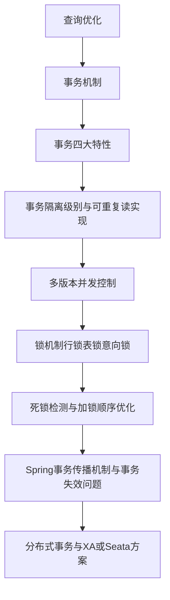


#### 1️⃣ 事务特性

-  ACID 四要素
-  MySQL 如何实现事务的原子性、一致性、隔离性、持久性

> 💬 考察：能否讲清楚 ACID 对应机制（Redo、Undo、锁）
>  🎯 难度：★★


##### 四大特征(ACID*)

>四大特征：原子性、一致性、隔离性、持久型！

| 特性          | 中文含义                             | 核心描述                                               | MySQL/InnoDB 实现机制                                    | 举例说明                                       |
| ------------- | ------------------------------------ | ------------------------------------------------------ | -------------------------------------------------------- | ---------------------------------------------- |
| **A：原子性** | 不可分割的最小单元                   | 要么全部执行，要么全部不执行                           | **undo log（回滚日志）**：记录修改前的旧值，用于回滚操作 | 用户转账时，A扣钱和B加钱必须同时成功或同时失败 |
| **C：一致性** | 数据从一个一致状态转到另一个一致状态 | 事务执行前后，数据满足所有约束（主键、外键、业务逻辑） | 依靠**原子性+隔离性+持久性**共同保障一致性               | 转账后，总余额不变：A少100，B多100，总额恒定   |
| **I：隔离性** | 并发事务之间互不干扰                 | 一个事务的中间状态对另一个事务不可见                   | **锁机制（行锁、间隙锁）** + **MVCC 快照机制**           | A正在转账，B不能读取A尚未提交的中间结果        |
| **D：持久性** | 事务一旦提交，数据永久保存           | 提交后即使宕机重启也能恢复                             | **redo log（重做日志）** + **binlog（二进制日志）**      | 转账成功后，服务器断电重启，数据仍然一致       |


###### 相互关系

- "undo log ——> 保证原子性(可回滚)"
- "redo log ——> 保证持久性(可恢复)"
- "锁机制/MVCC ——> 保证隔离性(防止并发读写冲突)
- "前三者共同保证一致性"


#### redo log(重做日志)


##### 属于谁？

属于InnoDB存储引擎(不是Server层)


##### 作用

1. 在事务提交后，如果还没把脏页写会磁盘，
2. "redo log"会记录这个"这个页的修改内容"
3. 当MySQL崩溃后，通过"redo log"重放修改，保证**已提交事务不丢！**


##### 问答


##### 为什么 redo log 文件大小“都是 3.12MB”？

>这是正常现象，原因在于

- InnoDB在启动时，会预先创建固定大小的redo日志文件。
- 这些文件组成这样一个循环写日志组。
- 文件大小由参数`innodb_redo_log_capacity`控制(MySQL8.0之后的参数)。


>举例解释

```nginx
E:\dataStore\MySQL\#innodb_redo
```


redo 文件大小固定 ≈ 3MB，不是 bug，而是 **InnoDB 的循环日志设计**。
 只有当你手动调整 `innodb_redo_log_capacity` 时，总容量才会变化。


##### 二、参数控制逻辑（MySQL 8.0）

MySQL 8.0 之后弃用了 `innodb_log_file_size`，改用：

```sql
SHOW VARIABLES LIKE 'innodb_redo_log_capacity';
```


redo log容器和调节(如需更大的吞吐)

>如果你的事务写入量非常大(比如万级QPS的批量insert/update)。
>
>可以在my.ini中[mysqld]段配置

```sql
innodb_redo_log_capacity=512M
```

修改后需要重启MySQL服务才生效

通常建议：

- 开发环境"64-128MB"
- 生产环境：256MB——1GB(视写入量定)


##### 三、写入原理复习（简化图）

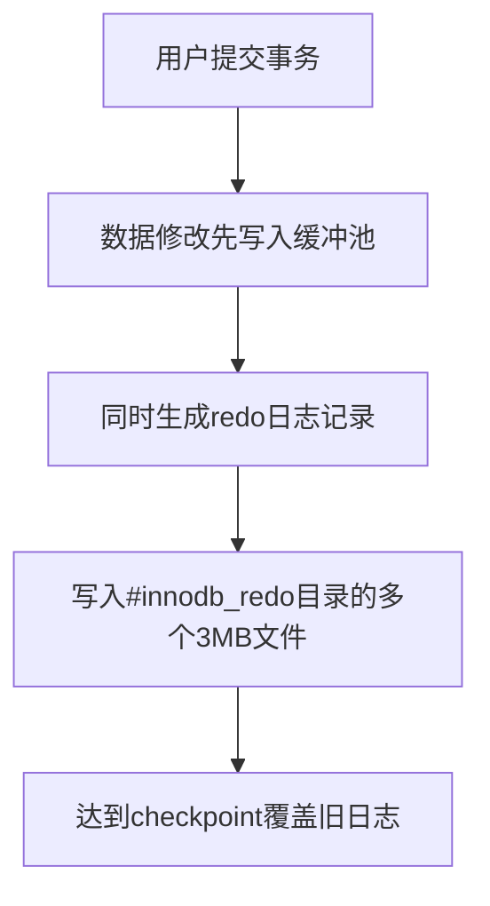


##### 状态总结

| 项                         | 值                       | 含义                 |
| -------------------------- | ------------------------ | -------------------- |
| `innodb_redo_log_capacity` | 104 857 600 B (≈ 100 MB) | 总日志容量           |
| 单文件大小                 | ≈ 3.12 MB                | 每个日志文件的固定块 |
| 文件数量                   | 100 / 3 ≈ 32 个          | 组成循环日志组       |
| 工作状态                   | ✅ 正常                   | 日志活跃循环写入中   |


# 书签


#### 2️⃣ 隔离级别与MVCC

-  四种隔离级别（RC / RR / SR / RU）
-  MVCC 原理（Undo log + Read View）
-  当前读（for update）vs 快照读
-  幻读与间隙锁（Gap Lock）

> 💬 考察：能否画出 MVCC 时间线，说明可重复读避免幻读
>  🎯 难度：★★★★

#### 3️⃣ 锁机制

-  行锁、表锁、意向锁、记录锁、间隙锁、Next-Key Lock
-  死锁分析：`SHOW ENGINE INNODB STATUS`
-  死锁预防策略与重试机制

> 💬 考察：是否具备排查并发死锁能力
>  🎯 难度：★★★★

------


## 五、性能调优篇

> 📌目标：评估候选人是否能落地优化实际慢查询。

#### 1️⃣ SQL 优化

-  慢查询日志（slow_query_log）
-  使用 `EXPLAIN`、`SHOW PROFILE`、`optimizer_trace` 分析
-  Limit + Offset 优化（分页优化方案）
-  JOIN 调优（驱动表、索引顺序）

> 💬 考察：能否诊断慢 SQL 原因
>  🎯 难度：★★

#### 2️⃣ 参数调优

-  innodb_buffer_pool_size、innodb_log_file_size
-  max_connections、query_cache_type
-  调优指标：QPS、TPS、命中率

> 💬 考察：是否理解数据库性能瓶颈来源
>  🎯 难度：★★★

#### 3️⃣ 表设计与反范式

-  范式（1NF、2NF、3NF）与反范式（适度冗余）
-  大表拆分：垂直拆分 / 水平分表
-  索引覆盖查询设计技巧

> 💬 考察：建模与架构层优化意识
>  🎯 难度：★★

------


## 六、高可用与分布式篇（大厂必考）

> 📌目标：考察能否支撑高并发分布式业务。

#### 1️⃣ 主从复制

-  基于 binlog 的异步复制、半同步复制
-  主从延迟原因及解决方案（延迟队列、读写分离）

> 💬 考察：架构级数据库设计经验
>  🎯 难度：★★★

#### 2️⃣ 分库分表

-  分库分表策略（水平 / 垂直）
-  分片键选择原则
-  跨库 Join、分页、排序的处理策略
-  分布式全局 ID 生成方案（雪花算法 / Leaf / Redis 自增）

> 💬 考察：能否设计海量数据架构
>  🎯 难度：★★★★

#### 3️⃣ 分布式一致性与高可用

-  主从切换与双写一致性问题
-  分布式事务（XA / TCC / 可靠消息最终一致）
-  Proxy 层（MyCat、ShardingSphere）机制

> 💬 考察：架构意识 + 一致性处理思路
>  🎯 难度：★★★★

------

### ✅ 六、实战与故障排查篇

> 📌目标：验证候选人是否能解决真实生产问题。

#### 1️⃣ 常见问题

-  表锁 / 行锁冲突排查
-  死锁日志分析
-  主从延迟监控
-  执行计划不稳定的原因

> 💬 考察：实操经验
>  🎯 难度：★★★

#### 2️⃣ 慢查询优化案例

-  explain 分析 type=ALL → 索引优化过程
-  group by + order by 优化
-  count(*) 性能问题（索引覆盖优化）

> 💬 考察：能否通过 explain + 经验调优
>  🎯 难度：★★★

#### 3️⃣ 真实案例题（面试常见）

-  「如何定位线上慢 SQL？」
-  「一个 UPDATE 语句卡死了，怎么排查？」
-  「高并发下如何保证库存不超卖？」
-  「如何快速恢复被误删的数据？」

> 💬 考察：实际生产能力
>  🎯 难度：★★★★

------


