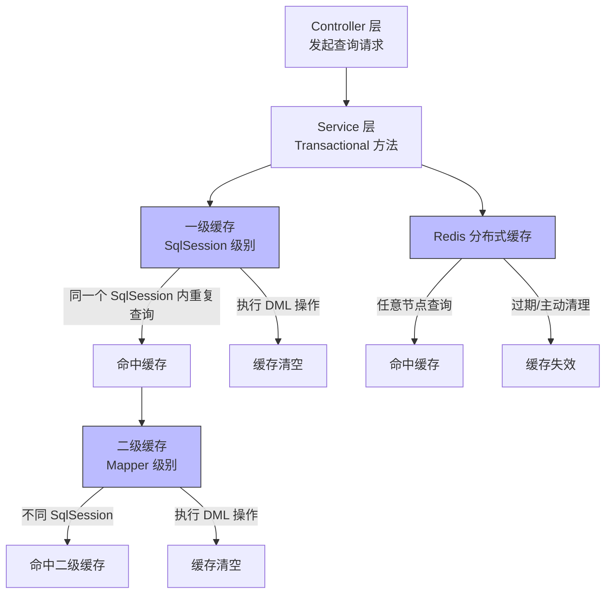

MyBatis
===

注：

​	可以将框架理解为帮助开发，被封装的工具，不必细究代码细节，重点源码原理做好笔记即可！


## 基础

#### myBatis的入门

官方文档地址：

https://mybatis.org/mybatis-3/index.html

 

入门基础需要掌握的以及开发环境：


github上面看源码等资料


###### 什么是框架？

   它是一套软件开发中的解决方案，不同框架解决的是不同的问题。

使用框架的好处：
     框架封装了很多的细节，使用开发者可以使用极简的方式实现功能，大大提高了开发效率。框架实际上算是半成品。

 

 

###### 三层架构

**1、表现层：**
    **是用于展示数据的**

**2、业务层：**
    **是处理业务需求的**

**3、持久层：**

​    **是与数据库交互的**

三层架构和SSM对应关系图


3、持久层技术解决方案

JDBC技术：
     Connection

 PreparedStatement

 ResultSet


##### 什么是**Mybatis**？


MyBatis 是一款优秀的持久层框架，它支持自定义 SQL、存储过程以及高级映射。**MyBatis 免除了几乎所有的 JDBC 代码以及设置参数和获取结果集的工作**。MyBatis 可以**通过简单的 XML 或注解来配置和映射原始类型、接口和 Java POJO（Plain Old Java Objects，普通老式 Java 对象）**为数据库中的记录。


- MyBatis可以使用简单的XML或注解来配置和映射原生类型，接口和Java的POJO(Plain     Old Java Objects,普通老式Java对象)为数据库中的记录
- MyBatis本是apache的一个开源项目iBatis,2010年这个项目由apache     software foundation 迁移到了google code,并且改名为MyBatis。
- 2013年11月迁移到Github。


如何获得Mybatis?

 

maven仓库：

https://mvnrepository.com/artifact/org.mybatis/mybatis/3.5.2

```html
<!-- https://mvnrepository.com/artifact/org.mybatis/mybatis -->
<dependency>
    <groupId>org.mybatis</groupId>
    <artifactId>mybatis</artifactId>
    <version>3.5.2</version>
</dependency>
```

Github：

https://github.com/mybatis/mybatis-3

中文文档：

https://mybatis.org/mybatis-3/index.html


##### **什么是持久化？**

数据持久化

**持久化就是将程序的数据在持久状态和瞬时状态转换的过程**

内存：断电即失

数据库(Jdbc)，io文件持久化

数据库(Jdbc),io文件持久化

生活:冷藏，罐头

 

为什么需要持久化？

有一些对象，不能让他丢掉

内存太贵了

 

1.4、为什么需要Mybatis?

帮助程序员将数据存入到数据库中

方便

传统的JDBC代码太复杂了，简化，框架，自动化

不用Mybatis也可以

它更容易上手，**技术没有高低之分**。

特点

- 简单易学：本身就很小且简单。没有任何第三方依赖，最简单安装只要两个jar文件+配置几个sql映射文件易于学习，易于使用，通过文档和源代码，可以比较完全的掌握它的设计思路和实现。
- 灵活：mybatis不会对应用程序或者数据库的现有设计强加任何影响。     sql写在xml里，便于统一管理和优化。通过sql语句可以满足操作数据库的所有需求。
- 解除sql与程序代码的耦合：通过提供DAO层，将业务逻辑和数据访问逻辑分离，使系统的设计更清晰，更易维护，更易单元测试。sql和代码的分离，提高了可维护性。
- 提供映射标签，支持对象与数据库的orm字段关系映射
- 提供对象关系映射标签，支持对象关系组建维护
- 提供xml标签，支持编写动态sql。 [2] 

 

 

最重要一点：使用的人多！

Spring SpringMVC SpringBoot

 


#### 第一个入门程序

思路：搭建环境-->导入Mybatis–>编写代码–>测试！

###### 首先配置环境

一、先配置sql表

```mysql
#创建表
CREATE DATABASE `mybatis`;

#使用表
USE mybatis;

#创建表
CREATE TABLE  `user`(
	`id` INT  NOT NULL PRIMARY KEY,
	`name` VARCHAR(30),
	`pwd` VARCHAR(30)
)DEFAULT CHARSET=utf8;

#插入数据
INSERT INTO `user`(id,`name`,pwd)
VALUES(1,'张无忌','123131'),
	  (2,'张上','123456'),
      (3,'李思','456675'),
      (4,'商上','123142');
```


二、创建普通maven项目


##### 三、删除src目录

这样就可以把它当成父工程了

为了在里面建子工程

```xml
<!--父工程-->
<groupId>org.example</groupId>
<artifactId>Mybatis-stady</artifactId>
<version>1.0-SNAPSHOT</version>

<!--子工程-->
//在此处编写子工程
```

好处：
	不需要重复去导入依赖了新建一个模块，它默认在父工程就有了

```xml
 <!--父工程-->
<groupId>org.example</groupId>
<artifactId>Mybatis-stady</artifactId>
<packaging>pom</packaging>
<version>1.0-SNAPSHOT</version>
<!--这样创建的好处就是不需要重复去导入依赖了新建一个模块，它默认就有了-->
<modules>
    <module>mybatis-01</module>
</modules>
```


##### 四、导入maven依赖

导入依赖

要使用 MyBatis， 只需将 [mybatis-x.x.x.jar](https://github.com/mybatis/mybatis-3/releases) 文件置于类路径（classpath）中即可。

如果使用 Maven 来构建项目，则需将下面的依赖代码置于 pom.xml 文件中：

```xml
<dependency>
  <groupId>org.mybatis</groupId>
  <artifactId>mybatis</artifactId>
  <version>x.x.x</version>
</dependency>
```


所以导入maven依赖

```xml
<!--导入依赖-->
<dependencies>
    <!--mysql驱动-->
    <dependency>
        <groupId>mysql</groupId>
        <artifactId>mysql-connector-java</artifactId>
        <version>5.1.47</version>
    </dependency>

    <!--mybatis-->
    <dependency>
        <groupId>org.mybatis</groupId>
        <artifactId>mybatis</artifactId>
        <version>3.5.2</version>
    </dependency>

    <!--junit-->
    <dependency>
        <groupId>junit</groupId>
        <artifactId>junit</artifactId>
        <version>4.12</version>
        <scope>test</scope>
    </dependency>
</dependencies>
```


##### 五、创建一个模块

在项目右键创建一个model


##### 六、配置核心文件

在**resource**目录下新建默认为**mybatis-config.xml**核心配置文件

 XML 配置文件中包含了对 MyBatis 系统的核心设置，包括**获取数据库连接实例的数据源（DataSource）**以及决定**事务作用域和控制方式的事务管理器（TransactionManager）** 


**mybatis-config.xml**

```xml
<?xml version="1.0" encoding="UTF-8" ?>
<!DOCTYPE configuration
        PUBLIC "-//mybatis.org//DTD Config 3.0//EN"
        "http://mybatis.org/dtd/mybatis-3-config.dtd">
<!--configuration核心配置文件-->
<configuration>
    <environments default="development">
        <environment id="development">
            <transactionManager type="JDBC"/>
            <dataSource type="POOLED">
                <property name="driver" value="${driver}"/>
                <property name="url" value="${url}"/>
                <property name="username" value="${username}"/>
                <property name="password" value="${password}"/>
            </dataSource>
        </environment>
    </environments>
</configuration>
```

上述mybatis-config.xml文件中相关配置信息解释

1.driver后面的value配置的是**相关数据库的驱动信息**

```xml
<!--com.mysql.jdbc.Driver配置mysql驱动-->
<property name="driver" value="com.mysql.jdbc.Driver"/>
```

2.接下来的url地址的配置最简单方式就是

如果驱动文件丢失，点击下载就可以了


获取url

较为完整的url如下：

```xml
                <property name="url" value="jdbc:mysql://localhost:3306/mybatis?
useSSL=true&amp;useUnicode=true&amp;characterEncoding=utf8"/>
```

```xml
<!--目录地址mybatis:对应库名  useSSL=true:安全模式开启  &amp:转义符号  useUnicode=true&amp;characterEncoding=UTF-8":使用Unicode字符编码为UTF-8-->
```


配置完成：

```xml
<?xml version="1.0" encoding="UTF-8" ?>
<!DOCTYPE configuration
        PUBLIC "-//mybatis.org//DTD Config 3.0//EN"
        "http://mybatis.org/dtd/mybatis-3-config.dtd">
<!--configuration核心配置文件-->
<configuration>
    <environments default="development">
        <environment id="development">
            <transactionManager type="JDBC"/>
            <dataSource type="POOLED">
                <!--com.mysql.jdbc.Driver配置mysql驱动-->
                <property name="driver" value="com.mysql.jdbc.Driver"/>
                <!--目录地址mybatis:对应库名  useSSL=true:安全模式开启  &amp:转义符号  useUnicode=true&amp;characterEncoding=UTF-8":开启中文编码-->
                <property name="url" value="jdbc:mysql://localhost:3306/mybatis?useSSL=true&amp;useUnicode=true&amp;characterEncoding=UTF-8"/>
                <property name="username" value="root"/>
                <property name="password" value="123456"/>
            </dataSource>
        </environment>
    </environments>
</configuration>
```


##### 七、构建

 SqlSessionFactory 的实例

```ASN.1
每个基于 MyBatis 的应用都是以一个 SqlSessionFactory 的实例为核心的。

SqlSessionFactory 的实例可以通过 SqlSessionFactoryBuilder 获得。

而 SqlSessionFactoryBuilder 则可以从 XML 配置文件或一个预先配置的 Configuration 实例来构建出 SqlSessionFactory 实例。 
```

​       从 XML 文件中构建 SqlSessionFactory 的实例非常简单，建议**使用类路径下的资源文件进行配置**。 但**也可以使用任意的输入流（InputStream）实例**，比如用文件路径字符串或 file:// URL 构造的输入流。**MyBatis 包含一个名叫 Resources 的工具类**，它包含一些实用方法，使得从类路径或其它位置加载资源文件更加容易。 

```java
String resource = "org/mybatis/example/mybatis-config.xml";
InputStream inputStream = Resources.getResourceAsStream(resource);
SqlSessionFactory sqlSessionFactory = new SqlSessionFactoryBuilder().build(inputStream);
```


###### 1.编写Mybatis工具类

```java
package com.Hao.utils;

import org.apache.ibatis.io.Resources;
import org.apache.ibatis.session.SqlSession;
import org.apache.ibatis.session.SqlSessionFactory;
import org.apache.ibatis.session.SqlSessionFactoryBuilder;

import java.io.IOException;
import java.io.InputStream;

/**
 * @Project_Name Mybatis-stady
 * @Author LH
 * @Date 2021/8/12 16:15
 * @TODO：工具类：通过sqlSessionFactory工厂获取到sqlSession
 * @Thinking:
        这个类就做了两件事情，就是：
            1.加载资源
            2.获取执行sql的对象
 */
public class MybatisUtils {

    //提升sqlSessionFactory的作用域
    private static SqlSessionFactory sqlSessionFactory;

    //static中的代码是使用Mybatis固定的三行代码，官方文档中也是//使用Mybatis获取到sqlSessionFactory对象
    //作用,加载资源
    static {
        try {
            //路径在resources下默认可以直接读取到
            String resource = "mybatis-config.xml";
            InputStream inputStream = Resources.getResourceAsStream(resource);
            sqlSessionFactory = new SqlSessionFactoryBuilder().build(inputStream);
        } catch (IOException e) {
            e.printStackTrace();
        }
    }

    /**
     有了 SqlSessionFactory，顾名思义，我们可以从中获得 SqlSession 的实例。SqlSession 提供了在数据库执行 SQL 命令所需的所有方法。
     你可以通过 SqlSession 实例来直接执行已映射的 SQL 语句
     作用获取执行sql的对象
     */
    public static SqlSession getSession(){
        //sql 会话工厂打开会话
        return sqlSessionFactory.openSession();
    }
}
```


###### 2.编写实体类

```java
package com.Hao.pojo;

/**
 * @Project_Name Mybatis-stady
 * @Author LH
 * @Date 2021/8/12 16:40
 * @TODO：实体类
 * @Thinking:   对应数据表中的字段添加添加getset,有参无参，toString
 */
public class User {
    private Integer id;
    private String name;
    private String pwd;

    public User() {
    }

    public User(Integer id, String name, String pwd) {
        this.id = id;
        this.name = name;
        this.pwd = pwd;
    }

    public Integer getId() {
        return id;
    }

    public void setId(Integer id) {
        this.id = id;
    }

    public String getName() {
        return name;
    }

    public void setName(String name) {
        this.name = name;
    }

    public String getPwd() {
        return pwd;
    }

    public void setPwd(String pwd) {
        this.pwd = pwd;
    }

    @Override
    public String toString() {
        return "User{" +
                "id=" + id +
                ", name='" + name + '\'' +
                ", pwd='" + pwd + '\'' +
                '}';
    }
}
```


###### 3.编写实现类

**Dao接口**

```xml
package com.Hao.dao;

import com.Hao.pojo.User;

import java.util.List;

/**
 * @Project_Name Mybatis-stady
 * @Author LH
 * @Date 2021/8/12 16:51
 * @TODO：定义一个接口获取到所有的User实体类中的内容
 * @Thinking:
 */
public interface UserDao {
    List<User> getUserList();
}
```


**接口Mapper配置文件**

```xml
<?xml version="1.0" encoding="UTF-8" ?>
<!DOCTYPE mapper
        PUBLIC "-//mybatis.org//DTD Mapper 3.0//EN"
        "http://mybatis.org/dtd/mybatis-3-mapper.dtd">
<!--namespace绑定一个对应的Dao/Mapper接口 实现原理就相当于实现了这个接口-->
<mapper namespace="com.Hao.dao.UserDao">
    <!--select查询语句-->
    <select id="getUserList" resultType="com.Hao.pojo.User">
        select * from mybatis.user
    </select>
</mapper>
```


##### 八、junit测试

1.出现的问题：

```xml
//MapperRegistry 不知道类型接口 com.Hao.dao.UserDao。
org.apache.ibatis.binding.BindingException: Type interface com.Hao.dao.UserDao is not known to the MapperRegistry.
```


解决方法：UserMapper.xml在Mybatis核心配置文件没有注册

```xml
<!--每一个Mapper.xml都需要在Mybatis核心配置文件(mybatis-config)中注册-->
<mappers>
    <mapper resource="com/Hao/dao/UserMapper.xml"/>
</mappers>
```


2.改完之后出现的错误：

```
Cause: org.apache.ibatis.builder.BuilderException: Error parsing SQL Mapper Configuration. Cause: java.io.IOException: Could not find resource com/Hao/dao/UserMapper.xml
```

maven由于它的约定大于配置，所以，遇到我们写的配置文件，可能会出现无法导出或者生效

解决方法：在每个pom文件中加上

```xml
<!--在build中配置resources，来防止资源导出失败的问题-->
<build>
    <resources>
        <resource>
            <directory>src/main/resources</directory>
            <includes>
                <include>**/*.properties</include>
                <include>**/*.xml</include>
            </includes>
            <filtering>true</filtering>
        </resource>
        <resource>
            <directory>src/main/java</directory>
            <includes>
                <include>**/*</include>
                <include>**/*.xml</include>
            </includes>
            <filtering>true</filtering>
        </resource>
    </resources>
</build>
```


3.出现错误：

```
Caused by: org.apache.ibatis.exceptions.PersistenceException: 
### Error building SqlSession.
### Cause: org.apache.ibatis.builder.BuilderException: Error creating document instance.  Cause: com.sun.org.apache.xerces.internal.impl.io.MalformedByteSequenceException: 1 字节的 UTF-8 序列的字节 1 无效。
```

在工具类中将原本的getSqlSession()方法，误写成了getSession()，导致的

```
//getSqlSession完全包含了面向数据库执行SQL命令所需的所有方法，一定不能写
```


> 思路：

搭建环境–>导入MyBatis–>编写代码–>测试


######  **1.编写mybatis的核心配置文件**

连接mysql 配置jdbc驱动 url username password 

######  **2.编写mybatis工具类** 

###### 3.编写代码：

1.**编写实体类**

 **2.调用Mapper接口** 

 **3.编写接口实现类** 

上文提到mybatis简化了jdbc的操作，所以可以通过一个xml配置文件来解决接口的实现
在接口包下创建一个xml文件， namespace绑定的就是上面我们创建的接口
在mapper标签内我们就可以封装所有sql的语法 例如select
语法中的id就相当于实现类的类名 ，result是结果 只记住两个即可（resultType和resultMap）顾名思义：Type是返回一个结果，Map是返回多个结果 ，所以这个返回的结果里面的名字就应该填这个数据库的实体类全包名，这里也就是pojo.User。

原文链接：https://blog.csdn.net/weixin_44976835/article/details/111399185


#### CRUD

##### 1、namespace

namespace中的包名要和Dao/mapper接口的包名一致！

##### 2、select

选择，查询语句：

```
id:就是对应namespace中的方法名;
resultType:Sql语句执行的返回值！
parameterType:参数类型！
```


实现三步，增删改查都差不多

**1.编写接口**

```java
public interface UserMapper {
    List<User> getUserLike(String value);
    //根据ID查询用户
    User getUserById(int id);
}
```


**2.编写对应的mapper.xml中的sql语句**

```xml
<select id="getUserById" resultType="com.Hao.pojo.User">
    select * from mybatis.user where id = #{id}
</select>
```


**3.测试**

```java
@Test
public void getUserById() {
    SqlSession sqlSession = MybatisUtils.getSqlSession();

    UserMapper mapper = sqlSession.getMapper(UserMapper.class);

    User user = mapper.getUserById(1);
    System.out.println(user);

    sqlSession.close();
}
```


##### 3、Insert

```xml
<!--对象中的属性，可以直接取出来-->
<insert id="addUser" parameterType="com.Hao.pojo.User">
    insert into mybatis.user (id, name, pwd) values (#{id},#{name},#{pwd});
</insert>
```


##### 4、update

```java
<update id="updateUser" parameterType="com.Hao.pojo.User">
    update mybatis.user set name=#{name},pwd=#{pwd}  where id = #{id} ;
</update>
```


##### 5、Delete

```java
<delete id="deleteUser" parameterType="int">
    delete from mybatis.user where id = #{id};
</delete>
```


**注意：**

==每次都需要关闭,而实现增删改则必须要提交事务！！！==

```java
//提交事务
sqlSession.commit();
//每次都要关闭一下
sqlSession.close();
```


##### 6.分析错误

标签不要匹配错(外层select标签)

```xml
<select id="getUserLike" resultType="com.Hao.pojo.User">
        select * from mybatis.user where name like "%"#{value}"%"
</select>
```


resource绑定mapper，需要使用路径！

```xml
<!--namespace=绑定一个对应的Dao/Mapper接口-->
<mapper namespace="com.Hao.dao.UserMapper">
```


程序配置文件必须符合规范！


NullPointerException,没有注册到资源！

输出的xml文件中存在中文乱码问题！

maven资源没有导出问题！

多个参数用map


##### 7.模糊查询？

根据需求有两种分类实现方法。

1.Java代码执行的时候，传递通配符% %

```java
List<User> userList = mapper.getUserLike("%李%");
```


2.在sql拼接中使用通配符！默认添加进去

```sql
select * from mybatis.user where name like "%"#{value}"%"
```


##### 8.万能的Map

假设，实体类或者数据库中的表，字段或者参数过多，我们应当考虑使用Map!


#### 配置解析

 核心配置文件

**mybatis-config.xml**

MyBatis的配置文件包含了会深深影响MyBatis行为的设置和属性信息

配置文档的顶层结构如下：

- configuration（配置）
  - **[properties（属性）](https://mybatis.org/mybatis-3/zh/configuration.html#properties)**
  - **[settings（设置）](https://mybatis.org/mybatis-3/zh/configuration.html#settings)**
  - **[typeAliases（类型别名）](https://mybatis.org/mybatis-3/zh/configuration.html#typeAliases)**
  - **[typeHandlers（类型处理器）](https://mybatis.org/mybatis-3/zh/configuration.html#typeHandlers)**
  - **[objectFactory（对象工厂）](https://mybatis.org/mybatis-3/zh/configuration.html#objectFactory)**
  - [plugins（插件）](https://mybatis.org/mybatis-3/zh/configuration.html#plugins)
  - **environments（环境配置）**
    - **environment（环境变量）**
      - **transactionManager（事务管理器）**
      - **dataSource（数据源）**
  - [databaseIdProvider（数据库厂商标识）](https://mybatis.org/mybatis-3/zh/configuration.html#databaseIdProvider)
  - [**mappers（映射器）](https://mybatis.org/mybatis-3/zh/configuration.html#mappers)**


##### **1.环境配置environments**

 MyBatis 可以配置成适应多种环境 

 **不过要记住：尽管可以配置多个环境，但每个 SqlSessionFactory 实例==只能选择一种环境==。** 

也就是当你有多套环境时候，要切换需要使用哪一套环境时：**default="“**中切换

```xml
<environments default="需要切换哪一套就在这里换成哪一套的id">
  <environment id="development">
    <transactionManager type="JDBC">
      <property name="..." value="..."/>
    </transactionManager>
    <dataSource type="POOLED">
      <property name="driver" value="${driver}"/>
      <property name="url" value="${url}"/>
      <property name="username" value="${username}"/>
      <property name="password" value="${password}"/>
    </dataSource>
  </environment>
</environments>
```


**事物管理器transactionManager**

- transactionManager共有两种配置：
- 但是**Mybatis默认的事物管理器就是JDBC**。
- **JDBC** – 这个配置**直接使用了 JDBC 的提交和回滚设施**，它依赖从数据源获得的连接来管理事务作用域。
- MANAGED – 这个配置几乎没做什么。它从不提交或回滚一个连接，而是让容器来管理事务的整个生命周期（比如 JEE 应用服务器的上下文）。


##### **2.数据源dataSource**

dataSource 元素使用标准的 JDBC 数据源接口来配置 JDBC 连接对象的资源。

- 虽然数据源配置是可选的，但如果**要启用延迟加载特性，就必须配置数据源**。

  有三种内建的数据源类型（也就是 type="[UNPOOLED|**POOLED**|JNDI]"）

**默认使用POOLED**– 这种数据源的**实现利用“池”的概念将 JDBC 连接对象组织起来，避免了创建新的连接实例时所必需的初始化和认证时间**。 这种处理方式很流行，**能使并发 Web 应用快速响应请求**。


##### 3.属性properties

我们可以**通过properties属性来实现引入配置文件**

 这些属性可以在外部进行配置，并可以进行动态替换。你**既可以在典型的 Java 属性文件中配置这些属性，也可以在 properties 元素的子元素中设置** 


1.编写一个外部配置文件(默认要放在resources路径下)

db.properties

```properties
driver=com.mysql.jdbc.Driver
url=jdbc:mysql://localhost:3306mybatis?useSSL=true&useUnicode=true&characterEncoding=UTF-8
username=root
password=123456
```


在核心配置文件中(注意编写位置)

```xml
<!--configuration核心配置文件-->
<configuration>
    <!--引入外部配置文件，默认在配置文件的此处开始编写，否则可能出现错误-->
    <properties resource="db.properties"/>

    <environments default="development">
        <environment id="development">
            <transactionManager type="JDBC"/>
            <dataSource type="POOLED">
                <property name="driver" value="${driver}"/>
                <property name="url" value="${url}"/>
                <property name="username" value="${username}"/>
                <property name="password" value="${password}"/>
            </dataSource>
        </environment>
    </environments>
```

在上面的properties中也可以添加属性配置(但是**在重复的情况下，优先使用外部配置文件中的属性**)

注意事项：
	1.可以直接引入外部文件

​	2.可以在其中增加一些属性配置


##### 4.类型别名typeAliases

###### **方式一**：指定类名

 类型别名可为 Java 类型设置一个缩写名字。 它仅用于 XML 配置，意在降低冗余的全限定类名书写 

```xml
<!--可以在引入外部配置文件下给实体类起别名-->
<typeAliases>
    <typeAlias type="com.Hao.pojo.User" alias="User"/>
</typeAliases>
```

 当这样配置时，`User` 可以用在任何使用 `com.Hao.pojo.User` 的地方。 

 

###### **方式二**：指定包名

也可以指定一个包名，MyBatis 会在包名下面搜索需要的 Java Bean 

```xml
    <typeAliases>
        <package name="com.Hao.pojo"/>
    </typeAliases>
如果使用pojo包下的类名(默认使用小写)调用。
```


###### 方式三：通过@Alias注解

为实体类定义别名

```java
import org.apache.ibatis.type.Alias;
@Alias("别名")
public class User {}
```


**两种方式的适用场景：**

在实体类比较少的时候适用于方式一：指定类名

在实体类较多的时候适用于方式二：指定包名

但，第一种可以自定义别名，而第二种不可以。


 常见的 Java 类型内建的类型别名。它们都是不区分大小写的，注意，为了应对原始类型的命名重复，采取了特殊的命名风格。 

| 别名                | 映射的类型         |
| :------------------ | :----------------- |
| _八大基本数据类型   | 八大基本数据类型   |
| string              | String             |
| 小写(byte)          | 对应包装类型(Byte) |
| 对应集合名小写(map) | 对应集合(Map)      |


##### 5.设置settings

 这是 MyBatis 中极为重要的调整设置，它们会改变 MyBatis 的运行时行为。 

| logImpl设置名      | 指定 MyBatis 所用日志的具体实现，未指定时将自动查找。描述    | SLF4J \| LOG4J \| LOG4J2 \| JDK_LOGGING \| COMMONS_LOGGING \| STDOUT_LOGGING \| NO_LOGGING有效值 | 未设置默认值 |
| :----------------- | :----------------------------------------------------------- | :----------------------------------------------------------- | :----------- |
| cacheEnabled       | 全局性地开启或关闭所有映射器配置文件中已配置的任何缓存。     | true \| false                                                | true         |
| lazyLoadingEnabled | **延迟加载的全局开关**。当开启时，所有关联对象都会延迟加载。 特定关联关系中可**通过设置 `fetchType` 属性**来覆盖该项的开关状态。 | true \| false                                                | false        |

```xml
<settings>
  <setting name="cacheEnabled" value="true"/>
  <setting name="lazyLoadingEnabled" value="true"/>
  <setting name="logImpl" value="STDOUT_LOGGING"/>
</settings>
```


##### 6.其它

- [typeHandlers（类型处理器）](https://mybatis.org/mybatis-3/zh/configuration.html#typeHandlers)
- [objectFactory（对象工厂）](https://mybatis.org/mybatis-3/zh/configuration.html#objectFactory)
- [plugins（插件）](https://mybatis.org/mybatis-3/zh/configuration.html#plugins)

 通过 MyBatis 提供的强大机制，使用插件是非常简单的，只需实现 Interceptor 接口，并指定想要拦截的方法签名即可。


##### 7.映射器mappers

MapperRegistry:注册绑定我们的Mapper文件；

###### 方式一【推荐使用】：

使用resource引用绑定

```xml
<!--每一个Mapper.xml都需要在mybatis核心配置文件中注册!-->
<mappers>
    <mapper resource="com/Hao/dao/UserMapper.xml"/>
</mappers>
```


###### 方式二：

使用class文件绑定注册

```xml
<!--每一个Mapper.xml都需要在mybatis核心配置文件中注册!-->
<mappers>
    <!--使用class文件绑定-->
    <mapper class="com.Hao.dao.UserMapper"/>    
</mappers>
```

###### 方式三：

使用扫描包进行注入绑定

```xml
<!--每一个Mapper.xml都需要在mybatis核心配置文件中注册!-->
<mappers>
    <!--使用扫描包进行注入绑定-->
    <mapper url="com.Hao.dao"/>
</mappers>
```

**注意**：

​	方式二和方式三都是

​	接口和它的Mapper配置文件必须同名！

​	**接口和它的Mapper配置文件必须在同一个包下！(此为所有方式的规范！)**


##### 8.作用域Scope和生命周期

作用域和生命周期是至关重要的，因为**错误的使用会导致非常严重**的**并发问题**。 


######  SqlSessionFactoryBuilder：

**一旦创建了 SqlSessionFactory，就不再需要它了** 

可以把它看成局部变量


###### SqlSessionFactory：

可以把它想象为：数据库连接池。

 一旦被创建就应该在应用的运行期间一直存在 ， **没有任何理由丢弃它或重新创建另一个实例** 

 因此 SqlSessionFactory 的**最佳作用域是应用作用域** 

最简单的就是使用**单例模式**或者静态单例模式  


###### SqlSession

想象为连接到连接池的一个请求！

sqlSession的实例**不是线程安全的**，因此不能被共享的，所以它的**最佳作用域是请求或方法作用域**

**用完以后需要赶紧关闭**，否则资源会被占用。


每一个Mapper就代表一个具体的业务！


#### 遇到的问题

##### 解决PostMan调用接口返回404问题

###### 描述

建立springboot项目编写接口代码，正常使用postman调用接口测试，请求可正常进入接口，且发现在调试的过程中接口返回并无异常，但是postman响应还是如下

```json
{
    "timestamp": "2021-10-02T10:14:39.969+00:00",
    "status": 404,
    "error": "Not Found",
    "path": "/user/get"
}
```


###### 分析

项目正常启动，调试接口并无异常。

>但UserController如下编写

```java
@Controller
@RequestMapping("/user")
public class UserController {
```


###### 解决

> 将controller类上的`@Controller`注解替换为`@RestController`重启即可

```java
//@Controller
@RestController
```


###### 原因

主要具体在两个注解之间区别

> @RestController注解相当于@ResponseBody ＋ @Controller组合在一起的作用。

**相同**：**二者都用来表示Spring的某个类是否可以接受http请求**

**区别**：

（1）**是否可以返回页面**

答：**@RestController无法返回指定页面，@Controller可以**。

解析：对于Controller，如果只是使用@RestController注解，则无法返回指定页面，此时配置的视图解析器InterResourceViewResolver不起作用，返回的内容就是return里的内容。如果需要返回指定页面，则需要用@Controller配合视图解析器InterResourceViewResolver才可以。

（2）**返回内容**

如果**需要返回JSON，XML或自定义mediaType内容到页面，仅需@RestController即可**，这个注解对于返回数据比较方便，**因为它会自动将对象实体转换为JSON字符串格式，而@Controller需要在对应的方法上加上@ResponseBody才可以**。


##### 解决属性名和字段名不一致的问题

###### 问题

> 数据库中的字段

新建一个项目，拷贝之前的，测试实体类字段不一致的情况

```java
public class User {
    
    private int id;
    private String name;
    private String password;
```


> 测试，出现问题：

输出的原本为pwd中字段的值为null


> 引用的sql语句为

```sql
select * from mybatis.user where id = #{id};
解释为：select id,name,pwd from mybatis.user where id = #{id};
类处理器
因为上面将原本字段名pwd改为了password
```


###### 解决方法：

> 第一种：起别名(简单暴力):

```mysql
select id,name,pwd as password from mybatis.user where id = #{id};
```


#### resultMap

**结果集映射**

 `resultMap` 元素是 MyBatis 中最重要最强大的元素 

 ResultMap 的设计思想是，对简单的语句做到零配置，对于复杂一点的语句，只需要描述语句之间的关系就行了。 

```xml
<mapper namespace="com.Hao.dao.UserMapper">
    
<!--结果集映射-->
<resultMap id="UserMap" type="User">
    <!--column数据库中的字段，property实体类中的属性-->
    <result column="id" property="id"/>
    <result column="name" property="name"/>
    <result column="pwd" property="password"/>
</resultMap>
<!--UserMap自定义id名-->
<select id="getUserById" resultMap="UserMap">
    select * from mybatis.user where id = #{id}
</select>
```


 `ResultMap` 的优秀之处——你完全可以不用显式地配置它们 

谁改变就转谁，没有改变就不用去转了,效果是一样的

```xml
<!--结果集映射-->
<resultMap id="UserMap" type="User">
    <!--column数据库中的字段，property实体类中的属性-->
<!--<result column="id" property="id"/>-->
<!--<result column="name" property="name"/>-->
    <result column="pwd" property="password"/>
</resultMap>
<!--UserMap自定义id名-->
<select id="getUserById" resultMap="UserMap">
    select * from mybatis.user where id = #{id}
</select>
```


##### 高级结果映射

MyBatis 创建时的一个思想是：数据库不可能永远是你所想或所需的那个样子。 


集合  collection       关联association

```xml
<!-- 非常复杂的结果映射 -->
<resultMap id="detailedBlogResultMap" type="Blog">
  <constructor>
    <idArg column="blog_id" javaType="int"/>
  </constructor>
  <result property="title" column="blog_title"/>
  <association property="author" javaType="Author">
    <id property="id" column="author_id"/>
    <result property="username" column="author_username"/>
    <result property="password" column="author_password"/>
    <result property="email" column="author_email"/>
    <result property="bio" column="author_bio"/>
    <result property="favouriteSection" column="author_favourite_section"/>
  </association>
  <collection property="posts" ofType="Post">
    <id property="id" column="post_id"/>
    <result property="subject" column="post_subject"/>
    <association property="author" javaType="Author"/>
    <collection property="comments" ofType="Comment">
      <id property="id" column="comment_id"/>
    </collection>
    <collection property="tags" ofType="Tag" >
      <id property="id" column="tag_id"/>
    </collection>
    <discriminator javaType="int" column="draft">
      <case value="1" resultType="DraftPost"/>
    </discriminator>
  </collection>
</resultMap>
```


#### 日志

----

##### 日志工厂

如果一个数据库操作，出现了异常，我们需要排错，日志就是最好的助手

以前用sout/debug

现在：日志工厂

| logImpl | 指定 MyBatis 所用日志的具体实现，未指定时将自动查找。 | SLF4J \| LOG4J \| LOG4J2 \| JDK_LOGGING \| COMMONS_LOGGING \| STDOUT_LOGGING \| NO_LOGGING | 未设置 |
| ------- | ----------------------------------------------------- | ------------------------------------------------------------ | ------ |
|         |                                                       | STDOUT_LOGGING                                               |        |


SLF4J

LOG4J【掌握】

LOG4J2

JDK_LOGGING

COMMONS_LOGGING

STDOUT_LOGGING【掌握】

NO_LOGGING


在Mybatis中具体使用哪一个日志实现，在设置中设定！

##### **STDOUT_LOGGING标准日志输出**

在

```xml
<!--填入的值多一个空格都不行-->
<settings>
    <!--标准的日志工厂实现-->
    <setting name="logImpl" value="STDOUT_LOGGING"/>
</settings>
```


##### LOG4J

 Log4j是[Apache](https://baike.baidu.com/item/Apache/8512995)的一个开源项目，通过使用Log4j，我们可以控制日志信息输送的目的地是[控制台](https://baike.baidu.com/item/控制台/2438626)、文件、[GUI](https://baike.baidu.com/item/GUI)组件 , 我们也可以控制每一条日志的输出格式；  可以通过一个[配置文件](https://baike.baidu.com/item/配置文件/286550)来灵活地进行配置，而不需要修改应用的代码。 


1.导入log4j的包

```xml
<!-- https://mvnrepository.com/artifact/log4j/log4j -->
<dependency>
    <groupId>log4j</groupId>
    <artifactId>log4j</artifactId>
    <version>1.2.17</version>
</dependency>
```


2.log4j.properties

```properties
#将等级为DEBUG的日志信息输出到console 和file这两个目的地，console和file的定义在下面的代码
log4j.rootLogger=DEBUG,console, file

#控制台输出的相关设置
log4j.appender.console= org.apache.log4j.ConsoleAppender
1og4j.appender.console.Target = System.out
log4j.appender.console.Threshold=DEBUG
log4j.appender.console.layout = org.apache.log4j.PatternLayout
1og4j.appender.console.layout.ConversionPattern=[%c]-%m%n

#文件输出的相关设置
log4j.appender.file = org.apache.log4j.RollingFileAppender
log4j.appender.file.File=./log/Hao.log
log4j.appender.file.MaxFileSize=10mb
1og4j.appender.file.Threshold=DEBUG
1og4j.appender.file.layout=org.apache.log4j.PatternLayout
log4j.appender.file.layout.ConversionPattern=[%p][%d{yy-MM-dd}][%c]%m%n

#日志输出级别
log4j.logger.org.mybatis=DEBUG
log4j.logger.java.sql=DEBUG
1og4j.logger.java.sql.Statement=DEBUG
log4j.logger.java.sql.ResultSet=DEBUG
log4j.logger.java.sql.PreparedStatement=DEBUG
```


3、配置log4j为日志的实现

```xml
<!--填入的值多一个空格都不行-->
<settings>
    <setting name="logImpl" value="LOG4J"/>
</settings>
```


4.Log4j的使用！直接测试运行


**简单使用**

1.在要使用Log4j的类中，导入包import org.apache.log4j.Logger;


2.日志对象，参数为当前类的class

```java
static Logger logger = Logger.getLogger(UserDaoTest.class);
```


3.日志级别

```java
    logger.info("info:进入了testLog4j");
    logger.debug("debug:进入了testLog4j");
    logger.error("error:进入了testLog4j");
```


#### 分页

分页是为了减少数据的处理量


##### 1.使用Limit分页(语法)

```mysql
SELECT * from user limit startIndex,pageSize;
SELECT * from user limit 3; #[0,n]
```


使用Mybatis实现分页，核心SQL

1.接口

```java
//分页
List<User> getUserByLimit(Map<String,Integer> map);
```


2.Mapper.xml

```xml
<!--分页-->
<select id="getUserByLimit" parameterType="map" resultMap="UserMap">
    select * from mybatis.user limit #{startIndex},#{pageSize}
</select>
```


3.测试

```java
@Test
public void getUserByLimit(){
    SqlSession sqlSession = MybatisUtils.getSqlSession();
    UserMapper mapper = sqlSession.getMapper(UserMapper.class);

    HashMap<String,Integer> map = new HashMap();
    map.put("startIndex",1);
    map.put("pageSize",2);

    List<User> userList = mapper.getUserByLimit(map);
    for (User user : userList){
        System.out.println(user);
    }

    sqlSession.close();
}
```


##### 2.RowBounds分页

插件了解即可。


###### 面向接口编程：

**根本原因：==解耦==，可拓展，提高复用，分层开发中，上层不用管具体的实现，大家都遵守共同的标准，使得开发变得容易，规范性更好**。


######  **关于接口的理解**

接口从更深层次的理解，应是定义（规范，约束）与实现（名实分离的原则）的分离。
接口的本身反映了系统设计人员对系统的抽象理解。
接口应有两类：
第一类是对一个个体的抽象，它可对应为一个抽象体(abstract class);
第二类是对一个个体某一方面的抽象，即形成一个抽象面 (interface);
—个体有可能有多个抽象面。抽象体与抽象面是有区别的。


###### **三个面向区别**

\- 面向对象是指，我们考虑问题时，以对象为单位，考虑它的属性及方法。
\- 面向过程是指，我们考虑问题时，以一个具体的流程（事务过程）为单位，考虑它的实现。

接口设计与非接口设计是针对复用技术而言的，与面向对象（过程）不是一个问题.更多的体现就是对系统整体的架构 


#### 使用注解开发

##### 1.注解在接口上实现

```java
@Select("select * from user")
List<User> getUser();
```


##### 2.需要在核心配置文件中绑定接口

```xml
<mappers>
    <!--使用class文件绑定-->
    <mapper class="com.Hao.dao.UserMapper"/>
</mappers>
```


##### 3.测试

```java
@Test
public void testGetAllUser() {
SqlSession session = MybatisUtils.getSession();
//本质上利用了jvm的动态代理机制
UserMapper mapper = session.getMapper(UserMapper.class);
● List<User> users = mapper.getAllUser();
	for (User user : users){
		System.out.println(user);
   }
 session.close();
}
```


##### 4.利用debug查看本质


本质：反射机制实现

底层：动态代理！


##### 5.Mybatis详细执行流程


##### 6.自动提交事务：

在其中修改openSession()中的参数为true即可自动提交事务了。

```java
// SqlSession 完全包含了面向数据库执行 SQL 命令所需的所有方法。
public static SqlSession  getSqlSession(){
    //传入参数true
    return sqlSessionFactory.openSession(true);
}
```


因为在底层调用了openSession传入autoCommit,boolean值的一个方法

一旦传入参数为true即可实现。

```java
SqlSession openSession(boolean autoCommit);
```


##### 7.使用注解实现CRUD


1. 更加灵活：XML 映射可以定义复杂的语句，包括多表关联查询、动态条件查询等等。
2. 易于维护：XML 映射文件与 Java 代码分离，可以使代码更加清晰，也方便维护和修改。
3. 易于扩展：XML 映射文件可以被其他映射文件引用，也可以定义通用的 SQL 片段，方便代码复用和扩展。

 使用注解来映射**简单语句会使代码显得更加简洁**，但**对于稍微复杂一点的语句，Java 注解不仅力不从心**，还会让你本就复杂的 SQL 语句更加混乱不堪。 因此，如果你需要**做一些很复杂的操作，最好用 XML 来映射语句**。

 

(不需要再将sql语句写入xml文件中)

1.在接口上使用相应注解实现


2.在测试类中直接测试


**注意事项：必须要将接口绑定到核心配置文件中！！！**


##### 关于@Param()注解

1.基本类型的参数或者String类型，需要加上

2.引用类型不需要加

3.如果只有一个基本类型的话，可以忽略，但是建议大家都加上

4.如果只有一个基本类型的话，可以忽略，但是建议大家都加上！

5.在SQL中引用的就是这里的@Param()中设定的属性名！


**关于#{}  ${}的区别**

@Param()注解是MyBatis中用来标记方法参数名称的注解。通常情况下，MyBatis会通过反射获取方法的参数信息，但是当方法参数是一个Java集合类型时，MyBatis就无法获取集合中元素类型的信息。这个时候，可以使用@Param()注解来指定集合中元素的类型。

例如，如果一个方法的参数是一个List类型的对象，并且需要在SQL语句中使用该List中的元素作为查询条件，则可以在方法的参数前加上@Param()注解来指定List中元素的名称，如下所示：

```xml
@Select("SELECT * FROM user WHERE name = #{name} AND age = #{age}")
List<User> findUsers(@Param("name") String name, @Param("age") int age);
```

在上面的例子中，@Param("name")表示List中元素的名称为name，@Param("age")表示List中元素的名称为age。这样，MyBatis就可以正确地获取List中元素的类型信息，并将List中的元素作为查询条件传递给SQL语句。

需要注意的是，如果方法参数只有一个，且不是集合类型，则可以省略@Param()注解，MyBatis会默认使用参数的名称作为参数的名称。但是，如果方法参数是集合类型，则必须使用@Param()注解来指定集合中元素的名称。

>为什么方法参数是集合类型，则必须使用@Param()注解来指定集合中元素的名称？

方法参数是集合类型时，必须使用@Param()注解来指定集合中元素的名称是因为Java泛型擦除机制导致的。

**在Java中，泛型信息只在编译时存在，编译后的字节码中不包含泛型信息。因此，当MyBatis通过反射获取方法参数信息时，无法获取到集合中元素的具体类型，而只能获取到集合的类型信息。如果方法中存在多个集合类型参数，则MyBatis无法区分它们，也无法正确地将集合中的元素作为SQL语句的参数传递**。

为了解决这个问题，MyBatis提供了@Param()注解，通过指定集合中元素的名称，可以使MyBatis正确地获取集合中元素的类型信息，并将集合中的元素作为SQL语句的参数传递。

需要注意的是，如果方法参数只有一个，且不是集合类型，则可以省略@Param()注解，MyBatis会默认使用参数的名称作为参数的名称。但是，如果方法参数是集合类型，则必须使用@Param()注解来指定集合中元素的名称。


##### 8.Lombok的使用

```java
Project Lombok is a java library that automatically plugs into your editor and build tools, spicing up your java.
Never write another getter or equals method again, with one annotation your class has a fully featured builder, Automate your logging variables, and much more.
```

java library

plugs

build tools

**Never write another getter or equals method again**


**使用步骤**：

1.安装Lombok**插件**


2.导入jar包

```xml
<!-- https://mvnrepository.com/artifact/org.projectlombok/lombok-maven-plugin -->
<dependency>
    <groupId>org.projectlombok</groupId>
    <artifactId>lombok-maven-plugin</artifactId>
    <version>1.18.12.0</version>
    <scope>provided</scope>
</dependency>
```

3.在实体类名上添加注解即可

```properties
@Getter and @Setter
@FieldNameConstants
@ToString
@EqualsAndHashCode
@AllArgsConstructor, @RequiredArgsConstructor and @NoArgsConstructor
@Log, @Log4j, @Log4j2, @Slf4j, @XSlf4j, @CommonsLog, @JBossLog, @Flogger, @CustomLog
@Data
@Builder
@SuperBuilder
@Singular
@Delegate
@Value
@Accessors
@Wither
@With
@SneakyThrows
@val
@var
experimental @var
@UtilityClass
```


目前掌握

```properties
@Getter and @Setter
@ToString
@EqualsAndHashCode
#无参构造
@NoArgsConstructor
#全参构造
@AllArgsConstructor
#混合注解
@Data
```


##### 9.多对一处理

多个学生对应一个老师

对于学生而言，**关联**..多个学生关联一个老师【多对一】

对于老师而言，**集合**，一个老师，有很多学生【一对多】


###### 测试环境搭建

需要的表信息

```sql
USE mybatis

CREATE TABLE IF NOT EXISTS`teacher`(
id INT(10) NOT NULL,
`name` VARCHAR(30) DEFAULT NULL,
PRIMARY KEY (`id`)
) ENGINE=INNODB DEFAULT CHARSET=utf8;


INSERT INTO teacher VALUES 
(1,'秦老师'),
(2,'王老师');


CREATE TABLE IF NOT EXISTS `student`(
id INT(10) NOT NULL,
`name` VARCHAR(30) DEFAULT NULL,
`tid` INT(10) DEFAULT NULL,
PRIMARY KEY(`id`),
KEY `fktid` (`tid`),
CONSTRAINT `fktid` FOREIGN KEY(`tid`) REFERENCES `teacher` (`id`)
)ENGINE=INNODB DEFAULT CHARSET=utf8


INSERT INTO student VALUES
(1,'小明',1),
(2,'小王',1),
(3,'小方',2),
(4,'小芳',2),
(5,'老王',1),
(6,'小李',1);
```

注意：在创建表语句中**如果不指定if not exists语句,创建同名表的时候就会报错**.


1.导入lombok

2.新建实体类Teacher，Student

3.建立Mapper接口

4.建立Mapper.xml文件

5.在核心配置文件中绑定注册我们的Mapper接口或者文件！【方式很多，随心选】

6.测试查询是否能够成功！


###### 1.按照查询嵌套处理

```xml
<!--
按照查询嵌套处理
    思路：
        1.查询所有学生的信息
        2.根据查询出来的学生tid,寻找对应的老师！ 子查询
-->
<select id="getStudent" resultMap="StudentTeacher">
    select * from student
</select>

<resultMap id="StudentTeacher" type="Student">
    <result property="id" column="id"/>
    <result property="name" column="name"/>
    <!--复杂属性，需要单独处理对象：association 集合: collection-->
    <association property="teacher" column="tid" javaType="Teacher" select="getTeacher"/>
</resultMap>

<select id="getTeacher" resultType="Teacher">
    select * from teacher where id = #{id}
</select>
```


###### 2.按照结果嵌套处理

```xml
<!--按照结果嵌套处理-->
<select id="getStudent2" resultMap="StudentTeacher2">
    select s.id sid,s.name sname,t.name tname
    from student s,teacher t
    where s.tid = t.id;
</select>

<resultMap id="StudentTeacher2" type="Student">
    <result property="id" column="sid"/>
    <result property="name" column="sname"/>
    <association property="teacher" javaType="Teacher">
        <result property="name" column="tname"/>
    </association>
</resultMap>
```


##### 10.一对多处理

比如：一个老师拥有多个学生！

对于老师而言，就是一对多的关系！


1.环境搭建和刚才一样


实体类

```java
@Data
public class Student {
    private int id;
    private String name;
    private int tid;
}
```

```java
@Data
public class Teacher {
    private int id;
    private String name;
    //一个老师拥有多个学生
    private List<Student> students;
}
```


###### 方式一：按结果嵌套处理

```xml
<mapper namespace="com.Hao.dao.TeacherMapper">
<!--按结果嵌套查询-->
<select id="getTeacher" resultMap="TeacherStudent">
    select s.id sid,s.name sname,t.name tname,t.id tid
    from student s,teacher t
    where s.tid = t.id and t.id = #{tid}
</select>
<resultMap id="TeacherStudent" type="Teacher">
    <result property="id" column="tid"/>
    <result property="name" column="tname"/>
    <!--复杂的属性，我们需要单独处理 对象：association 集合：collection
    javaType="" 指定属性的类型！集合中的泛型信息，我们使用ofType获取-->
    <collection property="students" ofType="Student">
        <result property="id" column="sid"/>
    <result property="name" column="sname"/>
        <result property="tid" column="tid"/>
    </collection>
</resultMap>
```


###### 方式二：按照查询嵌套处理

```xml
    <select id="getTeacher2" resultMap="TeacherStudent2">
        select * from mybatis.teacher where id = #{tid}
    </select>
    
    <resultMap id="TeacherStudent2" type="Teacher">
        <collection property="students" javaType="ArrayList" ofType="Student" select="getStudentByTeacherId" column="id"/>
    </resultMap>

    <select id="getStudentByTeacherId" resultType="Student">
        select * from mybatis.student where tid = #{tid}
    </select>
```


###### 小结

1.关联-association【多对一】

2.集合-collection【一对多】

3.javaType & ofType

​	1.JavaType 用来指定实体类中的属性的类型

​	2.ofType 用来指定映射到List或者集合中pojo类型，泛型中的约束类型！


> 面试高频


> Mysql引擎

```
MySQL 的常用引擎
1. InnoDB
InnoDB 的存储文件有两个，后缀名分别是 .frm 和 .idb，其中 .frm 是表的定义文件，而 idb 是数据文件。

InnoDB 中存在表锁和行锁，不过行锁是在命中索引的情况下才会起作用。

InnoDB 支持事务，且支持四种隔离级别（读未提交、读已提交、可重复读、串行化），默认的为可重复读；而在 Oracle 数据库中，只支持串行化级别和读已提交这两种级别，其中默认的为读已提交级别。

2. Myisam
Myisam 的存储文件有三个，后缀名分别是 .frm、.MYD、MYI，其中 .frm 是表的定义文件，.MYD 是数据文件，.MYI 是索引文件。

Myisam 只支持表锁，且不支持事务。Myisam 由于有单独的索引文件，在读取数据方面的性能很高 。
```


> InnoDB底层原理

索引 ，索引优化

```
InnoDB和MyISAM的区别
由于MyISAM并不常用，我也不打算去深究其底层的一些原理和实现。我们在这里简单的对比一下这两个存储引擎的区别就好。我们分点来一点点描述。

事务 InnoDB支持事务、回滚、事务安全和崩溃恢复。而MyISAM不支持，但查询的速度要比InnoDB更快
主播 InnoDB规定，如果没有设置主键，就自动的生成一个6字节的主键，而MyISAM允许没有任何索引和主键的存在，索引就是行的地址
外键 InnoDB支持外键，而MyISAM不支持
表锁 InnoDB支持行锁和表锁，而MyISAM只支持表锁
全文索引 InnoDB不支持全文索引，但是可以用插件来实现相应的功能，而MyISAM是本身就支持全本索引
行数 InnoDB获取行数时，需要扫全表。而MyISAM保存了当前表的总行数，直接读取即可。
所以，简单总结一下，MyISAM只适用于查询大于更新的场景，如果你的系统查询的情况占绝大多数（例如报表系统）就可以使用MyISAM来存储，除此之外，都建议使用InnoDB。

原文链接：https://blog.csdn.net/weixin_48182198/article/details/107662593
```


#### 动态SQL

 利用动态 SQL，可以彻底摆脱 **拼接 SQL 语句**这种痛苦 

```
MyBatis 3 替换了之前的大部分元素，大大精简了元素种类，现在要学习的元素种类比原来的一半还要少。

- if
- choose (when, otherwise)
- trim (where, set)
- foreach
```


##### 搭建环境


实体类

```java
@Data
public class Blog {
    private String id;
    private String title;
    private String author;
    private Date createTime;//属性和字段名不一致
    private int views;
}
```


2.Utils工具类

```java
public class IDUtil {
	public static String genId(){
	return UUID.randomUUID().toString().replaceAll("-","");
	}
}
```


3.实体类编写【注意set方法】

```java
import java.util.Date;
    public class Blog {
        private String id;
        private String title;
        private String author;
        private Date createTime;
        private int views;
        //set，get....
}
```


4. 编写Mapper接口及xml文件  

```java
public interface BlogMapper {
}
```

```xml
<?xml version="1.0" encoding="UTF-8" ?>
<!DOCTYPE mapper
PUBLIC "-//mybatis.org//DTD Mapper 3.0//EN"
"http://mybatis.org/dtd/mybatis-3-mapper.dtd">
<mapper namespace="com.kuang.mapper.BlogMapper">
</mapper>
```


5. mybatis核心配置文件，下划线驼峰自动转换 

```xml
<settings>
<setting name="mapUnderscoreToCamelCase" value="true"/>
<setting name="logImpl" value="STDOUT_LOGGING"/>
</settings>
<!--注册Mapper.xml-->
<mappers>
<mapper resource="mapper/BlogMapper.xml"/>
</mappers>
```


6. 插入初始数据 编写接口 

```java
//新增一个博客
int addBlog(Blog blog);
```

```xml
<insert id="addBlog" parameterType="blog">
    insert into blog (id, title, author, create_time, views)
    values (#{id},#{title},#{author},#{createTime},#{views});
</insert>
```


 初始化博客方法 

```java
@Test
public void addInitBlog(){
    SqlSession session = MybatisUtils.getSession();
    BlogMapper mapper = session.getMapper(BlogMapper.class);
    
    Blog blog = new Blog();
    blog.setId(IDUtil.genId());
    blog.setTitle("Mybatis如此简单");
    blog.setAuthor("狂神说");
    blog.setCreateTime(new Date());
    blog.setViews(9999);
    
    mapper.addBlog(blog);
    blog.setId(IDUtil.genId());
    blog.setTitle("Java如此简单");
    
    mapper.addBlog(blog);
    blog.setId(IDUtil.genId());
    blog.setTitle("Spring如此简单");
    
    mapper.addBlog(blog);
    blog.setId(IDUtil.genId());
    blog.setTitle("微服务如此简单");
    mapper.addBlog(blog);
    session.close();
}
```

 初始化数据完毕！  


 **需求：根据作者名字和博客名字来查询博客！如果作者名字为空，那么只根据博客名字查询，反之，则 根据作者名来查询**  

##### IF

```xml
<!--需求1：
根据作者名字和博客名字来查询博客！
如果作者名字为空，那么只根据博客名字查询，反之，则根据作者名来查询
select * from blog where title = #{title} and author = #{author}
-->
<select id="queryBlogIf" parameterType="map" resultType="blog">
    select * from blog where
    <if test="title != null">
    title = #{title}
    </if>
    <if test="author != null">
    and author = #{author}
    </if>
</select>
```


3.测试

```xml
@Test
public void testQueryBlogIf(){
    SqlSession session = MybatisUtils.getSession();
    BlogMapper mapper = session.getMapper(BlogMapper.class);

    HashMap<String, String> map = new HashMap<String, String>();
    map.put("title","Mybatis如此简单");
    map.put("author","狂神说");
        
    List<Blog> blogs = mapper.queryBlogIf(map);
    System.out.println(blogs);
    session.close();
}

```

 这样写我们可以看到，如果 author 等于 null，那么查询语句为 select * from user where title=#{title}, 但是如果title为空呢？那么查询语句为 select * from user where and author=#{author}，这是错误的 SQL 语句，如何解决呢？请看下面的 where 语句！ 


#####  Where

 修改上面的SQL语句；  

```xml
<select id="queryBlogIf" parameterType="map" resultType="blog">
    select * from blog
        <where>
            <if test="title != null">
            title = #{title}
            </if>
            
            <if test="author != null">
            and author = #{author}
            </if>
        </where>
</select>
```

 这个“where”标签会知道如果它包含的标签中有返回值的话，它就自动插入一个‘where’。此外，如果标签返 回的内容是以AND 或OR 开头的，则它会自动剔除掉。【这是我们使用的最多的案例】 


#####  Set（自动去逗号）

同理，上面的对于查询 SQL 语句包含 where 关键字，如果在进行更新操作的时候，含有 set 关键词， 我们怎么处理呢？

1. 编写接口方法 

```java
int updateBlog(Map map);
```


2.sql配置文件

````xml
<!--注意set是用的逗号隔开-->
<update id="updateBlog" parameterType="map">
    update blog
    <set>
        <if test="title != null">
        title = #{title},
        </if>
        
        <if test="author != null">
        author = #{author}
        </if>
    </set>
    where id = #{id};
</update>
````


3.测试

```xml
@Test
public void testUpdateBlog(){
    SqlSession session = MybatisUtils.getSession();
    BlogMapper mapper = session.getMapper(BlogMapper.class);
    
	HashMap<String, String> map = new HashMap<String, String>();
    map.put("title","动态SQL");
    map.put("author","秦疆");
    map.put("id","9d6a763f5e1347cebda43e2a32687a77");
    mapper.updateBlog(map);
    session.close();
}
```

 【演示】SQL分析  


#####  **choose**

有时候，我们不想用到所有的查询条件，只想选择其中的一个，查询条件有一个满足即可，使用 choose 标签可以解决此类问题，类似于 Java 的 switch 语句 

1. 编写接口方法  

```java
List<Blog> queryBlogChoose(Map map);
```

2.sql配置文件

```xml
<select id="queryBlogChoose" parameterType="map" resultType="blog">
    select * from blog
<where>
 <choose>
    <when test="title != null">
    title = #{title}
    </when>
    <when test="author != null">
    and author = #{author}
    </when>
    <otherwise>
    and views = #{views}
    </otherwise>
   </choose>
 </where>
</select>
```


3.测试类

```java
@Test
public void testQueryBlogChoose(){
    SqlSession session = MybatisUtils.getSession();
    BlogMapper mapper = session.getMapper(BlogMapper.class);
   
    HashMap<String, Object> map = new HashMap<String, Object>();
    map.put("title","Java如此简单");
    map.put("author","狂神说");
    map.put("views",9999);
    
    List<Blog> blogs = mapper.queryBlogChoose(map);
    System.out.println(blogs);
    session.close();
}
```


#####  SQL片段 

有时候可能某个 sql 语句我们用的特别多，为了**增加代码的重用性，简化代码**，我们需要将这些代码抽 取出来，然后使用时直接调用。 

**提取sql片段**

```xml
<sql id="if-title-author">
    <if test="title != null">
      title = #{title}
    </if>
    <if test="author != null">
      and author = #{author}
    </if>
</sql>
```

**引用SQL片段**

```xml
<select id="queryBlogIf" parameterType="map" resultType="blog">
    select * from blog
<where>
<!-- 引用 sql 片段，如果refid 指定的不在本文件中，那么需要在前面加上 namespace
-->
<include refid="if-title-author"></include>
<!-- 在这里还可以引用其他的 sql 片段 -->
</where>
</select>
```

 注意：①、最好基于 单表来定义 sql 片段，提高片段的可重用性 ②、在 sql 片段中不要包括 where 

**@SuppressWarnings(“all”)//抑制警告**


##### Foreach

>示例1：

 将数据库中前三个数据的id修改为1,2,3； 

需求：我们需要查询 blog 表中 id 分别为1,2,3的博客信息

 1. 编写接口  

```java
List<Blog> queryBlogForeach(Map map);
```


2.编写SQL语句 

```xml
<select id="queryBlogForeach" parameterType="map" resultType="blog">
    select * from blog
    <where>
    <!--
    collection:指定输入对象中的集合属性
    item:每次遍历生成的对象
    open:开始遍历时的拼接字符串
    close:结束时拼接的字符串
    separator:遍历对象之间需要拼接的字符串
    select * from blog where 1=1 and (id=1 or id=2 or id=3)
    -->
    <foreach collection="ids" item="id" open="and (" close=")"
    separator="or">
    id=#{id}
    </foreach>
    </where>
</select>
```


3.测试

```xml
@Test
public void testQueryBlogForeach(){
    SqlSession session = MybatisUtils.getSession();
    BlogMapper mapper = session.getMapper(BlogMapper.class);
    
	HashMap map = new HashMap();
    List<Integer> ids = new ArrayList<Integer>();
    ids.add(1);
    ids.add(2);
    ids.add(3);
    map.put("ids",ids);
        
    List<Blog> blogs = mapper.queryBlogForeach(map);
    System.out.println(blogs);
    session.close();
}
```


> 批量插入的示例2

```xml
<insert id="batchInsert" parameterType="List">
  insert into table_name (column1, column2, column3)
  values
  <foreach collection="list" item="entity" separator=",">
    (#{entity.column1}, #{entity.column2}, #{entity.column3})
  </foreach>
</insert>
```

上述代码中，我们使用foreach标签将列表中的实体逐个插入到数据库中，separator属性表示分隔符，最后得到的SQL语句大致是这样的：

```sql
insert into table_name (column1, column2, column3) values (value1, value2, value3), (value4, value5, value6), ...
```

下面是一个批量更新的示例：

```xml
<update id="batchUpdate" parameterType="List">
  <foreach collection="list" item="entity" separator=";">
    update table_name
    set column1 = #{entity.column1}, column2 = #{entity.column2}
    where id = #{entity.id}
  </foreach>
</update>
```

上述代码中，我们使用foreach标签将列表中的实体逐个更新到数据库中，separator属性表示分隔符，最后得到的SQL语句大致是这样的：

```sql
update table_name set column1 = value1, column2 = value2 where id = 1;
update table_name set column1 = value3, column2 = value3 where id = 2;
...
```

需要注意的是，批量更新时一定要带上where条件，否则数据将被全部更新。


 小结：**其实动态 sql 语句的编写往往就是一个拼接的问题，为了保证拼接准确，我们最好首先要写原生 的 sql 语句出来，然后在通过 mybatis 动态sql 对照着改，防止出错。多在实践中使用才是熟练掌握它 的技巧**  


==**所谓的动态SQL，本质还是SQL语句，只是可以在SQL层面去执行的逻辑代码。**==


##### 多数据库支持

如果配置了 databaseIdProvider，你就可以在动态代码中使用名为 “_databaseId” 的变量来为不同的数据库构建特定的语句。比如下面的例子：

```xml
<insert id="insert">
  <selectKey keyProperty="id" resultType="int" order="BEFORE">
    <if test="_databaseId == 'oracle'">
      select seq_users.nextval from dual
    </if>
    <if test="_databaseId == 'db2'">
      select nextval for seq_users from sysibm.sysdummy1"
    </if>
  </selectKey>
  insert into users values (#{id}, #{name})
</insert>
```


#### 缓存


##### 简介 

| 1. 什么是缓存 [ Cache ]？ 存在内存中的临时数据。 将用户经常查询的数据放在缓存（内存）中，用户去查询数据就不用从磁盘上(关系型数据库 数据文件)查询，从缓存中查询，从而提高查询效率，解决了高并发系统的性能问题。 |
| ------------------------------------------------------------ |
| 2. 为什么使用缓存？ 减少和数据库的交互次数，减少系统开销，提高系统效率。 |
| 3. 什么样的数据能使用缓存？ 经常查询并且不经常改变的数据。   |


##### MyBatis缓存

| MyBatis包含一个非常强大的查询缓存特性，它可以非常方便地定制和配置缓存。缓存可以极大的 提升查询效率。 |
| ------------------------------------------------------------ |
| MyBatis系统中默认定义了两级缓存：一级缓存和二级缓存 默认情况下，只有一级缓存开启。（SqlSession级别的缓存，也称为本地缓存） 二级缓存需要手动开启和配置，他是基于namespace级别的缓存。 |
| 为了提高扩展性，MyBatis定义了缓存接口Cache。我们可以通过实现Cache接口来自定义二 级缓存 |


##### 一级缓存

Mysql**默认开启的就是一级缓存(本地缓存)**

 **与数据库同一次会话期间查询到的数据会放在本地缓存中**。 **以后如果需要获取相同的数据，直接从缓存中拿**，没必须再去查询数据库； 


1.在mybatis中加入日志，方便测试结果


2.编写接口方法  

```java
//根据id查询用户
User queryUserById(@Param("id") int id);
```


3.接口对应的Mapper文件

```xml
<select id="queryUserById" resultType="user">
    select * from user where id = #{id}
</select>
```


4.测试 

```java
@Test
public void testQueryUserById(){
    SqlSession session = MybatisUtils.getSession();
    UserMapper mapper = session.getMapper(UserMapper.class);
    
    User user = mapper.queryUserById(1);
    System.out.println(user);
    
    User user2 = mapper.queryUserById(1);
    System.out.println(user2);
    
    System.out.println(user==user2);
    session.close();
}
```


 一级缓存失效的四种情况 一级缓存是SqlSession级别的缓存，是一直开启的，我们关闭不了它；


#####  一级缓存失效情况：

​        没有使用到当前的一级缓存，效果就是，**还需要再向数据库中发起一次查询请 求**！ 

1. **获取的sqlSession不同** 

```xml
@Test
public void testQueryUserById(){
    SqlSession session = MybatisUtils.getSession();
    SqlSession session2 = MybatisUtils.getSession();

    UserMapper mapper = session.getMapper(UserMapper.class);
    UserMapper mapper2 = session2.getMapper(UserMapper.class);

    User user = mapper.queryUserById(1);
    System.out.println(user);

    User user2 = mapper2.queryUserById(1);
    System.out.println(user2);
    System.out.println(user==user2);
    session.close();
    session2.close();
}
```

 观察结果：发现发送了两条SQL语句！ 结论：**每个sqlSession中的缓存相互独立** 


3.sqlSession相同，两次查询之间执行了增删改操作！  

增加方法：

```java
//修改用户
int updateUser(Map map);
```


编写SQL

```xml
<update id="updateUser" parameterType="map">
    update user set name = #{name} where id = #{id}
</update>
```


测试

```java
@Test
public void testQueryUserById(){
    SqlSession session = MybatisUtils.getSession();
    UserMapper mapper = session.getMapper(UserMapper.class);
    User user = mapper.queryUserById(1);
    System.out.println(user);
    
    HashMap map = new HashMap();
    map.put("name","kuangshen");
    map.put("id",4);
    mapper.updateUser(map);
   
    User user2 = mapper.queryUserById(1);
    System.out.println(user2);
    System.out.println(user==user2);
    session.close();
}
```

 观察结果：查询在中间执行了增删改操作后，重新执行了 

结论：**因为增删改操作可能会对当前数据产生影响** 


 4.sqlSession相同，手动清除一级缓存  

```java
@Test
public void testQueryUserById(){
    SqlSession session = MybatisUtils.getSession();
    UserMapper mapper = session.getMapper(UserMapper.class);
    User user = mapper.queryUserById(1);
    System.out.println(user);
    
    session.clearCache();//手动清除缓存
    User user2 = mapper.queryUserById(1);
    System.out.println(user2);
    System.out.println(user==user2);
    session.close();
}
```

 可以把一级缓存当成一个map 


#####  二级缓存(全局缓存)

| **一级缓存作用域太低了**，所以诞生了二级缓存 **基于namespace级别的缓存**， |
| ------------------------------------------------------------ |
| 一个名称空间，对应一个二级缓存；                             |
| 工作机制 一个会话查询一条数据，                              |
| 这个数据就会被放在当前会话的一级缓存中；                     |
| 如果当前会话关闭了，这个会话对应的一级缓存就没了；           |
| 但是我们想要的是，会话关闭了，**一 级缓存中的数据被保存到二级缓存中**； |
| 新的会话查询信息，就可以从二级缓存中获取内容；               |
| **不同的mapper查出的数据会放在自己对应的缓存（map）中**；    |


###### 使用步骤

1.开启全局缓存 【mybatis-config.xml】 

```xml
<setting name="cacheEnabled" value="true"/>
```


2.去每个mapper.xml中配置使用二级缓存，这个配置非常简单；【xxxMapper.xml】 

```xml
<cache/>
```

也可这么设置

```xml
官方示例=====>查看官方文档
<cache
eviction="FIFO"
flushInterval="60000"
size="512"
readOnly="true"/>
这个更高级的配置创建了一个 FIFO 缓存，每隔 60 秒刷新，最多可以存储结果对象或列表的
512 个引用，而且返回的对象被认为是只读的，因此对它们进行修改可能会在不同线程中的调用者
产生冲突。
```


3.代码测试 **所有的实体类先实现序列化接口** 

测试代码 

```java
@Test
public void testQueryUserById(){
    SqlSession session = MybatisUtils.getSession();
    SqlSession session2 = MybatisUtils.getSession();
    UserMapper mapper = session.getMapper(UserMapper.class);
    UserMapper mapper2 = session2.getMapper(UserMapper.class);
    
    User user = mapper.queryUserById(1);
    System.out.println(user);
    session.close();

    User user2 = mapper2.queryUserById(1);
    System.out.println(user2);
    System.out.println(user==user2);
    session2.close();
}
```


结论：

```properties
只要开启了二级缓存，我们在同一个Mapper中的查询，可以在二级缓存中拿到数据
查出的数据都会被默认先放在一级缓存中
只有会话提交或者关闭以后，一级缓存中的数据才会转到二级缓存中
```


###### 访问缓存顺序图


##### 缓存原理


######  EhCache 第三方缓存实现--EhCache: 

查看百度百科 官方文档 

Ehcache是一种广泛使用的java分布式缓存，用于通用缓存； 


要在应用程序中使用Ehcache，需要引入依赖的jar包  

```xml
<!-- https://mvnrepository.com/artifact/org.mybatis.caches/mybatisehcache -->
<dependency>
    <groupId>org.mybatis.caches</groupId>
    <artifactId>mybatis-ehcache</artifactId>
    <version>1.1.0</version>
</dependency>
```


然后在mapper.xml中使用对应的缓存即可 

```xml
<mapper namespace = “org.acme.FooMapper” >
    <cache type = “org.mybatis.caches.ehcache.EhcacheCache” />
</mapper>
```


 编写ehcache.xml文件，如果在 `加载时` 未找到 `/ehcache.xml `资源或出现问题，则将使用默 认配置。 

```xml
<?xml version="1.0" encoding="UTF-8"?>
<ehcache xmlns:xsi="http://www.w3.org/2001/XMLSchema-instance"
xsi:noNamespaceSchemaLocation="http://ehcache.org/ehcache.xsd"
updateCheck="false">
<!--
diskStore：为缓存路径，ehcache分为内存和磁盘两级，此属性定义磁盘的缓存位
置。参数解释如下：
user.home – 用户主目录
user.dir – 用户当前工作目录
java.io.tmpdir – 默认临时文件路径
-->
<diskStore path="./tmpdir/Tmp_EhCache"/>
<defaultCache
eternal="false"
maxElementsInMemory="10000"
overflowToDisk="false"
diskPersistent="false"
timeToIdleSeconds="1800"
timeToLiveSeconds="259200"
memoryStoreEvictionPolicy="LRU"/>
<cache
name="cloud_user"
eternal="false"
maxElementsInMemory="5000"
overflowToDisk="false"
diskPersistent="false"
timeToIdleSeconds="1800"
timeToLiveSeconds="1800"
memoryStoreEvictionPolicy="LRU"/>
<!--
defaultCache：默认缓存策略，当ehcache找不到定义的缓存时，则使用这个缓存策
略。只能定义一个。
-->
<!--
name:缓存名称。
maxElementsInMemory:缓存最大数目
maxElementsOnDisk：硬盘最大缓存个数。
eternal:对象是否永久有效，一但设置了，timeout将不起作用。
overflowToDisk:是否保存到磁盘，当系统当机时
timeToIdleSeconds:设置对象在失效前的允许闲置时间（单位：秒）。仅当
eternal=false对象不是永久有效时使用，可选属性，默认值是0，也就是可闲置时间无穷大。
timeToLiveSeconds:设置对象在失效前允许存活时间（单位：秒）。最大时间介于创建
时间和失效时间之间。仅当eternal=false对象不是永久有效时使用，默认是0.，也就是对象存
活时间无穷大。
diskPersistent：是否缓存虚拟机重启期数据 Whether the disk store
persists between restarts of the Virtual Machine. The default value is
false.
diskSpoolBufferSizeMB：这个参数设置DiskStore（磁盘缓存）的缓存区大小。默
认是30MB。每个Cache都应该有自己的一个缓冲区。
diskExpiryThreadIntervalSeconds：磁盘失效线程运行时间间隔，默认是120秒。
memoryStoreEvictionPolicy：当达到maxElementsInMemory限制时，Ehcache将
会根据指定的策略去清理内存。默认策略是LRU（最近最少使用）。你可以设置为FIFO（先进先
出）或是LFU（较少使用）。
clearOnFlush：内存数量最大时是否清除。
memoryStoreEvictionPolicy:可选策略有：LRU（最近最少使用，默认策略）、
FIFO（先进先出）、LFU（最少访问次数）。
FIFO，first in first out，这个是大家最熟的，先进先出。
LFU， Less Frequently Used，就是上面例子中使用的策略，直白一点就是讲一直以
来最少被使用的。如上面所讲，缓存的元素有一个hit属性，hit值最小的将会被清出缓存。
LRU，Least Recently Used，最近最少使用的，缓存的元素有一个时间戳，当缓存容
量满了，而又需要腾出地方来缓存新的元素的时候，那么现有缓存元素中时间戳离当前时间最远的
元素将被清出缓存。
-->
</ehcache>
```


#### 项目模板

##### 1.配置文件

**maven**

```xml

    <!--导入依赖-->
    <dependencies>
        <!--mysql驱动现在版本跟不上就直接升到8.0了-->
        <dependency>
            <groupId>mysql</groupId>
            <artifactId>mysql-connector-java</artifactId>
            <version>8.0.11</version>
        </dependency>
        <!--mybatis-->
        <dependency>
            <groupId>org.mybatis</groupId>
            <artifactId>mybatis</artifactId>
            <version>3.5.2</version>
        </dependency>

        <!--junit-->
        <dependency>
            <groupId>junit</groupId>
            <artifactId>junit</artifactId>
            <version>4.12</version>
            <scope>test</scope>
        </dependency>

        <!-- https://mvnrepository.com/artifact/log4j/log4j -->
        <dependency>
            <groupId>log4j</groupId>
            <artifactId>log4j</artifactId>
            <version>1.2.17</version>
        </dependency>

        <dependency>
            <groupId>org.projectlombok</groupId>
            <artifactId>lombok</artifactId>
            <version>1.18.20</version>
            <scope>compile</scope>
        </dependency>
    </dependencies>

<!--在maven中，约定大于配置，下面代码就是帮助找到项目文件，否则可能会出现资源找不到的错误-->
    <build>
        <resources>
            <resource>
                <directory>src/main/resources</directory>
                <includes>
                    <include>**/*.properties</include>
                    <include>**/*.xml</include>
                </includes>
                <filtering>true</filtering>
            </resource>
            <resource>
                <directory>src/main/java</directory>
                <includes>
                    <include>**/*.properties</include>
                    <include>**/*.xml</include>
                </includes>
                <filtering>true</filtering>
            </resource>
        </resources>
    </build>
```


**将两个配置文件拷贝到resources目录下；**

**log4j.properties**

```properties
#将等级为DEBUG的日志信息输出到console 和file这两个目的地，console和file的定义在下面的代码
#log4j.rootLogger=DEBUG,console,file
log4j.rootLogger=DEBUG,console
#控制台输出的相关设置
log4j.appender.console=org.apache.log4j.ConsoleAppender
1og4j.appender.console.Target=System.out
log4j.appender.console.Threshold=DEBUG
log4j.appender.console.layout=org.apache.log4j.PatternLayout
1og4j.appender.console.layout.ConversionPattern=[%c]-%m%n

#文件输出的相关设置
log4j.appender.file=org.apache.log4j.RollingFileAppender
log4j.appender.file.File=./log/Hao.log
log4j.appender.file.MaxFileSize=10mb
1og4j.appender.file.Threshold=DEBUG
1og4j.appender.file.layout=org.apache.log4j.PatternLayout
log4j.appender.file.layout.ConversionPattern=[%p][%d{yy-MM-dd}][%c]%m%n
#日志输出级别
log4j.logger.org.mybatis=DEBUG
log4j.logger.java.sql=DEBUG
1og4j.logger.java.sql.Statement=DEBUG
log4j.logger.java.sql.ResultSet=DEBUG
log4j.logger.java.sql.PreparedStatement=DEBUG
```


**还有核心配置文件:mybatis-config.xml**

```xml
<?xml version="1.0" encoding="UTF8" ?>
<!DOCTYPE configuration
        PUBLIC "-//mybatis.org//DTD Config 3.0//EN"
        "http://mybatis.org/dtd/mybatis-3-config.dtd">
<!--configuration核心配置文件-->
<configuration>
    <!--引入外部配置文件，默认在配置文件的此处开始编写，否则可能出现错误
    <properties resource="db.properties"/>-->
    <!--填入的值多一个空格都不行-->
<!--    <settings>-->
<!--        &lt;!&ndash;标准的日志工厂实现&ndash;&gt;-->
<!--        <setting name="logImpl" value="STDOUT_LOGGING"/>-->
<!--    </settings>-->
    <!--可以在引入外部配置文件下给实体类起别名-->
    <typeAliases>
        <package name="com.Hao.pojo"/>
    </typeAliases>

    <environments default="development">
        <environment id="development">
            <transactionManager type="JDBC"/>
            <dataSource type="POOLED">
                <property name="driver" value="com.mysql.cj.jdbc.Driver"/>
                <property name="url" value="jdbc:mysql://localhost:3306/mybatis?useSSL=false&amp;useUnicode=true&amp;characterEncoding=utf8&amp;serverTimezone=GMT%2B8"/>
                <property name="username" value="root"/>
                <property name="password" value="123456"/>
            </dataSource>
        </environment>
    </environments>
    <!--每一个Mapper.xml都需要在mybatis核心配置文件中注册!-->
    <mappers>
        <!--使用class文件绑定-->
        <mapper resource="com/Hao/dao/UserMapper.xml"/>
    </mappers>

</configuration>
```


##### 2.工具类

**拷贝工具类MybatisUtils.class到com.Hao.utils包下**

```java
package com.Hao.Utils;
import org.apache.ibatis.io.Resources;
import org.apache.ibatis.session.Configuration;
import org.apache.ibatis.session.SqlSession;
import org.apache.ibatis.session.SqlSessionFactory;
import org.apache.ibatis.session.SqlSessionFactoryBuilder;

import java.io.IOException;
import java.io.InputStream;

/**
 * @Project_Name Mybatis-stady
 * @Author LH
 * @Date 2021/8/17 18:09
 * @TODO：描述
 * @Thinking:
 */
public class MybatisUtils {
    //提升作用域
    private static SqlSessionFactory sqlSessionFactory;

    static {
        try{
            //使用Mybatis第一步：获取sqlSessionFactory对象
            String resource = "mybatis-config.xml";
            InputStream in = Resources.getResourceAsStream(resource);
            Configuration config;
            sqlSessionFactory = new SqlSessionFactoryBuilder().build(in);
        }catch (IOException e){
            e.printStackTrace();
        }
    }
    public static SqlSession getSqlSession(){
        //自动提交事物
        return sqlSessionFactory.openSession(true);
    }
}
```


##### 3.实体类

**建立所需实体类在pojo包下**

```java
package com.Hao.pojo;

import lombok.Data;

/**
 * @Project_Name Mybatis-stady
 * @Author LH
 * @Date 2021/8/20 19:27
 * @TODO：描述
 * @Thinking:
 */
@Data
public class User {
    private int id;
    private String name;
    private String pwd;
}
```


##### 4.接口

**在dao层编写接口**

**1.UserMapper接口**

```java
package com.Hao.dao;

import com.Hao.pojo.User;
import org.apache.ibatis.annotations.Param;

/**
 * @Project_Name Mybatis-stady
 * @Author LH
 * @Date 2021/8/20 19:28
 * @TODO：描述
 * @Thinking:
 */
public interface UserMapper {
    //根据id查询用户
    User queryUserById(@Param("id") int id);
}
```


##### 5.XML

**编写接口对应的UserMapper.xml**

```xml
<?xml version="1.0" encoding="UTF8" ?>

<!--首位对应修改一下变成mapper-->
<!DOCTYPE mapper
        PUBLIC "-//mybatis.org//DTD Config 3.0//EN"
        "http://mybatis.org/dtd/mybatis-3-mapper.dtd">
<!--namespace绑定接口-->
<mapper namespace="com.Hao.dao.UserMapper">

    <select id="queryUserById" resultType="com.Hao.pojo.User">
        select * from mybatis.user where id = #{id}
    </select>
</mapper>
```


##### 6.测试类

**编写测试类：**

```java
import com.Hao.Utils.MybatisUtils;
import com.Hao.dao.UserMapper;
import com.Hao.pojo.User;
import org.apache.ibatis.session.SqlSession;
import org.junit.Test;

/**
 * @Project_Name Mybatis-stady
 * @Author LH
 * @Date 2021/8/17 18:41
 * @TODO：测试类
 * @Thinking:
 */
public class MyTest {

    @Test
    public void test(){
        SqlSession sqlSession = MybatisUtils.getSqlSession();
        //传入接口
        UserMapper mapper = sqlSession.getMapper(UserMapper.class);

        User user = mapper.queryUserById(1);
        System.out.println(user);

        System.out.println("==============================");
        User user2 = mapper.queryUserById(1);
        System.out.println(user2);
        //mybatis默认开启一级缓存池，重复获取的数据就在池中拿
        System.out.println(user==user2);
        //一定记得要关
        sqlSession.close();
    }
}
```


## 问答


### 缓存体系对比




### 🧾 MyBatis 缓存与 SqlSession 深度解析笔记

------

#### ❓ Q1：MyBatis 的一级缓存默认开启，对吗？那 update / delete / insert 会怎样？

**✅ A1：**

是的，MyBatis 的 **一级缓存默认开启**，作用域是 **SqlSession 级别**。
 同一个 SqlSession 内执行相同的查询（SQL + 参数相同），第二次会命中缓存。

------

##### 🔹 一级缓存失效的4种情况

| 场景                              | 是否失效 | 原因                                     |
| --------------------------------- | -------- | ---------------------------------------- |
| 1️⃣ 不同 SqlSession                 | ✅ 失效   | 各自独立缓存                             |
| 2️⃣ 查询参数不同                    | ✅ 失效   | key 不同                                 |
| 3️⃣ 手动调用 `clearCache()`         | ✅ 失效   | 主动清空                                 |
| 4️⃣ 执行了 update / delete / insert | ✅ 失效   | MyBatis 默认清空当前会话缓存以保证一致性 |

------

##### 🔹 为什么 DML 会清空缓存？

执行更新操作后，MyBatis 会调用：

```java
Executor.clearLocalCache();
```

例如：

```java
User u1 = mapper.selectById(1);  // 从DB查询
mapper.updateName(1, "张三");     // 清空缓存
User u2 = mapper.selectById(1);  // 重新查DB
```

防止出现“脏数据”。

------

##### 🧠 面试回答总结：

> MyBatis 一级缓存默认开启，作用域是 SqlSession。
>  但只要执行增删改操作，MyBatis 就会清空缓存，确保数据一致性。

------

#### ❓ Q2：在 Spring Boot 集成 MyBatis 的场景下，不同 Mapper 对应不同的 SqlSession 吗？

**✅ A2：**

不一定，但**默认情况下，每次 Mapper 方法调用都会新建一个 SqlSession**。
 除非你处于一个事务中。

------

##### 🔹 原因解析

SpringBoot 整合 MyBatis 时使用的是：

```java
SqlSessionTemplate
```

它是一个 **线程安全的代理**，内部逻辑是：

1. 每次执行 Mapper 方法时，从 `SqlSessionFactory` 获取新的 SqlSession；
2. 执行 SQL；
3. 执行完自动关闭；
4. 如果有事务，会复用当前事务的 SqlSession。

------

##### 🔹 一级缓存实际生效条件

| 场景                      | SqlSession 是否复用 | 一级缓存是否生效 |
| ------------------------- | ------------------- | ---------------- |
| 不同 Mapper（无事务）     | ❌ 新建              | ❌ 无效           |
| 同一 Mapper（无事务）     | ❌ 新建              | ❌ 无效           |
| 同一事务内（多个 Mapper） | ✅ 复用              | ✅ 生效           |
| 手动创建 SqlSession       | ✅ 复用              | ✅ 生效           |

------

##### 🧠 面试总结：

> 在 Spring 场景中，Mapper 实际由 `SqlSessionTemplate` 管理。
>  默认每次方法调用都会创建新的 SqlSession，一级缓存几乎无效。
>  只有在同一事务内时，SqlSession 才会复用，一级缓存才真正生效。

------

#### ❓ Q3：那为什么 Spring 不直接用 SqlSession，而要用 SqlSessionTemplate？

**✅ A3：**

因为原生 SqlSession 存在以下问题👇

| 问题                   | 说明                                      |
| ---------------------- | ----------------------------------------- |
| ❌ 手动管理生命周期     | 需要自己 open/close，容易泄漏             |
| ❌ 非线程安全           | 多线程使用会出问题                        |
| ❌ 无法感知 Spring 事务 | 与 @Transactional 不兼容                  |
| ❌ 异常风格不同         | 抛出原生 SQLException，不符合 Spring 规范 |

------

##### 🔹 SqlSessionTemplate 的作用

`SqlSessionTemplate` 是 MyBatis-Spring 的**核心代理类**，它：

- 每次执行 Mapper 方法自动创建 / 关闭 SqlSession；
- 事务存在时复用 SqlSession；
- 将 MyBatis 异常转换为 Spring 的 `DataAccessException`；
- 线程安全；
- 与 Spring 声明式事务无缝衔接。

------

##### 🔹 执行流程（简化）

```java
public <T> T selectOne(String statement, Object parameter) {
    SqlSession session = getSqlSession();
    try {
        return session.selectOne(statement, parameter);
    } finally {
        closeSqlSession(session);
    }
}
```

------

##### 🧠 总结一句话：

> `SqlSessionTemplate` 是 Spring 管理 MyBatis 的桥梁。
>  它通过代理封装了 SqlSession 的生命周期，使 MyBatis 具备线程安全、事务感知和异常统一能力。

------

#### ❓ Q4：既然一级缓存作用有限，那为什么不直接开启二级缓存？

**✅ A4：**

非常好的问题。确实，一级缓存生命周期太短，几乎只在事务中生效。
 但二级缓存虽然共享 SqlSession，却**大多数情况下不建议开启**。

------

##### 🔹 二级缓存的机制

| 特征     | 描述                                        |
| -------- | ------------------------------------------- |
| 缓存粒度 | Mapper（namespace）级别                     |
| 共享范围 | 所有 SqlSession                             |
| 生效时机 | SqlSession 关闭后，一级缓存数据写入二级缓存 |
| 默认状态 | 关闭（需 `<cache/>` 开启）                  |
| 清空机制 | 任意 DML 操作会清空整个 Mapper 缓存         |

------

##### 🔹 为什么企业项目普遍不启用二级缓存？

1️⃣ **数据一致性风险高**

- 默认是本地 JVM 缓存（`HashMap` 实现）
- 多节点环境无法同步，可能读到脏数据。

2️⃣ **失效粒度太粗**

- 一个更新语句会清空整个命名空间缓存。

3️⃣ **失效机制不智能**

- 无 TTL、无版本感知，无法根据数据库变化自动刷新。

4️⃣ **性能收益有限**

- 参数多变、查询复杂时命中率低，还占内存。

------

##### 🔹 替代方案（企业常用）

| 方案                                   | 优点                                                       |
| -------------------------------------- | ---------------------------------------------------------- |
| ✅ **Redis 缓存插件** (`mybatis-redis`) | 支持分布式共享缓存                                         |
| ✅ **自定义 Cache 实现**                | 通过 `<cache type="com.xxx.RedisCache"/>` 接入统一缓存体系 |
| ✅ **Spring Cache + @Cacheable**        | 与 Spring 生态统一                                         |
| ✅ **Service 层手动缓存**               | 灵活控制缓存粒度和一致性                                   |

------

##### 🧠 面试总结：

> 一级缓存作用范围仅限事务；
>  二级缓存虽然可跨 SqlSession，但一致性差、失效粗、无法跨节点同步。
>  实际生产中通常禁用 MyBatis 二级缓存，改用 Redis 或 Spring Cache 统一缓存体系。

------

#### 🧩 总结 Checklist

-  理解一级缓存生命周期与失效机制
-  掌握 Spring 环境下 SqlSessionTemplate 的代理机制
-  区分一级缓存与事务的关系
-  明白为什么默认不开启二级缓存
-  了解 Redis 等分布式缓存替代方案

------

是否希望我再帮你把这一份笔记加上对应的 **Mermaid 缓存体系对比图（一级缓存 vs 二级缓存 vs Redis）**，放在结尾？
 那样这份 `.md` 笔记就能直接当成面试速查手册用了。


