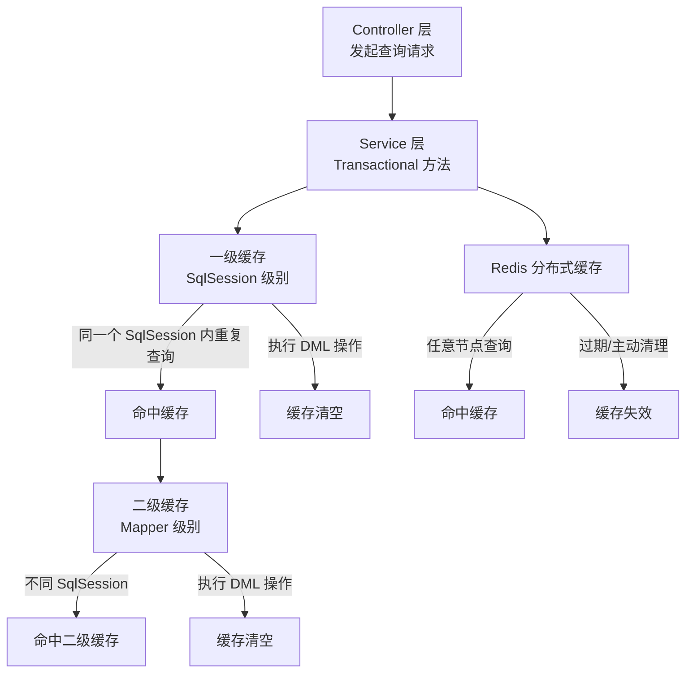
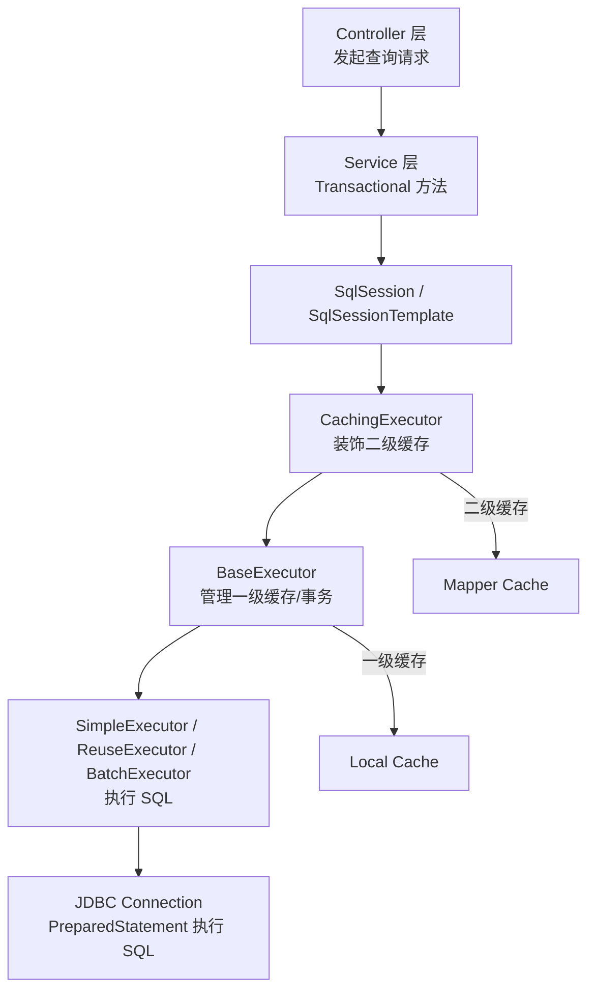

## 源码分析


### 核心汇总


####  MyBatis Executor 装饰者模式源码解析

**问：**
 MyBatis 的核心源码用到了装饰者模式，对吗？请以源码举例阐述。

**答：**

##### Executor 核心接口

```java
public interface Executor {
    <T> T query(MappedStatement ms, Object parameter, RowBounds rowBounds, ResultHandler resultHandler) throws SQLException;
    int update(MappedStatement ms, Object parameter) throws SQLException;
    void commit(boolean required) throws SQLException;
    void rollback(boolean required) throws SQLException;
    void close(boolean forceRollback);
    CacheKey createCacheKey(MappedStatement ms, Object parameterObject, RowBounds rowBounds, BoundSql boundSql);
    boolean isClosed();
    void clearLocalCache();
}
```

------

##### Executor 实现层次

```java
Executor (接口)
 └── BaseExecutor (抽象类)
      ├── SimpleExecutor
      ├── ReuseExecutor
      ├── BatchExecutor
      └── CachingExecutor (装饰者)
```

- **BaseExecutor**：一级缓存 + 事务管理 + 模板方法（`update()`、`query()`）
- **Simple/Reuse/BatchExecutor**：具体 SQL 执行策略
- **CachingExecutor**：二级缓存装饰，装饰任意 Executor

------

##### CachingExecutor 装饰器示例

```java
public class CachingExecutor implements Executor {
    private final Executor delegate;

    public CachingExecutor(Executor delegate) { this.delegate = delegate; }

    @Override
    public <E> List<E> query(MappedStatement ms, Object parameter, RowBounds rowBounds, ResultHandler resultHandler) throws SQLException {
        if (ms.isUseCache() && resultHandler == null) {
            CacheKey key = createCacheKey(ms, parameter, rowBounds, ms.getBoundSql(parameter));
            List<E> list = (List<E>) ms.getCache().getObject(key);
            if (list != null) return list;
            list = delegate.query(ms, parameter, rowBounds, resultHandler);
            ms.getCache().putObject(key, list);
            return list;
        } else {
            return delegate.query(ms, parameter, rowBounds, resultHandler);
        }
    }
}
```

- **装饰者模式**：`CachingExecutor` 持有被装饰 Executor 的引用 `delegate`
- **责任链模式**：调用链：`SqlSession -> CachingExecutor -> BaseExecutor -> SimpleExecutor -> JDBC`

------

##### 6️⃣ Mermaid 图：缓存体系对比



------

##### 7️⃣ Mermaid 图：Executor 装饰链与执行流程



------

##### 8️⃣ 总结面试亮点

1. **一级缓存**：BaseExecutor 内置，事务内重复查询命中
2. **二级缓存**：CachingExecutor 装饰，Mapper 级别共享
3. **Executor 装饰链**：装饰者 + 责任链模式
4. **SqlSessionTemplate**：线程安全、事务感知、自动管理 Executor
5. **企业实践**：二级缓存很少直接用，多用 Redis / Spring Cache


### 发展历程


> 发展历程图


>ORM介绍

ORM


#### JDBC使用流程


##### 1.加载JDBC驱动程序

在连接数据库之前，首先要加载对应数据库驱动到`JVM`中，这通过java.lang.Class类的静态方法`forName(String className)`实现。

```java
//1.加载驱动程序
Class.forName("com.mysql.cj.jdbc.Driver");
```

加载完成之后，会将`Driver`实例注册到`DriverManager`类中。


##### 2.提供JDBC连接的URL

链接URL定义了连接数据库时的协议、子协议、数据源标识

```java
//2.创建连接URL
String url = "jdbc:mysql://localhost:3306/mybatis?userSSL=false&serverTimezone=UTC";
String userName = "root";
String password = "123456";
```


##### 3.创建数据库连接

要连接数据库，需要向java.sql.DriverManager请求并获得Connection对象，该对象就代表一个数据库的连接，实例如下：

```java
//3.创建数据库连接
connection = DriverManager.getConnection(url, userName, password);
```


##### 4.创建一个Statemet

**要执行SQL语句，必须获得java.sql.Statement实例**，Statement实例分为以下3种类型：

1. 执行静态SQL语句。通常通过`Statement`实例实现。
2. 执行动态SQL语句。通常通过`PreparedStatement`实例实现。
3. 执行数据库存储过程。通常通过`CallableStatement`实例实现。

```java
//4.创建Statement
statement = connection.createStatement();
```


##### 5.执行SQL语句

Statement接口提供了三种执行SQL语句的方法：executeQuery 、executeUpdate和execute

1. ResultSet executeQuery(String sqlString)：执行**查询**数据库的SQL语句，返回一个结果集（ResultSet）对象。
2. int executeUpdate(String sqlString)：用于执行INSERT、UPDATE或DELETE语句以及SQL DDL语句，如：CREATE TABLE和DROP TABLE等
3. execute(sqlString):用于执行返回多个结果集、多个更新计数或二者组合的语句。

```java
//5.执行sql语句
resultSet = statement.executeQuery("SELECT `name`,`pwd` FROM `user`");
```


##### 6.处理结果

两种情况：

1. 执行更新返回的是本次操作影响到的记录数。
2. 执行查询返回的结果是一个ResultSet对象。

```java
//6.结果处理
while (resultSet.next()) {
//以下name与pwd为执行查询字段
    System.out.print("名称:" + resultSet.getString("name") + " ");
    System.out.print("密码:" + resultSet.getString("pwd"));
    System.out.println();
}
```


##### 7.关闭JDBC对象

操作完成以后要把所有使用的JDBC对象全都关闭，以释放JDBC资源，关闭顺序和声明顺序相反：

1. 关闭记录集
2. 关闭声明
3. 关闭连接对象。

```java
//注：关闭顺序一定是从下往上!否则可能导致关闭识别引发内存泄露问题
//1.关闭记录集
if (resultSet != null) {
    resultSet.close();
}
//2.关闭声明
if (statement != null) {
    statement.close();
}
//3.关闭连接对象
if (connection != null) {
    connection.close();
}
```


##### 完整的代码

>整体代码，感受流程

```java
import lombok.extern.slf4j.Slf4j;
import org.junit.jupiter.api.Test;
import org.springframework.boot.test.context.SpringBootTest;

import java.sql.*;

/**
 * @Project_Name JDBCTest
 * @Author LH
 * @Date 2021/10/4 13:49
 * @TODO：探究测试原始JDBC连接数据库查询流程
 * @Thinking:
 */
@SpringBootTest
@Slf4j
class UserJDBCTest {
    /**
     * 将相关对象声明为静态
     */
    static Connection connection;
    static Statement statement;
    static ResultSet resultSet;

    @Test
    public void JDBCUser() throws SQLException {
        try {
            //1.加载驱动程序
            Class.forName("com.mysql.cj.jdbc.Driver");
            log.info("1.加载驱动程序完成");

            //2.创建连接URL
            String url = "jdbc:mysql://localhost:3306/mybatis?userSSL=false&serverTimezone=UTC";
            String userName = "root";
            String password = "123456";
            log.info("2.创建连接URL");

            //3.创建数据库连接
            connection = DriverManager.getConnection(url, userName, password);
            log.info("3.数据库连接完成!url.length()={}", url.length());

            //4.创建Statement
            statement = connection.createStatement();
            log.info("4.创建Statement完成");

            //5.执行sql语句
            resultSet = statement.executeQuery("SELECT `name`,`pwd` FROM `user`");
            log.info("5.执行sql完成");

            //6.结果处理
            while (resultSet.next()) {
                //以下name与pwd为执行查询字段
                System.out.print("名称:" + resultSet.getString("name") + " ");
                System.out.print("密码:" + resultSet.getString("pwd"));
                System.out.println();
            }
            log.info("6.结果集处理完成");
        } catch (ClassNotFoundException | SQLException e) {
            log.error("JDBCQueryError:{}", e.getStackTrace());
        } finally {
            //注：关闭顺序一定是从下往上!否则可能导致关闭识别引发内存泄露问题
            //1.关闭记录集
            if (resultSet != null) {
                resultSet.close();
            }
            //2.关闭声明
            if (statement != null) {
                statement.close();
            }
            //3.关闭连接对象
            if (connection != null) {
                connection.close();
            }
        }
    }
}
```


>输出结果

```java
1.加载驱动程序完成
2.创建连接URL
3.数据库连接完成!url.length()=68
4.创建Statement完成
5.执行sql完成
名称:张无忌 密码:123131
名称:李逵 密码:24736743
名称:李思 密码:456675
6.结果集处理完成
```


###### 总结

>原始JDBC 的主要缺点还是：

1. 原始JDBC操作可复用性很差，比较容易造成冗余重复的代码，
2. 数据库连接创建、释放频繁造成系统资源浪费从而影响系统性能
3. sql 语句在代码中硬编码，造成代码不易维护，实际应用 sql 变化的可能较大，sql 变动需要改变java代码。
4. 查询操作时，需要手动将结果集中的数据手动封装到实体中。插入操作时，需要手动将实体的数据设置到sql语句的占位 符位置 
5. 处理较大数据量的结果集操作比较繁琐
6. 即便可以选择用工具类来进行相应的封装，但是仍然会存在不同程度的问题(例如封装sql语句写死，结果集的回收等)


> 所以呢 持久层框架针对解决：

1. 使用数据库连接池初始化连接资源
2. 将sql语句抽取到配置文件(XML 、 properties ..)中
3. 使用反射、内省等底层技术，自动将实体与表进行属性与字段的自动映射


#### 引入


>既然了解了原始的JDBC，只要你拥有一些简单，基本优化思路便可以轻松对其代码进行封装优化

举例比较好一些的优化：

- Apache的DBUtils
- springjdbc的Template


>尽管已经做了不同程度的优化

但是，还有存在不少的缺点，随着业务发展的需要，相关工具类便满足不了实际需要。

由此它们DBUtils和springjdbc虽然简化了数据库的操作，但是本身提供的功能还是比较简单的(缺少缓存，事务管理等)，所以在实际开发中往往并不会用到这样的工具类，而是采用`Hibernate`和`Mybatis`等这些专业的**ORM持久层框架**


>什么是ORM

**ORM（Object-Relational Mapping）即对象关系映射**，是一种将面向对象模型和关系型数据库模型进行映射的技术。它将对象和类映射到数据库表和列，将对象的属性映射到表的列。

**ORM的主要目的是简化数据访问层的开发**，通过将对象和数据库表之间的映射关系定义在一个配置文件中，开发人员可以使用面向对象的方式操作数据库，无需编写复杂的SQL语句。

ORM框架通常会提供以下功能：

1. 实现对象和关系之间的映射关系，将对象的属性映射到数据库表的列。
2. 提供ORM API，让开发人员可以使用面向对象的方式访问数据库，无需编写SQL语句。
3. 提供事务管理、缓存管理等功能，简化数据访问层的开发。

常见的ORM框架包括Hibernate、MyBatis、JPA等。使用ORM框架可以大大简化数据访问层的开发，提高开发效率和代码质量。但是，ORM框架也有其缺点，如性能问题、复杂度问题等，需要根据具体情况选择合适的技术方案。

**ORM(Object Relational Mapping),也就是对象与关系的映射**

- 对象是程序里面的对象
- 关系是它与数据库里面的数据的关系

也就是说：ORM框架帮助我们解决的问题是**程序对象和关系型数据库的相互映射的问题**

- **O：对象**
- **M：映射**
- **R：关系型数据库**


>Hibernate

Hibernate的出现大大简化了数据库操作，同时也能够更好的应对更加复杂的业务场景，**Hibernate具有如下的特点**：

1. **根据数据库方言自定生成SQL，移植性好**
2. **自动管理连接资源**
3. **实现了对象和关系型数据的完全映射**，操作对象就像操作数据库记录一样
4. **提供了缓存机制**


Hibernate在处理复杂业务的时候，同时**也存在一些问题**：

1. 比如API中的get(),update()和save()方法，**操作的实际上是所有的字段，没有办法指定部分字段**，换句话说就是**不够灵活**。
2. 自定义生成SQL的方式，如果**要基于SQL去做一些优化的话，也是非常困难的**。
3. **不支持动态SQL**，比如分表中的表名，条件，参数变化等，无法根据条件自动生成SQL

因此还需要一个更加灵活的框架


### 引入

以springboot集成MyBatis 3.5.7为例：

>1.请问在mapper.xml文件中执行了一句简单的select * from users;会发生什么？

- 你肯定会问：不就是从数据库获取users表的数据吗？
- ……


>2.那么请问它怎么获取users表中的数据呢？

大致可以分为以几个步骤：

1. **解析 Mapper.xml 文件**

   当应用程序启动时：

   ​	MyBatis 会加载所有的 Mapper.xml 文件，将其解析为一个个 `MappedStatement` 对象，并存储在 `Configuration` 对象中的 `mappedStatements` 集合中。

   ​	这个过程由 `XMLMapperBuilder.parse()` 方法完成，它使用 `XPath` 来解析 XML 文件中的节点和属性，并通过 `XMLStatementBuilder` 构建 `MappedStatement` 对象。

2. **创建 SqlSession 对象**

   当应用程序需要执行 SQL 语句时：

   ​	它会创建一个 `SqlSession` 对象。`SqlSession` 是 MyBatis 操作数据库的核心接口，它提供了执行 SQL 语句、获取映射器、提交事务等方法。

   ​	`SqlSession` 对象的创建由 `SqlSessionFactory` 完成，它是一个工厂类，用于创建 `SqlSession` 对象。

3. **获取 Mapper 接口代理对象**

   在应用程序中，我们通常**使用 `Mapper` 接口来操作数据库**：

   ​	**MyBatis 会为每个 `Mapper` 接口创建一个代理对象**，该代理对象调用方法时会根据方法名和参数类型来查找对应的 `MappedStatement` 对象，并执行该 `MappedStatement` 对象所代表的 SQL 语句。

   ​	代理对象的创建由 `MapperProxyFactory` 完成，它是一个工厂类，用于创建 `Mapper` 接口的代理对象

4. **执行 SQL 语句**

   ​	当代理对象调用方法时，它**会根据方法名和参数类型来查找对应的 `MappedStatement` 对象，并执行该 `MappedStatement` 对象所代表的 SQL 语句**。

   ​	具体来说，MyBatis 会将 SQL 语句和参数传递给 `SqlSession` 对象，并使用 `Executor` 对象来执行 SQL 语句。

   ​	`Executor` 是 MyBatis 执行 SQL 语句的核心组件，它负责处理 SQL 语句的预编译、参数绑定、结果集映射等操作。

   ​	MyBatis 提供了两种类型的 `Executor`，分别是 `SimpleExecutor` 和 `ReuseExecutor`。`SimpleExecutor` 对象在执行 SQL 语句后会将 `PreparedStatement` 对象关闭，而 	`ReuseExecutor` 对象会将 `PreparedStatement` 对象缓存起来，以便下次使用。

5. **处理结果集**

   ​	当执行 SQL 语句后，`Executor` 对象会获得一个 `ResultSet` 对象，用于表示查询结果集。

   ​	然后，**MyBatis 会使用 `ResultSetHandler` 对象将结果集转换为 Java 对象**。`ResultSetHandler` 是 MyBatis 处理查询结果集的核心组件，它负责将 `ResultSet` 对象转换为 Java 对象。

   ​	MyBatis 提供了多种类型的 `ResultSetHandler`，例如 `DefaultResultSetHandler`、`FastResultSetHandler` 等。

6. **返回结果**

   当 `ResultSetHandler` 将结果集转换为 Java 对象后，

   MyBatis 会**将 Java 对象作为方法的返回值返回给应用程序**。

以上就是 `select * from users` 在 MyBatis 框架中的执行过程。**在执行过程中，MyBatis 通过解析 XML 文件、创建代理对象、执行 SQL 语句、处理结果集等步骤实现了 SQL 的执行和结果转换**。


>3.以源码层面去解析应该是怎么样的呢？

1. 解析 Mapper.xml 文件

MyBatis 会将 Mapper.xml 文件解析为 `MappedStatement` 对象，并存储在 `Configuration` 对象中的 `mappedStatements` 集合中。这个过程由 `XMLMapperBuilder.parse()` 方法完成，它使用 `XPath` 来解析 XML 文件中的节点和属性，并通过 `XMLStatementBuilder` 构建 `MappedStatement` 对象。

我们来看看 `XMLMapperBuilder.parse()` 方法的源码：

```java
public void parse() {
  if (!configuration.isResourceLoaded(resource)) {
    configurationElement(parser.evalNode("/mapper"));
    configuration.addLoadedResource(resource);
    bindMapperForNamespace();
  }
}

private void configurationElement(XNode context) {
  try {
    String namespace = context.getStringAttribute("namespace");
    if (namespace == null || namespace.equals("")) {
      throw new BuilderException("Mapper's namespace cannot be empty");
    }
    builderAssistant.setCurrentNamespace(namespace);
    statementElement(context.evalNodes("select|insert|update|delete"));
  } catch (Exception e) {
    throw new BuilderException("Error parsing Mapper XML. The XML location is '" + resource + "'. Cause: " + e, e);
  }
}

private void statementElement(List<XNode> list) {
  for (XNode context : list) {
    final XMLStatementBuilder statementParser = new XMLStatementBuilder(configuration, builderAssistant, context);
    try {
      statementParser.parseStatementNode();
    } catch (IncompleteElementException e) {
      configuration.addIncompleteStatement(statementParser);
    }
  }
}
```

可以看到，`XMLMapperBuilder.parse()` 方法首先检查 Mapper.xml 文件是否已经被加载过，如果没有加载过，则调用 `configurationElement()` 方法解析 XML 文件的根节点，并调用 `statementElement()` 方法解析 `select`、`insert`、`update` 和 `delete` 节点。具体的节点解析由 `XMLStatementBuilder` 完成。如果解析过程中遇到了未完成的语句，则将其添加到 `Configuration` 对象的 `incompleteStatements` 集合中，以便在解析完整个 XML 文件后再进行处理。


2. 创建 SqlSession 对象

当应用程序需要执行 SQL 语句时，它会创建一个 `SqlSession` 对象。`SqlSession` 是 MyBatis 操作数据库的核心接口，它提供了执行 SQL 语句、获取映射器、提交事务等方法。`SqlSession` 对象的创建由 `SqlSessionFactory` 完成，它是一个工厂类，用于创建 `SqlSession` 对象。

我们来看看 `SqlSessionFactory` 的源码：

```java
public interface SqlSessionFactory {
  SqlSession openSession();
  // ...
}

public class DefaultSqlSessionFactory implements SqlSessionFactory {
  // ...
  public SqlSession openSession() {
    return openSessionFromDataSource(configuration.getDefaultExecutorType(), null, false);
  }
  // ...
  private SqlSession openSessionFromDataSource(ExecutorType execType, TransactionIsolationLevel level, boolean autoCommit) {
    Transaction tx = null;
    try {
      final Environment environment = configuration.getEnvironment();
      final TransactionFactory transactionFactory = getTransactionFactoryFromEnvironment(environment);
      tx = transactionFactory.newTransaction(environment.getDataSource(), level, autoCommit);
      final Executor executor = configuration.newExecutor(tx, execType);
      return new DefaultSqlSession(configuration, executor, autoCommit);
    } catch (Exception e) {
      closeTransaction(tx); // may have fetched a connection so lets call close()
      throw ExceptionFactory.wrapException("Error opening session.  Cause: " + e, e);
    } finally {
      ErrorContext.instance().reset();
    }
  }
  // ...
}
```

可以看到，`SqlSessionFactory` 接口中只定义了一个 `openSession()` 方法，用于创建 `SqlSession` 对象。`DefaultSqlSessionFactory` 是 `SqlSessionFactory` 接口的默认实现类，它提供了 `openSession()` 方法的具体实现。该方法会调用 `openSessionFromDataSource()` 方法创建 `SqlSession` 对象，并将其返回。


3. 获取 Mapper 接口代理对象

在应用程序中，我们通常使用 `Mapper` 接口来操作数据库。MyBatis 会为每个 `Mapper` 接口创建一个代理对象，该代理对象调用方法时会根据方法名和参数类型来查找对应的 `MappedStatement` 对象，并执行该 `MappedStatement` 对象所代表的 SQL 语句。

代理对象的创建由 `MapperProxyFactory` 完成，它是一个工厂类，用于创建 `Mapper` 接口的代理对象。

我们来看看 `MapperProxyFactory` 的源码：

```java
public class MapperProxyFactory<T> {
  private final Class<T> mapperInterface;
  private final Map<Method, MapperMethod> methodCache = new ConcurrentHashMap<>();

  public MapperProxyFactory(Class<T> mapperInterface) {
    this.mapperInterface = mapperInterface;
  }

  public Class<T> getMapperInterface() {
    return mapperInterface;
  }

  public T newInstance(SqlSession sqlSession) {
    final MapperProxy<T> mapperProxy = new MapperProxy<>(sqlSession, mapperInterface, methodCache);
    return newInstance(mapperProxy);
  }

  protected T newInstance(MapperProxy<T> mapperProxy) {
    return (T) Proxy.newProxyInstance(mapperInterface.getClassLoader(), new Class[] { mapperInterface }, mapperProxy);
  }
}
```

可以看到，`MapperProxyFactory` 接收一个 `Class<T>` 类型的参数，表示要创建代理对象的 `Mapper` 接口。它还维护了一个 `methodCache` 集合，用于缓存方法和对应的 `MapperMethod` 对象。

`MapperProxyFactory` 提供了 `newInstance(SqlSession)` 方法，用于创建代理对象。该方法会创建一个 `MapperProxy` 对象，并将其传递给 `newInstance(MapperProxy)` 方法，以创建代理对象。


4. 执行 SQL 语句

当代理对象调用方法时，它会根据方法名和参数类型来查找对应的 `MappedStatement` 对象，并执行该 `MappedStatement` 对象所代表的 SQL 语句。具体来说，MyBatis 会将 SQL 语句和参数传递给 `SqlSession` 对象，并使用 `Executor` 对象来执行 SQL 语句。

`Executor` 是 MyBatis 执行 SQL 语句的核心组件，它负责处理 SQL 语句的预编译、参数绑定、结果集映射等操作。MyBatis 提供了两种类型的 `Executor`，分别是 `SimpleExecutor` 和 `ReuseExecutor`。`SimpleExecutor` 对象在执行 SQL 语句后会将 `PreparedStatement` 对象关闭，而 `ReuseExecutor` 对象会将 `PreparedStatement` 对象缓存起来，以便下次使用。

我们来看看 `SqlSession` 的源码：

```java
public interface SqlSession extends Closeable {
  <T> T selectOne(String statement);
  <T> T selectOne(String statement, Object parameter);
  <E> List<E> selectList(String statement);
  <E> List<E> selectList(String statement, Object parameter);
  // ...
}

public class DefaultSqlSession implements SqlSession {
  private final Configuration configuration;
  private final Executor executor;
  private final boolean autoCommit;
  private boolean dirty;

  public DefaultSqlSession(Configuration configuration, Executor executor, boolean autoCommit) {
    this.configuration = configuration;
    this.executor = executor;
    this.autoCommit = autoCommit;
    this.dirty = false;
  }

  public <T> T selectOne(String statement) {
    return selectOne(statement, null);
  }

  public <T> T selectOne(String statement, Object parameter) {
    List<T> list = selectList(statement, parameter);
    if (list.size() == 1) {
      return list.get(0);
    } else if (list.size() > 1) {
      throw new TooManyResultsException("Expected one result (or null) to be returned by selectOne(), but found: " + list.size());
    } else {
      return null;
    }
  }

  public <E> List<E> selectList(String statement) {
    return selectList(statement, null);
  }

  public <E> List<E> selectList(String statement, Object parameter) {
    try {
      MappedStatement ms = configuration.getMappedStatement(statement);
      List<E> result = executor.query(ms, wrapCollection(parameter));
      return result;
    } catch (Exception e) {
      throw ExceptionFactory.wrapException("Error querying database.  Cause: " + e, e);
    } finally {
      ErrorContext.instance().reset();
    }
  }
  // ...
}
```

可以看到，`SqlSession` 接口提供了多个方法，用于执行 SQL 语句。在 `DefaultSqlSession` 的实现


### MyBatis执行体系


#### 回顾JDBC执行过程

>5个参数

1. SQL声明映射
2. 参数
3. 行范围
4. 结果处理器
5. 动态SQL语句


```java
//1.加载驱动程序
Class.forName("com.mysql.cj.jdbc.Driver");
//创建连接URL
String url = "jdbc:mysql://localhost:3306/mybatis?userSSL=false&serverTimezone=UTC";
String userName = "root";
String password = "123456";

//创建数据库连接设置参数
connection = DriverManager.getConnection(url, userName, password);
//2.创建Statement(预编译SQL)
 statement = connection.createStatement();

//3.执行sql语句
resultSet = statement.executeQuery("SELECT `name`,`pwd` FROM `user`");
```


#### 源码执行流程


MyBatis执行流程主要包括以下步骤：

1. **获取连接**：MyBatis通过DataSource获取数据库连接，DataSource是一个数据库连接池，可以管理多个数据库连接。

2. **预处理**：根据Mapper接口方法中的参数和返回值类型，MyBatis会根据mapper.xml中的配置构建Statement对象，并设置参数。其中，Statement对象可以是PreparedStatement、CallableStatement、Statement等类型。

3. **简单执行器-修改**：简单执行器是MyBatis的默认执行器，它通过Statement对象执行SQL语句，将查询结果封装成Java对象返回。如果是修改操作，执行器会获取动态SQL，并将插件嵌入到动态SQL中。

4. **基础执行器-修改**：基础执行器是简单执行器的扩展，它维护了一级缓存，如果执行完一个SQL语句后，再次执行相同的SQL语句，基础执行器会从缓存中获取结果，而不是再次执行SQL语句。如果是修改操作，执行器会清除一级缓存。

5. **缓存执行器-修改**：缓存执行器是基础执行器的扩展，它维护了二级缓存，将缓存数据存储在内存中，可以跨会话共享数据。如果是修改操作，执行器会清除二级缓存。

6. **会话修改**：MyBatis使用SqlSession进行数据库操作，SqlSession是线程不安全的，每个线程都应该拥有自己的SqlSession。SqlSession提供了一些数据库操作方法，如selectOne、selectList、insert、update、delete等。

7. **执行Mapper方法**：MyBatis使用动态代理将Mapper接口和mapper.xml文件进行关联，使用Mapper接口方法名作为SQL语句的id，在mapper.xml文件中获取SQL语句，并执行SQL语句。

8. **动态代理入口**：MyBatis使用动态代理将Mapper接口和mapper.xml文件进行关联，动态代理会根据Mapper接口中的方法名、参数类型等信息查找对应的SQL语句。如果找到了对应的SQL语句，动态代理会将Mapper接口方法转化为SQL语句，并执行SQL语句。

9. **修改**：执行SQL语句，将查询结果封装成Java对象返回，或者将数据写入数据库。

MyBatis的执行流程比较复杂，其中涉及到的技术点比较多，如动态代理、多级缓存、插件等。需要深入理解MyBatis的源码，才能对整个执行流程有一个更深入的理解。


##### 具体分类


> **mybatis执行总共分为四个模块**

1. **动态代理：MapperProxy**
2. **SQL会话：sqlSession**
3. **执行器：Executor**
4. **JDBC处理器：StatementHandler**

主要研究SQL会话以及执行器Executor


### SqlSession(门面模式)

> 只提供API并不提供具体实现


##### 门面模式

门面模式：提供一个同一的门面接口API，使得系统更容易使用。


>具体的实现是交由mybatis执行器来实现

也就是MyBatis核心执行组件Executor


### mybatis执行器

由SqlSession提供API，而mybatis执行器Executor来完成具体的实现

> 流程图如下


#### `PreparedStatement`

**JDBC执行方法`PreparedStatement`**,在标准API中，实际上只有改、查，因为实际上增、删、改、查最终都可以归结于——改和查的方法

```java
import java.math.BigDecimal;
import java.util.Calendar;
import java.io.Reader;
import java.io.InputStream;

/**
 * An object that represents a precompiled SQL statement.
 * <P>A SQL statement is precompiled and stored in a
 * <code>PreparedStatement</code> object. This object can then be used to
 * efficiently execute this statement multiple times.
 *
 * <P><B>Note:</B> The setter methods (<code>setShort</code>, <code>setString</code>,
 * and so on) for setting IN parameter values
 * must specify types that are compatible with the defined SQL type of
 * the input parameter. For instance, if the IN parameter has SQL type
 * <code>INTEGER</code>, then the method <code>setInt</code> should be used.
 *
 * <p>If arbitrary parameter type conversions are required, the method
 * <code>setObject</code> should be used with a target SQL type.
 * <P>
 * In the following example of setting a parameter, <code>con</code> represents
 * an active connection:
 * <PRE>
 *   PreparedStatement pstmt = con.prepareStatement("UPDATE EMPLOYEES
 *                                     SET SALARY = ? WHERE ID = ?");
 *   pstmt.setBigDecimal(1, 153833.00)
 *   pstmt.setInt(2, 110592)
 * </PRE>
 *
 * @see Connection#prepareStatement
 * @see ResultSet
 */

public interface PreparedStatement extends Statement {

    /**
     * Executes the SQL query in this <code>PreparedStatement</code> object
     * and returns the <code>ResultSet</code> object generated by the query.
     *
     * @return a <code>ResultSet</code> object that contains the data produced by the
     *         query; never <code>null</code>
     * @exception SQLException if a database access error occurs;
     * this method is called on a closed  <code>PreparedStatement</code> or the SQL
     *            statement does not return a <code>ResultSet</code> object
     * @throws SQLTimeoutException when the driver has determined that the
     * timeout value that was specified by the {@code setQueryTimeout}
     * method has been exceeded and has at least attempted to cancel
     * the currently running {@code Statement}
     */
    ResultSet executeQuery() throws SQLException;

    /**
     * Executes the SQL statement in this <code>PreparedStatement</code> object,
     * which must be an SQL Data Manipulation Language (DML) statement, such as <code>INSERT</code>, <code>UPDATE</code> or
     * <code>DELETE</code>; or an SQL statement that returns nothing,
     * such as a DDL statement.
     *
     * @return either (1) the row count for SQL Data Manipulation Language (DML) statements
     *         or (2) 0 for SQL statements that return nothing
     * @exception SQLException if a database access error occurs;
     * this method is called on a closed  <code>PreparedStatement</code>
     * or the SQL statement returns a <code>ResultSet</code> object
     * @throws SQLTimeoutException when the driver has determined that the
     * timeout value that was specified by the {@code setQueryTimeout}
     * method has been exceeded and has at least attempted to cancel
     * the currently running {@code Statement}
     */
    int executeUpdate() throws SQLException;
```

但还存在一个情况就是：**改和查都会涉及到缓存！**


#### 执行器实现


##### SimpleExecutor

**简单执行器：SimpleExecutor**


###### 示例代码


###### 总结

使用**简单执行器`SimpleExecutor`**,当执行重复的需求的时候，它也会进行重复的sql预处理。批量重复时比较浪费资源，由此引申出来的**可重用执行器`ReuseExecutor`**


#### 执行器总结

所有子类都实现了`doQuery()`和`doUpdate`方法。


1. SimpleExecutor：对于简单执行器而言，每一次都会创建一个新的预处理器(PrepareStatement)对象，再执行相关操作，也就是说哪怕执行同样的SQL都会重复这个过程(比较浪费资源)——**适用于每次执行不同SQL的场景**
2. ReuseExecutor：对应可重用执行器来说，正如它的名称，当重复的SQL再次执行时，它会使用第一次执行此SQL的预处理对象，然后进行下步处理。相同的SQL它只进行一次预处理——**适用于每次执行相同SQL的场景**
3. BatchExecutor：而对于批处理执行器，顾名思义，它会比较**适用于批量执行SQL的场景**，但是要注意，**执行完毕后要调用`flushStatements()`方法进行刷新**，操作才会生效
4. 而对应上述执行器而言，默认并不是直接执行`doQuery()`和`doUpdate`方法，而是**执行`Query()`和`Update`，因为默认mybatis使用了一级缓存！**当执行操作时，**先判断缓存中是否存在值，存在先返回缓存中的值，否则再执行！**


默认的一级缓存，而当开启二级缓存后，流程主要源码如下

1. 在CachingExecutor类中：

```java
  @Override
  public <E> List<E> query(MappedStatement ms, Object parameterObject, RowBounds rowBounds, ResultHandler resultHandler, CacheKey key, BoundSql boundSql)
      throws SQLException {
    Cache cache = ms.getCache();
      //判断当前一级缓存是否不存在相关数据
      if (cache != null) {
      flushCacheIfRequired(ms);
      
      //二级缓存相关逻辑    
      //是否开启缓存&&自定义处理为null
      if (ms.isUseCache() && resultHandler == null) {
        ensureNoOutParams(ms, boundSql);
        @SuppressWarnings("unchecked")
        List<E> list = (List<E>) tcm.getObject(cache, key);
        //第一次缓存为null,从第二次开始从缓存中获取数据
        if (list == null) {
          list = delegate.query(ms, parameterObject, rowBounds, resultHandler, key, boundSql);
          tcm.putObject(cache, key, list); // issue #578 and #116
        }
        return list;
      }
    }
    return delegate.query(ms, parameterObject, rowBounds, resultHandler, key, boundSql);
  }
```

如果没有缓存直接调用下一个执行器`delegate.query()`去获取相关数据！


> 装饰者模式

在不改变原有类结构和继承的情况下，通过包装原对象去扩展一个新功能

这里是对原有的BaseExecutor进行了一层装饰


P3起始
===


