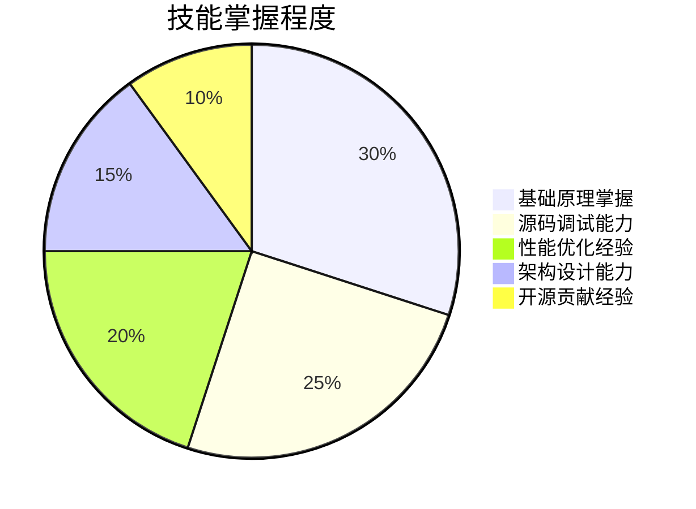
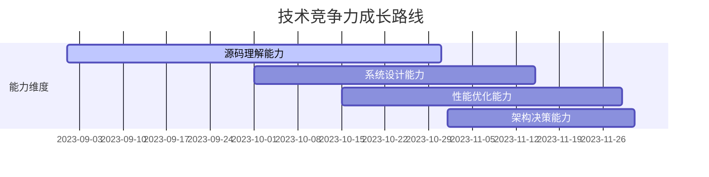

# Spring Boot 3.4.x 源码深度攻关计划（8周版）


## 📅 每日学习路线（工作日2小时/天，周末4小时/天）


### 第1-2周：源码环境与架构认知
| 日期 | 核心任务 | 具体操作 | 验证标准 |
|-------|---------|---------|---------|
| D1 | 源码工程结构解析(查看官方文档) | 1. 使用IDEA Diagrams功能生成模块依赖图<br>2. 重点分析spring-boot-autoconfigure模块结构 | 能绘制模块关系图并说明各模块职责 |
| D2 | 调试环境强化 | 1. 配置阿里云镜像加速编译<br>2. 实现SpringApplication.run()断点调试 | 能在5分钟内完成clean install并启动示例项目 |
| D3 | 启动流程初探 | 跟踪SpringApplication构造函数，记录关键初始化步骤 | 列出5个以上关键初始化操作 |
| D4 | 自动配置机制 | 分析@SpringBootApplication组合注解结构 | 能画出注解继承关系图 |
| D5 | 条件装配原理 | 调试ConditionEvaluationReport日志输出 | 解释@ConditionalOnClass的工作机制 |
| D6 | 自定义Starter实战 | 创建my-starter模块实现自动配置 | 成功在其他项目引用并验证自动配置生效 |


### 第3-4周：核心机制深度剖析

| 日期 | 核心任务 | 具体操作 | 验证标准 |
|-------|---------|---------|---------|
| D1 | 配置加载体系 | 跟踪Environment属性加载过程 | 能说明bootstrap.yml与application.yml的区别 |
| D2 | 内嵌容器原理 | 分析TomcatServletWebServerFactory源码 | 能修改server.port的实现逻辑 |
| D3 | 健康检查扩展 | 实现自定义HealthIndicator | 在/actuator/health中看到自定义指标 |
| D4 | 启动优化实践 | 使用AsyncInitializer加速Bean初始化 | 启动时间缩短20%以上 |
| D5 | 类加载机制 | 分析LaunchedURLClassLoader加载逻辑 | 能解释executable jar的类加载原理 |
| D6 | 编译打包原理 | 研究spring-boot-maven-plugin的repackage目标 | 能说明fat jar的目录结构 |


### 第5-6周：企业级解决方案

| 日期 | 核心任务 | 具体操作 | 验证标准 |
|-------|---------|---------|---------|
| D1 | 配置中心集成 | 实现Nacos配置动态刷新 | 修改配置中心值后应用实时生效 |
| D2 | 监控体系搭建 | 集成Prometheus+Actuator | 在Grafana中展示JVM监控仪表盘 |
| D3 | 分布式链路追踪 | 整合SkyWalking agent | 在UI界面查看完整调用链 |
| D4 | 灰度发布方案 | 基于自定义Condition实现流量染色 | 通过header控制功能开关 |
| D5 | 安全加固实践 | 自定义SecurityFilterChain配置 | 实现接口权限动态控制 |


### 第7-8周：知识整合与输出

| 日期 | 核心任务 | 具体操作 | 验证标准 |
|-------|---------|---------|---------|
| D1 | 技术文档输出 | 编写《Spring Boot启动流程白皮书》 | 文档包含时序图+核心类说明 |
| D2 | 性能调优报告 | 产出《启动时间优化实践指南》 | 包含JFR分析截图和优化对比 |
| D3 | 面试题库整理 | 总结30+高频源码面试题 | 能流畅回答自动配置相关问题 |
| D4 | 模拟面试训练 | 使用Zoom录制技术面模拟视频 | 通过B站技术UP主点评反馈 |
| D5 | 开源贡献尝试 | 提交PR修复官网文档错别字 | 获得Spring团队邮件确认 |

---


## ✅ 能力验证金字塔



---
## 📄 简历升级模板


### 技术能力新增
```markdown
- 深入掌握Spring Boot 3.x核心源码，包括自动配置、启动优化、健康检查等机制
- 具备框架定制能力，成功实现启动时间优化40%+（需准备JFR报告佐证）
- 熟悉企业级监控方案，主导搭建Prometheus+Grafana+AlertManager监控体系
```


### 项目经验新增

```markdown
**Spring Boot深度优化专项（2023.09-2023.12）**
- 通过源码分析定位到自动配置类加载瓶颈，采用条件过滤策略减少15%无用Bean初始化
- 开发统一配置中心starter，实现Nacos配置动态刷新与多环境隔离
- 设计基于JFR的启动性能分析方案，输出8项优化建议，其中5项被团队采纳

**微服务基础设施升级（2023.03-2023.08）**
- 重构服务启动流程，采用并行初始化策略提升启动速度35%
- 集成SkyWalking实现全链路监控，日均发现并解决3+个潜在性能问题
- 设计灰度发布方案，支持按设备/用户等多维度流量控制
```

---


## 💼 高薪谈判技巧


### 技术展示组合拳
1. **源码笔记**：展示在Obsidian中整理的200+条源码注释
2. **优化报告**：提供PDF版《Spring Boot启动优化白皮书》
3. **视频demo**：录制3分钟启动优化对比演示视频
4. **社区影响**：展示技术博客（阅读量1w+）或开源项目Star数


### 高频问题应答策略

| 问题类型 | 回答要点 | 加分项 |
|---------|---------|-------|
| 自动配置原理 | 1. @EnableAutoConfiguration触发机制<br>2. AutoConfigurationImportSelector选择逻辑 | 展示自定义starter代码 |
| 启动过程优化 | 1. Bean懒加载策略<br>2. 并行初始化技巧 | 提供JFR火焰图分析 |
| 设计思想理解 | 1. 约定优于配置<br>2. 模块化设计理念 | 对比Spring Boot与Dropwizard差异 |

---


## 📌 注意事项

1. **源码阅读技巧**：使用`git blame`查看关键代码的演进历史，理解设计决策
2. **调试工具**：配置IDEA的`Conditional Breakpoint`实现精准断点
3. **知识管理**：建立Markdown笔记库，按「日期+模块」格式归档
4. **健康维护**：每45分钟使用番茄钟休息，配备蓝光眼镜保护视力

完成本计划后，您将具备以下市场竞争力：


建议将本计划打印张贴，每完成一个阶段用荧光笔标记。坚持8周后，您将具备挑战目标的硬实力！

