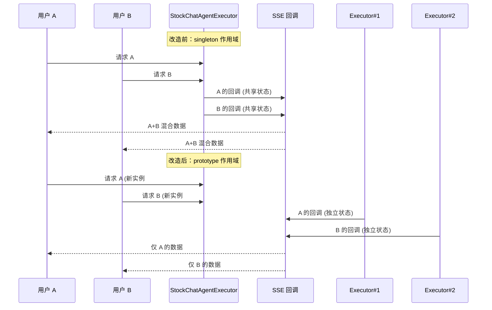

# SpringCloud2025解决bug


## IDEA


### 1.配置微服务多模块启动


## Nacos


### 1.版本依赖系列


#### nacos默认日志依赖冲突


##### 问题总结

> ❗ `RollingFileAppender` 冲突

日志中频繁出现下面的错误信息：

```log
'File' option has the same value ".../nacos/config.log" as that given for appender [CONFIG_LOG_FILE] defined earlier.
Collisions detected with FileAppender/RollingAppender instances defined earlier. Aborting.
Attempted to append to non started appender [CONFIG_LOG_FILE].
```

这些说明：

- 多次为同一个日志文件路径配置了多个相同 ID 的 Appender。
- Logback 不允许重复使用相同 `file` 路径的 Appender。
- 导致 appender 未启动，无法正常写日志。


##### 排查步骤

>添加yml配置以排除nacos自带，使用项目指定不使用自带日志依赖(未生效！)

```bash
nacos:
  logging:
    enable: false
```


>依赖中很可能还是存在nacos自带的日志依赖

```bash
PS E:\项目暂存\cloud2025\services\service-order> mvn dependency:tree -Dincludes="com.alibaba.nacos"
```

```bash
[INFO] com.hli:service-order:jar:1.0-SNAPSHOT
[INFO] \- com.alibaba.cloud:spring-cloud-starter-alibaba-nacos-discovery:jar:2023.0.3.3:compile
[INFO]    \- com.alibaba.nacos:nacos-client:jar:2.4.2:compile
[INFO]       +- com.alibaba.nacos:nacos-auth-plugin:jar:2.4.2:compile
[INFO]       +- com.alibaba.nacos:nacos-encryption-plugin:jar:2.4.2:compile
[INFO]       +- com.alibaba.nacos:logback-adapter:jar:1.1.3:compile
[INFO]       \- com.alibaba.nacos:nacos-log4j2-adapter:jar:2.4.2:compile
[INFO] ------------------------------------------------------------------------
[INFO] BUILD SUCCESS
```

发现：还是存在相关日志依赖


>在pom中显式移除

```xml
        <!--nacos服务发现-->
        <dependency>
            <groupId>com.alibaba.cloud</groupId>
            <artifactId>spring-cloud-starter-alibaba-nacos-discovery</artifactId>
            <!--排除nacos日志依赖,否则将与项目本身日志冲突-->
            <exclusions>
                <exclusion>
                    <groupId>com.alibaba.nacos</groupId>
                    <artifactId>logback-adapter</artifactId>
                </exclusion>
                <exclusion>
                    <groupId>com.alibaba.nacos</groupId>
                    <artifactId>nacos-log4j2-adapter</artifactId>
                </exclusion>
            </exclusions>
        </dependency>
```


>发现问题已解决

发现日志依赖配置冲突问题已经解决，但nacos相关日志以后将会缺失


>在此项目中resource目录下的日志配置文件logback-spring.xml中新增

```xml
    <!-- Nacos日志文件 -->
    <appender name="FILE_NACOS" class="ch.qos.logback.core.rolling.RollingFileAppender">
        <file>logs/nacos.log</file>
        <rollingPolicy class="ch.qos.logback.core.rolling.TimeBasedRollingPolicy">
            <fileNamePattern>logs/nacos.%d{yyyy-MM-dd}.log</fileNamePattern>
            <maxHistory>30</maxHistory>
        </rollingPolicy>
        <encoder>
            <pattern>%d{yyyy-MM-dd HH:mm:ss.SSS} [%thread] %-5level %logger{36} - %msg%n</pattern>
        </encoder>
    </appender>
```


>随后发现对应日志文件正常写入，且服务注册成功！


## Redis


### 1.连接问题


#### SpringBoot Redis连接失败

> 本次已使用方案二解决

##### 问题现象

> 应用启动时出现Redis连接失败错误：

```
org.springframework.data.redis.RedisConnectionFailureException: Unable to connect to Redis
RedisReactiveHealthIndicator - Redis health check failed
```

错误主要出现在：

- Spring Boot Actuator健康检查模块
- `RedisReactiveHealthIndicator`无法连接到Redis服务


##### 问题原因分析

###### 配置路径不一致

> Spring Boot应用中同时存在两套Redis配置：

1. **自定义配置路径**：`redis.host`、`redis.port`、`redis.password`
   - 通过`@Value("${redis.host}")`等注解读取
   - 用于自定义的RedisConfig配置类
2. **Spring Boot标准配置路径**：`spring.data.redis.*`
   - Spring Boot自动配置和健康检查使用
   - `RedisReactiveHealthIndicator`依赖此配置

##### 根本原因

**健康检查模块无法读取到正确的Redis连接配置**，导致连接失败。


##### 解决方案

###### 方案一：统一使用Spring Boot标准配置（推荐）

> 配置文件设置

```yaml
spring:
  data:
    redis:
      host: 127.0.0.1
      port: 6379
      password: Q836184425
      timeout: 2000ms
      lettuce:
        pool:
          max-active: 8
          max-idle: 8
          min-idle: 0
```

> 代码调整

移除自定义的`RedisConfig`类，直接使用Spring Boot自动配置：

```java
@Service
public class RedisService {
    
    @Autowired
    private StringRedisTemplate redisTemplate;
    
    public void setKey(String key, String value) {
        redisTemplate.opsForValue().set(key, value);
    }
}
```


###### 方案二：修改自定义配置类使用标准路径

> 修改配置类

```java
@Configuration
public class RedisConfig {
    
    @Value("${spring.data.redis.host}")
    private String redisHost;
    
    @Value("${spring.data.redis.port}")
    private int redisPort;
    
    @Value("${spring.data.redis.password:}")
    private String redisPassword;
    
    // 其他配置代码...
}
```


###### 方案三：临时禁用健康检查

> 如果暂时无法修改配置，可临时禁用Redis健康检查：

```yaml
management:
  health:
    redis:
      enabled: false
```


###### 验证和测试

> 确认Redis服务状态

```bash
# 测试Redis连接
redis-cli -h 127.0.0.1 -p 6379 -a Q836184425 ping
# 应返回: PONG
```


> 添加配置验证

```java
@Component
@Slf4j
public class RedisConfigVerifier {
    
    @Value("${spring.data.redis.host:not-configured}")
    private String redisHost;
    
    @PostConstruct
    public void verifyConfig() {
        log.info("Redis配置 - Host: {}", redisHost);
    }
}
```


##### 经验总结

1. **统一配置路径**：建议全部使用Spring Boot标准的`spring.data.redis.*`配置
2. **避免重复配置**：不要同时使用自定义配置和标准配置，容易产生混淆
3. **健康检查依赖**：Spring Boot Actuator的健康检查严格依赖标准配置路径
4. **完全重启**：修改配置后需要完全重启应用，热重载可能无效


##### 最佳实践

- 优先使用Spring Boot自动配置，除非有特殊定制需求
- 保持配置路径的一致性和标准化
- 在生产环境中合理配置连接池参数
- 定期监控Redis连接状态和健康检查结果


## 并发


#### SpringBean作用域导致的并发流式输出串话问题排查记录

##### 问题出现

在 `A2ASpringIntegration` 中注册的 `StockChatAgentExecutor` 作为流式 SSE 消息处理的执行器，在并发请求时出现 **不同请求返回相同答案** 的现象。

典型现象：
- 多个用户同时发起流式请求时，SSE 回调返回的内容相互混合。
- `responseBuilder`、`UINode` 等变量出现交叉写入。
- cancel 操作可能影响到其他用户的流。

##### 现象

1. 并发用户 A 和 B 同时调用 `/a2a/stock_chat/chat` 接口。
2. 流式输出阶段：
   - 用户 A 收到部分属于用户 B 的输出。
   - 用户 B 收到部分属于用户 A 的输出。
3. 最终多个用户收到的完整响应内容完全一致或部分混合。
4. Alice 内部直接调用流式接口 **没有出现该问题**。

##### 原因

###### Spring Bean 默认作用域
- 在 `A2ASpringIntegration` 中：
  ```java
  @Bean
  public AgentExecutor stockChatExecutor() {
      return new StockChatAgentExecutor(AGENT_NAME_STOCK_CHAT);
  }
  ```

默认是 `singleton` 作用域。

- 这意味着 **整个应用中只有一个 `StockChatAgentExecutor` 实例**。
- 实例变量（`isCancelled`、`currentSseEmitter`、`responseBuilder`、`UINode` 等）在所有请求间共享。


##### 异步 SSE 回调闭包捕获

- SSE 回调是异步执行的，访问的是 `StockChatAgentExecutor` 实例的共享状态。
- 不同请求的回调同时写入同一个 `StringBuilder`、同一个 UI 节点对象。
- 导致输出数据串流、覆盖、合并。


##### Alice 内部调用无此问题的原因

- Alice 内部的流式接口实现是 **基于每个连接的上下文对象**（per-connection state）。
- 每个 SSE 请求独占自己的数据结构，不会跨请求共享。


##### 解决办法

###### 修改 Bean 作用域为 prototype

```java
@Bean
@Scope(ConfigurableBeanFactory.SCOPE_PROTOTYPE)
public AgentExecutor stockChatExecutor() {
    return new StockChatAgentExecutor(AGENT_NAME_STOCK_CHAT);
}
```

- 每次注入时都会创建一个新的 `StockChatAgentExecutor` 实例。
- 请求之间的实例变量彻底隔离，避免并发污染。


###### 其他可选方案

- 保持单例，但将任务相关状态抽取到 **TaskContext**，按任务 ID 存储并访问。
- 使用线程安全的数据结构并严格隔离每个请求的状态引用。


##### 原理

###### Spring Bean 作用域

- `singleton`：整个 Spring 容器中只有一个实例，所有请求共享。
- `prototype`：每次注入或获取 Bean 时都会新建一个实例。


###### 为什么 prototype 能解决这个问题

- 流式 SSE 输出中涉及到的 `StringBuilder`、`UINode`、`CountDownLatch` 等变量变成了 **请求私有**。
- 即使 SSE 回调是异步执行，也只会访问当前请求的对象实例。
- 不存在跨请求的引用关系，自然不会串流数据。


###### 对比 Alice 内部实现

- Alice 内部的 per-connection state 与 prototype 作用域在隔离性上是一致的。
- 改为 prototype 后，你的流式处理逻辑和 Alice 内部的实现等价，不会再出现交叉数据问题。




