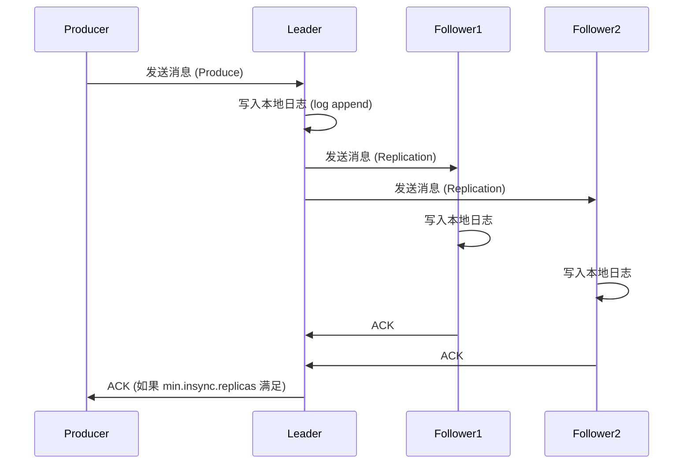
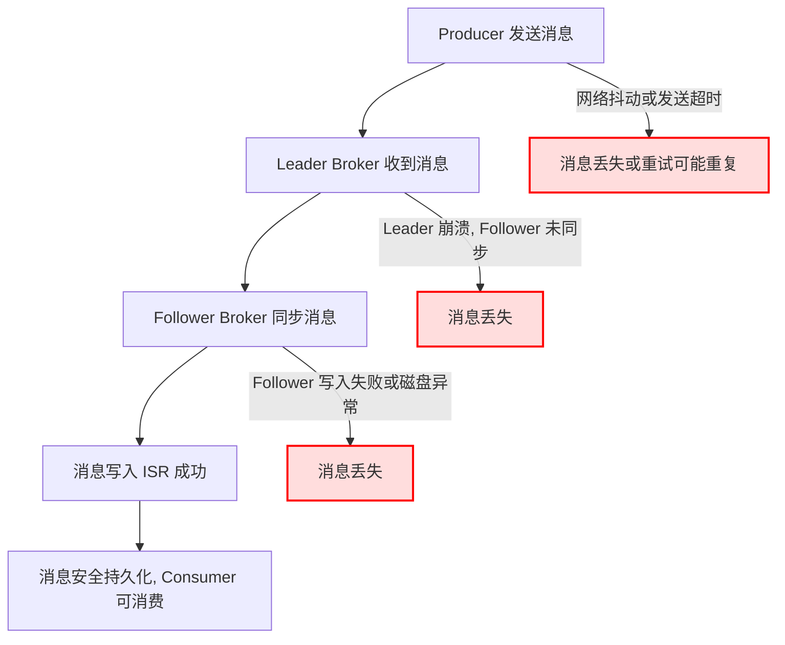
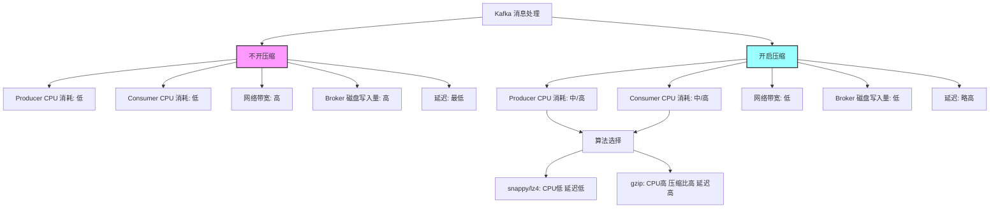
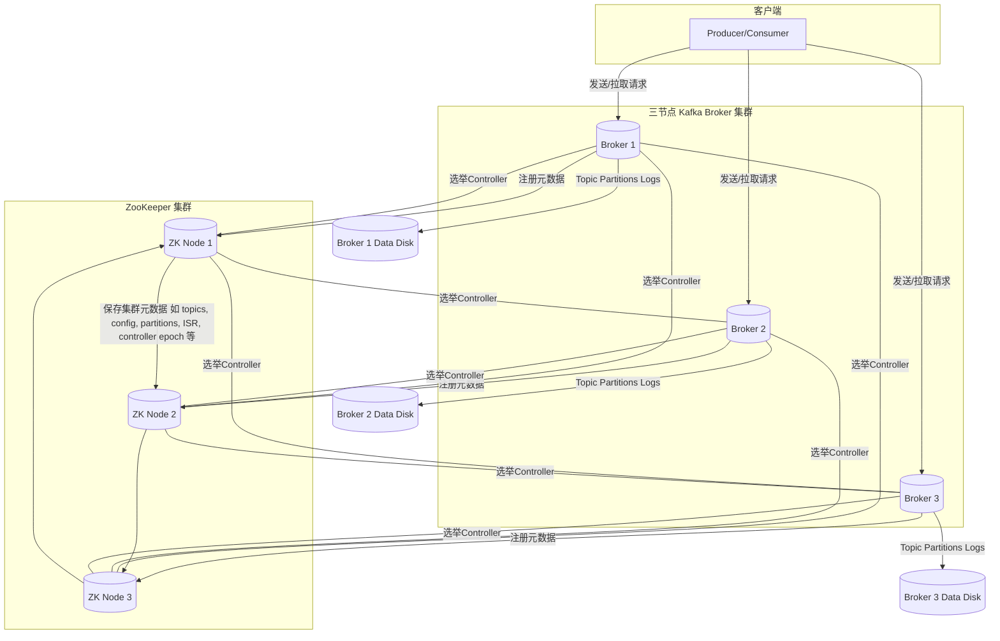
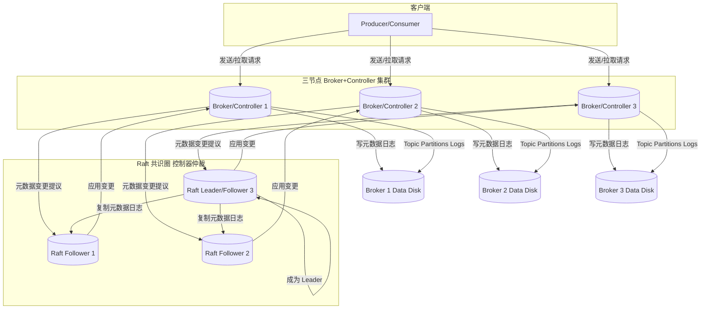
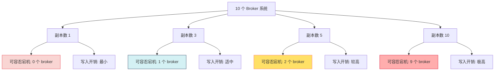

# kafka4.0

## 资料

### 官方文档

https://kafka.apache.org/documentation.html


### API

#### [Kafka API](https://kafka.apache.org/intro#intro_apis)

除了用于管理任务的命令行工具外，Kafka 还有五个针对 Java 和 Scala 的核心 API：

- 管理[API](https://kafka.apache.org/documentation.html#adminapi)用于管理和检查主题、代理和其他 Kafka 对象。
- 生产者[API](https://kafka.apache.org/documentation.html#producerapi)将事件流发布（写入）到一个或多个 Kafka 主题。
- [消费者 API](https://kafka.apache.org/documentation.html#consumerapi) 用于订阅（读取）一个或多个主题并处理向其产生的事件流。
- Kafka [Streams API](https://kafka.apache.org/documentation/streams)用于实现流处理应用程序和微服务。它提供处理事件流的高级函数，包括转换、聚合和连接等有状态操作、窗口化、基于事件时间的处理等等。从一个或多个主题读取输入，以生成到一个或多个主题的输出，从而有效地将输入流转换为输出流。
- [Kafka Connect API](https://kafka.apache.org/documentation.html#connect) 用于构建和运行可重复使用的数据导入/导出连接器，这些连接器可以从外部系统和应用程序消费（读取）事件流，也可以向外部系统和应用程序生成（写入）事件流，以便与 Kafka 集成。例如，连接到 PostgreSQL 等关系数据库的连接器可能会捕获一组表的每次更改。然而，实际上，您通常不需要自己实现连接器，因为 Kafka 社区已经提供了数百个现成的连接器。


## 安装


### windows

#### 1.下载安装包

https://kafka.apache.org/downloads

>本次windows11

官网下载后解压到当前目录

kafka_2.13-4.0.0.tgz


#### 2.解压到指定目录

>D:\kafka2.13-4.0.0


#### 3.生成UUID

```bash
powershell -Command "[guid]::NewGuid().ToString()"
```


#### 4.修改


##### server.properties

>在D:\kafka2.13-4.0.0\config\下的

```properties
############################# Server Basics #############################
process.roles=broker,controller

# 当前节点 ID
node.id=13

# Controller 选举参与者（单节点就自己一个）
controller.quorum.voters=13@localhost:9093

# Controller bootstrap
controller.quorum.bootstrap.servers=localhost:9093

############################# Socket Server Settings #############################
listeners=PLAINTEXT://:9092,CONTROLLER://:9093
advertised.listeners=PLAINTEXT://localhost:9092,CONTROLLER://localhost:9093
inter.broker.listener.name=PLAINTEXT
controller.listener.names=CONTROLLER
listener.security.protocol.map=CONTROLLER:PLAINTEXT,PLAINTEXT:PLAINTEXT

num.network.threads=3
num.io.threads=8
socket.send.buffer.bytes=102400
socket.receive.buffer.bytes=102400
socket.request.max.bytes=104857600

############################# Log Basics #############################
log.dirs=D:/kafka2.13-4.0.0/data/kafka-logs
num.partitions=1
num.recovery.threads.per.data.dir=1

############################# Internal Topic Settings #############################
offsets.topic.replication.factor=1
share.coordinator.state.topic.replication.factor=1
share.coordinator.state.topic.min.isr=1
transaction.state.log.replication.factor=1
transaction.state.log.min.isr=1

############################# Log Retention & Flush #############################
log.retention.hours=168
log.segment.bytes=1073741824
log.retention.check.interval.ms=300000
```


##### kafka-server-start.bat

>在D:\kafka2.13-4.0.0\bin\windows\下

因为在windows中，新版的windows已经移除了

```bash
@echo off
rem Licensed to the Apache Software Foundation (ASF) under one or more
rem contributor license agreements.  See the NOTICE file distributed with
rem this work for additional information regarding copyright ownership.
rem The ASF licenses this file to You under the Apache License, Version 2.0
rem (the "License"); you may not use this file except in compliance with
rem the License.  You may obtain a copy of the License at
rem
rem     http://www.apache.org/licenses/LICENSE-2.0
rem
rem Unless required by applicable law or agreed to in writing, software
rem distributed under the License is distributed on an "AS IS" BASIS,
rem WITHOUT WARRANTIES OR CONDITIONS OF ANY KIND, either express or implied.
rem See the License for the specific language governing permissions and
rem limitations under the License.

IF [%1] EQU [] (
	echo USAGE: %0 server.properties
	EXIT /B 1
)

SetLocal
IF ["%KAFKA_LOG4J_OPTS%"] EQU [""] (
    set KAFKA_LOG4J_OPTS=-Dlog4j2.configurationFile=%~dp0../../config/log4j2.yaml
)
IF ["%KAFKA_HEAP_OPTS%"] EQU [""] (
    set KAFKA_HEAP_OPTS=-Xmx1G -Xms1G
)
"%~dp0kafka-run-class.bat" kafka.Kafka %*
EndLocal
```


#### 5.初始化

>fouXnRfHSVqBPmOFHREjPg为最开始生成的UUID，切记不可随意切换。

```bash
D:\kafka2.13-4.0.0\bin\windows>kafka-storage.bat format -t c13854ff-c1f6-46af-867b-6b4afdddd262 -c ..\..\config\server.properties
```

```java
kafka-storage.bat format -t c13854ff-c1f6-46af-867b-6b4afdddd262 -c E:\项目暂存\kafkaSource4.0.0\config\server.properties
```


#### 6.单节点启动

```bash
cd D:\kafka2.13-4.0.0\bin\windows
kafka-server-start.bat D:\kafka2.13-4.0.0\config\server.properties
```


### windows伪集群（暂未成功）

#### 1.复制三份kafka安装包文件

>将原始安装包解压到D:\kafka_cluster下的kafka_broker1、kafka_broker2、kafka_broker3


>每一个broker中都直接是安装目录下的文件


>在每个broker/下新建一个logs文件夹，三个文件夹都要


#### server.properties

>修改config目录下的server.properties

本次定义node.id三个分别是1001、1002、1003。端口号分别是6001、6002、6003


##### kafka_broker1

```properties
############################# Server Basics #############################
process.roles=broker,controller
node.id=1001
controller.quorum.voters=1001@localhost:6002,1002@localhost:6003,1003@localhost:6004
controller.quorum.bootstrap.servers=localhost:6002,localhost:6003,localhost:6004

############################# Socket Server Settings #############################
listeners=PLAINTEXT://:6001,CONTROLLER://:6002
advertised.listeners=PLAINTEXT://localhost:6001,CONTROLLER://localhost:6002
inter.broker.listener.name=PLAINTEXT
controller.listener.names=CONTROLLER
listener.security.protocol.map=CONTROLLER:PLAINTEXT,PLAINTEXT:PLAINTEXT

num.network.threads=3
num.io.threads=8
socket.send.buffer.bytes=102400
socket.receive.buffer.bytes=102400
socket.request.max.bytes=104857600

############################# Log Basics #############################
log.dirs=D:/kafka_cluster/kafka_broker1/logs
num.partitions=1
num.recovery.threads.per.data.dir=1

############################# Internal Topic Settings #############################
offsets.topic.replication.factor=3
share.coordinator.state.topic.replication.factor=3
share.coordinator.state.topic.min.isr=1
transaction.state.log.replication.factor=3
transaction.state.log.min.isr=1

############################# Log Retention & Flush #############################
log.retention.hours=168
log.segment.bytes=1073741824
log.retention.check.interval.ms=300000
```


#### 生成UUID(所有broker公用一个)

>在D:\kafka_cluster执行

```bash
powershell -Command "[guid]::NewGuid().ToString()"
```

>本次是

```bash
b31eda33-b8d0-439d-939d-456de6dea237
```


#### kafka-server-start.bat

>每个broker的kafka-server-start.bat都替换成以下内容，因为windows11不支持之前的命令

```java
@echo off
rem Licensed to the Apache Software Foundation (ASF) under one or more
rem contributor license agreements.  See the NOTICE file distributed with
rem this work for additional information regarding copyright ownership.
rem The ASF licenses this file to You under the Apache License, Version 2.0
rem (the "License"); you may not use this file except in compliance with
rem the License.  You may obtain a copy of the License at
rem
rem     http://www.apache.org/licenses/LICENSE-2.0
rem
rem Unless required by applicable law or agreed to in writing, software
rem distributed under the License is distributed on an "AS IS" BASIS,
rem WITHOUT WARRANTIES OR CONDITIONS OF ANY KIND, either express or implied.
rem See the License for the specific language governing permissions and
rem limitations under the License.

IF [%1] EQU [] (
	echo USAGE: %0 server.properties
	EXIT /B 1
)

SetLocal
IF ["%KAFKA_LOG4J_OPTS%"] EQU [""] (
    set KAFKA_LOG4J_OPTS=-Dlog4j2.configurationFile=%~dp0../../config/log4j2.yaml
)
IF ["%KAFKA_HEAP_OPTS%"] EQU [""] (
    set KAFKA_HEAP_OPTS=-Xmx1G -Xms1G
)
"%~dp0kafka-run-class.bat" kafka.Kafka %*
EndLocal
```


### 源码环境搭建


#### 1.下载源码安装包

> 进入官网下载`kafka-4.0.0-src.tgz`

官网地址：https://kafka.apache.org/downloads


`-src`表示带有完整的源码文件

- 源码下载：[kafka-4.0.0-src.tgz](https://dlcdn.apache.org/kafka/4.0.0/kafka-4.0.0-src.tgz)（[asc](https://downloads.apache.org/kafka/4.0.0/kafka-4.0.0-src.tgz.asc)，[sha512](https://downloads.apache.org/kafka/4.0.0/kafka-4.0.0-src.tgz.sha512)）


##### 解压到目标文件夹

这里解压到`D:\kafka2.13-4.0.0\source4.0`文件夹下


##### 查看gradle版本

>在gradle\wrapper目录下的`gradle-wrapper.properties`文件内容一般都清楚标注适配的版本

```java
D:\kafka2.13-4.0.0\source4.0\gradle\wrapper
```


>这里可以看到适配的gradle版本为`8.10.2`

```bash
distributionUrl=https\://services.gradle.org/distributions/gradle-8.10.2-all.zip
```


#### 2.下载安装gradle8.10.2

>进入官网下载(非源码即可)

https://gradle.org/releases/


>旧版本需要在发布页面下载

在此搜索8.10.2，对应版本下载仅二进制即可，否则解压文件非常大

#####  [8.10.2](https://gradle.org/releases/#8.10.2)

 2024年9月23日

- 下载：[仅二进制](https://gradle.org/next-steps/?version=8.10.2&format=bin)或 [完整](https://gradle.org/next-steps/?version=8.10.2&format=all)（[校验和](https://gradle.org/release-checksums/#8.10.2)）
- [用户手册](https://docs.gradle.org/8.10.2/userguide/userguide.html)
- [API Javadoc](https://docs.gradle.org/8.10.2/javadoc/)
- [Groovy DSL 参考](https://docs.gradle.org/8.10.2/dsl/)
- [发行说明](https://docs.gradle.org/8.10.2/release-notes.html)


##### 配置环境变量

```java
GRADLE_HOME
D:\gradle8.10.2
```


#### 3.编译构建

进入源码目录下执行`gradle idea`

```bash
D:\kafka2.13-4.0.0\source4.0>gradle idea
```


>编译成功！

```bash
Welcome to Gradle 8.10.2!

Here are the highlights of this release:
 - Support for Java 23
 - Faster configuration cache
 - Better configuration cache reports

For more details see https://docs.gradle.org/8.10.2/release-notes.html

Starting a Gradle Daemon (subsequent builds will be faster)

> Configure project :
Starting build with version 4.0.0 (commit id unknown) using Gradle 8.10.2, Java 21 and Scala 2.13.15
Build properties: ignoreFailures=false, maxParallelForks=24, maxScalacThreads=8, maxTestRetries=0

> Task :idea
Generated IDEA project at file:///D:/kafka2.13-4.0.0/source4.0/kafka.ipr

Deprecated Gradle features were used in this build, making it incompatible with Gradle 9.0.

You can use '--warning-mode all' to show the individual deprecation warnings and determine if they come from your own scripts or plugins.

For more on this, please refer to https://docs.gradle.org/8.10.2/userguide/command_line_interface.html#sec:command_line_warnings in the Gradle documentation.

BUILD SUCCESSFUL in 3m 46s
4 actionable tasks: 4 executed
D:\kafka2.13-4.0.0\source4.0>
```

BUILD SUCCESSFUL in 3m 46s


#### 4.安装scala

> 官网地址

https://www.scala-lang.org/download/3.3.6.html

下载.zip需要对应点击进入github下载页面

- 在[github](https://github.com/scala/scala3/releases/tag/3.3.6) 下载 Scala **3.3.6**的二进制文件。 *[需要运行二进制文件的帮助吗？](https://www.scala-lang.org/download/install.html)*
- 您还可以通过运行以下命令使用[Chocolatey](https://community.chocolatey.org/) 安装 Scala **3.3.6 ：**
  `choco install scala --version=3.3.6`


##### 下载.zip

> 官网地址

https://github.com/scala/scala3/releases/tag/3.3.6


> 选择scala3-3.3.6.zip下载

[scala3-3.3.6.zip](https://github.com/scala/scala3/releases/download/3.3.6/scala3-3.3.6.zip)


##### 环境变量

>新增

```bash
SCALA_HOME
D:\scala3.3.6
```


>添加到path中

```bash
%SCALA_HOME%\bin
```


##### 测试

```bash
C:\Users\lihao>scala
Welcome to Scala 3.3.6 (21.0.6, Java Java HotSpot(TM) 64-Bit Server VM).
Type in expressions for evaluation. Or try :help.

scala>
```

```bash
scala> val a = 10
val a: Int = 10

scala> val b = 20
val b: Int = 20

scala> a + b
val res0: Int = 30

scala> println("my name is~")
my name is~

scala>
```

测试无误


##### 安装scala插件


##### 项目中配置scala


## Kafka4.0.0(无zookeper)集群


### 1.解压缩kafka_2.13-4.0.0.tgz

>解压缩到指定的目录`/hli/software/kafka4/`下

```bash
tar -zxvf /hli/package/kafka_2.13-4.0.0.tgz -C /hli/software/kafka4/
```


>移动到上一级目录

```bash
mv /hli/software/kafka4/kafka_2.13-4.0.0/* /hli/software/kafka4/
```


>删除内嵌包

```bash
rm -rf /hli/software/kafka4/kafka_2.13-4.0.0/
```


### 2.修改server.properties


#### 完整配置文件

```java
############################# 服务器基础配置 #############################

# 此服务器的角色。设置此项表示运行在 KRaft 模式
process.roles=broker,controller

# 此节点的唯一 ID（每个节点必须不同）
node.id=1

# 控制器集群的引导地址，用于连接控制器集群
controller.quorum.bootstrap.servers=localhost:9093

############################# Socket 服务器设置 #############################

# Socket 服务器监听的地址
# 当节点同时承担 broker 和 controller 时，必须至少列出 controller listener
# 如果未定义 broker listener，默认会使用 java.net.InetAddress.getCanonicalHostName() 作为主机名，
# 使用 PLAINTEXT 协议，端口为 9092。
# 格式：
#   listeners = listener_name://host_name:port
# 示例：
#   listeners = PLAINTEXT://your.host.name:9092
listeners=PLAINTEXT://:9092,CONTROLLER://:9093

# 用于 broker 之间通信的 listener 名称
inter.broker.listener.name=PLAINTEXT

# broker 或 controller 向客户端宣传的 listener 名称、主机名和端口
# 如果未设置，则使用 "listeners" 的值
advertised.listeners=PLAINTEXT://localhost:9092,CONTROLLER://localhost:9093

# controller 使用的 listener 名称列表
# 在 KRaft 模式下必须配置
controller.listener.names=CONTROLLER

# 将 listener 名称映射为安全协议，默认名称与协议相同
listener.security.protocol.map=CONTROLLER:PLAINTEXT,PLAINTEXT:PLAINTEXT,SSL:SSL,SASL_PLAINTEXT:SASL_PLAINTEXT,SASL_SSL:SASL_SSL

# 网络线程数：用于接收网络请求并发送响应
num.network.threads=3

# I/O 线程数：用于处理请求，可能包括磁盘 I/O
num.io.threads=8

# Socket 发送缓冲区大小（单位：字节）
socket.send.buffer.bytes=102400

# Socket 接收缓冲区大小（单位：字节）
socket.receive.buffer.bytes=102400

# Socket 可接受的最大请求大小（防止 OOM）
socket.request.max.bytes=104857600

############################# 日志基础配置 #############################

# Kafka 日志存储目录，可以配置多个，使用逗号分隔
log.dirs=/tmp/kraft-combined-logs

# 默认 topic 分区数
num.partitions=1

# 每个数据目录用于日志恢复和关闭时刷新的线程数
num.recovery.threads.per.data.dir=1

############################# 内部主题设置 #############################

# __consumer_offsets、__share_group_state 和 __transaction_state 内部主题的副本因子
# 除非是开发测试环境，否则建议副本因子 > 1 保证可用性
offsets.topic.replication.factor=1
share.coordinator.state.topic.replication.factor=1
share.coordinator.state.topic.min.isr=1
transaction.state.log.replication.factor=1
transaction.state.log.min.isr=1

############################# 日志刷新策略 #############################

# 消息会立即写入文件系统，但默认情况下 fsync() 是懒同步的。
# 以下配置控制数据刷写到磁盘的策略。
# 主要权衡：
#    1. 持久性：未刷新的数据在没有复制的情况下可能丢失。
#    2. 延迟：刷写间隔过大时会导致延迟峰值。
#    3. 吞吐量：刷写通常最耗资源，频繁刷写会导致过多的磁盘寻道。
# 可以全局设置或按 topic 单独覆盖。

# 在强制刷写数据到磁盘之前允许的消息数量
#log.flush.interval.messages=10000

# 在强制刷写数据之前消息可以在日志中停留的最长时间（毫秒）
#log.flush.interval.ms=1000

############################# 日志保留策略 #############################

# 以下配置控制日志段的删除策略。
# 可以按时间或日志大小删除段文件，满足任一条件即删除。
# 删除总是从日志末尾开始。

# 日志文件达到该年龄后可被删除（单位：小时），168 小时 = 7 天
log.retention.hours=168

# 基于大小的日志保留策略，日志段将被删除，除非剩余的日志低于 log.retention.bytes。
# 与 log.retention.hours 独立生效。
#log.retention.bytes=1073741824

# 日志段的最大大小，达到该大小时会生成新的日志段
log.segment.bytes=1073741824

# 检查是否可删除日志段的时间间隔（毫秒）
log.retention.check.interval.ms=300000
```


#### 修改前先备份，养成好习惯

```bash
cp -p /hli/software/kafka4/config/server.properties /hli/software/kafka4/config/server.properties_back
```


#### 修改配置文件

```bash
vim /hli/software/kafka4/config/server.properties
```


#### 修改内容


##### nodeid

>主节点,这里是node1中的配置、如果是node2则是2依次类推

```bash
node.id=1
```


##### broker对外暴露的IP和端口

```bash
#broker对外暴露的IP和端口
advertised.listeners=PLAINTEXT://localhost:9092,CONTROLLER://localhost:9093
```


##### 路径（节点间必须不一样）

```bash
log.dirs=/hli/software/kafka4/datas
```


##### node1

```bash
############################# 基础设置 #############################

# 统一 node1 生成 UUID（KRaft 模式可留在文件中或在 format 时使用 -t 指定）
cluster.id=n8vjTMpNSPWbUOrWJNnHJg

# Kafka 节点角色，KRaft 模式必须设置
process.roles=broker,controller

# 节点唯一 ID，每个节点必须唯一
node.id=1

# KRaft Controller quorum 投票者（所有节点必须一致，使用 id@host:port）
controller.quorum.voters=1@192.168.254.2:9093,2@192.168.254.3:9093,3@192.168.254.4:9093

# 【删除此行】controller.quorum.bootstrap.servers 不是标准配置项，Kafka 4.0 不需要
# controller.quorum.bootstrap.servers=CONTROLLER://192.168.1.101:9093,CONTROLLER://192.168.1.102:9093,CONTROLLER://192.168.1.103:9093

############################# Listener 配置 #############################

# Kafka Broker 和 Controller 的监听地址（本机地址）
listeners=PLAINTEXT://192.168.254.2:9092,CONTROLLER://192.168.254.2:9093

# Broker 之间通信使用的 listener
inter.broker.listener.name=PLAINTEXT

# 【修改】advertised.listeners 不应包含 CONTROLLER，只给客户端和 Broker 间通信用
advertised.listeners=PLAINTEXT://192.168.254.2:9092

# Controller listener 名称
controller.listener.names=CONTROLLER

# Listener 与安全协议映射
listener.security.protocol.map=CONTROLLER:PLAINTEXT,PLAINTEXT:PLAINTEXT

############################# 网络设置 #############################

# 用于接收请求的网络线程数
num.network.threads=3

# 用于处理请求的线程数，包括磁盘 IO
num.io.threads=8

# 发送缓冲区大小
socket.send.buffer.bytes=102400

# 接收缓冲区大小
socket.receive.buffer.bytes=102400

# 最大请求大小（字节），用于防止 OOM
socket.request.max.bytes=104857600

############################# 日志存储 #############################

# 日志存储目录（每个节点不同目录）
log.dirs=/hli/software/kafka4/datas/kafka-logs-node1

# 每个 Topic 默认分区数
num.partitions=1

# 启动恢复时每个日志目录使用的线程数
num.recovery.threads.per.data.dir=1

############################# 内部主题配置 #############################

# offsets 内部主题副本因子，生产环境建议 >= 节点数
offsets.topic.replication.factor=3

# 【删除以下两行】share.coordinator 是实验性功能，4.0 正式版通常不需要
# share.coordinator.state.topic.replication.factor=3
# share.coordinator.state.topic.min.isr=2

# 事务状态主题副本因子
transaction.state.log.replication.factor=3
transaction.state.log.min.isr=2

############################# 日志刷新策略 #############################

# 消息刷盘策略（可根据需求调整）
#log.flush.interval.messages=10000
#log.flush.interval.ms=1000

############################# 日志保留策略 #############################

# 日志保留时间（小时）
log.retention.hours=168

# 单个日志分段文件最大大小
log.segment.bytes=1073741824

# 日志检查删除间隔
log.retention.check.interval.ms=300000

# 日志保留总大小限制（可选配置）
#log.retention.bytes=10737418240

############################# 其它 #############################

# 自动创建 topic
auto.create.topics.enable=true

# 是否允许 broker 删除 topic
delete.topic.enable=true

# 【删除此行】log4j 配置应在 log4j.properties 中管理，不属于 server.properties
# log4j.rootLogger=INFO, stdout
```


##### node2

```bash
############################# 基础设置 #############################

# Kafka 集群的全局唯一 ID（所有节点必须使用相同的 cluster.id）
# 这个 UUID 是在 node1 上生成的，三个节点必须保持一致
cluster.id=n8vjTMpNSPWbUOrWJNnHJg

# Kafka 节点角色，KRaft 模式必须设置
# broker: 处理客户端请求和数据存储
# controller: 负责集群元数据管理（替代 ZooKeeper）
process.roles=broker,controller

# 节点唯一 ID，集群中每个节点必须唯一
# node1=1, node2=2, node3=3
node.id=2

# KRaft Controller 仲裁投票者配置
# 格式：node_id@host:controller_port
# 所有节点的此配置必须完全一致，用于 Controller 选举和元数据同步
controller.quorum.voters=1@192.168.254.2:9093,2@192.168.254.3:9093,3@192.168.254.4:9093

############################# Listener 配置 #############################

# Kafka 的监听地址配置
# PLAINTEXT://ip:port - Broker 监听地址，用于客户端连接和 Broker 间通信
# CONTROLLER://ip:port - Controller 监听地址，用于 Controller 仲裁通信
# 注意：这里使用本机 IP 192.168.254.3
listeners=PLAINTEXT://192.168.254.3:9092,CONTROLLER://192.168.254.3:9093

# Broker 之间通信使用的 listener 名称
# 与 listeners 中的 PLAINTEXT 对应
inter.broker.listener.name=PLAINTEXT

# 广播给客户端的地址（客户端实际连接的地址）
# 只包含 PLAINTEXT，不包含 CONTROLLER（Controller 不对外暴露）
advertised.listeners=PLAINTEXT://192.168.254.3:9092

# Controller 使用的 listener 名称
# 与 listeners 中的 CONTROLLER 对应
controller.listener.names=CONTROLLER

# Listener 名称与安全协议的映射关系
# CONTROLLER 和 PLAINTEXT 都使用明文通信（生产环境建议使用 SSL）
listener.security.protocol.map=CONTROLLER:PLAINTEXT,PLAINTEXT:PLAINTEXT

############################# 网络设置 #############################

# 网络处理线程数
# 用于接收客户端请求和发送响应，建议设置为 CPU 核心数
num.network.threads=3

# IO 处理线程数
# 用于处理请求逻辑，包括磁盘读写，建议设置为 CPU 核心数的 2 倍
num.io.threads=8

# Socket 发送缓冲区大小（字节）
# 影响网络吞吐量，默认 100KB
socket.send.buffer.bytes=102400

# Socket 接收缓冲区大小（字节）
# 影响网络吞吐量，默认 100KB
socket.receive.buffer.bytes=102400

# 单个请求的最大字节数（100MB）
# 用于防止内存溢出（OOM），需要根据消息大小调整
socket.request.max.bytes=104857600

############################# 日志存储 #############################

# Kafka 数据存储目录（日志分段文件存储位置）
# 每个节点使用不同的目录，避免数据冲突
# node1: kafka-logs-node1, node2: kafka-logs-node2, node3: kafka-logs-node3
log.dirs=/hli/software/kafka4/datas/kafka-logs-node2

# 新创建 Topic 时的默认分区数
# 分区数越多，并行度越高，但也会增加资源消耗
num.partitions=1

# 启动时日志恢复和关闭时刷盘使用的线程数（每个数据目录）
# 如果使用 RAID 阵列，建议增加此值
num.recovery.threads.per.data.dir=1

############################# 内部主题配置 #############################

# __consumer_offsets 主题的副本因子
# 用于存储消费者组的位移信息，建议设置为集群节点数（3）
offsets.topic.replication.factor=3

# __transaction_state 主题的副本因子
# 用于存储事务状态信息，建议设置为集群节点数（3）
transaction.state.log.replication.factor=3

# __transaction_state 主题的最小同步副本数
# 至少需要 2 个副本同步成功才认为写入成功，保证数据可靠性
transaction.state.log.min.isr=2

############################# 日志刷新策略 #############################

# Kafka 默认异步刷盘（写入操作系统缓存），以下配置可强制同步刷盘
# 注意：同步刷盘会显著降低性能，建议依赖副本机制保证数据可靠性

# 每接收多少条消息强制刷盘一次（注释表示不启用）
#log.flush.interval.messages=10000

# 每隔多少毫秒强制刷盘一次（注释表示不启用）
#log.flush.interval.ms=1000

############################# 日志保留策略 #############################

# 日志保留时间（小时）
# 超过此时间的日志分段文件将被删除，默认 7 天（168 小时）
log.retention.hours=168

# 单个日志分段文件的最大大小（1GB）
# 达到此大小后将创建新的日志分段文件
log.segment.bytes=1073741824

# 日志清理检查间隔（毫秒）
# 每隔 5 分钟检查一次是否有日志需要删除
log.retention.check.interval.ms=300000

# 日志保留的最大总大小（字节），可选配置
# 超过此大小后，最旧的日志分段将被删除
# 注释表示不限制总大小，只根据时间删除
#log.retention.bytes=10737418240

############################# 其它配置 #############################

# 是否允许自动创建 Topic
# true: 生产者或消费者访问不存在的 Topic 时自动创建
# false: 必须手动创建 Topic（生产环境建议设置为 false）
auto.create.topics.enable=true

# 是否允许删除 Topic
# true: 可以通过命令删除 Topic
# false: 删除命令无效（Kafka 4.0 默认为 true）
delete.topic.enable=true
```


##### node3

```bash
############################# 基础设置 #############################

# Kafka 集群的全局唯一 ID（所有节点必须使用相同的 cluster.id）
# 这个 UUID 是在 node1 上生成的，三个节点必须保持一致
cluster.id=n8vjTMpNSPWbUOrWJNnHJg

# Kafka 节点角色，KRaft 模式必须设置
# broker: 处理客户端请求和数据存储
# controller: 负责集群元数据管理（替代 ZooKeeper）
process.roles=broker,controller

# 节点唯一 ID，集群中每个节点必须唯一
# node1=1, node2=2, node3=3
node.id=3

# KRaft Controller 仲裁投票者配置
# 格式：node_id@host:controller_port
# 所有节点的此配置必须完全一致，用于 Controller 选举和元数据同步
controller.quorum.voters=1@192.168.254.2:9093,2@192.168.254.3:9093,3@192.168.254.4:9093

############################# Listener 配置 #############################

# Kafka 的监听地址配置
# PLAINTEXT://ip:port - Broker 监听地址，用于客户端连接和 Broker 间通信
# CONTROLLER://ip:port - Controller 监听地址，用于 Controller 仲裁通信
# 注意：这里使用本机 IP 192.168.56.103
listeners=PLAINTEXT://192.168.254.4:9092,CONTROLLER://192.168.254.4:9093

# Broker 之间通信使用的 listener 名称
# 与 listeners 中的 PLAINTEXT 对应
inter.broker.listener.name=PLAINTEXT

# 广播给客户端的地址（客户端实际连接的地址）
# 只包含 PLAINTEXT，不包含 CONTROLLER（Controller 不对外暴露）
advertised.listeners=PLAINTEXT://192.168.254.4:9092

# Controller 使用的 listener 名称
# 与 listeners 中的 CONTROLLER 对应
controller.listener.names=CONTROLLER

# Listener 名称与安全协议的映射关系
# CONTROLLER 和 PLAINTEXT 都使用明文通信（生产环境建议使用 SSL）
listener.security.protocol.map=CONTROLLER:PLAINTEXT,PLAINTEXT:PLAINTEXT

############################# 网络设置 #############################

# 网络处理线程数
# 用于接收客户端请求和发送响应，建议设置为 CPU 核心数
num.network.threads=3

# IO 处理线程数
# 用于处理请求逻辑，包括磁盘读写，建议设置为 CPU 核心数的 2 倍
num.io.threads=8

# Socket 发送缓冲区大小（字节）
# 影响网络吞吐量，默认 100KB
socket.send.buffer.bytes=102400

# Socket 接收缓冲区大小（字节）
# 影响网络吞吐量，默认 100KB
socket.receive.buffer.bytes=102400

# 单个请求的最大字节数（100MB）
# 用于防止内存溢出（OOM），需要根据消息大小调整
socket.request.max.bytes=104857600

############################# 日志存储 #############################

# Kafka 数据存储目录（日志分段文件存储位置）
# 每个节点使用不同的目录，避免数据冲突
# node1: kafka-logs-node1, node2: kafka-logs-node2, node3: kafka-logs-node3
log.dirs=/hli/software/kafka4/datas/kafka-logs-node3

# 新创建 Topic 时的默认分区数
# 分区数越多，并行度越高，但也会增加资源消耗
num.partitions=1

# 启动时日志恢复和关闭时刷盘使用的线程数（每个数据目录）
# 如果使用 RAID 阵列，建议增加此值
num.recovery.threads.per.data.dir=1

############################# 内部主题配置 #############################

# __consumer_offsets 主题的副本因子
# 用于存储消费者组的位移信息，建议设置为集群节点数（3）
offsets.topic.replication.factor=3

# __transaction_state 主题的副本因子
# 用于存储事务状态信息，建议设置为集群节点数（3）
transaction.state.log.replication.factor=3

# __transaction_state 主题的最小同步副本数
# 至少需要 2 个副本同步成功才认为写入成功，保证数据可靠性
transaction.state.log.min.isr=2

############################# 日志刷新策略 #############################

# Kafka 默认异步刷盘（写入操作系统缓存），以下配置可强制同步刷盘
# 注意：同步刷盘会显著降低性能，建议依赖副本机制保证数据可靠性

# 每接收多少条消息强制刷盘一次（注释表示不启用）
#log.flush.interval.messages=10000

# 每隔多少毫秒强制刷盘一次（注释表示不启用）
#log.flush.interval.ms=1000

############################# 日志保留策略 #############################

# 日志保留时间（小时）
# 超过此时间的日志分段文件将被删除，默认 7 天（168 小时）
log.retention.hours=168

# 单个日志分段文件的最大大小（1GB）
# 达到此大小后将创建新的日志分段文件
log.segment.bytes=1073741824

# 日志清理检查间隔（毫秒）
# 每隔 5 分钟检查一次是否有日志需要删除
log.retention.check.interval.ms=300000

# 日志保留的最大总大小（字节），可选配置
# 超过此大小后，最旧的日志分段将被删除
# 注释表示不限制总大小，只根据时间删除
#log.retention.bytes=10737418240

############################# 其它配置 #############################

# 是否允许自动创建 Topic
# true: 生产者或消费者访问不存在的 Topic 时自动创建
# false: 必须手动创建 Topic（生产环境建议设置为 false）
auto.create.topics.enable=true

# 是否允许删除 Topic
# true: 可以通过命令删除 Topic
# false: 删除命令无效（Kafka 4.0 默认为 true）
delete.topic.enable=true

```


### 3.开放9092,9093端口


假设你用的是 **CentOS/RedHat Linux**，使用 `firewalld` 管理防火墙。

#### 查看防火墙状态

```
sudo firewall-cmd --state
```

#### 放行端口（永久生效）

针对每台节点执行：

```
sudo firewall-cmd --zone=public --add-port=9092/tcp --permanent
sudo firewall-cmd --zone=public --add-port=9093/tcp --permanent
```

#### 重新加载防火墙

```
sudo firewall-cmd --reload
```

#### 验证端口是否放行

```
sudo firewall-cmd --list-ports
```

应该看到：

```
9092/tcp 9093/tcp
```


### 4.node1上生成UUID

```bash
[root@node1 kafka4]# cd /hli/software/kafka4
[root@node1 kafka4]# bin/kafka-storage.sh random-uuid
```

```bash
n8vjTMpNSPWbUOrWJNnHJg
```

注：所有集群的实例上都使用统一的UUID


### 5.集群所有实例都加上统一UUID


需要在 **Node1、Node2、Node3** 的 `server.properties` 中加上这一行：

```bash
#统一node1生成UUID
cluster.id=n8vjTMpNSPWbUOrWJNnHJg
```

最好放在文件的开头，方便管理，例如：

```
############################# 基础设置 #############################

#统一node1生成UUID
cluster.id=n8vjTMpNSPWbUOrWJNnHJg

process.roles=broker,controller
node.id=1
...
```

⚡ 注意：

- **cluster.id 必须所有节点一致**，否则集群无法启动
- 只要保持一致，这一步只需要执行一次 UUID 生成


### 6.格式化节点存储

在 **每个节点**（Node1/Node2/Node3）执行以下命令：

```
cd /hli/software/kafka4
bin/kafka-storage.sh format -t n8vjTMpNSPWbUOrWJNnHJg -c config/server.properties
```

这一步会初始化 Kafka KRaft 存储目录。


```bash
[root@node1 kafka4]# bin/kafka-storage.sh format   -t n8vjTMpNSPWbUOrWJNnHJg   -c config/server.properties
```

```bash
Formatting metadata directory /hli/software/kafka4/datas/kafka-logs-node1 with metadata.version 4.0-IV3.
```


### 7.启动kafka

```bash
bin/kafka-server-start.sh config/server.properties
```

`bin/kafka-server-start.sh config/server.properties` 默认是**前台运行**的（会占用当前终端）。
 如果你直接这么启动，关掉终端 Kafka 就会退出。


#### ✅ 后台运行的正确命令：

```
bin/kafka-server-start.sh -daemon config/server.properties
```

#### 💡 启动后你可以用以下命令确认 Kafka 是否真的启动成功：

1. ##### **看进程**

   ```
   ps -ef | grep kafka
   ```

   > 看到类似 `/kafka.Kafka config/server.properties` 的进程说明启动成功。

2. ##### **看端口（Kafka 默认监听 9092 或 9093）**

   ```
   netstat -ntlp | grep 9092
   ```

   > 例如看到：

   ```
   tcp6  0  0 192.168.1.101:9092  LISTEN  java
   ```

   表示 Kafka 监听正常。

3. ##### **看日志**

   ```
   tail -n 50 logs/server.log
   ```

   > 如果日志里出现：

   ```
   [KafkaServer id=1] started (kafka.server.KafkaServer)
   ```

   那就是完全启动成功 ✅。


### 8.验证集群状态

三个节点都启动后，在任意节点执行：

```bash
cd /hli/software/kafka4

# 1. 查看集群元数据
bin/kafka-metadata-quorum.sh --bootstrap-server 192.168.254.2:9092 describe --status

# 2. 查看 Broker 列表（应该显示 3 个 Broker）
bin/kafka-broker-api-versions.sh --bootstrap-server 192.168.254.2:9092 | grep id

# 3. 创建测试 Topic
bin/kafka-topics.sh --create --topic test-topic \
  --partitions 3 --replication-factor 3 \
  --bootstrap-server 192.168.254.2:9092

# 4. 查看 Topic 详情
bin/kafka-topics.sh --describe --topic test-topic \
  --bootstrap-server 192.168.56.101:9092
```

如果能正常执行这些命令，说明集群部署成功！

现在请按照上面的步骤在 Node2 上重新执行，记得先 `cd /hli/software/kafka4`。


#### 查看元数据

```bash
[root@node1 kafka4]# bin/kafka-metadata-quorum.sh --bootstrap-server 192.168.254.2:9092 describe --status
```

```bash
ClusterId:              n8vjTMpNSPWbUOrWJNnHJg
LeaderId:               1
LeaderEpoch:            3
HighWatermark:          823
MaxFollowerLag:         0
MaxFollowerLagTimeMs:   0
CurrentVoters:          [{"id": 1, "directoryId": null, "endpoints": ["CONTROLLER://192.168.56.101:9093"]}, {"id": 2, "directoryId": null, "endpoints": ["CONTROLLER://192.168.56.102:9093"]}, {"id": 3, "directoryId": null, "endpoints": ["CONTROLLER://192.168.56.103:9093"]}]
CurrentObservers:       []
```

**Kafka 控制器 quorum（控制器选举集群）已经启动并运行正常。**

我们来逐项分析一下这段状态信息：

| 字段                               | 含义                              | 当前状态                             |
| ---------------------------------- | --------------------------------- | ------------------------------------ |
| `ClusterId`                        | Kafka 集群唯一 ID（格式化时生成） | ✅ `n8vjTMpNSPWbUOrWJNnHJg`           |
| `LeaderId`                         | 当前控制器 leader 的 broker id    | ✅ `1`（说明当前节点是控制器 Leader） |
| `LeaderEpoch`                      | 控制器选举的 epoch（每次选主+1）  | ✅ `3`（说明选主已经完成）            |
| `HighWatermark`                    | 控制器日志同步进度                | ✅ 表示日志复制健康                   |
| `CurrentVoters`                    | 当前参与控制器投票的节点          | ✅ 三个节点都在：`1, 2, 3`            |
| `CONTROLLER://192.168.56.xxx:9093` | 表示各 broker 的控制器通信地址    | ✅ 都识别正确                         |
| `CurrentObservers`                 | 观察者节点（可选）                | 空，正常                             |

------

###### ✅ 结论：

你的这台 Kafka（`id=1`）已经：

- 成功完成 **Raft controller 选举**
- 当前是整个集群的 **Controller Leader**
- 控制器日志同步状态正常
   这说明启动 **非常成功**。🎯


```bash
[root@node1 kafka4]# bin/kafka-broker-api-versions.sh --bootstrap-server 192.168.254.2:9092 | grep id

192.168.56.102:9092 (id: 2 rack: null isFenced: false) -> (
192.168.56.103:9092 (id: 3 rack: null isFenced: false) -> (
192.168.56.101:9092 (id: 1 rack: null isFenced: false) -> (
```


#### 创建topic

```bash
[root@node1 kafka4]# bin/kafka-topics.sh --create --topic test-topic \
>   --partitions 3 --replication-factor 3 \
>   --bootstrap-server 192.168.254.2:9092
```

```bash
Created topic test-topic.
```


```bash
[root@node1 kafka4]# bin/kafka-topics.sh --describe --topic test-topic --bootstrap-server 192.168.254.2:9092
```

```bash
Topic: test-topic	TopicId: CrHomeL5T0G52b_LvEeveg	PartitionCount: 3	ReplicationFactor: 3	Configs: segment.bytes=1073741824
	Topic: test-topic	Partition: 0	Leader: 1	Replicas: 1,2,3	Isr: 1,2,3	Elr: 	LastKnownElr: 
	Topic: test-topic	Partition: 1	Leader: 2	Replicas: 2,3,1	Isr: 2,3,1	Elr: 	LastKnownElr: 
	Topic: test-topic	Partition: 2	Leader: 3	Replicas: 3,1,2	Isr: 3,1,2	Elr: 	LastKnownElr: 
```


这说明你的 **Kafka 集群（3 节点）现在已经完全正常运行**，控制器选举、数据副本、ISR 同步全部健康。
 我们来细看一下这条输出，逐项确认一下系统状态 👇

------

##### ✅ 核心状态分析

| 字段                        | 说明                                           | 当前状态           |
| --------------------------- | ---------------------------------------------- | ------------------ |
| `Created topic test-topic.` | 成功创建了主题 `test-topic`                    | ✅ 成功             |
| `PartitionCount: 3`         | 分区数为 3                                     | ✅ 正常             |
| `ReplicationFactor: 3`      | 每个分区副本数为 3（即所有 broker 各保存一份） | ✅ 分布健康         |
| `Leader: 1 / 2 / 3`         | 每个分区的 Leader 在不同 broker 上（1、2、3）  | ✅ 负载均衡         |
| `Replicas: 1,2,3`           | 每个分区都有三台机器存放副本                   | ✅ 冗余配置正确     |
| `Isr: 1,2,3`                | 所有副本都同步（In-Sync Replica）              | ✅ 副本同步完全正常 |

------

##### 💯 结论

🚀 **你的 Kafka 集群已经完美搭建成功！**
 控制器、broker、Raft quorum、topic 副本机制——全部处于理想状态。


#### 验证数据状态

```bash
bin/kafka-console-producer.sh \
  --bootstrap-server 192.168.254.2:9092 \
  --topic test-topic
```

运行后就会进入交互输入模式：

> hello kafka
> this is node1 test
> 输入几行文字，按下 Ctrl + D（或 Ctrl + C）退出。

✅ 然后验证消息消费

```bash
bin/kafka-console-consumer.sh \
  --bootstrap-server 192.168.254.2:9092 \
  --topic test-topic \
  --from-beginning
```

看到刚才发送的 “hello kafka” 等内容就说明整个 Kafka 流程 生产 + 消费 全通了。


>验证成功

```bash
[root@node1 kafka4]# bin/kafka-console-producer.sh   --bootstrap-server 192.168.254.2:9092   --topic test-topic
>你好呀！kafka我爱你！
>[root@node1 kafka4]#bin/kafka-console-consumer.sh   --bootstrap-server 192.168.254.2:9092   --topic test-topic   --from-beginning
你好呀！kafka我爱你！
你好呀！kafka！
```

这输出说明——你的 **Kafka KRaft 模式集群（多节点 controller + broker）已经彻底跑通了**：
 ✅ Controller 选举正常（Leader: 1）
 ✅ Topic 创建成功（3 分区 × 3 副本）
 ✅ Producer 写入成功
 ✅ Consumer 从日志拉取成功
 ✅ ISR（同步副本）健康、无延迟

> 换句话说：你现在这套集群，已经是一个真正意义上可用的分布式 Kafka 系统。


### 9.kafka脚本


> 写个启动脚本（方便集群重启）

建议你在每个节点上 `/hli/software/kafka4/start-kafka.sh` 里写：

#### start-kafka.sh

```bash
#!/bin/bash

KAFKA_HOME="/hli/software/kafka4"
CONFIG_FILE="$KAFKA_HOME/config/server.properties"

# 检查 Kafka 是否已运行
if netstat -tulnp 2>/dev/null | grep ':9092' > /dev/null; then
    echo "Kafka 已在运行，跳过启动。"
    exit 0
fi

echo "正在启动 Kafka..."
cd "$KAFKA_HOME" || { echo "Kafka 目录不存在"; exit 1; }

bin/kafka-server-start.sh -daemon "$CONFIG_FILE"

# 等待 Kafka 启动
MAX_WAIT=30
WAITED=0
while ! netstat -tulnp 2>/dev/null | grep ':9092' > /dev/null; do
    sleep 1
    WAITED=$((WAITED+1))
    if [ $WAITED -ge $MAX_WAIT ]; then
        echo "Kafka 启动超时 ❌"
        exit 1
    fi
done

echo "Kafka 启动成功 ✅"
```


```bash
bin/kafka-server-start.sh -daemon config/server.properties
```


#### stop-kafka.sh

```bash
#!/bin/bash
# Kafka 停止脚本（端口检测法）

KAFKA_PORT=9092

echo "停止 Kafka..."

# 检查 Kafka 是否运行（端口检测）
if netstat -tulnp 2>/dev/null | grep ":$KAFKA_PORT" > /dev/null; then
    PID=$(netstat -tulnp 2>/dev/null | grep ":$KAFKA_PORT" | awk '{print $7}' | cut -d'/' -f1)
    if [ -n "$PID" ]; then
        kill -9 "$PID"
        echo "Kafka (PID $PID) 已停止"
    else
        echo "找不到 Kafka 的 PID，停止失败"
    fi
else
    echo "Kafka 未运行"
fi
```


#### 赋权

>使其生效

```bash
chmod +x /hli/software/kafka4/start-kafka.sh
chmod +x /hli/software/kafka4/stop-kafka.sh
```

------

### 

随时用下面命令查看当前 Controller 与 ISR：

```
bin/kafka-metadata-quorum.sh describe --bootstrap-server 192.168.56.101:9092
```

或者：

```
bin/kafka-topics.sh --describe --topic test-topic --bootstrap-server 192.168.56.101:9092
```


## 一、什么是kafka？


### 概念


#### 发布订阅系统

​	**Kafka是一个由Scala和Java语言开发的，经典高吞吐量的分布式消息发布和订阅系统**，也是大数据技术领域中用作数据交换的核心组件之一。**以高吞吐，低延迟，高伸缩，高可靠性，高并发，且社区活跃度高等特性**，从而备受广大技术组织的喜爱。

​	2010年，Linkedin公司为了解决消息传输过程中由各种缺陷导致的阻塞、服务无法访问等问题，主导开发了一款分布式消息日志传输系统。主导开发的首席架构师Jay Kreps因为喜欢写出《变形记》的西方表现主义文学先驱小说家Jay Kafka，所以给这个消息系统起了一个很酷，却和软件系统特性无关的名称Kafka。

​	因为备受技术组织的喜爱，2011年，Kafka软件被捐献给Apache基金会，并于7月被纳入Apache软件基金会孵化器项目进行孵化。2012年10月，Kafka从孵化器项目中毕业，转成Apache的顶级项目。**由独立的消息日志传输系统转型为开源分布式事件流处理平台系统，被数千家公司用于高性能数据管道、流分析、数据集成和关键任务应用程序。**


#### [Kafka 是如何工作的？](https://kafka.apache.org/intro#intro_nutshell)

**Kafka 是一个分布式系统，由服务器**和**客户端** 组成，它们通过高性能[TCP 网络协议](https://kafka.apache.org/protocol.html)进行通信。它可以部署在本地和云环境中的裸机硬件、虚拟机和容器上。

**服务器**：Kafka 由一台或多台服务器组成集群运行，这些服务器可以跨越多个数据中心或云区域。其中一些服务器构成存储层，称为代理 (broker)。其他服务器运行 [Kafka Connect](https://kafka.apache.org/documentation/#connect)，以事件流的形式持续导入和导出数据，从而将 Kafka 与您现有的系统（例如关系数据库）以及其他 Kafka 集群集成。为了帮助您实现关键任务用例，Kafka 集群具有高度的可扩展性和容错能力：如果其中任何一台服务器发生故障，其他服务器将接管其工作，以确保持续运行且不会丢失任何数据。

**客户端**：它们允许您编写分布式应用程序和微服务，以便能够并行、大规模地读取、写入和处理事件流，并且即使在网络问题或机器故障的情况下也能保持容错能力。Kafka 内置了一些客户端，此外， Kafka 社区还提供了[数十个客户端，](https://cwiki.apache.org/confluence/display/KAFKA/Clients)包括 Java 和 Scala 客户端（包括更高级别的 [Kafka Streams](https://kafka.apache.org/documentation/streams/)库），以及 Go、Python、C/C++ 和许多其他编程语言的客户端，以及 REST API。


### Partition(分区)

**4.5 消费者**（讲分区如何被分配给消费者，尤其是 group 里如何协调）

消费者订阅topic数据所在的分区中，如果某种原因中断了，拉取。这个时候，消费者可以通过offset偏移量来按照上次结束的位置继续拉取消息。


**4.9 复制**（分区副本机制，Leader/Follower 关系）

**5.4 日志**（分区日志文件的物理实现）


#### 作用与定义

- `Partition`是Kafka主题(Topic)下的物理分片。每个主题都会被分割成一个或多个分区。
- kafka将消息(即数据)分布到不同分区上，便于分布式存储与并行消费，提升整体吞吐量。
- 每个分区会在物理上对应一个或者多个日志文件。在集群中也可能会有多个副本(Replica)用来容错。

>在kafka集群中的多个副本，它们之间是如何实现不同分区的容错？broker之间相互推送配合备份吗

**Leader 提供数据，Follower 主动拉取，并在 Controller 管理下保持同步**。这样即使某个 Broker 挂掉，其他副本仍能接管 Leader，保证系统不丢数据且持续可用。


#### 重要特征

- 记录在分区内部是有序的，不同分区之间则无法保证全局顺序。
- 每个消费者消费某一个分区时，按照分区内部的顺序读取消息。
- Kafka**借助分区机制可以并发读写**，提高处理效率。

>kafka如何保证某一个partition(分区)的消息读取顺序呢？生产者推送的顺序呢？

Kafka **顺序保证的粒度是 Partition**，也就是说 Kafka 只保证**同一个 Partition 内的消息是有序的**，而不保证跨 Partition 的全局有序。

##### 为什么能保证顺序？

- 每个 Partition 的数据是存储在一个 **单独的日志文件** 中，Kafka 在写入时是顺序追加（append-only）。
- 读写操作是基于 **offset（偏移量）** 顺序进行的。
- 同一个 Partition 内的所有消息都有一个严格递增的 offset。
- 消费者按 offset 顺序读取，就保证了顺序。


##### 2️⃣ 生产者如何保证推送顺序

生产者能否保证顺序，取决于以下条件：

###### **条件**

1. **发送到同一个 Partition**

   - Kafka 通过 **Partitioner（分区器）** 来决定消息发送到哪个 Partition。
   - 如果所有相关消息都发送到同一个 Partition，则顺序可以保证。

2. **单线程顺序发送**

   - 如果生产者是多线程并发发送，即使是同一个 Partition，消息顺序也不一定保证，因为网络延迟和内部缓冲会打乱顺序。
   - 要保证顺序，通常需要 **单线程生产** 或 **针对同一 Partition 使用同步发送**。

3. **开启 `max.in.flight.requests.per.connection=1`**

   - **Kafka 生产者默认可以有多个“飞行中请求”（in-flight requests），这可能导致消息乱序。**
   - **设置为 1，可以确保请求顺序发送，避免乱序风险，但会降低吞吐量。**

   

##### 总结生产者顺序保证条件：

> 同一个 Partition + 单线程发送 + `max.in.flight.requests.per.connection=1` 才能严格保证生产顺序。

| 场景             | 顺序保证条件                                                 |
| ---------------- | ------------------------------------------------------------ |
| **生产端**       | 同 Partition + 单线程发送 + `max.in.flight.requests.per.connection=1` |
| **消费端**       | 同 Partition + 单消费者 + 顺序处理                           |
| **跨 Partition** | 无全局顺序保证，只能保证各 Partition 内顺序                  |

Kafka 的顺序保证靠的是 **Partition 单日志 + offset 递增 + 分配机制**，生产者必须按规则发送，消费者必须按规则消费。


#### partition分配策略

Kafka常见的Partition分配策略有三种(生产者组策略)

| 策略               | 特点                                                         |
| ------------------ | ------------------------------------------------------------ |
| **RoundRobin**     | 轮询分配 Partition 给消费者，分配更均衡，适合 Partition 数多的情况。 |
| **Range**          | 将 Partition 按范围分配给消费者。适合 Partition 数较少，消费者数量固定的场景。但可能不均衡。 |
| **StickyAssignor** | 尽量减少 Partition 重平衡次数，保持消费者分配稳定，适合频繁变动场景。 |


#### Offset管理策略

kafka通过offset来跟踪消费进度，offset有两种提交方式：

1. 自动提交
   1. 默认：每隔一定时间(`auto.commit.interval.ms`)自动提交offset
   2. 优点：简单，不用手动管理
   3. 缺点：可能出现重复消费或漏消费
2. 手动提交
   1. 开发者在消费逻辑中显式提交offset
   2. 优点：精准控制，避免漏消费或者重复消费。
   3. 缺点：需要开发者额外管理。


##### 分区如何被分配给消费者

在 Kafka 中，分区（Partition）的分配是由 **Consumer Group（消费者组）协调机制**负责的。一个 Partition 在同一个 Consumer Group 内**只能被一个消费者消费**，而一个消费者可以消费多个 Partition。分配流程大致如下：

1. **加入消费组**
    消费者启动后向 **Group Coordinator（组协调器）** 注册，声明自己属于某个消费组，并订阅 Topic。
2. **触发分配**
    当消费组内有新消费者加入、消费者离开，或 Topic 的 Partition 发生变化时，会触发 **重平衡（Rebalance）**，由组协调器重新分配 Partition。
3. **选择分配策略**
    Kafka 支持多种分配策略，例如：
   - **Range**：按 Partition 范围分配给消费者，Partition 数少时简单但可能负载不均。
   - **RoundRobin**：轮询分配 Partition，负载均衡性较好。
   - **StickyAssignor**：尽量保持之前的分配结果，减少重平衡次数，适合 Partition 多且消费者频繁变动的场景。
4. **分配结果**
    组协调器将分配结果下发给每个消费者，每个消费者获得它负责消费的 Partition 列表，并开始按 offset 顺序拉取对应 Partition 的数据。

⚡ **关键点**：

- 分区分配策略只决定“哪个消费者消费哪个 Partition”，并不影响 Partition 内的消息顺序。
- Partition 内消息的顺序由生产端写入顺序保证，消费者只需按 offset 顺序消费即可。


#### 消费者、分区、offset 关系

1. **消费者订阅 topic → 被分配到分区**
   - 一个 **consumer group（消费者组）** 内的消费者会协调分区分配（由 group coordinator 协调）。
   - 每个分区同一时刻只会被 **一个 group 内的消费者** 消费。
2. **消费过程中断 → offset 起作用**
   - 每条消息在分区日志里都有唯一的 **offset（位移号）**。
   - 消费者会周期性地向 **__consumer_offsets 内部主题** 提交自己的 offset（也可以手动提交）。
3. **恢复消费**
   - 如果消费者宕机、重启、rebalance 或者迁移到其他机器，它会从 **上次提交的 offset** 开始继续拉取消息。
   - 这样就保证了消费的连续性。


### consume(消费者)

​	Kafka消费者**通过向其想要消费的分区所在的Broker发出"fetch"请求来工作**。消费者**在每次请求中，指定其在日志中的偏移量，并从该位置开始接收一个日志块**。因此，消费者对该位置拥有强大的控制权，并且**可以根据需要回退该位置以重新消费数据**。


我们考虑的第一个问题是：

#### 消费者应该从代理那里拉取数据还是代理应该将数据推送给消费者？

​	在这方面，Kafka 遵循大多数消息传递系统共享的更传统的设计，**其中数据从生产者推送到代理，并由消费者从代理那里拉取。**一些以日志为中心的系统，例如[Scribe](https://github.com/facebook/scribe)和 [Apache Flume](https://flume.apache.org/)，遵循非常不同的基于推送的路径，即将数据推送到下游。这两种方法各有利弊。但是，**基于推送的系统难以处理不同的消费者，因为代理控制着数据传输的速率。目标通常是让消费者能够以尽可能高的速率消费；不幸的是，在推送系统中，这意味着当消费者的消费率低于生产率时，消费者往往会不堪重负（本质上是一种拒绝服务攻击）**。基于拉的系统具有更好的特性，即消费者只是落后并在可能的情况下赶上来。可以通过某种退避协议来缓解这种情况，让消费者能够指示其已不堪重负，但要让传输速率充分利用消费者（但又不至于过度利用）却比想象中要棘手得多。之前尝试过以这种方式构建系统，最终我们选择了更传统的拉取模型。

​	基于拉取的系统的另一个优势是，**它能够对发送给消费者的数据进行批量处理**。基于推送的系统必须选择是立即发送请求，还是积累更多数据，稍后再发送，而不知道下游消费者是否能够立即处理。如果为了追求低延迟而进行调整，这将导致每次只发送一条消息，而传输最终还是会被缓冲，这很浪费。基于拉取的设计解决了这个问题，**因为消费者总是会拉取日志中当前位置之后的所有可用消息（或直到某个可配置的最大大小）。因此，可以获得最佳的批处理，而不会引入不必要的延迟。**

> 简单的拉取式系统的缺陷在于

​	**如果 Broker 没有数据，消费者可能会陷入一个死循环，实际上就是忙着等待数据到达。为了避免这种情况，我们在拉取请求中设置了一些参数，允许消费者请求阻塞在“长轮询”中，直到数据到达**（也可以选择等待一定数量的字节可用，以确保传输数据足够大）。


### Consume Group

#### 概念

**Consumer Group（消费者组）**：Kafka 中的一组消费者，它们共同消费一个 Topic。

同一个 Group 内的消费者**协作消费**，每个 Partition 只能被 Group 内的一个消费者消费，以保证 **顺序性和无重复**。

例如：

```java
Topic T 有 4 个 Partition：P0, P1, P2, P3  
Consumer Group G 有 2 个消费者：C1、C2  
分配可能是：
C1 → P0, P2  
C2 → P1, P3
```


#### 核心目标

> Kafka 的消费策略主要解决两个问题：

1. **Partition 分配**（谁消费哪个 Partition？）
2. **Offset 管理**（如何记录消费进度？）


### 幂等性机制


#### 如何保证？

**Producer ID（PID）**：生产者在连接 Kafka broker 时获得的唯一 ID，用于区分不同生产者实例。

**序列号（Sequence Number）**：生产者为每个 Partition 消息分配递增的序列号，确保消息顺序可追踪。

**Broker 重放机制**：broker 检查序列号，丢弃重复消息，防止消息重复写入 Partition。


#### 工作流程

1. Producer 发送消息时，带上 PID + 序列号。
2. Broker 根据 PID + Partition 检查是否已处理过该序列号。
3. 如果检测到重复序列号，broker 会丢弃消息，保证消息只写一次。


####  阅读官方幂等性文档？

- 理解 `enable.idempotence=true` 配置的作用。
- 理解幂等性对吞吐量、延迟和重试机制的影响。


#### 实操：编写幂等生产者代码？

- 开启幂等性：`props.put("enable.idempotence", "true");`
- 使用异步发送 + 回调处理确认结果。


#### 理解幂等性与事务的关系？

- 幂等性保证单个 Partition 内消息不重复。
- 事务保证跨 Partition 的原子写入。


## 二、为什么要用？


### 传统数据传输

#### 线程与线程

##### 直观图


---

##### 场景推导

>假设T1每秒传输50条数据，而T2每秒只能处理30条数据，这个时候存在20条未被处理的数据积压在堆内存中！


可能你会觉得并不多，但是随时时间的推移，堆内存积压的未被处理的数据越来越多，直到出现被分配的内存溢出。此时将会导致服务不可用！


>那么可以尝试把它放到磁盘中呀？

其实思想是对的，很多软件也是这么做的，但是无论是内存也好，磁盘也好，网络传输也好，其实都属于有限资源！当内存磁盘等资源长期大量被占用，会导致很多的衍生问题，例如影响系统的吞吐量，可用资源极少等等方面的问题。**严重将导致系统不可用！**


#### 进程与进程


##### 场景假设

程序1需要传递数据给程序2和程序3

- 程序1 ——> 部分数据 ——>给程序2
- 程序1 ——>部分数据 ——> 给程序3
- 试问：那么**怎么区分哪一部分数据给程序2，哪一部分数据则是给程序3的呢？**
- 此时需要增加相关逻辑代码处理，这在无形之中增加了程序的消耗！
- 其实此时更需要做的是**解耦合**


##### 引入缓冲区(消息中间件)

>引入缓冲区，实现各司其职！


> 此时引入了缓冲区便可解决

- 程序1：负责生产数据
- 缓冲区：负责缓存，分配数据
- 程序2和程序3：负责消费数据
- 各司其职！


>其实缓冲区我们就可以把它理解为消息中间件！

那么，Kafka其实就是消息中间件

1. 它可以降低系统之间的耦合性
2. 增强可扩展性


### JMS(Java Message Service)

> Java Message Service(JMS)

一种传输协议

RabbitMQ、ActiveMQ、RocketMQ均遵循，但Kafka并未完全遵循！


#### Kafka为什么没有完全遵循JMS?

Kafka 只借用了「消息」这个概念，但实现、语义和 API 都跟 JMS（Java Message Service）规范不是一回事，因此谈不上“严格”的 JMS。

核心差异：

1. 传输模型
   • **JMS 定义了「点对点」和「发布/订阅」两种模型，且要求消息只能被一个消费者成功消费（除非显式持久订阅）。**
   • **Kafka 用「发布-订阅」的 分区日志 模型**：同一条消息可以被任意多的 Consumer Group 各读一次，支持真正的“广播”和“回放”。
2. **消息持久化与回放**
   **• JMS 消息默认消费即删除，或短暂持久化到队列；没有“从头再读”的能力。**
   • Kafka 把消息持久化为 **有序日志**，消费者通过 offset 任意回放、快进、重读。
3. **事务语义**
   **• JMS 提供本地事务与 XA 分布式事务（两阶段提交）。**
   • Kafka 0.11+ 仅支持**幂等生产**和**跨分区的原子事务**，并不实现 JTA/XA 接口。
4. API 规范
   • **JMS 是一整套 Java 接口（Connection、Session、MessageProducer…）。**
   • **Kafka 提供的是自家客户端 API（Producer、Consumer），不实现任何 JMS 接口；虽然社区有“Kafka-JMS 桥接”项目，但那只是适配层，并非 Kafka 本身。**

因此，Kafka 是一个**分布式流日志平台**，不是 JMS 消息中间件的实现，也无意遵循 JMS 规范。


#### 生产者消费者模型

>生产者与消费者模型


### JMS定义模型


#### P2P(点对点)模型

>点对点模型


生产者 ——> MQ ——> 消费者

- MQ中的消息只能消费一次
- 且最终只能被一个消费者消费到
- 也就是中间的message消费掉了


#### PS(发布订阅)模型

>发布订阅模型


- 消费者订阅了某个Topic，这个时候，它就能够被当前Topic相关的消息持续推送。
- 多个消费者也能同时订阅同一个Topic，且同一个消息能够被多个订阅当前Topic的消费者同时消费。


### 基础架构图形推演

#### 解决单一示例IO热点问题

>同一个topic在不同partition中！次架构解决了对单一Broker的大量请求承载能力有限的问题(**IO热点问题**)！


#### 解决高可用问题

>思考如何解决高可用的问题，如果每一台实例的不同的partition，万一其中一台实例宕了怎么办？如何保证整个topic的消息完整性？


- Broker：服务节点(集群)
- Partition：分区(把topic拆分的带编号的小分区)
- 副本
  - Leader：做数据读写
  - Follower：数据备份


说明：每个`Broker`的消息不单只持久化到本实例，还会在其它`Broker`中同样保存在磁盘相关文件中。也就是说每个`Broker`都**会有一份完整的消息内容持久化到本实例磁盘中**！即便单一实例宕机也不会造成消息的部分丢失！


> 为了数据可靠性，可以将数据文件进行备份，但是Kafka没有备份的概念

kafka称之为副本，多个副本，同时只能有一个broker提供数据的读写操作。

具有读写的副本称之为`leader`,反之，做备份称之为`follower`


#### Master宕机如何解决？


##### 解决方法一：给管理者增加备份

>备份Master


##### 解决方法二：任何一个节点都可以做备份(kafka选择)


##### 老版本


## 三、基本操作


### topic操作


Option                                   Description
------                                   -----------
--alter                                  Alter the number of partitions and
                                           replica assignment. (To alter topic
                                           configurations, the kafka-configs
                                           tool can be used.)
--at-min-isr-partitions                  If set when describing topics, only
                                           show partitions whose isr count is
                                           equal to the configured minimum.
**--bootstrap-server** <String: server to    **REQUIRED**: The Kafka server to connect
  connect to>                              to.
--command-config <String: command        Property file containing configs to be
  config property file>                    passed to Admin Client.
--config <String: name=value>            A topic configuration override for the
                                           topic being created. The following
                                           is a list of valid configurations:
                                                cleanup.policy
                                                compression.gzip.level
                                                compression.lz4.level
                                                compression.type
                                                compression.zstd.level
                                                delete.retention.ms
                                                file.delete.delay.ms
                                                flush.messages
                                                flush.ms
                                                follower.replication.throttled.
                                           replicas
                                                index.interval.bytes
                                                leader.replication.throttled.replicas
                                                local.retention.bytes
                                                local.retention.ms
                                                max.compaction.lag.ms
                                                max.message.bytes
                                                message.timestamp.after.max.ms
                                                message.timestamp.before.max.ms
                                                message.timestamp.type
                                                min.cleanable.dirty.ratio
                                                min.compaction.lag.ms
                                                min.insync.replicas
                                                preallocate
                                                remote.log.copy.disable
                                                remote.log.delete.on.disable
                                                remote.storage.enable
                                                retention.bytes
                                                retention.ms
                                                segment.bytes
                                                segment.index.bytes
                                                segment.jitter.ms
                                                segment.ms
                                                unclean.leader.election.enable
                                         See the Kafka documentation for full
                                           details on the topic configs. It is
                                           supported only in combination with --
                                           create. (To alter topic
                                           configurations, the kafka-configs
                                           tool can be used.)
--create                                 Create a new topic.
--delete                                 Delete a topic.
--delete-config <String: name>           This option is no longer supported and
                                           has been deprecated since 4.0
--describe                               List details for the given topics.
--exclude-internal                       Exclude internal topics when listing
                                           or describing topics. By default,
                                           the internal topics are included.
--help                                   Print usage information.
--if-exists                              If set when altering or deleting or
                                           describing topics, the action will
                                           only execute if the topic exists.
--if-not-exists                          If set when creating topics, the
                                           action will only execute if the
                                           topic does not already exist.
--list                                   List all available topics.
--partition-size-limit-per-response      The maximum partition size to be
  <Integer: maximum number of              included in one
  partitions per response>                 DescribeTopicPartitions response.
--partitions <Integer: # of partitions>  The number of partitions for the topic
                                           being created or altered. If not
                                           supplied with --create, the topic
                                           uses the cluster default. (WARNING:
                                           If partitions are increased for a
                                           topic that has a key, the partition
                                           logic or ordering of the messages
                                           will be affected).
--replica-assignment <String:            A list of manual partition-to-broker
  broker_id_for_part1_replica1 :           assignments for the topic being
  broker_id_for_part1_replica2 ,           created or altered.
  broker_id_for_part2_replica1 :
  broker_id_for_part2_replica2 , ...>
--replication-factor <Integer:           The replication factor for each
  replication factor>                      partition in the topic being
                                           created. If not supplied, the topic
                                           uses the cluster default.
--topic <String: topic>                  The topic to create, alter, describe
                                           or delete. It also accepts a regular
                                           expression, except for --create
                                           option. Put topic name in double
                                           quotes and use the '\' prefix to
                                           escape regular expression symbols; e.
                                           g. "test\.topic".
--topic-id <String: topic-id>            The topic-id to describe.
--topics-with-overrides                  If set when describing topics, only
                                           show topics that have overridden
                                           configs.
--unavailable-partitions                 If set when describing topics, only
                                           show partitions whose leader is not
                                           available.
--under-min-isr-partitions               If set when describing topics, only
                                           show partitions whose isr count is
                                           less than the configured minimum.
--under-replicated-partitions            If set when describing topics, only
                                           show under-replicated partitions.
--version                                Display Kafka version.


#### create(创建主题)

>首先要连接kafka，默认端口9082

```bash
#默认端口9092
D:\kafka2.13-4.0.0\bin\windows>kafka-topics.bat --bootstrap-server localhost:9092 --topic topicFlag --create
```


>创建名为topicFlag主题成功！

```bash
Created topic topicFlag.
```


#### list(查看当前所有主题)

>查看当前topic列表

```bash
D:\kafka2.13-4.0.0\bin\windows>kafka-topics.bat --bootstrap-server localhost:9092 --list
```

已经存在的topic有：

```bash
__consumer_offsets 
quotation 
test-topic 
topicFlag
```


>查看指定topic名称quotation的详情

```bash
kafka-topics.bat --bootstrap-server localhost:9092 --topic quotation -describe
```


#### alter(修改topic)

>修改test-topic的partitions = 2

```bash
D:\kafka2.13-4.0.0\bin\windows>kafka-topics.bat --bootstrap-server localhost:9092 --topic test-topic --alter --partitions 2
```


#### delete(删除topic/尽量在linux环境下否则会有权限问题)

>删除topic，名为topicFlag

```bash
D:\kafka2.13-4.0.0\bin\windows>kafka-topics.bat --bootstrap-server localhost:9092 --topic topicFlag --delete
```

注：

WARN/ERROR 是 Windows 文件锁问题，不影响 Kafka 功能

删除 topic 命令正确即可

单机测试可忽略，生产环境**建议 Linux** 部署


#### 生产消费数据

注：要新建窗口哦，**不要在同一个窗口执行**生产者和消费者的指令！


###### 调用消费者消费数据

>消费主题为test的数据

```bash
D:\kafka2.13-4.0.0\bin\windows>kafka-console-consumer.bat --bootstrap-server localhost:9092 --topic test
hello kafka
good
```


###### 调用生产者生产数据

>对test主题生产数据

```bash
D:\kafka2.13-4.0.0\bin\windows>kafka-console-producer.bat --bootstrap-server localhost:9092 --topic test
>hello kafka
>good
```

注：输入完记得要回车才算执行生产此数据！


## 四、基本命令


### 通用依赖

>对应kafka上述安装版本4.0.0

```xml
        <dependency>
            <groupId>org.apache.kafka</groupId>
            <artifactId>kafka-clients</artifactId>
            <version>4.0.0</version>
        </dependency>
```


### 生产者


#### 核心步骤


##### 1.创建生产者对象

##### 2.创建数据

##### 3.通过生产者对象将数据发送到kafka

##### 4.关闭生产者对象


#### 生产者核心代码

```java
package com.hli.product.integration;

import org.apache.kafka.clients.producer.KafkaProducer;
import org.apache.kafka.clients.producer.ProducerConfig;
import org.apache.kafka.clients.producer.ProducerRecord;
import org.apache.kafka.common.serialization.StringSerializer;
import org.springframework.boot.test.context.SpringBootTest;

import java.util.HashMap;
import java.util.Map;

@SpringBootTest
public class KafkaProducerTest {
    public static void main(String[] args) {
        //todo 创建生产者对象配置
        Map<String, Object> configs = new HashMap<>();
        configs.put(ProducerConfig.BOOTSTRAP_SERVERS_CONFIG, "localhost:9092");
        //对生产的数据k,v进行序列化(这里简单都用String序列化)
        configs.put(ProducerConfig.KEY_SERIALIZER_CLASS_CONFIG, StringSerializer.class.getName());
        configs.put(ProducerConfig.VALUE_SERIALIZER_CLASS_CONFIG, StringSerializer.class.getName());

        //todo 创建生产者对象
        // 生产者对象需要设定泛型参数，指定key和value(数据类型的约束)
        KafkaProducer<String, String> producer = new KafkaProducer<String, String>(configs);

        //todo 创建数据
        //  构建数据时,需要传递三个参数
        //  1.表示 topic,2.key,3.value
        for (int i = 0; i < 1000; i++) {
            ProducerRecord<String, String> record = new ProducerRecord<String, String>("test", "key", "value" + i);
            //todo 通过生产者对象将数据发送到kafka
            producer.send(record);
        }
        //todo关闭生产者对象,节省资源
        producer.close();
    }
}
```


#### 消费者核心代码

```java
package com.hli.order.integration;

import org.apache.kafka.clients.consumer.ConsumerConfig;
import org.apache.kafka.clients.consumer.ConsumerRecord;
import org.apache.kafka.clients.consumer.ConsumerRecords;
import org.apache.kafka.clients.consumer.KafkaConsumer;
import org.apache.kafka.common.serialization.StringDeserializer;
import org.springframework.boot.test.context.SpringBootTest;

import java.time.Duration;
import java.util.Collections;
import java.util.HashMap;
import java.util.Map;

@SpringBootTest
public class KafkaConsumerTest {
    public static void main(String[] args) {
        //todo 创建配置对象
        Map<String,Object> consumerConfigs = new HashMap<>();
        consumerConfigs.put(ConsumerConfig.BOOTSTRAP_SERVERS_CONFIG, "localhost:9092");
        //反序列化
        consumerConfigs.put(ConsumerConfig.KEY_DESERIALIZER_CLASS_CONFIG, StringDeserializer.class.getName());
        consumerConfigs.put(ConsumerConfig.VALUE_DESERIALIZER_CLASS_CONFIG, StringDeserializer.class.getName());

        consumerConfigs.put(ConsumerConfig.GROUP_ID_CONFIG, "hli");

        //todo 创建消费者对象
        KafkaConsumer<String, String> consumer = new KafkaConsumer<>(consumerConfigs);


        //todo 订阅主题
        consumer.subscribe(Collections.singleton("test"));

        //todo 从kafka的主题中拉取数据
        // 消费者从kafka中拉取数据(根据自己的消费能力拉取)此处设置超时时间100s
        while (true){
            ConsumerRecords<String, String> datas = consumer.poll(Duration.ofSeconds(100));
            //遍历获取到的数据
            for (ConsumerRecord<String, String> data : datas) {
                System.out.println(data.value());
            }
        }
        //todo 关闭消费者对象
        //consumer.close();
    }
}
```


#### 测试

>先运行KafkaConsumerTest,随后运行KafkaProducerTest

输出内容如下：

```java
value0
value1
value2
value3
value4
value5
...
```

生产者生产数据，消费者消费数据成功！


### 主题创建

https://kafka.apache.org/documentation.html

如果没有创建当前topic，但生产者使用了该topic，此时在源码中会默认创建一个默认值partition=1的topic

>auto.create.topics. Enable在服务器上启用自动创建主题。类型：布尔默认值：true生效

```java
auto.create.topics.enable
Enable auto creation of topic on the server.

Type:	boolean
Default:	true
Valid Values:	
Importance:	high
Update Mode:	read-only
```


#### 创建topic

>创建topic-test1和topic-test2两个主题

```java
import org.apache.kafka.clients.admin.Admin;
import org.apache.kafka.clients.admin.AdminClientConfig;
import org.apache.kafka.clients.admin.CreateTopicsResult;
import org.apache.kafka.clients.admin.NewTopic;

import java.util.Arrays;
import java.util.HashMap;
import java.util.Map;

public class AdminTopicTest {
    public static void main(String[] args) {
        Map<String, Object> confMap = new HashMap<>();
        confMap.put(AdminClientConfig.BOOTSTRAP_SERVERS_CONFIG, "localhost:9093");
        //todo 创建管理员对象(可以创建topic等)
        Admin admin = Admin.create(confMap);

        //todo 构建主题时，需要传递三个参数:
        //1.主题名称(字母、数字、中横线、点、下划线)不推荐点、下划线同时使用
        String topicName = "topic-test1";
        //2.分区数partition
        int partitionCount = 1;
        //3.主题分区副本数/因子。注Kafka 的分区副本数必须 ≤ 当前 broker 数量。
        short replicationCount = 1;
        NewTopic topic1 = new NewTopic(topicName, partitionCount, replicationCount);

        //topic2
        //1.主题名称(字母、数字、中横线、点、下划线)不推荐点、下划线同时使用
        String topicName2 = "topic-test2";
        //2.分区数partition
        int partitionCount2 = 2;
        //3.主题分区副本数
        short replicationCount2 = 2;
        NewTopic topic2 = new NewTopic(topicName2, partitionCount2, replicationCount2);

        //todo 创建topic
        CreateTopicsResult result = admin.createTopics(
                Arrays.asList(topic1, topic2)
        );

        //todo 关闭管理者对象
        admin.close();
    }
}
```

注意：Kafka 的**分区副本数必须 ≤ 当前 broker 数量**。


#### 1个topic，2个portion分布图

>在一个拥有三台实例的kafka集群中每个broker的分布情况(此示例为1个topic，2个portion的情况)


其中红色框中的partition才是每个broker中实际提供服务的partition，另一个均为数据备份副本


### 命令


#### 查看积压消息数

```bash
[root@node1 bin]# ./kafka-consumer-groups.sh \
>   --bootstrap-server 192.168.254.2:9092,192.168.254.3:9092,192.168.254.4:9092 \
>   --describe \
>   --group strategy-service-group
```


>LAG

```bash

GROUP                  TOPIC           PARTITION  CURRENT-OFFSET  LOG-END-OFFSET  LAG             CONSUMER-ID                                                            HOST            CLIENT-ID
strategy-service-group quotation       0          163424          16229642        16066218        consumer-strategy-service-group-1-574826e4-59a0-432b-a382-bbea5872cdb9 /192.168.254.1  consumer-strategy-service-group-1
```


###### ChatGPT 说：

明白了，小李——从你贴的输出看，这个堆积情况非常严重。我们来分析一下：

------

##### 1️⃣ 输出分析

```
GROUP                  TOPIC           PARTITION  CURRENT-OFFSET  LOG-END-OFFSET  LAG             CONSUMER-ID                                                            HOST            CLIENT-ID
strategy-service-group quotation       0          163424          16229642        16066218        consumer-strategy-service-group-1-574826e4-59a0-432b-a382-bbea5872cdb9 /192.168.254.1  consumer-strategy-service-group-1
```

- **CURRENT-OFFSET = 163,424**
   消费者已经消费到 16 万多条消息
- **LOG-END-OFFSET = 16,229,642**
   Broker 上 Partition 最新写入的 offset 约 **1629 万**
- **LAG = 16,066,218**
   堆积消息 **超过 1600 万条**！

> 这说明消费者完全追不上写入速度，消费能力严重不足。

------

##### 2️⃣ 原因可能性

结合你的情况，很明显是 **消费端能力瓶颈**：

1. **消费者处理速度慢**
   - 消费逻辑耗时太长（比如 DB 写入慢、网络 I/O 慢）
   - 单线程处理量有限
2. **Partition 数量不足**
   - 你这个 topic 只有 1 个 Partition（看 PARTITION=0）
   - Kafka 消费能力 = Partition 数量 × 消费者线程数
   - 单 Partition → 单线程消费 → 堆积必然大
3. **批量拉取参数可能没优化**
   - `max.poll.records` 太小
   - `fetch.min.bytes` / `fetch.max.wait.ms` 未调优


#### 手动消费积压数据

```bash
./kafka-console-consumer.sh \
  --bootstrap-server 192.168.254.2:9092,192.168.254.3:9092,192.168.254.4:9092 \
  --topic quotation \
  --group strategy-service-group \
  --from-beginning \
  --property print.offset=true \
  --property print.partition=true \
  --max-messages 1000000
```

##### 参数说明：

- `--from-beginning` → 从最早消息开始消费（如果想消费堆积的消息必须加）
- `--group strategy-service-group` → 指定消费组（会更新 consumer group offset）
- `--max-messages` → 消费指定数量的消息后退出
- `--property print.offset=true` → 打印消息的 offset
- `--property print.partition=true` → 打印消息所属 partition

> 这个方式直接把堆积消息消费掉，同时更新 group 的 offset。


#### 丢弃积压

> 如果这些堆积的数据都不需要了，那么你现在用的命令就是正确的做法：

```bash
./kafka-consumer-groups.sh \
  --bootstrap-server 192.168.254.2:9092,192.168.254.3:9092,192.168.254.4:9092 \
  --group strategy-service-group \
  --topic quotation \
  --reset-offsets \
  --to-latest \
  --execute
```

### 做了什么

- 把 `strategy-service-group` 这个消费组的 offset **直接跳到最新消息**
- 之前堆积的消息就被“跳过”，不会再消费
- Broker 上的消息仍然存在（按 retention 删除规则）
- 从现在开始，该消费组会从最新消息开始消费

⚠️ 注意：

- 这是**不可逆操作**，之前的消息就彻底丢掉了
- 如果以后还有类似情况，确认消费组真的不需要这些消息再执行


```bash
[root@node1 bin]# ./kafka-consumer-groups.sh   --bootstrap-server 192.168.254.2:9092,192.168.254.3:9092,192.168.254.4:9092   --group strategy-service-group   --topic quotation   --reset-offsets   --to-latest   --execute
```

```bash
GROUP                          TOPIC                          PARTITION  NEW-OFFSET     
strategy-service-group         quotation                      0          16229642       
[root@node1 bin]# 
```

- `strategy-service-group` 的 offset 已经 **跳到最新 offset 16229642**
- 原来堆积的 **1600多万条消息已经被跳过**，不会再消费
- 之后这个消费组会从最新消息开始处理新产生的消息

✅ 状态正常，可以启动你的消费者继续消费实时数据了。


## 五、实践探究


### 追踪kafka消息


#### broker创建topic同步massage


##### 1个topic、1个副本

>目的验证基本消息流转过程


###### 1.查看当前topic列表

```bash
[root@node1 test-topic-1]# /hli/software/kafka4/bin/kafka-topics.sh --list --bootstrap-server 192.168.254.2:9092
```

```bash
__consumer_offsets
market-tick
quotation
test-topic
test_topic
```


###### 2.创建名为：`ping-topic`的topic，设置副本为1

```bash
[root@node1 test-topic-1]# /hli/software/kafka4/bin/kafka-topics.sh --create --topic ping-topic --bootstrap-server 192.168.254.2:9092 --partitions 1 --replication-factor 1 --if-not-exists
Created topic ping-topic.
```


###### 3.发送自定义消息

>指定当前`ping-topic`

```bash
[root@node1 test-topic-1]# printf 'kafka你好呀，我要追踪你！' | /hli/software/kafka4/bin/kafka-console-producer.sh --topic ping-topic --bootstrap-server 192.168.254.2:9092
```

分解说明：

1. **`printf 'kafka你好呀，我要追踪你！'`**
   - 在 Linux 下 `printf` 会把引号里的内容输出到标准输出（stdout）。
   - 类似于 `echo`，但是 `printf` 对格式化控制更精细。
   - 这里输出的就是你要发送的 Kafka 消息内容。
2. **管道 `|`**
   - 把 `printf` 输出的内容“管道”给后面的命令作为输入。
   - 也就是把 `'kafka你好呀，我要追踪你！'` 这条消息交给 Kafka Producer 去发送。
3. **`/hli/software/kafka4/bin/kafka-console-producer.sh`**
   - Kafka 自带的控制台生产者工具，用于把消息发送到指定 topic。
   - 它会从标准输入读取消息，然后发送给 Kafka broker。


###### 4.另起一个窗口链接本台实例,确认消息已生产成功

```bash
[root@node1 ~]# /hli/software/kafka4/bin/kafka-console-consumer.sh --topic ping-topic --bootstrap-server 192.168.254.2:9092 --from-beginning --max-messages 1

kafka你好呀，我要追踪你！
Processed a total of 1 messages
```


###### 5.核查数据存储

>核查node1

```bash
[root@node1 kafka4]# cd /hli/software/kafka4/datas/kafka-logs-node1/
```

```bash
__cluster_metadata-0/  __consumer_offsets-14/ __consumer_offsets-20/ __consumer_offsets-27/ __consumer_offsets-33/ __consumer_offsets-4/  __consumer_offsets-46/ __consumer_offsets-8/  
__consumer_offsets-0/  __consumer_offsets-15/ __consumer_offsets-21/ __consumer_offsets-28/ __consumer_offsets-34/ __consumer_offsets-40/ __consumer_offsets-47/ __consumer_offsets-9/  
__consumer_offsets-1/  __consumer_offsets-16/ __consumer_offsets-22/ __consumer_offsets-29/ __consumer_offsets-35/ __consumer_offsets-41/ __consumer_offsets-48/ quotation-0/           
__consumer_offsets-10/ __consumer_offsets-17/ __consumer_offsets-23/ __consumer_offsets-3/  __consumer_offsets-36/ __consumer_offsets-42/ __consumer_offsets-49/ test-topic-0/          
__consumer_offsets-11/ __consumer_offsets-18/ __consumer_offsets-24/ __consumer_offsets-30/ __consumer_offsets-37/ __consumer_offsets-43/ __consumer_offsets-5/  test-topic-1/          
__consumer_offsets-12/ __consumer_offsets-19/ __consumer_offsets-25/ __consumer_offsets-31/ __consumer_offsets-38/ __consumer_offsets-44/ __consumer_offsets-6/  test-topic-2/          
__consumer_offsets-13/ __consumer_offsets-2/  __consumer_offsets-26/ __consumer_offsets-32/ __consumer_offsets-39/ __consumer_offsets-45/ __consumer_offsets-7/
```

node1没有`ping-topic`主题相关文件，表示当前`ping-topic`的并未分配给node1


>核查node2

```bash
[root@node2 ~]# /hli/software/kafka4/bin/kafka-dump-log.sh --print-data-log --files /hli/software/kafka4/datas/kafka-logs-node2/ping-topic-0/00000000000000000000.log | grep -a "kafka你好呀，我要追踪你！"
```

```bash
| offset: 0 CreateTime: 1760102465153 keySize: -1 valueSize: 35 sequence: 0 headerKeys: [] payload: kafka你好呀，我要追踪你！
```

返回结果，找到了！


>核查node3

```bash
[root@node3 ~]# cd /hli/software/kafka4/datas/kafka-logs-node3/
```

```bash
__cluster_metadata-0/  __consumer_offsets-14/ __consumer_offsets-20/ __consumer_offsets-27/ __consumer_offsets-33/ __consumer_offsets-4/  __consumer_offsets-46/ __consumer_offsets-8/  
__consumer_offsets-0/  __consumer_offsets-15/ __consumer_offsets-21/ __consumer_offsets-28/ __consumer_offsets-34/ __consumer_offsets-40/ __consumer_offsets-47/ __consumer_offsets-9/  
__consumer_offsets-1/  __consumer_offsets-16/ __consumer_offsets-22/ __consumer_offsets-29/ __consumer_offsets-35/ __consumer_offsets-41/ __consumer_offsets-48/ test_topic-0/          
__consumer_offsets-10/ __consumer_offsets-17/ __consumer_offsets-23/ __consumer_offsets-3/  __consumer_offsets-36/ __consumer_offsets-42/ __consumer_offsets-49/ test-topic-0/          
__consumer_offsets-11/ __consumer_offsets-18/ __consumer_offsets-24/ __consumer_offsets-30/ __consumer_offsets-37/ __consumer_offsets-43/ __consumer_offsets-5/  test-topic-1/          
__consumer_offsets-12/ __consumer_offsets-19/ __consumer_offsets-25/ __consumer_offsets-31/ __consumer_offsets-38/ __consumer_offsets-44/ __consumer_offsets-6/  test-topic-2/          
__consumer_offsets-13/ __consumer_offsets-2/  __consumer_offsets-26/ __consumer_offsets-32/ __consumer_offsets-39/ __consumer_offsets-45/ __consumer_offsets-7/
```

node3没有`ping-topic`主题相关文件，表示当前`ping-topic`的并未分配给node3


###### 6.总结

> Kafka分区副本验证实验

本次实验创建了一个 **单分区、单副本** 的 `ping-topic` 主题，并验证了消息的生产与物理存储分布情况。


> ① Topic 创建与验证

- 使用命令创建主题：

  ```bash
  kafka-topics.sh --create --topic ping-topic --partitions 1 --replication-factor 1
  ```

  创建成功后，可在 topic 列表中查看到 `ping-topic`。


> ② 消息生产与消费验证

- 生产端向 `ping-topic` 发送消息 `"kafka你好呀，我要追踪你！"`
- 消费端使用 `--from-beginning` 参数从头消费，成功接收到同一条消息。
   ✅ 表明消息写入 Kafka 成功，且分区 leader 正常工作。


> ③ 数据物理分布验证

- 在 3 台节点中：

  - **node1**：未发现 `ping-topic` 数据目录
  - **node2**：存在 `ping-topic-0/` 目录，且日志文件中包含消息内容
  - **node3**：未发现 `ping-topic` 数据目录

  ✅ 说明 `ping-topic` 的唯一分区（partition-0）被分配到 **node2** 节点。


> ④ 核心结论

| 项目             | 内容                                                        |
| ---------------- | ----------------------------------------------------------- |
| Topic 名称       | ping-topic                                                  |
| 分区数           | 1                                                           |
| 副本数           | 1                                                           |
| Leader 节点      | node2                                                       |
| Follower 节点    | 无                                                          |
| 数据文件所在位置 | `/hli/software/kafka4/datas/kafka-logs-node2/ping-topic-0/` |
| 消息验证         | ✅ 成功生产与消费                                            |


> ⑤ 实验结论总结

✅ **结论：**

1. Kafka **在创建单副本 Topic 时，只会选择一个 Broker 存储该分区数据；**
2. **其他节点不会出现对应目录**；
3. 消息的生产与消费验证了该分区的 Leader 正常工作；
4. `--replication-factor 1` 意味着**无副本冗余，若该节点宕机，该 Topic 将暂时不可用**。

------

💡 **延伸建议：**

> 若要验证 Kafka 的副本机制，可以将 `--replication-factor` 设置为 `3`，并重复本实验对比观察：
>
> - 所有节点都会生成对应分区目录
> - 只有一个为 Leader，其他为 Follower
> - `ISR` 列表中可看到当前同步副本集合。

---


##### 1个topic、3个副本


###### 实验目的

- 验证 Kafka **多副本主题的消息生产、消费流程是否正常**。
- 验证**分区消息在多个 broker 上的持久化存储情况**。
- 理解 **Leader 与 Follower 副本的同步机制（ISR）**。
- 验证**在单节点故障下，消息是否依然可用（高可用性）**。


###### 期待结果

一个leader在其中一个broker，两个follower分别保存在另外两台broker。


###### 1.查看当前topic列表

>确保新创建topic不重复

```bash
[root@node1 kafka4]# /hli/software/kafka4/bin/kafka-topics.sh --list --bootstrap-server 192.168.254.2:9092
```

```bash
__consumer_offsets
market-tick
ping-topic
quotation
test-topic
test_topic
```

这样的话需要创建不在此列表的新topic


###### 2.创建`ping-topic3`，设置副本数=3

```bash
/hli/software/kafka4/bin/kafka-topics.sh --create --topic ping-topic3 --bootstrap-server 192.168.254.2:9092 --partitions 1 --replication-factor 3 --if-not-exists
```

```bash
Created topic ping-topic3.
```


###### 3.发送自定义消息

以当前`ping-topic3`主题发送自定义消息

```bash
printf 'kafka你好呀，我要追踪3个副本的你！' | /hli/software/kafka4/bin/kafka-console-producer.sh --topic ping-topic3 --bootstrap-server 192.168.254.2:9092
```


###### 4.另起一个窗口确认消息生产

>集群的任意broker都可以

```bash
[root@node3 ~]# /hli/software/kafka4/bin/kafka-console-consumer.sh --topic ping-topic3 --bootstrap-server 192.168.254.2:9092 --from-beginning --max-messages 1
```

```bash
kafka你好呀，我要追踪3个副本的你！
Processed a total of 1 messages
```


###### 5.核查数据存储

>核查node1

```bash
[root@node1 ~]# /hli/software/kafka4/bin/kafka-dump-log.sh --print-data-log --files /hli/software/kafka4/datas/kafka-logs-node1/ping-topic3-0/00000000000000000000.log
```

```bash
Dumping /hli/software/kafka4/datas/kafka-logs-node1/ping-topic3-0/00000000000000000000.log
Log starting offset: 0
baseOffset: 0 lastOffset: 0 count: 1 baseSequence: 0 lastSequence: 0 producerId: 6002 producerEpoch: 0 partitionLeaderEpoch: 0 isTransactional: false isControl: false deleteHorizonMs: OptionalLong.empty position: 0 CreateTime: 1760187271346 size: 116 magic: 2 compresscodec: none crc: 2667958449 isvalid: true
| offset: 0 CreateTime: 1760187271346 keySize: -1 valueSize: 48 sequence: 0 headerKeys: [] payload: kafka你好呀，我要追踪3个副本的你！
```


>核查node2

```bash
/hli/software/kafka4/bin/kafka-dump-log.sh --print-data-log --files /hli/software/kafka4/datas/kafka-logs-node2/ping-topic3-0/00000000000000000000.log
```

```bash
baseOffset: 0 lastOffset: 0 count: 1 baseSequence: 0 lastSequence: 0 producerId: 6002 producerEpoch: 0 partitionLeaderEpoch: 0 isTransactional: false isControl: false deleteHorizonMs: OptionalLong.empty position: 0 CreateTime: 1760187271346 size: 116 magic: 2 compresscodec: none crc: 2667958449 isvalid: true
| offset: 0 CreateTime: 1760187271346 keySize: -1 valueSize: 48 sequence: 0 headerKeys: [] payload: kafka你好呀，我要追踪3个副本的你！
```


>核查node3

```bash
[root@node3 ~]# /hli/software/kafka4/bin/kafka-dump-log.sh --print-data-log --files /hli/software/kafka4/datas/kafka-logs-node3/ping-topic3-0/00000000000000000000.log 
```

```bash
Dumping /hli/software/kafka4/datas/kafka-logs-node3/ping-topic3-0/00000000000000000000.log
Log starting offset: 0
baseOffset: 0 lastOffset: 0 count: 1 baseSequence: 0 lastSequence: 0 producerId: 6002 producerEpoch: 0 partitionLeaderEpoch: 0 isTransactional: false isControl: false deleteHorizonMs: OptionalLong.empty position: 0 CreateTime: 1760187271346 size: 116 magic: 2 compresscodec: none crc: 2667958449 isvalid: true
| offset: 0 CreateTime: 1760187271346 keySize: -1 valueSize: 48 sequence: 0 headerKeys: [] payload: kafka你好呀，我要追踪3个副本的你！
```


###### 6.确认leader

>- **日志文件本身不能区分 Leader/Follower**
>
>- **`--describe` 命令** 是标准做法，能告诉你 Leader 是哪台 broker

```bash
[root@node2 ping-topic3-0]# /hli/software/kafka4/bin/kafka-topics.sh \ > --bootstrap-server 192.168.254.2:9092 \ > --describe \ > --topic ping-topic3 Topic: ping-topic3
```

```bash
TopicId: xosQDK8uTFeXV0zZ6QFlHw PartitionCount: 1 ReplicationFactor: 3 Configs: segment.bytes=1073741824 
Topic: ping-topic3

Partition: 0 
Leader: 1 
Replicas: 1,2,3 
Isr: 1,2,3 
Elr: LastKnownElr:
```

**Leader: 1** → broker1 是分区 0 的 Leader

**Replicas: 1,2,3** → 该分区有三个副本，分别在 broker1、broker2、broker3

**Isr: 1,2,3** → 三个副本都在同步（in-sync replicas）

也就是说：

- broker1 保存的是 **Leader 副本**
- broker2 和 broker3 保存的是 **Follower 副本**

你在 broker2 用 `kafka-dump-log.sh` 查看到的日志就是 **Follower 的数据副本**，内容和 Leader 一致，但是**它不处理写请求，只是同步 Leader 的数据**。


###### 7.总结

- 实验目标达成要点
  - 通过 ping-topic3（1 分区，3 副本），验证多副本主题的生产、消费流程正常，且数据能在多台 broker 上**持久化存储**。
  - 通过 describe 查看 Leader 与 Follower 的分布与同步状态（ISR），理解 Leader/Follower 的角色与数据同步机制。
  - 在单节点故障场景下，验证系统的高可用性（HA），确认消息仍可被消费。
- 关键结果
  - Leader 与副本分布
    - Leader: broker1
    - Followers: broker2、broker3
    - Replicas: broker1、broker2、broker3
    - ISR: broker1、broker2、broker3（均在同步）
  - 数据存储情况
    - **消息在三个 broker 上各自保存了副本**，node1/node2/node3 的 logs 中均可看到一致的 payload（kafka你好呀，我要追踪3个副本的你！）。
  - 消息生产与消费
    - **生产端在任意一个 broker 发布消息均能被消费端从 beginning 读取，且消费日志显示已处理 1 条消息。**
  - 日志与副本同步
    - **通过 kafka-dump-log.sh 等工具，在三个节点的对应日志文件中均能看到相同的消息 payload，说明 Followers 正在从 Leader 同步数据。**
- 关键观察点
  - Leader 与 ISR 的状态能通过 kafka-topics.sh --describe 看到，Isr 为 1,2,3 时表示三副本都在同步。
  - Followers 的日志文件虽然内容相同，但实际写操作是通过 Leader 处理，Followers 仅负责复制与追踪。
- 验证方式要点
  - 使用 describe 确认 Leader 的 broker 以及 Replicas/Isr 的分布情况。
  - 在多节点上分别通过 kafka-dump-log.sh 验证日志中的相同消息，确保数据已在 Leader 和 Follower 之间正确复制。
  - 使用消费端从 beginning 消费，验证在 Leader 变更、Follower 同步期间消息可用性。
- 结论
  - 本次实验**验证了 1 分区、3 副本场景下的正常生产、消费流程，以及跨 broker 的持久化存储与同步机制。Leader 在一台 broker，其他两台为 Follower，ISR 覆盖三台 broker，具备单节点故障下的高可用性能力。**


### 可靠性


#### 消息同步时序图(3副本)




#### 数据丢失的场景

梳理 Kafka 在三台 Broker 集群中**数据丢失可能发生的环节**，特别针对你之前提到的非幂等 + ACK=1 场景。

**Kafka 消息流可能丢失环节的 Mermaid 流程图**



特点说明：

- 红色框标记 **可能丢失或重复的环节**
- 正常路径标记为绿色或默认样式（可在 Mermaid 中进一步美化）
- 对应你提到的 **非幂等 + ACK=1** 情况，X1/X2/X3 都是真实风险


#### 真实场景

👌 好，我帮你整理一个 **面试级别的 Kafka 数据丢失分析回答模板**，直接以口语化逻辑+专业术语呈现，方便在面试中回答：

------

##### Kafka 数据丢失分析模板（面试版）

**问题背景说明：**

> “在三台 broker 的 Kafka 集群中，我们发现即便开启了幂等生产者 + ACK=all，某些消息仍然可能丢失。我来分析可能原因及防护措施。”

------

##### 1️⃣ 数据丢失可能发生的场景

1. **Leader 写入失败**
   - 生产者发送消息到 Leader，Leader 写入磁盘时崩溃（例如磁盘满或 I/O 错误）。
   - 该消息尚未同步到 Follower（ISR 列表未更新）。
   - 即使 Producer 重试，ACK=all 也无法保证已经写入但未同步的消息不丢失。
2. **Unclean Leader Election**
   - 如果启用了 `unclean.leader.election.enable=true`，未同步的副本可能被选为 Leader。
   - 已提交的数据可能被覆盖或丢失。
3. **网络抖动 / ISR 不足**
   - 当副本数量不足 min.insync.replicas 时，ACK=all 会阻塞，或者触发丢弃未同步的消息。

------

##### 2️⃣ 技术防护措施

1. **生产者端**

   - 开启 **幂等生产者** + `acks=all` + 合理重试 `retries > 0`。
   - 确保消息不会重复或部分确认丢失。

2. **Broker 配置**

   - `min.insync.replicas=2`（三副本集群） → 确保至少两个副本同步成功才算提交。

     - 情景回顾

       - 三副本集群，`min.insync.replicas` 未配置或 < 2。
       - 消息刚写到 Leader，Folloer 还没来得及同步。
       - Leader 磁盘满崩了 → 这条消息没有被任何 Follower 确认。

       **结果**：

       - 如果没有 `min.insync.replicas` 限制，这条消息在 Leader 崩溃前就“提交”了 → Kafka 认为发送成功，但实际上 Follower 没有同步，数据丢失。

       ------

       加了 `min.insync.replicas=2` 的作用

       1. **保证消息必须至少被两个副本确认才能被算作提交**

          - 生产者在 `acks=all` + 幂等模式下发送消息。
          - 如果 ISR 内副本不足 `min.insync.replicas`（此时只有 Leader 拥有消息），Kafka 会返回 **NotEnoughReplicasException**。

       2. **风险控制**

          - 消息不会被“虚假提交”。
          - 消息丢失发生的概率降到最低 → 只有**当前正在写入且尚未同步的那条消息**可能丢失。
          - 其他已经同步到至少两个副本的消息不会丢失。

       3. **总结面试表述**：

          > “即便 Leader 磁盘满崩了，开启 `min.insync.replicas=2` 后，Kafka 不会认为消息已提交。这样最多丢失的只有 Leader 崩溃时正写入的那条消息，其余已同步副本的数据都安全，风险被降到了最低。”

       ------

       💡 **面试加分点**

       - 明确区分 **提交成功的消息 vs 实际同步到副本的消息**
       - 强调 **最小副本确认机制**是保障消息安全的核心
       - 能用 **NotEnoughReplicasException** 举例说明生产者感知到的问题

     - 10 副本集群的 ISR 设置思路

       1. **副本数 vs 数据可靠性**
          - 理论上副本越多，消息可靠性越高（即使多台 Broker 挂掉也不会丢数据）
          - 极限：如果副本数 = 10，消息可以在任意多台 Broker 宕机后仍保留
       2. **ISR（In-Sync Replicas）设置**
          - ISR 指至少多少副本同步成功才算消息提交
          - 如果你设置 `min.insync.replicas = 10`：
            - **风险**：Leader 写入必须等待 10 个副本都同步，延迟会非常高
            - **代价**：网络 I/O、磁盘占用、Broker 繁忙可能导致频繁阻塞
          - 实际上，**3~5 个副本即可权衡可靠性与性能**
            - 例如 `min.insync.replicas = 3`：只要 Leader + 两个副本同步就算提交
            - 这样在多数节点宕机场景下仍能保证数据安全，同时写入延迟合理
       3. **权衡原则**
          - 副本数过多 → 消耗大、延迟高、磁盘占用大
          - 副本数过少 → 可靠性降低
          - **目标**：在可接受延迟范围内尽可能提高可靠性

       ------

       💡 面试亮点提示：

       - 你不仅给出了配置值，还解释了 **为什么不是极限 10 个副本**，而是**结合性能、资源、可靠性权衡**
       - 如果面试官追问，你还能顺势聊 Kafka 异步复制、Leader/Follower 同步流程、ACK 设置对 ISR 的影响 → 展示系统级理解

   - `unclean.leader.election.enable=false` → 防止未同步副本被选为 Leader。

   - 监控 **磁盘使用率**，避免 log.dir 满。

   - 合理设置 **log.retention.hours/log.segment.bytes** → 控制消息保留时间和磁盘空间。

3. **副本策略**

   - 建议至少 **3 副本**，避免单节点故障导致全局数据丢失。
   - 对高吞吐量主题，可以通过分区分散磁盘压力。

4. **运维 & 监控**

   - 配置 **Kafka broker 日志级别**为 INFO/ERROR → 及时发现写入失败或 ISR 异常。
   - 设置 **磁盘告警、ISR 变化告警**，避免单点崩溃引发数据丢失。

------

##### 3️⃣ 面试官想听的思路点

- **明确原因**：Leader 写入失败、Follower 未同步 → 数据丢失。
- **多层防护**：Producer 端 + Broker 配置 + 运维监控。
- **权衡方案**：单纯延长消息保留时间不等于解决丢失，必须配合 ISR/ACK 配置。
- **总结**：即便开启幂等 + ACK=all，也不能 100% 避免 Leader 崩溃前未同步的数据丢失，但通过合理副本数、min.insync.replicas、关闭 unclean.leader.election 和磁盘监控，可以将风险降到最低。

------

✅ 关键点背诵技巧：

- **场景 → 原因 → 方案 → 权衡**
- 每句话都用 Kafka 官方概念（Leader/Follower、ISR、ACK、幂等）支撑

------


------

##### 1️⃣ Producer 端发送失败或重试

- **场景**：Producer 发送消息到 leader 时网络抖动或者超时
- **结果**：
  - 如果 Producer 认为发送失败，进行了重试 → **非幂等可能重复**
  - 如果 ACK=1，leader 收到消息但还没写到 follower，leader 崩了 → **消息丢失**

------

##### 2️⃣ Leader 崩溃且 follower 尚未同步（ISR 未确认）

- **场景**：Producer 发送消息，ACK=1，只保证 leader 收到
- **结果**：
  - leader 崩溃，ISR 中的 follower 未同步 → 消息彻底丢失
  - 发生概率取决于：网络延迟 + broker 崩溃概率 + ACK 设置

------

##### 3️⃣ Broker 数据写入失败

- **场景**：磁盘满了、IO 异常或者 OS crash
- **结果**：消息可能在 leader 内存缓冲区丢失，或者在 follower 写入失败

------

##### 4️⃣ Kafka 配置导致的丢失

- `acks=0` → Producer 发送即返回，完全不保证
- `acks=1` → 只保证 leader 收到，follower 未同步就有风险
- `acks=all` + ISR 不足 → ISR 中 broker 少于 min.insync.replicas 配置 → 写入失败，Producer 可能收到异常或阻塞

------

##### ✅ 总结

- **非幂等 + ACK=1**：最危险
  - **丢失可能在：Producer 发送时 + Leader 崩溃 + Follower 未同步**
  - **重复可能在：Producer 重试时**
- **幂等 + ACK=all**：几乎消除丢失和重复风险
  - **唯一风险**：整个 ISR 集群同时宕机


#### Kafka 消息可靠性对比（3 台 Broker）

| 配置   | Producer 类型    | ACK 设置                        | 消息丢失          | 消息重复     | 适用场景                     | 备注                                                         |
| ------ | ---------------- | ------------------------------- | ----------------- | ------------ | ---------------------------- | ------------------------------------------------------------ |
| 配置 1 | 非幂等           | ACK=1（默认）                   | ❌ 有可能丢失      | ❌ 有可能重复 | 测试环境 / 非核心业务        | Producer 成功只代表 leader 收到；leader 宕机或重试可能丢失或重复 |
| 配置 2 | 幂等             | ACK=all                         | ✅ 不丢            | ✅ 不重复     | 核心业务 / 金融行情          | 可靠性最高；保证 leader + 所有 ISR 都确认，防止重复和丢失    |
| 配置 3 | 幂等             | ACK=1 或 ACK=all + 高 `retries` | ✅/⚠️ 根据 ACK 决定 | ✅            | 大流量高吞吐，要求一定可靠性 | 可通过调节 `linger.ms`、批量发送、分区数优化吞吐和延迟       |
| 配置 4 | 非幂等 + ACK=all | ❌ 仍可能重复                    | ⚠️ 几乎不丢        | ❌ 可能重复   | 中等业务                     | 非幂等只保证不丢，但重试仍会重复；需要幂等配合 ACK=all 才完美 |

------

#### 🔹 核心点总结

1. **ACK=1**：leader 收到即成功 → follower 未确认 → 可能丢失
2. **ACK=all**：leader + ISR 全部确认 → 不丢
3. **幂等生产者**：保证 Producer 端不重复发送同一条消息
4. **非幂等**：重试可能产生重复消息
5. **三台 Broker**：
   - 默认副本数 3，ACK=all 可以保证 1 个 leader 宕机也不丢
   - ACK=1 不能保证副本同步 → 生产可靠性下降


### 压测

###### 

完全可以这么说，但要加几个限定条件，这样说法更严谨，也不容易被面试官“抠细节”：

1. **条件限定**：你今天测试是 **3 台 broker、600000 条消息、QPS ~7000 左右、消息大小 ~几百字节（Level-1行情数据）**，在这个场景下没有问题。
2. **硬件环境**：磁盘、CPU、内存都正常，网络没有抖动。
3. **配置条件**：开启了 ACK=all + 幂等生产者，分区数合理，副本数 3。

所以你可以说：

> “根据今天实测，在三台 broker 的集群下，发送 Level-1 行情数据，QPS 在 7000 左右，没有出现消息丢失或重复。基于当前集群配置和硬件条件，这个负载是可支撑的。”

⚠️ 提醒：面试官可能会追问 **更高 QPS 下的表现**、**磁盘/网络异常场景**，所以不要夸大结论，只说在你测试条件下可支撑，显得既真实又专业。


### 压缩

#### 1️⃣ 开启压缩（Compression）

- **好处**：
  - 减少网络带宽消耗 → Producer 发出去的数据包更小。
  - 减少 broker 磁盘写入量 → log 存储占用更少。
- **折衷**：
  - Producer 端压缩、Consumer 端解压都会有 CPU 消耗。
  - 对高 QPS 系统，如果压缩算法选得复杂（如 `gzip`），CPU 开销可能成为瓶颈。
- **常用折中策略**：
  - `snappy` 或 `lz4` 压缩算法 → 压缩比一般，但 CPU 开销低，延迟小，适合低延迟交易场景。
  - `gzip` → 压缩比高，但延迟增加，适合批量日志存储，不适合极低延迟场景。

------

#### 2️⃣ 不开启压缩

- **好处**：
  - Producer/Consumer CPU 消耗最低，延迟最小。
  - 对实时性要求高的量化交易系统比较稳妥。
- **折衷**：
  - 网络带宽占用更大。
  - Broker 磁盘写入量大 → 可能加速磁盘满或者 GC 压力。

------

💡 实战经验：

- 对 **低延迟高 QPS 的交易行情系统**，常见做法是：
  - 先不开压缩保证延迟。
  - 监控 broker 网络与磁盘压力，再决定是否用轻量压缩（snappy/lz4）。
  - 如果延迟要求不是极端低，可以在 off-peak 或历史数据采集时用 gzip 批量压缩。

------

你现在的做法很合理：**先保证延迟和稳定性，再做压缩优化**。


**开启/不开启压缩对 Producer、Broker、Consumer 的资源消耗对比表**





## 问答


### 迭代发展类


#### Kafka 去掉 Zookeeper 的演进与 KRaft 模式

##### 一、Zookeeper 在 Kafka 中的作用

- 元数据管理：主题、分区、副本信息存储在 Zookeeper 中  
- Controller 选举：依赖 Zookeeper 的临时节点和 Watch 机制  
- 存活检测：Broker 通过 Zookeeper 的 ephemeral node 保活  

---

##### 二、为什么要去掉 Zookeeper

- 双系统复杂性：Kafka + Zookeeper 两套分布式系统，部署与运维成本高  
- 一致性割裂：Zookeeper 和 Kafka 状态可能短暂不一致  
- 扩展性瓶颈：大规模分区时，Zookeeper 成为写入瓶颈  

---

##### 三、KRaft 模式（Kafka Raft Metadata mode）

**核心思想**：用 Raft 共识算法替代 Zookeeper，由 Kafka 自己管理元数据。  

- 元数据节点（Controller Quorum）：集群中一组节点运行 Raft 协议，存储并复制元数据日志  
- Leader 选举：Raft 协议自动选举 leader，保证一致性和高可用  
- 元数据存储：原本存放在 Zookeeper 的主题、配置、ACL 等，改为写入 Kafka 自身的元数据日志  
- Broker 加入机制：新 Broker 启动时直接连接 controller quorum，从元数据日志同步状态，而不是去连接 Zookeeper  

---

##### 四、版本演进时间线

- **2.8.0 (2021.04)**：首次引入 KRaft 模式（预览版，不推荐生产）  
- **3.3 (2022.09)**：KRaft 模式趋于稳定，支持高可用部署  
- **3.5 (2023.05)**：功能完整，提供 Zookeeper → KRaft 迁移工具  
- **4.0 (2024)**：移除 Zookeeper 支持，KRaft 成为唯一模式  

---

##### 五、面试回答模版

> 早期 Kafka 依赖 Zookeeper 管理元数据和选举 Controller。  
> 新版本引入了 **KRaft 模式（Kafka Raft Metadata mode）**，基于 Raft 共识算法实现元数据管理和 Controller 选举，不再依赖 Zookeeper。  
> 从 **2.8.0 引入**，到 **3.3 稳定**，**4.0 开始彻底移除 Zookeeper**。  
> 这样 Kafka 就能完全自管理，降低运维复杂度，提升扩展性。  


#### KRaft为什么可以替代zookeper？


##### 1.早期的Kafka(<= 2.8)是这样的

```txt
Producer / Consumer
        │
        ▼
   ┌──────────────┐
   │   Brokers     │
   └──────────────┘
        │
        ▼
   ┌──────────────┐
   │  ZooKeeper   │ ← 负责存储元数据、选主、配置同步
   └──────────────┘
```


##### 2.ZooKeeper在Kafka中主要干了三件事

1. 存储元数据(topics、partitions、ISR、controller信息等)。
2. 帮Kafka选举controller(控制节点)。
3. 通知broker有哪些节点上下线。


##### 3.为什么要下线zookeper？

- 每次创建`topic`、`partition`、`ISR`都要`ZooKeeper`写数据，**性能瓶颈**明显
- `Controller`频繁**选举会导致`topic`短暂不可用**。
- 集群规模越大，**`zookeper`同步越吃力**。
- 维护`zookeper`集群**本身也很麻烦(还要3节点高可用)**


##### 4.KRaft模式

>从`Kafka2.8(实验性)` ——> `Kafka3.3(稳定版)` ——> `Kafka 4.0(默认)`

Kafka官方正式启用`Kraft`模式(Kafka Raft Metadata Mode)


>KRaft = Kafka + Raft协议
>
>Raft是一种共识算法，用于在多节点间复制一致的状态

####  KRaft 模式下架构变化：

```
Producer / Consumer
        │
        ▼
   ┌────────────────────────────┐
   │      KRaft Brokers         │
   │  (兼容 broker + controller)│
   └────────────────────────────┘
```

每个 Kafka 节点既是 broker 又是 controller！，
 controller 之间通过 **Raft 共识协议** 同步元数据，不再依赖 ZooKeeper。

这几行配置就说明一切：

```
process.roles=broker,controller
controller.quorum.voters=1@192.168.1.101:9093,2@192.168.1.102:9093,3@192.168.1.103:9093
```

意思是：

- 每个节点都是 “broker + controller” 双角色；
- 三个节点之间组成一个 **controller quorum（控制器仲裁集群）**；
- 通过 **Raft 协议** 同步 controller 元数据；
- 不需要 ZooKeeper！

💡 换句话说：

> ZooKeeper 原来存的东西，现在都存在 Kafka 自己的元数据日志里（/kafka-logs/__cluster_metadata）。

------

#### 🧩 KRaft 模式的优势

| 对比项     | ZooKeeper 模式       | KRaft 模式               |
| ---------- | -------------------- | ------------------------ |
| 元数据存储 | 外部 ZK              | 内置 Raft 日志           |
| 控制器选举 | 依赖 ZK 触发         | Raft 自动一致选举        |
| 启动复杂度 | 高，需要维护 ZK 集群 | 低，Kafka 自身自洽       |
| 扩展性     | 中等，ZK 同步瓶颈    | 高，内嵌 Raft 可线性扩展 |
| 一致性     | 依赖 ZK              | 原生 Raft 强一致性       |
| 推荐版本   | 旧版兼容             | 3.3+ 默认                |

------

#### ✅ 总结一句话

> **Kafka 已经吃掉了 ZooKeeper，自己成了分布式共识系统。**

你现在的 3 节点 Kafka 集群，本身就能：

- 选举 controller；
- 管理 topic 元数据；
- 维护 ISR；
- 同步配置；
- 无需再安装 ZooKeeper。


### 原理机制类


#### kafka如何保障顺序和幂等性

>**Kafka 保证顺序和幂等性**，主要分三个环节：
>
>1. **生产端**：生产者按 Key（如股票代码）决定 Partition，开启幂等性后会给每条消息附加唯一的 **Producer ID** 和递增 **序列号**。
>2. **Partition**：消息顺序按 offset 写入，Broker 校验 PID + 序列号，重复消息丢弃，缺失消息重发。
>3. **消费端**：一个 Partition 只被一个消费者消费，按 offset 顺序读取，确保顺序不乱。
>
>**核心**：顺序靠 Key → Partition + offset，幂等性靠 PID + 序列号 + Broker 校验。


Kafka 保证顺序和幂等性，可以拆成三个区域来看：
 **生产端 → Partition → 消费端**，每个区域都有对应的机制。

------

##### **1️⃣ 生产者端：顺序和幂等性保障起点**

- **顺序保障**：生产者通过指定 **Key**（例如股票代码）发送消息，Kafka 默认 Partitioner 会根据 Key 计算 hash，将消息固定发送到同一个 Partition，从而保证该 Key 下的消息落在同一 Partition。
- **幂等性保障**：生产者开启幂等性 `enable.idempotence=true` 后，每个生产者实例会获得一个唯一的 **Producer ID（PID）**。
   同时，生产者会为每条消息附加 **递增序列号（Sequence Number）**，确保每条消息的唯一标识。

**关键点**：

> 顺序由 Key → Partition 固定；幂等性由 PID + 序列号 + broker 校验保障。

------

##### **2️⃣ Partition 层：顺序与幂等性核心保障**

- **顺序保障**：Kafka Partition 是顺序写入的日志结构，消息按 offset 递增存储，消费时按 offset 顺序读取。
- **幂等性保障**：Broker 会基于 PID + Partition + 序列号做重复检测：
  - 如果检测到序列号重复 → 丢弃该消息，防止重复写入。
  - 如果检测到序列号缺失 → 阻塞并要求生产者重新发送，保证消息完整性。

**关键点**：

> Partition 内天然有序，Broker 校验 PID + 序列号保证幂等性。

------

##### **3️⃣ 消费端：顺序消费保障**

- Kafka 保证 **同一 Partition 的消息按 offset 顺序**消费。
- **Consumer Group 分配机制**：一个 Partition 只能被一个消费者消费，保证该 Partition 内顺序不会被打乱。
- 消费者按 offset 顺序拉取消息，并可根据业务需求手动或自动提交 offset，确保顺序消费。

**关键点**：

> Partition 内消息的顺序由生产端 + Broker 保证，消费端只需按 offset 顺序消费即可。

------

##### **4️⃣ 核心流程总结**

```
生产者发送 → 附带 Producer ID + 序列号 + Key
     ↓
Partition 存储 → 顺序写入日志 + Broker 校验幂等性
     ↓
消费者消费 → 按 Partition 顺序消费消息
```


##### 依赖与不依赖的运行流程图


下面给出行流程和存储分布图，分别对应你提到的“旧版依赖 ZooKeeper 的 Kafka 集群（3 节点）”和“不依赖 ZooKeeper 的 KRaft 模式（3 节点）”。可直接粘贴到 Typora 的 Mermaid 区块中展示。

- 注意：旧版以 ZooKeeper 作为集群元数据的外部服务，KRaft 版本内置 Raft 日志来维持元数据和控制器选举。

1) 旧版（ZooKeeper 依赖）3 节点 Kafka 集群的运行流程图与存储分布图




解释要点（简要）：

- 客户端直接与任一 Broker 交互发送/消费数据。
- 三个 Broker 将自身的元数据注册到 ZooKeeper 集群（如 /brokers/ids、/brokers/topics、/config/topics、/isr、/controller 等路径）。
- 控制器的选举通过 ZK 的变更触发，任一 Broker 作为控制器并对元数据进行协调。
- 主题日志实际写在各自 Broker 的本地磁盘（/data/kafka-logs 或等效路径）。
- 集群元数据（主题、分区、ISR、配置等）及控制器信息都存在 ZooKeeper 中。

2) 不依赖 ZooKeeper 的 KRaft 模式（3 节点）运行流程图与存储分布图



说明要点（简要）：
- 客户端直接与任一 Broker 通信，生产/消费请求通过 Broker 处理。
- 不再需要 ZooKeeper；三个 Broker 角色同时具备 broker 与 controller 功能，控制器选举通过 Raft 自动完成。
- 控制器元数据和集群元数据通过 Raft 日志在三节点中复制、达成一致，Leader 负责推进变更。
- 主题日志仍旧存放在各自 Broker 的本地磁盘；元数据日志（/__cluster_metadata）作为 Raft 日志的一部分存放在各自节点，确保强一致性。
- 启动、扩展、故障恢复等都更简单且具备线性扩展性。


#### leader分配不均衡

>生产环境 Kafka 4.0 Leader 分配机制

------

##### Kafka 4.0 Leader 分配机制总结

###### 1. 背景
Kafka 4.x 引入 **KRaft 模式**（无需 Zookeeper），由 Controller 负责 Leader 分配，原有的 `auto.leader.rebalance.enable` 配置已移除。

---

###### 2. 现象
- 新建 topic 分区的 Leader 可能集中在某个 broker（如 broker3）。
- 旧 topic Leader 分配不会自动变更。
- 似乎短期内负载不均。

---

###### 3. 原因
- Controller 使用 **Round-Robin 分配策略**。
- 新 topic/分区会轮流分配给不同 broker 以均衡负载。
- 已存在的 topic/分区不会主动迁移 Leader，除非手动触发。

---

###### 4. 验证命令
```bash
# 查看 topic 分配情况
bin/kafka-topics.sh --bootstrap-server <broker-ip>:9092 --describe

# 查看 controller 状态
bin/kafka-metadata-quorum.sh --bootstrap-server <broker-ip>:9092 describe --status
```

------

###### 5. 注意事项

- 所有 broker 必须处于 **in-sync** 状态 (`MaxFollowerLag=0`) 才能参与 Leader 分配。
- 重启 broker 可能导致短暂的 Leader 集中现象，属于正常。
- Leader 重新分配会导致短暂不可用，需谨慎操作。

------

###### 6. 手动调整 Leader 分配

```bash
# 优先 Leader 选举
bin/kafka-leader-election.sh \
  --bootstrap-server <broker-ip>:9092 \
  --topic <topic-name> \
  --election-type PREFERRED

# 手动重分配副本
bin/kafka-reassign-partitions.sh
```

------

###### 7. 结论

> Kafka 4.x 设计是 **“初期可能集中，长期会自然均衡”**。
>  无需频繁手动干预，确保 broker 健康并持续创建 topic，Leader 分布会逐渐均衡。

```
---

如果你愿意，我可以帮你直接 **加一个可视化的 Leader 分配检查流程图**，方便以后生产环境快速定位问题。这样你的笔记不仅清晰，还可直接落地操作。
```


#### 副本数多少合理呢？





#### Kafka为什么性能这么强？

Kafka 之所以能在消息队列领域“性能王者”，并不是靠堆硬件堆出来的，而是靠**一系列底层架构设计和工程权衡**换来的结果。
 我给你从**系统设计层面 + 操作系统层面 + 网络模型层面 + 存储机制层面**四个维度讲清楚。

------

##### ✅ 一、系统设计层面：顺序写 + 批量传输

###### 1. **顺序写磁盘 (Sequential Write)**

Kafka 的核心思想是「**日志追加（append-only log）**」。
 所有消息都是顺序追加到文件末尾，不存在随机写。
 磁盘的顺序写速度可以轻松达到几百 MB/s，甚至超过内存随机写。

> 📘对比：
>
> - Redis：内存随机访问
> - RabbitMQ：大量内存拷贝 + 磁盘随机 IO
> - Kafka：写入磁盘但只顺序写，极度高效

------

###### 2. **批量处理 (Batching)**

Kafka 无论是 **Producer 发送** 还是 **Broker 写磁盘** 还是 **Consumer 拉取**，全都是批量操作：

- Producer：`batch.size`、`linger.ms`
- Broker：磁盘 page cache 批量写入
- Consumer：`fetch.min.bytes`、`fetch.max.wait.ms`

→ 这意味着 Kafka 每次 IO 都能处理大量消息，极大降低系统调用次数和网络包数量。

------

##### ✅ 二、操作系统层面：零拷贝 (Zero Copy)

Kafka 利用了 Linux 的一项高性能机制：`sendfile()`。

传统写法：

```
磁盘 -> 内核缓冲区 -> 用户态内存 -> socket缓冲区 -> 网卡
```

Kafka写法：

```
磁盘 -> socket缓冲区 -> 网卡
```

数据在内核态直接在磁盘页缓存（page cache）和网络缓冲区之间传递，**避免了上下文切换和多次内存拷贝**。

> 这也是 Kafka 能把几 GB/s 的数据轻松传出去的核心秘密之一。

------

##### ✅ 三、网络模型层面：高效 IO 模型 + 分区并行

###### 1. **基于 NIO 的 Reactor 模型**

Kafka 使用 Java NIO Selector + 线程池实现的多路复用，单机可以维护数千客户端连接。

###### 2. **分区 (Partition) 并行**

每个 Topic 拆成多个 Partition，天然支持并行：

- Producer 多线程并发写入不同 Partition；
- Broker 每个 Partition 可独立持久化；
- Consumer Group 并行消费不同 Partition。

→ 本质上是「**水平扩展 + 数据分片**」策略，使 Kafka 从单机 I/O 吞吐瓶颈中解放出来。

------

##### ✅ 四、存储机制层面：Page Cache + Segment 管理

###### 1. **Page Cache 缓存**

Kafka 不自己实现缓存，而是直接复用操作系统的 Page Cache。
 这意味着：

- 热数据常驻内存；
- IO 调度由 OS 完成（极其高效）。

###### 2. **Segment 文件轮转**

每个 Partition 的日志被拆分成多个 Segment（默认 1GB），旧的 Segment 定期清理（Log Retention）。
 → 这让日志文件永远不会无限增长，也让查找和删除操作非常高效。

------

##### ✅ 五、额外优化机制

| 机制                            | 描述                                             |
| ------------------------------- | ------------------------------------------------ |
| **内存池复用**                  | Producer、Broker、Consumer 之间减少对象创建      |
| **压缩批次传输**                | 支持 gzip/snappy/lz4/zstd 压缩，网络带宽大幅降低 |
| **顺序偏移索引 (Offset Index)** | 消费者能快速定位消息偏移                         |
| **异步副本复制**                | 高可用同时保证写入延迟低                         |

------

##### 🔥 总结一句话

> **Kafka 性能强的根本原因：**
>
> > 👉 “用磁盘当内存用，用顺序写打败随机写，用零拷贝省掉内核瓶颈，用分区并行撑起扩展性。”

------

##### 🚀 进阶思考

如果你要在面试中答这类问题，可以这么组织语言：

> “Kafka 的高性能来自于多层次优化：从系统设计层面采用顺序写和批量传输；从 OS 层复用 Page Cache 和 Zero Copy；从网络模型采用 NIO 多路复用；再加上分区并行与副本机制，使其在高吞吐、低延迟和高可靠性之间取得了极佳平衡。”


