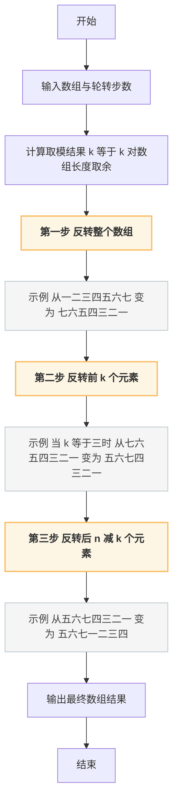
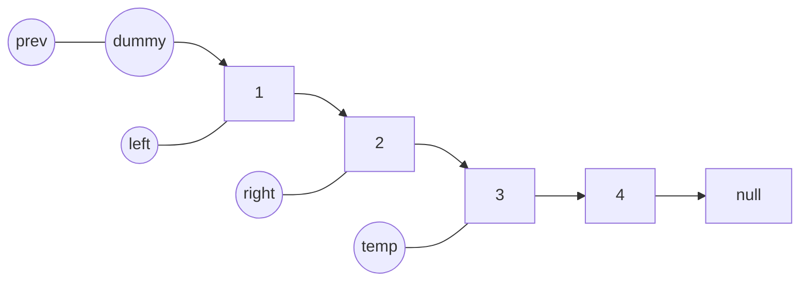
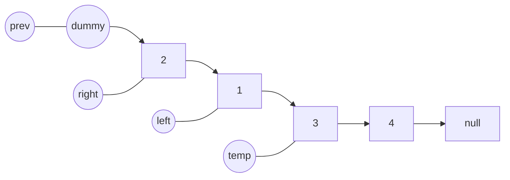
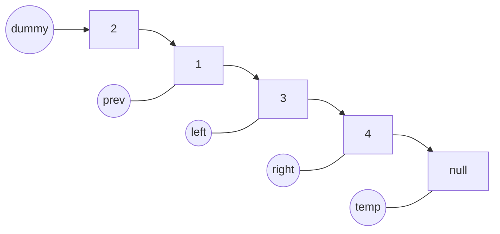
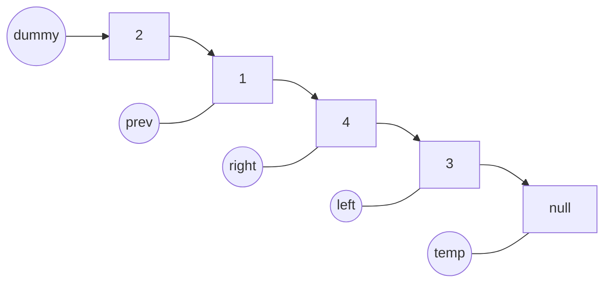

# Hot100


### 符号含义

- ?表示还没完全理解
- ???表示根本没怎么懂


 

### 哈希


#### [两数之和](https://leetcode.cn/problems/two-sum/)

已解答

简单


提示

给定一个整数数组 `nums` 和一个整数目标值 `target`，请你在该数组中找出 **和为目标值** *`target`* 的那 **两个** 整数，并返回它们的数组下标。

你可以假设每种输入只会对应一个答案，并且你不能使用两次相同的元素。

你可以按任意顺序返回答案。

 

**示例 1：**

```
输入：nums = [2,7,11,15], target = 9
输出：[0,1]
解释：因为 nums[0] + nums[1] == 9 ，返回 [0, 1] 。
```

**示例 2：**

```
输入：nums = [3,2,4], target = 6
输出：[1,2]
```

**示例 3：**

```
输入：nums = [3,3], target = 6
输出：[0,1]
```

 

**提示：**

- `2 <= nums.length <= 104`
- `-109 <= nums[i] <= 109`
- `-109 <= target <= 109`
- **只会存在一个有效答案**

 

**进阶：**你可以想出一个时间复杂度小于 `O(n2)` 的算法吗？


##### 双指针

```java
/**T26.01% + N30.87%
双指针:
    前置判断,nums == null || nums.length() == 0 || nums.length() == 1 return -1 
    1.定义left,right滑动双指针,使得right起始位置=left + 1
    2.遍历nums[left]时,遍历nums[right]一直++，直到nums[left] + nums[right] == target
 */
class Solution {
    public int[] twoSum(int[] nums, int target) {
        int n = nums.length,right = 0;
        for(int left = 0; left < n; left++){
            right = left + 1;
            for(;right < n; right++){
                if(nums[left] + nums[right] == target){
                    return new int[]{left,right};
                }
            }
        }
        return new int[]{};
    }
}
```


#### [字母异位词分组](https://leetcode.cn/problems/group-anagrams/)

已解答

中等


给你一个字符串数组，请你将 字母异位词 组合在一起。可以按任意顺序返回结果列表。

 

**示例 1:**

**输入:** strs = ["eat", "tea", "tan", "ate", "nat", "bat"]

**输出:** [["bat"],["nat","tan"],["ate","eat","tea"]]

**解释：**

- 在 strs 中没有字符串可以通过重新排列来形成 `"bat"`。
- 字符串 `"nat"` 和 `"tan"` 是字母异位词，因为它们可以重新排列以形成彼此。
- 字符串 `"ate"` ，`"eat"` 和 `"tea"` 是字母异位词，因为它们可以重新排列以形成彼此。

**示例 2:**

**输入:** strs = [""]

**输出:** [[""]]

**示例 3:**

**输入:** strs = ["a"]

**输出:** [["a"]]

 

**提示：**

- `1 <= strs.length <= 104`
- `0 <= strs[i].length <= 100`
- `strs[i]` 仅包含小写字母


##### 哈希排序

```java
/**T:16.39% + N:99.62%
哈希:
    字母异位词:当前词无论什么顺序进行组合的,并且每个字符数量对应一致(找出每个字符串的标准排序字符串temp)
    1.遍历字符串数组,当遍历至strs[i]时,拆解每个字符,将其排序后在此转换成字符,再拼接成字符串,作为temp。
    2.遍历下一个重复此操作,拆解后组合发现map.containsKey(temp)中存在则map.get(temp).add(strs[i])
    3.遍历组装List
 */
class Solution {
    public List<List<String>> groupAnagrams(String[] strs) {
        List<List<String>> result = new ArrayList();
        //不可在此前置判断return result,即便是空串,也要是[[""]]返回
        Map<String,List<String>> map = new HashMap();
        int n = strs.length;
        for(int i = 0;i < n; i++){
            //拆解字符串元素利用Ascll码值进行排序。用于生成标准递增字符串
            char[] arr = strs[i].toCharArray();
            Arrays.sort(arr);
            String temp = String.valueOf(arr);
            //存在于Map则追加,否则作为初始值put
            if(map.containsKey(temp)){
                map.get(temp).add(strs[i]);
            }else{
                map.put(temp, new ArrayList<>(Arrays.asList(strs[i])));
            }
        }
        //遍历map拼接结果集
        for(List<String> list : map.values()){
            result.add(list);
        }
        return result;
    }
}
```


#### [最长连续序列](https://leetcode.cn/problems/longest-consecutive-sequence/)

中等


给定一个未排序的整数数组 `nums` ，找出数字连续的最长序列（不要求序列元素在原数组中连续）的长度。

请你设计并实现时间复杂度为 `O(n)` 的算法解决此问题。

 

**示例 1：**

```
输入：nums = [100,4,200,1,3,2]
输出：4
解释：最长数字连续序列是 [1, 2, 3, 4]。它的长度为 4。
```

**示例 2：**

```
输入：nums = [0,3,7,2,5,8,4,6,0,1]
输出：9
```

**示例 3：**

```
输入：nums = [1,0,1,2]
输出：3
```

 

**提示：**

- `0 <= nums.length <= 105`
- `-109 <= nums[i] <= 109`

 


##### HashSet

```java
/**
使用 HashSet 去重并快速判断元素是否存在。
1. 先将所有元素加入 HashSet，用于去重并支持 O(1) 的存在性查询。
2. 遍历 HashSet 中的每个元素：
   - 如果当前元素的前驱 (num - 1) 不存在于集合中，说明它可能是某个连续序列的起点；
   - 从该起点开始，不断判断下一个元素 (num + 1) 是否在集合中，若存在则累加长度；
   - 更新最大连续序列的长度。
3. 因为只从序列的起点开始扩展，每个元素最多被访问两次（起点检查 + while 扩展），避免了重复计算。
最终时间复杂度 O(n)，空间复杂度 O(n)。
 */
class Solution {
    public int longestConsecutive(int[] nums) {
        //前置判断
        if(nums.length == 0) return 0;
        Set<Integer> set = new HashSet<>();
        for(int num : nums){
            set.add(num);
        }
        int maxLen = 1;
        // 遍历 set 而不是 nums，避免重复元素造成无意义开销
        for(int num : set){
            int len = 1;
            if(!set.contains(num - 1)){
                while(set.contains(num + 1)){
                    num++;
                    len++;
                }
                maxLen = Math.max(maxLen, len);
            }
        }
        return maxLen;
    }
}
```


##### 指针

```java
/**T96.32% + N96.05%
滑动窗口:
 * 思路：
 * 1. 前置判断：数组为空或长度为0，直接返回0。
 * 2. 对数组进行排序，使得相同元素相邻，且整体有序，方便判断是否连续。
 * 3. 使用变量 sum 记录当前连续序列的长度，max 记录全局最长连续序列长度。
 * 4. 遍历数组：
 *    - 如果当前元素与前一个元素相同，说明是重复元素，直接跳过（不打断连续序列）。
 *    - 如果当前元素与前一个元素差值为1，说明是连续的，sum++，并更新 max。
 *    - 否则（差值大于1），说明连续性被打断，重置 sum = 1。
 * 5. 遍历完成后返回 max。
 *
 * 时间复杂度：O(n log n)，主要开销在排序。
 * 空间复杂度：O(1)，只使用了常数额外空间。
 */
class Solution {
    public int longestConsecutive(int[] nums) {
        //前置判断
        if(nums == null || nums.length == 0) return 0;
        Arrays.sort(nums);
        //sum统计当前连续序列长度,max记录最大连续序列长度
        int sum = 1, max = 1;
        for (int i = 1; i < nums.length; i++) {
            //两数相同则跳过
            if (nums[i] == nums[i - 1]) {
                continue;
            }
            //递增则sum++
            if (nums[i] - nums[i - 1] == 1) {
                sum++;
                //对比max,
                max = Math.max(max, sum);
                continue;
            }
            //非递增则sum=1
            sum = 1;
        }
        return max;
    }
}
```


### 双指针


#### [移动零](https://leetcode.cn/problems/move-zeroes/)

简单

> 提示


给定一个数组 `nums`，编写一个函数将所有 `0` 移动到数组的末尾，同时保持非零元素的相对顺序。

**请注意** ，必须在不复制数组的情况下原地对数组进行操作。

 

**示例 1:**

```
输入: nums = [0,1,0,3,12]
输出: [1,3,12,0,0]
```

**示例 2:**

```
输入: nums = [0]
输出: [0]
```

 

**提示**:

- `1 <= nums.length <= 104`
- `-231 <= nums[i] <= 231 - 1`

 

**进阶：**你能尽量减少完成的操作次数吗？


##### 双指针

```java
/**T100% + N75.67% 
 * 双指针解法：
 * - 使用 left 和 right 两个指针
 *   - left 从头到尾遍历，指向当前位置待处理元素
 *   - 当 nums[left] == 0 时，用 right 指针向前寻找下一个非 0 元素
 * - 找到后，将 nums[left] 赋值为该非 0 元素，并把 nums[right] 置为 0
 * - 如果 right 落在 left 左边，需要把 right 调整到 left+1，以避免回退
 * 
 * 整体思路：
 *   left 逐步扫描，遇 0 时通过 right 找下一个非零元素并前移，
 *   从而保证所有非零元素顺序不变，所有 0 被推到末尾。
 * 
 * 时间复杂度：O(n)  
 *   - 每个元素最多被 left 和 right 扫描一次，因此整体线性复杂度。
 * 空间复杂度：O(1)  
 *   - 仅使用了两个指针变量，原地修改数组，没有额外空间。
 */
class Solution {
    public void moveZeroes(int[] nums) {
        //前置判断
        if(nums == null || nums.length == 0 || nums.length == 1) return;
        int n = nums.length;
        for(int left = 0,right = 1; left < n && right < n;left++){
            //使得right至少跳过已经操作过的元素上
            if(right < left) right = left + 1;
            if(nums[left] == 0){
                //right必须找到第一个不为0的元素
                while(right < n && nums[right] == 0) right++;
                if(right < n){
                    nums[left] = nums[right];
                    nums[right] = 0;
                }
            }
        }
    }
}
```


#### [盛最多水的容器](https://leetcode.cn/problems/container-with-most-water/)

中等

> 提示


给定一个长度为 `n` 的整数数组 `height` 。有 `n` 条垂线，第 `i` 条线的两个端点是 `(i, 0)` 和 `(i, height[i])` 。

找出其中的两条线，使得它们与 `x` 轴共同构成的容器可以容纳最多的水。

返回容器可以储存的最大水量。

**说明：**你不能倾斜容器。

 

**示例 1：**


```
输入：[1,8,6,2,5,4,8,3,7]
输出：49 
解释：图中垂直线代表输入数组 [1,8,6,2,5,4,8,3,7]。在此情况下，容器能够容纳水（表示为蓝色部分）的最大值为 49。
```

**示例 2：**

```
输入：height = [1,1]
输出：1
```

 

**提示：**

- `n == height.length`
- `2 <= n <= 105`
- `0 <= height[i] <= 104`


##### 双指针

```java
/**
 * 双指针解法：
 * - 思路：
 *   容量取决于「短边高度 × 宽度」，所以两端开始，逐步收缩，尝试找到更大的容积。
 * 
 * - 步骤：
 *   1. 定义 left, right 双指针，分别指向容器两端：left = 0, right = height.length - 1
 *   2. 计算当前容积：Math.min(height[left], height[right]) * (right - left)
 *   3. 更新最大值
 *   4. 移动指针：
 *      - 如果左边高度更短，left++（尝试找更高的左边）
 *      - 如果右边高度更短，right--（尝试找更高的右边）
 *      - 如果相等，可以任意移动一边（这里你写的是同时移动，也没问题）
 *   5. 直到 left >= right
 * 
 * - 时间复杂度：O(n)，每个元素最多访问一次
 * - 空间复杂度：O(1)，只用常数变量
 */
class Solution {
    public int maxArea(int[] height) {
        //前置判断,如果为空或者只有一条边无法组成基础容器
        if(height == null || height.length == 0 || height.length == 1) return 0;
        //max用于不断迭代出最大容积
        int n = height.length,max = 0;
        //左右双指针
        for(int left = 0,right = height.length - 1;left < right;){
            //计算当前容积
            int c = Math.min(height[left], height[right]) * (right - left);
            max = Math.max(max, c);
            //谁短移动谁
            if(height[left] < height[right]){
                left++;
            }
            else if(height[left] > height[right]){
                right--;
            }
            //相当的话移动一边即可。只移动一边(就已经满足了继续遍历) → 保留更多可能性，保证不会错过最优解。同时移动两边 → 减少一次搜索机会，结果还是对的，但不是最优搜索路径。
            else{
                left++;
            }
        }
        return max;
    }
}
```

> 为什么 **相当的话移动一边即可** 足够？

1. 当 `height[left] < height[right]`：
   - 容积由左边限制，必须让左边尝试变高 → 移动 `left++`。
   - 宽度变小，但可能换来更高的高度。
2. 当 `height[left] > height[right]`：
   - 容积由右边限制，必须让右边尝试变高 → 移动 `right--`。
3. 当 `height[left] == height[right]`：
   - 容积由任意一边限制，只要移动其中一边，就已经让“宽度变化 + 高度可能改善”，搜索就能继续。
   - **保证不会错过**：因为另一边留着还会被考虑到（下一轮）。


>举一个直观的例子证明不会错过什么？

不会错过 “在相等高度的情况下，保持另一边不动，靠另一边可能变高从而得到更大面积” 这种情况。

也就是说：

- **只动一边** → 保证宽度 = `right - left - 1` 这一组情况仍然会被检查
- **两边都动** → 直接丢掉这组情况，可能错过最大解

---


#### [三数之和](https://leetcode.cn/problems/3sum/)

中等


相关标签

> 提示


给你一个整数数组 `nums` ，判断是否存在三元组 `[nums[i], nums[j], nums[k]]` 满足 `i != j`、`i != k` 且 `j != k` ，同时还满足 `nums[i] + nums[j] + nums[k] == 0` 。请你返回所有和为 `0` 且不重复的三元组。

**注意：**答案中不可以包含重复的三元组。

 

 

**示例 1：**

```
输入：nums = [-1,0,1,2,-1,-4]
输出：[[-1,-1,2],[-1,0,1]]
解释：
nums[0] + nums[1] + nums[2] = (-1) + 0 + 1 = 0 。
nums[1] + nums[2] + nums[4] = 0 + 1 + (-1) = 0 。
nums[0] + nums[3] + nums[4] = (-1) + 2 + (-1) = 0 。
不同的三元组是 [-1,0,1] 和 [-1,-1,2] 。
注意，输出的顺序和三元组的顺序并不重要。
```

**示例 2：**

```
输入：nums = [0,1,1]
输出：[]
解释：唯一可能的三元组和不为 0 。
```

**示例 3：**

```
输入：nums = [0,0,0]
输出：[[0,0,0]]
解释：唯一可能的三元组和为 0 。
```

 

**提示：**

- `3 <= nums.length <= 3000`
- `-105 <= nums[i] <= 105`


##### 双指针(剔除重复)

```java
/**T23.62% + N 52.09%
 * 思路（双指针法）：
 * 1. 先对数组排序（从小到大），这样方便用双指针法在有序区间内查找。
 * 2. 遍历数组，固定一个数 nums[i] 作为三元组的第一个数。
 *    - 因为我们要找三数之和 = 0，所以问题转化为：
 *      在 nums[i+1..n-1] 区间内找两个数，使它们的和等于 -nums[i]。
 * 3. 使用左右双指针：
 *    - left = i+1，right = n-1。
 *    - 计算 sum = nums[i] + nums[left] + nums[right]。
 *        - 如果 sum == 0，说明找到一组解，加入结果集。
 *          然后需要跳过重复元素（避免重复解）。
 *        - 如果 sum < 0，说明总和偏小，需要 left++ 增大和。
 *        - 如果 sum > 0，说明总和偏大，需要 right-- 减小和。
 * 4. 去重优化：
 *    - 对外层循环 i：如果 nums[i] == nums[i-1]，说明已经处理过该值，跳过。
 *    - 对内层双指针：当找到一个解后，跳过相同的 left/right 值。
 * 5. 时间复杂度：
 *    - 排序 O(n log n)，
 *    - 遍历+双指针 O(n^2)，
 *    - 总体复杂度 O(n^2)，在数据范围 (n ≤ 3000) 内可接受。
 */
class Solution {
    public List<List<Integer>> threeSum(int[] nums) {
        List<List<Integer>> result = new ArrayList<>();
        //先排序
        Arrays.sort(nums);
        //left,right都需要是不同的元素,故此当i = nums.length - 2已经是临界值了
        for (int i = 0; i < nums.length - 2; i++) {
            //重复元素则跳过
            if (i > 0 && nums[i] == nums[i - 1]) continue;
            //左右双指针遍历(迭代更新)
            int left = i + 1, right = nums.length - 1;
            while (left < right) {
                int sum = nums[i] + nums[left] + nums[right];
                //结算
                if (sum == 0) {
                    result.add(new ArrayList<>(Arrays.asList(nums[i], nums[left], nums[right])));
                    //迭代下两个不重复的元素
                    while (left < right && nums[left] == nums[left + 1]) left++;
                    while (left < right && nums[right] == nums[right - 1]) right--;
                    left++;
                    right--;
                }
                //大了指向小的元素,小了指向大的元素
                else if (sum < 0) {
                    left++;
                }//sum > 0
                else {
                    right--;
                }
            }
        }
        return result;
    }
}
```


#### [接雨水](https://leetcode.cn/problems/trapping-rain-water/)

困难


给定 `n` 个非负整数表示每个宽度为 `1` 的柱子的高度图，计算按此排列的柱子，下雨之后能接多少雨水。

 

**示例 1：**


```
输入：height = [0,1,0,2,1,0,1,3,2,1,2,1]
输出：6
解释：上面是由数组 [0,1,0,2,1,0,1,3,2,1,2,1] 表示的高度图，在这种情况下，可以接 6 个单位的雨水（蓝色部分表示雨水）。 
```

**示例 2：**

```
输入：height = [4,2,0,3,2,5]
输出：9
```

 

**提示：**

- `n == height.length`
- `1 <= n <= 2 * 104`
- `0 <= height[i] <= 105`


##### 方式一：借助额外空间

```java
/**T66.24% + N65.79%
思路：
    1.定义leftMaxNums[],rightMaxNums[]来迭代获取i位置左右每次蓄水的对应最高柱长度(比较低的柱子在整个数组中无法实现蓄水)
    2.随后遍历height，此时其中height[i]位置的蓄水量 = Math.min(leftMaxNums[i], rightMaxNums[i]) - height[i]
    3.累加蓄水量
 */
class Solution {
    public int trap(int[] height) {
        int n = height.length;
        //前置判断(无边或者只存在一条边无法蓄水)
        if (n < 3) return 0;
        int[] leftMaxNums = new int[n];
        int[] rightMaxNums = new int[n];
        //迭代left的边
        int leftNum = 0;
        for(int i = 0; i < n; i++){
            //防止负数
            if(height[i] < 0){
                leftMaxNums[i] = 0;
                continue;
            }
            leftNum = Math.max(leftNum, height[i]);
            leftMaxNums[i] = leftNum;
        }
        int rightNum = 0;
        for(int i = n - 1;i >= 0; i--){
            //防止负数
            if(height[i] < 0){
                rightMaxNums[i] = 0;
                continue;
            }
            rightNum = Math.max(rightNum, height[i]);
            rightMaxNums[i] = rightNum;
        }
        //结算
        int sum = 0;
        for(int i = 0;i < n; i++){
            //取最短的柱子 - 当前柱子大小(此空间无法蓄水了)
            sum += Math.min(leftMaxNums[i], rightMaxNums[i]) - height[i];
        }
        return sum;
    }
}
```


### 滑动窗口


#### [无重复字符的最长子串](https://leetcode.cn/problems/longest-substring-without-repeating-characters/)


中等

相关标签


提示


给定一个字符串 `s` ，请你找出其中不含有重复字符的 **最长 子串** 的长度。

 

**示例 1:**

```
输入: s = "abcabcbb"
输出: 3 
解释: 因为无重复字符的最长子串是 "abc"，所以其长度为 3。
```

**示例 2:**

```
输入: s = "bbbbb"
输出: 1
解释: 因为无重复字符的最长子串是 "b"，所以其长度为 1。
```

**示例 3:**

```
输入: s = "pwwkew"
输出: 3
解释: 因为无重复字符的最长子串是 "wke"，所以其长度为 3。
     请注意，你的答案必须是 子串 的长度，"pwke" 是一个子序列，不是子串。
```

 

**提示：**

- `0 <= s.length <= 5 * 104`
- `s` 由英文字母、数字、符号和空格组成

 

------


##### 双指针滑动窗口

```java
/**T64.30% + N15.16%
 * 滑动窗口双指针:
 * 1. 使用 left 和 right 两个指针维护一个滑动窗口，窗口内保证字符不重复。
 * 2. 右指针 right 不断向右移动，尝试加入新的字符到窗口。
 * 3. 如果当前字符已存在于窗口中，则移动左指针 left 并移除窗口最左边的字符，直到窗口内不重复。
 * 4. 每次移动右指针后，更新最大无重复子串长度 max。
 * 5. 最终返回 max，即最长无重复子串的长度。
 */
class Solution {
    public int lengthOfLongestSubstring(String s) {
        int n = s.length(), max = 0;
        Set<Character> set = new HashSet<>();
        for (int left = 0, right = 0; right < n; right++) {
            char c = s.charAt(right);
            while (set.contains(c)) {
                // 每次都 remove 滑动窗口最左边的元素
                set.remove(s.charAt(left));
                left++;
            }
            // 将当前字符加入窗口
            set.add(c);
            // 迭代更新最大长度
            max = Math.max(max, right - left + 1);
        }
        return max;
    }
}
```


#### [找到字符串中所有字母异位词](https://leetcode.cn/problems/find-all-anagrams-in-a-string/)

中等


给定两个字符串 `s` 和 `p`，找到 `s` 中所有 `p` 的 **异位词** 的子串，返回这些子串的起始索引。不考虑答案输出的顺序。

 

**示例 1:**

```
输入: s = "cbaebabacd", p = "abc"
输出: [0,6]
解释:
起始索引等于 0 的子串是 "cba", 它是 "abc" 的异位词。
起始索引等于 6 的子串是 "bac", 它是 "abc" 的异位词。
```

 **示例 2:**

```
输入: s = "abab", p = "ab"
输出: [0,1,2]
解释:
起始索引等于 0 的子串是 "ab", 它是 "ab" 的异位词。
起始索引等于 1 的子串是 "ba", 它是 "ab" 的异位词。
起始索引等于 2 的子串是 "ab", 它是 "ab" 的异位词。
```

 

**提示:**

- `1 <= s.length, p.length <= 3 * 104`
- `s` 和 `p` 仅包含小写字母


##### 模板排序

```java
/**
模板子串(排序):
    1. 将p的每个字符递增排序作为模板字符串，得到标准模板。
    2. 遍历字符串s，使用窗口大小为p.length()的子串，递增排序后与模板子串比较。
    3. 如果排序后的子串与模板子串相同，则记录该子串的起始索引。
    4. 返回所有匹配的起始索引列表。
 */
class Solution {
    public List<Integer> findAnagrams(String s, String p) {
        List<Integer> list = new ArrayList<>();
        
        // 获取排序后的p作为模板子串
        String temp = getSortTemp(p);  // 时间复杂度：O(m * log(m))，其中m为p的长度
        // 遍历字符串s的每个子串
        for (int left = 0, right = left + p.length() - 1; right < s.length(); left++, right++) {
            // 获取当前窗口子串并排序
            String str = getSortTemp(s.substring(left, right + 1)); // 时间复杂度：O(m * log(m))，其中m为窗口的长度
            // 如果排序后的子串与模板字符串相同，记录起始索引
            if (temp.equals(str)) {
                list.add(left); // 记录匹配的起始位置
            }
        }
        return list;
    }

    private String getSortTemp(String str) {
        char[] chars = str.toCharArray();
        Arrays.sort(chars); // 时间复杂度：O(m * log(m))，排序操作
        return String.valueOf(chars); // 时间复杂度：O(m)
    }
}
```


### 子串


#### [和为 K 的子数组](https://leetcode.cn/problems/subarray-sum-equals-k/)

中等

提示


给你一个整数数组 `nums` 和一个整数 `k` ，请你统计并返回 *该数组中和为 `k` 的子数组的个数* 。

子数组是数组中元素的连续非空序列。

 

**示例 1：**

```
输入：nums = [1,1,1], k = 2
输出：2
```

**示例 2：**

```
输入：nums = [1,2,3], k = 3
输出：2
```

 

**提示：**

- `1 <= nums.length <= 2 * 104`
- `-1000 <= nums[i] <= 1000`
- `-107 <= k <= 107`

 

##### DFS

```java
/**
连续子序列(前缀起点递归遍历法):
    思路：
        对数组中每个位置作为起点进行遍历。
        从当前起点开始，逐个累加后续元素求和(sum)，
        一旦某一段连续子数组的和等于k，就统计一次(count++)。
        然后递归继续从下一个起点(index+1)开始计算，直到遍历完所有可能的起点。
    特点：
        - 不回头：每次递归固定起点，内层循环向后扩展子数组。
        - 不使用额外结构：仅依赖sum与count变量。
        - 适合理解暴力枚举的连续子数组思路。
        
时间复杂度：O(n²) —— 外层递归 n 次 × 内层循环平均 n/2 次  
空间复杂度：O(n) —— 递归调用栈深度最多 n 层
 */
class Solution {
    public int subarraySum(int[] nums, int k) {
        // 用index来处理当前遍历元素下标
        return dfs(nums, k, 0);
    }
    private int dfs(int[] nums, int k, int index) {
        if (index >= nums.length) return 0;
        // 用sum来不断累加当前选择的元素,
        // 用count来累加每个已经遍历过的满足和为k的连续子数组个数
        int count = 0, sum = 0;
        // 子序列不回头，从index开始向后扩展
        for (int i = index; i < nums.length; i++) {
            sum += nums[i];
            if (sum == k) count++;
        }
        // 递归处理下一个起点
        count += dfs(nums, k, index + 1);
        return count;
    }
}
```


#### [滑动窗口最大值?](https://leetcode.cn/problems/sliding-window-maximum/)

困难


提示


给你一个整数数组 `nums`，有一个大小为 `k` 的滑动窗口从数组的最左侧移动到数组的最右侧。你只可以看到在滑动窗口内的 `k` 个数字。滑动窗口每次只向右移动一位。

返回 *滑动窗口中的最大值* 。

 

**示例 1：**

```
输入：nums = [1,3,-1,-3,5,3,6,7], k = 3
输出：[3,3,5,5,6,7]
解释：
滑动窗口的位置                最大值
---------------               -----
[1  3  -1] -3  5  3  6  7       3
 1 [3  -1  -3] 5  3  6  7       3
 1  3 [-1  -3  5] 3  6  7       5
 1  3  -1 [-3  5  3] 6  7       5
 1  3  -1  -3 [5  3  6] 7       6
 1  3  -1  -3  5 [3  6  7]      7
```

**示例 2：**

```
输入：nums = [1], k = 1
输出：[1]
```

 

**提示：**

- `1 <= nums.length <= 105`
- `-104 <= nums[i] <= 104`
- `1 <= k <= nums.length`


##### 尝试一:不断遍历窗口对比(超时)

```java
/**
双指针滑动窗口
    1.定义left、right滑动双指针
    2.让right = k - 1;
    3.使得left、right不断递增滑动
    4.在滑动的过程中判断当前窗口的最大值
 */
class Solution {
    public int[] maxSlidingWindow(int[] nums, int k) {
        //前置判断
        if(nums.length < k) return new int[0];
        
        int left = 0, right = k - 1;
        List<Integer> list = new ArrayList<>();
        for(; right < nums.length; left++, right++){
            list.add(getMaxInNums(nums, left, right));
        }
        return list.stream()
                        .mapToInt(Integer::intValue)
                        .toArray();
    }
    private int getMaxInNums(int[] nums, int left, int right){
        int max = Integer.MIN_VALUE;
        for(int i = left; i <= right; i++){
            max = Math.max(max, nums[i]);
        }
        return max;
    }
}
```


##### 尝试二：双端队列优化(不可在愿基础上进行优化了，因为必定超时)

```java
/**
 * 双端队列优化版
 * 1. 队列存储的是下标，且对应元素值保持单调递减；
 * 2. 每次滑动窗口：
 *    - 若队尾元素小于新元素，则弹出（保持单调性）；
 *    - 若队首元素已滑出窗口，则弹出；
 *    - 队首永远是窗口最大值；
 * 3. 时间复杂度 O(n)，每个元素最多入队出队各一次。
 */
class Solution {
    public int[] maxSlidingWindow(int[] nums, int k) {
        //双端队列存下标
        Deque<Integer> queue = new ArrayDeque();
        int index = 0;
        //多少个窗口就有多少个元素
        int[] result = new int[nums.length - k + 1];
        for(int i = 0; i < nums.length; i++){
            //移除滑出窗口的元素
            if(!queue.isEmpty() && queue.peekFirst() <= i - k){
                queue.pollFirst();
            }
            //保持队列单调递减：弹出所有比当前值小的元素
            while(!queue.isEmpty() && nums[queue.peekLast()] < nums[i]){
                queue.pollLast();
            }
            //当前元素入队
            queue.offerLast(i);
            //当窗口形成(i >= k - 1)时,取队首为最大值
            if(i >= k - 1){
                result[index++] = nums[queue.peekFirst()];
            }
        }
        return result;
    }
}
```


### 普通数组

#### [最大子数组和](https://leetcode.cn/problems/maximum-subarray/)

中等


给你一个整数数组 `nums` ，请你找出一个具有最大和的连续子数组（子数组最少包含一个元素），返回其最大和。

**子数组**是数组中的一个连续部分。

 

**示例 1：**

```
输入：nums = [-2,1,-3,4,-1,2,1,-5,4]
输出：6
解释：连续子数组 [4,-1,2,1] 的和最大，为 6 。
```

**示例 2：**

```
输入：nums = [1]
输出：1
```

**示例 3：**

```
输入：nums = [5,4,-1,7,8]
输出：23
```

 

**提示：**

- `1 <= nums.length <= 105`
- `-104 <= nums[i] <= 104`

 

**进阶：**如果你已经实现复杂度为 `O(n)` 的解法，尝试使用更为精妙的 **分治法** 求解。

 


##### DFS

```java
/**
 * dfs:
 *   使用深度优先遍历（递归）模拟 Kadane 算法思想。
 *   每次递归代表“以 index 结尾的连续子数组”。
 *   若当前前缀和 sum < 0，则直接丢弃之前的子数组，从当前元素重新开始（剪枝重启），
 *   保证搜索路径始终只保留对最大子数组和有贡献的部分。
 *   整体等价于动态规划的线性转移：sum = max(nums[i], sum + nums[i])。
 *
 * 时间复杂度 O(n)，空间复杂度 O(n)（递归调用栈）。
 */
class Solution {

    private int maxValue = Integer.MIN_VALUE;

    public int maxSubArray(int[] nums) {
        dfs(nums, 0, 0);
        return maxValue;
    }

    private void dfs(int[] nums, int index, int sum) {
        if (index == nums.length) {
            return;
        }
        // 剪枝：若当前和为负，则重启新子数组
        sum = sum < 0 ? nums[index] : sum + nums[index];
        maxValue = Math.max(maxValue, sum);
        dfs(nums, index + 1, sum);
    }
}
```


##### dp

```java
/**
 * 动态规划（DP）解法：
 *   定义 dp[i] 表示以 nums[i] 结尾的连续子数组的最大和。
 *   状态转移方程：dp[i] = max(dp[i - 1] + nums[i], nums[i])，
 *   若前一段和为正则累加，否则从当前元素重新开始。
 *   在遍历过程中用 maxValue 记录所有 dp[i] 的最大值，即整个数组的最大子数组和。
 *
 * 时间复杂度 O(n)，空间复杂度 O(n)
 */
class Solution {
    public int maxSubArray(int[] nums) {
        int[] dp = new int[nums.length];
        dp[0] = nums[0];
        int maxValue = dp[0];
        for (int i = 1; i < nums.length; i++) {
            // 累加大的话就要累加，累加不大就重新以 nums[i] 开始
            dp[i] = Math.max(dp[i - 1] + nums[i], nums[i]);
            // maxValue 记录迭代过程中最大的连续子数组和
            maxValue = Math.max(dp[i], maxValue);
        }
        return maxValue;
    }
}
```


#### [合并区间](https://leetcode.cn/problems/merge-intervals/)

中等


以数组 `intervals` 表示若干个区间的集合，其中单个区间为 `intervals[i] = [starti, endi]` 。请你合并所有重叠的区间，并返回 *一个不重叠的区间数组，该数组需恰好覆盖输入中的所有区间* 。

 

**示例 1：**

```
输入：intervals = [[1,3],[2,6],[8,10],[15,18]]
输出：[[1,6],[8,10],[15,18]]
解释：区间 [1,3] 和 [2,6] 重叠, 将它们合并为 [1,6].
```

**示例 2：**

```
输入：intervals = [[1,4],[4,5]]
输出：[[1,5]]
解释：区间 [1,4] 和 [4,5] 可被视为重叠区间。
```

**示例 3：**

```
输入：intervals = [[4,7],[1,4]]
输出：[[1,7]]
解释：区间 [1,4] 和 [4,7] 可被视为重叠区间。
```

 

**提示：**

- `1 <= intervals.length <= 104`
- `intervals[i].length == 2`
- `0 <= starti <= endi <= 104`


##### 迭代区间

```java
/**
一、思路（核心要点）
    先把区间按起点从小到大排序。如果起点相同，可以按终点排序也行，但核心是让后续区间的起点都不小于前一个区间的起点。
    遍历排序后的区间，维护一个当前正在合并的区间 current = [lastLeft, lastRight]。
    如果下一个区间的起点 newStart <= lastRight（注意包含边界相等也算重叠，因为示例 2、3 也把相邻（边界相接）视为重叠），就把当前区间的结束位置更新为 max(lastRight, newEnd)。
    否则，当前区间与下一个区间不重叠，把当前区间加入结果集，并把 current 指向下一个区间。
    重复上述过程，最后把最后一个 current 加入结果集。
    时间复杂度：排序 O(n log n)，合并线性 O(n)，总的时间复杂度 O(n log n)。
    空间复杂度：O(n) 用于存放结果，若返回时直接在原数组上修改也可以降到 O(1) 额外空间。
 */
class Solution {
    public int[][] merge(int[][] intervals) {
        //在ArrayList中队尾新增元素效率很高的,这里也用不着频繁删除之类的
        List<int[]> merged = new ArrayList<>();
        //先按照nums[0]区间起点升序排列，如果起点相同则按照区间终点升序排列
        Arrays.sort(intervals, (a, b) -> {
            if (a[0] != b[0]) return Integer.compare(a[0], b[0]);
            return Integer.compare(a[1], b[1]);
        });
        //使用双指针来维护当前i - 1元素值
        int lastLeft = intervals[0][0], lastRight = intervals[0][1];
        for(int i = 1; i < intervals.length; i++){
            //如果b[0] <= a[1], 则说明b[0]在a[0]和a[1]之间,确认区间起点是a[0],区间终点是Math.max(a[1], b[1]);
            if(intervals[i][0] <= lastRight){
                //只更新lastRight,lastLeft确定新区间起点
                // 有重叠：扩展右边界
                lastRight = Math.max(lastRight, intervals[i][1]);
            }
            else{
                merged.add(new int[]{lastLeft, lastRight});
                //迭代lastLeft,lastRight
                lastLeft = intervals[i][0];
                lastRight = intervals[i][1];
            }
        }
        //添加最后一个元素
        merged.add(new int[]{lastLeft, lastRight});
        return merged.toArray(new int[merged.size()][]);
    }
}
```


#### [轮转数组](https://leetcode.cn/problems/rotate-array/)


中等


提示


给定一个整数数组 `nums`，将数组中的元素向右轮转 `k` 个位置，其中 `k` 是非负数。

 

**示例 1:**

```
输入: nums = [1,2,3,4,5,6,7], k = 3
输出: [5,6,7,1,2,3,4]
解释:
向右轮转 1 步: [7,1,2,3,4,5,6]
向右轮转 2 步: [6,7,1,2,3,4,5]
向右轮转 3 步: [5,6,7,1,2,3,4]
```

**示例 2:**

```
输入：nums = [-1,-100,3,99], k = 2
输出：[3,99,-1,-100]
解释: 
向右轮转 1 步: [99,-1,-100,3]
向右轮转 2 步: [3,99,-1,-100]
```

 

**提示：**

- `1 <= nums.length <= 105`
- `-231 <= nums[i] <= 231 - 1`
- `0 <= k <= 105`

 

**进阶：**

- 尽可能想出更多的解决方案，至少有 **三种** 不同的方法可以解决这个问题。
- 你可以使用空间复杂度为 `O(1)` 的 **原地** 算法解决这个问题吗？


##### 尝试一：额外数组

```java
/**
额外空间:
    1.创建一个新数组newNums
    2.将newNums[(i + k) % n] = nums[i]
    3.随后将新数组所有元素复制到旧数组nums
 */
class Solution {
    public void rotate(int[] nums, int k) {
        int n = nums.length;
        int[] newNums = new int[n];
        for(int i = 0; i < n; i++){
            //由于是向右旋转,newNums的每个(i + k) % n号元素应该是nums[i]
            newNums[(i + k) % n] = nums[i];
        }
        //将新数组所有元素替换到旧数组nums
        for(int i = 0; i < n; i++){
            nums[i] = newNums[i];
        }
    }
}
```


##### 尝试二：三次反转法



| 原因                        | 修改内容                                         |
| --------------------------- | ------------------------------------------------ |
| 方括号 `[]` 不被识别        | 改成文字描述“从一二三四五六七变为七六五四三二一” |
| 数组逗号`,`冲突             | 去掉逗号，用连贯中文代替                         |
| 箭头 `→` 支持但需用普通字符 | 保留单箭头符号                                   |
| 节点描述长度过长            | 适当换行或精简中文描述                           |

```java
/**
三次反转法:
    1.“反转整体，再修正两段。”
    2.先把整个数组反过来，这样目标的后段先到了前面；
    3.然后再分别反转前 k 和后 n−k 段，使两部分恢复原本顺序。

示例：
1️⃣ 整体反转     → [G, F, E, D, C, B, A]
2️⃣ 反转前3个    → [E, F, G, D, C, B, A]
3️⃣ 反转后4个    → [E, F, G, A, B, C, D]

时间复杂度: O(n)
空间复杂度: O(1)
 */
class Solution {
    public void rotate(int[] nums, int k) {
        int n = nums.length;
        k = k % n; // 防止k超过数组长度
        reverse(nums, 0, n - 1);   // 第一次：整体反转
        reverse(nums, 0, k - 1);   // 第二次：反转前k个
        reverse(nums, k, n - 1);   // 第三次：反转后n-k个
    }

    /**
     * 原地反转数组中 [left, right] 区间的元素
     */
    private void reverse(int[] nums, int left, int right) {
        while (left < right) {
            int temp = nums[left];
            nums[left++] = nums[right];
            nums[right--] = temp;
        }
    }
}
```


#### [除自身以外数组的乘积](https://leetcode.cn/problems/product-of-array-except-self/)


中等


提示


给你一个整数数组 `nums`，返回 数组 `answer` ，其中 `answer[i]` 等于 `nums` 中除 `nums[i]` 之外其余各元素的乘积 。

题目数据 **保证** 数组 `nums`之中任意元素的全部前缀元素和后缀的乘积都在 **32 位** 整数范围内。

请 **不要使用除法，**且在 `O(n)` 时间复杂度内完成此题。

 

**示例 1:**

```
输入: nums = [1,2,3,4]
输出: [24,12,8,6]
```

**示例 2:**

```
输入: nums = [-1,1,0,-3,3]
输出: [0,0,9,0,0]
```

 

**提示：**

- `2 <= nums.length <= 105`
- `-30 <= nums[i] <= 30`
- 输入 **保证** 数组 `answer[i]` 在 **32 位** 整数范围内

 

**进阶：**你可以在 `O(1)` 的额外空间复杂度内完成这个题目吗？（ 出于对空间复杂度分析的目的，输出数组 **不被视为** 额外空间。）


##### 违规但O1，单独处理0的状态

```java
/**
除自身以外数组的乘积
    1. 先统计零的数量与所有非零元素的乘积；
    2. 若零超过1个 → 全部为0；
    3. 若只有1个零 → 仅零位置 = 其他非零元素乘积；
    4. 若无零 → 使用总乘积 / 当前元素；
 */
class Solution {
    public int[] productExceptSelf(int[] nums) {
        int n = nums.length;
        int left = 1, right = 1; // 保留你的变量定义
        int zeroCount = 0;
        int totalProduct = 1;

        // 1️⃣ 统计零的数量并计算非零元素乘积
        for (int i = 0; i < n; i++) {
            if (nums[i] == 0) zeroCount++;
            else totalProduct *= nums[i];
        }

        // 2️⃣ 分类处理
        for (int i = 0; i < n; i++) {
            if (zeroCount > 1) {
                // 多个零 → 全为0
                nums[i] = 0;
            } else if (zeroCount == 1) {
                // 仅一个零 → 只有该位置为非零
                nums[i] = (nums[i] == 0) ? totalProduct : 0;
            } else {
                // 无零 → 正常除法
                nums[i] = totalProduct / nums[i];
            }
        }

        return nums;
    }
}
```


##### 前后缀积???


### 矩阵


#### [矩阵置零](https://leetcode.cn/problems/set-matrix-zeroes/)

中等


提示


给定一个 `*m* x *n*` 的矩阵，如果一个元素为 **0** ，则将其所在行和列的所有元素都设为 **0** 。请使用 **[原地](http://baike.baidu.com/item/原地算法)** 算法**。**


 

**示例 1：**


```
输入：matrix = [[1,1,1],[1,0,1],[1,1,1]]
输出：[[1,0,1],[0,0,0],[1,0,1]]
```

**示例 2：**


```
输入：matrix = [[0,1,2,0],[3,4,5,2],[1,3,1,5]]
输出：[[0,0,0,0],[0,4,5,0],[0,3,1,0]]
```

 

**提示：**

- `m == matrix.length`
- `n == matrix[0].length`
- `1 <= m, n <= 200`
- `-231 <= matrix[i][j] <= 231 - 1`

 

**进阶：**

- 一个直观的解决方案是使用  `O(*m**n*)` 的额外空间，但这并不是一个好的解决方案。
- 一个简单的改进方案是使用 `O(*m* + *n*)` 的额外空间，但这仍然不是最好的解决方案。
- 你能想出一个仅使用常量空间的解决方案吗？


##### 额外空间

```java
/**
 * 矩阵置零
 *
 * 思路：
 * 1. 首次遍历矩阵，记录所有为0的元素所在的行和列（分别用row[]和col[]标记）。
 * 2. 再次遍历矩阵，只要该位置所在的行或列被标记过，就将其置为0。
 *
 * 时间复杂度：O(m * n)
 * 空间复杂度：O(m + n)
 */
class Solution {
    public void setZeroes(int[][] matrix) {
        int m = matrix.length, n = matrix[0].length;
        // 记录每一行、每一列是否需要置零
        boolean[] row = new boolean[m];
        boolean[] col = new boolean[n];

        // 第一次遍历：标记
        for (int i = 0; i < m; i++) {
            for (int j = 0; j < n; j++) {
                if (matrix[i][j] == 0) {
                    row[i] = true;
                    col[j] = true;
                }
            }
        }

        // 第二次遍历：根据标记置零
        for (int i = 0; i < m; i++) {
            for (int j = 0; j < n; j++) {
                if (row[i] || col[j]) {
                    matrix[i][j] = 0;
                }
            }
        }
    }
}
```


#### [螺旋矩阵](https://leetcode.cn/problems/spiral-matrix/)

中等


提示


给你一个 `m` 行 `n` 列的矩阵 `matrix` ，请按照 **顺时针螺旋顺序** ，返回矩阵中的所有元素。

 

**示例 1：**


```
输入：matrix = [[1,2,3],[4,5,6],[7,8,9]]
输出：[1,2,3,6,9,8,7,4,5]
```

**示例 2：**


```
输入：matrix = [[1,2,3,4],[5,6,7,8],[9,10,11,12]]
输出：[1,2,3,4,8,12,11,10,9,5,6,7]
```

 

**提示：**

- `m == matrix.length`
- `n == matrix[i].length`
- `1 <= m, n <= 10`
- `-100 <= matrix[i][j] <= 100`


##### 模拟

```java
/**
 * 整体思路：
 * 1️⃣ 模拟螺旋遍历方向（右→下→左→上），并用一个访问标记矩阵 dp 记录访问过的格子。
 * 2️⃣ 每次从当前起点 (i, j) 出发，沿着当前方向一直走到边界或已访问点后停止。
 * 3️⃣ 当一圈结束后，通过坐标回退（即 i++, j++）进入下一内圈继续遍历。
 * 4️⃣ 使用递归（dfs）重复上述过程，直到遍历完所有元素。
 * 
 * 方向控制逻辑：
 *    右：j++，直到越界或访问过；
 *    下：i++；
 *    左：j--；
 *    上：i--；
 * 每次走完一条边后调整 i、j 到下一个未访问起点。
 * 
 * 注意点：
 * - 使用 dp[][] 记录已访问，防止死循环；
 * - 递归参数 count 用于计数，防止越界；
 * - 回退逻辑 i++, j++ 保证进入下一内圈起点正确。
 * 
 * 时间复杂度：O(m * n) —— 每个元素仅访问一次。
 * 空间复杂度：O(m * n) —— 访问标记矩阵 dp。
 */
class Solution {
    public List<Integer> spiralOrder(int[][] matrix) {
        List<Integer> result = new ArrayList<>();
        int m = matrix.length, n = matrix[0].length;
        boolean[][] dp = new boolean[m][n];
        dfs(matrix, 0, 0, 0, m * n, m, n, dp, result);
        return result;
    }

    /**
     * 深度优先遍历矩阵，按螺旋顺序收集所有元素
     */
    private static void dfs(int[][] matrix, int i, int j, int count, int total,
                            int m, int n, boolean[][] dp, List<Integer> result) {
        if (count >= total) return; // 全部遍历完
        if (i < 0 || i >= m || j < 0 || j >= n || dp[i][j]) return; // 越界或已访问

        // 向右走 j++
        for (; j < n && !dp[i][j]; j++) {
            result.add(matrix[i][j]);
            dp[i][j] = true;
            count++;
        }

        // 向下走 i++
        i++;
        j--;
        for (; i < m && !dp[i][j]; i++) {
            result.add(matrix[i][j]);
            dp[i][j] = true;
            count++;
        }

        // 向左走 j--
        i--;
        j--;
        for (; j >= 0 && !dp[i][j]; j--) {
            result.add(matrix[i][j]);
            dp[i][j] = true;
            count++;
        }

        // 向上走 i--
        i--;
        j++;
        for (; i >= 0 && !dp[i][j]; i--) {
            result.add(matrix[i][j]);
            dp[i][j] = true;
            count++;
        }

        // 回退：进入下一内圈的起点
        i++;
        j++;

        // 递归下一层内圈
        dfs(matrix, i, j, count, total, m, n, dp, result);
    }
}
```


#### [旋转图像](https://leetcode.cn/problems/rotate-image/)

中等


给定一个 *n* × *n* 的二维矩阵 `matrix` 表示一个图像。请你将图像顺时针旋转 90 度。

你必须在**[ 原地](https://baike.baidu.com/item/原地算法)** 旋转图像，这意味着你需要直接修改输入的二维矩阵。**请不要** 使用另一个矩阵来旋转图像。

 

**示例 1：**


```
输入：matrix = [[1,2,3],[4,5,6],[7,8,9]]
输出：[[7,4,1],[8,5,2],[9,6,3]]
```

**示例 2：**


```
输入：matrix = [[5,1,9,11],[2,4,8,10],[13,3,6,7],[15,14,12,16]]
输出：[[15,13,2,5],[14,3,4,1],[12,6,8,9],[16,7,10,11]]
```

 

**提示：**

- `n == matrix.length == matrix[i].length`
- `1 <= n <= 20`
- `-1000 <= matrix[i][j] <= 1000`

 

##### 借助额外数组

```java
/**
旋转图像（顺时针 90°）的坐标映射推导：

3×3 下标变化规律如下（旧 → 新）：
0,0 → 0,2
0,1 → 1,2
0,2 → 2,2

1,0 → 0,1
1,1 → 1,1
1,2 → 2,1

2,0 → 0,0
2,1 → 1,0
2,2 → 2,0

从上面规律可总结为通用公式：
    旧坐标 (i, j) 旋转后变为新坐标 (j, n - 1 - i)

也就是：
    newNums[j][n - i - 1] = matrix[i][j]

时间复杂度：O(n²)
空间复杂度：O(n²)
需要遍历矩阵中全部 n×n 个元素并为其分配对应的新位置，因此整体时间复杂度为 O(n²)，且因创建同规模的新矩阵存放旋转结果，额外空间复杂度同样为 O(n²)。
完全符合“创建新数组再回写”方案的复杂度模型。
*/
class Solution {
    public void rotate(int[][] matrix) {
        int n = matrix.length;
        int[][] newNums = new int[n][n];

        // 按公式生成旋转结果
        for (int i = 0; i < n; i++) {
            for (int j = 0; j < n; j++) {
                newNums[j][n - i - 1] = matrix[i][j];
            }
        }

        // 覆盖回原矩阵
        for (int i = 0; i < n; i++) {
            for (int j = 0; j < n; j++) {
                matrix[i][j] = newNums[i][j];
            }
        }
    }
}
```


### 链表


#### [相交链表](https://leetcode.cn/problems/intersection-of-two-linked-lists/)

简单


给你两个单链表的头节点 `headA` 和 `headB` ，请你找出并返回两个单链表相交的起始节点。如果两个链表不存在相交节点，返回 `null` 。

图示两个链表在节点 `c1` 开始相交**：**

[](https://assets.leetcode-cn.com/aliyun-lc-upload/uploads/2018/12/14/160_statement.png)

题目数据 **保证** 整个链式结构中不存在环。

**注意**，函数返回结果后，链表必须 **保持其原始结构** 。

**自定义评测：**

**评测系统** 的输入如下（你设计的程序 **不适用** 此输入）：

- `intersectVal` - 相交的起始节点的值。如果不存在相交节点，这一值为 `0`
- `listA` - 第一个链表
- `listB` - 第二个链表
- `skipA` - 在 `listA` 中（从头节点开始）跳到交叉节点的节点数
- `skipB` - 在 `listB` 中（从头节点开始）跳到交叉节点的节点数

评测系统将根据这些输入创建链式数据结构，并将两个头节点 `headA` 和 `headB` 传递给你的程序。如果程序能够正确返回相交节点，那么你的解决方案将被 **视作正确答案** 。

 

**示例 1：**

[](https://assets.leetcode.com/uploads/2018/12/13/160_example_1.png)

```
输入：intersectVal = 8, listA = [4,1,8,4,5], listB = [5,6,1,8,4,5], skipA = 2, skipB = 3
输出：Intersected at '8'
解释：相交节点的值为 8 （注意，如果两个链表相交则不能为 0）。
从各自的表头开始算起，链表 A 为 [4,1,8,4,5]，链表 B 为 [5,6,1,8,4,5]。
在 A 中，相交节点前有 2 个节点；在 B 中，相交节点前有 3 个节点。
— 请注意相交节点的值不为 1，因为在链表 A 和链表 B 之中值为 1 的节点 (A 中第二个节点和 B 中第三个节点) 是不同的节点。换句话说，它们在内存中指向两个不同的位置，而链表 A 和链表 B 中值为 8 的节点 (A 中第三个节点，B 中第四个节点) 在内存中指向相同的位置。
```

 

**示例 2：**

[](https://assets.leetcode.com/uploads/2018/12/13/160_example_2.png)

```
输入：intersectVal = 2, listA = [1,9,1,2,4], listB = [3,2,4], skipA = 3, skipB = 1
输出：Intersected at '2'
解释：相交节点的值为 2 （注意，如果两个链表相交则不能为 0）。
从各自的表头开始算起，链表 A 为 [1,9,1,2,4]，链表 B 为 [3,2,4]。
在 A 中，相交节点前有 3 个节点；在 B 中，相交节点前有 1 个节点。
```

**示例 3：**

[](https://assets.leetcode.com/uploads/2018/12/13/160_example_3.png)

```
输入：intersectVal = 0, listA = [2,6,4], listB = [1,5], skipA = 3, skipB = 2
输出：No intersection
解释：从各自的表头开始算起，链表 A 为 [2,6,4]，链表 B 为 [1,5]。
由于这两个链表不相交，所以 intersectVal 必须为 0，而 skipA 和 skipB 可以是任意值。
这两个链表不相交，因此返回 null 。
```

 

**提示：**

- `listA` 中节点数目为 `m`
- `listB` 中节点数目为 `n`
- `1 <= m, n <= 3 * 104`
- `1 <= Node.val <= 105`
- `0 <= skipA <= m`
- `0 <= skipB <= n`
- 如果 `listA` 和 `listB` 没有交点，`intersectVal` 为 `0`
- 如果 `listA` 和 `listB` 有交点，`intersectVal == listA[skipA] == listB[skipB]`

 

**进阶：**你能否设计一个时间复杂度 `O(m + n)` 、仅用 `O(1)` 内存的解决方案？

 

##### 双指针

>论证举例

```java
/**
 * 举例说明：
 * listA:  a1 -> a2 -> c1 -> c2 -> c3
 * listB:       b1 -> b2 -> b3 -> c1 -> c2 -> c3
 *
 * - left 路径：a1 -> a2 -> c1 -> c2 -> c3 -> null -> b1 -> b2 -> b3 -> c1 ...
 * - right路径：b1 -> b2 -> b3 -> c1 -> c2 -> c3 -> null -> a1 -> a2 -> c1 ...
 *
 * 可以看到：
 * - 当 left 走完 a1, a2, c1, c2, c3, null，再接到 b1 时，
 *   right 正好走完 b1, b2, b3, c1, c2, c3, null，再接到 a1。
 * - 两人走的总步数相同（lenA + lenB），
 *   所以必然在第一个公共节点 c1 相遇。
 *
 * 若无交点：二者最终都会同时走到 null，循环结束。
 */
```


>实现代码

```java
/**
 * 思路：
 * 1. 使用双指针 left 和 right，分别从 headA 和 headB 出发。
 * 2. 两个指针每次前进一步：
 *    - 如果走到链表末尾，就切换到对方链表的头节点继续走。
 * 3. 因为 left 的完整路径是 A + B，right 的完整路径是 B + A，
 *    所以两者走的总路程一致 = lenA + lenB。
 * 4. 如果两个链表有交点，指针必然会在公共部分的第一个节点相遇；
 *    如果没有交点，则会同时走到 null，循环结束返回 null。
 *
 * 时间/空间复杂度：
 * - O(lenA + lenB)，每个指针最多遍历两个链表一次。O(1)，只使用了两个指针，没有额外存储。
 */
public class Solution {
    public ListNode getIntersectionNode(ListNode headA, ListNode headB) {
        ListNode left = headA, right = headB;
        while (left != right) {
            left = (left == null) ? headB : left.next;
            right = (right == null) ? headA : right.next;
        }
        return left;
    }
}

```


#### [反转链表](https://leetcode.cn/problems/reverse-linked-list/)

简单

相关标签


给你单链表的头节点 `head` ，请你反转链表，并返回反转后的链表。

 

**示例 1：**


```
输入：head = [1,2,3,4,5]
输出：[5,4,3,2,1]
```

**示例 2：**


```
输入：head = [1,2]
输出：[2,1]
```

**示例 3：**

```
输入：head = []
输出：[]
```

 

**提示：**

- 链表中节点的数目范围是 `[0, 5000]`
- `-5000 <= Node.val <= 5000`

 

**进阶：**链表可以选用迭代或递归方式完成反转。你能否用两种方法解决这道题？

 


##### 双指针

```java
 /**T100% + N44.66%
     * 反转链表
     * 双指针:
     * 1.定义left,right双指针用来辅助反转链表
     * 2.由于链表最终需要反转故此,第一个元素为null(反转链表之后的尾节点)
     * 3.核心:
     *      使用temp保存right.next(未反转之前下一个节点),
     *      然后使用当前right节点的.next指向前一个left节点,
     *      实现当前节点反转
     * 4.由于right最终走向的是原未反转链表前的尾节点null,
     * 故此最终返回right的前一个节点left(也就是反转链表后的头节点)
     */
class Solution {
    public ListNode reverseList(ListNode head) {
        ListNode left = null,right = head;
        while(right != null){
            //temp用来临时存储原本未反转right的下一步,以防丢失
            ListNode temp = right.next;
            right.next = left;
            left = right;
            right = temp;
        }
        return left;
    }
}
```


#### [回文链表](https://leetcode.cn/problems/palindrome-linked-list/)

简单


给你一个单链表的头节点 `head` ，请你判断该链表是否为回文链表。如果是，返回 `true` ；否则，返回 `false` 。

 

**示例 1：**


```
输入：head = [1,2,2,1]
输出：true
```

**示例 2：**


```
输入：head = [1,2]
输出：false
```

 

**提示：**

- 链表中节点数目在范围`[1, 105]` 内
- `0 <= Node.val <= 9`

 

**进阶：**你能否用 `O(n)` 时间复杂度和 `O(1)` 空间复杂度解决此题？


##### 双指针

```java
/**
思路解析（双指针 + 链表反转）：
    1. 使用快慢指针（right 每次走 2 步，left 每次走 1 步）找到链表的中点。
       - 当 right 到达末尾时，left 指向中点；
       - 若链表长度为奇数，则让 left 再前进一步，跳过中间节点。
    2. 从中点开始，原地反转链表的后半部分。
       - 采用双指针反转法：依次将节点的 next 指向前驱节点。
    3. 从链表头（head）和反转后的后半段（left）开始同时向后遍历，
       比较节点值是否全部相等。
       - 若全部相等则为回文链表；
       - 否则返回 false。
    4. 若遍历完后半段链表都未出现不等，说明链表是回文结构。

时间复杂度：O(n) —— 单次遍历 + 一次反转 + 一次对比。
空间复杂度：O(1) —— 原地反转链表，无需额外空间。
 */
class Solution {
    public boolean isPalindrome(ListNode head) {
        if(head == null || head.next == null) return true;
        // 第一次遍历结束 left 刚好指向链表中点
        ListNode left = head, right = head;
        while(right != null && right.next != null){
            left = left.next;
            right = right.next.next;
        }
        // ⭐关键修正1：奇数长度链表跳过中间节点
        if (right != null) {
            left = left.next;
        }
        // ⭐关键修正2：反转后半部分链表
        right = left;
        left = null;
        while (right != null) {
            ListNode tmp = right.next;
            right.next = left;
            left = right;
            right = tmp;
        }
        // ⭐关键修正3：从两端开始对比
        while(left != null){
            if(head.val != left.val) return false;
            head = head.next;
            left = left.next;
        }
        return true;
    }
}
```


#### [合并两个有序链表](https://leetcode.cn/problems/merge-two-sorted-lists/)

简单


相关标签

将两个升序链表合并为一个新的 **升序** 链表并返回。新链表是通过拼接给定的两个链表的所有节点组成的。 

 

**示例 1：**


```
输入：l1 = [1,2,4], l2 = [1,3,4]
输出：[1,1,2,3,4,4]
```

**示例 2：**

```
输入：l1 = [], l2 = []
输出：[]
```

**示例 3：**

```
输入：l1 = [], l2 = [0]
输出：[0]
```

 

**提示：**

- 两个链表的节点数目范围是 `[0, 50]`
- `-100 <= Node.val <= 100`
- `l1` 和 `l2` 均按 **非递减顺序** 排列


##### 双指针

```java
 /*
 * 思路：
 * 1. 给定两个升序链表 list1 和 list2，需要将它们合并成一个新的升序链表。
 * 2. 使用一个虚拟头结点（mergeList）来简化操作，这样可以避免单独处理头节点的特殊情况。
 * 3. 准备一个指针 current 指向新链表的末尾：
 *    - 每次比较 list1 和 list2 的当前节点值
 *    - 将较小的节点接到 current.next
 *    - 指针移动到对应链表的下一个节点，同时更新 current 到末尾
 * 4. 当其中一个链表为空时，将另一个链表剩余部分整体接到 current.next 即可。
 * 5. 返回 mergeList.next，得到合并后的链表头节点。
 *
 * 时间复杂度：O(m + n)，其中 m 和 n 分别为 list1 和 list2 的长度。
 * 空间复杂度：O(1)，直接复用原链表节点，无需额外空间。
 */
class Solution {
    public ListNode mergeTwoLists(ListNode list1, ListNode list2) {
        // 创建虚拟头节点，方便统一处理链表拼接
        ListNode mergeList = new ListNode(0);
        ListNode current = mergeList; // 指向新链表的尾部

        // 当两个链表都未遍历完时，逐一比较节点值
        while (list1 != null && list2 != null) {
            if (list1.val < list2.val) {
                current.next = list1; // 接上 list1 当前节点
                list1 = list1.next;   // list1 向后移动
            } else {
                current.next = list2; // 接上 list2 当前节点
                list2 = list2.next;   // list2 向后移动
            }
            current = current.next; // 移动尾指针
        }

        // 拼接剩余部分（最多只有一个链表不为空）
        if (list1 != null) {
            current.next = list1;
        }
        if (list2 != null) {
            current.next = list2;
        }

        // 返回合并后链表的头节点（跳过虚拟头节点）
        return mergeList.next;
    }
}
```


#### [两数相加](https://leetcode.cn/problems/add-two-numbers/)

中等


给你两个 **非空** 的链表，表示两个非负的整数。它们每位数字都是按照 **逆序** 的方式存储的，并且每个节点只能存储 **一位** 数字。

请你将两个数相加，并以相同形式返回一个表示和的链表。

你可以假设除了数字 0 之外，这两个数都不会以 0 开头。

 

**示例 1：**


```
输入：l1 = [2,4,3], l2 = [5,6,4]
输出：[7,0,8]
解释：342 + 465 = 807.
```

**示例 2：**

```
输入：l1 = [0], l2 = [0]
输出：[0]
```

**示例 3：**

```
输入：l1 = [9,9,9,9,9,9,9], l2 = [9,9,9,9]
输出：[8,9,9,9,0,0,0,1]
```

 

**提示：**

- 每个链表中的节点数在范围 `[1, 100]` 内
- `0 <= Node.val <= 9`
- 题目数据保证列表表示的数字不含前导零


##### 进位

```java
/**
 * 思路说明：
 * 当前两条链表的数字是逆序存储的（个位在前），因此可以从头开始逐位相加。
 * 通过一个变量 flag 记录进位值，在每次相加时都将它计入当前和。
 * 使用一个哨兵节点 reuslt 来简化链表拼接操作，通过 current.next 不断追加新节点。
 * 当遍历结束后若 flag 仍不为 0，说明最高位还有进位，需要额外补一个节点。
 *
 * 时间复杂度：O(max(m, n)) —— 遍历两条链表的最大长度各一次；
 * 空间复杂度：O(max(m, n)) —— 输出结果链表占用新节点空间。
 */
class Solution {
    public ListNode addTwoNumbers(ListNode l1, ListNode l2) {
        ListNode reuslt = new ListNode(0);
        // 注：current 实际上是用于迭代追加节点的游标指针
        ListNode current = reuslt;
        int flag = 0;
        while (l1 != null || l2 != null) {
            int num1 = l1 == null ? 0 : l1.val;
            int num2 = l2 == null ? 0 : l2.val;
            // 当前位相加 + 上一位进位
            int sum = num1 + num2 + flag;
            flag = sum / 10;     // 进位
            sum = sum % 10;      // 当前位结果
            // 追加新节点
            current.next = new ListNode(sum);
            current = current.next;
            // 移动指针
            if (l1 != null) l1 = l1.next;
            if (l2 != null) l2 = l2.next;
        }
        // 若最后还有进位则补充节点
        if (flag != 0) {
            current.next = new ListNode(flag);
        }
        // 返回实际结果链表头
        return reuslt.next;
    }
}
```


#### [删除链表的倒数第 N 个结点](https://leetcode.cn/problems/remove-nth-node-from-end-of-list/)

中等

提示


给你一个链表，删除链表的倒数第 `n` 个结点，并且返回链表的头结点。

 

**示例 1：**


```
输入：head = [1,2,3,4,5], n = 2
输出：[1,2,3,5]
```

**示例 2：**

```
输入：head = [1], n = 1
输出：[]
```

**示例 3：**

```
输入：head = [1,2], n = 1
输出：[1]
```

 

**提示：**

- 链表中结点的数目为 `sz`
- `1 <= sz <= 30`
- `0 <= Node.val <= 100`
- `1 <= n <= sz`

 

**进阶：**你能尝试使用一趟扫描实现吗？


##### 快慢指针

```java
/**时间复杂度 O(n)（遍历一遍链表），空间复杂度 O(1)（仅多用一个 dummy 节点）。
快慢双指针:
    处理只有一个元素且n = 1的情况
        ListNode dummy = new ListNode(0); // 新增虚拟头节点
        dummy.next = head;
    1.定义left,right快慢双指针,使得right先走n步
    2.进入遍历,直到right.next == null时跳出循环
    3.此时left.next就是要删除的节点
    4.ListNode temp = left.next.next
      left.next = temp
    return head
 */
class Solution {
    public ListNode removeNthFromEnd(ListNode head, int n) {
        //解决只有一个元素的情况
        ListNode dummy = new ListNode(0); // 新增虚拟头节点
        dummy.next = head;
        ListNode left = dummy, right = dummy;
        //让right先走k步
        for(int i = 0; i < n; i++){
            right = right.next;
        }
        //此时left.next便是要删除的元素
        while(right != null && right.next != null){
            left = left.next;
            right = right.next;
        }
        //删除倒数第n节点
        left.next = left.next.next;
        //返回有效节点起始位
        return dummy.next;
    }
}
```


#### [两两交换链表中的节点](https://leetcode.cn/problems/swap-nodes-in-pairs/)

中等


给你一个链表，两两交换其中相邻的节点，并返回交换后链表的头节点。你必须在不修改节点内部的值的情况下完成本题（即，只能进行节点交换）。

 

**示例 1：**


```
输入：head = [1,2,3,4]
输出：[2,1,4,3]
```

**示例 2：**

```
输入：head = []
输出：[]
```

**示例 3：**

```
输入：head = [1]
输出：[1]
```

 

**提示：**

- 链表中节点的数目在范围 `[0, 100]` 内
- `0 <= Node.val <= 100`

 


##### 三指针

**链表交换过程图**，用 `[1,2,3,4]` 举例，展示每次循环 `prev / left / right / temp` 的变化。

------

###### 初始状态



------

###### 第一次交换后



------

###### 指针更新后（准备第二次交换）



------

第二次交换后



------

✅ 最终链表：`2 -> 1 -> 4 -> 3`
 你能直观看到 `prev` 的作用就是把上一段的尾巴（比如第一次的 `1`）和下一次交换后的头（`4`）连起来，否则会断链。

```java
/**
思路（双指针 + 虚拟头结点）:
    1. 新建一个虚拟头结点 dummy，dummy.next 指向原链表头，方便统一处理头结点交换。
    2. 定义三个指针：
       - prev：始终指向上一对交换完后的尾结点（初始为 dummy）
       - left：当前要交换的第一个结点
       - right：当前要交换的第二个结点
    3. 交换步骤固定为：
       - temp = right.next 保存下一段的起点
       - left.next = temp   // 断开 left 与 right 的连接，接到下一段
       - right.next = left  // 让 right 指向 left，完成局部反转
       - prev.next = right  // 把上一段和当前交换后的头连起来
    4. 移动指针：
       - prev = left
       - left = temp
       - right = (temp == null ? null : temp.next)
    5. 循环执行直到链表走到末尾
    6. 返回 dummy.next 作为新链表头
时间复杂度：O(n)，每个节点只遍历一次，空间复杂度：O(1)，只用到常数级额外指针
*/
class Solution {
    public ListNode swapPairs(ListNode head) {
        //前置判断
        if(head == null) return head;
        ListNode dummy = new ListNode(0);
        dummy.next = head;
        ListNode prev = dummy;
        //双指针
        ListNode left = prev.next, right = prev.next.next;
        while(right != null){
            ListNode temp = right.next;
            right.next = left;
            left.next = temp;
            //prev总是指向上一次交换后的最后一个元素上,防止断链
            prev.next = right;
            
            //继续下一次迭代,prev总是执行上一次交换的顺序最后一个节点
            prev = left;
            left = temp;
            //防止越界
            right = temp == null ? temp : temp.next;
        }
        //必须返回新链表的头节点
        return dummy.next;
    }
}
```


### 二叉树

#### 前置概念

------

##### 概念公式

###### 1️⃣ 核心概念

-  **二叉树**：每个节点最多有两个子节点的树结构。
-  **满二叉树**：每层节点数达到最大值。
-  **完全二叉树**：除最后一层外，每层节点数最大，最后一层从左到右排列。
-  **二叉搜索树（BST）**：左子树 < 根 < 右子树。
-  **平衡二叉树（AVL）**：任意节点左右子树高度差 ≤ 1。
-  **树高度/深度**：根节点到最深叶子节点的边数或节点数。
-  **叶子节点**：没有子节点的节点。
-  **内部节点**：有至少一个子节点的节点。
-  **镜像/对称**：左右子树互为镜像。

------

###### 2️⃣ 遍历方式

-  **前序遍历**：根 → 左 → 右
-  **中序遍历**：左 → 根 → 右
-  **后序遍历**：左 → 右 → 根
-  **层序遍历（BFS）**：按层从上到下、从左到右
-  **公式**（递归遍历模板）：

```java
void traverse(TreeNode root) {
    if(root == null) return;
    // 前序位置
    traverse(root.left);
    // 中序位置
    traverse(root.right);
    // 后序位置
}
```

------

###### 3️⃣ 递归/分治公式

-  **基本思路**：把大问题拆成左右子树小问题 → 合并结果。
-  **返回值类型**：
  - 是否满足条件 → boolean
  - 节点 → TreeNode
  - 数值 → int
-  **递归公式模板**：

```java
res = combine(leftResult, rightResult, root.val);
return res;
```

-  **经典递归模式**：
  - 求高度：`height = max(left, right) + 1`
  - 求节点个数：`count = left + right + 1`
  - 判断平衡：`isBalanced = leftBalanced && rightBalanced && abs(leftHeight - rightHeight)<=1`

------

###### 4️⃣ 常见题型与技巧

-  **对称二叉树** → 双递归比较 `t1.left vs t2.right, t1.right vs t2.left`
-  **路径相关题**（最大路径和/路径总和） → 后序返回子树贡献值
-  **层序相关题** → 队列 + BFS
-  **最近公共祖先** → 分治：

```java
if(root == null || root == p || root == q) return root;
TreeNode left = dfs(root.left), right = dfs(root.right);
return left==null ? right : right==null ? left : root;
```

-  **镜像/翻转** → 后序交换左右子树
-  **直径/最大深度** → 后序 + 全局变量维护

------

###### 5️⃣ 时间复杂度 & 空间复杂度公式

-  **遍历树**：O(n) 时间，O(h) 递归栈空间
-  **层序遍历**：O(n) 时间，O(w) 队列空间（w = 最大宽度）
-  **BST操作**：
  - 搜索/插入/删除平均 O(log n)，最坏 O(n)（退化成链表）


##### 递归示例

树结构：

```
      1
     / \
    2   3
         \
          4
```

------

###### 递归调用树（带返回值）

```
maxDepth(1)
├─ maxDepth(2)
│   ├─ maxDepth(null) → 0
│   └─ maxDepth(null) → 0
│   └─ 返回 1 + max(0,0) = 1
└─ maxDepth(3)
    ├─ maxDepth(null) → 0
    └─ maxDepth(4)
        ├─ maxDepth(null) → 0
        └─ maxDepth(null) → 0
        └─ 返回 1 + max(0,0) = 1
    └─ 返回 1 + max(0,1) = 2
└─ 返回 1 + max(1,2) = 3
```

------

###### 分析

1. **递归是“先往下走到底”**，遇到 `null` 节点返回 0。
2. **回溯时计算深度**：每个节点的深度 = 左右子树深度最大值 + 1（自己这一层）。
3. **最终返回根节点**的最大深度 = 3。

------

✅ 直观理解：

- **访问顺序（递归深入顺序）**：1 → 2 → null → null → 3 → null → 4 → null → null
- **返回顺序（计算深度顺序）**：null → null → 2 → null → null → 4 → 3 → 1

可以看到，递归**访问顺序**和**返回顺序**完全不同，核心是 **“先递归到底，再回溯计算”**。


#### [二叉树的最大深度](https://leetcode.cn/problems/maximum-depth-of-binary-tree/)

简单


相关标签


给定一个二叉树 `root` ，返回其最大深度。

二叉树的 **最大深度** 是指从根节点到最远叶子节点的最长路径上的节点数。

 

**示例 1：**


 

```
输入：root = [3,9,20,null,null,15,7]
输出：3
```

**示例 2：**

```
输入：root = [1,null,2]
输出：2
```

 

**提示：**

- 树中节点的数量在 `[0, 104]` 区间内。
- `-100 <= Node.val <= 100`

 ```java
/**
 * Definition for a binary tree node.
 * public class TreeNode {
 *     int val;
 *     TreeNode left;
 *     TreeNode right;
 *     TreeNode() {}
 *     TreeNode(int val) { this.val = val; }
 *     TreeNode(int val, TreeNode left, TreeNode right) {
 *         this.val = val;
 *         this.left = left;
 *         this.right = right;
 *     }
 * }
 */
class Solution {
    public int maxDepth(TreeNode root) {
        
    }
}
 ```


##### 递归

```java
/**
 * T100% + N100%
 * 递归思路:
 * 1. 终止条件：如果当前节点为空（root == null），说明已经到达叶子节点的下一层，返回深度 0。
 * 2. 递归调用：分别计算左子树和右子树的最大深度。
 * 3. 返回值：当前节点的最大深度 = 1（当前节点本身） + 左右子树深度的较大值。
 * 4. 核心思想：自底向上计算，每个节点通过子树的最大深度推导出自身的最大深度。
 * 
 * 时间复杂度：O(n)，其中 n 为节点总数，每个节点只访问一次。
 * 空间复杂度：O(h)，其中 h 为树的高度，递归栈的最大深度即为树的高度。
 */
class Solution {
    public int maxDepth(TreeNode root) {
        if(root == null){
            return 0; // 终止条件
        }
        // 递归计算左右子树的最大深度，并加1表示当前节点的深度
        return  1 + Math.max(maxDepth(root.left), maxDepth(root.right));
    }
}
```


#### [对称二叉树](https://leetcode.cn/problems/symmetric-tree/)

已解答

简单


相关标签


给你一个二叉树的根节点 `root` ， 检查它是否轴对称。

 

**示例 1：**


```
输入：root = [1,2,2,3,4,4,3]
输出：true
```

**示例 2：**


```
输入：root = [1,2,2,null,3,null,3]
输出：false
```

 

**提示：**

- 树中节点数目在范围 `[1, 1000]` 内
- `-100 <= Node.val <= 100`

 

**进阶：**你可以运用递归和迭代两种方法解决这个问题吗？


##### 递归

```java
/**T100% + N43.37%
 * 判断二叉树是否轴对称（镜像对称）
 * 递归思路：
 * 1. 终止条件：
 *    - 两个节点都为 null → 对称，返回 true
 *    - 一个节点为 null 或两个节点值不相等 → 不对称，返回 false
 * 2. 递归调用：
 *    - 比较 t1.left 与 t2.right，以及 t1.right 与 t2.left
 *    - 只有两对子树都对称，当前节点才对称
 * 3. 核心思想：
 *    - 二叉树对称 ⇔ 左右子树互为镜像
 *    - 自顶向下比较对应节点，逐层递归判断
 * 
 * 时间复杂度：O(n)，每个节点访问一次
 * 空间复杂度：O(h)，递归栈最大深度为树的高度
 */
class Solution {
    public boolean isSymmetric(TreeNode root) {
        if(root == null) return true; // 空树对称
        return getTreeCopyFlag(root.left, root.right);
    }
    
    private static boolean getTreeCopyFlag(TreeNode t1, TreeNode t2) {
        // 两个节点都为空，对称
        if (t1 == null && t2 == null) {
            return true;
        }
        // 只有一个为空或值不相等 → 不对称
        if (t1 == null || t2 == null) {
            return false;
        }
        if (t1.val != t2.val) {
            return false;
        }
        // 递归比较左右子树的镜像位置
        return getTreeCopyFlag(t1.left, t2.right) && getTreeCopyFlag(t1.right, t2.left);
    }
}
```


#### [翻转二叉树](https://leetcode.cn/problems/invert-binary-tree/)

简单

给你一棵二叉树的根节点 `root` ，翻转这棵二叉树，并返回其根节点。

 

**示例 1：**


```
输入：root = [4,2,7,1,3,6,9]
输出：[4,7,2,9,6,3,1]
```

**示例 2：**


```
输入：root = [2,1,3]
输出：[2,3,1]
```

**示例 3：**

```
输入：root = []
输出：[]
```

 

**提示：**

- 树中节点数目范围在 `[0, 100]` 内
- `-100 <= Node.val <= 100`

 

##### 递归

```java
/**
递归解法思路：
    1. 确定递归边界条件：若当前节点 root == null，则直接返回 null。
    2. 对当前节点进行处理：交换其左右子树节点。
    3. 分别递归处理左子树和右子树，使其子树同样完成翻转。
    4. 返回当前节点 root。

复杂度分析：
    - 时间复杂度：O(n)，其中 n 为二叉树的节点总数，每个节点只会被访问一次。
    - 空间复杂度：O(h)，其中 h 为二叉树的高度，递归调用栈的最大深度。最坏情况下（退化为链表）为 O(n)，平均情况下为 O(log n)。
 */
class Solution {
    public TreeNode invertTree(TreeNode root) {
        //边界条件
        if(root == null){
            return root;
        }
        //交换左右子树
        TreeNode temp = root.left;
        root.left = root.right;
        root.right = temp;
        //递归翻转左右子树
        invertTree(root.left);
        invertTree(root.right);
        return root;
    }
}
```


#### [二叉树的直径](https://leetcode.cn/problems/diameter-of-binary-tree/)

简单


给你一棵二叉树的根节点，返回该树的 **直径** 。

二叉树的 **直径** 是指树中任意两个节点之间最长路径的 **长度** 。这条路径可能经过也可能不经过根节点 `root` 。

两节点之间路径的 **长度** 由它们之间边数表示。

 

**示例 1：**


```
输入：root = [1,2,3,4,5]
输出：3
解释：3 ，取路径 [4,2,1,3] 或 [5,2,1,3] 的长度。
```

**示例 2：**

```
输入：root = [1,2]
输出：1
```

 

**提示：**

- 树中节点数目在范围 `[1, 104]` 内
- `-100 <= Node.val <= 100`


##### 递归

```java
/**
 * 递归思路说明：
 * 1️⃣ 使用 DFS（后序遍历）递归遍历二叉树。
 * 2️⃣ 每个节点返回“从该节点向下的最大深度”。
 * 3️⃣ 在递归过程中，计算每个节点的“左子树深度 + 右子树深度”，
 *    并用全局变量记录最大值 —— 这就是二叉树的直径。
 * 4️⃣ 返回值用于父节点继续计算深度，result 用于全局追踪最大直径。
 *
 * 时间复杂度：O(n)，每个节点仅访问一次。
 * 空间复杂度：O(h)，递归栈深度为树的高度。
 */
class Solution {
    private int result = 0;

    public int diameterOfBinaryTree(TreeNode root) {
        if (root == null) return 0;
        dfs(root);
        return result;
    }

    private int dfs(TreeNode root) {
        if (root == null) return 0;
        int left = dfs(root.left);
        int right = dfs(root.right);
        // 更新最大直径：左深度 + 右深度
        result = Math.max(result, left + right);
        // 返回当前节点的最大深度
        return Math.max(left, right) + 1;
    }
}
```


#### [二叉树的层序遍历](https://leetcode.cn/problems/binary-tree-level-order-traversal/)

中等


相关标签

提示


给你二叉树的根节点 `root` ，返回其节点值的 **层序遍历** 。 （即逐层地，从左到右访问所有节点）。

 

**示例 1：**


```
输入：root = [3,9,20,null,null,15,7]
输出：[[3],[9,20],[15,7]]
```

**示例 2：**

```
输入：root = [1]
输出：[[1]]
```

**示例 3：**

```
输入：root = []
输出：[]
```

 

**提示：**

- 树中节点数目在范围 `[0, 2000]` 内
- `-1000 <= Node.val <= 1000`


##### 队列层序

```java
/**
 * 二叉树的层序遍历（Level Order Traversal）
 * T93.46% + 63.34%
 *
 * 核心思路：
 * 1. 使用队列（Queue）存储每一层节点，先将根节点入队。
 * 2. 每次遍历队列中当前层的所有节点（通过记录队列当前大小size）。
 * 3. 遍历当前层节点时：
 *    - 将节点值加入本层结果list。
 *    - 如果节点有左/右子节点，将其加入队列，留待下一层遍历。
 * 4. 当前层遍历完后，将本层结果list加入最终结果result。
 * 5. 重复上述过程，直到队列为空，说明所有节点都已遍历。
 *
 * 时间复杂度：O(n)，每个节点恰好入队和出队一次。
 * 空间复杂度：O(w)，队列最大存储一层的节点数，最坏情况为完全二叉树最后一层节点数。
 */
class Solution {
    public List<List<Integer>> levelOrder(TreeNode root) {
        List<List<Integer>> result = new ArrayList<>();
        // 前置判断：根节点为空直接返回空列表
        if (root == null) return result;
        Queue<TreeNode> queue = new LinkedList<>();
        queue.offer(root); // 根节点入队，开始层序遍历
        while(!queue.isEmpty()) {
            List<Integer> list = new ArrayList<>();
            int size = queue.size(); // 当前层节点数
            // 遍历当前层所有节点
            for(int i = 0; i < size; i++){
                TreeNode node = queue.poll(); // 出队当前节点
                list.add(node.val);           // 加入本层结果
                // 左右子节点不为空则入队，留待下一层遍历
                if(node.left != null) queue.offer(node.left);
                if(node.right != null) queue.offer(node.right);
            }
            result.add(list); // 当前层结果加入最终结果
        }
        return result;
    }
}
```


#### [将有序数组转换为二叉搜索树](https://leetcode.cn/problems/convert-sorted-array-to-binary-search-tree/)

简单


给你一个整数数组 `nums` ，其中元素已经按 **升序** 排列，请你将其转换为一棵 平衡 二叉搜索树。

 

**示例 1：**


```
输入：nums = [-10,-3,0,5,9]
输出：[0,-3,9,-10,null,5]
解释：[0,-10,5,null,-3,null,9] 也将被视为正确答案：
```

**示例 2：**


```
输入：nums = [1,3]
输出：[3,1]
解释：[1,null,3] 和 [3,1] 都是高度平衡二叉搜索树。
```

 

**提示：**

- `1 <= nums.length <= 104`
- `-104 <= nums[i] <= 104`
- `nums` 按 **严格递增** 顺序排列

 


##### 递归

```java
/**
 * 升序数组 = 一棵BST的中序遍历结果
 * 要构造平衡BST → 每次取中间节点作为根（左右区间划分尽可能均匀）
 * 本质：利用“中序遍历为升序”的性质，反向用二分递归建树
 *
 * 时间复杂度：O(n) —— 每个元素只被访问与构造节点一次
 * 空间复杂度：O(log n) —— 递归深度等于平衡BST的高度
 */
class Solution {
    public TreeNode sortedArrayToBST(int[] nums) {
        return dfs(nums, 0, nums.length - 1);
    }

    private TreeNode dfs(int[] nums, int left, int right) {
        // 区间为空，返回null
        if (left > right) return null;

        // 二分取中点，保证树的平衡性
        int mid = left + (right - left) / 2;

        // 以中点值构造当前子树的根
        TreeNode root = new TreeNode(nums[mid]);

        // 左半段递归生成左子树（不包含mid）
        root.left = dfs(nums, left, mid - 1);

        // 右半段递归生成右子树（不包含mid）
        root.right = dfs(nums, mid + 1, right);

        return root;
    }
}
```


#### [验证二叉搜索树](https://leetcode.cn/problems/validate-binary-search-tree/)

中等


给你一个二叉树的根节点 `root` ，判断其是否是一个有效的二叉搜索树。

**有效** 二叉搜索树定义如下：

- 节点的左子树只包含 **严格小于** 当前节点的数。
- 节点的右子树只包含 **严格大于** 当前节点的数。
- 所有左子树和右子树自身必须也是二叉搜索树。

 

**示例 1：**


```
输入：root = [2,1,3]
输出：true
```

**示例 2：**


```
输入：root = [5,1,4,null,null,3,6]
输出：false
解释：根节点的值是 5 ，但是右子节点的值是 4 。
```

 

**提示：**

- 树中节点数目范围在`[1, 104]` 内
- `-231 <= Node.val <= 231 - 1`


##### 递归

```java
/**
 * 验证二叉搜索树（BST）
 * 思路：
 *  1. BST 的核心不是比较父子节点，而是比较“整个子树是否落在合法区间内”。
 *  2. 每个节点必须落在 (min, max) 的开区间范围中：
 *      - 左子树：所有节点 < 当前节点
 *      - 右子树：所有节点 > 当前节点
 *  3. 区间边界由父节点向子树递归收紧，保证整棵树满足 BST。
 *
 * 使用 Long.MIN_VALUE / Long.MAX_VALUE 的原因：
 *  - 节点值是 int，如果使用 Integer.MIN_VALUE / MAX_VALUE 做边界，
 *    当节点刚好等于极值时会导致判断区间失效（出现误判）。
 *  - 使用 long “扩大边界范围”，确保任何 int 节点都不会越界触碰上下界，
 *    从而让区间判断绝对可靠。
 *
 * 时间复杂度：O(n) —— 每个节点只遍历一次
 * 空间复杂度：O(h) —— 递归深度（最坏 O(n)，平均 O(log n)）
 */
class Solution {
    public boolean isValidBST(TreeNode root) {
        return dfs(root, Long.MIN_VALUE, Long.MAX_VALUE);
    }

    // DFS 判定：每个节点必须处于 (min, max) 的合法区间中
    private static boolean dfs(TreeNode node, long min, long max) {
        if (node == null) return true;

        // 当前节点不在区间内 → 非 BST
        if (node.val <= min || node.val >= max) return false;

        // 递归检查左右子树：
        // 左子树合法区间：(min, node.val)
        // 右子树合法区间：(node.val, max)
        return dfs(node.left, min, node.val)
            && dfs(node.right, node.val, max);
    }
}
```


#### [二叉搜索树中第 K 小的元素](https://leetcode.cn/problems/kth-smallest-element-in-a-bst/)


中等


提示


给定一个二叉搜索树的根节点 `root` ，和一个整数 `k` ，请你设计一个算法查找其中第 `k` 小的元素（从 1 开始计数）。

 

**示例 1：**


```
输入：root = [3,1,4,null,2], k = 1
输出：1
```

**示例 2：**


```
输入：root = [5,3,6,2,4,null,null,1], k = 3
输出：3
```

 

 

**提示：**

- 树中的节点数为 `n` 。
- `1 <= k <= n <= 104`
- `0 <= Node.val <= 104`

 

**进阶：**如果二叉搜索树经常被修改（插入/删除操作）并且你需要频繁地查找第 `k` 小的值，你将如何优化算法？


##### 方式一：层序后排序取

```java
/**
 * 找到二叉搜索树中第 k 小的元素（基于层序遍历 + 排序的思路）：
 *
 * 思路：
 * 1. 使用队列进行二叉树的层序遍历（BFS），逐层将所有节点的值收集进 list。
 *    - 每次从队列取出一个节点，将其 val 放入 list
 *    - 若左子节点存在则入队
 *    - 若右子节点存在则入队
 *
 * 2. 层序遍历结束后，list 中已包含整棵树的全部节点值。
 *    对 list 进行升序排序（Collections.sort）。
 *
 * 3. 由于 k 是从 1 开始计数（1-based），而 list 下标从 0 开始，
 *    因此返回 list.get(k - 1) 即可得到第 k 小的元素。
 *
 * 时间复杂度：O(n log n)
 *      - BFS 遍历所有节点 O(n)
 *      - 排序 O(n log n)（主导复杂度）
 *
 * 空间复杂度：O(n)
 *      - list 存储全部节点
 *      - queue 最坏情况下可能存储一层的所有节点
 */
class Solution {
    public int kthSmallest(TreeNode root, int k) {
        // 层序遍历（BFS）
        Queue<TreeNode> queue = new LinkedList<>();
        queue.offer(root);

        List<Integer> list = new ArrayList<>();

        while (!queue.isEmpty()) {
            TreeNode node = queue.poll();
            list.add(node.val);

            if (node.left != null) queue.offer(node.left);
            if (node.right != null) queue.offer(node.right);
        }

        // 排序
        Collections.sort(list);

        // 由于 k 是从 1 开始计数，所以返回 k - 1 位置
        return list.get(k - 1);
    }
}
```


### 图论


#### 核心概念


##### DFS VS BFS


#### [岛屿数量](https://leetcode.cn/problems/number-of-islands/)

中等


给你一个由 `'1'`（陆地）和 `'0'`（水）组成的的二维网格，请你计算网格中岛屿的数量。

岛屿总是被水包围，并且每座岛屿只能由水平方向和/或竖直方向上相邻的陆地连接形成。

此外，你可以假设该网格的四条边均被水包围。

 

**示例 1：**

```
输入：grid = [
  ['1','1','1','1','0'],
  ['1','1','0','1','0'],
  ['1','1','0','0','0'],
  ['0','0','0','0','0']
]
输出：1
```

**示例 2：**

```
输入：grid = [
  ['1','1','0','0','0'],
  ['1','1','0','0','0'],
  ['0','0','1','0','0'],
  ['0','0','0','1','1']
]
输出：3
```

 

**提示：**

- `m == grid.length`
- `n == grid[i].length`
- `1 <= m, n <= 300`
- `grid[i][j]` 的值为 `'0'` 或 `'1'`


##### dfs

```java
/**T78.14% + N16.48%
 * 思路（DFS）:
 * 1. 遍历整个网格，当遇到一个陆地格子 '1' 时，说明发现了一个新的岛屿。
 * 2. 调用 dfs，将该格子及与其相连的上下左右所有陆地格子递归标记为 '0'（即淹没为水），
 *    避免后续重复统计。
 * 3. 每次触发一次 dfs，就意味着找到一个完整的岛屿，因此计数 count + 1。
 *
 * 时间复杂度：O(n * m)，其中 n 和 m 分别是网格的行数和列数，每个格子最多被访问一次。
 * 空间复杂度：O(n * m)（递归栈最坏情况下需要覆盖整个网格，例如全是陆地时）。
 */
class Solution {
    public int numIslands(char[][] grid) {
        int count = 0,n = grid.length, m = grid[0].length;
        for(int i = 0;i < n; i++){
            for(int j = 0;j < m; j++){
                //发现陆地即将整片陆地标记为0
                if(grid[i][j] == '1'){
                    dfs(i, j, grid, n, m);
                    count += 1;
                }
            }
        }
        return count;
    }
    private static void dfs(int i, int j, char[][] grid, int n, int m){
        //除去都是水的情况
        if(i < 0 || i > n - 1 || j < 0 || j > m - 1 || grid[i][j] != '1'){
            return;
        }
        //当前位置,避免重复计算
        grid[i][j] = '0';
        //上
        dfs(i - 1, j, grid, n, m);
        //下
        dfs(i + 1, j, grid, n, m);
        //左
        dfs(i, j - 1, grid, n, m);
        //右
        dfs(i, j + 1, grid, n, m);
    }
}
```


#### [腐烂的橘子](https://leetcode.cn/problems/rotting-oranges/)

中等

相关标签


在给定的 `m x n` 网格 `grid` 中，每个单元格可以有以下三个值之一：

- 值 `0` 代表空单元格；
- 值 `1` 代表新鲜橘子；
- 值 `2` 代表腐烂的橘子。

每分钟，腐烂的橘子 **周围 4 个方向上相邻** 的新鲜橘子都会腐烂。

返回 *直到单元格中没有新鲜橘子为止所必须经过的最小分钟数。如果不可能，返回 `-1`* 。

 

**示例 1：**

****

```
输入：grid = [[2,1,1],[1,1,0],[0,1,1]]
输出：4
```

**示例 2：**

```
输入：grid = [[2,1,1],[0,1,1],[1,0,1]]
输出：-1
解释：左下角的橘子（第 2 行， 第 0 列）永远不会腐烂，因为腐烂只会发生在 4 个方向上。
```

**示例 3：**

```
输入：grid = [[0,2]]
输出：0
解释：因为 0 分钟时已经没有新鲜橘子了，所以答案就是 0 。
```

 

**提示：**

- `m == grid.length`
- `n == grid[i].length`
- `1 <= m, n <= 10`
- `grid[i][j]` 仅为 `0`、`1` 或 `2`


##### BFS

```java
/**
时间复杂度: O(n * m)，其中 n 为行数，m 为列数，每个单元格最多只会入队出队一次。
空间复杂度: O(n * m)，最坏情况下队列中可能包含所有橘子的位置。

BFS 思路:
1. 遍历整个二维数组：
   - 将所有腐烂橘子的坐标加入队列 (queue)；
   - 统计新鲜橘子的数量 (count)。
2. 特殊情况处理：
   - 如果没有新鲜橘子，直接返回 0。
3. 开始 BFS 扩散：
   - 定义方向数组 dirs = {上、下、左、右}；
   - 使用分层 BFS，每一层代表 1 分钟。
4. BFS 扩散过程：
   - 对队列中当前层的所有腐烂橘子逐个出队；
   - 遍历其上下左右四个方向：
       - 如果找到新鲜橘子 (grid[x][y] == 1)，则将其标记为腐烂 (置为 2)，并入队；
       - 同时新鲜橘子数量 count 减 1。
5. 每一层结束时，分钟数 result += 1。
6. BFS 结束后：
   - 如果还有新鲜橘子 (count > 0)，返回 -1；
   - 否则返回累计的分钟数 result。
*/
class Solution {
    public int orangesRotting(int[][] grid) {
        Queue<int[]> queue = new LinkedList<>();
        //初始化result = -1是因为在遍历第一层的时候=0,第二层的时候=1其实刚好才能对应上最短扩散时间
        int count = 0, result = -1;
        for (int i = 0; i < grid.length; i++) {
            for (int j = 0; j < grid[0].length; j++) {
                //2 代表腐烂的橘子
                if (grid[i][j] == 2) {
                    queue.add(new int[]{i, j});
                }
                //1 代表新鲜的橘子
                else if (grid[i][j] == 1) {
                    count += 1;
                }
            }
        }
        //没有新鲜的橘子直接返回0
        if (count == 0) return 0;
        //定义扩散的坐标
        int[][] dirs = new int[][]{{0, 1}, {0, -1}, {1, 0}, {-1, 0}};
        //遍历queue实现扩散
        while (!queue.isEmpty()) {
            int size = queue.size();
            for (int i = 0; i < size; i++) {
                int[] point = queue.poll();
                for (int[] dir : dirs) {
                    int x = point[0] + dir[0];
                    int y = point[1] + dir[1];
                    //新鲜的橘子腐烂了
                    if (x >= 0 && x < grid.length && y >= 0 && y < grid[0].length && grid[x][y] == 1) {
                        grid[x][y] = 2;
                        count -= 1;
                        queue.add(new int[]{x, y});
                    }
                }
            }
            result += 1;
        }
        //还存在新鲜的橘子没有腐烂表示返回 - 1
        return count > 0 ? -1 : result;
    }
}
```


### 回溯

#### 前置概念

##### 核心思想
**回溯算法本质上是暴力穷举，通过在搜索过程中及时"回头"来避免无效搜索。** 它在递归树中做深度优先搜索，当发现当前路径不可行时，就退回上一步重新选择。

###### 标准模板

```java
void backtrack(路径, 选择列表) {
    if (满足结束条件) {
        result.add(路径);
        return;
    }
    
    for (选择 : 选择列表) {
        // 剪枝条件
        if (不满足条件) continue;
        
        做选择;
        backtrack(路径, 选择列表);
        撤销选择;
    }
}
```

##### 三个关键要素
1. **路径**：已经做出的选择
2. **选择列表**：当前可以做的选择
3. **结束条件**：到达决策树底层，无法再做选择的条件

##### 典型应用示例

###### 1. 全排列问题

```java
class Solution {
    List<List<Integer>> result = new ArrayList<>();
    List<Integer> path = new ArrayList<>();
    boolean[] used;
    
    public List<List<Integer>> permute(int[] nums) {
        used = new boolean[nums.length];
        backtrack(nums);
        return result;
    }
    
    void backtrack(int[] nums) {
        // 结束条件：路径长度等于数组长度
        if (path.size() == nums.length) {
            result.add(new ArrayList<>(path));
            return;
        }
        
        for (int i = 0; i < nums.length; i++) {
            if (used[i]) continue; // 剪枝
            
            // 做选择
            path.add(nums[i]);
            used[i] = true;
            
            backtrack(nums);
            
            // 撤销选择
            path.remove(path.size() - 1);
            used[i] = false;
        }
    }
}
```

###### 2. 组合问题

```java
class Solution {
    List<List<Integer>> result = new ArrayList<>();
    List<Integer> path = new ArrayList<>();
    
    public List<List<Integer>> combine(int n, int k) {
        backtrack(n, k, 1);
        return result;
    }
    
    void backtrack(int n, int k, int start) {
        // 结束条件：路径长度等于k
        if (path.size() == k) {
            result.add(new ArrayList<>(path));
            return;
        }
        
        for (int i = start; i <= n; i++) {
            // 剪枝：剩余数字不够凑成k个
            if (path.size() + (n - i + 1) < k) break;
            
            // 做选择
            path.add(i);
            backtrack(n, k, i + 1);
            // 撤销选择
            path.remove(path.size() - 1);
        }
    }
}
```

###### 3. 子集问题

```java
class Solution {
    List<List<Integer>> result = new ArrayList<>();
    List<Integer> path = new ArrayList<>();
    
    public List<List<Integer>> subsets(int[] nums) {
        backtrack(nums, 0);
        return result;
    }
    
    void backtrack(int[] nums, int start) {
        // 每个节点都是一个子集
        result.add(new ArrayList<>(path));
        
        for (int i = start; i < nums.length; i++) {
            // 做选择
            path.add(nums[i]);
            backtrack(nums, i + 1);
            // 撤销选择
            path.remove(path.size() - 1);
        }
    }
}
```

###### 4. N皇后问题

```java
class Solution {
    List<List<String>> result = new ArrayList<>();
    
    public List<List<String>> solveNQueens(int n) {
        char[][] board = new char[n][n];
        for (char[] row : board) {
            Arrays.fill(row, '.');
        }
        backtrack(board, 0);
        return result;
    }
    
    void backtrack(char[][] board, int row) {
        // 结束条件：所有行都放置了皇后
        if (row == board.length) {
            result.add(charArrayToList(board));
            return;
        }
        
        for (int col = 0; col < board[row].length; col++) {
            if (!isValid(board, row, col)) continue; // 剪枝
            
            // 做选择
            board[row][col] = 'Q';
            backtrack(board, row + 1);
            // 撤销选择
            board[row][col] = '.';
        }
    }
    
    boolean isValid(char[][] board, int row, int col) {
        int n = board.length;
        // 检查列冲突
        for (int i = 0; i < row; i++) {
            if (board[i][col] == 'Q') return false;
        }
        // 检查左上对角线
        for (int i = row - 1, j = col - 1; i >= 0 && j >= 0; i--, j--) {
            if (board[i][j] == 'Q') return false;
        }
        // 检查右上对角线
        for (int i = row - 1, j = col + 1; i >= 0 && j < n; i--, j++) {
            if (board[i][j] == 'Q') return false;
        }
        return true;
    }
    
    List<String> charArrayToList(char[][] board) {
        List<String> list = new ArrayList<>();
        for (char[] row : board) {
            list.add(String.valueOf(row));
        }
        return list;
    }
}
```

##### 关键技巧总结

1. **去重处理**：排序 + 跳过重复元素
2. **剪枝优化**：提前判断不可行路径
3. **状态恢复**：递归后必须撤销选择
4. **起始位置**：组合类问题用start参数避免重复

**回溯算法的时间复杂度通常很高，但通过合理剪枝可以大幅优化性能。**


#### 解题模板

##### 子集不用for、组合不回头、排列不重复


##### **一句话记忆口诀：**

> 🔹 子集 —— 不用 for，选或不选。
>  🔹 组合 —— 用 start 控范围，不回头。
>  🔹 排列 —— 用 visited 控状态，不重复。

| 问题类型               | 模板特征               | 状态控制                                          | 常见题例                                  |
| ---------------------- | ---------------------- | ------------------------------------------------- | ----------------------------------------- |
| **子集 (Subsets)**     | 每个元素 “选 or 不选”  | 不用 `for`，直接递归两个分支                      | 子集、子集和、0-1背包、布尔表达式         |
| **组合 (Combination)** | 从当前位置开始选       | 用 `for (i = start; i < n; i++)` 控范围，防止回头 | 组合总和、组合数、N皇后、电话号码字母组合 |
| **排列 (Permutation)** | 每个位置都可放任意元素 | 用 `visited[i]` 控制状态，防止重复使用            | 全排列、字符串排列、数独、八皇后          |

##### 子集问题

###### ✅ 思维模型：

> 对于每个元素，有两种选择：**要它 / 不要它**

所以可以这样递归：

```
dfs(index + 1)  // 不选当前元素
dfs(index + 1)  // 选当前元素
```

###### ✅ 特征：

- 不用 `for`；
- index 一层层往后递归；
- 每一层代表“是否包含某个元素”；
- 所以结果数量是 `2^n`。

###### ✅ 示例：

输入 `[1,2,3]`
 输出：

```
[], [1], [2], [3], [1,2], [1,3], [2,3], [1,2,3]
```


###### 示例代码

```java
class Solution {
    public List<List<Integer>> subsets(int[] nums) {
        List<List<Integer>> result = new ArrayList<>();
        //1 <= nums.length <= 10,无需前置判断
        List<Integer> list = new ArrayList<>();
        return dfs(nums, 0, list, result);
    }
    private static List<List<Integer>> dfs(int[] nums, int index, List<Integer> list, List<List<Integer>> result){
        //终止条件
        if(index >= nums.length){
            result.add(new ArrayList<>(list));
            return result;
        }
        //不选(删除队尾元素,以免删除重复非队尾元素)
        dfs(nums, index + 1, list, result);
        //选
        list.add(nums[index]);
        dfs(nums, index + 1, list, result);
        //撤销
        list.remove(list.size() - 1);
        return result;
    }
}
```


##### 组合问题

###### ✅ 思维模型：

> 从数组中选出若干个元素，**顺序不重要**，但不能重复选相同元素。

所以我们需要：

- 遍历所有后续可选的元素；
- 并且传递一个起点 `start`，防止重复选择前面的数。

###### ✅ 特征：

- 用 `for (i = start; i < nums.length; i++)`；
- 不需要 visited；
- 下一层递归从 `i + 1` 开始。


###### ✅ 示例（C(n,k)：选k个数）：

```java
class Solution {
    public List<List<Integer>> combine(int n, int k) {
        List<List<Integer>> res = new ArrayList<>();
        dfs(1, n, k, new ArrayList<>(), res);
        return res;
    }

    private void dfs(int start, int n, int k, List<Integer> path, List<List<Integer>> res) {
        if (path.size() == k) {
            res.add(new ArrayList<>(path));
            return;
        }

        for (int i = start; i <= n; i++) {
            path.add(i);
            dfs(i + 1, n, k, path, res);
            path.remove(path.size() - 1);
        }
    }
}
```

输入 `n=4,k=2`
 输出：

```
[ [1,2], [1,3], [1,4], [2,3], [2,4], [3,4] ]
```

🧠 **重点理解**：

> “子集” 是「选或不选」，“组合” 是「从剩下的里挑一个再递归」。


##### 排列（Permutation）

###### ✅ 思维模型：

> 每个位置都可以放任意一个**还没用过**的数字。

因此：

- 递归深度 = 当前排列长度；
- 每层都用 `for` 遍历全部候选；
- 必须用 `visited`（或 swap）标记已经选过的元素。

###### ✅ 示例：

```
for (int i = 0; i < nums.length; i++) {
    if (visited[i]) continue;
    // 选 nums[i]
    dfs(...)
}
```

结果数量是 `n!`。


###### 示例代码

```java
class Solution {
    public List<List<Integer>> permute(int[] nums) {
        List<List<Integer>> result = new ArrayList<>();
        //剔除重复
        Boolean[] flag = new Boolean[nums.length];
        dfs(nums, new ArrayList<>(), flag, result);
        return result;    
    }
    private void dfs(int[] nums, List<Integer> path, Boolean[] flag, List<List<Integer>> result){
        //结算
        if(path.size() == nums.length){
            result.add(new ArrayList<>(path));
            return;
        }
        for(int i = 0; i < nums.length; i++){
            if(flag[i] != null && flag[i] == true) continue;
            //选
            path.add(nums[i]);
            flag[i] = true;
            dfs(nums, path, flag, result);
            //撤销
            path.remove(path.size() - 1);
            flag[i] = false;
        }
    }
}
```


#### [全排列](https://leetcode.cn/problems/permutations/)

中等

相关标签


给定一个不含重复数字的数组 `nums` ，返回其 *所有可能的全排列* 。你可以 **按任意顺序** 返回答案。

 

**示例 1：**

```
输入：nums = [1,2,3]
输出：[[1,2,3],[1,3,2],[2,1,3],[2,3,1],[3,1,2],[3,2,1]]
```

**示例 2：**

```
输入：nums = [0,1]
输出：[[0,1],[1,0]]
```

**示例 3：**

```
输入：nums = [1]
输出：[[1]]
```

 

**提示：**

- `1 <= nums.length <= 6`
- `-10 <= nums[i] <= 10`
- `nums` 中的所有整数 **互不相同**


##### DFS(深度优先搜索)

```java
/**T96.37% + N55.45%
dfs(深度优先搜索) + 回溯法解全排列问题:

思路:
1. 使用回溯法(DFS)，通过不断尝试不同的数字排列组合，探索所有可能路径。
2. 用一个布尔数组 `used` 标记哪些数字已经放入当前排列，避免重复使用。
3. 递归过程中，若当前排列路径 `path` 的长度 == 输入数组长度，说明得到一个完整排列，将其加入结果集。
4. 每次递归:
   - 遍历所有数字
   - 跳过已使用的数字（剪枝）
   - 选择当前数字放入 `path`
   - 递归继续填充下一个位置
   - 回溯（撤销选择，恢复状态），尝试下一个数字
5. 最终，所有可能路径都会被探索并加入结果集。

时间复杂度:
- 总共有 n! 种排列，每种排列需要 O(n) 时间复制到结果集。
- 因此总时间复杂度为 O(n * n!)。

空间复杂度:
- 递归深度最多为 n，每层递归需要一个临时路径 `path` (O(n)) 和一个标记数组 `used` (O(n))。
- 结果集 `result` 最终存储 n! 个排列，每个排列长度为 n，占用 O(n * n!) 空间。
- 因此空间复杂度为 O(n + n * n!) ≈ O(n * n!)。
 */
class Solution {
    public List<List<Integer>> permute(int[] nums) {
        // 存储所有排列结果的列表
        List<List<Integer>> result = new ArrayList<List<Integer>>();
        // 标记数组元素是否已被使用
        boolean[] used = new boolean[nums.length];
        // 当前排列路径
        List<Integer> path = new ArrayList<>();
        // 开始回溯搜索
        backtrack(nums, path, used, result);
        return result;
    }

    private static void backtrack(int[] nums, List<Integer> path, boolean[] used, List<List<Integer>> result) {
        //1.递归终止条件(当路径元素已经 = 原数组所有元素时,结算当前path)
        if (path.size() == nums.length) {
            // 找到一个完整排列，加入结果集（必须创建新对象，避免引用问题）
            result.add(new ArrayList<>(path));
            return;
        }

        //2.遍历选择列表（尝试每一个可能的数字）
        for (int i = 0; i < nums.length; i++) {
            //跳过已使用的元素（剪枝操作）
            if (used[i]) continue;

            //3.做选择（将当前数字加入路径）
            path.add(nums[i]);
            used[i] = true;

            //4.递归（继续寻找下一个位置的数字）
            backtrack(nums, path, used, result);

            //5.撤销选择（回溯，恢复状态，尝试其他可能）
            used[i] = false;
            path.remove(path.size() - 1);
        }
    }
}
```


---


#### [子集](https://leetcode.cn/problems/subsets/)

已解答

中等


给你一个整数数组 `nums` ，数组中的元素 **互不相同** 。返回该数组所有可能的子集（幂集）。

解集 **不能** 包含重复的子集。你可以按 **任意顺序** 返回解集。

 

**示例 1：**

```
输入：nums = [1,2,3]
输出：[[],[1],[2],[1,2],[3],[1,3],[2,3],[1,2,3]]
```

**示例 2：**

```
输入：nums = [0]
输出：[[],[0]]
```

 

**提示：**

- `1 <= nums.length <= 10`
- `-10 <= nums[i] <= 10`
- `nums` 中的所有元素 **互不相同**


##### 回溯

1. **终止条件保存拷贝**

   ```
   result.add(new ArrayList<>(list));
   ```

   ✔ 避免了所有子集指向同一个 `list` 的引用问题。

2. **递归分支**

   - 不选：直接递归下一层。
   - 选：加上当前元素递归，然后回溯删除。
      ✔ 保证了两种路径都能走到。

3. **回溯撤销选择**

   ```
   list.remove(list.size() - 1);
   ```

   ✔ 必须有，否则选过的元素会污染后续分支。

------

**🔎 DFS 树举例**

以 `nums = [1,2]` 为例：

```
                  []
          ┌────────┴────────┐
       不选1               选1
        []                  [1]
     ┌────┴────┐        ┌────┴────┐
   不选2     选2       不选2     选2
    []       [2]       [1]      [1,2]
```

最终结果：`[[], [2], [1], [1,2]]`（顺序可能不同，但集合对了）。

```java
/**
dfs思路：
    - 对于 nums 中的每一个元素，都有“选 / 不选”两种选择
    - 从 index = 0 开始递归，每一层递归处理一个元素，往下传递当前构造中的子集
    - 递归终止条件：index == nums.length，此时已经遍历完所有元素，把当前子集拷贝存入结果集
    - 在递归过程中：
        · 不选当前元素：直接递归到 index + 1
        · 选当前元素：先加入 list，再递归到 index + 1，递归返回后回溯删除该元素
    - 因为存入结果集时保存的是 list 的引用，所以必须使用 new ArrayList<>(list) 拷贝
    - 因为递归会改变 list，需要在“选”分支完成后撤销操作（回溯），避免影响其他分支
    
时间复杂度：O(2^n * n)，其中 2^n 是子集数量，n 用于拷贝子集  
空间复杂度：O(n)，递归栈深度和临时路径 list 的最大长度
 */
class Solution {
    public List<List<Integer>> subsets(int[] nums) {
        List<List<Integer>> result = new ArrayList<>();
        dfs(nums, 0, new ArrayList<>(), result);
        return result;
    }
    private static List<List<Integer>> dfs(int[] nums, int index, List<Integer> list, List<List<Integer>> result){
        if(index >= nums.length){
            result.add(new ArrayList<>(list));
            return result;
        }
        // 不选
        dfs(nums, index + 1, list, result);
        // 选
        list.add(nums[index]);
        dfs(nums, index + 1, list, result);
        // 回溯
        list.remove(list.size() - 1);
        return result;
    }
}
```


#### [电话号码的字母组合?](https://leetcode.cn/problems/letter-combinations-of-a-phone-number/)

中等


给定一个仅包含数字 `2-9` 的字符串，返回所有它能表示的字母组合。答案可以按 **任意顺序** 返回。

给出数字到字母的映射如下（与电话按键相同）。注意 1 不对应任何字母。


 

**示例 1：**

```
输入：digits = "23"
输出：["ad","ae","af","bd","be","bf","cd","ce","cf"]
```

**示例 2：**

```
输入：digits = ""
输出：[]
```

**示例 3：**

```
输入：digits = "2"
输出：["a","b","c"]
```

 

**提示：**

- `0 <= digits.length <= 4`
- `digits[i]` 是范围 `['2', '9']` 的一个数字。

 

##### dfs

```java
/**
 * 思路：
 * 1. 使用回溯（DFS）算法解决本题。
 * 2. 将输入的 digits 按顺序遍历，每个数字对应若干字母（根据手机九宫格映射表）。
 * 3. 递归过程中维护一个 StringBuilder path：
 *    - 每次选择一个字母加入 path，
 *    - 再进入下一层递归处理下一个数字，
 *    - 当遍历完成后（index == digits.length()），将 path 加入结果集。
 * 4. 回溯关键点：递归返回后要撤销本次选择（删除最后一个字母），继续尝试其他字母。
 *
 * 时间复杂度：O(4^n)，其中 n = digits.length()，因为每个数字最多有 4 种字母选择。
 * 空间复杂度：O(n)，主要为递归栈和临时 path 占用的空间。
 */
class Solution {
    public List<String> letterCombinations(String digits) {
        // 存放最终的结果组合
        List<String> result = new ArrayList<>();
        // 前置判断：如果输入为空字符串或 null，直接返回空列表
        if (digits == null || digits.length() == 0) return result;
        // 数字与字母的映射表，下标是数字字符对应的 int 值
        // 例如：'2' -> "abc"，'3' -> "def"
        // 注意：0 和 1 在手机按键上没有对应字母，所以用空字符串占位
        String[] temp = new String[]{"", "", "abc", "def", "ghi", "jkl", "mno", "pqrs", "tuv", "wxyz"};
        // 使用 DFS + 回溯开始生成组合
        dfs(digits, 0, new StringBuilder(), temp, result);
        return result;
    }

    /**
     * @param digits 输入的数字字符串
     * @param index 当前递归处理的数字下标
     * @param path 当前路径（已拼接的字母组合）
     * @param temp 数字到字母的映射表
     * @param result 存放最终结果的列表
     */
    private static void dfs(String digits, int index, StringBuilder path, String[] temp, List<String> result) {
        // 递归结束条件：当 index 到达 digits 的末尾，说明组合完成
        if (index == digits.length()) {
            result.add(path.toString()); // 把当前路径转为字符串放入结果集
            return;
        }
        // 找出当前数字对应的字母列表
        // 比如 digits[index] = '2'，对应 temp[2] = "abc"
        char[] chars = temp[digits.charAt(index) - '0'].toCharArray();
        // 遍历当前数字对应的所有字母
        for (char c : chars) {
            // 选择：将当前字母加入路径
            path.append(c);
            // 递归：处理下一个数字
            dfs(digits, index + 1, path, temp, result);
            // 回溯：撤销选择，删除最后一个字母，继续尝试其他字母
            path.deleteCharAt(path.length() - 1);
        }
    }
}
```


#### [组合总和](https://leetcode.cn/problems/combination-sum/)

已解答

中等


给你一个 **无重复元素** 的整数数组 `candidates` 和一个目标整数 `target` ，找出 `candidates` 中可以使数字和为目标数 `target` 的 所有 **不同组合** ，并以列表形式返回。你可以按 **任意顺序** 返回这些组合。

`candidates` 中的 **同一个** 数字可以 **无限制重复被选取** 。如果至少一个数字的被选数量不同，则两种组合是不同的。 

对于给定的输入，保证和为 `target` 的不同组合数少于 `150` 个。

 

**示例 1：**

```
输入：candidates = [2,3,6,7], target = 7
输出：[[2,2,3],[7]]
解释：
2 和 3 可以形成一组候选，2 + 2 + 3 = 7 。注意 2 可以使用多次。
7 也是一个候选， 7 = 7 。
仅有这两种组合。
```

**示例 2：**

```
输入: candidates = [2,3,5], target = 8
输出: [[2,2,2,2],[2,3,3],[3,5]]
```

**示例 3：**

```
输入: candidates = [2], target = 1
输出: []
```

 

**提示：**

- `1 <= candidates.length <= 30`
- `2 <= candidates[i] <= 40`
- `candidates` 的所有元素 **互不相同**
- `1 <= target <= 40`


##### dfs

###### 🔍 简单执行过程图（示例）

假设输入：

```
candidates = [2, 3, 6, 7], target = 7
```

执行过程（递归树示意）：

```
dfs(sum=0, path=[])  
 ├─ 选 2 → dfs(sum=2, path=[2])  
 │    ├─ 选 2 → dfs(sum=4, path=[2,2])  
 │    │    ├─ 选 2 → dfs(sum=6, path=[2,2,2])  
 │    │    │    ├─ 选 2 → dfs(sum=8) 超 target ❌  
 │    │    │    └─ 选 3 → dfs(sum=9) 超 target ❌  
 │    │    └─ 选 3 → dfs(sum=7, path=[2,2,3]) ✅ 收集结果  
 │    └─ 选 3 → dfs(sum=5, path=[2,3])  
 │         └─ 选 3 → dfs(sum=8) 超 target ❌  
 ├─ 选 3 → dfs(sum=3, path=[3])  
 │    ├─ 选 3 → dfs(sum=6, path=[3,3])  
 │    │    └─ 选 3 → dfs(sum=9) 超 target ❌  
 │    └─ 选 6 → dfs(sum=9) 超 target ❌  
 ├─ 选 6 → dfs(sum=6, path=[6])  
 │    └─ 选 6 → dfs(sum=12) 超 target ❌  
 └─ 选 7 → dfs(sum=7, path=[7]) ✅ 收集结果
```

最终结果：

```
[[2, 2, 3], [7]]
```

```java
/**
dfs 回溯思路：
    1. 先将 candidates 递增排序，方便后续做剪枝：
       如果 sum + candidates[i] > target，说明后续元素更大，直接 break；
    2. 递归终止条件：
       - sum == target，说明找到一个组合，加入结果集；
       - sum > target，说明超过目标，直接返回；
    3. 在 dfs 中从 index 开始遍历 candidates：
       - 每次选择一个元素 candidates[i]；
       - 递归调用时传 i（而不是 i+1），表示当前元素可以被重复选择；
       - 回溯时移除最后加入的元素，恢复现场。
时间复杂度：O(N^(T/min))，其中 N 为候选数个数，T 为目标值，min 为候选数最小值（指数级，取决于 target/min 的递归深度）。
空间复杂度：O(T/min)（递归栈深度 + 路径存储）。
*/
class Solution {
    public List<List<Integer>> combinationSum(int[] candidates, int target) {
        List<List<Integer>> result = new ArrayList<>();
        if(candidates == null || candidates.length == 0) return result;
        //递增排序,方便枝剪
        Arrays.sort(candidates);
        dfs(result, candidates, new ArrayList<>(), target,0, 0);
        return result;
    }
    private static void dfs(List<List<Integer>> result, int[] candidates, List<Integer> path, int target,int index, int sum){
        if(sum == target){
            result.add(new ArrayList<>(path));
            return;
        }
        if(sum > target) return;
        for(int i = index; i < candidates.length; i++){
            //枝剪
            if(sum + candidates[i] > target) break;
            //选
            path.add(candidates[i]);
            dfs(result, candidates, path, target, i, sum + candidates[i]);
            //撤回
            path.remove(path.size() - 1);
        }
    }
}
```


#### [括号生成?](https://leetcode.cn/problems/generate-parentheses/)

中等


数字 `n` 代表生成括号的对数，请你设计一个函数，用于能够生成所有可能的并且 **有效的** 括号组合。

 

**示例 1：**

```
输入：n = 3
输出：["((()))","(()())","(())()","()(())","()()()"]
```

**示例 2：**

```
输入：n = 1
输出：["()"]
```

 

**提示：**

- `1 <= n <= 8`


##### 路径构造 + 状态约束

```java
/**
 * DFS + 回溯生成括号组合
 *
 * 思路：
 * 1. 本题属于“路径构造 + 状态约束”回溯问题，每一步有两种选择：放左括号 '(' 或放右括号 ')'。
 * 2. 用两个计数变量 left 和 right 分别记录当前已放的左括号和右括号数量。
 * 3. 约束条件：
 *    - left < n：表示左括号不能超过 n 对；
 *    - right < left：保证任何时刻右括号数量不超过左括号数量，确保括号合法性。
 * 4. 当 path 长度达到 2 * n 时（即 n 对括号全部放完），将路径加入结果集。
 *
 * 时间复杂度：O(4^n / √n) —— 卡特兰数级别，符合生成合法括号的组合总数。
 * 空间复杂度：O(n) —— 递归深度为 2n，path 使用 O(n) 空间。
 */
class Solution {
    public List<String> generateParenthesis(int n) {
        List<String> result = new ArrayList<>();
        dfs(n, 0, 0, new StringBuilder(), result);
        return result;
    }

    private void dfs(int n, int left, int right, StringBuilder path, List<String> result) {
        // 满 n 对括号，加入结果
        if (path.length() == 2 * n) {
            result.add(path.toString());
            return;
        }

        // 放左括号：只要左括号数量还没达到 n 对
        // 注意不是 n/2，因为括号是一对一的，n 对括号意味着总共有 n 个 '(' 和 n 个 ')'
        if (left < n) {
            path.append('(');
            dfs(n, left + 1, right, path, result);
            path.deleteCharAt(path.length() - 1); // 回溯
        }

        // 放右括号：右括号数量不能超过左括号数量，保证括号合法性
        if (right < left) {
            path.append(')');
            dfs(n, left, right + 1, path, result);
            path.deleteCharAt(path.length() - 1); // 回溯
        }
    }
}
```


#### [单词搜索](https://leetcode.cn/problems/word-search/)


中等


给定一个 `m x n` 二维字符网格 `board` 和一个字符串单词 `word` 。如果 `word` 存在于网格中，返回 `true` ；否则，返回 `false` 。

单词必须按照字母顺序，通过相邻的单元格内的字母构成，其中“相邻”单元格是那些水平相邻或垂直相邻的单元格。同一个单元格内的字母不允许被重复使用。

 

**示例 1：**


```
输入：board = [['A','B','C','E'],['S','F','C','S'],['A','D','E','E']], word = "ABCCED"
输出：true
```

**示例 2：**


```
输入：board = [['A','B','C','E'],['S','F','C','S'],['A','D','E','E']], word = "SEE"
输出：true
```

**示例 3：**


```
输入：board = [['A','B','C','E'],['S','F','C','S'],['A','D','E','E']], word = "ABCB"
输出：false
```

 

**提示：**

- `m == board.length`
- `n = board[i].length`
- `1 <= m, n <= 6`
- `1 <= word.length <= 15`
- `board` 和 `word` 仅由大小写英文字母组成

 

**进阶：**你可以使用搜索剪枝的技术来优化解决方案，使其在 `board` 更大的情况下可以更快解决问题？


##### dfs

```java
/**
DFS:
    矩阵中的每个位置均可以作为起点
    每次递归访问当前位置时:
        1. 若越界、重复访问或字符不匹配，立即回溯
        2. 若当前字符匹配且是最后一个字符，返回 true
        3. 否则，向上、下、左、右四个方向继续搜索
    使用 dp[][] 数组标记访问状态，防止重复路径
    在每次递归返回后撤销标记(回溯)，保证路径独立性
时间复杂度：O(n * m * 4^L)，其中 n×m 为矩阵大小，L 为单词长度
空间复杂度：O(n * m)，主要用于递归栈和访问标记数组
 */
class Solution {
    public boolean exist(char[][] board, String word) {
        int n = board.length, m = board[0].length;
        // 记录访问状态，防止重复
        boolean[][] dp = new boolean[n][m];
        // 四个方向：下、上、左、右
        int[][] visits = new int[][]{{1, 0}, {-1, 0}, {0, -1}, {0, 1}};
        // 每个格子都可能是起点
        for (int i = 0; i < n; i++) {
            for (int j = 0; j < m; j++) {
                if (dfs(board, n, m, word, i, j, 0, dp, visits)) return true;
            }
        }
        return false;
    }

    private static boolean dfs(char[][] board, int n, int m, String word,
                               int i, int j, int k, boolean[][] dp, int[][] visits) {
        // 递归终止条件：越界、重复、不匹配
        if (i < 0 || i >= n || j < 0 || j >= m || dp[i][j] || board[i][j] != word.charAt(k)) {
            return false;
        }
        // 匹配到最后一个字符
        if (k == word.length() - 1) {
            return true;
        }

        // 标记访问
        dp[i][j] = true;

        // 向四个方向递归搜索
        for (int[] dir : visits) {
            int nx = i + dir[0];
            int ny = j + dir[1];
            if (dfs(board, n, m, word, nx, ny, k + 1, dp, visits)) return true;
        }

        // 撤销访问（回溯）
        dp[i][j] = false;

        // 四方向都没找到
        return false;
    }
}
```


#### [分割回文串](https://leetcode.cn/problems/palindrome-partitioning/)

已解答

中等


给你一个字符串 `s`，请你将 `s` 分割成一些 子串，使每个子串都是 **回文串** 。返回 `s` 所有可能的分割方案。

 

**示例 1：**

```
输入：s = "aab"
输出：[["a","a","b"],["aa","b"]]
```

**示例 2：**

```
输入：s = "a"
输出：[["a"]]
```

 

**提示：**

- `1 <= s.length <= 16`
- `s` 仅由小写英文字母组成


##### dfs

```java
/**
回溯思路总结:
    ▶ 问题类型：组合型回溯 —— 不回头、可剪枝。
    ▶ 组合不回头：每次递归从 index 开始，避免重复前缀。
    ▶ 枝剪逻辑：当前子串不是回文则 continue，因为往后选 i+1 会自动覆盖掉当前未选部分，不会漏解。
    ▶ 递归结构：
        - path 记录当前分割结果（一个回文组合）
        - index 表示当前扫描位置
        - 每次尝试所有可能的分割点 [index, i]
    ▶ 终止条件：index == s.length() 时，说明字符串被完整划分。

时间复杂度：O(n * 2^n)   // 每个位置可分可不分，且每次 check 需 O(n)
空间复杂度：O(n)          // 递归深度 + 临时 path 存储

核心注意：
    1️⃣ 组合不回头：for 从 i = index 开始
    2️⃣ 枝剪直接 continue：因为不是回文不影响后续搜索
    3️⃣ check() 判回文逻辑要高效（双指针更优）
*/
class Solution {
    public List<List<String>> partition(String s) {
        List<List<String>> result = new ArrayList<>();
        dfs(s, 0, new ArrayList<>(), result);
        return result;
    }

    private static void dfs(String s, int index, List<String> path, List<List<String>> result){
        // ✅ 递归终止条件
        if(index == s.length()){
            result.add(new ArrayList<>(path));
            return;
        }

        for(int i = index; i < s.length(); i++){
            String cur = s.substring(index, i + 1);

            // ✅ 枝剪：当前不是回文则跳过
            if(!check(cur)) continue;

            // ✅ 选当前片段
            path.add(cur);
            dfs(s, i + 1, path, result);

            // ✅ 撤销选择
            path.remove(path.size() - 1);
        }
    }

    // ✅ 双指针判回文
    private static boolean check(String str){
        int left = 0, right = str.length() - 1;
        while(left < right){
            if(str.charAt(left++) != str.charAt(right--)) return false;
        }
        return true;
    }
}
```


---


#### [N 皇后](https://leetcode.cn/problems/n-queens/)

困难


按照国际象棋的规则，皇后可以攻击与之处在同一行或同一列或同一斜线上的棋子。

**n 皇后问题** 研究的是如何将 `n` 个皇后放置在 `n×n` 的棋盘上，并且使皇后彼此之间不能相互攻击。

给你一个整数 `n` ，返回所有不同的 **n 皇后问题** 的解决方案。

每一种解法包含一个不同的 **n 皇后问题** 的棋子放置方案，该方案中 `'Q'` 和 `'.'` 分别代表了皇后和空位。

 

**示例 1：**


```
输入：n = 4
输出：[[".Q..","...Q","Q...","..Q."],["..Q.","Q...","...Q",".Q.."]]
解释：如上图所示，4 皇后问题存在两个不同的解法。
```

**示例 2：**

```
输入：n = 1
输出：[["Q"]]
```

 

**提示：**

- `1 <= n <= 9`


##### DFS

```java
/**
DFS（深度优先搜索 + 回溯）：
    核心思路：
    1. 每一行只能放一个皇后，因此问题可转化为：
       ——「在每一行选择一个安全的列位置」。
    2. check 函数只判断上半部分：
       ——同列、左上、右上，因为下方还未放置皇后。
    3. 当 row == n 时，说明所有皇后已放置完成，记录结果。
    4. 回溯：撤销当前行的皇后选择，继续尝试下一列。

时间复杂度：O(n!) —— 每一行最多尝试 n 种放法（排列搜索空间）
空间复杂度：O(n^2) —— 棋盘存储 + 递归调用栈 O(n)
*/
class Solution {
    public List<List<String>> solveNQueens(int n) {
        List<List<String>> result = new ArrayList<>();
        char[][] chars = new char[n][n];
        // 初始化棋盘
        for (int i = 0; i < n; i++) {
            Arrays.fill(chars[i], '.');
        }
        dfs(result, chars, n, 0);
        return result;
    }

    /**
     * @param row 当前行（从上到下递归处理）
     */
    private void dfs(List<List<String>> result, char[][] chars, int n, int row) {
        // ✅ 结束条件：所有行都放置完皇后
        if (row == n) {
            getResult(result, chars);
            return;
        }

        // 遍历当前行的每一列，尝试放置皇后
        for (int j = 0; j < n; j++) {
            // ✅ 剪枝：当前位置会被攻击则跳过
            if (!check(chars, n, row, j)) continue;

            // ✅ 选择：放置皇后
            chars[row][j] = 'Q';
            // ✅ 递归：处理下一行
            dfs(result, chars, n, row + 1);
            // ✅ 回溯：撤销选择（恢复当前位置为'.'）
            chars[row][j] = '.';
        }
    }

    /**
     * ✅ 检查当前位置(row, j)是否安全
     * 只需判断上方的列、左上、右上三方向
     */
    private boolean check(char[][] chars, int n, int row, int j) {
        if (row == 0) return true;

        // 检查当前列
        for (int i = row - 1; i >= 0; i--) {
            if (chars[i][j] == 'Q') return false;
        }

        // 检查左上对角线
        for (int i = row - 1, nj = j - 1; i >= 0 && nj >= 0; i--, nj--) {
            if (chars[i][nj] == 'Q') return false;
        }

        // 检查右上对角线
        for (int i = row - 1, nj = j + 1; i >= 0 && nj < n; i--, nj++) {
            if (chars[i][nj] == 'Q') return false;
        }

        return true;
    }

    /**
     * ✅ 将当前棋盘状态转为字符串列表，加入结果集
     */
    private void getResult(List<List<String>> result, char[][] chars) {
        List<String> list = new ArrayList<>();
        for (char[] c : chars) {
            list.add(String.valueOf(c));
        }
        result.add(list);
    }
}
```


### 二分查找


#### [搜索插入位置](https://leetcode.cn/problems/search-insert-position/)

简单


给定一个排序数组和一个目标值，在数组中找到目标值，并返回其索引。如果目标值不存在于数组中，返回它将会被按顺序插入的位置。

请必须使用时间复杂度为 `O(log n)` 的算法。

 

**示例 1:**

```
输入: nums = [1,3,5,6], target = 5
输出: 2
```

**示例 2:**

```
输入: nums = [1,3,5,6], target = 2
输出: 1
```

**示例 3:**

```
输入: nums = [1,3,5,6], target = 7
输出: 4
```

 

**提示:**

- `1 <= nums.length <= 104`
- `-104 <= nums[i] <= 104`
- `nums` 为 **无重复元素** 的 **升序** 排列数组
- `-104 <= target <= 104`


##### 尝试一：暴力

```java
/**
 * 暴力解法（线性扫描）：
 * 从左向右遍历数组，寻找第一个 "大于或等于" 目标值（target）的元素：
 * 1. 如果找到 nums[i] >= target，则当前下标 i 即为目标值的索引或应当插入的位置。
 * 2. 如果遍历完数组仍未找到，说明 target 比数组中所有元素都大，应插入数组末尾（返回 n）。
 
 时间复杂度：$O(n)$（最坏情况需遍历整个数组）；空间复杂度：$O(1)$（仅使用常数级变量）。
 */
class Solution {
    public int searchInsert(int[] nums, int target) {
        int n = nums.length;
        for(int i = 0; i < n; i++){
            // 只要当前数字等于或大于target，当前位置就是答案
            if(nums[i] >= target) return i;
        }
        // 循环结束没找到，说明target最大，插入数组长度的位置
        return n;
    }
}
```


##### 尝试二：伪二分查找

```java
/**
 * 伪二分查找（分段线性扫描）：
 * 1. 预处理：先取数组中间位置 mid 进行一次判断。
 * 2. 命中：如果 nums[mid] 刚好等于 target，直接返回 mid。
 * 3. 左侧查找：如果 nums[mid] > target，说明目标在左半部分。
 * 并不是继续二分，而是从 mid 开始向左进行“线性遍历”来寻找插入位置。
 * 4. 右侧查找：如果 nums[mid] < target，说明目标在右半部分。
 * 并不是继续二分，而是从 mid 开始向右进行“线性遍历”来寻找插入位置。
 * 5. 兜底：处理循环未覆盖到的边界情况（如比所有数都小或都大）。
 * * 时间复杂度：O(n) (最坏需扫描半个数组) ； 空间复杂度：O(1)
 */
class Solution {
    public int searchInsert(int[] nums, int target) {
        int n = nums.length, mid = n / 2;
        
        if(nums[mid] == target){
            return mid;
        }
        //左半部分递减查找
        else if(nums[mid] > target){
            for(int i = mid; i >= 0 ; i--){
                if(nums[i] == target) return i;
                // 找到了比target小的数，说明target应该插在这个数后面
                if(nums[i] < target) return i + 1;
            }
        }
        //右半部分递增查找
        else if(nums[mid] < target){
            for(int i = mid; i < n; i++){
                if(nums[i] == target || nums[i] > target) return i;
            }
        }
        // 处理边界：
        // nums = [1, 2, 3], target = 0 -> 此时上面循环结束都没返回，mid > target分支走到尽头，应输出0
        // nums = [1, 2, 3], target = 4 -> mid < target分支走到尽头，应输出n
        return nums[0] > target ?  0 : n;
    }
}
```


##### 二分查找

真正的二分查找是**每次**比较都把搜索范围缩小一半，才可以达到O(log n)


### 栈


#### [有效的括号](https://leetcode.cn/problems/valid-parentheses/)

已解答

简单


相关标签


提示


给定一个只包括 `'('`，`')'`，`'{'`，`'}'`，`'['`，`']'` 的字符串 `s` ，判断字符串是否有效。

有效字符串需满足：

1. 左括号必须用相同类型的右括号闭合。
2. 左括号必须以正确的顺序闭合。
3. 每个右括号都有一个对应的相同类型的左括号。

 

**示例 1：**

**输入：**s = "()"

**输出：**true

**示例 2：**

**输入：**s = "()[]{}"

**输出：**true

**示例 3：**

**输入：**s = "(]"

**输出：**false

**示例 4：**

**输入：**s = "([])"

**输出：**true

**示例 5：**

**输入：**s = "([)]"

**输出：**false

 

**提示：**

- `1 <= s.length <= 104`
- `s` 仅由括号 `'()[]{}'` 组成


##### 单栈

```java
/**
只包括 '('，')'，'{'，'}'，'['，']'

思路（单栈）：
1. 遍历字符串的每个字符：
   - 如果是左括号，则入栈；
   - 如果是右括号，则：
     a. 栈为空 → 直接返回 false（没有左括号与之匹配）；
     b. 栈顶元素不是对应的左括号 → 返回 false；
     c. 否则弹出栈顶，继续遍历。
2. 遍历结束后，如果栈为空，则说明所有括号都能正确匹配 → 返回 true；
   否则返回 false。

时间复杂度：O(n)，只需遍历一次字符串。
空间复杂度：O(n)，最坏情况下全部字符是左括号，都需要入栈。
*/
class Solution {
    public boolean isValid(String s) {
        Stack<Character> stack = new Stack<>();
        int n = s.length();
        for(int i = 0; i < n; i++){
            char c = s.charAt(i);
            //左括号一直add
            if(c == '(' || c == '{' || c == '['){
                stack.add(c);
            }
            else{
                //当匹配到右括号作为左括号集合的stack不存在为false
                if(stack.isEmpty()) return false;
                char left = stack.pop();
                if(!isRight(left, c)) return false;
            }
        }
        return stack.isEmpty();
    }
    private boolean isRight(char left, char right){
        return (left == '(' && right == ')') || (left == '{' && right == '}') || (left == '[' && right == ']');
    }
}
```


### 贪心算法


#### 概念公式

##### 核心概念

​	每一步都做当前看起来最优的选择，不回溯，**也不考虑全局，只关心局部最优**。最终**希望局部最优能拼出全局最优！**

- 就像走迷宫，每次走“看起来最顺利的路”，希望最终走出出口
- 关键在于：贪心策略不一定总能得到全局最优，但在某些问题上可以保证正确。

##### 贪心三要素

1. 选择性
   1. 每一步有哪些可选项？
   2. 比如找最短路径、找最大收益、找最小硬币数，每一步都要做出选择
2. 可行性
   1. 当前选择是否合法？
   2. 不违法问题约束条件！
3. 贪心性
   1. 为什么每步都选择当前最优，最终能得到全局最优？
   2. 这通常需要证明，或者题目本身满足某种性质(如最优子结构 + 贪心选择性)。


##### 贪心 VS DP

- 贪心：只关注当前最优解，做一次选择后不回头
- 动态规划：记录历史状态、尝试所有可能，最后选最优

动态规划更稳，但复杂度高；贪心简单，但要保证“局部最优 ——> 全局最优”


##### 什么时候用贪心？

1. 最优子结构：问题可以拆成子问题，子问题最优能构成原问题最优
2. 贪心选择性质：局部最优的选择不影响全局最优

如果两个条件不满足，就不能用贪心，需要dp或回溯。


#### [买卖股票的最佳时机](https://leetcode.cn/problems/best-time-to-buy-and-sell-stock/)

已解答

简单


相关标签


给定一个数组 `prices` ，它的第 `i` 个元素 `prices[i]` 表示一支给定股票第 `i` 天的价格。

你只能选择 **某一天** 买入这只股票，并选择在 **未来的某一个不同的日子** 卖出该股票。设计一个算法来计算你所能获取的最大利润。

返回你可以从这笔交易中获取的最大利润。如果你不能获取任何利润，返回 `0` 。

 

**示例 1：**

```
输入：[7,1,5,3,6,4]
输出：5
解释：在第 2 天（股票价格 = 1）的时候买入，在第 5 天（股票价格 = 6）的时候卖出，最大利润 = 6-1 = 5 。
     注意利润不能是 7-1 = 6, 因为卖出价格需要大于买入价格；同时，你不能在买入前卖出股票。
```

**示例 2：**

```
输入：prices = [7,6,4,3,1]
输出：0
解释：在这种情况下, 没有交易完成, 所以最大利润为 0。
```

 

**提示：**

- `1 <= prices.length <= 105`
- `0 <= prices[i] <= 104`


##### 方式一(暴力)，失败!

```java
/**超出时间限制！1 <= prices.length <= 105
复杂度是 O(n²)，在 prices.length = 10^5 的情况下，最坏要执行 10^10 次循环
暴力(双指针)：
    1.定义双指针,left指向买入,right指向卖出。
    2.使得right = left + 1,一直循序遍历
    3.不断迭代maxAmount的最大值
 */
class Solution {
    public int maxProfit(int[] prices) {
        int n = prices.length;
        //前置判断,无法买入和无法卖出均无法结算收益
        if(n == 0 || n == 1) return 0;
        int maxAmount = 0;
        //双指针
        for(int left = 0; left < n; left++){
            //right起始在未来的第一天
            for(int right = left + 1; right < n; right++){
                //卖出价格 < 买入价格则直接跳过
                if(prices[right] < prices[left]) continue;
                maxAmount = Math.max(maxAmount, prices[right] - prices[left]);
            }
        }
        return maxAmount;
    }
}
```


##### 方式二：贪心

```java
/**T43.22% + N59.98%
贪心：
    最佳时机的本质实际上就是为了获取最大收益，最大收益：卖出的价格最高,买入的价格最小
    1.定义minPrice,表示不断迭代的最小价格,result不断迭代计算最大收益。
    2.遍历prices从下标1开始,使得minPrice = prices[0]作为初始值
        如果prices[i] < minPrice则让minPrice = prices[i],然后继续遍历下一个元素(因为T + 1)
        如果prices[i] > minPrice则开始计算收益,因为minPrice至少都是上一个元素,也就是当前位置可以卖出,自然可以计算收益用result迭代最大收益
    时间复杂度：O(n)，只遍历一次数组，空间复杂度：O(1)，只使用了常数个变量
 */
class Solution {
    public int maxProfit(int[] prices) {
        int n = prices.length;
        //前置判断,买入卖出的基本条件不成立
        if(n < 2) return 0;
        int minPrice = prices[0], result = 0;
        for(int i = 1;i < n; i++){
            if(prices[i] < minPrice){
                minPrice = prices[i];
            }else{
                //迭代最大收益
                result = Math.max(result, prices[i] - minPrice);
            }
        }
        return result;
    }
}
```


#### [跳跃游戏](https://leetcode.cn/problems/jump-game/)

已解答

中等

相关标签


给你一个非负整数数组 `nums` ，你最初位于数组的 **第一个下标** 。数组中的每个元素代表你在该位置可以跳跃的最大长度。

判断你是否能够到达最后一个下标，如果可以，返回 `true` ；否则，返回 `false` 。

 

**示例 1：**

```
输入：nums = [2,3,1,1,4]
输出：true
解释：可以先跳 1 步，从下标 0 到达下标 1, 然后再从下标 1 跳 3 步到达最后一个下标。
```

**示例 2：**

```
输入：nums = [3,2,1,0,4]
输出：false
解释：无论怎样，总会到达下标为 3 的位置。但该下标的最大跳跃长度是 0 ， 所以永远不可能到达最后一个下标。
```

 

**提示：**

- `1 <= nums.length <= 104`
- `0 <= nums[i] <= 105`


##### 贪心

```java
/**82.83% + 62.07%
贪心：
    从第一个位置开始，关注当前位置能跳到的最远距离。
    每次选择都更新最远可达位置 maxReach，而不是累加路径长度。
    如果当前下标大于 maxReach，则说明无法到达，返回 false。
    遍历结束后，若 maxReach >= 最后一个下标，则可以到达终点。
*/
/**
时间复杂度 O(n)：遍历数组一次，每个下标 i 访问一次 → O(n),空间复杂度 O(1)：只用了几个变量 maxReach、n、循环下标 i
 */
class Solution {
    public boolean canJump(int[] nums) {
        int n = nums.length;
        int maxReach = 0; // 记录能跳到的最远位置

        // 遍历每个下标，判断是否能到达
        for (int i = 0; i < n; i++) {
            // 如果当前下标超过了最远可达位置，说明被卡住了
            if (i > maxReach) return false;

            // 更新最远可达位置
            maxReach = Math.max(maxReach, i + nums[i]);

            // 如果最远可达位置已经到达或超过终点，直接返回 true
            if (maxReach >= n - 1) return true;
        }
        //其实这句永远也执行不到,因为maxLength >= n - 1和maxLength < i已经包含了所有情况
        return false;
    }
}
```


### 动态规划

#### 概念公式

一句话总结：

> **DP 是用空间换时间，通过存储子问题的最优解，来避免重复计算。**

核心要素（五步法）：

1. 明确状态（dp[i] / dp[i][j] 表示什么）
2. 明确选择（在每一步你可以“选”或“不选”什么）
3. 写出状态转移方程
4. 确定 base case
5. 选择遍历顺序（从小到大递推 or 递归+记忆化）


##### **四步核心法**

1. **状态定义**
   - 口诀：**“dp说啥，我就存啥”**
   - 定义 `dp[i]`/`dp[i][j]` 的意义：存子问题的最优解
   - 提问法：**“我想问前 i 个元素的答案吗？”**
2. **状态转移**
   - 口诀：**“从前往后，前的加上变化”**
   - 写公式：
     - 一维：`dp[i] = f(dp[i-1], nums[i])`
     - 二维：`dp[i][j] = f(dp[i-1][j], dp[i][j-1], grid[i][j])`
   - 小技巧：**先想递归再改迭代**
3. **边界条件**
   - 口诀：**“起点不忘，防越界”**
   - 初始化：`dp[0] = nums[0]` 或 `dp[0][0] = grid[0][0]`
   - 作用：保证递推公式可直接使用
4. **答案位置**
   - 口诀：**“答案在哪，看 dp 尾”**
   - 常见：`dp[n-1]`、`dp[m-1][n-1]` 或 max/min over dp array

------

##### **实战小技巧**

- **画表法**：先画 DP table，画出转移箭头
- **递归先行**：先写递归 + 记忆化，再改迭代
- **空间压缩**：考虑滚动数组，降低维度
- **边界思考**：i-1,j-1越界要注意

------

##### **DP 模板公式**

```
// 一维 DP
dp[0] = init;
for (int i = 1; i < n; i++) {
    dp[i] = f(dp[i-1], nums[i]); // 状态转移
}

// 二维 DP
dp[0][0] = init;
for (int i = 0; i < m; i++) {
    for (int j = 0; j < n; j++) {
        dp[i][j] = f(dp[i-1][j], dp[i][j-1], grid[i][j]);
    }
}
```


#### 🧩 动态规划常见 6 大类型（必须掌握）

| 类型               | 典型题目                         | 状态方程特点                          | 模板伪代码                                                   |
| ------------------ | -------------------------------- | ------------------------------------- | ------------------------------------------------------------ |
| **1️⃣ 一维线性 DP**  | 打家劫舍、爬楼梯、最大子数组和   | dp[i] 仅依赖前一两个状态              | `dp[0]=...; for i in [1..n]: dp[i]=f(dp[i-1],dp[i-2],nums[i])` |
| **2️⃣ 二维区间 DP**  | 回文子串、矩阵路径               | dp[i][j] 表示区间/二维子问题          | `for len in 1..n: for i in [0..n-len]: j=i+len-1; dp[i][j]=f(dp[i+1][j],dp[i][j-1])` |
| **3️⃣ 背包型 DP**    | 0/1背包、完全背包、分组背包      | dp[i][w] 表示前i件物品、容量w的最大值 | `for i in 1..n: for w in cap..0: dp[w]=max(dp[w], dp[w-wt[i]]+val[i])` |
| **4️⃣ 子序列型 DP**  | 最长递增子序列LIS、编辑距离      | dp[i][j] 表示两个序列前缀的最优解     | `for i in 1..n: for j in 1..m: dp[i][j]=f(dp[i-1][j],dp[i][j-1],dp[i-1][j-1])` |
| **5️⃣ 状态压缩 DP**  | 旅行商问题TSP、蒙面DP（mask DP） | 用二进制位压缩状态                    | `for mask in 0..(1<<n)-1: for i in nodes(mask): dp[mask][i]=min(dp[mask^bit(i)][j]+cost[j][i])` |
| **6️⃣ 树形/图上 DP** | 树形背包、选节点问题             | 树结构递归、自底向上                  | `dfs(u): for v in children(u): dfs(v); dp[u]=combine(dp[v])` |


#### 📜 三、通用解题伪代码模板（最实用版）

##### ✅ 通用 DP 模板（自底向上）

```
// 1. 定义状态数组
int[] dp = new int[n];

// 2. 初始化 base case
dp[0] = base;

// 3. 状态转移
for (int i = 1; i < n; i++) {
    dp[i] = Math.max(dp[i - 1], dp[i - 2] + nums[i]); // 举例
}

// 4. 返回最终结果
return dp[n - 1];
```

##### ✅ 记忆化搜索模板（自顶向下）

```
int[] memo;

int dfs(int i) {
    if (i < 0) return 0;
    if (memo[i] != -1) return memo[i];
    memo[i] = Math.max(dfs(i - 1), dfs(i - 2) + nums[i]);
    return memo[i];
}
```

------

#### 💡 四、如何快速识别是哪类 DP？

| 关键特征                           | 属于哪类   |
| ---------------------------------- | ---------- |
| “相邻不能选”、“连续区间”           | 一维线性DP |
| “二维表格”、“矩阵”                 | 二维DP     |
| “容量”、“体积”、“价值”             | 背包DP     |
| “子序列”、“编辑距离”、“字符串匹配” | 子序列DP   |
| “子集”、“状态组合”                 | 状态压缩DP |
| “树的结构”、“递归求最优”           | 树形DP     |

------

#### 🧩 五、思考方式升级版

DP 其实是模板化思考：

| 步骤      | 思维提问                       |
| --------- | ------------------------------ |
| 定义状态  | 我想求的是什么？               |
| 转移关系  | 上一步怎么来的？               |
| base case | 最简单的情况是什么？           |
| 遍历方向  | 从小问题推大问题？还是反过来？ |
| 答案位置  | dp[n-1] / dp[m][n] / 全局max？ |

------

#### 🚀 建议学习路径（Checklist）

✅ 基础DP（线性）：爬楼梯、打家劫舍
 ✅ 背包DP：01背包 → 完全背包 → 多重背包
 ✅ 子序列DP：最长上升子序列、编辑距离
 ✅ 区间DP：回文子串、戳气球
 ✅ 树形DP：树的最大独立集、直径
 ✅ 状态压缩DP：TSP、最小路径覆盖


#### [爬楼梯](https://leetcode.cn/problems/climbing-stairs/)


简单

提示


假设你正在爬楼梯。需要 `n` 阶你才能到达楼顶。

每次你可以爬 `1` 或 `2` 个台阶。你有多少种不同的方法可以爬到楼顶呢？

 

**示例 1：**

```
输入：n = 2
输出：2
解释：有两种方法可以爬到楼顶。
1. 1 阶 + 1 阶
2. 2 阶
```

**示例 2：**

```
输入：n = 3
输出：3
解释：有三种方法可以爬到楼顶。
1. 1 阶 + 1 阶 + 1 阶
2. 1 阶 + 2 阶
3. 2 阶 + 1 阶
```

 

**提示：**

- `1 <= n <= 45`


##### 方法一：dp数组

```java
/**T100% + 65.33%
动态规划:
    推导出公式,也就是第三阶 = 前两阶方式数之和
    dp[n] = dp[n - 1] + dp[n - 2];
    
    dp[1] = 1,dp[2] = 2;
    dp[3] = dp[3 - 1] + dp[3 - 2] = 3;
 */
class Solution {
    public int climbStairs(int n) {
        //前置判断,前两个无需判断
        if(n <= 2) return n;
        //为了更直观理解,故此下标从1开始
        int[] dp = new int[n + 1];
        dp[1] = 1;
        dp[2] = 2;
        for(int i = 3;i <= n; i++){
            dp[i] = dp[i - 1] + dp [i - 2];
        }
        return dp[n];
    }
}
```


##### 方式二：迭代变量

```java
/**
 * 迭代变量解法（空间优化版 DP）：
 * 
 * 问题分析：
 *   每阶楼梯的走法数 dp[i] = dp[i-1] + dp[i-2]（类似斐波那契数列）
 * 
 * 空间优化思路：
 *   dp[i] 只依赖 dp[i-1] 和 dp[i-2]，因此无需额外数组
 *   使用两个变量 left 和 right 滚动保存前两阶的走法数：
 *     - left  = dp[i-2]
 *     - right = dp[i-1]
 *   每次迭代计算 dp = left + right，然后更新 left 和 right
 * 
 * 时间复杂度：O(n)
 * 空间复杂度：O(1)
 */
class Solution {
    public int climbStairs(int n) {
        if (n <= 2) return n;  // 边界处理
        
        int left = 1, right = 2, dp = 0;  // 滚动变量初始化
        for (int i = 3; i <= n; i++) {
            dp = left + right;  // 状态转移
            left = right;       // 更新滚动变量
            right = dp;
        }
        return dp;  // 最终答案
    }
}
```


#### [杨辉三角](https://leetcode.cn/problems/pascals-triangle/)

简单

相关标签


给定一个非负整数 *`numRows`，*生成「杨辉三角」的前 *`numRows`* 行。

在「杨辉三角」中，每个数是它左上方和右上方的数的和。


 

**示例 1:**

```
输入: numRows = 5
输出: [[1],[1,1],[1,2,1],[1,3,3,1],[1,4,6,4,1]]
```

**示例 2:**

```
输入: numRows = 1
输出: [[1]]
```

 

**提示:**

- `1 <= numRows <= 30`


##### 动态规划

```java
/**T97.70% + N67.32%
 * 动态规划思路（杨辉三角 Pascal's Triangle）:
 * 1. 每一层的首尾元素恒为 1，即 dp[0] = 1, dp[i] = 1 (当 j == 0 或 j == i 时)。
 * 2. 其余元素由上一层相邻两元素之和得到：
 *      dp[i][j] = dp[i-1][j-1] + dp[i-1][j]   (0 < j < i)
 * 3. 逐层迭代构建，上一层结果存储在 result 中，当前层直接依赖上一层。
 * 4. 时间复杂度 O(numRows^2)，空间复杂度 O(numRows^2)（存储所有层）。
 */
class Solution {
    public List<List<Integer>> generate(int numRows) {
        List<List<Integer>> result = new ArrayList<>();
        for(int i = 0;i < numRows; i++){
            //预指定list大小,防止扩容消耗
            List<Integer> list = new ArrayList<>(numRows + 1);
            for(int j = 0;j <= i; j++){
                //临界元素值都为1
                if(j == 0 || j == i){
                    list.add(1);
                }
                else{
                    //核心：当前dp[i] = last[i] + last[i - 1];非边界元素
                    List<Integer> lastList = result.get(i - 1);
                    list.add(lastList.get(j) + lastList.get(j - 1));
                }
            }
            //结算此层元素
            result.add(list);
        }
        return result;
    }
}
```


#### [打家劫舍](https://leetcode.cn/problems/house-robber/)

已解答

中等


相关标签


你是一个专业的小偷，计划偷窃沿街的房屋。每间房内都藏有一定的现金，影响你偷窃的唯一制约因素就是相邻的房屋装有相互连通的防盗系统，**如果两间相邻的房屋在同一晚上被小偷闯入，系统会自动报警**。

给定一个代表每个房屋存放金额的非负整数数组，计算你 **不触动警报装置的情况下** ，一夜之内能够偷窃到的最高金额。

 

**示例 1：**

```
输入：[1,2,3,1]
输出：4
解释：偷窃 1 号房屋 (金额 = 1) ，然后偷窃 3 号房屋 (金额 = 3)。
     偷窃到的最高金额 = 1 + 3 = 4 。
```

**示例 2：**

```
输入：[2,7,9,3,1]
输出：12
解释：偷窃 1 号房屋 (金额 = 2), 偷窃 3 号房屋 (金额 = 9)，接着偷窃 5 号房屋 (金额 = 1)。
     偷窃到的最高金额 = 2 + 9 + 1 = 12 。
```

 

**提示：**

- `1 <= nums.length <= 100`
- `0 <= nums[i] <= 400`


##### dp

```java
/**T100% + N76.55%
dp:
    题意:相邻房间不行,到nums结束偷最高金额
    转移方程式：
        dp[0] = nums[0]//只有一间可以偷
        dp[1] = Math.max(nums[0], nums[1])//有两间,相邻不能偷,选金额最大的
        //当前位置可偷可不偷,选和不选有两种方案。
        dp[2] = Math.max(dp[2 - 2] + nums[i], dp[2 - 1])
 */
class Solution {
    public int rob(int[] nums) {
        int n = nums.length;
        //前置判断,1 <= nums.length <= 100
        if(n == 1) return nums[0];
        //初始值
        int[] dp = new int[n];
        dp[0] = nums[0];
        dp[1] = Math.max(nums[0], nums[1]);
        for(int i = 2;i < n; i++){
            //从dp[2]起始选择,运用转移方程式
            dp[i] = Math.max(dp[i - 2] + nums[i], dp[i - 1]);
        }
        return dp[n - 1];
    }
}
```


#### [零钱兑换?](https://leetcode.cn/problems/coin-change/)

中等

相关标签


给你一个整数数组 `coins` ，表示不同面额的硬币；以及一个整数 `amount` ，表示总金额。

计算并返回可以凑成总金额所需的 **最少的硬币个数** 。如果没有任何一种硬币组合能组成总金额，返回 `-1` 。

你可以认为每种硬币的数量是无限的。

 

**示例 1：**

```
输入：coins = [1, 2, 5], amount = 11
输出：3 
解释：11 = 5 + 5 + 1
```

**示例 2：**

```
输入：coins = [2], amount = 3
输出：-1
```

**示例 3：**

```
输入：coins = [1], amount = 0
输出：0
```

 

**提示：**

- `1 <= coins.length <= 12`
- `1 <= coins[i] <= 231 - 1`
- `0 <= amount <= 104`


##### 解法1:dp

```java
/**T75.01% + N92.24
 * dp: 最少硬币个数。(每个面值的硬币可以理解是无限的)
 *
 * 思路：
 * 1. dp[i] 表示凑成金额 i 所需的最少硬币数。
 * 2. 初始化：dp[0] = 0，其他 dp[i] 初始化为不可能的最大值 (amount + 1)。
 * 3. 状态转移：
 *      对于每个金额 i (1~amount)：
 *          遍历所有硬币 coin，如果 i - coin >= 0，则
 *          dp[i] = min(dp[i], dp[i - coin] + 1)
 *      dp[i - coin] + 1 表示用 coin 构成 i 时的最少硬币数。
 * 4. 最终返回 dp[amount]，如果仍为初始最大值，说明无法凑成该金额，返回 -1。
 *
 * 注：
 * 每个 dp[i] 都依赖 i 之前的子问题最优解，保证全局最优；时间复杂度 O(amount * coins.length)，空间复杂度 O(amount)。
 */
class Solution {
    public int coinChange(int[] coins, int amount) {
        int[] dp = new int[amount + 1];
        //初始化元素为,不可能凑的金额的最小值
        int max = amount + 1;
        Arrays.fill(dp, max);
        //0无需凑
        dp[0] = 0;
        for(int i = 0;i <= amount; i++){
            for(int coin: coins){
                //当前硬币面值不能超过当前所需要凑的金额
                if(i - coin >= 0){
                    dp[i] = Math.min(dp[i], dp[i - coin] + 1);
                }
            }
        }
        return dp[amount] == max ? -1 : dp[amount];
    }
}
```


#### [单词拆分?](https://leetcode.cn/problems/word-break/)


中等


给你一个字符串 `s` 和一个字符串列表 `wordDict` 作为字典。如果可以利用字典中出现的一个或多个单词拼接出 `s` 则返回 `true`。

**注意：**不要求字典中出现的单词全部都使用，并且字典中的单词可以重复使用。

 

**示例 1：**

```
输入: s = "leetcode", wordDict = ["leet", "code"]
输出: true
解释: 返回 true 因为 "leetcode" 可以由 "leet" 和 "code" 拼接成。
```

**示例 2：**

```
输入: s = "applepenapple", wordDict = ["apple", "pen"]
输出: true
解释: 返回 true 因为 "applepenapple" 可以由 "apple" "pen" "apple" 拼接成。
     注意，你可以重复使用字典中的单词。
```

**示例 3：**

```
输入: s = "catsandog", wordDict = ["cats", "dog", "sand", "and", "cat"]
输出: false
```

 

**提示：**

- `1 <= s.length <= 300`
- `1 <= wordDict.length <= 1000`
- `1 <= wordDict[i].length <= 20`
- `s` 和 `wordDict[i]` 仅由小写英文字母组成
- `wordDict` 中的所有字符串 **互不相同**


##### dfs

```java
class Solution {
    public boolean wordBreak(String s, List<String> wordDict) {
        if (s == null) return false;
        // 把词典放到集合中，方便遍历和去重
        Set<String> dict = new HashSet<>(wordDict);
        // memo[i] 表示从位置 i 开始是否能拆分成功；null 表示未计算
        Boolean[] memo = new Boolean[s.length()];
        return dfs(s, 0, dict, memo);
    }

    // 从 start 位置开始尝试拆分，若能拆到末尾返回 true
    private boolean dfs(String s, int start, Set<String> dict, Boolean[] memo) {
        // 递归终止：已成功匹配到字符串末尾
        if (start == s.length()) return true;
        // 若之前计算过直接返回，避免重复计算
        if (memo[start] != null) return memo[start];

        // 尝试词典中所有单词（也可以按长度剪枝或按 trie 优化）
        for (String word : dict) {
            int len = word.length();
            int end = start + len;
            // 确保不越界并且从 start 开始以 word 为前缀
            if (end <= s.length() && s.startsWith(word, start)) {
                // 如果匹配，继续递归从 end 开始
                if (dfs(s, end, dict, memo)) {
                    memo[start] = true; // 记录结果并返回
                    return true;
                }
            }
        }
        // 所有单词尝试后都失败，记录并返回 false
        memo[start] = false;
        return false;
    }
}
```


### 技巧


#### [LRU 缓存](https://leetcode.cn/problems/lru-cache/)

中等


请你设计并实现一个满足 [LRU (最近最少使用) 缓存](https://baike.baidu.com/item/LRU) 约束的数据结构。

实现 `LRUCache` 类：

- `LRUCache(int capacity)` 以 **正整数** 作为容量 `capacity` 初始化 LRU 缓存
- `int get(int key)` 如果关键字 `key` 存在于缓存中，则返回关键字的值，否则返回 `-1` 。
- `void put(int key, int value)` 如果关键字 `key` 已经存在，则变更其数据值 `value` ；如果不存在，则向缓存中插入该组 `key-value` 。如果插入操作导致关键字数量超过 `capacity` ，则应该 **逐出** 最久未使用的关键字。

函数 `get` 和 `put` 必须以 `O(1)` 的平均时间复杂度运行。

 

**示例：**

```bash
输入
["LRUCache", "put", "put", "get", "put", "get", "put", "get", "get", "get"]
[[2], [1, 1], [2, 2], [1], [3, 3], [2], [4, 4], [1], [3], [4]]
输出
[null, null, null, 1, null, -1, null, -1, 3, 4]

解释
LRUCache lRUCache = new LRUCache(2);
lRUCache.put(1, 1); // 缓存是 {1=1}
lRUCache.put(2, 2); // 缓存是 {1=1, 2=2}
lRUCache.get(1);    // 返回 1
lRUCache.put(3, 3); // 该操作会使得关键字 2 作废，缓存是 {1=1, 3=3}
lRUCache.get(2);    // 返回 -1 (未找到)
lRUCache.put(4, 4); // 该操作会使得关键字 1 作废，缓存是 {4=4, 3=3}
lRUCache.get(1);    // 返回 -1 (未找到)
lRUCache.get(3);    // 返回 3
lRUCache.get(4);    // 返回 4
```

 

**提示：**

- `1 <= capacity <= 3000`
- `0 <= key <= 10000`
- `0 <= value <= 105`
- 最多调用 `2 * 105` 次 `get` 和 `put`


##### 超出事件限制

```java
/**
思路:
    实现一个简易版 LRU 缓存机制：
    1. 使用 Map<Integer, Integer> 存储缓存数据，保证通过 key 可 O(1) 查值。
    2. 使用 LinkedList<Integer> 按访问顺序维护 key，尾部为最近使用，头部为最久未使用。
    3. get(key):
        - 若 key 不存在，返回 -1。
        - 若存在，则在 list 中移除该 key，并将其添加到末尾（表示最近使用），返回对应的 value。
    4. put(key, value):
        - 若 key 已存在，先移除旧位置；
        - 若 key 不存在且缓存已满，移除 list 头部（最久未使用的 key）及对应的 map 记录；
        - 然后将 key 加到 list 尾部并更新 map。
    5. 本实现功能正确，但由于 LinkedList 的查找/删除为 O(n)，在容量大时性能较差，可优化为 "HashMap + 双向链表" 实现 O(1)。

时间复杂度: 
    get() 为 O(n)，put() 为 O(n)（主要开销在 list.contains/remove）
空间复杂度: 
    O(capacity)，用于存储 key-value 及访问顺序
 */
class LRUCache {
    // 定义初始空间资源，使用 final 防止新实例间干扰
    private final Map<Integer, Integer> map;
    private final List<Integer> list;
    private final int size;

    public LRUCache(int capacity) {
        map = new HashMap<>(capacity);
        list = new LinkedList<>();
        size = capacity;
    }

    public int get(int key) {
        // 如果当前 key 存在，则将其置为最近位置
        if (list.contains(key)) {
            list.remove((Integer) key); // 移除原位置
            list.add(key);              // 加到末尾
            return map.get(key);
        } else {
            return -1;
        }
    }

    public void put(int key, int value) {
        // 重复 key 先移除旧位置
        if (map.containsKey(key)) {
            list.remove((Integer) key);
        }
        // 容量满且是新 key 才淘汰最久未使用的
        if (!map.containsKey(key) && map.size() == size) {
            map.remove(list.get(0));
            list.remove(0);
        }
        list.add(key);
        map.put(key, value);
    }
}
```


##### LinkedHashMap

```java
/**
思路:
    1. 利用 LinkedHashMap 的访问顺序特性(accessOrder=true) 实现 LRU。
    2. 每次 get(key) 时自动把该节点移到链表尾部。
    3. 每次 put(key, value) 时若容量超限，删除链表头部最久未使用节点。
时间复杂度: get/put 均为 O(1)
空间复杂度: O(capacity)
*/
class LRUCache {
    private final int capacity;
    private final LinkedHashMap<Integer, Integer> map;

    public LRUCache(int capacity) {
        this.capacity = capacity;
        // accessOrder = true 表示按访问顺序排序
        this.map = new LinkedHashMap<>(capacity, 0.75f, true);
    }

    public int get(int key) {
        return map.getOrDefault(key, -1);
    }

    public void put(int key, int value) {
        map.put(key, value);
        // 超出容量时移除最旧元素（头部）
        if (map.size() > capacity) {
            // map.entrySet().iterator().next() 拿到第一个最老元素
            map.remove(map.entrySet().iterator().next().getKey());
        }
    }
}
```


