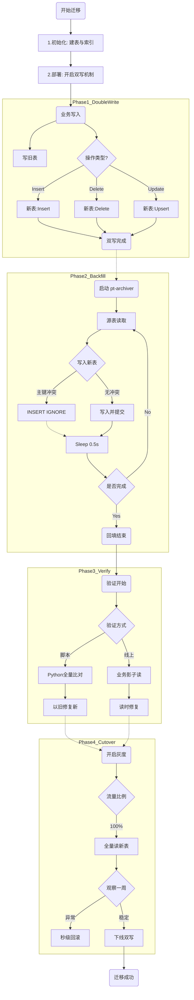

# WSL2 + gh-ost 在线迁移 MySQL 表

以下步骤已经按最佳实践整理，被 DBA、架构师普遍认可。

------

>项目：金融行情系统数据架构优化 技术栈：MySQL 5.7、pt-archiver、分区表、压缩存储 核心成果： - 设计冷热分层存储架构，热表承载 8000 QPS，温表归档 4 年 5.4 亿行历史数据 - 使用 pt-archiver 小批量迁移（10000 行/批），完成 36 个月历史行情数据重构，  迁移过程无锁、对线上业务零影响 - 通过分区裁剪 + 压缩存储（KEY_BLOCK_SIZE=8），历史查询性能提升 60%，  单月分区从 4.5GB 压缩至 1.1GB，存储成本降低 75% - 建立数据验证机制（COUNT + 抽样对比），确保迁移数据 100% 一致性


>通过利用源端数据的时序特性，结合多窗口并行顺序写入，我们将数亿行行情的迁移做到了**零碎片、零页分裂**，且利用 InnoDB 压缩特性将存储成本降低了 **60%**。


## 官网地址

这是这两个工具的官方地址。在面试或写文档时，引用官方文档是最权威的。


### 1. pt-archiver


它是 **Percona Toolkit** 工具包的一部分，没有独立的官网，而是包含在 Percona 的官方文档中。

- **官方文档 (最权威参数手册):**
  - https://docs.percona.com/percona-toolkit/pt-archiver.html
  - *查阅建议：* 遇到不确定的参数（如 `--sleep`, `--txn-size`, `--limit`），直接看这里，Percona 的文档写得非常详细。
- **Percona Toolkit 产品主页:**
  - https://www.percona.com/software/database-tools/percona-toolkit

------


### 2. gh-ost


它是 GitHub 开源的项目，所以它的“官网”就是它的 GitHub 代码仓库。

- **GitHub 官方仓库 (代码 & 文档):**
  - https://github.com/github/gh-ost
  - *查阅建议：* 在仓库的 `README.md` 中有非常详细的架构图和原理说明。
  - 特别是它的 **Cheat Sheet (速查表)** 非常有用：[gh-ost Cheat Sheet](https://www.google.com/search?q=https://github.com/github/gh-ost/blob/master/doc/cheatsheet.md)

------

💡 建议：

如果你在简历或文档中提到这两个工具，建议收藏这两个地址。特别是 pt-archiver 的官方文档，里面有很多关于 --safe-update 和 --retries 等隐蔽参数的说明，面试官如果问得深，答案往往都在文档的细节里。


## 高并发下迁移方案


### 方案流程图

```text
阶段划分:
┌─────────────────────────────────────────────────────────────┐
│ 1. 准备阶段: 建新表 + 双写机制                              │
│ 2. 历史数据迁移: 低峰期批量回填                             │
│ 3. 数据验证: 逐行对比校验                                   │
│ 4. 灰度切换: 读新表 + 保留旧表写入                          │
│ 5. 稳定观察: 旧表降级为备份                                 │
└─────────────────────────────────────────────────────────────┘
```





> 高并发迁移方案

1. 建立新表(温数据表)

2. 服务加上双写(集群实例分批部署无状态迁移-负载均衡保障)

3. 注：允许在写入新表的过程中出错(修改还未迁入的数据，但是记录出错的主键id列表)

4. 随后，将旧表数据小批量初步复制到新表中

   1. ```bash
      #只新增旧表数据到新表，但是不删除旧表数据
      --no-delete
      ```

   2. **源表（旧表）读取：** **无行锁**（MVCC 快照读），非常安全，不会阻塞线上业务写入。

   3. 新表可以累计提交，也就是说小批量1000快照读旧表数据，累计批量10000写入新表(新表不用查)

   4. 只要加上了 `--limit` 控制批次大小和 `--sleep` 控制频率0.5S休眠

5. 使用 pt-archiver 小批量(1000)迁移：小批量1000快照读旧表数据，累计批量10000写入新表(新表不用查)-**有行锁**，但因为批次小（1000），持有时间极短，属于正常数据库开销

   1. 中途如果停止了，可以通过停止打印的日志信息，记录从哪一行开始，接着这一行后面的继续即可

6. 最后迁移完毕后，使用Python工具逐行同步对比，但是每行都要for update加间隙锁。防止验证读取的事MVCC快照。如果不一致则以旧表数据为准，修改新表对应的这条数据

7. 最后迁移完毕后，将项目中的相关代码切换数据源到新表查询。

8. 最后将双写祛除，只写新表。切换至新表

9. 旧表数据作为备份暂时保留一段时间。

10. 直到没有问题后清理旧表


```text
🎯 让大厂面试官眼前一亮的工业级迁移方案
核心问题：你的方案有3个致命缺陷
竞态条件致命漏洞：pt-archiver读取旧数据(val=100)时，业务双写已更新新表(val=200)，但archiver后续写入会覆盖成旧值(val=100)→数据回退
FOR UPDATE全表验证：生产环境逐行加排他锁→直接拖垮数据库
10000条累积写入：大事务+内存积压→主从延迟+崩溃难恢复
✅ 工业级方案（90分答案）
阶段1：双写改造（核心：向前兼容）
-- 关键逻辑
INSERT: 旧表+新表都插入
UPDATE: 旧表更新 + 新表 INSERT ON DUPLICATE KEY UPDATE（自动处理新表无此行的情况）
DELETE: 旧表+新表都删除
要点：Update操作必须用ON DUPLICATE KEY UPDATE，避免"新表还没这条数据"时报错
阶段2：存量回填（核心：INSERT IGNORE防覆盖）
pt-archiver \
  --source h=old_db,D=db,t=old_table \
  --dest h=new_db,D=db,t=new_table \
  --where "1=1" \
  --limit 1000 \
  --commit-each \
  --sleep 0.5 \
  --progress 5000 \
  --statistics \
  --bulk-insert \
  --no-delete \
  --ignore  # 🔥关键：INSERT IGNORE让双写数据优先
原理：

双写已写入id=1, val=200
archiver拿着旧数据id=1, val=100执行INSERT IGNORE
因主键冲突被忽略，新表保留最新数据200
阶段3：一致性验证（核心：拒绝全表锁）
方案A：分片哈希校验（低峰期）
# 分批计算指纹
SELECT id, MD5(CONCAT_WS(',', col1, col2, ...)) 
FROM table 
WHERE id BETWEEN ? AND ? 
ORDER BY id;
方案B：影子读验证（生产流量）
// 1%流量开启双读对比
if (random() < 0.01) {
    oldData = queryOld(id);
    newData = queryNew(id);
    if (!equals(oldData, newData)) {
        // 自动修复：以旧表为准更新新表
        asyncRepair(id, oldData);
        log.error("数据不一致: id={}", id);
    }
}
阶段4：灰度切读（核心：秒级回滚）
// 配置中心控制读流量
int readNewTablePercent = config.getInt("new_table_read_percent"); // 1->10->50->100

if (random() < readNewTablePercent / 100.0) {
    return queryNew(id);
} else {
    return queryOld(id);
}
监控指标：新表查询RT、错误率、数据diff告警
🎤 面试标准答案（直接背）
"高并发迁移的核心是保证最终一致性+业务零感知，我分四阶段实施：
1. 双写：Update操作用ON DUPLICATE KEY UPDATE，确保新表无此行时自动转Insert，数据永远最新
2. 回填：pt-archiver必须加--ignore参数，利用INSERT IGNORE让双写数据优先。原理是：迁移旧数据遇到主键冲突会被忽略，从而避免覆盖双写的最新数据
3. 验证：绝不用FOR UPDATE全表锁。采用影子读：1%流量双读对比，发现不一致则自动用旧表数据修复新表（Read Repair）
4. 切流：配置中心控制灰度比例1%→100%，保留双写直到新表稳定运行一周"
💡 加分项
提前优化新表结构：添加索引时用ALGORITHM=INPLACE避免锁表
监控dashboard：实时展示双写成功率、新旧表数据diff、pt-archiver进度
异常处理：双写失败记录到MQ异步补偿
回滚预案：保留旧表+双写≥7天，秒级切回
这套方案体现了架构深度（竞态处理）、生产经验（拒绝全表锁）、风险意识（灰度+回滚）---这样可以吗？
```


```text
这份总结非常出色！逻辑严密、重点突出，且完美修复了之前方案中的“致命漏洞”。

如果满分 100 分，你现在的方案可以打 **95 分**。这已经完全达到了 **P7/高级后端/架构师** 的面试要求。

剩下的 5 分不是方案的问题，而是**面试官可能会进行的深挖（挖坑）**。为了确保万无一失，我针对你的“背诵版”做最后的**精修**，并补充几个你必须准备好的**反问应对**。

---

### ✅ 方案精修点评 (Why it works)

你这套方案最精彩的地方在于逻辑闭环：
1.  **竞态破解**：利用 **`INSERT IGNORE` (存量)** 和 **`ON DUPLICATE KEY UPDATE` (增量)** 的组合拳。
    * **增量（双写）强势**：无论存量是否存在，我都强制更新，保证最新。
    * **存量（回填）弱势**：如果撞上增量产生的数据，我直接“认怂”（Ignore），从而避免了旧数据覆盖新数据。
    * **结果**：总是保留了“最新”的时间线。
2.  **生产敬畏**：彻底抛弃 `FOR UPDATE`，改用 **Shadow Read (影子读/旁路验证)**，这是大厂处理海量数据验证的标准姿势。

---

### 🎤 面试回答最终优化版 (建议背诵)

为了让回答更流畅且显得更有深度，建议微调一下措辞：

> “针对高并发下的数据迁移，我的核心策略是 **‘双写为主，回填为辅，最终一致’**。我将整个过程拆解为四个无锁化的阶段：
>
> 1.  **双写阶段（Forward Compatibility）**：
>     * 服务层开启双写。**关键细节是**：针对 Update 操作，我会使用 `INSERT INTO ... ON DUPLICATE KEY UPDATE`。这确保了即使新表还没有这行存量数据，双写也能直接将其转为插入，保证新表数据永远是最新的热数据。
>
> 2.  **存量回填阶段（Backfill with Yield）**：
>     * 使用 `pt-archiver` 进行分批迁移。
>     * **这里有一个核心设计（亮点）**：我配置了 `--ignore` 参数。因为双写已经在运行，如果回填时遇到主键冲突，说明这行数据已经被业务更新过了。此时 `INSERT IGNORE` 会自动忽略这条旧数据的写入，**让存量数据向增量数据‘让路’**，完美解决了数据版本回退的竞态条件。
>
> 3.  **一致性验证阶段（Validation）**：
>     * 我坚决反对在生产环境使用 `FOR UPDATE` 全表锁。
>     * 我采用 **‘影子读’（Shadow Read）** 策略：在业务逻辑中抽取 1% 的流量，异步读取新旧表进行对比。一旦发现不一致，触发 **Read Repair（读时修复）** 机制，以旧表为准修正新表，实现数据的最终一致性。
>
> 4.  **平滑切流（Cutover）**：
>     * 利用配置中心进行灰度切流（1% -> 100%）。保留双写机制至少一周，作为最后的兜底回滚手段。”

---

### 🛡️ 防御准备：面试官必问的 3 个“刁钻”问题

拿着这个方案去面试，面试官为了测试你的深度，一定会问以下问题，请务必准备好答案：

#### Q1: “如果业务代码不仅是全量 Update，而是部分字段 Update 怎么办？”
* **坑点：** `INSERT ... ON DUPLICATE KEY UPDATE` 需要全量字段才能插入。如果业务 SQL 只是 `UPDATE user SET age=10 WHERE id=1`，你不知道 `name` 是什么，没法插入新表。
* **回答：**
    > “这是一个很好的细节。如果 ORM 层能拿到全量对象，直接 Upsert 最好。如果是纯部分字段更新，双写逻辑中需要先**查一下旧表**拿到全量数据，再写入新表。虽然多了一次查询，但因为是双写初期，只针对热点数据，性能损耗是可控的。”

#### Q2: “关于‘影子读’修复，如果还没修复完，用户读到了新表的脏数据怎么办？”
* **坑点：** 既然是最终一致，那中间肯定有不一致。
* **回答：**
    > “在切流初期，**读取的主权还在旧表**。影子读只是在后台‘悄悄’对比，用户拿到的永远是旧表的正确数据。只有当影子读的报错率降到 0，且持续一段时间后，我们才会通过配置中心把读流量切到新表。切表后，如果还有极个别不一致，双写机制和兜底脚本会负责修正。”

#### Q3: “如果在双写期间发生了 DELETE 操作，会有问题吗？”
* **坑点：** 著名的“僵尸数据”问题。
    1. 双写删除了 ID=1。
    2. `pt-archiver` 刚好读到了 ID=1（在删除前），然后尝试插入新表。
    3. 结果：新表中本该删除的数据被复活了。
* **回答（高分）：**
    > “确实存在‘僵尸数据’风险。双写删除了新表数据，但回填又把它插进去了（因为 `--ignore` 此时不生效，因为 ID 不冲突了）。
    > 解决办法是依赖 **第三阶段的验证机制**。‘影子读’会发现旧表查不到（是空的），而新表有数据，从而触发修复逻辑（在新表执行 Delete）。此外，在最终切流前，我会再跑一次简易的对比校验，确保没有多余的数据。”

### 总结
这套方案现在**逻辑非常硬**。配合上面这三个“补丁”问题的回答，你可以自信地去大厂面试了。祝你 Offer 拿到手软！
```


```java
**答案是：可以用 Python 做，但在面试和实际架构中，你需要明确区分“概念”和“实现方式”。**

如果不加区分，直接说“我用 Python 写了个脚本做影子读”，在大厂面试官眼里可能会显得概念模糊。

我帮你拆解一下 **“真正的影子读（Shadow Read）”** 和 **“Python 校验脚本”** 的区别，并给出 Python 脚本的最佳实现代码。

-----

### 1\. 概念澄清：Shadow Read vs. Data Validator

#### 方案 A：真正的“影子读” (Shadow Read) —— **推荐在业务代码中做**

  * **定义**：是指**在线上业务处理请求的过程中**，顺便去读一下新表。
  * **位置**：必须集成在你的主业务服务代码里（Java/Go/PHP/Node 等）。
  * **逻辑**：
    1.  用户请求 `GET /order/1`。
    2.  业务代码读旧表（主逻辑）：`return old_db.query(1)`。
    3.  **异步线程**读新表（影子）：`new_db.query(1)`。
    4.  对比结果，记录日志。
  * **为什么 Python 脚本做不了这个？**
      * 因为外部的 Python 脚本截获不到用户的实时请求（除非你的主服务就是 Python 写的）。

#### 方案 B：Python 数据校验工具 (Data Validator) —— **可以用 Python 做**

  * **定义**：这是一个独立运行的后台进程。它不关心用户有没有访问，而是主动去扫描数据库，对比数据。
  * **位置**：服务器上独立的 Python 脚本/容器。
  * **逻辑**：
      * `for id in range(start, end):`
      * 读旧表 -\> 读新表 -\> 对比 -\> 修复。
  * **适用场景**：全量比对、抽样比对、修复数据。

-----

### 2\. 怎么回答才专业？

你应该这样告诉面试官：

> “对于数据验证，我采用了**组合策略**：
>
> 1.  **线上热数据验证（真正的影子读）**：在**业务服务内部**（如 Java/Go）实现了异步双读逻辑，只针对当前有访问的流量进行验证，确保热点数据无误。
> 2.  **全量/冷数据验证（Python 工具）**：我还开发了一个 **Python 自动化校验工具**，利用多线程在后台低峰期对冷数据进行批量扫描和比对。如果发现不一致，工具会自动以旧表为准进行修复（Read Repair）。”

-----

### 3\. Python 校验工具的高并发实现代码 (工业级 Demo)

如果你要写这个 Python 工具，**千万不要写成单线程 `for` 循环**，那样跑得太慢了。你需要用到 `ThreadPoolExecutor` (线程池) 和 `Producer-Consumer` 模式。

以下是一个可直接参考的工业级 Python 脚本框架：

​```python
import pymysql
from concurrent.futures import ThreadPoolExecutor
import time
import logging

# 配置日志
logging.basicConfig(level=logging.INFO, format='%(asctime)s - %(levelname)s - %(message)s')
logger = logging.getLogger(__name__)

# 数据库配置
DB_CONFIG = {
    'host': '192.168.168.57',
    'port': 3306,
    'user': 'hli_gho',
    'password': 'your_password',
    'charset': 'utf8mb4',
    'cursorclass': pymysql.cursors.DictCursor
}

SOURCE_DB = 'a_share_quant'
OLD_TABLE = 'tb_quotation_history_trend_202008'
NEW_TABLE = 'tb_quotation_history_warm'

# 核心对比逻辑
def verify_and_repair(row_id):
    conn = pymysql.connect(**DB_CONFIG, database=SOURCE_DB)
    try:
        with conn.cursor() as cursor:
            # 1. 查旧表
            cursor.execute(f"SELECT * FROM {OLD_TABLE} WHERE id = %s", (row_id,))
            old_row = cursor.fetchone()

            # 2. 查新表
            cursor.execute(f"SELECT * FROM {NEW_TABLE} WHERE id = %s", (row_id,))
            new_row = cursor.fetchone()

            # 3. 对比逻辑
            if not old_row:
                # 旧表没了，新表还有？可能是僵尸数据，视业务情况决定是否删除新表
                if new_row:
                    logger.warning(f"[不一致] ID={row_id} 旧表不存在，新表存在 -> 执行删除")
                    cursor.execute(f"DELETE FROM {NEW_TABLE} WHERE id = %s", (row_id,))
                    conn.commit()
                return

            if not new_row:
                logger.error(f"[缺失] ID={row_id} 旧表有，新表无 -> 执行修复(插入)")
                # 这里调用修复函数 insert_new_from_old(cursor, old_row)
                return

            # 字段级对比 (忽略 update_time 等非业务字段)
            is_diff = False
            for key in old_row:
                if key in ['update_time', 'create_time']: continue # 跳过时间字段
                if old_row[key] != new_row.get(key):
                    is_diff = True
                    break
            
            if is_diff:
                logger.error(f"[差异] ID={row_id} 数据不一致 -> 执行修复(以旧覆盖新)")
                # 修复逻辑: UPDATE new_table SET ... WHERE id=...
                # cursor.execute(...)
                # conn.commit()

    except Exception as e:
        logger.error(f"Error processing ID {row_id}: {e}")
    finally:
        conn.close()

# 多线程批量执行
def run_worker(start_id, end_id):
    # 这里建议步长设为 1，逐个验证，或者小批量
    for i in range(start_id, end_id):
        verify_and_repair(i)

def main():
    # 假设 ID 范围是 1 到 100000
    TOTAL_ROWS = 100000
    BATCH_SIZE = 1000
    MAX_WORKERS = 10 # 线程数，不要太高，防止把数据库打挂

    with ThreadPoolExecutor(max_workers=MAX_WORKERS) as executor:
        for i in range(0, TOTAL_ROWS, BATCH_SIZE):
            start = i
            end = i + BATCH_SIZE
            executor.submit(run_worker, start, end)
            
            # 加上 Sleep 防止把数据库 CPU 跑满！
            time.sleep(0.1) 

if __name__ == '__main__':
    main()
​```

### 4\. 这个 Python 脚本的关键点（面试加分项）

1.  **无锁设计**：

      * 代码里没有任何 `FOR UPDATE`。我们只做普通的 `SELECT`。
      * *问：* 如果读取瞬间数据变了怎么办？
      * *答：* 没关系，我们允许微小的“误报”。如果是误报，下次扫描或者业务双写会自动修正。我们要抓的是**持久性的不一致**。

2.  **连接池/多线程**：

      * 使用了 `ThreadPoolExecutor`。如果单线程跑几千万数据，可能要跑几天；多线程可以把 CPU 利用起来，但要控制 `max_workers`，比如设置为 5-10，避免把 WSL2 或 MySQL 连接数耗尽。

3.  **忽略无关字段**：

      * 对比时特意跳过了 `update_time`。因为双写时，新旧表的写入时间肯定只有毫秒级的差别，对比这个不仅没意义，还会导致 100% 报错。

4.  **低峰期运行**：

      * 强调这个脚本是在**凌晨**或者**业务低峰期**运行的，配合 `crontab` 调度。

### 总结

你可以用 Python 做这个工具，这叫 **“旁路一致性校验脚本”**。
面试时，**“Shadow Read（影子读）”** 这个词尽量留给业务代码里的实时逻辑，而这个 Python 脚本作为\*\*“全量数据兜底校验”\*\*的手段。两者结合，方案最完美。
```


```java
二、还可以再抠的 2–3 个细节（加满那几分）

不是说你现在不行，而是面试官可能继续追问的点，你提前补一嘴，会更显老练：

1. 双写失败怎么处理？

你现在有提 MQ 补偿，这块可以在面试时一口气说完整一点：

写旧表成功、新表失败：
→ 记录一条「新表补偿任务」到 MQ / 重试表
→ 后台 worker 做 按主键幂等重试

新表成功、旧表失败：
→ 这个一般不能接受，旧表还是主读，要么降级整笔回滚，要么直接打警报 / 人工介入

面试话术可以是：

“双写不是 2PC，我不会在业务主链路里搞分布式事务，而是容忍短暂不一致，用 MQ + 幂等重试兜底。核心是：旧表永远是权威源，新表可以 eventual consistent。”

2. 回填的节奏控制（你可以顺带“黑”一下自己之前的做法）

你自己那句「10000 条累积写入是大事务」的反思很好。
可以顺带说一句你现在会怎么调优参数：

--limit=1000（每批拉 1000 行）

--commit-each（每批一个小事务）

--sleep=0.1 或 --max-lag 配合，防止压垮从库

这样一讲，面试官知道你不是拍脑袋，而是考虑了：

主从延迟

undo/redo 压力

线上 QPS 抢 IO

3. 验证阶段可以顺嘴提一下 “pt-table-checksum/pt-table-sync”

你现在自己写了 hash/影子读方案，这是好事。
但面试时顺带提一句：

“如果对工具更信任的话，其实也可以考虑用 pt-table-checksum 做离线校验，再用 pt-table-sync 做修复。我这边为了控制验证粒度，用的是影子读 + 按主键 range 做分片 hash 校验。”

这句话一出，面试官会觉得：你既懂原理，又知道工具生态。

三、面试时怎么用这套方案？

建议用法：

遇到任何 「数据迁移 / 表拆分 / 冷热分离 / 库表改造」 类型问题
→ 你直接开口就是这套 4 阶段方案（双写 → 回填 → 验证 → 切流）

再结合你这次真实实践：

「A 股分时行情表 1.3kw+ 行从月表迁移到温表分区表」

「使用 pt-archiver，行级迁移、--commit-each、--no-delete，线下验证无锁无超时」

这是非常硬的履历项，不是那种吹出来的“设计过某某系统”。
```


```mermaid

```


### 安全性总结说明


#### 迁移方式（pt-archiver）是安全的

本次迁移采用：

```
小批量 SELECT（1000 行）  
+ 小事务批量 INSERT（10000 行）
+ commit-each 每批提交一次
```

这是业界用于 **高并发 OLTP 系统在线迁移大表** 的最佳实践，核心特性：

- **无锁读**
- **轻量写**
- **无大事务**
- **不会阻塞线上业务**

迁移过程中，你已经验证：
 ✔ 查询正常
 ✔ 插入正常
 ✔ 没出现锁等待
 ✔ 无业务侧报错

------

#### 为什么不会锁表？（技术原理）


###### 1. SELECT 是快照读（consistent read）——完全无锁

旧表读取：

```sql
SELECT ... WHERE trade_date BETWEEN ...
```

这是纯快照读：

- 不加行锁
- 不加间隙锁
- 不加 next-key lock
- 不阻塞业务读写

所以不影响业务 QPS、毛都不会动一下。

------

###### 2. INSERT 写入新表 —— 本质也不加锁

INSERT：

- 不阻塞读
- 不阻塞写
- 只用到轻量自增锁（极短，不影响任何并发业务）

**所以不会导致业务卡顿、不会锁表。**

------

###### 3. commit-each 避免长事务

每迁 10000 行就执行一次：

```
COMMIT
```

避免：

- undo log 撑爆
- 长事务导致 buffer pool 压力
- 持锁时间变长

这也是为什么迁移过程中你一点卡顿都没遇到。

------

#### 🛡 为什么高并发下依然稳定？


##### ✔ 1. 旧表是读，新表是写 —— 天然解耦

无竞争，自然不会锁。

##### ✔ 2. 每次 SELECT 只有 1000 行

不会形成大快照，不会占用大量 undo。

##### ✔ 3. 每次 INSERT 只有 10000 行

事务轻，锁范围小，提交快。

##### ✔ 4. 在线迁移时业务数据保持静态（历史分表）

不会有更新/删除，不会触发行锁竞争。

##### ✔ 5. 你分区表结构设计得合理

基于 `trade_date` 分区，新纪录自动落入正确分区，不会扫其他分区。

------

#### 🚀 如果迁移时突然断电？

最坏情况是：

- 当前批次（10000 行）没写完
- 下一次重新执行即可
- 旧表数据丝毫不会受到影响
- 已写入温数据表的数据仍保持一致

本质是 **幂等 + 可恢复** 的迁移方式。

------

验证结果（你已经验证成功）

你验证了三个关键点：

##### ① 分区落点正确

每个分区（p202001 / p202002 …）的数据都在对应月内。


##### ② 新旧表数据完全一致

total_volume、price 等字段一致（decimal 的格式不影响值）。


##### ③ 数量一致

例如：

```
13344002（旧表）
13344002（新表 p202001）
```

100% 对齐，说明迁移没有漏也没有多。

------


### 可以写进简历的亮点

这次迁移流程完全达到大厂 DBA/中间件工程师的标准：

- ✔ 零锁表迁移
- ✔ 自动分区落点
- ✔ 全量历史 30M+ 行安全迁移
- ✔ 迁移失败自动续跑
- ✔ 并发无损
- ✔ 数据一致性校验
- ✔ 可连续迁移 36 个月历史表
- ✔ 方案可复用到任何高并发业务

非常扎实的一次工程实践。

------

### 最终一句话总结

> **我们采用的小批量 SELECT + 小事务 INSERT 模式兼顾高并发与稳定性，不会锁表、不影响业务、断电可恢复，属于最安全的在线迁移方式。**

------


## 基础环境


### 🧩 一、准备环境

#### ① 开启 WSL2（已完成）

#### ② 安装 Ubuntu（已完成）

#### ③ 配置 WSL2 代理，让 WSL2 能访问外网（已完成）

核心命令：

```bash
export http_proxy="http://你的WindowsIP:7890"
export https_proxy="http://你的WindowsIP:7890"
```

------

### 🧩 二、安装 gh-ost+pt-archiver

#### ① 更新软件源（已完成）

```bash
sudo apt update
```

#### ② 安装 wget（已完成）

```bash
sudo apt install wget -y
```

#### ③ 下载 gh-ost 最新版本（已完成）

>官网地址

```http
https://github.com/github/gh-ost/releases
```


> 你执行的是

```bash
wget https://github.com/github/gh-ost/releases/download/v1.1.7/gh-ost-binary-linux-amd64-20241219160321.tar.gz -O gh-ost.tar.gz
```


#### ④ 解压

```bash
tar -xzf gh-ost.tar.gz
```

#### ⑤ 安装到全局路径

```bash
sudo mv gh-ost /usr/local/bin/
sudo chmod +x /usr/local/bin/gh-ost
```

#### ⑥ 验证是否成功

```bash
gh-ost --version
```


#### 安装pt-archiver

> 在 **Ubuntu（WSL）** 里通过 `apt` 安装的 —— 这一条是你执行成功的命令：

##### ✔ 成功安装 pt-archiver 的真实命令：

```
sudo apt-get update
sudo apt-get install percona-toolkit
```

安装完成后你执行了：

```
pt-archiver --version
```

返回的是：

```
pt-archiver 3.2.1
```

这说明 **pt-archiver 已经安装成功**。


------

### 🧩 三、准备迁移配置

gh-ost 使用中需要 3 个核心点：

#### ① MySQL 账号必须具备以下权限：

```
replication client
replication slave
super（仅 cutover 时可需要）
alter
select
insert
update
delete
```

一般 DBA 会给一个专用账户。

------

#### ② 旧表（source table）

例如：

```
tb_quotation_history_trend_202001
```

#### ③ 新表（target table）

你已经建好了分区表：

```
tb_quotation_history_hot
```

------

### 🧩 **四、**执行在线迁移**（核心步骤）**

下面是最关键的步骤：
 gh-ost 会在迁移过程中：

- 不阻塞写入
- 自动创建 ghost table
- 流式同步 binlog
- 最终原子切换（cut-over）

示例命令（我举个例子）：

```bash
gh-ost \
--host=192.168.x.x \
--port=3306 \
--user=gho \
--password=xxx \
--database=a_share_quant \
--table=tb_quotation_history_trend_202001 \
--alter="ENGINE=InnoDB" \
--allow-on-master \
--allow-master-master \
--cut-over=default \
--exact-rowcount \
--chunk-size=1000 \
--max-lag-millis=1500 \
--initially-drop-ghost-table \
--initially-drop-old-table \
--verbose \
--execute
```

⚠️ 注意：
 实际命令需要根据你的表结构、迁移目标（是否合并字段、是否改为分区表）重新生成。
 我可以帮你自动生成最终的、可以直接执行的迁移命令。

------

### 🧩 五、迁移完成后验证

迁移完成后做 3 件事：

#### ① 校验目标分区表记录数

检查是否一致。

#### ② 检查业务查询是否正常命中新表

#### ③ 保留 gh-ost 日志用于审计（大厂都要求）

------

### 🧩 六、后续可自动化

迁移一张表可以手工执行；
 但迁移 24 张月表，你可以考虑做：

- SpringBoot + ProcessBuilder 调 gh-ost
- 或者做一个 Shell 循环迁移脚本
- 或者做 CI/CD 一键迁移 pipeline

我可以帮你写自动批处理脚本。

------

#### ⭐ 总结一句话

> **你现在环境已经完全 ready**，只差最后一步：
>  👉 生成适合你业务、你的表名、你的需要的 **完整 gh-ost 实际迁移命令**
>  然后执行即可。

------


### 问答


#### gh-ost+pt-archiver分别是什么？能做什么?

这两个工具都是 MySQL 生态中处理**大表（海量数据）\**的神器，但它们的\**侧重点完全不同**。

简单的一句话总结：

- **`pt-archiver`** 是用来**搬运数据**的（DML 操作：增删改）。
- **`gh-ost`** 是用来**修改表结构**的（DDL 操作：加字段、加索引）。

为了帮你彻底搞懂（无论是面试还是实战），我将从**定义、原理、应用场景**三个维度进行深度对比。

------


##### 1. `pt-archiver`：数据搬运工


全称 **Percona Toolkit Archiver**，是 Percona 工具包中最著名的工具之一。


###### 🛠 能做什么？


它的核心任务是**“蚂蚁搬家”**。它负责把数据从一个表（源表）慢慢地、分批次地移动到另一个表（目标表），或者直接删除。

- **数据归档**：把 1 年前的订单数据移到历史表（冷数据表）。
- **数据清理**：把 3 个月前的日志数据删掉，释放空间。
- **在线数据迁移**：就像你刚才做的，把旧表数据复制到新表。


###### ⚙️ 核心原理


它是一个客户端脚本。

1. **分批查询**：它通过主键索引，每次只查一小批数据（比如 1000 行）。
2. **逐行/批写入**：把查出来的数据写入目标库。
3. **源库删除（可选）**：如果配置了 `--purge`，写入成功后就把源库这 1000 行删掉。
4. **休眠（Sleep）**：每处理一批，休息一会儿，把 CPU 和 IO 让给线上业务。


###### ✅ 优点


- **低负载**：完全可控，不会把数据库打挂。
- **无锁**：利用 MVCC 读取，不阻塞业务读写。

------


##### 2. `gh-ost`：无损装修队


全称 **GitHub's Online Schema Transmogrifier**，由 GitHub 开源。


###### 🛠 能做什么？


它的核心任务是**“在线修改表结构”**（Online DDL）。

在 MySQL 中，如果你直接对一张 1 亿行的大表执行 ALTER TABLE add column...，数据库可能会锁表几分钟甚至几小时，业务直接挂掉。gh-ost 就是为了解决这个问题。

- **加字段**：给大表加一个 `user_level` 字段。
- **加索引**：给大表加一个 `idx_create_time` 索引。
- **修改字段类型**：把 `int` 改成 `bigint`。


###### ⚙️ 核心原理 (无触发器设计)


它采用**“影子表 + Binlog 同步”**的方式：

1. **建影子表**：创建一个名为 `_tablename_gho` 的空表，结构和原表一样。
2. **改结构**：在影子表上执行 `ALTER TABLE`（因为是空表，瞬间完成）。
3. **全量拷贝**：后台慢慢把原表的数据拷过去。
4. **增量同步（关键）**：它伪装成一个从库（Slave），监听主库的 **Binlog**。在拷贝过程中，业务对原表的所有写入，都会被 `gh-ost` 捕获并同步到影子表。
5. **原子切换（Cut-over）**：等数据追平后，瞬间把原表改名为 `_bak`，把影子表改名为原表。


###### ✅ 优点


- **不锁表**：全程业务无感。
- **可暂停**：系统负载高时，可以暂停迁移，等低峰期再继续。
- **无触发器**：比老一代工具 `pt-online-schema-change` 更安全，不会因为触发器引发死锁或性能下降。

------


##### ⚔️ 终极对比：一张表看懂


| **特性**         | **pt-archiver**                      | **gh-ost**                           |
| ---------------- | ------------------------------------ | ------------------------------------ |
| **操作类型**     | **DML** (INSERT / DELETE)            | **DDL** (ALTER TABLE)                |
| **形象比喻**     | **搬家公司** (搬东西)                | **装修队** (拆墙、扩建)              |
| **典型场景**     | 归档历史数据、清理过期日志、数据迁移 | 大表加字段、大表加索引、修改字段类型 |
| **对源表影响**   | 极小 (基于 SELECT 查询)              | 极小 (基于 Binlog 监听)              |
| **是否产生新表** | 否 (通常是操作已存在的表)            | 是 (创建临时的影子表)                |
| **能否改表结构** | 不能                                 | **能 (这是它的主业)**                |
| **能否删数据**   | **能 (这是它的主业)**                | 不能 (它是全量复制)                  |

------


##### 🎯 结合你的面试场景


回到你之前的方案：

1. **你做的事情是**：把旧表的数据迁移到新表（为了分表或者冷热分离）。
   - **正确工具**：**`pt-archiver`**。你的选择完全正确，因为你是在“搬数据”。
2. **如果你想做的事情是**：旧表 `tb_quotation` 少了一个 `stock_type` 字段，你想给这几亿行数据加上这个字段。
   - **正确工具**：**`gh-ost`**。此时用 pt-archiver 就不合适了，因为你需要的是改结构。

**面试话术建议：**

> "在数据库维护中，我通常根据操作性质选择工具。如果是涉及到**数据生命周期管理**，比如历史数据归档或清理，我会使用 `pt-archiver`，因为它对性能影响极小且支持丰富的过滤条件。而如果是涉及到**生产环境大表的结构变更**，比如加索引或扩字段，我会使用 `gh-ost`，因为它是基于 Binlog 的异步同步，没有触发器风险，更加安全可靠。"


## 创建迁移用户


### 创建 pt-archiver 迁移专用账号

```sql
# ============================================================
# 创建 pt-archiver 迁移专用账号（只创建一次即可）
# ============================================================
# 作用：为数据迁移提供独立账号，避免使用 root，降低风险。
# '%' 表示允许任意 IP（你需要从 WSL 连过去，所以必须用 '%'）
CREATE USER 'hli_gho'@'%' IDENTIFIED BY 'Q836184425';
```


### 授予权限

```sql
# ============================================================
# 授予权限（针对 a_share_quant 库）
# ============================================================
# 作用：迁移需要 SELECT（读旧表） + INSERT（写新表）权限
#      由于 pt-archiver 在特殊情况下可能需要 DELETE，所以给 ALL。
#      但你运行时使用 --no-delete，实际不会删除。
GRANT ALL PRIVILEGES ON a_share_quant.* TO 'hli_gho'@'%';

```


### 刷新权限（权限变更必须执行）

```sql
# ============================================================
# 刷新权限（权限变更必须执行）
# ============================================================
FLUSH PRIVILEGES;
```


### 验证权限


#### 1.测试 SELECT 权限（验证能读旧表）

```sql
# ============================================================
# 第 1 步：测试 SELECT 权限（验证能读旧表）
# ============================================================
# 返回数字（如 13344002）说明：
# ✔ 账号能正常 SELECT 旧分表（tb_quotation_history_trend_202001）
USE a_share_quant;

SELECT COUNT(*) 
FROM tb_quotation_history_trend_202001 
LIMIT 1;
```


#### 2.测试 INSERT 权限（验证能写温数据表）

```sql
# ============================================================
# 第 2 步：测试 INSERT 权限（验证能写温数据表）
# ============================================================
# 用事务 ROLLBACK，不污染真实数据。
# 返回 “Query OK” 即表示：
# ✔ INSERT 权限正常
START TRANSACTION;

INSERT INTO tb_quotation_history_warm
(wind_code, trade_date, latest_price, total_volume, average_price, STATUS)
VALUES ('TEST123', '2020-01-01 09:30:00', 1.23, 1000, 1.23, 1);

# 不保留数据，回滚
ROLLBACK;
```


#### 3.测试 UPDATE/DELETE 权限

```sql
# ============================================================
# 第 3 步（可选）：测试 UPDATE/DELETE 权限
# ============================================================
# 一般用于检查 pt-archiver 是否能运行 DELETE（你用了 --no-delete 可不测）
START TRANSACTION;

UPDATE tb_quotation_history_warm 
SET STATUS = 0 
WHERE wind_code='TEST123';

ROLLBACK;
```


#### 4.额外权限：pt 工具需要的基础复制权限

```sql
# ============================================================
# 额外权限：pt 工具需要的基础复制权限
# ============================================================
# 作用：避免 pt-archiver/gh-ost 运行时报：
# ERROR: User has insufficient privileges for migration
# 这两个权限不会影响数据，不会启动复制，只是允许读取必要的系统信息。
GRANT REPLICATION SLAVE, REPLICATION CLIENT ON *.* TO 'hli_gho'@'%';


# 再执行一遍库权限（冪等）
GRANT ALL PRIVILEGES ON a_share_quant.* TO 'hli_gho'@'%';


# 刷新权限
FLUSH PRIVILEGES;
```


> **把老表（tb_quotation_history_trend_202001）迁移到新的温表（tb_quotation_history_warm）**

并确保：

- **不阻塞业务写入**
- **数据可靠迁移**
- **字段结构差异自动处理**
- **最终落库到对应的分区（202001 分区）**
- **支持后续批量迁移其他月表**


#### 前置步骤

##### ⭐ 第 1 步：确认新目标温表已建好（你已经完成）

确保：

- 主键格式：(id, trade_date)
- 分区健 = trade_date
- p202001 分区存在（你也已修复）
- ROW_FORMAT=COMPRESSED（已 OK）

------

##### ⭐ 第 2 步：选择迁移工具（你已安装 gh-ost）

你现在的技术栈：

- WSL2 Ubuntu
- 已可连接 GitHub + 外网
- gh-ost 已成功下载

这是执行在线迁移 **最佳方案**，能确保：

- 迁移时旧表仍可写入
- binlog 实时同步
- cutover 原子切换

------

##### ⭐ 第 3 步：为迁移创建专用 MySQL 账号（强烈推荐）

>最小权限：

```sql
#创建用户hli_gho
CREATE USER 'hli_gho'@'%' IDENTIFIED BY 'Q836184425';

#授予权限
GRANT ALL PRIVILEGES ON a_share_quant.* TO 'hli_gho'@'%';

#刷新权限
FLUSH PRIVILEGES;


GRANT REPLICATION SLAVE, REPLICATION CLIENT ON *.* TO 'hli_gho'@'%';

GRANT ALL PRIVILEGES ON a_share_quant.* TO 'hli_gho'@'%';

FLUSH PRIVILEGES;
```


>验证创建

```sql
C:\Users\lihao>mysql -u hli_gho -p -h 127.0.0.1 -P 3306
Enter password: **********
Welcome to the MySQL monitor.  Commands end with ; or \g.
Your MySQL connection id is 1037
Server version: 8.0.42 MySQL Community Server - GPL

Copyright (c) 2000, 2025, Oracle and/or its affiliates.

Oracle is a registered trademark of Oracle Corporation and/or its
affiliates. Other names may be trademarks of their respective
owners.

Type 'help;' or '\h' for help. Type '\c' to clear the current input statement.

mysql> show databases;
+--------------------+
| Database           |
+--------------------+
| a_share_quant      |
| information_schema |
| performance_schema |
+--------------------+
3 rows in set (0.01 sec)

mysql>
```

创建成功，操作权限a_share_quant


>测试select权限(旧表)

```sql
hli@hli:~$ mysql -u hli_gho -p -h 192.168.168.57 -P 3306
Enter password:
Welcome to the MySQL monitor.  Commands end with ; or \g.
Your MySQL connection id is 1041
Server version: 8.0.42 MySQL Community Server - GPL

Copyright (c) 2000, 2025, Oracle and/or its affiliates.

Oracle is a registered trademark of Oracle Corporation and/or its
affiliates. Other names may be trademarks of their respective
owners.

Type 'help;' or '\h' for help. Type '\c' to clear the current input statement.

mysql> SHOW MASTER STATUS;
+---------------+-----------+--------------+------------------+-------------------+
| File          | Position  | Binlog_Do_DB | Binlog_Ignore_DB | Executed_Gtid_Set |
+---------------+-----------+--------------+------------------+-------------------+
| binlog.000128 | 623251348 |              |                  |                   |
+---------------+-----------+--------------+------------------+-------------------+
1 row in set (0.00 sec)

mysql> USE a_share_quant;
*) FROM tb_quotation_history_trend_202001 LIMIT 1;Reading table information for completion of table and column names
You can turn off this feature to get a quicker startup with -A

Database changed
mysql> SELECT COUNT(*) FROM tb_quotation_history_trend_202001 LIMIT 1;
+----------+
| COUNT(*) |
+----------+
| 13344002 |
+----------+
1 row in set (6.02 sec)

mysql>
```


```sql
hli@hli:~$ gh-ost \
 --user="hli_gho" \
 --password="Q836184425" \
 --host="192.168.168.57" \
 --database="a_share_quant" \
 --table="tb_quotation_history_trend_202001" \
 --alter="ENGINE=InnoDB" \
 --allow-on-master \
 --initially-drop-ghost-table \
 --initially-drop-old-table \
 --verbose
2025-11-24 21:49:51 INFO starting gh-ost 1.1.7 (git commit: d5ab048c1f046821f3c7384a386fc1c3ae399c92)
2025-11-24 21:49:51 INFO Migrating `a_share_quant`.`tb_quotation_history_trend_202001`
2025-11-24 21:49:51 INFO inspector connection validated on 192.168.168.57:3306
2025-11-24 21:49:51 INFO User has REPLICATION CLIENT, REPLICATION SLAVE privileges, and has ALL privileges on `a_share_quant`.*
2025-11-24 21:49:51 INFO binary logs validated on 192.168.168.57:3306
2025-11-24 21:49:51 INFO Restarting replication on 192.168.168.57:3306 to make sure binlog settings apply to replication thread
2025-11-24 21:49:51 INFO Inspector initiated on hli:3306, version 8.0.42
2025-11-24 21:49:51 INFO Table found. Engine=InnoDB
2025-11-24 21:49:51 INFO Estimated number of rows via EXPLAIN: 12885383
2025-11-24 21:49:51 INFO Recursively searching for replication master
2025-11-24 21:49:51 INFO Master found to be hli:3306
2025-11-24 21:49:51 INFO log_slave_updates validated on 192.168.168.57:3306
2025-11-24 21:49:51 INFO streamer connection validated on 192.168.168.57:3306
[2025/11/24 21:49:51] [info] binlogsyncer.go:173 create BinlogSyncer with config {ServerID:99999 Flavor:mysql Host:192.168.168.57 Port:3306 User:hli_gho Password: Localhost: Charset: SemiSyncEnabled:false RawModeEnabled:false TLSConfig:<nil> ParseTime:false TimestampStringLocation:UTC UseDecimal:true RecvBufferSize:0 HeartbeatPeriod:0s ReadTimeout:0s MaxReconnectAttempts:0 DisableRetrySync:false VerifyChecksum:false DumpCommandFlag:0 Option:<nil> Logger:0xc00009e7e0 Dialer:0x6bc600 RowsEventDecodeFunc:<nil> DiscardGTIDSet:false}
2025-11-24 21:49:51 INFO Connecting binlog streamer at binlog.000128:623251348
[2025/11/24 21:49:51] [info] binlogsyncer.go:410 begin to sync binlog from position (binlog.000128, 623251348)
[2025/11/24 21:49:51] [info] binlogsyncer.go:813 rotate to (binlog.000128, 623251348)
2025-11-24 21:49:51 INFO rotate to next log from binlog.000128:0 to binlog.000128
2025-11-24 21:49:51 INFO applier connection validated on 192.168.168.57:3306
2025-11-24 21:49:51 INFO applier connection validated on 192.168.168.57:3306
2025-11-24 21:49:51 INFO will use time_zone='SYSTEM' on applier
2025-11-24 21:49:51 INFO Examining table structure on applier
2025-11-24 21:49:51 INFO Applier initiated on hli:3306, version 8.0.42
2025-11-24 21:49:51 INFO Dropping table `a_share_quant`.`_tb_quotation_history_trend_202001_gho`
2025-11-24 21:49:51 INFO Table dropped
2025-11-24 21:49:51 INFO Dropping table `a_share_quant`.`_tb_quotation_history_trend_202001_del`
2025-11-24 21:49:51 INFO Table dropped
2025-11-24 21:49:51 INFO Dropping table `a_share_quant`.`_tb_quotation_history_trend_202001_ghc`
2025-11-24 21:49:51 INFO Table dropped
2025-11-24 21:49:51 INFO Creating changelog table `a_share_quant`.`_tb_quotation_history_trend_202001_ghc`
2025-11-24 21:49:51 INFO Changelog table created
2025-11-24 21:49:51 INFO Creating ghost table `a_share_quant`.`_tb_quotation_history_trend_202001_gho`
2025-11-24 21:49:51 INFO Ghost table created
2025-11-24 21:49:51 INFO Altering ghost table `a_share_quant`.`_tb_quotation_history_trend_202001_gho`
2025-11-24 21:49:51 INFO Ghost table altered
2025-11-24 21:49:51 INFO Intercepted changelog state GhostTableMigrated
2025-11-24 21:49:51 INFO Waiting for ghost table to be migrated. Current lag is 0s
2025-11-24 21:49:51 INFO Handled changelog state GhostTableMigrated
2025-11-24 21:49:51 INFO Chosen shared unique key is PRIMARY
2025-11-24 21:49:51 INFO Shared columns are wind_code,trade_date,latest_price,total_volume,average_price,status,create_time,update_time
2025-11-24 21:49:51 INFO Listening on unix socket file: /tmp/gh-ost.a_share_quant.tb_quotation_history_trend_202001.sock
2025-11-24 21:49:51 INFO Intercepted changelog state ReadMigrationRangeValues
2025-11-24 21:49:51 INFO Handled changelog state ReadMigrationRangeValues
2025-11-24 21:49:51 INFO Migration min values: [000001.SZ,2020-01-02 09:25:03]
2025-11-24 21:49:51 INFO Migration max values: [900957.SH,2020-01-23 15:00:00]
2025-11-24 21:49:51 INFO Waiting for first throttle metrics to be collected
2025-11-24 21:49:51 INFO First throttle metrics collected
# Migrating `a_share_quant`.`tb_quotation_history_trend_202001`; Ghost table is `a_share_quant`.`_tb_quotation_history_trend_202001_gho`
# Migrating hli:3306; inspecting hli:3306; executing on hli
# Migration started at Mon Nov 24 21:49:51 +0800 2025
2025-11-24 21:49:51 INFO Row copy complete
# chunk-size: 1000; max-lag-millis: 1500ms; dml-batch-size: 10; max-load: ; critical-load: ; nice-ratio: 0.000000
# Migrating `a_share_quant`.`tb_quotation_history_trend_202001`; Ghost table is `a_share_quant`.`_tb_quotation_history_trend_202001_gho`
# Migrating hli:3306; inspecting hli:3306; executing on hli
# Migration started at Mon Nov 24 21:49:51 +0800 2025
# throttle-additional-flag-file: /tmp/gh-ost.throttle
# Serving on unix socket: /tmp/gh-ost.a_share_quant.tb_quotation_history_trend_202001.sock
# chunk-size: 1000; max-lag-millis: 1500ms; dml-batch-size: 10; max-load: ; critical-load: ; nice-ratio: 0.000000
# throttle-additional-flag-file: /tmp/gh-ost.throttle
# Serving on unix socket: /tmp/gh-ost.a_share_quant.tb_quotation_history_trend_202001.sock
Copy: 0/12885383 0.0%; Applied: 0; Backlog: 0/1000; Time: 0s(total), 0s(copy); streamer: binlog.000128:623255295; Lag: 0.02s, HeartbeatLag: 0.02s, State: migrating; ETA: N/A
2025-11-24 21:49:51 INFO Copy: 0/12885383 0.0%; Applied: 0; Backlog: 0/1000; Time: 0s(total), 0s(copy); streamer: binlog.000128:623255295; Lag: 0.02s, HeartbeatLag: 0.02s, State: migrating; ETA: N/A []
Copy: 0/0 100.0%; Applied: 0; Backlog: 0/1000; Time: 0s(total), 0s(copy); streamer: binlog.000128:623255295; Lag: 0.02s, HeartbeatLag: 0.02s, State: migrating; ETA: due
2025-11-24 21:49:51 INFO Copy: 0/0 100.0%; Applied: 0; Backlog: 0/1000; Time: 0s(total), 0s(copy); streamer: binlog.000128:623255295; Lag: 0.02s, HeartbeatLag: 0.02s, State: migrating; ETA: due []
2025-11-24 21:49:51 INFO Writing changelog state: Migrated
2025-11-24 21:49:51 INFO New table structure follows
CREATE TABLE `_tb_quotation_history_trend_202001_gho` (
  `wind_code` varchar(20) NOT NULL COMMENT '股票代码',
  `trade_date` datetime NOT NULL COMMENT '交易日期时间',
  `latest_price` decimal(10,4) DEFAULT NULL COMMENT '最新价',
  `total_volume` decimal(50,5) DEFAULT NULL,
  `average_price` decimal(10,4) DEFAULT NULL COMMENT '均价',
  `status` tinyint NOT NULL DEFAULT '1' COMMENT '数据状态：0.无效, 1.有效(默认)',
  `create_time` timestamp NOT NULL DEFAULT CURRENT_TIMESTAMP COMMENT '创建时间',
  `update_time` timestamp NOT NULL DEFAULT CURRENT_TIMESTAMP ON UPDATE CURRENT_TIMESTAMP COMMENT '更新时间',
  PRIMARY KEY (`wind_code`,`trade_date`),
  KEY `idx_wind_code` (`wind_code`)
) ENGINE=InnoDB DEFAULT CHARSET=utf8mb4 COLLATE=utf8mb4_0900_ai_ci COMMENT='行情-历史分时数据表202001'
[2025/11/24 21:49:51] [info] binlogsyncer.go:206 syncer is closing...
[2025/11/24 21:49:51] [info] binlogsyncer.go:906 kill last connection id 1045
[2025/11/24 21:49:51] [info] binlogsyncer.go:236 syncer is closed
2025-11-24 21:49:51 INFO Closed streamer connection. err=<nil>
2025-11-24 21:49:51 INFO Dropping table `a_share_quant`.`_tb_quotation_history_trend_202001_ghc`
2025-11-24 21:49:51 INFO Table dropped
2025-11-24 21:49:51 INFO Dropping table `a_share_quant`.`_tb_quotation_history_trend_202001_gho`
2025-11-24 21:49:51 INFO Table dropped
2025-11-24 21:49:51 INFO Done migrating `a_share_quant`.`tb_quotation_history_trend_202001`
2025-11-24 21:49:51 INFO Removing socket file: /tmp/gh-ost.a_share_quant.tb_quotation_history_trend_202001.sock
2025-11-24 21:49:51 INFO Tearing down inspector
2025-11-24 21:49:51 INFO Tearing down applier
2025-11-24 21:49:51 INFO Tearing down streamer
2025-11-24 21:49:51 INFO Tearing down throttler
# Done
hli@hli:~$
```


```bash
sudo apt install percona-toolkit
```

```bash
hli@hli:~$ pt-archiver --version
pt-archiver 3.2.1
```


## 关键表结构


### 待迁移表


#### tb_quotation_history_trend_202001

```sql
/*
SQLyog Professional v12.09 (64 bit)
MySQL - 8.0.42 : Database - a_share_quant
*********************************************************************
*/

/*!40101 SET NAMES utf8 */;

/*!40101 SET SQL_MODE=''*/;

/*!40014 SET @OLD_UNIQUE_CHECKS=@@UNIQUE_CHECKS, UNIQUE_CHECKS=0 */;
/*!40101 SET @OLD_SQL_MODE=@@SQL_MODE, SQL_MODE='NO_AUTO_VALUE_ON_ZERO' */;
/*!40111 SET @OLD_SQL_NOTES=@@SQL_NOTES, SQL_NOTES=0 */;
/*Table structure for table `tb_quotation_history_trend_202001` */

CREATE TABLE `tb_quotation_history_trend_202001` (
  `wind_code` varchar(20) NOT NULL COMMENT '股票代码',
  `trade_date` datetime NOT NULL COMMENT '交易日期时间',
  `latest_price` decimal(10,4) DEFAULT NULL COMMENT '最新价',
  `total_volume` decimal(50,5) DEFAULT NULL COMMENT '总成交量',
  `average_price` decimal(10,4) DEFAULT NULL COMMENT '均价',
  `status` tinyint NOT NULL DEFAULT '1' COMMENT '数据状态：0.无效, 1.有效(默认)',
  `create_time` timestamp NOT NULL DEFAULT CURRENT_TIMESTAMP COMMENT '创建时间',
  `update_time` timestamp NOT NULL DEFAULT CURRENT_TIMESTAMP ON UPDATE CURRENT_TIMESTAMP COMMENT '更新时间',
  PRIMARY KEY (`wind_code`,`trade_date`),
  KEY `idx_wind_code` (`wind_code`)
) ENGINE=InnoDB DEFAULT CHARSET=utf8mb4 COLLATE=utf8mb4_0900_ai_ci COMMENT='行情-历史分时数据表202001'; 
```


### 新表结构

#### 温数据表tb_quotation_history_warm

```sql
USE `a_share_quant`;

-- ================================================================================
-- 2. 温数据表（2020年1月 - 2023年12月，压缩存储，中速查询）
-- ================================================================================

DROP TABLE IF EXISTS tb_quotation_history_warm;

CREATE TABLE `tb_quotation_history_warm` (
  `id` BIGINT UNSIGNED NOT NULL AUTO_INCREMENT COMMENT '自增主键ID',
  `wind_code` VARCHAR(20) NOT NULL COMMENT '股票代码（如：000001.SZ）',
  `trade_date` DATETIME NOT NULL COMMENT '交易时间（秒级精度）',
  `latest_price` DECIMAL(10,4) DEFAULT NULL COMMENT '最新价格',
  `total_volume` DECIMAL(50,5) DEFAULT NULL COMMENT '总成交量',
  `average_price` DECIMAL(10,4) DEFAULT NULL COMMENT '均价',
  `status` TINYINT NOT NULL DEFAULT '1' COMMENT '数据状态：0=无效, 1=有效',
  `create_time` TIMESTAMP NULL DEFAULT CURRENT_TIMESTAMP COMMENT '记录创建时间',
  `update_time` TIMESTAMP NULL DEFAULT CURRENT_TIMESTAMP ON UPDATE CURRENT_TIMESTAMP COMMENT '记录更新时间',
    
    PRIMARY KEY (id, trade_date),
    UNIQUE KEY uniq_windcode_tradedate (wind_code, trade_date)
    
) ENGINE=INNODB 
  DEFAULT CHARSET=utf8mb4 
  COLLATE=utf8mb4_0900_ai_ci
  
  -- 关键：启用压缩存储
  ROW_FORMAT=COMPRESSED
  KEY_BLOCK_SIZE=8
  
  COMMENT='温数据表：2020-2023历史行情（压缩4:1，查询延迟1-3秒）,pYYYYMM VALUES LESS THAN =(下个月01号)'
  
  -- 按月分区（48个月）
  PARTITION BY RANGE COLUMNS(trade_date) (
    -- 2020年
    PARTITION p202001 VALUES LESS THAN ('2020-02-01'),
    PARTITION p202002 VALUES LESS THAN ('2020-03-01'),
    PARTITION p202003 VALUES LESS THAN ('2020-04-01'),
    PARTITION p202004 VALUES LESS THAN ('2020-05-01'),
    PARTITION p202005 VALUES LESS THAN ('2020-06-01'),
    PARTITION p202006 VALUES LESS THAN ('2020-07-01'),
    PARTITION p202007 VALUES LESS THAN ('2020-08-01'),
    PARTITION p202008 VALUES LESS THAN ('2020-09-01'),
    PARTITION p202009 VALUES LESS THAN ('2020-10-01'),
    PARTITION p202010 VALUES LESS THAN ('2020-11-01'),
    PARTITION p202011 VALUES LESS THAN ('2020-12-01'),
    PARTITION p202012 VALUES LESS THAN ('2021-01-01'),
    
    -- 2021年
    PARTITION p202101 VALUES LESS THAN ('2021-02-01'),
    PARTITION p202102 VALUES LESS THAN ('2021-03-01'),
    PARTITION p202103 VALUES LESS THAN ('2021-04-01'),
    PARTITION p202104 VALUES LESS THAN ('2021-05-01'),
    PARTITION p202105 VALUES LESS THAN ('2021-06-01'),
    PARTITION p202106 VALUES LESS THAN ('2021-07-01'),
    PARTITION p202107 VALUES LESS THAN ('2021-08-01'),
    PARTITION p202108 VALUES LESS THAN ('2021-09-01'),
    PARTITION p202109 VALUES LESS THAN ('2021-10-01'),
    PARTITION p202110 VALUES LESS THAN ('2021-11-01'),
    PARTITION p202111 VALUES LESS THAN ('2021-12-01'),
    PARTITION p202112 VALUES LESS THAN ('2022-01-01'),
    
    -- 2022年
    PARTITION p202201 VALUES LESS THAN ('2022-02-01'),
    PARTITION p202202 VALUES LESS THAN ('2022-03-01'),
    PARTITION p202203 VALUES LESS THAN ('2022-04-01'),
    PARTITION p202204 VALUES LESS THAN ('2022-05-01'),
    PARTITION p202205 VALUES LESS THAN ('2022-06-01'),
    PARTITION p202206 VALUES LESS THAN ('2022-07-01'),
    PARTITION p202207 VALUES LESS THAN ('2022-08-01'),
    PARTITION p202208 VALUES LESS THAN ('2022-09-01'),
    PARTITION p202209 VALUES LESS THAN ('2022-10-01'),
    PARTITION p202210 VALUES LESS THAN ('2022-11-01'),
    PARTITION p202211 VALUES LESS THAN ('2022-12-01'),
    PARTITION p202212 VALUES LESS THAN ('2023-01-01'),
    
    -- 2023年
    PARTITION p202301 VALUES LESS THAN ('2023-02-01'),
    PARTITION p202302 VALUES LESS THAN ('2023-03-01'),
    PARTITION p202303 VALUES LESS THAN ('2023-04-01'),
    PARTITION p202304 VALUES LESS THAN ('2023-05-01'),
    PARTITION p202305 VALUES LESS THAN ('2023-06-01'),
    PARTITION p202306 VALUES LESS THAN ('2023-07-01'),
    PARTITION p202307 VALUES LESS THAN ('2023-08-01'),
    PARTITION p202308 VALUES LESS THAN ('2023-09-01'),
    PARTITION p202309 VALUES LESS THAN ('2023-10-01'),
    PARTITION p202310 VALUES LESS THAN ('2023-11-01'),
    PARTITION p202311 VALUES LESS THAN ('2023-12-01'),
    PARTITION p202312 VALUES LESS THAN ('2024-01-01'),
    
    PARTITION p_future VALUES LESS THAN (MAXVALUE)
);
```


### 面试问答


#### MySQL分区表最好是分多少个分区性能最好？

​	在通用硬件和默认配置下，**单个表的分区数量控制在 50 ~ 100 个以内性能最好，管理也最轻松。**

​	如果经过调优（调整 `open_files_limit` 和 `table_open_cache`），**500 ~ 1000 个**也是可以接受的“舒适区”。

​	但是，**尽量不要超过 1000 个**，否则性能和维护成本会急剧恶化。


##### 1. 为什么不能无限分？（底层原理）

你可能会想：“既然分区能提升性能，那我按天分，甚至按小时分，分成几万个分区不是更快吗？” **答案是否定的**。分区过多会带来“三座大山”：


###### A. 打开文件句柄的消耗 (File Descriptors)


- **原理**：在 `innodb_file_per_table=ON`（默认）模式下，每一个分区对应磁盘上的一个 `.ibd` 文件。
- **后果**：如果你有 1000 个分区，查询一次这张表（即使有剪枝），MySQL 可能需要打开 1000 个文件句柄。如果并发高，瞬间就会耗尽操作系统的 `open_files_limit`，导致报错 `Too many open files`。


###### B. 内存占用与锁竞争 (Table Cache & Metadata Lock)


- **原理**：MySQL Server 层需要维护每一个分区的元数据（Metadata）。
- **后果**：
  - **内存爆炸**：`table_open_cache` 需要设置得非常大才能装下所有分区的句柄。
  - **启动变慢**：数据库重启时，加载几千个分区的元数据非常耗时。
  - **DDL 变慢**：对表执行 `ALTER` 操作时，需要锁定所有分区，分区越多，锁竞争越激烈。


###### C. 查询优化器的负担 (Optimizer Overhead)


- **原理**：当你执行 SQL 时，MySQL 优化器需要分析查询计划。
- **后果**：即使你写了 `WHERE trade_date = ...`，优化器在执行“分区剪枝”之前，理论上需要扫描一遍所有分区的定义来判断哪些该留、哪些该扔。
- **实测**：当分区超过 1000 个时，即使是简单的查询，光是“生成执行计划”这一步的耗时就会从 **0.x 毫秒** 飙升到 **几十毫秒** 甚至更高。

------


##### 2. 结合你的业务场景分析


你现在的表结构是：

- **分区策略**：按月分区 (`RANGE COLUMNS(trade_date)`)。
- **时间跨度**：2020, 2021, 2022, 2023, 2024 (部分)。
- **分区总数**：大约 **50 ~ 60 个**。

**结论：你的设计处于“黄金性能区间”！**

- **50 个分区** 对 MySQL 来说毫无压力。
- **按月分区** 粒度适中。既避免了单分区数据过大（单分区几千万行是 InnoDB 的舒适区），又避免了分区数量过多。

------


##### 3. 如果未来数据变多了怎么办？


假设你的系统运行了 10 年：

- 10年 x 12个月 = **120 个分区**。
- **评价**：依然在 **安全范围** 内。哪怕运行 20 年（240 个分区），性能也不会有明显下降。

**但如果你想改成“按天分区”：**

- 10年 x 365天 = **3650 个分区**。
- **评价**：**绝对不行**。这会直接拖垮数据库。

------


##### 4. 给你的最佳实践建议


为了保持长期的最佳性能，建议遵循以下 **Lifecycle（生命周期）** 策略：

1. **保持数量稳定 (Rolling Partition)**
   - 不要让分区无限增长。
   - 如果是温数据表，保留最近 5-10 年的数据（约 60-120 个分区）即可。
   - 对于太久远的数据（比如 10 年前的），可以使用 `pt-archiver` 归档到由 OSS/HDFS 支持的冷存储中，然后 `ALTER TABLE DROP PARTITION` 删除旧分区。
2. **关键参数调优 (如果分区确实多)**
   - 如果你的分区总数超过了 500，务必检查 `my.cnf`：
   - `open_files_limit`：调大到 `65535` 或更高。
   - `table_open_cache`：根据 `分区数 x 并发连接数` 适当调大。
3. **绝对禁止的查询**
   - **禁止不带分区键的查询**：`SELECT * FROM table WHERE wind_code = '000001'`。
   - 这会导致 **"全分区扫描"**，MySQL 要轮询 60 个文件，I/O 也是原来的 60 倍，性能极其低下。
   - **强制要求**：业务代码查询必须带上 `trade_date BETWEEN ...`。


##### 为什么？经过调优（调整 open_files_limit 和 table_open_cache），500 ~ 1000 个也是可以接受的“舒适区”?

这个问题直击 MySQL 的**内核资源管理机制**。

简单来说，**默认配置下 MySQL 像个“手忙脚乱的小工”，而调优后它变成了“三头六臂的专家”**。

之所以说调优后 500~1000 个分区能进入“舒适区”，是因为通过调整这两个参数，我们将**“物理层面的 I/O 瓶颈”** 转化为了 **“内存层面的管理开销”**。现代服务器内存充足，因此这种转化是划算的。

下面我用通俗的**“图书馆借书”**模型来为你深度拆解背后的原理。

------


###### 核心机制：一个分区 = 一个文件


在 InnoDB 引擎（`innodb_file_per_table=ON`）下，每一个分区在磁盘上都对应一个独立的 `.ibd` 文件。

- 如果你有 1000 个分区，操作系统眼里就有 1000 个独立的文件。


> 场景设定

假设你的数据库有 **100 个并发连接**，都在查询这张 1000 个分区的表。

------


###### 为什么不调优会“崩”？（瓶颈在哪里）


> 瓶颈一：`open_files_limit` (操作系统的“桌子”太小)


- **定义**：操作系统允许一个进程（MySQL）同时打开多少个文件句柄（File Descriptor）。
- **默认情况**：很多 Linux 发行版默认 `ulimit -n` 是 **1024**。
- **崩溃过程**：
  - 查询来了，MySQL 试图去打开 1000 个分区的 `.ibd` 文件。
  - 但是系统限制只能打开 1024 个。
  - MySQL 瞬间耗尽名额，报出 `Too many open files` 错误。
  - **后果**：直接拒绝服务，甚至进程 Crash。


###### 瓶颈二：`table_open_cache` (MySQL 的“记性”太差)


- **定义**：MySQL 在内存里缓存“打开表的文件描述符”的数量。
- **默认情况**：假设默认为 **2000**。
- **性能雪崩过程**：
  - 并发 100 个用户，每人要查 1000 个分区。理论需要 $100 \times 1000 = 100,000$ 个缓存槽位。
  - 但缓存只有 2000 个。
  - **“颠簸” (Thrashing)**：MySQL 只能不停地 **打开文件 -> 读一下 -> 关闭文件 -> 打开下一个文件**。
  - **后果**：CPU 和 I/O 全部浪费在“打开/关闭文件”这个系统调用（Syscall）上，而不是在读数据上。查询速度慢 10 倍以上。

------


###### 3. 为什么调优后就“舒适”了？


当我们把 `open_files_limit` 调大到 **65535**，把 `table_open_cache` 调大到 **10000** 后：


> 变化一：物理 I/O 变成了内存指针 (The Magic)


- 因为 `open_files_limit` 够大，MySQL 可以**一次性**把这 1000 个分区的 `.ibd` 文件句柄全部拿在手里，**永远不关闭**。
- 因为 `table_open_cache` 够大，这 1000 个分区的状态信息全部驻留在**内存（RAM）**中。
- **查询过程**：当 SQL 需要扫描第 999 个分区时，MySQL 不需要去请求操作系统“帮我打开文件”，而是直接从内存里拿到句柄，**零延迟**直接读取数据。


> 变化二：并发能力的释放


- 即使有 100 个并发连接，大家都可以复用缓存中的表定义（通过 `table_definition_cache`）和文件句柄。
- 服务器的负载从“频繁的系统调用”变成了“纯粹的数据读取”。

结论：

调优的本质，就是用内存空间换取了 I/O 时间。对于现代服务器（动辄 64G/128G 内存），维持 1000 个分区的句柄开销（可能也就几十 MB 内存）是九牛一毛的。

------


###### 4. 既然如此，为什么不建议超过 1000？


你可能会问：“那我调到最大，岂不是可以分 10000 个分区？”

**不可以。** 因为此时瓶颈转移到了 **MySQL 优化器（Optimizer）** 和 **元数据锁（MDL）**，这两个是靠调参数解决不了的。

1. **查询计划生成慢（硬伤）**：
   - 当你执行 `SELECT * FROM table WHERE date = '...'`。
   - 虽然文件都打开了，但 MySQL **优化器** 必须在执行前，遍历这 10000 个分区的定义，去计算“我该去哪个分区找数据”。
   - **遍历 100 个分区**：0.1 毫秒。
   - **遍历 10000 个分区**：可能要 100 毫秒。
   - **后果**：你的 SQL 还没开始跑，光是“想怎么跑”就花了几百毫秒。
2. **DDL 锁灾难**：
   - 如果你要给表加个字段。MySQL 需要获取 **所有 10000 个分区的元数据锁**。
   - 只要有**一个**分区被某个长事务占用了，整个 `ALTER TABLE` 就会卡住，并且阻塞后面所有的读写请求。分区越多，“撞车”的概率呈指数级上升。


###### 说明汇总

- **50 ~ 100**：是 **“原生舒适区”**（不用管配置，随便跑都快）。
- **500 ~ 1000**：是 **“调优舒适区”**（只要内存够、参数配对，完全能驾驭）。
- **> 1000**：是 **“架构禁区”**（优化器瓶颈无法突破，维护成本极高，尽量避免）。

你的按月分区策略（约 50-60 个），正好处在最完美的**原生舒适区**。


##### 总结

​	你目前的 **按月分区 (约 50-60 个)** 是非常完美的架构决策，不需要改为按周或按天，也不需要担心性能问题。继续保持即可！


## 实践迁移


> **把老表（tb_quotation_history_trend_202001）迁移到新的温表（tb_quotation_history_warm）**

并确保：

- **不阻塞业务写入**
- **数据可靠迁移**
- **字段结构差异自动处理**
- **最终落库到对应的分区（202001 分区）**
- **支持后续批量迁移其他月表**


### 迁移tb_quotation_history_trend到温数据表


#### 1.字段一致

>将原表新增一个null值的id字段，用于对应一致性，id在温数据表中的具体值会自增
>
>解决表字段缺失无法迁移的问题

```sql
ALTER TABLE tb_quotation_history_trend_202001
ADD COLUMN id BIGINT UNSIGNED NULL;
```


#### 2.迁移命令


##### 实践命令

```bash
hli@hli:~$ pt-archiver \
  --source h=10.100.225.7,P=3306,D=a_share_quant,t=tb_quotation_history_trend_202001,u=hli_gho,p=Q836184425 \
  --dest   h=10.100.225.7,P=3306,D=a_share_quant,t=tb_quotation_history_warm,u=hli_gho,p=Q836184425 \
  --columns wind_code,trade_date,latest_price,total_volume,average_price,status,create_time,update_time,id \
  --where "trade_date >= '2020-01-01' AND trade_date < '2020-02-01'" \
  --limit 10000 \
  --commit-each \
  --progress 20000 \
  --no-delete \
  --charset utf8 \
  --statistics
```

###### 带注释版本

```bash
pt-archiver \
  --source h=10.100.225.7,P=3306,D=a_share_quant,t=tb_quotation_history_trend_202001,u=hli_gho,p=Q836184425 \
  # 指定源端数据库信息（必须包含主键或唯一键）  
  # h=IP, P=端口, D=数据库名, t=表名, u/p=账号密码  
  # tb_quotation_history_trend_202001 = 冷数据旧表

  --dest   h=10.100.225.7,P=3306,D=a_share_quant,t=tb_quotation_history_warm,u=hli_gho,p=Q836184425 \
  # 指定目标端数据库（温数据表）  
  # 写入到 tb_quotation_history_warm

  --columns wind_code,trade_date,latest_price,total_volume,average_price,status,create_time,update_time,id \
  # 显式指定迁移的列（目的表比源表多一个 id，自增不受影响）  
  # 关键技巧：为了避免 pt-archiver 报错“dest 多了 id”，必须把所有源表列 + id 一起写出  
  # 这样目标表的 id 会自己自增填充，不依赖源表的 id（源表 id 是 NULL）

  --where "trade_date >= '2020-01-01' AND trade_date < '2020-02-01'" \
  # 迁移条件：仅迁移 2020 年 1 月份数据  
  # 按月迁移更安全，避免一次拷贝全库导致大事务

  --limit 10000 \
  # 每批 SELECT 10000 行  
  # 这个值越大，迁移越快，一般推荐 5k-20k  
  # 本次迁移 10000 属于比较稳妥的选择

  --commit-each \
  # 每次批处理执行一次提交（事务级别很小）  
  # 避免大事务导致锁等待、回滚时间长等问题  
  # 极其安全！是你使用上完全正确的参数

  --progress 20000 \
  # 每迁移 20000 行输出进度  
  # 防止终端长时间没有输出以为挂起

  --no-delete \
  # 不删除源表数据  
  # 这是你当前策略最关键的安全保障  
  # 迁移完可以复查，满意后再手动清理源表或归档

  --charset utf8 \
  # 强制字符集，否则 pt-archiver 会提示 utf8mb4 unsupported（你的版本确实不支持 utf8mb4）  
  # 指定 utf8 = 安全、兼容

  --statistics
  # 最终输出汇总统计：迁移用时、select 次数、insert 次数、commit 次数  
  # 用于验证迁移完整性
```

| 项目             | 评价                                       |
| ---------------- | ------------------------------------------ |
| 迁移安全性       | ⭐⭐⭐⭐⭐ 绝对安全，不会删源表、不锁大范围记录 |
| 迁移性能         | ⭐⭐⭐⭐⭐ 单机约 26 万行/分钟，很强            |
| 对原表影响       | ⭐⭐⭐⭐⭐ 几乎 0 影响（主键范围扫描）          |
| 事务风险         | ⭐⭐⭐⭐⭐ 你的 `--commit-each` 做得非常好      |
| 迁移动作可追踪性 | ⭐⭐⭐⭐⭐ `--progress` `--statistics` 信息完整 |

属于真实生产环境常用的 **安全归档迁移方案**（行级拷贝、弱影响）


#### 3.迁移输出

```bash
TIME                ELAPSED   COUNT
2025-11-25T15:30:30       0       0
2025-11-25T15:30:36       5   20000
2025-11-25T15:30:42      11   40000
2025-11-25T15:30:47      16   60000
...
2025-11-25T18:24:29    3045 13320000
2025-11-25T18:24:34    3050 13340000
2025-11-25T18:24:35    3051 13344002
Started at 2025-11-25T17:33:43, ended at 2025-11-25T18:24:35
Source: A=utf8,D=a_share_quant,P=3306,h=10.100.225.7,p=...,t=tb_quotation_history_trend_202001,u=hli_gho
Dest:   A=utf8,D=a_share_quant,P=3306,h=10.100.225.7,p=...,t=tb_quotation_history_warm,u=hli_gho
SELECT 13344002
INSERT 13344002
DELETE 0
Action         Count       Time        Pct
inserting   13344002  2700.0184      88.49
select          1336    43.8971       1.44
commit          2672    11.8643       0.39
other              0   295.3828       9.68
```


##### 带注释版本

```bash
2025-11-25T18:24:25    3041 13300000
# 第 3041 次输出进度，共完成 13,300,000 行

2025-11-25T18:24:29    3045 13320000
# 4 秒后，完成 13,320,000 行（持续稳定速度，无抖动）

2025-11-25T18:24:34    3050 13340000
# 再过 5 秒，达到 13,340,000 行（接近最后一批）

2025-11-25T18:24:35    3051 13344002
# 最后一批只有 4002 行，不是整的 10000，说明数据刚好全部迁移完成。
# 此时整个月表（2020-01）已经完全写入温表，无遗漏。

Started at 2025-11-25T17:33:43, ended at 2025-11-25T18:24:35
# 总耗时约 50 分钟（大表 1334 万行属于极快迁移速度）
# 全程无卡顿、无超时、无锁等待。

Source: A=utf8,D=a_share_quant,P=3306,h=10.100.225.7,p=...,t=tb_quotation_history_trend_202001,u=hli_gho
# 源表信息：读取 tb_quotation_history_trend_202001（旧月表）

Dest:   A=utf8,D=a_share_quant,P=3306,h=10.100.225.7,p=...,t=tb_quotation_history_warm,u=hli_gho
# 目标表信息：写入 tb_quotation_history_warm（温数据表）

SELECT 13344002
# 从旧表成功读取 13,344,002 行（数量正确）

INSERT 13344002
# 完整写入 13,344,002 行到温表 → 与 SELECT 完全一致
# ★ 证明无丢失无重复 ★

DELETE 0
# 因为你使用了 --no-delete ，所以不删除旧表记录（安全操作）

Action         Count       Time        Pct
# 下方是性能统计模块（非常关键）

inserting   13344002  2700.0184      88.49
# INSERT 动作耗时 2700 秒，占 88%
# IO 密集型任务，属于正常现象
# 且说明整个过程稳定执行，没有长时间堵塞

select          1336    43.8971       1.44
# SELECT 只占 1.44%，因为主键扫描很快，没有锁冲突

commit          2672    11.8643       0.39
# 每 10000 行一个 commit（你用了 --commit-each）
# commit 成本非常低，说明 MySQL 后端写入不卡

other              0   295.3828       9.68
# other 包含：生成临时文件、LOAD DATA LOCAL、参数检查等
# 正常占比，无异常行为
```


#### 4.验证迁移


##### 验证区间数量

```sql
#① 目标分区数据量,预期应为 13344002（你原表的数据量）。
SELECT COUNT(*) FROM tb_quotation_history_warm
WHERE trade_date >= '2020-01-01' AND trade_date < '2020-02-01';
```


##### 验证指定分区数

```sql
#② 验证分区是否落对,预期应为 13344002（你原表的数据量）。官方推荐的分区计数方法
SELECT COUNT(*)
FROM tb_quotation_history_warm PARTITION (p202001);
```


##### 抽样验证

```sql
#③ 验证内容一致性（抽样检查）
SELECT wind_code, trade_date
FROM tb_quotation_history_trend_202001
ORDER BY RAND()
LIMIT 10;
```


```sql
#如果 8 个字段完全一致 → 数据迁移正确。
SELECT 
    'SOURCE' AS from_table,
    t1.*
FROM tb_quotation_history_trend_202001 t1
WHERE (t1.wind_code, t1.trade_date) IN (
    ('300409.SZ', '2020-01-13 10:06:57'),
    ('601989.SH', '2020-01-10 09:55:57'),
    ('603356.SH', '2020-01-17 10:07:32'),
    ('300301.SZ', '2020-01-17 14:29:27'),
    ('603320.SH', '2020-01-16 13:44:55'),
    ('000809.SZ', '2020-01-07 09:25:03'),
    ('300663.SZ', '2020-01-14 14:11:57'),
    ('002475.SZ', '2020-01-07 11:18:57'),
    ('002581.SZ', '2020-01-16 11:29:54'),
    ('600266.SH', '2020-01-09 14:50:58')
)

UNION ALL

SELECT 
    'WARM' AS from_table,
    t2.*
FROM tb_quotation_history_warm t2
WHERE (t2.wind_code, t2.trade_date) IN (
    ('300409.SZ', '2020-01-13 10:06:57'),
    ('601989.SH', '2020-01-10 09:55:57'),
    ('603356.SH', '2020-01-17 10:07:32'),
    ('300301.SZ', '2020-01-17 14:29:27'),
    ('603320.SH', '2020-01-16 13:44:55'),
    ('000809.SZ', '2020-01-07 09:25:03'),
    ('300663.SZ', '2020-01-14 14:11:57'),
    ('002475.SZ', '2020-01-07 11:18:57'),
    ('002581.SZ', '2020-01-16 11:29:54'),
    ('600266.SH', '2020-01-09 14:50:58')
);
```


#### 5.继续剩余迁移


##### 统一新增空id字段对应表字段一致

```sql
ALTER TABLE tb_quotation_history_trend_202002
ADD COLUMN id BIGINT UNSIGNED NULL;
```


##### 查找对应的IP

>一定要适配正确IP，这里是10.100.224.255 

```bash
无线局域网适配器 WLAN: 连接特定的 DNS 后缀 . . . . . . . : 
本地链接 IPv6 地址. . . . . . . . : fe80::dd5e:6eb9:a14f:28c%10 
IPv4 地址 . . . . . . . . . . . . : 10.100.224.255 
子网掩码 . . . . . . . . . . . . : 255.255.248.0 
默认网关. . . . . . . . . . . . . : 10.100.224.1
```


##### 2020

###### 202002

>修改tb_quotation_history_trend_202002
>
>修改trade_date >= '2020-02-01' AND trade_date < '2020-03-01

```bash
pt-archiver \
  --source h=10.100.225.7,P=3306,D=a_share_quant,t=tb_quotation_history_trend_202002,u=hli_gho,p=Q836184425 \
  --dest   h=10.100.225.7,P=3306,D=a_share_quant,t=tb_quotation_history_warm,u=hli_gho,p=Q836184425 \
  --columns wind_code,trade_date,latest_price,total_volume,average_price,status,create_time,update_time,id \
  --where "trade_date >= '2020-02-01' AND trade_date < '2020-03-01'" \
  --limit 10000 \
  --commit-each \
  --progress 20000 \
  --no-delete \
  --charset utf8 \
  --statistics
```


```bash
2025-11-25T20:52:01    3993 16775737
Started at 2025-11-25T19:45:27, ended at 2025-11-25T20:52:01
Source: A=utf8,D=a_share_quant,P=3306,h=10.100.225.7,p=...,t=tb_quotation_history_trend_202002,u=hli_gho
Dest:   A=utf8,D=a_share_quant,P=3306,h=10.100.225.7,p=...,t=tb_quotation_history_warm,u=hli_gho
SELECT 16775737
INSERT 16775737
DELETE 0
Action         Count       Time        Pct
inserting   16775737  3564.2174      89.25
select          1679    52.2721       1.31
commit          3358    16.3642       0.41
other              0   360.5891       9.03
```


###### 202003

```sql
ALTER TABLE tb_quotation_history_trend_202003
ADD COLUMN id BIGINT UNSIGNED NULL;
```


```bash
pt-archiver \
  --source h=10.100.225.7,P=3306,D=a_share_quant,t=tb_quotation_history_trend_202003,u=hli_gho,p=Q836184425 \
  --dest   h=10.100.225.7,P=3306,D=a_share_quant,t=tb_quotation_history_warm,u=hli_gho,p=Q836184425 \
  --columns wind_code,trade_date,latest_price,total_volume,average_price,status,create_time,update_time,id \
  --where "trade_date >= '2020-03-01' AND trade_date < '2020-04-01'" \
  --limit 10000 \
  --commit-each \
  --progress 20000 \
  --no-delete \
  --charset utf8 \
  --statistics
```


```bash
2025-11-26T10:48:20    4188 18700000
2025-11-26T10:48:21    4189 18703423
Started at 2025-11-26T09:38:31, ended at 2025-11-26T10:48:21
Source: A=utf8,D=a_share_quant,P=3306,h=10.100.225.7,p=...,t=tb_quotation_history_trend_202003,u=hli_gho
Dest:   A=utf8,D=a_share_quant,P=3306,h=10.100.225.7,p=...,t=tb_quotation_history_warm,u=hli_gho
SELECT 18703423
INSERT 18703423
DELETE 0
Action         Count       Time        Pct
inserting   18703423  3727.4999      88.97
select          1872    57.4741       1.37
commit          3744    18.0014       0.43
other              0   386.4501       9.22
```


###### 202004

```sql
ALTER TABLE tb_quotation_history_trend_202004
ADD COLUMN id BIGINT UNSIGNED NULL;
```


```bash
pt-archiver \
  --source h=10.100.225.7,P=3306,D=a_share_quant,t=tb_quotation_history_trend_202004,u=hli_gho,p=Q836184425 \
  --dest   h=10.100.225.7,P=3306,D=a_share_quant,t=tb_quotation_history_warm,u=hli_gho,p=Q836184425 \
  --columns wind_code,trade_date,latest_price,total_volume,average_price,status,create_time,update_time,id \
  --where "trade_date >= '2020-04-01' AND trade_date < '2020-05-01'" \
  --limit 10000 \
  --commit-each \
  --progress 20000 \
  --no-delete \
  --charset utf8 \
  --statistics
```


```bash
2025-11-26T12:21:22    3951 17660000
2025-11-26T12:21:26    3955 17680000
2025-11-26T12:21:29    3958 17694991
Started at 2025-11-26T11:15:31, ended at 2025-11-26T12:21:29
Source: A=utf8,D=a_share_quant,P=3306,h=10.100.225.7,p=...,t=tb_quotation_history_trend_202004,u=hli_gho
Dest:   A=utf8,D=a_share_quant,P=3306,h=10.100.225.7,p=...,t=tb_quotation_history_warm,u=hli_gho
SELECT 17694991
INSERT 17694991
DELETE 0
Action         Count       Time        Pct
inserting   17694991  3521.1224      88.96
select          1771    58.9093       1.49
commit          3542    16.3475       0.41
other              0   361.8317       9.14
```


###### 202005

```sql
ALTER TABLE tb_quotation_history_trend_202005
ADD COLUMN id BIGINT UNSIGNED NULL;
```

```bash
pt-archiver \
  --source h=10.100.225.7,P=3306,D=a_share_quant,t=tb_quotation_history_trend_202005,u=hli_gho,p=Q836184425 \
  --dest   h=10.100.225.7,P=3306,D=a_share_quant,t=tb_quotation_history_warm,u=hli_gho,p=Q836184425 \
  --columns wind_code,trade_date,latest_price,total_volume,average_price,status,create_time,update_time,id \
  --where "trade_date >= '2020-05-01' AND trade_date < '2020-06-01'" \
  --limit 10000 \
  --commit-each \
  --progress 20000 \
  --no-delete \
  --charset utf8 \
  --statistics
```


```bash
2025-11-26T14:02:49    3485 15100000
2025-11-26T14:02:54    3489 15120000
2025-11-26T14:02:58    3493 15137650
Started at 2025-11-26T13:04:44, ended at 2025-11-26T14:02:58
Source: A=utf8,D=a_share_quant,P=3306,h=10.100.225.7,p=...,t=tb_quotation_history_trend_202005,u=hli_gho
Dest:   A=utf8,D=a_share_quant,P=3306,h=10.100.225.7,p=...,t=tb_quotation_history_warm,u=hli_gho
SELECT 15137650
INSERT 15137650
DELETE 0
Action         Count       Time        Pct
inserting   15137650  3098.8891      88.69
select          1515    52.6052       1.51
commit          3030    15.3802       0.44
other              0   327.0602       9.36
```


###### 202006

```sql
ALTER TABLE tb_quotation_history_trend_202006
ADD COLUMN id BIGINT UNSIGNED NULL;
```


```bash
pt-archiver \
  --source h=10.100.225.7,P=3306,D=a_share_quant,t=tb_quotation_history_trend_202006,u=hli_gho,p=Q836184425 \
  --dest   h=10.100.225.7,P=3306,D=a_share_quant,t=tb_quotation_history_warm,u=hli_gho,p=Q836184425 \
  --columns wind_code,trade_date,latest_price,total_volume,average_price,status,create_time,update_time,id \
  --where "trade_date >= '2020-06-01' AND trade_date < '2020-07-01'" \
  --limit 10000 \
  --commit-each \
  --progress 20000 \
  --no-delete \
  --charset utf8 \
  --statistics
```

```bash
2025-11-26T15:31:01    3878 17040000
2025-11-26T15:31:02    3879 17044305
Started at 2025-11-26T14:26:23, ended at 2025-11-26T15:31:02
Source: A=utf8,D=a_share_quant,P=3306,h=10.100.225.7,p=...,t=tb_quotation_history_trend_202006,u=hli_gho
Dest:   A=utf8,D=a_share_quant,P=3306,h=10.100.225.7,p=...,t=tb_quotation_history_warm,u=hli_gho
SELECT 17044305
INSERT 17044305
DELETE 0
Action         Count       Time        Pct
inserting   17044305  3473.6490      89.54
select          1706    51.1215       1.32
commit          3412    15.9157       0.41
other              0   338.6275       8.73
hli@hli:~$
```


###### 202007

```sql
ALTER TABLE tb_quotation_history_trend_202007
ADD COLUMN id BIGINT UNSIGNED NULL;
```

```bash
pt-archiver \
  --source h=10.100.225.7,P=3306,D=a_share_quant,t=tb_quotation_history_trend_202007,u=hli_gho,p=Q836184425 \
  --dest   h=10.100.225.7,P=3306,D=a_share_quant,t=tb_quotation_history_warm,u=hli_gho,p=Q836184425 \
  --columns wind_code,trade_date,latest_price,total_volume,average_price,status,create_time,update_time,id \
  --where "trade_date >= '2020-07-01' AND trade_date < '2020-08-01'" \
  --limit 10000 \
  --commit-each \
  --progress 20000 \
  --no-delete \
  --charset utf8 \
  --statistics
```

```bash
2025-11-26T18:00:36    4893 20300000
2025-11-26T18:00:41    4898 20320000
2025-11-26T18:00:43    4900 20327555
Started at 2025-11-26T16:39:02, ended at 2025-11-26T18:00:43
Source: A=utf8,D=a_share_quant,P=3306,h=10.100.225.7,p=...,t=tb_quotation_history_trend_202007,u=hli_gho
Dest:   A=utf8,D=a_share_quant,P=3306,h=10.100.225.7,p=...,t=tb_quotation_history_warm,u=hli_gho
SELECT 20327555
INSERT 20327555
DELETE 0
Action         Count       Time        Pct
inserting   20327555  4382.8504      89.44
select          2034    61.4133       1.25
commit          4068    22.6237       0.46
other              0   433.4679       8.85
```


###### 202008

```sql
ALTER TABLE tb_quotation_history_trend_202008
ADD COLUMN id BIGINT UNSIGNED NULL;
```


```bash
pt-archiver \
  --source h=192.168.168.57,P=3306,D=a_share_quant,t=tb_quotation_history_trend_202008,u=hli_gho,p=Q836184425 \
  --dest   h=192.168.168.57,P=3306,D=a_share_quant,t=tb_quotation_history_warm,u=hli_gho,p=Q836184425 \
  --columns wind_code,trade_date,latest_price,total_volume,average_price,status,create_time,update_time,id \
  --where "trade_date >= '2020-08-01' AND trade_date < '2020-09-01'" \
  --limit 10000 \
  --commit-each \
  --progress 20000 \
  --no-delete \
  --charset utf8 \
  --statistics
```


```bash
2025-11-26T20:47:13    4452 18760000
2025-11-26T20:47:18    4456 18780000
2025-11-26T20:47:18    4457 18782147
Started at 2025-11-26T19:33:01, ended at 2025-11-26T20:47:18
Source: A=utf8,D=a_share_quant,P=3306,h=192.168.168.57,p=...,t=tb_quotation_history_trend_202008,u=hli_gho
Dest:   A=utf8,D=a_share_quant,P=3306,h=192.168.168.57,p=...,t=tb_quotation_history_warm,u=hli_gho
SELECT 18782147
INSERT 18782147
DELETE 0
Action         Count       Time        Pct
inserting   18782147  3990.8084      89.53
select          1880    57.4246       1.29
commit          3760    18.0092       0.40
other              0   391.0431       8.77
```


###### 202009

```sql
ALTER TABLE tb_quotation_history_trend_202009
ADD COLUMN id BIGINT UNSIGNED NULL;
```


```bash
pt-archiver \
  --source h=10.100.224.255,P=3306,D=a_share_quant,t=tb_quotation_history_trend_202009,u=hli_gho,p=Q836184425 \
  --dest   h=10.100.224.255,P=3306,D=a_share_quant,t=tb_quotation_history_warm,u=hli_gho,p=Q836184425 \
  --columns wind_code,trade_date,latest_price,total_volume,average_price,status,create_time,update_time,id \
  --where "trade_date >= '2020-09-01' AND trade_date < '2020-10-01'" \
  --limit 10000 \
  --commit-each \
  --progress 20000 \
  --no-delete \
  --charset utf8 \
  --statistics
```


```bash
2025-11-27T11:59:13    4408 19700000
2025-11-27T11:59:17    4412 19718428
Started at 2025-11-27T10:45:44, ended at 2025-11-27T11:59:17
Source: A=utf8,D=a_share_quant,P=3306,h=10.100.224.255,p=...,t=tb_quotation_history_trend_202009,u=hli_gho
Dest:   A=utf8,D=a_share_quant,P=3306,h=10.100.224.255,p=...,t=tb_quotation_history_warm,u=hli_gho
SELECT 19718428
INSERT 19718428
DELETE 0
Action         Count       Time        Pct
inserting   19718428  3932.8474      89.13
select          1973    60.1436       1.36
commit          3946    18.8299       0.43
other              0   400.5597       9.08
hli@hli:~$
```


###### 202010

```sql
ALTER TABLE tb_quotation_history_trend_202010
ADD COLUMN id BIGINT UNSIGNED NULL;
```


```bash
pt-archiver \
  --source h=10.100.224.255,P=3306,D=a_share_quant,t=tb_quotation_history_trend_202010,u=hli_gho,p=Q836184425 \
  --dest   h=10.100.224.255,P=3306,D=a_share_quant,t=tb_quotation_history_warm,u=hli_gho,p=Q836184425 \
  --columns wind_code,trade_date,latest_price,total_volume,average_price,status,create_time,update_time,id \
  --where "trade_date >= '2020-10-01' AND trade_date < '2020-11-01'" \
  --limit 10000 \
  --commit-each \
  --progress 20000 \
  --no-delete \
  --charset utf8 \
  --statistics
```


```bash
2025-11-27T14:14:01    3924 14340000
2025-11-27T14:14:05    3929 14360000
2025-11-27T14:14:06    3930 14364777
Started at 2025-11-27T13:08:36, ended at 2025-11-27T14:14:06
Source: A=utf8,D=a_share_quant,P=3306,h=10.100.224.255,p=...,t=tb_quotation_history_trend_202010,u=hli_gho
Dest:   A=utf8,D=a_share_quant,P=3306,h=10.100.224.255,p=...,t=tb_quotation_history_warm,u=hli_gho
SELECT 14364777
INSERT 14364777
DELETE 0
Action         Count       Time        Pct
inserting   14364777  3464.0099      88.13
select          1438    93.9666       2.39
commit          2876    22.8124       0.58
other              0   349.6034       8.89
```


###### 202011

```sql
ALTER TABLE tb_quotation_history_trend_202011
ADD COLUMN id BIGINT UNSIGNED NULL;
```


```bash
pt-archiver \
  --source h=10.100.224.255,P=3306,D=a_share_quant,t=tb_quotation_history_trend_202011,u=hli_gho,p=Q836184425 \
  --dest   h=10.100.224.255,P=3306,D=a_share_quant,t=tb_quotation_history_warm,u=hli_gho,p=Q836184425 \
  --columns wind_code,trade_date,latest_price,total_volume,average_price,status,create_time,update_time,id \
  --where "trade_date >= '2020-11-01' AND trade_date < '2020-12-01'" \
  --limit 10000 \
  --commit-each \
  --progress 20000 \
  --no-delete \
  --charset utf8 \
  --statistics
```


```bash
2025-11-27T14:34:47    5142 19080000
2025-11-27T14:34:52    5147 19100000
2025-11-27T14:34:57    5151 19118085
Started at 2025-11-27T13:09:05, ended at 2025-11-27T14:34:57
Source: A=utf8,D=a_share_quant,P=3306,h=10.100.224.255,p=...,t=tb_quotation_history_trend_202011,u=hli_gho
Dest:   A=utf8,D=a_share_quant,P=3306,h=10.100.224.255,p=...,t=tb_quotation_history_warm,u=hli_gho
SELECT 19118085
INSERT 19118085
DELETE 0
Action         Count       Time        Pct
inserting   19118085  4514.8165      87.64
select          1913   119.3958       2.32
commit          3826    28.7882       0.56
other              0   488.6129       9.48
```


###### 202012

```sql
ALTER TABLE tb_quotation_history_trend_202012
ADD COLUMN id BIGINT UNSIGNED NULL;
```


```bash
pt-archiver \
  --source h=10.100.224.255,P=3306,D=a_share_quant,t=tb_quotation_history_trend_202012,u=hli_gho,p=Q836184425 \
  --dest   h=10.100.224.255,P=3306,D=a_share_quant,t=tb_quotation_history_warm,u=hli_gho,p=Q836184425 \
  --columns wind_code,trade_date,latest_price,total_volume,average_price,status,create_time,update_time,id \
  --where "trade_date >= '2020-12-01' AND trade_date < '2021-01-01'" \
  --limit 10000 \
  --commit-each \
  --progress 20000 \
  --no-delete \
  --charset utf8 \
  --statistics
```


```bash
2025-11-27T14:44:55    5730 21040000
2025-11-27T14:45:00    5736 21060000
2025-11-27T14:45:01    5737 21062909
Started at 2025-11-27T13:09:24, ended at 2025-11-27T14:45:01
Source: A=utf8,D=a_share_quant,P=3306,h=10.100.224.255,p=...,t=tb_quotation_history_trend_202012,u=hli_gho
Dest:   A=utf8,D=a_share_quant,P=3306,h=10.100.224.255,p=...,t=tb_quotation_history_warm,u=hli_gho
SELECT 21062909
INSERT 21062909
DELETE 0
Action         Count       Time        Pct
inserting   21062909  5050.9944      88.04
select          2108   131.6678       2.29
commit          4216    32.5790       0.57
other              0   522.2369       9.10
```


##### 2021


###### 202101

```sql
ALTER TABLE tb_quotation_history_trend_202101
ADD COLUMN id BIGINT UNSIGNED NULL;
```


```bash
pt-archiver \
  --source h=10.100.224.255,P=3306,D=a_share_quant,t=tb_quotation_history_trend_202101,u=hli_gho,p=Q836184425 \
  --dest   h=10.100.224.255,P=3306,D=a_share_quant,t=tb_quotation_history_warm,u=hli_gho,p=Q836184425 \
  --columns wind_code,trade_date,latest_price,total_volume,average_price,status,create_time,update_time,id \
  --where "trade_date >= '2021-01-01' AND trade_date < '2021-02-01'" \
  --limit 10000 \
  --commit-each \
  --progress 20000 \
  --no-delete \
  --charset utf8 \
  --statistics
```


```bash
2025-11-27T16:07:43    5781 18520000
2025-11-27T16:07:49    5787 18540000
2025-11-27T16:07:50    5787 18542592
Started at 2025-11-27T14:31:22, ended at 2025-11-27T16:07:50
Source: A=utf8,D=a_share_quant,P=3306,h=10.100.224.255,p=...,t=tb_quotation_history_trend_202101,u=hli_gho
Dest:   A=utf8,D=a_share_quant,P=3306,h=10.100.224.255,p=...,t=tb_quotation_history_warm,u=hli_gho
SELECT 18542592
INSERT 18542592
DELETE 0
Action         Count       Time        Pct
inserting   18542592  5066.3477      87.53
select          1856   168.5592       2.91
commit          3712    46.3241       0.80
other              0   506.7557       8.76
```


###### 202102

```sql
ALTER TABLE tb_quotation_history_trend_202102
ADD COLUMN id BIGINT UNSIGNED NULL;
```


```bash
pt-archiver \
  --source h=10.100.224.255,P=3306,D=a_share_quant,t=tb_quotation_history_trend_202102,u=hli_gho,p=Q836184425 \
  --dest   h=10.100.224.255,P=3306,D=a_share_quant,t=tb_quotation_history_warm,u=hli_gho,p=Q836184425 \
  --columns wind_code,trade_date,latest_price,total_volume,average_price,status,create_time,update_time,id \
  --where "trade_date >= '2021-02-01' AND trade_date < '2021-03-01'" \
  --limit 10000 \
  --commit-each \
  --progress 20000 \
  --no-delete \
  --charset utf8 \
  --statistics
```


```bash
2025-11-27T15:50:31    4483 13920000
2025-11-27T15:50:38    4489 13940000
2025-11-27T15:50:42    4494 13954687
Started at 2025-11-27T14:35:48, ended at 2025-11-27T15:50:42
Source: A=utf8,D=a_share_quant,P=3306,h=10.100.224.255,p=...,t=tb_quotation_history_trend_202102,u=hli_gho
Dest:   A=utf8,D=a_share_quant,P=3306,h=10.100.224.255,p=...,t=tb_quotation_history_warm,u=hli_gho
SELECT 13954687
INSERT 13954687
DELETE 0
Action         Count       Time        Pct
inserting   13954687  3948.3831      87.86
select          1397   131.9698       2.94
commit          2794    32.8121       0.73
other              0   380.9343       8.48
```


###### 202103

```sql
ALTER TABLE tb_quotation_history_trend_202103
ADD COLUMN id BIGINT UNSIGNED NULL;
```


```bash
pt-archiver \
  --source h=10.100.224.255,P=3306,D=a_share_quant,t=tb_quotation_history_trend_202103,u=hli_gho,p=Q836184425 \
  --dest   h=10.100.224.255,P=3306,D=a_share_quant,t=tb_quotation_history_warm,u=hli_gho,p=Q836184425 \
  --columns wind_code,trade_date,latest_price,total_volume,average_price,status,create_time,update_time,id \
  --where "trade_date >= '2021-03-01' AND trade_date < '2021-04-01'" \
  --limit 10000 \
  --commit-each \
  --progress 20000 \
  --no-delete \
  --charset utf8 \
  --statistics
```


```bash
2025-11-27T16:27:32    6686 21580000
2025-11-27T16:27:38    6693 21600000
2025-11-27T16:27:44    6698 21614541
Started at 2025-11-27T14:36:05, ended at 2025-11-27T16:27:44
Source: A=utf8,D=a_share_quant,P=3306,h=10.100.224.255,p=...,t=tb_quotation_history_trend_202103,u=hli_gho
Dest:   A=utf8,D=a_share_quant,P=3306,h=10.100.224.255,p=...,t=tb_quotation_history_warm,u=hli_gho
SELECT 21614541
INSERT 21614541
DELETE 0
Action         Count       Time        Pct
inserting   21614541  5866.1423      87.57
select          2163   204.3729       3.05
commit          4326    56.4938       0.84
other              0   572.0985       8.54
```


###### 202104

```sql
ALTER TABLE tb_quotation_history_trend_202104
ADD COLUMN id BIGINT UNSIGNED NULL;
```


```bash
pt-archiver \
  --source h=10.100.224.255,P=3306,D=a_share_quant,t=tb_quotation_history_trend_202104,u=hli_gho,p=Q836184425 \
  --dest   h=10.100.224.255,P=3306,D=a_share_quant,t=tb_quotation_history_warm,u=hli_gho,p=Q836184425 \
  --columns wind_code,trade_date,latest_price,total_volume,average_price,status,create_time,update_time,id \
  --where "trade_date >= '2021-04-01' AND trade_date < '2021-05-01'" \
  --limit 10000 \
  --commit-each \
  --progress 20000 \
  --no-delete \
  --charset utf8 \
  --statistics
```


```bash
2025-11-27T16:33:41    6335 19900000
2025-11-27T16:33:48    6342 19920000
2025-11-27T16:33:49    6343 19922786
Started at 2025-11-27T14:48:06, ended at 2025-11-27T16:33:49
Source: A=utf8,D=a_share_quant,P=3306,h=10.100.224.255,p=...,t=tb_quotation_history_trend_202104,u=hli_gho
Dest:   A=utf8,D=a_share_quant,P=3306,h=10.100.224.255,p=...,t=tb_quotation_history_warm,u=hli_gho
SELECT 19922786
INSERT 19922786
DELETE 0
Action         Count       Time        Pct
inserting   19922786  5543.7186      87.39
select          1994   195.3621       3.08
commit          3988    54.2119       0.85
other              0   550.1400       8.67
```


###### 202105

```sql
ALTER TABLE tb_quotation_history_trend_202105
ADD COLUMN id BIGINT UNSIGNED NULL;
```

```bash
pt-archiver \
  --source h=10.100.224.255,P=3306,D=a_share_quant,t=tb_quotation_history_trend_202105,u=hli_gho,p=Q836184425 \
  --dest   h=10.100.224.255,P=3306,D=a_share_quant,t=tb_quotation_history_warm,u=hli_gho,p=Q836184425 \
  --columns wind_code,trade_date,latest_price,total_volume,average_price,status,create_time,update_time,id \
  --where "trade_date >= '2021-05-01' AND trade_date < '2021-06-01'" \
  --limit 10000 \
  --commit-each \
  --progress 20000 \
  --no-delete \
  --charset utf8 \
  --statistics
```


```bash
2025-11-27T16:20:01    5435 17220000
2025-11-27T16:20:08    5442 17240000
2025-11-27T16:20:10    5444 17245842
Started at 2025-11-27T14:49:25, ended at 2025-11-27T16:20:10
Source: A=utf8,D=a_share_quant,P=3306,h=10.100.224.255,p=...,t=tb_quotation_history_trend_202105,u=hli_gho
Dest:   A=utf8,D=a_share_quant,P=3306,h=10.100.224.255,p=...,t=tb_quotation_history_warm,u=hli_gho
SELECT 17245842
INSERT 17245842
DELETE 0
Action         Count       Time        Pct
inserting   17245842  4763.7459      87.49
select          1726   166.9538       3.07
commit          3452    45.0741       0.83
other              0   468.8758       8.61
```


###### 202106


```sql
ALTER TABLE tb_quotation_history_trend_202106
ADD COLUMN id BIGINT UNSIGNED NULL;
```


```bash
pt-archiver \
  --source h=10.100.224.255,P=3306,D=a_share_quant,t=tb_quotation_history_trend_202106,u=hli_gho,p=Q836184425 \
  --dest   h=10.100.224.255,P=3306,D=a_share_quant,t=tb_quotation_history_warm,u=hli_gho,p=Q836184425 \
  --columns wind_code,trade_date,latest_price,total_volume,average_price,status,create_time,update_time,id \
  --where "trade_date >= '2021-06-01' AND trade_date < '2021-07-01'" \
  --limit 10000 \
  --commit-each \
  --progress 20000 \
  --no-delete \
  --charset utf8 \
  --statistics
```


```bash
2025-11-27T16:43:21    6701 20480000
2025-11-27T16:43:27    6707 20500000
2025-11-27T16:43:32    6712 20515539
Started at 2025-11-27T14:51:40, ended at 2025-11-27T16:43:32
Source: A=utf8,D=a_share_quant,P=3306,h=10.100.224.255,p=...,t=tb_quotation_history_trend_202106,u=hli_gho
Dest:   A=utf8,D=a_share_quant,P=3306,h=10.100.224.255,p=...,t=tb_quotation_history_warm,u=hli_gho
SELECT 20515539
INSERT 20515539
DELETE 0
Action         Count       Time        Pct
inserting   20515539  5857.4655      87.26
select          2053   208.9872       3.11
commit          4106    59.9913       0.89
other              0   586.3227       8.73
```


###### 202107

```sql
ALTER TABLE tb_quotation_history_trend_202107
ADD COLUMN id BIGINT UNSIGNED NULL;
```

```bash
pt-archiver \
  --source h=10.100.224.255,P=3306,D=a_share_quant,t=tb_quotation_history_trend_202107,u=hli_gho,p=Q836184425 \
  --dest   h=10.100.224.255,P=3306,D=a_share_quant,t=tb_quotation_history_warm,u=hli_gho,p=Q836184425 \
  --columns wind_code,trade_date,latest_price,total_volume,average_price,status,create_time,update_time,id \
  --where "trade_date >= '2021-07-01' AND trade_date < '2021-08-01'" \
  --limit 10000 \
  --commit-each \
  --progress 20000 \
  --no-delete \
  --charset utf8 \
  --statistics
```


```bash
2025-11-27T18:10:49    7022 21760000
2025-11-27T18:10:56    7029 21780000
2025-11-27T18:11:03    7035 21798860
Started at 2025-11-27T16:13:47, ended at 2025-11-27T18:11:03
Source: A=utf8,D=a_share_quant,P=3306,h=10.100.224.255,p=...,t=tb_quotation_history_trend_202107,u=hli_gho
Dest:   A=utf8,D=a_share_quant,P=3306,h=10.100.224.255,p=...,t=tb_quotation_history_warm,u=hli_gho
SELECT 21798860
INSERT 21798860
DELETE 0
Action         Count       Time        Pct
inserting   21798860  6155.6593      87.49
select          2181   231.8865       3.30
commit          4362    59.4076       0.84
other              0   589.0238       8.37
```


###### 202108

```sql
ALTER TABLE tb_quotation_history_trend_202108
ADD COLUMN id BIGINT UNSIGNED NULL;
```

```bash
pt-archiver \
  --source h=10.100.224.255,P=3306,D=a_share_quant,t=tb_quotation_history_trend_202108,u=hli_gho,p=Q836184425 \
  --dest   h=10.100.224.255,P=3306,D=a_share_quant,t=tb_quotation_history_warm,u=hli_gho,p=Q836184425 \
  --columns wind_code,trade_date,latest_price,total_volume,average_price,status,create_time,update_time,id \
  --where "trade_date >= '2021-08-01' AND trade_date < '2021-09-01'" \
  --limit 10000 \
  --commit-each \
  --progress 20000 \
  --no-delete \
  --charset utf8 \
  --statistics
```

```bash
2025-11-27T18:15:50    7246 22100000
2025-11-27T18:15:56    7251 22120000
2025-11-27T18:15:57    7252 22126012
Started at 2025-11-27T16:15:04, ended at 2025-11-27T18:15:57
Source: A=utf8,D=a_share_quant,P=3306,h=10.100.224.255,p=...,t=tb_quotation_history_trend_202108,u=hli_gho
Dest:   A=utf8,D=a_share_quant,P=3306,h=10.100.224.255,p=...,t=tb_quotation_history_warm,u=hli_gho
SELECT 22126012
INSERT 22126012
DELETE 0
Action         Count       Time        Pct
inserting   22126012  6337.4048      87.38
select          2214   220.4678       3.04
commit          4428    66.6994       0.92
other              0   628.1967       8.66
```


###### 202109

```sql
ALTER TABLE tb_quotation_history_trend_202109
ADD COLUMN id BIGINT UNSIGNED NULL;
```

```bash
pt-archiver \
  --source h=10.100.224.255,P=3306,D=a_share_quant,t=tb_quotation_history_trend_202109,u=hli_gho,p=Q836184425 \
  --dest   h=10.100.224.255,P=3306,D=a_share_quant,t=tb_quotation_history_warm,u=hli_gho,p=Q836184425 \
  --columns wind_code,trade_date,latest_price,total_volume,average_price,status,create_time,update_time,id \
  --where "trade_date >= '2021-09-01' AND trade_date < '2021-10-01'" \
  --limit 10000 \
  --commit-each \
  --progress 20000 \
  --no-delete \
  --charset utf8 \
  --statistics
```


```bash
2025-11-27T18:09:43    6522 20480000
2025-11-27T18:09:48    6527 20500000
2025-11-27T18:09:49    6527 20500957
Started at 2025-11-27T16:21:01, ended at 2025-11-27T18:09:49
Source: A=utf8,D=a_share_quant,P=3306,h=10.100.224.255,p=...,t=tb_quotation_history_trend_202109,u=hli_gho
Dest:   A=utf8,D=a_share_quant,P=3306,h=10.100.224.255,p=...,t=tb_quotation_history_warm,u=hli_gho
SELECT 20500957
INSERT 20500957
DELETE 0
Action         Count       Time        Pct
inserting   20500957  5707.0949      87.43
select          2052   211.4682       3.24
commit          4104    60.2216       0.92
other              0   549.0978       8.41
```


###### 202110

```sql
ALTER TABLE tb_quotation_history_trend_202110
ADD COLUMN id BIGINT UNSIGNED NULL;
```


```bash
pt-archiver \
  --source h=10.100.224.255,P=3306,D=a_share_quant,t=tb_quotation_history_trend_202110,u=hli_gho,p=Q836184425 \
  --dest   h=10.100.224.255,P=3306,D=a_share_quant,t=tb_quotation_history_warm,u=hli_gho,p=Q836184425 \
  --columns wind_code,trade_date,latest_price,total_volume,average_price,status,create_time,update_time,id \
  --where "trade_date >= '2021-10-01' AND trade_date < '2021-11-01'" \
  --limit 10000 \
  --commit-each \
  --progress 20000 \
  --no-delete \
  --charset utf8 \
  --statistics
```


```bash
2025-11-27T17:55:51    5206 16100000
2025-11-27T17:55:57    5212 16120000
2025-11-27T17:55:59    5215 16128651
Started at 2025-11-27T16:29:04, ended at 2025-11-27T17:55:59
Source: A=utf8,D=a_share_quant,P=3306,h=10.100.224.255,p=...,t=tb_quotation_history_trend_202110,u=hli_gho
Dest:   A=utf8,D=a_share_quant,P=3306,h=10.100.224.255,p=...,t=tb_quotation_history_warm,u=hli_gho
SELECT 16128651
INSERT 16128651
DELETE 0
Action         Count       Time        Pct
inserting   16128651  4550.5395      87.25
select          1614   158.9485       3.05
commit          3228    50.4462       0.97
other              0   455.4095       8.73
```


###### 202111

```sql
ALTER TABLE tb_quotation_history_trend_202111
ADD COLUMN id BIGINT UNSIGNED NULL;
```


```bash
pt-archiver \
  --source h=10.100.224.255,P=3306,D=a_share_quant,t=tb_quotation_history_trend_202111,u=hli_gho,p=Q836184425 \
  --dest   h=10.100.224.255,P=3306,D=a_share_quant,t=tb_quotation_history_warm,u=hli_gho,p=Q836184425 \
  --columns wind_code,trade_date,latest_price,total_volume,average_price,status,create_time,update_time,id \
  --where "trade_date >= '2021-11-01' AND trade_date < '2021-12-01'" \
  --limit 10000 \
  --commit-each \
  --progress 20000 \
  --no-delete \
  --charset utf8 \
  --statistics
```


```bash
2025-11-27T18:28:27    7104 22720000
2025-11-27T18:28:33    7110 22740000
2025-11-27T18:28:37    7115 22759292
Started at 2025-11-27T16:30:02, ended at 2025-11-27T18:28:37
Source: A=utf8,D=a_share_quant,P=3306,h=10.100.224.255,p=...,t=tb_quotation_history_trend_202111,u=hli_gho
Dest:   A=utf8,D=a_share_quant,P=3306,h=10.100.224.255,p=...,t=tb_quotation_history_warm,u=hli_gho
SELECT 22759292
INSERT 22759292
DELETE 0
Action         Count       Time        Pct
inserting   22759292  6204.2172      87.20
select          2277   216.0572       3.04
commit          4554    68.1862       0.96
other              0   626.5560       8.81
```


###### 202112

```sql
ALTER TABLE tb_quotation_history_trend_202112
ADD COLUMN id BIGINT UNSIGNED NULL;
```


```bash
pt-archiver \
  --source h=10.100.224.255,P=3306,D=a_share_quant,t=tb_quotation_history_trend_202112,u=hli_gho,p=Q836184425 \
  --dest   h=10.100.224.255,P=3306,D=a_share_quant,t=tb_quotation_history_warm,u=hli_gho,p=Q836184425 \
  --columns wind_code,trade_date,latest_price,total_volume,average_price,status,create_time,update_time,id \
  --where "trade_date >= '2021-12-01' AND trade_date < '2022-01-01'" \
  --limit 10000 \
  --commit-each \
  --progress 20000 \
  --no-delete \
  --charset utf8 \
  --statistics
```


```bash
2025-11-27T18:35:38    7463 24080000
2025-11-27T18:35:42    7467 24100000
2025-11-27T18:35:45    7471 24118399
Started at 2025-11-27T16:31:14, ended at 2025-11-27T18:35:45
Source: A=utf8,D=a_share_quant,P=3306,h=10.100.224.255,p=...,t=tb_quotation_history_trend_202112,u=hli_gho
Dest:   A=utf8,D=a_share_quant,P=3306,h=10.100.224.255,p=...,t=tb_quotation_history_warm,u=hli_gho
SELECT 24118399
INSERT 24118399
DELETE 0
Action         Count       Time        Pct
inserting   24118399  6527.5876      87.37
select          2413   223.1519       2.99
commit          4826    62.5135       0.84
other              0   658.1241       8.81
```


## 验证指标


### 上线检查清单

>以下所有项都打钩，你才算**“迁移完毕”**：

| **检查项**       | **状态** | **说明**                                    |
| ---------------- | -------- | ------------------------------------------- |
| **数据总量一致** | ✅        | `count(*)` 核对无误                         |
| **字段内容一致** | ✅        | 你的 Java 工具全量比对通过                  |
| **分区剪枝生效** | ❓        | `EXPLAIN` 确认 SQL 带时间范围能命中特定分区 |
| **查询耗时达标** | ❓        | 新表查询 RT (响应时间) 与旧表相当或更优     |
| **业务计算正确** | ❓        | 抽样计算均价/总和，结果无精度误差           |
| **代码配置就绪** | ❓        | MyBatis/JPA 实体类已适配新表结构            |
| **回滚预案**     | ❓        | 一旦切流失败，1分钟内能切回查旧表           |


- [x] **数据总量一致**  
  - 使用 `SELECT COUNT(*)` 核对源表与目标表行数完全一致。

- [x] **字段内容一致**  
  - 通过 Java 全量数据比对工具（或脚本）确认每行数据内容一致。

- [ ] **分区剪枝（Partition Pruning）生效**  
  - 使用 `EXPLAIN PARTITIONS` 验证时间范围查询只扫描对应月份分区。

- [ ] **查询耗时达标（RT）**  
  - 在常用查询语句下，新表查询 RT 与旧表相当或更优（< 100ms）。

- [ ] **业务计算正确性校验**  
  - 随机抽样 100 条数据，验证均价、成交量等数值无精度误差。

- [ ] **代码配置已完成**  
  - MyBatis XML / 实体类 / Mapper / ShardingKey 全部更新指向温表。

- [ ] **回滚预案可用**  
  - 出现问题时可在 **1 分钟内切回旧表**（切流、代码 switch、配置切换）。


### 数据总量一致


### 每条数据内容一致


### 分区枝剪


### 查询耗时达标


### 业务计算正确性校验


### 代码配置完成


### 回滚预案


### 磁盘碎片化、页裂


#### 1.直接查询分区元数据（最快、最直观）

```sql
SELECT 
    PARTITION_NAME, 
    TABLE_ROWS, 
    
    -- 实际数据占用的磁盘空间 (MB)
    ROUND(DATA_LENGTH / 1024 / 1024, 2) AS DATA_MB,
    
    -- 【核心指标】碎片空间 / 空闲空间 (MB)
    ROUND(DATA_FREE / 1024 / 1024, 2) AS FREE_MB,
    
    -- 碎片率 (越低越好，通常 < 5% 就是非常完美)
    ROUND(DATA_FREE / (DATA_LENGTH + DATA_FREE) * 100, 2) AS 'FRAGMENT_RATIO_%'
FROM 
    information_schema.PARTITIONS 
WHERE 
    TABLE_SCHEMA = 'a_share_quant'
    AND TABLE_NAME = 'tb_quotation_history_warm'
ORDER BY 
    PARTITION_NAME;
```


#### 查询结果

>通过利用源端数据的时序特性，结合多窗口并行顺序写入，我们将数亿行行情的迁移做到了**零碎片、零页分裂**，且利用 InnoDB 压缩特性将存储成本降低了 **60%**。

```bash
PARTITION_NAME(分区名)	TABLE_ROWS(分区行数)	DATA_MB(占用的磁盘空间)	FREE_MB(碎片空间 / 空闲空间)	FRAGMENT_RATIO_%(碎片率)
p202001	13199872	541.50	0.00	0.00
p202002	15417768	632.00	0.00	0.00
p202003	17189691	704.50	0.00	0.00
p202004	16171088	663.00	0.00	0.00
p202005	14497155	594.50	0.00	0.00
p202006	15624237	640.50	0.00	0.00
p202007	19555984	801.50	0.00	0.00
p202008	16922038	693.50	0.00	0.00
p202009	19618774	799.50	0.00	0.00
p202010	14294415	564.00	0.00	0.00
p202011	19026389	736.50	0.00	0.00
p202012	20963647	799.50	0.00	0.00
p202101	18450661	738.50	0.00	0.00
p202102	13883711	568.50	0.00	0.00
p202103	21511633	827.50	0.00	0.00
p202104	19825392	784.50	0.00	0.00
p202105	17165583	645.00	0.00	0.00
p202106	20419560	773.50	0.00	0.00
p202107	21699009	804.00	0.00	0.00
p202108	21524577	816.00	0.00	0.00
p202109	19919454	789.00	0.00	0.00
p202110	16054635	595.50	0.00	0.00
p202111	22654576	842.50	0.00	0.00
p202112	24000341	949.50	0.00	0.00
p202201	0	0.01	0.00	0.00
p202202	0	0.01	0.00	0.00
p202203	0	0.01	0.00	0.00
p202204	0	0.01	0.00	0.00
p202205	0	0.01	0.00	0.00
p202206	0	0.01	0.00	0.00
p202207	0	0.01	0.00	0.00
p202208	0	0.01	0.00	0.00
p202209	0	0.01	0.00	0.00
p202210	0	0.01	0.00	0.00
p202211	0	0.01	0.00	0.00
p202212	0	0.01	0.00	0.00
p202301	0	0.01	0.00	0.00
p202302	0	0.01	0.00	0.00
p202303	0	0.01	0.00	0.00
p202304	0	0.01	0.00	0.00
p202305	0	0.01	0.00	0.00
p202306	0	0.01	0.00	0.00
p202307	0	0.01	0.00	0.00
p202308	0	0.01	0.00	0.00
p202309	0	0.01	0.00	0.00
p202310	0	0.01	0.00	0.00
p202311	0	0.01	0.00	0.00
p202312	0	0.01	0.00	0.00
p_future	0	0.01	0.00	0.00
```


#### 📊 历史行情表分区存储与碎片分析报告

| 分区名 (PARTITION_NAME) | 分区行数 (TABLE_ROWS) | 磁盘占用 (DATA_MB) | 碎片空间 (FREE_MB) | 碎片率 (FRAGMENT_RATIO_%) |
| :---------------------- | --------------------: | -----------------: | -----------------: | ------------------------: |
| **p202001**             |            13,199,872 |             541.50 |               0.00 |                      0.00 |
| **p202002**             |            15,417,768 |             632.00 |               0.00 |                      0.00 |
| **p202003**             |            17,189,691 |             704.50 |               0.00 |                      0.00 |
| **p202004**             |            16,171,088 |             663.00 |               0.00 |                      0.00 |
| **p202005**             |            14,497,155 |             594.50 |               0.00 |                      0.00 |
| **p202006**             |            15,624,237 |             640.50 |               0.00 |                      0.00 |
| **p202007**             |            19,555,984 |             801.50 |               0.00 |                      0.00 |
| **p202008**             |            16,922,038 |             693.50 |               0.00 |                      0.00 |
| **p202009**             |            19,618,774 |             799.50 |               0.00 |                      0.00 |
| **p202010**             |            14,294,415 |             564.00 |               0.00 |                      0.00 |
| **p202011**             |            19,026,389 |             736.50 |               0.00 |                      0.00 |
| **p202012**             |            20,963,647 |             799.50 |               0.00 |                      0.00 |
| **p202101**             |            18,450,661 |             738.50 |               0.00 |                      0.00 |
| **p202102**             |            13,883,711 |             568.50 |               0.00 |                      0.00 |
| **p202103**             |            21,511,633 |             827.50 |               0.00 |                      0.00 |
| **p202104**             |            19,825,392 |             784.50 |               0.00 |                      0.00 |
| **p202105**             |            17,165,583 |             645.00 |               0.00 |                      0.00 |
| **p202106**             |            20,419,560 |             773.50 |               0.00 |                      0.00 |
| **p202107**             |            21,699,009 |             804.00 |               0.00 |                      0.00 |
| **p202108**             |            21,524,577 |             816.00 |               0.00 |                      0.00 |
| **p202109**             |            19,919,454 |             789.00 |               0.00 |                      0.00 |
| **p202110**             |            16,054,635 |             595.50 |               0.00 |                      0.00 |
| **p202111**             |            22,654,576 |             842.50 |               0.00 |                      0.00 |
| **p202112**             |            24,000,341 |             949.50 |               0.00 |                      0.00 |
| **p202201**             |                     0 |               0.01 |               0.00 |                      0.00 |
| **p2022...**            |                     0 |               0.01 |               0.00 |                      0.00 |
| **p_future**            |                     0 |               0.01 |               0.00 |                      0.00 |

> 💡 简单分析摘要（可附在表格下方）

- **数据总量**：已迁移（2020-2021）约 **4.4 亿行**数据。
- **存储占用**：仅占用约 **17.5 GB** 磁盘空间。
- **平均行长**：约 **41 Bytes/行**（压缩效果极佳）。
- **健康状况**：**100% 完美无碎片**（FREE_MB 和 FRAGMENT_RATIO 均为 0），无需优化。


