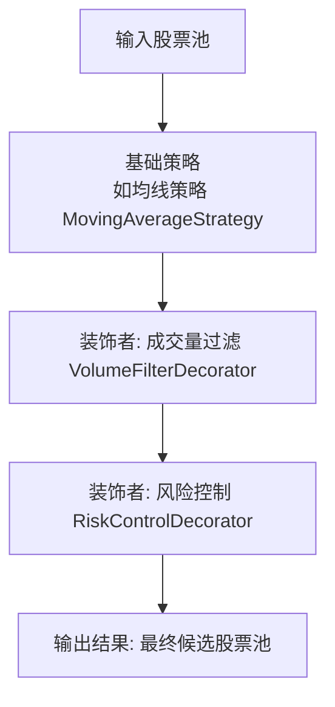
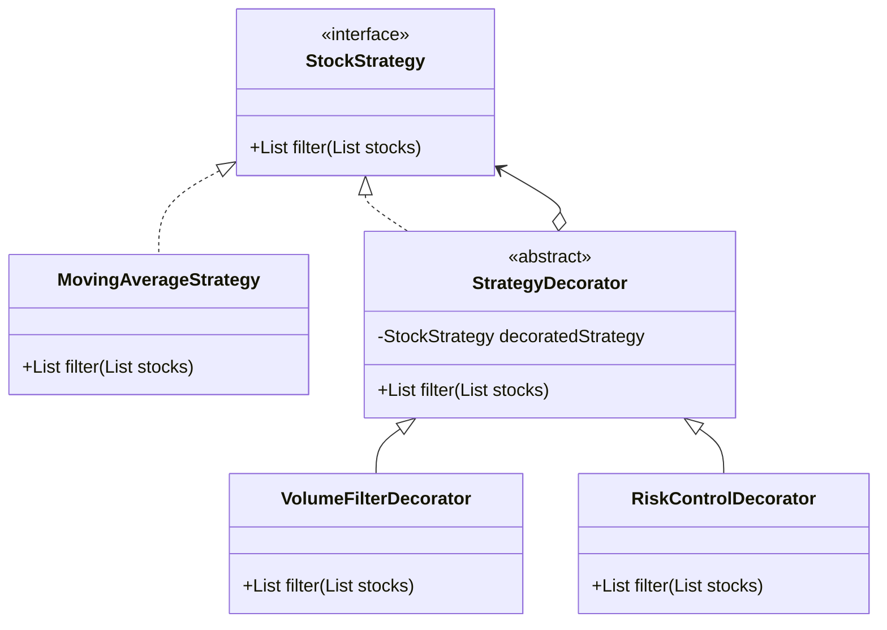

## 装饰者模式实现


​	本质上策略模块（比如均线策略、动量策略、基本面因子策略等）特别适合用 **装饰者模式**，因为**策略往往需要在基础逻辑上不断叠加新的规则、过滤器或者风险控制条件**。


### 为什么要用装饰者模式？

1. **策略可组合**：你可能先跑一个均线选股，再叠加成交量过滤，再加风险控制。**装饰者模式允许策略像积木一样组合**。
2. **解耦策略扩展**：**新增策略无需改动已有策略代码，只需要新建一个装饰类即可**。
3. **动态增强**：运行时，**可以按配置文件/数据库参数决定是否加某个策略过滤器**，而不是写死在代码里。


### 策略模块流程图



### 架构设计思路


#### 1. 定义核心策略接口

```java
public interface StockStrategy {
    List<Stock> filter(List<Stock> stocks);
}
```

#### 2. 实现基础策略

> 比如：均线策略

```java
@Component
public class MovingAverageStrategy implements StockStrategy {
    @Override
    public List<Stock> filter(List<Stock> stocks) {
        // 过滤掉不满足均线条件的股票
        return stocks.stream()
                     .filter(stock -> stock.getPrice() > stock.getMovingAverage(20))
                     .toList();
    }
}
```

#### 3. 定义装饰者抽象类

```java
public abstract class StrategyDecorator implements StockStrategy {
    protected final StockStrategy decoratedStrategy;

    protected StrategyDecorator(StockStrategy decoratedStrategy) {
        this.decoratedStrategy = decoratedStrategy;
    }

    @Override
    public List<Stock> filter(List<Stock> stocks) {
        return decoratedStrategy.filter(stocks);
    }
}
```

#### 4. 编写具体装饰者

> 例如：成交量过滤策略

```java
public class VolumeFilterDecorator extends StrategyDecorator {
    public VolumeFilterDecorator(StockStrategy decoratedStrategy) {
        super(decoratedStrategy);
    }

    @Override
    public List<Stock> filter(List<Stock> stocks) {
        List<Stock> baseFiltered = super.filter(stocks);
        return baseFiltered.stream()
                           .filter(stock -> stock.getVolume() > 1_000_000)
                           .toList();
    }
}
```

> 风险控制过滤：

```java
public class RiskControlDecorator extends StrategyDecorator {
    public RiskControlDecorator(StockStrategy decoratedStrategy) {
        super(decoratedStrategy);
    }

    @Override
    public List<Stock> filter(List<Stock> stocks) {
        List<Stock> baseFiltered = super.filter(stocks);
        return baseFiltered.stream()
                           .filter(stock -> stock.getVolatility() < 0.05)
                           .toList();
    }
}
```


### 动态组合(SpringBoot)

>可以通过配置文件或者数据库开关开控制那些策略生效

```java
@Configuration
public class StrategyConfig {
    @Bean
    public StockStrategy stockStrategy(MovingAverageStrategy maStrategy) {
        // 可以通过配置来灵活组合
        StockStrategy strategy = maStrategy;
        strategy = new VolumeFilterDecorator(strategy);
        strategy = new RiskControlDecorator(strategy);
        return strategy;
    }
}
```

>这样在Service层调用时：

```java
@Service
public class StockSelectionService {
    private final StockStrategy stockStrategy;

    public StockSelectionService(StockStrategy stockStrategy) {
        this.stockStrategy = stockStrategy;
    }

    public List<Stock> select(List<Stock> allStocks) {
        return stockStrategy.filter(allStocks);
    }
}
```


### 分布式微服务扩展


1. **策略微服务化**：每个大类策略可以独立成服务、通过`gRPC/REST`提供过滤接口；装饰者模式只在调用端组合。
2. **策略注册中心**：策略元数据(策略名、顺序、参数)放在配置中心(`Nacos`),由服务动态装配策略链。
3. **高性能**：大批量行情数据可用Kafka + 线程池做并行策略执行，策略组合依然保持解耦。


### 总结

装饰者模式可以帮你把`策略的组合逻辑`和`策略的具体实现`解耦，让策略像积木一样拼接，特别适合这种量化选股系统，既能在`Spring Boot`里优雅实现，又能未来扩展到分布式。


### 结构图

>装饰者模式在策略模块里的结构图




###  装饰者模式适用的场景

- **策略叠加**：比如「均线 → 成交量 → 风险控制 → 行业限制」这种 pipeline 样式，就特别适合装饰者，像积木一样拼接。
- **动态扩展**：策略可能来自配置中心，运行时决定加不加。装饰者天生支持链式组合。
- **解耦**：每个过滤逻辑都在单独的类里，不用写到一个大策略类里面。

这种情况下，用装饰者模式几乎是最自然的选择。

------

### 🚫 装饰者模式不太合适的情况

- **策略互斥**：比如只能选一个策略（均线策略 vs 动量策略），这种时候更合适用 **策略模式（Strategy Pattern）** 来替换，而不是装饰者。
- **复杂决策树**：如果策略之间不是简单叠加，而是「如果 A 不通过就去执行 B，否则执行 C」，那其实是 **责任链模式（Chain of Responsibility）** 更贴切。
- **需要并行计算**：量化里有时候策略是并行计算，然后结果综合（比如打分模型），这就更像 **组合模式（Composite Pattern）**。


>总结

- **装饰者模式**：最适合叠加式策略模块，尤其是“过滤/筛选”型逻辑。
- **策略模式**：适合选择一个“算法”来跑（互斥逻辑）。
- **责任链模式**：适合条件分支、逐个尝试的场景。
- **组合模式**：适合并行计算、打分汇总的场景。

👉 所以你的量化选股系统，如果核心是 **逐层过滤股票池**，那装饰者模式是非常优雅的方案，可以说是“最佳实践”。
 但如果你后面要搞 **多因子打分、机器学习模型融合**，那可能要换 **组合模式 / 策略模式**。

------

要不要我帮你整理一份 **“量化选股系统常见设计模式应用对照表”**（表格形式，带上场景和推荐模式），这样你就能在面试时灵活切换回答？


## 多组合设计模式


**多模式融合的策略模块架构流程图**，用 Mermaid 格式，重点体现 **策略模式 + 装饰者模式 + 模板方法**

```mermaid
flowchart TD
    subgraph TemplateMethod["模板方法模式: 选股流程"]
        direction TB
        A[数据准备]
        B[核心策略选择 (策略模式)]
        C[风控过滤 (装饰者模式)]
        D[输出候选股票池]
    end

    subgraph StrategySelection["策略模式: 核心策略选择"]
        direction TB
        B1[均线策略]
        B2[动量策略]
        B3[基本面策略]
    end

    subgraph DecoratorChain["装饰者模式: 风控过滤链"]
        direction TB
        C1[成交量过滤]
        C2[风险控制]
        C3[行业限制]
    end

    A --> B
    B --> C
    C --> D

    B --> B1
    B --> B2
    B --> B3

    C --> C1
    C1 --> C2
    C2 --> C3
```


明白了，小李 😄，你想的不是去写多个策略，而是先用一个策略的实现来 **搭建策略模块的基础框架**，并且框架要能支持多种策略以后扩展。

我帮你规划一个 **最适合量化选股系统策略模块的框架**，用策略模式作为核心，并保证后续能灵活扩展。

------

## 1️⃣ 核心思路

策略模块的基础框架应该满足几个条件：

1. **解耦** — 策略逻辑与流程分离。
2. **可扩展** — 可以添加不同策略（龙二、均线、动量等）而不改核心框架。
3. **统一调用** — 上层调用者只需知道策略接口，不关心具体实现。
4. **可组合** — 将来能用装饰者模式叠加过滤、风控。

因此最合适的设计模式是 **策略模式 + 模板方法**，作为骨架。
 装饰者模式可以作为后续的增强层。

------

## 2️⃣ 基础框架结构

### **(1) 策略接口**

```java
public interface StockStrategy {
    List<Stock> selectStocks(LocalDate tradeDate, StrategyContext context);
}
```

### **(2) 模板方法**

```java
public abstract class AbstractStrategyTemplate implements StockStrategy {
    @Override
    public List<Stock> selectStocks(LocalDate tradeDate, StrategyContext context) {
        prepareData(context); // 数据准备
        List<Stock> selected = doSelect(tradeDate, context); // 核心策略
        return postProcess(selected, context); // 风控、过滤
    }

    protected abstract void prepareData(StrategyContext context);

    protected abstract List<Stock> doSelect(LocalDate tradeDate, StrategyContext context);

    protected List<Stock> postProcess(List<Stock> stocks, StrategyContext context) {
        return stocks; // 默认不做处理，后续可用装饰者增强
    }
}
```

### **(3) 策略上下文**

```java
public class StrategyContext {
    private Map<LocalDate, List<Stock>> limitUpStocks; // 当日涨停股票
    private Map<String, List<Stock>> topicStocksMap;   // 题材库数据
    private Map<String, Object> extraData;             // 扩展数据

    // getter/setter
}
```

------

## 3️⃣ 龙二战法策略实现（用于搭建框架）

```java
public class LongTwoStrategy extends AbstractStrategyTemplate {

    @Override
    protected void prepareData(StrategyContext context) {
        // 数据准备：查询题材库、涨停股票、分时数据等
    }

    @Override
    protected List<Stock> doSelect(LocalDate tradeDate, StrategyContext context) {
        // 核心龙二选股逻辑
        List<Stock> candidates = new ArrayList<>();
        // TODO: 实现你描述的龙二战法逻辑
        return candidates;
    }
}
```

------

## 4️⃣ 策略模块调用入口

```java
@Service
public class StockSelectionService {

    private final StockStrategy stockStrategy;

    public StockSelectionService(LongTwoStrategy longTwoStrategy) {
        this.stockStrategy = longTwoStrategy; // 可替换成其他策略
    }

    public List<Stock> execute(LocalDate tradeDate, StrategyContext context) {
        return stockStrategy.selectStocks(tradeDate, context);
    }
}
```

------

## 5️⃣ 框架特点

| 特性           | 说明                                   |
| -------------- | -------------------------------------- |
| **策略模式**   | 不同策略实现同一个接口，可动态替换     |
| **模板方法**   | 固定选股流程，策略只实现核心步骤       |
| **策略上下文** | 统一存储数据，策略逻辑只处理业务       |
| **可扩展**     | 未来可加更多策略（均线、动量、基本面） |
| **可增强**     | 通过装饰者模式做风控过滤               |

------

## 6️⃣ 推荐模式组合

这个框架可以后续组合使用：

- **策略模式**：切换不同选股算法。
- **模板方法**：固定选股流程。
- **装饰者模式**：风控过滤。
- **组合模式**：多策略并行执行并融合结果。
- **职责链模式**：策略优先级与替换。

------

📌 小李，这样你用一个 **龙二战法策略** 就能先搭建出整个策略模块的基础框架，并且框架天然支持未来扩展到其他策略。

如果你愿意，我可以帮你画一个 **Mermaid 流程 + 类图**，直观看出这个基础框架的结构，这样你直接拿去做模块设计说明。

要帮你画这个图吗？


