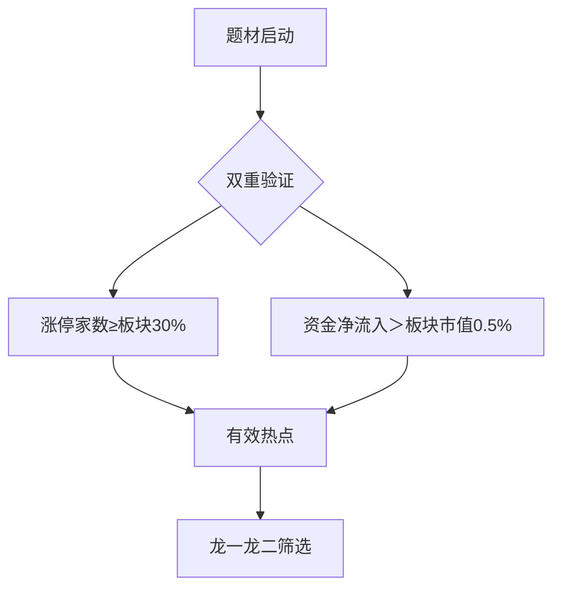
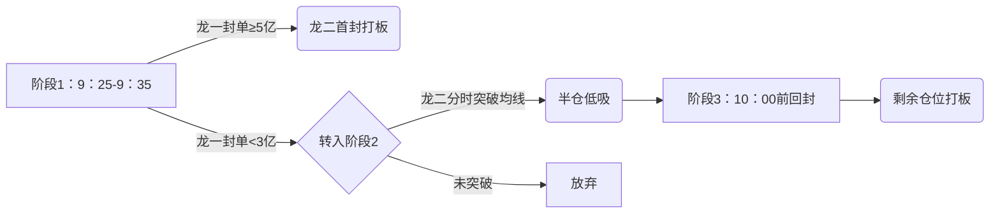
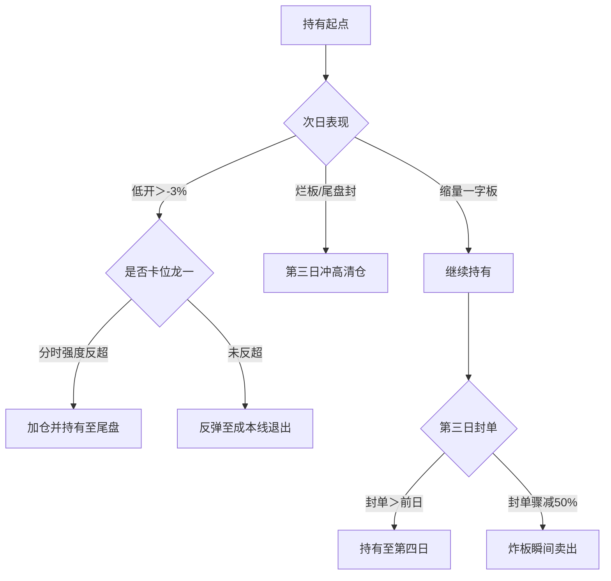

# 策略库


## 打板


### 一、龙二战法


#### 1.策略核心逻辑


#### 题材热度判定




- 剔除“假热点”：需同时满足 **涨停占比≥30%+主力净流入＞5千万**
- 增加 **题材梯队完整性**验证：需有3只以上跟风股（涨幅＞7%但未涨停）


##### 龙一定义

- 空间引领性：率先突破关键压力位(前高/平台)

- 资金号召力：涨停时带动>=2只同题材股冲板

- 身份正统性：题材相关业务收入占比 > 30%(避免蹭热点)

- 封单质量：封单额 > 流通市值1.5%(注册制新规基准)

  


##### 龙二选择三维模型

```python
# 龙二评分公式（满分10分）
龙二得分 = 涨停时间系数*4 + 封单质量系数*3 + 卡位潜力系数*3

# 系数计算：
涨停时间系数 = max(0, 1 - (涨停时间 - 龙一时间)/10)  # 10分钟内满分
封单质量系数 = min(1, 封单额/龙一封单额)          # 达龙一80%得满分
卡位潜力系数 = (市值比 + 机构持仓差) / 2          # 市值比=龙二市值/龙一市值(<0.8优)
```


### 二、动态买入触发机制（避免无脑打板）

#### 1. **次日开盘三大观察点**

| 观察指标 | 达标信号              | 操作意义       |
| :------- | :-------------------- | :------------- |
| 龙一竞价 | 封单＞昨日80%且未撤单 | 题材持续性确认 |
| 龙二量比 | ＞3.0且开盘涨幅2%-5%  | 弱转强潜在信号 |
| 板块助攻 | 首只跟风股5分钟内冲板 | 资金认可度强化 |

#### 2. **分时买入三阶法**




------

### 三、持有周期决策树（取代固定三日）




------

### 四、风险控制三重防火墙

#### 1. **事前过滤（20%无效交易）**

- **龙一封单陷阱**：若龙一封单额＜流通市值0.8%，放弃整个题材
- **龙二身份存疑**：近1月有减持/监管函，立即排除
- **大盘环境**：上证指数＜20日均线且量能＜8000亿，停止操作

#### 2. **事中熔断**

- 买入后30分钟内未封板 → 回落至+5%时止损
- 龙一炸板且未回封 → 龙二立即卖出（无论盈亏）

#### 3. **事后复盘**

```python
# 失败交易归因模板
if 亏损原因 == '题材退潮':
    改进方案 = '要求首日梯队≥5股'
elif 亏损原因 == '卡位失败':
    改进方案 = '增加机构持仓差指标（龙二机构持仓<龙一）'
elif 亏损原因 == '大盘拖累':
    改进方案 = '加入沪深300期货贴水监控'
```

------

### 五、收益增强策略（提升三连板概率）

#### 1. **龙二转龙一识别器**

当出现以下信号时，龙二可能晋级：

- 龙一特停公告发布
- 龙二早盘竞价量＞龙一历史最大量
- 板块中军股（如长江电力）突破平台

#### 2. **机构共振加持**

```python
# 龙虎榜数据应用
if 龙二三日榜出现:
    机构净买入＞游资买入 and 买五占比＜40%:
        持有周期延长至5日
    量化席位占比＞30%:
        次日冲高6%即止盈（量化砸盘规律）
```

#### 3. **周期定位法则**

| 情绪周期 | 龙二操作策略           | 案例            |
| :------- | :--------------------- | :-------------- |
| 启动期   | 只做最早涨停龙二       | 2023.1新能源车  |
| 发酵期   | 重点做中市值容量龙二   | 2023.4 AI服务器 |
| 高潮期   | 放弃龙二，转做补涨首板 | 2024.2 Sora概念 |
| 退潮期   | 禁止操作龙二           | 2023.8 券商行情 |

------

### 六、量化验证指标（回测需监控）

| 指标             | 健康值  | 优化方向         |
| :--------------- | :------ | :--------------- |
| 龙二晋级龙一概率 | ＞18%   | 叠加机构调研因子 |
| 三连板实现率     | ＞35%   | 结合情绪周期择时 |
| 卡位失败平均亏损 | ＜-4.5% | 优化分时卖出点   |
| 首封打板成功率   | ＞75%   | 强化封单质量过滤 |

------

### 终极优化建议：

1. **龙二基因库建设**

   - 回溯近3年所有龙二案例（如2022中通客车的特力A）
   - 提取共同特征：市值中位数38亿/机构持仓＜8%/启动前换手＜2%

2. **黑天鹅预警模块**

   ```python
   # 龙二持股期间监控
   def risk_monitor(code):
       同花顺问财实时扫描(f'{code} 减持 监管 诉讼 业绩预告')
       若触发关键词 and 股价跳水＞3%:
           立即卖出
   ```

3. **通道优势替代方案**

   - 利用L2数据捕捉 **涨停前30秒异动**：

     ```python
     if 买一剩余量骤降80% and 近3秒大单＞日均值10倍:
         提前挂涨停价买入（比普通用户快5秒）
     ```

> **策略本质**：龙二战法不是跟风套利，而是对 **“龙一替补席”的价值重估**。当您能通过数据证明：在电力板块中，符合「市值＜50亿+机构持仓差＞15%+龙一封单＞3亿」的龙二，三连板概率达42%时——您已掌握破局之钥。


