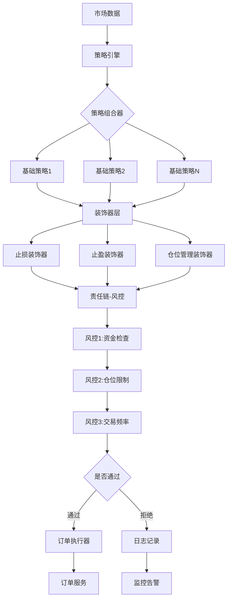
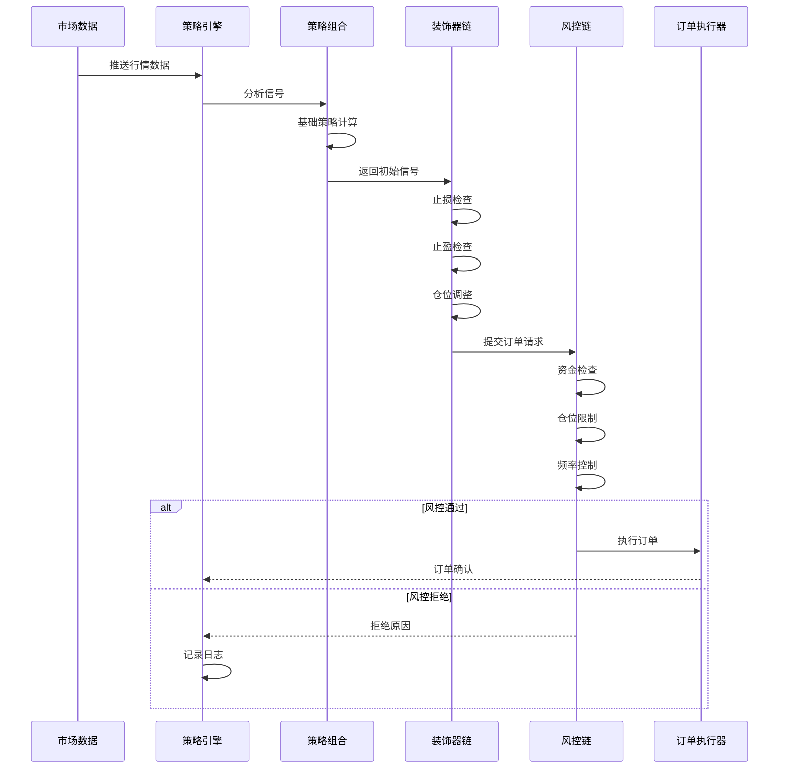

# 策略模块架构设计

设计一个灵活、可扩展的策略模块架构，融合多种设计模式。


### 核心设计模式组合：

1. **策略模式**：定义不同的交易策略
2. **装饰器模式**：策略叠加和增强
3. **模板模式**：统一策略执行流程
4. **责任链模式**：风控检查链
5. **工厂模式**：策略创建
6. **观察者模式**：事件通知


## 二、架构流程图



## 三、时序图

>执行时序图



## 四、项目架构


```txt
strategy-service/
├── src/main/java/com/trading/strategy/
│   ├── core/                          # 核心接口
│   │   ├── Strategy.java              # 策略接口
│   │   ├── StrategyContext.java       # 策略上下文
│   │   ├── Signal.java                # 交易信号
│   │   └── MarketData.java            # 市场数据
│   ├── template/                      # 模板模式
│   │   └── AbstractStrategy.java      # 抽象策略模板
│   ├── strategies/                    # 具体策略实现
│   │   ├── MaStrategy.java            # 均线策略
│   │   ├── MacdStrategy.java          # MACD策略
│   │   └── BollingerStrategy.java     # 布林带策略
│   ├── decorator/                     # 装饰器模式
│   │   ├── StrategyDecorator.java     # 策略装饰器抽象类
│   │   ├── StopLossDecorator.java     # 止损装饰器
│   │   ├── TakeProfitDecorator.java   # 止盈装饰器
│   │   └── PositionSizeDecorator.java # 仓位管理装饰器
│   ├── composite/                     # 组合模式
│   │   └── CompositeStrategy.java     # 组合策略
│   ├── chain/                         # 责任链模式
│   │   ├── RiskFilter.java            # 风控过滤器接口
│   │   ├── FundCheckFilter.java       # 资金检查
│   │   ├── PositionLimitFilter.java   # 仓位限制
│   │   └── FrequencyLimitFilter.java  # 频率限制
│   ├── factory/                       # 工厂模式
│   │   ├── StrategyFactory.java       # 策略工厂
│   │   └── StrategyConfig.java        # 策略配置
│   ├── engine/                        # 策略引擎
│   │   ├── StrategyEngine.java        # 引擎主类
│   │   └── StrategyExecutor.java      # 策略执行器
│   ├── event/                         # 观察者模式
│   │   ├── StrategyEvent.java         # 策略事件
│   │   └── StrategyEventListener.java # 事件监听器
│   └── config/                        # 配置
│       └── StrategyConfiguration.java
```


## 五、核心代码


### 1.核心接口定义

```java
package com.trading.strategy.core;

import lombok.Data;
import java.math.BigDecimal;
import java.time.LocalDateTime;

/**
 * 交易信号
 */
@Data
public class Signal {
    public enum SignalType {
        BUY,      // 买入
        SELL,     // 卖出
        HOLD,     // 持有
        CLOSE     // 平仓
    }
    
    private String symbol;                // 交易标的
    private SignalType type;              // 信号类型
    private BigDecimal price;             // 建议价格
    private BigDecimal quantity;          // 建议数量
    private Integer confidence;           // 信号强度(0-100)
    private String strategyName;          // 策略名称
    private LocalDateTime timestamp;      // 时间戳
    private String reason;                // 信号原因
    
    public static Signal hold(String symbol) {
        Signal signal = new Signal();
        signal.setSymbol(symbol);
        signal.setType(SignalType.HOLD);
        signal.setTimestamp(LocalDateTime.now());
        return signal;
    }
}
```


### 


