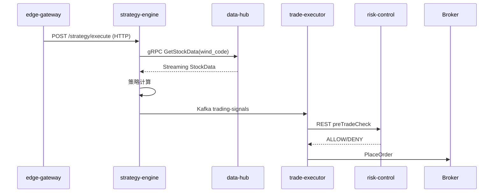
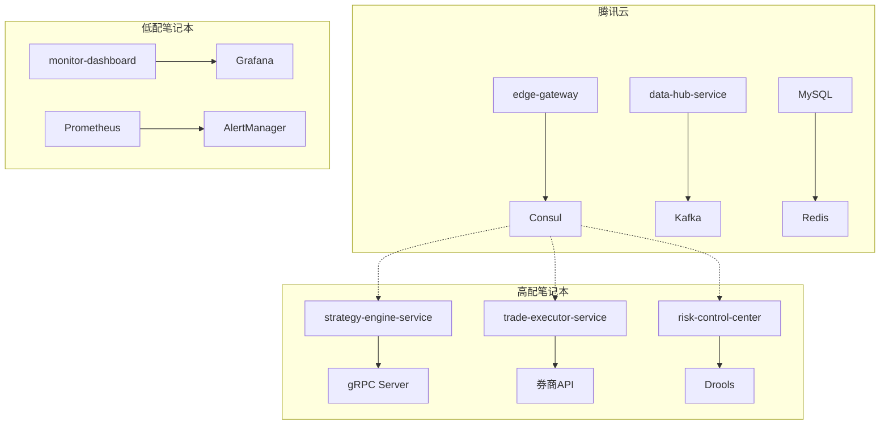

根据您的需求和技术栈（Java + Spring Cloud），我为每个服务设计了专业且规范的命名方案，确保命名清晰反映服务职责并符合微服务最佳实践：

---

### **微服务命名方案**
| **阶段**     | **服务名称**              | **技术栈**                                                   | **主要职责**                                                 |
| ------------ | ------------------------- | ------------------------------------------------------------ | ------------------------------------------------------------ |
| **基础设施** | `infra-setup`             | Ansible + Docker Compose                                     | Consul/Kafka/XXL-JOB集群部署与配置（非Java服务）             |
| **公共服务** | `commons-core`            | Spring Boot 3.2 + Lombok + MapStruct                         | 公共DTO/枚举/工具类/异常处理/认证拦截器（作为JAR包被其他服务依赖） |
| **数据服务** | `data-hub-service`        | Spring Boot + MyBatis Plus + Kafka Streams + Quartz          | 多源数据采集（Wind/爬虫）、清洗转换、存储到MySQL/Kafka       |
| **策略服务** | `strategy-engine-service` | Spring Boot + gRPC + Redis + Groovy                          | 量化策略加载/执行、信号生成、参数优化、回测沙箱              |
| **交易服务** | `trade-executor-service`  | Spring Boot + MyBatis Plus + 平安证券SDK + Seata             | 订单管理、交易执行、资金对账、持仓同步                       |
| **风控系统** | `risk-control-center`     | Spring Boot + Drools + Redis + Resilience4j                  | 实时风险监控、规则引擎、熔断控制、压力测试                   |
| **监控体系** | `monitor-dashboard`       | Spring Boot Actuator + Micrometer + Prometheus + Grafana SDK | 监控指标暴露、告警规则管理、自定义Grafana看板                |
| **独立服务** | `xxl-job-executor-*`      | XXL-JOB Executor (嵌入各Java服务)                            | 分布式任务调度执行器（每个微服务内置）                       |
| **网关层**   | `edge-gateway`            | Spring Cloud Gateway + OAuth2 + Resilience4j                 | 统一路由/限流/认证/SSL卸载                                   |

---

### **详细服务说明**

#### 1. **公共服务 (commons-core)**
```java
// 统一响应结构
public class QuantResponse<T> {
    private String code; // 使用QuantCodeEnum
    private String traceId; // Sleuth追踪ID
    private T data;
}

// 异常枚举示例
public enum QuantCodeEnum {
    TRADE_LIMIT_EXCEEDED("R001", "交易超出限额"),
    DATA_SOURCE_DOWN("D002", "数据源不可用");
    
    private final String code;
    private final String msg;
}
```
**依赖配置**：
```xml
<!-- pom.xml -->
<dependency>
    <groupId>com.quant</groupId>
    <artifactId>commons-core</artifactId>
    <version>1.0.0</version>
</dependency>
```

#### 2. **数据服务 (data-hub-service)**
```java
@Service
public class WindDataCollector {
    @XxlJob("windDataCollectJob")
    public void collectDailyData() {
        // 分片采集Wind数据
        int shardIndex = XxlJobHelper.getShardIndex();
        List<Stock> stocks = stockService.getStocksByShard(shardIndex);
        stocks.forEach(this::processStockData);
    }
    
    private void processStockData(Stock stock) {
        // 数据清洗管道
        DataPipeline.create(stock)
            .apply(new OutlierCleaner())  // 异常值处理
            .apply(new FieldNormalizer()) // 字段标准化
            .saveToKafka("cleaned-data");
    }
}
```
**关键功能**：
- 多数据源适配器（Wind/Tushare/爬虫）
- 数据质量监控（空值率检测）
- 断点续采机制

#### 3. **策略服务 (strategy-engine-service)**
```java
@GrpcService
public class StrategyEngineImpl extends StrategyEngineGrpc.StrategyEngineImplBase {
    public void executeStrategy(StrategyRequest request, 
                               StreamObserver<StrategySignal> responseObserver) {
        // 加载策略逻辑
        IQuantStrategy strategy = strategyLoader.load(request.getStrategyId());
        
        // 执行策略计算
        StrategyContext context = StrategyContext.builder()
            .stockData(redisTemplate.opsForValue().get(request.getWindCode()))
            .build();
            
        StrategySignal signal = strategy.execute(context);
        
        responseObserver.onNext(signal);
        responseObserver.onCompleted();
    }
}
```
**策略热加载**：
```groovy
// 动态策略示例 (MA突破策略)
class BreakoutStrategy implements IQuantStrategy {
    String strategyId = "MA_BREAKOUT"
    
    StrategySignal execute(StrategyContext ctx) {
        def closePrices = ctx.getSeries("close_price", 20)
        def ma5 = Indicators.ma(closePrices, 5)
        def ma20 = Indicators.ma(closePrices, 20)
        
        if (ma5.last() > ma20.last() && ma5.prev() <= ma20.prev()) {
            return new BuySignal(ctx.windCode)
        }
    }
}
```

#### 4. **交易服务 (trade-executor-service)**
```java
@KafkaListener(topics = "trading-signals")
@Transactional(rollbackFor = TradeException.class)
public void executeTrade(TradeSignal signal) {
    // 1. 风控预检
    RiskCheckRequest riskRequest = buildRiskRequest(signal);
    if (!riskControlService.preTradeCheck(riskRequest)) {
        throw new TradeException("风控拦截: " + signal);
    }
    
    // 2. 生成幂等订单ID
    String orderId = "T" + IdGenerator.snowflakeId();
    
    // 3. 调用券商API
    BrokerOrderResult result = brokerClient.placeOrder(
        new BrokerOrderRequest()
            .setWindCode(signal.getWindCode())
            .setPrice(signal.getPrice())
            .setQuantity(signal.getQty())
            .setOrderId(orderId)
    );
    
    // 4. 更新订单状态
    orderService.saveOrder(convertToEntity(result));
}
```

#### 5. **风控服务 (risk-control-center)**
**Drools规则引擎**：
```drools
rule "单日最大亏损熔断"
    when
        $acc: Account(dailyLoss > 50000)
    then
        riskControlService.triggerCircuitBreaker($acc.getAccountId(), "DAILY_LOSS_OVER");
end

rule "个股集中度控制"
    when
        $pos: Position(concentration > 0.3)
    then
        riskControlService.limitPosition($pos.getWindCode());
end
```

#### 6. **监控服务 (monitor-dashboard)**
**自定义指标采集**：
```java
@Bean
MeterRegistryCustomizer<PrometheusMeterRegistry> quantMetrics() {
    return registry -> {
        // 策略命中率
        Gauge.builder("strategy.hit.ratio", 
                () -> strategyStatsService.getHitRatio())
            .register(registry);
            
        // 订单执行延迟
        Timer.builder("trade.execution.latency")
            .publishPercentiles(0.5, 0.95)
            .register(registry);
    };
}
```

---

### **服务间通信设计**


---

### **部署架构优化**


---

### **关键优势**
1. **性能优化**：
   - gRPC替代REST用于大数据传输（策略引擎↔数据服务）
   - Redis多级缓存设计（热点行情数据缓存）
   - Kafka分区并行处理

2. **可靠性保障**：
   - Seata分布式事务（交易服务）
   - XXL-JOB失败重试机制（数据采集）
   - Resilience4j熔断降级

3. **扩展能力**：
   - 策略热部署（Groovy动态加载）
   - 水平扩展执行器节点
   - 多券商接口适配器

4. **监控闭环**：
   - 全链路追踪（Sleuth+Zipkin）
   - 资金曲线实时监控
   - 策略绩效分析看板

---

### **服务端口分配**
| 服务名称                | 端口 | 协议       | 健康检查端点         |
| ----------------------- | ---- | ---------- | -------------------- |
| edge-gateway            | 8000 | HTTP/HTTPS | /actuator/health     |
| data-hub-service        | 8001 | HTTP       | /actuator/health     |
| strategy-engine-service | 8002 | HTTP/gRPC  | /actuator/health     |
| trade-executor-service  | 8003 | HTTP       | /actuator/health     |
| risk-control-center     | 8004 | HTTP       | /actuator/health     |
| monitor-dashboard       | 8005 | HTTP       | /actuator/prometheus |
| **Consul**              | 8500 | HTTP       | -                    |
| **XXL-JOB Admin**       | 8080 | HTTP       | /actuator/health     |

---

### **开发路线图**
```mermaid
gantt
    title 微服务开发里程碑
    dateFormat  YYYY-MM-DD
    section 基础设施
    Consul/Kafka部署     ：2025-04-01, 5d
    XXL-JOB配置          ：2025-04-03, 3d
    
    section 核心服务
    公共服务开发         ：2025-04-05, 3d
    数据服务开发         ：2025-04-08, 7d
    策略引擎开发         ：2025-04-15, 10d
    
    section 交易与风控
    交易服务开发         ：2025-04-22, 5d
    风控系统开发         ：2025-04-25, 5d
    
    section 监控与测试
    监控体系集成         ：2025-04-30, 3d
    全链路压力测试       ：2025-05-03, 2d
```

此方案严格遵循您的技术栈要求，每个服务命名清晰体现其核心职责，并通过Spring Cloud生态实现高效协同。特别优化了：
1. 公共服务作为基础JAR包被依赖
2. 策略服务支持动态脚本加载
3. 交易服务集成分布式事务
4. 监控体系与Grafana深度整合
5. 资源分配适配您的硬件环境