## 项目

> 项目整体架构 & 模块交互

你的项目是 **量化选股系统**，从面试官角度看，需要先建立一个清晰的“地图”：

1. **数据采集与存储模块**
   - **做什么**：采集行情数据（股票K线、因子数据），存到 MySQL + Redis。
   - **交互**：通过 Kafka 接收外部推送的行情 → 异步写入数据库 → 热数据写入 Redis，冷数据落 MySQL。
2. **因子计算模块**
   - **做什么**：对原始行情数据计算技术因子、财务因子。
   - **交互**：订阅 Kafka 行情 → 批处理/流式计算 → 计算结果回写 MySQL/Redis。
3. **选股模块**
   - **做什么**：根据用户自定义的因子组合进行筛选。
   - **交互**：调用因子库 → 批量筛选 → 返回候选股票列表。
4. **策略与回测模块**
   - **做什么**：基于历史行情数据对用户策略进行回测，输出收益率、最大回撤等指标。
   - **交互**：读取历史行情 + 策略配置 → 回测引擎执行 → Kafka 写入日志/结果 → Redis 缓存结果 → 返回用户。
5. **风控模块**
   - **做什么**：仓位管理、止损止盈验证。
   - **交互**：回测/实盘下单前拦截策略 → 验证风险参数 → Kafka 推送风控日志。
6. **公共 Base 模块**
   - **做什么**：统一的工具类、权限认证、日志采集。
   - **交互**：所有服务依赖 Base 模块。
7. **微服务治理**
   - **Nacos**：服务注册发现 + 配置中心。
   - **Feign**：模块间的服务调用。
   - **Sentinel**：熔断、限流、降级，保障核心链路。


>我在量化选股系统里主要负责数据模块和回测模块。
> 数据模块的难点是行情数据量大、查询频繁，我通过 MySQL+Redis 分层存储，热点数据进 Redis，并引入布隆过滤器解决缓存穿透，同时用分布式锁保证任务幂等性，最终查询性能提升了数十倍。
> 在回测模块中，问题是单策略回测耗时过长，影响并发。我把行情数据预加载到内存，减少 I/O，并通过多线程分片计算加快回测，最终系统吞吐量提升 1.8 倍，延迟降低 40%。
> 同时，我还通过 Kafka 分区和消费组并行处理提升了消息吞吐，用 Sentinel 做熔断限流，避免流量冲击导致系统雪崩。整体效果是系统在高并发场景下，仍能稳定支撑原有吞吐量的 1.5 倍。


经过一系列优化后，我们系统整体吞吐量提升了 **约 1.8 倍**，单次响应延迟降低了 **约 40%**。
 主要是通过以下措施实现的：

1. **缓存优化**：引入 **Redis 集群与布隆过滤器，减少数据库访问次数，降低 IO 压力**。
2. **减少资源浪费**：通过**分布式锁控制重复策略任务执行，并保证任务的幂等性**。
3. **稳定性保障**：结合 Sentinel，实现**对不稳定服务的熔断、对有限资源接口的限流**，提升系统稳定性。
4. **索引与表结构优化**：对热点表建立覆盖索引，按业务分表，减少全表扫描；**将核心查询从约 2.5s 优化至约 60ms**。
5. **Kafka 消息处理优化**：
   1. 生产端采用**IO密集型线程池批量异步**发送；
   2. 消费端进行**并发与分区**消费，降低处理延迟。
   3. **在保证幂等、不丢失、不积压的前提下，合理利用 Kafka 削峰填谷**，并将历史行情等数据落表任务错峰（如收盘后）执行。
6. **回测引擎优化**：重复new频次高的对象，在字段明确、类型一致的情况，直接使用数组，例如多指标id对象，少new对象，少用包装累多用基础数据类型，减少堆上分配内存次数，进一步降低G1年轻代GC复制算法等执行开销，提高单任务处理效率。


## 优化数值

经过一系列优化后，我们系统整体吞吐量提升了 **约 1.8 倍**，单次响应延迟降低了 **约 40%**。
 这是通过以下措施实现的：

1. **缓存优化**：引入 Redis 集群与布隆过滤器，减少数据库访问次数，降低 IO 压力。
2. **索引与表结构优化**：对热点表建立覆盖索引，按业务分表，减少全表扫描，将核心查询语句从最开始的2.5S到最后的60ms左右。
3. **Kafka 消息处理优化**：采用批量异步发送、消费端并发消费与分区消费，减少消息处理延迟。
4. **回测引擎优化**：对象池化、向量化计算、减少 GC 开销，提高单任务处理效率。

>吞吐量提升 1.8 倍： 我们通过压测工具对核心业务场景进行对比，测量优化前后的 TPS（Transactions Per Second）。优化前5000，优化后9000。80% (1.8 倍)。 响应延迟降低 40%： 在压测过程中，我们对核心接口（如调度、执行因子等）进行了延迟监控。优化前平均响应时间约 500ms，优化后约 300ms，降低约 40%。


## 数据流转

> 我们的实时行情数据流转主要分为三个阶段：数据采集 → 消息推送 → 数据消费与落库。

1. **数据采集**
    实时行情数据由行情网关（Speed 等）接收，数据量较大且频繁，属于 **IO 密集型**。为了提升吞吐，我们使用 **IO 密集型线程池**进行批量处理，将数据按时间窗口整合。
2. **消息推送**
    每秒约 **5400 条行情数据**（平均消息大小约 1KB）被批量发送给 Kafka 集群。
   - Kafka 生产者端优化：`batch.size`、`linger.ms` 结合使用，实现批量发送减少网络开销。
   - 生产者异步发送，保证高吞吐、低延迟。
   - Kafka 负责高可用存储与消息持久化，支持订阅和回溯消费。
3. **数据消费**
   - 策略、风控等业务模块作为 Kafka 消费者实时订阅行情数据，进行策略计算、选股决策和风控验证。
   - 消费模式采用 **异步并发消费 + 分区消费**，保证高吞吐且不影响实时性。
4. **落库存储**
   - 每日交易结束（约 15:00）后，后台批量消费 Kafka 当天的数据，将其落库到 MySQL 行情表中，便于历史查询与回测。
   - 对历史数据采用 **分表/分区**策略优化查询性能，同时结合 Redis 缓存提升热点数据访问效率。


| 数据类型                                          | 实时性要求       | 数据流转路径                                                 | 说明                                                         |
| ------------------------------------------------- | ---------------- | ------------------------------------------------------------ | ------------------------------------------------------------ |
| **实时行情数据**（如逐笔 tick 数据、分秒级 K 线） | 高（毫秒级延迟） | 外部行情源 → Kafka → 策略模块 / Redis 缓存 → MySQL 批量落库  | 因为实时性要求高，不适合直接写 MySQL，会造成延迟，所以通过 Kafka 解耦；策略直接订阅 Kafka 流，最新数据放 Redis 提供快速查询；历史数据批量落 MySQL |
| **低频行情数据**（如日线、周线）                  | 低               | 外部行情源 → Kafka → MySQL（批量写入） → Redis（热点数据缓存） | 这种数据量小，延迟要求低，可以先落 MySQL，查询时再缓存热点数据到 Redis |
| **因子数据**                                      | 中等             | 外部行情源 / 历史行情 → Kafka → 因子计算模块 → MySQL / Redis | 因子计算需要结合历史数据做批处理，结果写到 MySQL 做存储，热因子结果缓存到 Redis |


在交易日交易时间批量写入 MySQL，InnoDB 存储引擎是行级锁，不会完全阻塞读取，但批量插入会占用较多的 IO 和事务资源，可能导致读性能下降，特别是当表有大量索引时。
 因此在交易时间建议避免大批量写入，最好在非交易时段执行，或者通过分区表、异步写、批处理等方式减少对线上读取的影响。


## 亮点


### MySQL历史行情表优化

>在我们系统的历史行情表里，最初单表超过 1 亿条记录，查询耗时在 **3~4 秒**。
>
>- **第一步**，通过 **按月分表**，单表数据量控制在约 3000 万，单股按月查询性能提升到 **200ms** 左右。
>- **第二步**，在分表的基础上设计 **联合索引（wind_code, trade_date）** 并增加 **覆盖索引**，避免回表，单股按月查询进一步优化到 **60ms**。
>- **第三步（规划中）**，针对 **热数据和冷数据的不同访问特征**，考虑使用 **冷热分离** 策略：最近三个月数据保留在 MySQL 表中，支持高频查询；更早的历史数据迁移到更适合存储大规模数据的系统（如 **Elasticsearch/ClickHouse/HBase** 等），以降低存储成本，同时还能兼顾复杂分析需求。


### 分布式锁防止任务重复执行造成资源不合理消耗


### 布隆过滤器解决雪崩


## 实践


**Redis + 布隆过滤器防缓存穿透 Demo**

- 模拟查询股票代码，不存在时直接拦截。

**回测引擎并行计算 Demo**

- 用 Java 多线程对一段历史数据计算指标，对比单线程和线程池版本的耗时。


## kafka推送实时行情数据


#### 防止消息丢失

```yaml
      # 消息可靠性相关
      acks: all                          # 等待所有 ISR 副本确认（最安全，消息不丢）
      retries: 2147483647                # 无限重试（保证 leader 临时挂掉、网络抖动时也不会丢消息）
```


#### 保障幂等性

```yaml
      enable-idempotence: true           # 开启幂等性，避免重试时产生重复消息
      max-in-flight-requests-per-connection: 5  # 保证幂等性的同时允许并发（推荐 5）
```


#### 防止消息积压


##### 如何配置 retention

###### **方式一：Broker 全局配置**

编辑 Kafka Broker 的 `server.properties`：

```
log.retention.ms=259200000      # 保留 3 天
log.retention.bytes=-1          # 不按大小删除
log.cleanup.policy=delete       # 删除策略
```

重启 Broker 生效。

###### **方式二：Topic 级别配置**

用 Kafka 管理命令（或 Admin API）单独配置某个 topic：

```
bin/kafka-configs.sh --bootstrap-server localhost:9092 \
  --entity-type topics --entity-name my-topic \
  --alter --add-config retention.ms=259200000
```

这个配置会覆盖 Broker 全局配置，只对该 topic 生效。


###### 总结

Kafka retention 只能在 Broker 或 Topic 层配置，Spring Boot 生产者的 yml 只能配置生产者相关参数，不能设置 retention。


###### 保留天数计算

保留14天

> 即便保留 14 天是合理的，仍建议：

- **监控磁盘占用**，避免磁盘用满导致 broker 停止服务。
- **定期评估消费速度**，确保所有消费组在保留时间内处理完消息。

```
可保留天数 = 可用存储 / 日均数据量
           = 4,000GB / 200GB
           = 20 天
```

⚡ 所以理论上，**如果你磁盘够大，完全可以保留 20 天以上的数据**。


##### 流程图



```mermaid
sequenceDiagram
    participant Producer as 生产者
    participant Broker as Kafka Broker
    participant Consumer as 消费者

    Producer->>Broker: 写入消息到 Topic Partition
    Note right of Broker: 消息按时间顺序追加到 segment 文件
    Broker->>Broker: 创建新的 segment（达到 log.segment.bytes/log.segment.ms）
    Consumer->>Broker: 拉取消息
    Broker->>Consumer: 返回消息
    Note right of Broker: Broker 定期执行 retention 检查(log.retention.check.interval.ms)
    Broker->>Broker: 检查每个 segment 是否过期（log.retention.ms 或 log.retention.bytes）
    alt segment 过期
        Broker->>Broker: 删除该 segment 文件
        Note right of Broker: 释放磁盘空间，防止消息积压
    else segment 未过期
        Broker->>Broker: 保留该 segment
    end
```

Kafka 可以通过 **`log.retention.ms` / `log.retention.bytes`** 配置来控制只保留几天的数据，从而防止消息积压。原理是 Kafka 定期扫描日志 segment，删除超出保留策略的文件，释放磁盘资源，保证集群稳定运行。


## 数据库


### MySQL


#### 行情数据表优化

>##### 全流程表述（技术、可上台陈述的版本）
>
>> 下面是把我们整个对话浓缩成一段可以直接在面试（或技术复盘）中讲的、**高密度技术表述**，包含关键 SQL、为什么这么做、以及量化效果。条理清晰、直奔主题，便于在京东这类大厂一口气说服面试官或技术评审。
>
>------
>
>###### 一句话结论（开场白，秒杀用）
>
>“接手时该行情表单表超过 **1 亿** 条，经过**按月分表（单表约 3,000 万）+ 去冗余索引 + 建覆盖索引** 的组合优化，单只股票整月查询耗时从 **~203ms** 降至 **~60–65ms**，查询效率提升约 **3.3×**，同时减少了 I/O 和回表开销，兼顾了短期性能和长期可扩展性。”
>
>------
>
>###### 详细流程（按我在会话中实际落地的步骤，带数值与 SQL）
>
>1）问题定位（Data-driven）
>
>- 现象：单表查询慢、IO 高、回表频繁。
>- 核查：统计表按时间分布后发现 **按月拆分能把单表规模控制在 ~30M（3千万）条**，比原始单表级别（>1e8）小很多，适合按月分表策略。
>
>------
>
>2）按月分表（减少单表规模）
>
>- 目的：降低单表索引深度、减小扫描范围、降低锁争用。
>- 示例建表（每月一张）：
>
>```
>CREATE TABLE tb_quotation_history_trend_202508 (
>  wind_code VARCHAR(20) NOT NULL,
>  trade_date DATETIME NOT NULL,
>  latest_price DECIMAL(10,4),
>  total_volume DECIMAL(50,5),
>  average_price DECIMAL(10,4),
>  status TINYINT NOT NULL DEFAULT '1',
>  create_time TIMESTAMP DEFAULT CURRENT_TIMESTAMP,
>  update_time TIMESTAMP DEFAULT CURRENT_TIMESTAMP ON UPDATE CURRENT_TIMESTAMP,
>  PRIMARY KEY (wind_code, trade_date)
>) ENGINE=InnoDB DEFAULT CHARSET=utf8mb4;
>```
>
>- 结果：单表从亿级降到**约 3,000 万**，索引深度和磁盘扫描范围明显缩小。
>
>------
>
>3）索引评估与去冗余
>
>- 发现原来同时存在：
>  - 主键 `(wind_code, trade_date)`（或候选设计中的 `UNIQUE (wind_code, trade_date)`）
>  - 以及单列索引 `idx_wind_code(wind_code)`（冗余）
>- 操作：删除冗余单列索引（因为主键/唯一索引的第一列已是 `wind_code`，单列索引多余且增加写入开销）
>
>```
>ALTER TABLE tb_quotation_history_trend_202508
>DROP INDEX idx_wind_code;
>```
>
>**注意点**：不要重复定义主键（你之前执行 `ADD PRIMARY KEY` 报错 1068 是因为主键已经存在）。
>
>------
>
>4）建立覆盖索引（核心优化点）
>
>- 目的：让常见查询**完全命中索引（覆盖索引）**，避免回表，从而大量降低 I/O。
>- 建议索引（包含 WHERE 条件列 + SELECT 返回列）：
>
>```
>ALTER TABLE tb_quotation_history_trend_202508
>ADD INDEX idx_windcode_tradedate_price_volume (
>  wind_code, trade_date, latest_price, total_volume, average_price
>);
>```
>
>- 原理：索引包含了查询需要的所有字段 → MySQL 可仅扫描索引页即可返回结果 → **无回表** → I/O 与延迟大幅下降。
>
>------
>
>5）效果验证（量化数据）
>
>- 场景：按单只股票、一个整月的数据查询（业务最常见路径）
>- 优化前：
>  - 耗时：**约 203 ms**
>  - 返回数据大小：**641.45 KB**
>- 优化后（删除冗余索引 + 覆盖索引）：
>  - 耗时：**约 60–65 ms**
>  - 返回数据大小：**612.90 KB**
>- 性能提升：**203 / 60 ≈ 3.38×**（约 3.3 倍），并且回表率接近 0（覆盖索引带来的直接收益）。
>
>------
>
>###### 关键技术点（面试官会追问的要点，提前准备好回答）
>
>1. **为什么回表会慢？**
>    回表意味着索引命中后还要访问聚簇索引（或数据页）获取未被索引覆盖的列，导致额外随机 I/O，数据量大时代价显著。
>2. **为什么要删除 `idx_wind_code`？**
>    主键（或唯一索引）的首列已是 `wind_code`，单列索引冗余，只会增加写成本和索引维护开销，没有收益。
>3. **主键选择：联合主键 vs 自增 ID？**
>   - 如果**读为主、查询以 (wind_code, trade_date) 为核心**，联合主键 `(wind_code, trade_date)` 性能更优（直接范围扫描，无需辅助索引回表）。
>   - 如果**写入非常密集**（高并发插入）且关注插入顺序/性能，自增 `id`（顺序写）更好，并且用 `UNIQUE (wind_code, trade_date)` + 覆盖索引补偿查询性能。两者是读写权衡的折中选择。
>4. **为什么在我的实验里覆盖索引带来了这么大提升？**
>    因为查询所需字段都在索引中，消除了回表与随机 I/O，索引页更小、缓存友好，尤其在单股票时间范围扫描场景收益明显。
>
>------
>
>###### 最终推荐（工程级落地方案）
>
>- 若**读为主**（行情历史查询频繁）：
>   用 **PRIMARY KEY (wind_code, trade_date)** + 覆盖索引 `(wind_code, trade_date, latest_price, total_volume, average_price)`。去掉 `idx_wind_code`。按月分表 + 可选分区。
>- 若**写入非常高**（需优先写性能）：
>   使用 `id BIGINT AUTO_INCREMENT PRIMARY KEY`，同时创建 `UNIQUE (wind_code, trade_date)` 与覆盖索引 `INDEX (wind_code, trade_date, ...)`，以兼顾插入吞吐和查询效率。
>- 长期方案（可选且推荐）：
>  - 热数据（近一个月）保留 MySQL，冷数据归档到 OLAP（ClickHouse/Parquet）以降低成本与提升复杂分析效率。
>  - 在月表内根据需要做**子分区**（按天或按时间区间）以更细粒度控制扫描范围。
>  - 持续用 `EXPLAIN` + `slow_query_log` + `performance_schema` 验证索引命中与回表情况。
>
>------
>
>###### 可直接用于面试的一段“标准表述”（30–40s）
>
>> “接手时该表单表超过一亿条，按使用统计按月拆表可以把每张表控制在约 **3,000 万** 条。原表存在冗余单列索引且查询以 `(wind_code, trade_date)` 为主，我去掉了冗余 `idx_wind_code` 并新增覆盖索引 `(wind_code, trade_date, latest_price, total_volume, average_price)`，使常见查询完全走索引、避免回表。结果单只股票整月查询耗时从 **~203ms** 降到 **~60–65ms**（约 **3.3×** 提升），同时显著降低了 IO 和回表开销，兼顾了性能与长期扩展性。”


好的，小李 😄，这是你要求的 **Mermaid 格式的按月分表 + 覆盖索引优化流程图**：

```mermaid
graph TD
    A[数据分析] --> B[按月分表]
    B --> C[索引优化]
    C --> D[查询性能提升]
    D --> E[高级优化]
    E --> F[面试亮点]

    A -->|发现单表 > 1亿条 按月约 3000万条| B
    B -->|减少单表数据量 降低锁竞争和IO压力| C
    C -->|覆盖索引+删除冗余索引,减少回表,提升查询| D
    D -->|冷热数据分离+分区表| E
    E -->|形成高含金量优化案例| F
```



这个图清晰展示了整个优化过程的**逻辑流**：

> 数据分析 → 按月分表 → 索引优化 → 查询性能提升 → 高级优化 → 面试亮点


- 在我接手该项目时，发现同事存储的行情数据单表已经上亿条，虽然有索引优化，但查询效率仍不理想。

- 我首先对表的历史数据量进行了统计，发现按月划分可以将单表数据量控制在约 3000 万条左右，这样有助于缩短索引查找深度并降低单表 IO 压力。

- 基于业务上大部分查询都是单股票代码 + 时间范围的模式，我将原先单股票代码索引改成了 `(wind_code, trade_date)` 的联合索引，这样查询不仅能利用索引范围扫描，还能实现覆盖索引，避免回表，从而显著提升查询性能。

  


| 优化前                              | 优化后                              |
| ----------------------------------- | ----------------------------------- |
| 查询单股票近 3 个月数据耗时：2.5 秒 | 查询单股票近 3 个月数据耗时：0.2 秒 |
| 单表数据量：1.2 亿条                | 分表后单表数据量：~3000 万条        |
| 回表率：60%+                        | 回表率：0%（覆盖索引）              |


>优化前单股票整月数据查询**203ms**左右，大小**641.45 KB**

```sql
ALTER TABLE tb_quotation_history_trend_202508
DROP INDEX idx_wind_code,
ADD INDEX idx_windcode_tradedate_price_volume (wind_code, trade_date, latest_price, total_volume, average_price);
```


>优化后能达到**60ms**左右，**612.90 KB**


| 项目                       | 优化前    | 优化后             |
| -------------------------- | --------- | ------------------ |
| **单股票整月数据查询耗时** | 203ms     | 60ms               |
| **查询数据大小**           | 641.45 KB | 612.90 KB          |
| **查询效率提升**           | 基线      | **约提升 3.38 倍** |


##### 趋于完美版

```sql
CREATE TABLE tb_quotation_history (
    id BIGINT AUTO_INCREMENT PRIMARY KEY COMMENT '自增主键，唯一标识每条行情记录',
    wind_code VARCHAR(20) NOT NULL COMMENT '股票代码，唯一标识一只股票',
    trade_date DATETIME NOT NULL COMMENT '交易时间，精确到秒',
    latest_price DECIMAL(10,4) DEFAULT NULL COMMENT '最新价格',
    total_volume DECIMAL(50,5) DEFAULT NULL COMMENT '总成交量',
    average_price DECIMAL(10,4) DEFAULT NULL COMMENT '均价',
    status TINYINT NOT NULL DEFAULT '1' COMMENT '数据状态：0.无效, 1.有效(默认)',
    create_time TIMESTAMP DEFAULT CURRENT_TIMESTAMP COMMENT '记录创建时间',
    update_time TIMESTAMP DEFAULT CURRENT_TIMESTAMP ON UPDATE CURRENT_TIMESTAMP COMMENT '记录更新时间',
    UNIQUE KEY uniq_windcode_tradedate (wind_code, trade_date) COMMENT '联合唯一索引，保证同一股票同一交易时间唯一',
    INDEX idx_windcode_tradedate_price (wind_code, trade_date, latest_price, total_volume, average_price) 
        COMMENT '覆盖索引，加速单股票时间范围查询并避免回表'
) ENGINE=InnoDB 
  DEFAULT CHARSET=utf8mb4 
  COLLATE=utf8mb4_0900_ai_ci 
  COMMENT='行情历史数据表，按股票代码和时间查询为主';
```


##### 什么是回表？


好，小李 😄，我帮你详细讲一下 **“回表”** 的含义，以及为什么你的优化能减少它。

------

###### **1. 什么是回表**

回表是 **数据库查询优化术语**，指的是：
 当 MySQL 使用索引（尤其是非覆盖索引）查找到符合条件的索引条目后，为了获取其它不在索引中的列数据，需要 **再次回到数据表中去读取完整行**。

换句话说：

- **索引存储的数据**：只包含索引列 + 主键列。
- 如果查询的字段不在索引里，MySQL 必须回到表中查找完整数据，这个过程就是“回表”。

回表会带来额外的 **I/O 开销**，尤其是大数据量时，会显著增加查询延迟。

------

###### 举例

假设有表：

```sql
CREATE TABLE tb_example (
    id INT PRIMARY KEY,
    name VARCHAR(50),
    age INT,
    city VARCHAR(50),
    INDEX idx_name(name)
);
```

查询：

```sql
SELECT name, city FROM tb_example WHERE name = '小李';
```

执行过程：

1. MySQL 用索引 `idx_name(name)` 找到符合条件的 `id`。
2. 再用 `id` 回到数据表去取 `city`（回表过程）。

------

###### **2. 为什么你的优化减少了回表**

你的优化做了两件关键的事情：

**① 删除冗余索引**

原来的单列索引 `idx_wind_code(wind_code)` 并不能覆盖业务查询字段，查询时需要回表取数据，导致额外的 I/O。删除冗余索引减少了不必要的索引维护，同时聚焦于真正能覆盖业务的索引。

**② 新增覆盖索引**

```sql
ADD INDEX idx_windcode_tradedate_price_volume (
    wind_code, trade_date, latest_price, total_volume, average_price
);
```

这个覆盖索引包含了你查询所需的 **所有字段**。
 覆盖索引的特点是：**所有查询字段都能直接从索引中获取，无需回表**。

例如：

```sql
SELECT latest_price, total_volume, average_price
FROM tb_quotation_history_trend_202508
WHERE wind_code = '000001.SZ'
  AND trade_date BETWEEN '2025-09-01' AND '2025-09-30';
```

因为 `wind_code, trade_date, latest_price, total_volume, average_price` 都包含在索引里，MySQL 能直接在索引中返回结果，完全避免回表。

------

###### **3. 回表 vs 覆盖索引的对比**

| 特性     | 回表查询                 | 覆盖索引查询             |
| -------- | ------------------------ | ------------------------ |
| I/O 消耗 | 高                       | 低                       |
| 查询延迟 | 较高                     | 较低                     |
| 适用场景 | 查询字段不完全包含在索引 | 查询字段已全部包含在索引 |
| 索引大小 | 小                       | 大                       |

------

###### 🔍 你的优化效果：

- 删除冗余单列索引 → 避免无用索引扫描
- 新建覆盖索引 → 查询直接走索引，完全免回表
- 结果 → 查询耗时从 **203ms → 60ms**，提升约 **3.4 倍**


##### 什么用股票代码+时间戳作为联合主键，会比用它作为联合索引，自增id作为主键的性能查呢？


> 使用 **股票代码 + 时间戳作为联合主键** 会比 **自增 ID + 联合索引** 性能更好，主要原因是：

1. **直接匹配查询条件**
   - 你的业务查询几乎都是按 `(wind_code, trade_date)` 过滤的。
   - 联合主键本身就是按这两个字段组织的，查询时可直接用主键范围扫描，无需额外索引查找。
2. **避免额外索引回表**
   - 如果用自增 ID 作为主键，查询 `(wind_code, trade_date)` 必须走辅助索引，再回表取数据。
   - 联合主键查询可直接找到数据行，减少一次回表操作，降低 I/O。
3. **唯一性与覆盖性**
   - `(wind_code, trade_date)` 联合主键天然保证唯一性，符合业务逻辑（行情数据唯一性），且无需额外唯一索引。

✅ **结论**：在 **读多写少、且查询以这两个字段为核心** 的场景下，联合主键性能优于自增主键 + 联合索引。


##### 为什么会在完美版里加 **自增主键 `id`**，尽管前面我们讨论过 **联合主键 `(wind_code, trade_date)`** 性能更优。

```mermaid
graph LR
    A[联合主键 wind_code, trade_date]
    B[自增主键 id + 唯一索引 wind_code, trade_date ]

    A --> A1[写入: 随机写,页分裂较多,插入性能较低]
    A --> A2[查询: 高效,直接范围扫描,无回表]
    A --> A3[唯一性: 天然保证,符合业务逻辑]
    A --> A4[扩展性: 较差,修改主键复杂]

    B --> B1[写入: 顺序写,插入性能高]
    B --> B2[查询: 需要走辅助索引,可能有回表]
    B --> B3[唯一性: 需要额外唯一索引保证]
    B --> B4[扩展性: 灵活,兼容性好]
```




这其实是**一种折中的架构设计**，为了兼顾不同场景下的性能和可维护性。

------

###### **原因**

1. 写入性能优化

- 联合主键 `(wind_code, trade_date)` 会导致 **插入时随机写**（尤其数据不是严格按时间顺序插入），在 InnoDB 聚簇索引里会引发页分裂，降低插入速度。
- 自增主键是顺序写，插入速度最快，尤其适合高并发、大量写入的场景。

2. 灵活性与扩展性

- 自增主键提供了统一的唯一标识，方便后续做 **全表操作、分布式数据库、数据迁移** 等。
- 如果以后需要加字段或者调整主键，使用自增主键会更灵活，改动成本低。

3. 兼容性

- 很多中间件、ORM 框架以及分布式系统对自增主键的支持更友好。
- 自增主键作为单列主键，对索引结构和存储更加稳定。

4. 查询性能可补偿

- 即便用自增主键，依然可以加 **唯一索引 `(wind_code, trade_date)`** + **覆盖索引**，这样查询性能几乎接近联合主键方案，同时写入性能更好。

------

###### **结论**

- 如果你的场景 **读多写少**，且查询主要集中在 `(wind_code, trade_date)` → **联合主键更优**。
- 如果你的场景 **写入量大、并发高，且有长期扩展需求** → **自增主键 + 唯一索引** 是更稳健的选择。

所以我给你的“完美版”其实是为了 **兼顾查询性能 + 写入性能 + 系统扩展性**，是一种工业级的折中方案。


##### 会遇到自增id不连续的吗？为什么？

会的

在业务过程中，使用 **自增 ID**（`AUTO_INCREMENT`）时，**不连续**是正常现象，尤其在高并发、事务回滚、分布式环境里。

我帮你梳理几个常见原因：

------

###### **1. 事务回滚**

- 自增 ID 是在插入操作开始时分配的，即使事务最后回滚，这个 ID 也不会回退。
- 结果是跳号出现，比如插入 ID 从 1001 跳到 1003，因为 1002 的插入事务被回滚了。

------

###### **2. 删除记录**

- 删除数据不会影响自增 ID 生成。
- 比如插入了 ID=1,2,3，删除了 ID=2，下次插入还是 ID=4。

------

###### **3. 并发插入**

- 多个线程或连接同时插入数据时，自增 ID 会按照分配顺序生成，但最终插入顺序可能不同。
- 会出现 ID 分配顺序和实际数据插入顺序不一致的现象。

------

###### **4. 数据库重启或配置**

- MySQL 在某些版本中，自增值会在重启时提前保留，导致跳号。
- 比如 MySQL 的 `innodb_autoinc_lock_mode` 配置会影响自增值的分配策略。

------

###### **5. 分布式系统**

- 在分库分表场景，自增 ID 在不同节点上会独立生成，天然会产生不连续。
- 这种情况更常见于高可用分布式系统中。

------

###### 🔍 小结

**自增 ID 不连续是正常现象**，它并不影响业务正确性，除非业务有强依赖自增 ID连续性的特殊需求（这种需求在大多数场景中很少）。
 如果业务必须严格连续，就需要额外设计，比如**号段分配、全局锁、序列表**，但会牺牲性能。

------

💡 小李，如果你愿意，我可以帮你画一个 **自增 ID 跳号原因的直观流程图**，让你面试时直接用它解释自增 ID 的特性，这会让面试官觉得你对数据库有更深的理解。

```mermaid
graph TB
    A[自增ID生成过程] --> B[事务回滚]
    A --> C[删除记录]
    A --> D[并发插入]
    A --> E[数据库重启或配置]
    A --> F[分布式系统]

    B -->|事务回滚  已分配ID不回退| B
    C -->|删除记录  ID不复用| C
    D -->|并发插入  分配顺序不一致| D
    E -->|重启或配置  自增值提前保留| E
    F -->|分布式  各节点独立生成ID| F
```




##### 覆盖索引和联合锁引有什么区别呀？


好问题，小李 👍。这个点很多人容易混淆，面试官也喜欢问。

我给你简明对比一下：

------

###### 🔑 覆盖索引 (Covering Index)

**定义**：
 查询所需的所有字段都能直接从索引里拿到，不需要再回表（访问聚簇索引/数据页）。

**关键点**：

- 是否“覆盖”了 `SELECT` 语句里的字段。
- 和联合索引、单列索引都可能相关。

**例子**：

```sql
INDEX idx_stock_date_price (wind_code, trade_date, latest_price)

SELECT latest_price 
FROM tb_quotation 
WHERE wind_code = '600000' 
AND trade_date BETWEEN '2025-09-01' AND '2025-09-10';
```

👉 查询条件字段 + 返回字段都在索引里，所以 **覆盖索引**，不用回表。

------

###### 🔑 联合索引 (Composite Index)

**定义**：
 一个索引包含多个列（如 `(wind_code, trade_date)`）。
 按最左前缀原则排序。

**关键点**：

- 定义索引时决定。
- 主要优化 `WHERE` 条件的检索效率。

**例子**：

```sql
INDEX idx_stock_date (wind_code, trade_date)

SELECT * 
FROM tb_quotation 
WHERE wind_code = '600000' 
AND trade_date BETWEEN '2025-09-01' AND '2025-09-10';
```

👉 这里用到了 **联合索引**，但因为 `SELECT *` 包含了索引里没有的字段，仍然要回表。

------

###### ⚖️ 区别总结

| 特性     | 覆盖索引                                   | 联合索引           |
| -------- | ------------------------------------------ | ------------------ |
| 概念     | 一种查询优化效果                           | 一种索引结构       |
| 决定因素 | 查询是否只涉及索引字段                     | 索引定义方式       |
| 目标     | 避免回表                                   | 加快条件过滤       |
| 关系     | **联合索引 + 恰好覆盖查询字段 = 覆盖索引** | 不一定覆盖查询字段 |

------

👉 你遇到的情况就是：

- 你建立了 `(wind_code, trade_date, latest_price, total_volume, average_price)` 这种 **联合索引**。
- 业务查询时只查这些字段，就变成了 **覆盖索引**。
- 所以性能大幅提升，因为减少了回表。

------

要不要我帮你画个 **Mermaid 对比图**，把「联合索引 → 覆盖索引」的关系直观展示？这样你拿去面试说，面试官一眼就懂。


##### 是因为有可能并没有查询所有字段，有可能只是其中几个字段，所以既要覆盖索引也需要联合索引对吧


###### 1. 联合索引解决的是 **检索效率**

- 多个字段合并在一个索引里，能减少回表次数、提升过滤性能。
- 但是否避免回表，还要看 `SELECT` 里要取哪些字段。

👉 所以，联合索引是 **结构**。

------

###### 2. 覆盖索引解决的是 **查询是否完全在索引里完成**

- 如果 `SELECT` 的字段都能从索引中直接拿到（包括 `WHERE` 条件和 `SELECT` 列），就不需要回表。
- 一旦 `SELECT` 多了一个索引之外的字段，就要回表了。

👉 所以，覆盖索引是 **效果**。

------

###### 3. 两者关系

- 联合索引 ≠ 覆盖索引
- 但 **覆盖索引通常依赖联合索引实现**（尤其在业务里常见的多条件 + 多返回字段场景）

你可以记一句面试答法：

> “联合索引是物理结构，覆盖索引是查询效果。只有在查询所需字段完全包含在联合索引中时，才会触发覆盖索引，从而避免回表。”

------

要不要我帮你画个 **覆盖索引 vs 联合索引的流程图**？你在面试时一句话加个图，面试官立马觉得你很专业。


```mermaid
graph TD
    A[联合索引 Composite Index] --> B{查询字段}
    B -->|全部字段都在索引里| C覆盖索引(Covering Index)
    B -->|有字段不在索引里| D需要回表

    C --> E[查询效率最高<br>仅扫描索引]
    D --> F[必须访问数据页<br>增加IO]
```


##### 减少单表数据量，降低锁竞争这里的锁竞争是什么锁竞争呢

ChatGPT 说：

问得好 👍，你这里提到的 **减少单表数据量，降低锁竞争**，实际上涉及的是 **InnoDB 的行锁竞争**，我帮你细化一下：

------

###### 1. InnoDB 锁类型回顾

- **表锁（Table Lock）**：整张表加锁（MyISAM 主要用），InnoDB 一般不用，除非 `ALTER` 等 DDL 操作。
- **行锁（Row Lock）**：InnoDB 的核心，按索引来加锁，常见于 `UPDATE/DELETE/SELECT ... FOR UPDATE`。
- **间隙锁（Gap Lock）**：范围查询时锁定“间隙”，避免幻读。
- **意向锁（Intention Lock）**：元数据级别的标识，表明事务里打算加什么锁。

------

###### 2. 单表过大时为什么行锁竞争更严重

假设你有 **3千万行/月，累计过亿行** 的单表，场景可能是：

- **批量插入/更新**：比如 `UPDATE order SET status=1 WHERE user_id=xxx AND month=202509`
- **范围查询**：比如 `SELECT * FROM order WHERE date BETWEEN '2025-09-01' AND '2025-09-30' FOR UPDATE`

问题在于：

1. **扫描范围大** → InnoDB 需要加更多的行锁/间隙锁。
2. **事务持锁时间长** → 即使是读也可能阻塞写。
3. **冲突概率高** → 不同事务操作的范围有重叠，就会导致锁等待甚至死锁。

------

###### 3. 通过分表降低锁竞争

- **优化前**：
   单表 1 亿数据，某次更新范围命中 100 万行，事务需要对 100 万行加锁。
   → 并发事务 10 个，极易产生大面积锁等待。
- **优化后（按月分表）**：
   每张表只 3000 万行，某次更新命中 30 万行。
   → 锁定的行数下降 70%，冲突概率显著下降。
   再加上**范围更精准的索引**（如 `(user_id, date)` 联合索引），实际锁的范围可能缩小到几百/几千行。


###### 总结一句话

这里的锁竞争，指的是 **InnoDB 行级锁（Row Lock/GAP Lock）的冲突**，而不是表锁。
 通过减少单表数据量 + 精准索引，可以有效降低锁定范围，从而减少 **行锁等待/死锁** 的概率。


### Redis


#### 分布式锁防止资源浪费


> 同一任务被重复触发时，

1. 第一个线程执行任务id会被上`setnx()`并设定超时时间分布式锁，获取锁执行。
2. 其它线程在不断竞争的过程中会触发续约锁`renewLock `，在锁持有者定期运行的心跳中调用 renewLock，用来延长锁的过期时间（TTL）。
3. 最后第一个线程执行完毕，入结果表的之前判断该当日执行一次的任务，任务id是否已经存在当天数据。
4. 否则不落表，实现幂等。


在回测/因子计算这类耗时且 IO/CPU 密集的任务场景下，常见问题是：

- 同一任务被重复触发（前端重试、网络超时重发、调度重试等），会导致计算资源被多倍消耗、回测结果重复写入或数据库竞态。
- 我负责的解决方案是：在调度入口对回测任务使用 Redis 分布式锁，以 taskId 为 key 作为幂等标识，获取锁成功则执行回测，
- 未获取到则直接返回任务已在运行或排队的状态。
- 锁带有合理的过期时间（基于任务预估时长乘以安全系数），并结合心跳续租机制保证异常恢复；
- 任务完成后释放锁并写入结果（写入操作要做幂等校验）。实践中这个机制显著降低了重复执行率，节约了大量计算资源，保障了结果一致性。


1) 可直接放在 DistributedLockTest 类文件顶部的“思路注释”（中文，详尽说明实现要点、边界与注意事项），方便后续维护；
2) 一个 mermaid 流程图源码，展示整个测试/锁实现的执行流程（可复制到支持 mermaid 的工具中渲染）。

—— 思路注释（放到 DistributedLockTest 类文件最上方）
/**
 * 分布式锁回测并发测试（设计与实现说明）
 *
 * 目标
 * - 模拟 N 个并发请求同时触发同一回测任务，验证分布式锁能保证只有一个实例实际执行回测并写入结果（幂等写入）。
 * - 在执行期间对锁进行周期性续租，确保长耗时任务不会被过早释放。
 *
 * 组件与职责
 * - RedisConfig（Redis 客户端封装）
 *   - 负责创建 LettuceConnectionFactory 和 StringRedisTemplate，并封装常用 Redis 操作（set/get/expire/hash/zset/list/set 等）。
 *   - 提供 tryLock(key, value, expireTime) 使用 setIfAbsent(key, value, expire) 实现“获取锁”。
 *   - 提供 releaseLock(key, value) 使用 Lua 脚本（get + del）原子释放。
 *   - 提供 getRedisTemplate() 暴露底层 StringRedisTemplate，用于执行 Lua 脚本（续租场景）。
 *   - 建议若需要更多原子操作（比如 SET NX EX）可在 RedisConfig 增加封装方法 setIfAbsent(key,value,expire)。
 *
 * - DistributedLockTest（测试逻辑）
 *   - 在 testDistributedLockForBacktest() 中启动多线程模拟并发请求。
 *   - 每个线程调用 startBacktest：
 *     1. 尝试获取分布式锁（lockService.tryLock）。value 建议为唯一字符串（requestId + UUID）。
 *     2. 若获取失败，直接返回（任务已被其他实例处理）。
 *     3. 若获取成功：
 *        - 统计 lockSuccessCount。
 *        - 启动单线程 ScheduledExecutorService 用于周期性续租（heartbeat），通过 lockService.getRedisTemplate().execute(...) 执行 Lua 脚本：检查 key 的 value 是否与当前持有者一致，若一致则执行 EXPIRE（续租）。
 *        - 执行回测任务 executeBacktest（模拟耗时操作）。
 *        - 幂等写入结果 writeResultIdempotent：通过 Redis 的 setIfAbsent（或 RedisConfig 封装的方法）实现 SET NX semantics，保证只有第一个写入者实际写入结果（dbWriteCount 计数）。
 *        - finally 中停止 heartbeat 调度器（cancel + shutdown）。
 *     4. 最终释放锁：调用 lockService.releaseLock(key, value)，使用 Lua 脚本保证“先验证后删除”的原子性，避免误删他人锁。
 *
 * 重要设计要点与注意事项
 * - 锁值唯一性：每个请求应使用唯一 value（UUID），以区分不同持有者，保证 release/renew 的安全性。
 * - 续租（heartbeat）间隔与锁 TTL：
 *   - heartbeat 间隔应远小于 TTL（示例：TTL=60s，heartbeat 每20s），并考虑续租脚本执行失败或网络抖动的容错。
 *   - 若续租失败，应视为可能丢失锁，后续逻辑应谨慎（可中断任务或在记录日志后继续，本示例继续执行但释放时会失败）。
 * - 原子释放：releaseLock 使用 Lua 脚本（if get(key)==value then del(key) end），避免删除不是自己持有的锁。
 * - 幂等写入：写入数据库/结果时必须保证幂等（本示例使用 Redis 的 SET NX 模拟唯一约束），真实场景应结合数据库唯一索引或事务保障。
 * - Redis 连接与测试环境：
 *   - RedisConfig 在 afterPropertiesSet 中会初始化连接并做简单连通性检测，请确保测试环境能连接到配置的 Redis。
 *   - 单元测试注入 RedisConfig（而不是直接注入 RedisTemplate），以复用封装的方法和连接初始化逻辑。
 *
 * 统计与度量
 * - lockSuccessCount：获取到锁的线程数（理论上应为 1）。
 * - actualExecuteCount：实际执行回测任务的次数（理论上应为 1）。
 * - dbWriteCount：实际写入结果到 Redis/数据库的次数（理论上应为 1）。
 * - 资源节约率：通过并发数与实际执行次数计算节约率。
 *
 * 异常与容错
 * - Redis 操作可能抛出异常（连接丢失、超时等），在关键路径应捕获并记录日志（本示例中多数操作已捕获并记录）。
 * - 若续租失败而任务仍在执行，后续释放锁时 releaseLock 会返回 false（因为锁可能已被其他请求抢到）。根据业务重要性可在续租失败时主动中止任务或上报告警。
 *
 * 扩展建议
 * - 将锁与业务解耦：把锁逻辑放到独立的 LockService 中（注入 RedisConfig），便于复用与单元测试。
 * - 使用 Redisson 等成熟客户端可简化分布式锁（自动续租、可重入、看门狗等）并提高健壮性。
 * - 在写结果时结合数据库唯一索引做最终一致性保障。
 */


##### 流程图

> 以下 mermaid 流程图描述了整个测试/锁机制的执行流程，从测试启动、并发请求、获取锁、续租、执行任务、幂等写入到释放锁的过程：

```mermaid
flowchart TD
  A[Test: testDistributedLockForBacktest] --> B[启动 N 个线程并发请求]
  B --> C{线程 i: startBacktest taskId, requestId}
  C --> D[生成 lockKey, lockValue, lockTTL]
  D --> E[调用 lockService.tryLock key, value, ttl]
  E --> |获取失败| F[日志: 获取锁失败 -> 线程返回]
  E --> |获取成功| G[lockSuccessCount++,启动heartbeat 续租任务]
  G --> H[Heartbeat: 每 20s 调用 renewLock -> 执行 Lua 脚本 if,get key ==value then expire key,ttl]
  G --> I[执行executeBacktest 耗时模拟 30s]
  I --> J[执行完成]
  J --> K[幂等写入 writeResultIdempotent]
  K --> |setIfAbsent 成功| L[dbWriteCount++,日志: 写入成功]
  K --> |setIfAbsent 失败| M[日志: 结果已存在,跳过写入]
  J --> N[停止 heartbeat cancel & shutdown]
  N --> O[调用 lockService.releaseLock key,value -> Lua: if get==value then del end]
  O --> |release 成功| P[日志: 释放锁成功]
  O --> |release 失败| Q[日志: 释放锁失败 可能已过期或被抢占]
  P --> R[线程结束]
  Q --> R
  F --> R
  R --> S[主线程等待所有线程完成 -> 输出统计结果]
```




说明：
- lockService.tryLock 使用 Redis SET NX + EX（即 setIfAbsent）实现原子获取并设置过期时间。
- renewLock 和 releaseLock 均使用 Lua 脚本，确保“比对 value 后才 expire/del” 的原子性，避免误操作。
- heartbeat 与 TTL 的配置需权衡：heartbeat 间隔 << TTL；示例：TTL=60s、heartbeat=20s。
- 并发测试中理想结果为：lockSuccessCount=1，actualExecuteCount=1，dbWriteCount=1。

如果你需要，我可以：
- 直接把上面的思路注释完整插入到你的 DistributedLockTest.java 顶部（并给出完整文件替换文本）；或者
- 生成 releaseLock / renewLock / setIfAbsent 的更健壮实现示例（含异常与重试策略）；或者
- 把 mermaid 渲染为图片（如果你提供支持渲染的环境或我以 base64 输出）。你想要哪种后续帮助？


## 系统优化

目标

- 用数组存数据，少 new 对象。
- 批量算指标（一次扫数组）。
- 预分配中间数组，循环里不 new。
- 配好 GC，打开监控，看得到效果。


### 步骤1：用列式数组替代对象列表 现状常见写法（不要这样）：

- List bars; // Bar 里有 time, open, high, low, close, volume
- 每根K线一个对象，遍历时对象取字段，GC 压力大。


改成数组（列式）：

- 用一组原始类型数组：time[], open[], high[], low[], close[], volume[]


示例代码

```java
class MarketData {
	final int n;               // 总条数
	final long[] time;         // 时间戳
	final double[] open, high, low, close;
	final long[] volume;

MarketData(int n) {
	this.n = n;
	this.time = new long[n];
	this.open = new double[n];
	this.high = new double[n];
	this.low = new double[n];
	this.close = new double[n];
	this.volume = new long[n];
	}
}
```


### 步骤2：预分配指标结果数组，一次性批量计算

不要每根K线都 new 指标对象，也不要在循环里算 EMA。一次性算整段数组，结果放在预分配好的 out[] 里。

示例：EMA 批量计算（原地、无额外分配）

```java
void ema(double[] in, double[] out, int period) {
	if (in.length == 0) return;
	double k = 2.0 / (period + 1);
	out[0] = in[0]; // 简化做法：第一项等于首值
	for (int i = 1; i < in.length; i++) {
		out[i] = out[i - 1] + k * (in[i] - out[i - 1]);
	}
}

	// 使用
	double[] ema20 = new double[md.close.length]; // 预分配
	ema(md.close, ema20, 20);
```

示例：简单移动平均（SMA）用滑窗减少计算

```java
void sma(double[] in, double[] out, int win) {
	double sum = 0;
	for (int i = 0; i < in.length; i++) {
	sum += in[i];
	if (i >= win) sum -= in[i - win];
	if (i >= win - 1) out[i] = sum / win;
	else out[i] = Double.NaN; // 窗口未满
	}
}
```


### 步骤3：策略循环只用下标访问，不 new 临时对象 不要 new Bar 或包装对象，直接用数组和索引。

示例：信号生成（无对象分配）

```java
void runStrategy(MarketData md, double[] ema20, double[] ema50) {
boolean holding = false;
for (int i = 0; i < md.n; i++) {
	double fast = ema20[i];
	double slow = ema50[i];
if (Double.isNaN(fast) || Double.isNaN(slow)) continue;

if (!holding && fast > slow) {
	// 开多信号
	// 直接记录索引和价格；如需事件对象，用池化（见步骤4）
	holding = true;
} else if (holding && fast < slow) {
	// 平仓信号
	holding = false;
		}
	}
}
```


步骤4（可选）：简单对象池，避免事件对象频繁 new 如果你确实需要事件对象，做个 ThreadLocal 小池即可。用 acquire/release 替代 new。

```java
class OrderEvent {
	int idx;
	double price;
	void reset() { idx = -1; price = 0; }
}

class SimplePool {
	private final ThreadLocal<java.util.ArrayDeque> tl;
	private final java.util.function.Supplier factory;
	private final int cap;

	SimplePool(int cap, java.util.function.Supplier factory) {
	this.cap = cap;
	this.factory = factory;
	this.tl = ThreadLocal.withInitial(() -> new java.util.ArrayDeque<>(cap));
}
T acquire() {
	var q = tl.get();
	T x = q.pollFirst();
	return x != null ? x : factory.get();
}
    
void release(T obj) {
	if (obj instanceof OrderEvent ev) ev.reset(); // 简单重置
	var q = tl.get();
	if (q.size() < cap) q.offerFirst(obj);
	}
}

// 使用
SimplePool evtPool = new SimplePool<>(1024, OrderEvent::new);

// 在策略里
OrderEvent e = evtPool.acquire();
e.idx = i;
e.price = md.close[i];
// 用完
evtPool.release(e);
```


步骤5：JVM GC 参数——直接可用的两套 二选一，先用 G1，追求极低延迟再尝试 ZGC。把这些加到启动参数里。

方案A：G1（通用、稳定）

通过JVM通用参数调优，例如，使用 G1 垃圾收集器。适合大堆、追求较低停顿和稳定吞吐的场景，期望最大 GC 停顿时间为 100 毫秒，初始堆大小 8GB。与 Xmx 配合使用能减少堆扩缩容带来的停顿和碎片问题。开启并行引用处理（如 Weak/Soft/Phantom 引用），缩短 GC 时这部分处理的开销，一旦出现 OOM，进程直接退出而不是继续运行

```bash
-XX:+UseG1GC

使用 G1 垃圾收集器。适合大堆、追求较低停顿和稳定吞吐的场景，默认选择之一。
-XX:MaxGCPauseMillis=100

期望最大 GC 停顿时间为 100 毫秒。G1 会尽量将单次停顿控制在这个目标附近（不是硬保证）。
-XX:+AlwaysPreTouch

在启动时预触达并映射整个堆内存，避免运行时按需分配造成的页错误和抖动；适合对延迟敏感的服务。
-Xms8g

初始堆大小 8GB。与 Xmx 配合使用能减少堆扩缩容带来的停顿和碎片问题。
-Xmx8g

最大堆大小 8GB。与 Xms 一样设置为 8GB，保持固定堆，降低动态扩容的抖动。
-XX:+ParallelRefProcEnabled

开启并行引用处理（如 Weak/Soft/Phantom 引用），缩短 GC 时这部分处理的开销。
-XX:+UnlockExperimentalVMOptions

解锁实验性选项。为使用某些仍标记为实验的参数做准备（在生产环境谨慎使用）。
-XX:+DisableExplicitGC

禁用显式 GC（例如 System.gc()）。避免应用代码或第三方库主动触发 Full GC。
-XX:+PerfDisableSharedMem

关闭 JVM 的共享内存性能数据输出，减少轻微的系统资源占用。一般对性能影响很小。
-XX:+ExitOnOutOfMemoryError

一旦出现 OOM，进程直接退出而不是继续运行，便于容器/编排系统重启，避免“半死不活”的状态。
-XX:+HeapDumpOnOutOfMemoryError

发生 OOM 时自动生成堆转储文件，便于事后分析内存泄漏或对象膨胀。
-XX:HeapDumpPath=./heapdump.hprof

指定堆转储文件路径。确保路径可写，磁盘有足够空间。
-Xlog:gc*,safepoint:file=./gc.log:time,uptime,level,tags

打开 GC 和安全点日志，输出到 gc.log。包含时间、运行时长、级别、标签，便于分析停顿、回收行为和分配状况。
```

说明：

- Xms≈Xmx 避免堆动态扩缩容抖动。
- MaxGCPauseMillis 设期望停顿目标，G1会尽量贴近。
- 开启 GC 日志，方便验证。

方案B：ZGC（JDK17+，低停顿）

```bash
-XX:+UseZGC
-Xms8g
-Xmx8g
-XX:+AlwaysPreTouch
-XX:+ZUncommit
-XX:+ExitOnOutOfMemoryError
-XX:+HeapDumpOnOutOfMemoryError
-XX:HeapDumpPath=./heapdump.hprof
-Xlog:gc*,safepoint:file=./gc.log:time,uptime,level,tags
```


步骤6：打开监控，确认“确实少分配、少停顿” 最快最简单的两种：

A. JFR（飞行记录器，几乎零侵入）

- 启动参数加： -XX:StartFlightRecording=filename=./app.jfr,duration=120s,settings=profile
- 跑一段压测后，用 JDK Mission Control 打开 app.jfr，看：
  - Allocation in new TLAB / outside TLAB（每秒分配率）
  - GC Pauses（停顿时间）
  - Hot Methods（热点方法是否还有 new）

B. GC 日志快速看点

- 打开上述 -Xlog 参数后，压测一段，再看 gc.log：
  - 停顿条目是否减少
  - G1 的 Young/Mixed GC 次数是否下降
  - 停顿时间是否降低（ms 总量和 P95）

步骤7：把“循环里不 new”落实到代码自查清单

- 策略主循环内不得出现：
  - new 对象、装箱类型（Double/Long）、Streams/Lambda、String.format
- 数据结构不得使用：
  - List/Map<Long,Double> 等装箱集合。必要时用 fastutil（如 Long2DoubleOpenHashMap），或者直接数组。
- 指标与中间结果：
  - 在策略开始时一次性 new 好所有 out[]、临时窗口数组，存到 context 里；结束时丢弃或复用。
- 日志：
  - 热路径禁日志，或延迟日志：logger.debug("...", () -> lazySupplier());


#### 少 new 对象、少用包装类、多用数组到底解决了什么问题？能看到哪些直观变化？

解决的问题

- **降低分配率**：每次 new 都要在线程本地缓冲区（TLAB）或堆上申请空间，**分配率越高，年轻代回收越频繁；减少 new 就能降低 GC 频次**。
- **减少停顿时间**：年轻代 Minor GC 和混合回收都会引起暂停；**分配少、短命对象少，GC 次数和停顿总时长都会下降**。
- **消除装箱/拆箱开销**：包装类（Double、Long）**会产生额外对象**，且拆箱有方法调用与空指针风险；**用原始类型数组避免这些开销。**
- **改善 CPU cache** 友好性：**数组是连续内存，线性遍历命中率更高；对象列表是指针跳转，容易造成缓存不命中和分支开销。**
- **降低内存占用与碎片**：**对象头、对齐、指针等有额外开销；原始数组更紧凑，整体堆压力更低。**
- **提高批量计算效率**：数组便于一次性向量化/批量处理，减少方法调用和迭代器等隐性对象创建。

能看到的直观变化（如何验证）

- GC 日志里的指标：
  - Young/Mixed GC 次数减少。
  - 单次停顿时间缩短，总停顿时间下降。
  - 堆占用曲线更稳定，峰值更低。
- JFR（Java Flight Recorder）里的图表：
  - Allocation Rate（每秒分配速率）明显下降。
  - GC Pauses（停顿）峰值和平均值下降。
  - Hot Methods 中与 new、装箱相关的热点消失或退居次要。
- 性能指标：
  - P95/P99 请求或任务延迟降低。
  - 吞吐量（每秒处理的条数/任务数）提升。
  - CPU 使用更稳定、抖动减少。
- 运行时观测：
  - safepoint 次数减少（Xlog:safepoint 可看到）。
  - 类实例直方图对象数量降低（jcmd VM.class_histo 或 jmap -histo 看到 Double/Long、Bar 等对象数量明显少）。
- 内存占用：
  - 进程常驻内存（RSS）更低、更稳定。
  - 堆直方图显示原始数组数量增加、零碎小对象减少。

简单实操建议，确保你能“看见变化”

- 加上前面的 -Xlog 参数，跑同样压测场景，比较优化前后 gc.log：
  - 统计 GC 次数与总暂停时间。
- 开启 JFR，录 2–5 分钟压测：
  - 看 Allocation Rate（优化后应该显著降低）。
  - 看 GC Pause（优化后峰值与平均下降）。
- 用 jcmd 或 jmap 做一次对象直方图：
  - 优化后 Double、Long、Bar 类实例数量应减少；原始数组数量可能增加但总大小更可控。
- 应用层指标：
  - 记录处理速率、P95/P99 延迟，前后对比。

一句话总结

- 少 new、少包装类、多用数组，会直接降低内存分配和 GC 停顿，提升缓存命中和批量计算效率。结果就是延迟更低、吞吐更高、堆更稳定，而且这些变化可以通过 GC 日志、JFR、对象直方图和你的业务指标清楚看到。


## 流量控制(QPS)、熔断降级

### 概念

简要叙述（基于 Sentinel）

流量控制 FlowRule
- 定义：对资源的访问速率或并发数进行限制，避免瞬时流量冲击下游或耗尽本地资源。
- 核心维度
  - 限流粒度：按资源名维度。
  - 统计口径：QPS（每秒请求数）或并发线程数（THREAD）。
  - 阈值 count：达到后触发限流。
  - 控制行为 controlBehavior：
    - Default（直接拒绝，快速失败）。
    - WarmUp（预热，冷启动阶段逐步提升阈值，避免刚启动被打爆）。
    - RateLimiter/Queueing（排队等待，最长等待时间 maxQueueingTimeMs，平滑进入）。
  - 策略 strategy：
    - Direct（仅对当前资源）。
    - Relate（关联资源的流量也影响当前资源）。
    - Chain（按调用链限流，区分入口并发路径）。
  - 集群参数（选用）：Cluster 流控，统一阈值、服务端维持分布式一致性。
- 常见场景
  - 热点接口设 QPS 阈值，超限快速失败或排队。
  - 冷启动/促销前预热，避免瞬时高峰把依赖打趴。
  - 读接口用排队限流提升整体平滑度，写接口用直接拒绝保护数据库。
- 关键参数示例
  - grade=QPS，count=1000，controlBehavior=WarmUp，warmUpPeriodSec=10
  - grade=QPS，count=300，controlBehavior=RateLimiter，maxQueueingTimeMs=200

熔断降级 DegradeRule
- 定义：当资源出现不稳定（高错误率或高响应时间）时，临时中断对该资源的调用，快速失败并在一段时间后尝试恢复，保护系统。
- 熔断触发策略
  - RT（慢调用比例）：在统计窗口内，慢调用比例超过阈值且请求量达到最小数，则熔断。
  - ExceptionRatio（异常比例）：异常占比超阈值且请求量达到最小数，则熔断。
  - ExceptionCount（异常次数）：固定窗口内异常次数超过阈值则熔断。
- 核心参数
  - count：阈值（不同策略意义不同，如慢调用比例/异常比例/异常次数）。
  - timeWindow：熔断持续时间（秒），到期进入半开尝试恢复。
  - minRequestAmount：最小请求数，低流量不误判。
  - statIntervalMs：统计窗口时长。
  - slowRatioThreshold：慢调用比例阈值（RT 策略）。
- 行为与恢复
  - 熔断期间请求直接被拒绝或走降级逻辑（fallback）。
  - 到期后半开（少量探测请求），若恢复正常则关闭熔断，否则继续熔断。
- 常见场景
  - 下游偶发变慢：RT 策略，timeWindow=5–30s，避免级联阻塞。
  - 下游错误飙升：ExceptionRatio 或 ExceptionCount，快速切断，走降级兜底。
- 配置示例要点
  - statIntervalMs 根据接口特性设置（如 1–5s）。
  - minRequestAmount 防止低流量下抖动误触发。
  - 为读写接口分别设置不同阈值与熔断窗口。

两者差异与配合
- FlowRule是“限速/控量”，面向“正常但过多”的流量；DegradeRule是“熔断/自保护”，面向“异常变慢或报错”的服务。
- 组合用法：先用 FlowRule 稳定入口流量，再用 DegradeRule 在下游不稳时快速降级，避免雪崩。


### 代码示例

一个“非常简单”的 Sentinel 代码示例，包含 FlowRule（限流）和 DegradeRule（熔断降级）的最小可运行演示。复制到一个 Main 类即可跑通。

依赖（Maven）

- groupId: com.alibaba.csp
- artifactId: sentinel-core
- version: 1.8.6（或更高）


>示例代码（单文件）

```java
package com.hao.datacollector.integration.sentinel;

import com.alibaba.csp.sentinel.Entry;
import com.alibaba.csp.sentinel.SphU;
import com.alibaba.csp.sentinel.Tracer;
import com.alibaba.csp.sentinel.slots.block.BlockException;
import com.alibaba.csp.sentinel.slots.block.RuleConstant;
import com.alibaba.csp.sentinel.slots.block.degrade.DegradeRule;
import com.alibaba.csp.sentinel.slots.block.degrade.DegradeRuleManager;
import com.alibaba.csp.sentinel.slots.block.flow.FlowRule;
import com.alibaba.csp.sentinel.slots.block.flow.FlowRuleManager;

import java.util.ArrayList;
import java.util.List;
import java.util.concurrent.ThreadLocalRandom;

/*
实现思路概述（Sentinel FlowRule + DegradeRule 极简演示）

背景：用 Sentinel 在单进程里为一个资源设置“限流”和“熔断降级”，并通过简单的随机慢调用/异常来触发观察效果。
资源定义：用字符串 RESOURCE 代表受控的接口/方法。
限流（FlowRule）：
维度：QPS（每秒请求数）。
阈值：count=10，超过后直接拒绝（默认快速失败）。
目的：在正常场景下控速，保护系统不被瞬时流量压垮。
熔断降级（DegradeRule）：
策略1：慢调用比例（RT）。当统计窗口内请求量达到 minRequestAmount，且“慢调用比例”超过 slowRatioThreshold，就熔断 timeWindow 秒。
慢调用的定义通过 count（RT阈值，毫秒）确定。
策略2：异常比例。异常占比超过阈值 count 时熔断。
目的：在下游变慢或错误率升高时，快速自我保护并降级。
运行流程：
启动时初始化并加载 FlowRule 与 DegradeRule。
主循环中用 SphU.entry(RESOURCE) 进入受控资源：
成功进入：执行“模拟业务逻辑”，用随机数制造 5% 异常、20% 慢调用，其余正常。
被拦截：抛 BlockException，说明被限流或熔断，走降级输出。
业务异常：用 Tracer.trace 上报，参与异常比例熔断统计。
观测点：
正常输出“ok”。
超过限流阈值或处于熔断状态时输出“blocked: xxx”。
业务异常输出“biz error: ...”，并可能触发异常比例熔断。
参数选择原则（示例值，需按业务微调）：
限流 QPS 选系统可承受的稳定值；RT慢阈值选关键依赖的SLA边界；minRequestAmount与statIntervalMs防止低流量误判；timeWindow不宜过长，便于恢复。
*/
public class SentinelDemo {

    private static final String RESOURCE = "demo:api";

    public static void main(String[] args) throws Exception {
        initFlowRules();
        initDegradeRules();

        // 简单模拟请求 200 次
        for (int i = 0; i < 200; i++) {
            try (Entry entry = SphU.entry(RESOURCE)) {
                // 业务逻辑
                // 随机制造慢请求或异常，用于观察熔断触发
                int r = ThreadLocalRandom.current().nextInt(100);
                if (r < 5) { // 5% 概率抛异常
                    throw new RuntimeException("mock error");
                }
                if (r < 20) { // 20% 概率变慢，sleep 300ms
                    Thread.sleep(300);
                } else {
                    Thread.sleep(50);
                }
                System.out.println("ok " + i);
            } catch (BlockException ex) {
                // 被限流或熔断时的降级逻辑
                System.out.println("blocked: " + ex.getClass().getSimpleName());
            } catch (Exception bizEx) {
                // 记录业务异常，便于异常比例熔断统计
                Tracer.trace(bizEx);
                System.out.println("biz error: " + bizEx.getMessage());
            }
        }
    }

    private static void initFlowRules() {
        List<FlowRule> rules = new ArrayList<>();
        FlowRule rule = new FlowRule();
        rule.setResource(RESOURCE);
        rule.setGrade(RuleConstant.FLOW_GRADE_QPS); // 按 QPS 限流
        rule.setCount(10); // 阈值：每秒最多 10 次
        // 默认行为：超限直接拒绝（快速失败）
        rules.add(rule);
        FlowRuleManager.loadRules(rules);
    }

    private static void initDegradeRules() {
        List<DegradeRule> rules = new ArrayList<>();

        // 策略一：慢调用比例熔断（RT）
        DegradeRule rtRule = new DegradeRule();
        rtRule.setResource(RESOURCE);
        rtRule.setGrade(RuleConstant.DEGRADE_GRADE_RT);
        rtRule.setCount(200);           // 慢调用阈值：超过 200ms 视为慢
        rtRule.setTimeWindow(5);        // 熔断持续 5 秒
        rtRule.setMinRequestAmount(20); // 至少 20 个请求后才评估
        rtRule.setStatIntervalMs(1000); // 统计窗口 1 秒
        rtRule.setSlowRatioThreshold(0.5); // 慢调用比例超过 50% 触发熔断
        rules.add(rtRule);

        // 策略二：异常比例熔断
        DegradeRule errRule = new DegradeRule();
        errRule.setResource(RESOURCE);
        errRule.setGrade(RuleConstant.DEGRADE_GRADE_EXCEPTION_RATIO);
        errRule.setCount(0.3);          // 异常比例阈值 30%
        errRule.setTimeWindow(5);       // 熔断 5 秒
        errRule.setMinRequestAmount(20);
        errRule.setStatIntervalMs(1000);
        rules.add(errRule);

        DegradeRuleManager.loadRules(rules);
    }
}
```

说明

- FlowRule：每秒最多 10 次，超限直接被 BlockException 拦截，输出 blocked。
- DegradeRule：
  - RT 策略：当最近 1 秒内请求达到至少 20 个，且其中慢调用比例超过 50%（慢定义为 RT>200ms）则熔断 5 秒。
  - 异常比例策略：当异常比例超过 30%，也熔断 5 秒。
- 业务异常请用 Tracer.trace(bizEx) 上报，便于异常比例统计。
- 演示里用随机 sleep/抛异常来触发熔断和限流，你会看到 ok、blocked、biz error 三种输出。


## 回测引擎优化方案（精简版）

### 概要
目标：通过对象复用、向量化、内存预分配、数据结构优化与并行化，显著降低GC与内存开销，提高回测速度与稳定性。常见收益：性能提升数倍，GC停顿和内存波动大幅下降。

---

### 1. 对象池化（减少 new/GC）
- 思路：复用短寿命或高频创建对象，避免频繁分配与回收。
- 适用对象：价格/行情数据、订单、事件、临时缓冲对象。

示例
```java
public class PriceDataPool {
    private final Queue<PriceData> pool = new ConcurrentLinkedQueue<>();
    private final int maxSize = 10000;

    public PriceData acquire() {
        PriceData d = pool.poll();
        return d != null ? d : new PriceData();
    }

    public void release(PriceData d) {
        if (pool.size() < maxSize) {
            d.reset();
            pool.offer(d);
        }
    }
}
```

实践建议
- 对象尽量提供 reset 方法，避免外部引用泄露。
- 对于线程隔离场景优先使用 ThreadLocal 池减少同步开销。

---

### 2. 向量化与批量计算（提高CPU利用）
- 思路：用原生数组替代集合、采用滑动窗口/流式算法，尽量批量处理，必要时使用 JVM Vector API 或本地SIMD库。
- 好处：减少装箱/链表/迭代开销，提升缓存命中与指令并行度。

示例（移动平均）
```java
public void movingAvg(double[] prices, double[] out, int w) {
    double sum = 0;
    for (int i = 0; i < w; i++) sum += prices[i];
    out[w-1] = sum / w;
    for (int i = w; i < prices.length; i++) {
        sum += prices[i] - prices[i-w];
        out[i] = sum / w;
    }
}
```

进阶：在 Java 17+ 可用 Vector API 进一步加速数值运算。

---

### 3. 内存预分配与GC调优
- 思路：预分配大数组/缓冲区，固定堆大小，使用合适的垃圾回收器与参数，减少堆振荡与Full GC。
- 建议 JVM 参数（示例）：
  - -Xms8g -Xmx8g
  - -XX:+UseG1GC -XX:MaxGCPauseMillis=10

示例
```java
private final double[] priceBuffer = new double[1_000_000];
private final double[] tmpBuffer = new double[1_000_000];
```

注意：根据机器内存与数据规模调整预分配大小，避免OOM。

---

### 4. 数据结构与内存紧凑设计
- 原则：优先使用原始类型数组或第三方原始集合（fastutil），避免装箱。
- 使用紧凑结构（struct-like、位打包）减少内存占用与GC对象数。

示例
```java
// 使用fastutil避免Double装箱
private final it.unimi.dsi.fastutil.doubles.DoubleArrayList prices = new DoubleArrayList();
```

或打包结构
```java
public class CompactTrade {
    public long packed; // 打包存时间/价格/数量
}
```

---

### 5. 并行化处理（多核利用）
- 思路：按策略或时间区间拆分任务并行执行，或针对多策略并行回测，保持线程内对象池/缓冲区隔离。
- 注意：避免共享可变状态造成锁竞争；使用 ForkJoinPool 或 parallelStream。

示例
```java
strategies.parallelStream().forEach(s -> {
    ThreadLocalPool pool = getPool();
    runStrategy(s, pool);
});
```

---

### 6. 典型优化效果（经验值）
- 对象复用 + 向量化 +预分配：回测时间常见提升 3-10x
- GC 频率：从每秒几十次降到每分钟几次
- 内存使用：更平稳，峰值显著降低

实际收益视数据规模、算法复杂度与硬件而定，需通过压测验证。

---

### 最佳实践要点
1. 优先定位热点分配点（分配剖析器/async-profiler）。
2. 先做低风险改造：用数组替换 List、复用临时缓冲区。
3. 对关键循环使用批量/向量化算法（滑动窗口、流式聚合）。
4. 对高频小对象采用对象池或 ThreadLocal 池；谨慎管理生命周期。
5. 并行化时保证线程隔离资源，避免锁/内存抖动。
6. 引入指标与压测：测前/测后对比（时间、GC、内存、CPU、延迟分布）。
7. 分阶段上线：先在 dev/test 灰度，持续监控再推广到生产。

---

### 参考检查表（部署前）
- [ ] 已定位并优化主要对象分配热点
- [ ] 关键数据使用原生数组或原始集合
- [ ] 对象池与 reset 方法已测试无泄露
- [ ] JVM 堆与 GC 参数已调优并通过压测验证
- [ ] 并行化设计避免锁竞争，线程隔离共享资源
- [ ] 指标（执行时长/GC/内存/CPU）接入监控并可视化

---

以上为精简版回测引擎优化方案。如需我把某一部分扩展为可直接替换到工程的完整实现（含对象池通用类、向量化工具、压测脚本与指标 dashboard 配置），告诉我你当前语言/JVM 版本与回测规模（数据量、策略数、单次回测目标时间）。


### 问题


#### 我理解不管你new集合和原生数组都是要在堆上分配内存，都会导致GC运转，我不太理解这里优化的点到底在哪里？

##### 1️⃣ 共同点

你说得没错：

- 不管是 `new int[]` 还是 `new ArrayList<Integer>`，都要在 **堆上分配内存**。
- 都会被 GC 管理，所以理论上都会增加 GC 压力。

所以优化的点 **不在于“要不要 GC”，而在于“GC 压力和 CPU 消耗的大小”**。

------

##### 2️⃣ 差异点（为什么数组更高效）

**（1）内存布局**

- **原生数组**：元素是紧凑连续的内存块，CPU 缓存命中率高，能让 CPU 指令流水线（甚至 SIMD）充分发挥。
- **集合（如 ArrayList<Integer>）**：存的是对象引用，每个 `Integer` 又是独立对象（装箱），导致内存分散，CPU Cache 命中差。

👉 结果：同样一千万个整数，数组能更快被 CPU 顺序扫描，而集合需要更多指令跳转。

------

**（2）装箱/拆箱开销**

- `int[]` 直接存放原始值。
- `ArrayList<Integer>` 需要 `Integer` 包装对象，频繁装箱/拆箱会增加 CPU 与 GC 压力。

👉 结果：批量数值运算时，数组比集合少了成千上万次对象创建和销毁。

------

**（3）GC 压力**

- **数组**：一个大对象（`int[1000000]`）。
- **集合**：本身一个对象 + 100万个 `Integer` 对象。

👉 GC 要扫描的对象数量大幅增加，STW（Stop The World）时间更长。

------

##### 3️⃣ 总结一句话

> **数组优化点在于：更紧凑的内存布局、更少的对象数量、更低的 GC 压力、更高的 CPU 缓存命中率。**
>  不是避免 GC，而是让 GC **更轻、更快**，同时提升 CPU 指令效率。

------

⚡ 举个比喻：

- **数组**就像一排整齐码放的砖头（连续存放，一次能搬一大块）。
- **集合**就像一堆散落的砖头，还要每块包上泡沫（装箱），你还得一个个去捡。

所以，**堆上分配不可避免，但开销差距在于“数量级”和“访问模式”**。


#### 更高的 CPU 缓存命中率高跟不高有什么区别？我理解数组更多是连续的一片空间，而对象则需要在堆中到处找散落的元素。但是这些跟CPU缓存有什么关系呢？


小李 👍，你这个问题问到 **硬件层面** 了，很好。核心就是：**CPU 和内存速度差了几个数量级，所以 CPU 必须依赖缓存来“预取”数据**。我给你拆开说：

------

##### 1️⃣ CPU 和内存的速度鸿沟

- CPU 主频：GHz 级（1 个时钟周期纳秒级）。
- 内存访问：百纳秒级，比 CPU 慢 100 倍左右。

👉 如果 CPU 每次都要去内存“随机取一块数据”，它会**空转等待**，整体性能下降。

------

##### 2️⃣ CPU 缓存怎么救场

CPU 有 **多级缓存（L1、L2、L3）**，速度比内存快很多。
 它们遵循一个原则：

> **空间局部性（Spatial Locality）**
>  ——程序访问某个地址时，接下来很可能访问它附近的地址。

所以 CPU 不会只拿一个字节/整数，而是把它附近的一整块内存（一个 cache line，通常 64 字节）一起预取进缓存。

------

##### 3️⃣ 数组 vs 对象引用 的区别

###### 数组（连续内存）

比如你有一个 `int[1_000_000]`：

- 数据是连续存放的。
- CPU 取第一个元素时，会把它附近的几十个元素一起预取进缓存（cache line）。
- 之后的循环访问时，CPU 可以直接从缓存里取，不需要再访问内存。
   👉 命中率高，CPU 不会停顿。

###### 对象引用（分散内存）

比如 `ArrayList<Integer>`：

- 底层是 `Integer[]`，存放的是对象引用。
- 每个 `Integer` 对象在堆里是分散的。
- CPU 拿到引用后，还要“跳”到内存中去找这个对象。
- 这些地址通常不在同一个 cache line 里，每次都可能 miss。
   👉 命中率低，CPU 每次都得访问慢速内存。

------

##### 4️⃣ 举个形象的比喻

- **数组**：像一本书的页面，你读第 1 页时，顺手翻第 2 页、第 3 页都在你面前（缓存预取）。
- **对象引用**：像图书馆的索引卡，每次翻一张卡片（引用）还得跑去仓库找书（堆里的对象），还可能在不同书架上。

显然，第一个效率高很多。

------

##### ✅ 总结一句话（面试可用）

> 数组因为是连续内存，CPU 缓存可以一次预取多个元素，后续访问直接命中缓存，几乎不需要访问内存；而集合对象分散在堆里，每次访问都可能 cache miss，需要慢速内存访问，导致 CPU 空转。
>  所以更高的缓存命中率 = 更少的内存访问 = 更高的 CPU 利用率。


## JVM调优


好问题 👍。如果是大厂面试，单纯背一堆参数意义不大，关键是要结合 **场景（量化交易服务 = 高吞吐 + 低延迟 + 短生命周期对象多）** 去讲。
 我帮你整理几个 **JDK17 下可以预先默认调优、且面试官会觉得有含金量的 JVM 参数**，附带你能说的思路：

------

### ✅ 大厂面试常问的 JVM 调优参数（JDK17 场景）

#### 1. 垃圾收集器选择

```bash
-XX:+UseG1GC
```

- **原因**：G1 在 JDK17 已经是默认收集器，适合低延迟场景。它按 Region 管理堆内存，能控制 STW 时间。
- **你能说的点**：量化交易系统更看重响应延迟稳定性（而不是绝对吞吐），所以 G1 比 ParallelGC 更合适。

------

#### 2. GC 暂停时间目标

```bash
-XX:MaxGCPauseMillis=200
```

- **原因**：告诉 G1 尽量把单次停顿控制在 200ms 以内。
- **你能说的点**：在量化交易里，太长的 GC 停顿会影响回测和实时计算的 SLA，因此我们通过调整目标暂停时间来平衡吞吐和延迟。

------

#### 3. 堆大小与比例

```bash
-Xms4g -Xmx4g
-XX:InitiatingHeapOccupancyPercent=30
```

- **原因**：`Xms=Xmx` 避免频繁扩缩容，保持堆稳定。`InitiatingHeapOccupancyPercent` 控制 G1 什么时候触发并发 GC。
- **你能说的点**：量化任务对象多、波动大，通过降低触发阈值让 GC 更早启动，减少突发 Full GC。

------

#### 4. 元空间/直接内存控制

```bash
-XX:MetaspaceSize=256m -XX:MaxMetaspaceSize=512m
-XX:MaxDirectMemorySize=1g
```

- **原因**：
  - 防止 Metaspace 无限膨胀。
  - 量化系统用到 Netty/内存映射文件，直接内存需要显式限制。
- **你能说的点**：如果不限制，直接内存 OOM 比较隐蔽，不像堆内存那样容易发现。

------

#### 5. GC 日志（排查性能瓶颈必备）

```bash
-Xlog:gc*,gc+cpu=info:file=gc.log:time,uptime,level,tags
```

- **原因**：JDK17 用统一日志框架，必须会。
- **你能说的点**：生产排查延迟抖动时，GC 日志是首选信息源。

------

#### 6. JIT 编译优化

```bash
-XX:+AlwaysPreTouch
-XX:+UseNUMA
```

- **原因**：
  - `AlwaysPreTouch` 避免运行时才分配物理页，提升大堆应用的稳定性。
  - `UseNUMA` 在多核服务器下优化内存分配。
- **你能说的点**：低延迟系统要避免运行时抖动，所以这些预分配/绑核的优化很重要。

------

#### 🎯 你在面试时可以这么说：

> “对于我们这种低延迟的量化交易服务，我会首先选择 G1GC，并设置合理的暂停时间目标，比如 200ms 内。
>  其次我会固定堆大小，提前触发并发 GC，避免 Full GC 抖动。
>  此外，我还会限制直接内存大小、开启 GC 日志，配合 AlwaysPreTouch 和 NUMA 优化。
>  这些参数在 JDK17 下都比较稳定，是量化场景的基础调优手段。”


#### 问题


##### 什么是Full GC 抖动？是指的突发的Full GC吗？


对，你理解得对。**“Full GC 抖动”** 一般就是指 **系统运行时突然触发 Full GC，导致长时间停顿，业务响应时间波动剧烈**。

我帮你拆开解释下：

------

###### 1. 什么是 Full GC？

- **Full GC** = 堆中 **所有区域**（年轻代、老年代、元空间）都会被回收。
- 通常是因为：
  1. 老年代内存不足；
  2. 元空间不足；
  3. 显式调用 `System.gc()`；
  4. G1GC 中无法满足分配请求（例如 Humongous 对象过多）。

Full GC 的停顿时间可能从几百毫秒到几秒钟不等（取决于堆大小和对象数量）。

------

###### 2. 为什么叫“抖动”？

- 平时 Minor GC（年轻代回收）可能几十毫秒就结束，业务延迟很稳定。
- **突然来一次 Full GC**，就像图表上出现一个“尖刺”，业务响应时间会骤然升高。
- 如果短时间内多次发生 Full GC，就会形成 **响应时间的剧烈波动** → 我们就叫 **GC 抖动**。

------

###### 3. 在量化交易里的危害

- 量化交易系统强调 **低延迟 & 稳定性**。
- 假设平时接口 200ms 返回，但某次因为 Full GC 突然卡了 2 秒，就可能直接导致行情错过、交易信号延误。
- 所以业界经常说：“**低延迟系统比快更重要的是稳定**”。

------

###### 4. 避免 Full GC 抖动的思路

- **固定堆大小**：`-Xms = -Xmx`，避免堆动态扩展引发 Full GC。
- **降低触发阈值**：例如 `-XX:InitiatingHeapOccupancyPercent=30`，让 G1 更早启动并发 GC。
- **减少大对象分配**：避免 Humongous 对象频繁触发 Full GC。
- **调优直接内存 / Metaspace**：防止隐藏的 OOM 引发 Full GC。

------

⚡一句话总结：

> **Full GC 抖动 = 系统平稳运行时，突然出现长时间的 Full GC 停顿，导致延迟曲线不稳定。**

------

要不要我给你画一个 **延迟曲线对比图（正常 GC vs Full GC 抖动）**？面试时如果你能边解释边画在白板上，绝对加分。


## 整体把握


整体把握不错，但还差两步就更稳。你现在的材料在“系统优化与工程实践”维度已经达到可打动面试官的水平（指标明确、方案扎实、链路完整）。要把握更大，建议补齐以下点：

- 说服力加分项
  - 问题—方案—效果 的三连击你已具备，但要再补“取舍与复盘”：为什么选A不用B？失败/回滚过哪些方案？上线后的监控与回滚预案是什么？
  - 关键指标的采集方法和可信度：TPS/延迟的测法、样本量、是否P95/P99、是否生产侧观测。
  - 成本意识：Redis 集群成本、Kafka 保留策略的磁盘估算、冷热分层的资源节省比例。

- 京东面试常见关注点（按优先级）
  1) 业务抽象与稳定性：峰值场景、双11/大促类似的“极端流量压测与保护”经验；限流/熔断/降级的组合拳是否落过生产。
  2) 存储与索引内核理解：回表、最左前缀、事务&锁、分区/分表带来的二义性（跨表查询、二级索引维护）、ClickHouse/ES的适配场景边界。
  3) 消息一致性与幂等：Kafka 端到端不丢不重；“恰好一次”在你场景的工程化实现（一般是“至少一次+幂等”）。
  4) 并发与GC：多线程分片带来的数据一致性/边界处理；G1 参数选择的依据与观测；避免Full GC抖动的实证证据。
  5) 系统设计：给你一个更高QPS或新需求（实盘/回溯窗口更长），你如何扩容、如何拆库、如何治理热点key、如何降级。

- 需要补强/可被追问的薄弱点
  - 数据一致性：回测结果幂等落库时，如何处理“先写缓存后写库/先库后缓存”的一致性？有无双写穿透/乱序保护？
  - 淘汰策略：Redis 的 key 设计、TTL、LRU 命中监控；热点股/热点日期的冷热变化如何动态识别？
  - Kafka 消费端位点管理：手动提交 vs 自动提交的取舍；批处理失败如何精确重试不重复；死信队列/旁路方案是否有。
  - 分布式锁“超时+业务未完成”的语义：心跳续租失败时你怎么做？可否中断？如何避免“锁丢失+双写”？
  - 压测方法：如何构造行情分布、突刺负载；压测环境与生产差异怎么修正；容量评估公式与安全水位。

- 面试话术建议（把你现有内容“再提纯”）
  - 每个优化点用“问题—方案—收益—取舍—监控”五件套，30–45秒。
  - 遇到“为什么不用XXX”的追问：先认可对方方案优点，再回到你业务约束（时延、成本、团队技术栈、上线周期），最后给“后续规划”。

- 高频追问清单（给你速答模板）
  - Kafka“恰好一次”怎么做？
    - 生产端幂等 + acks=all + 同步元数据，消费端“至少一次”，用业务主键/去重表/唯一索引做幂等，必要时加事务表。
  - 分表后如何做跨月查询？
    - 路由层根据时间范围 fan-out 多表并行查询 + 归并；控制范围并用覆盖索引；OLAP 归档用于大区间分析。
  - Sentinel 限流策略怎么选？
    - 写入接口用直接拒绝，读接口用排队限流并设置最大等待；冷启动用WarmUp；下游波动叠加RT熔断。
  - G1 参数如何验证有效？
    - 对比前后 GC 次数、总停顿、Young/Mixed 比例、Allocation Rate；JFR/GC 日志/P99 延迟指标三方印证。
  - 分布式锁可靠性问题？
    - 锁值绑定持有者（UUID），Lua校验续租/释放；超时保底+任务幂等；续租失败触发告警与降级策略；长任务拆分为可恢复子任务。

- 换位思考题（建议准备具体方案）
  - 如果行情突增10倍，Kafka 积压，如何保障实时策略不拖垮？
    - 拆分Topic按品类/优先级；实时链路先消费高优先级，低优先级降采样或延迟处理；扩分区+扩消费组；限流保护下游；离线回补。
  - MySQL 继续长大，月表3000万仍吃紧，怎么演进？
    - 近月 MySQL + Redis 热数据；历史迁移 ClickHouse（MergeTree, partition by month, order by (wind_code, trade_date)）；查询网关按时间路由，异构引擎聚合返回；双写/校验+灰度切流。
  - 回测要支持1000策略并发，如何控资源？
    - 资源配额/队列化调度（按策略权重/用户配额）；数据共享只读映射；CPU/内存限额；结果异步通知；任务抢占/暂停恢复。

- 行为面（四年经验必问）
  - 最难一次线上问题？
    - 复盘结构：现象→定位→根因→修复→监控/预案，强调数据证据与影响面控制。
  - 跨团队协作推进？
    - 明确接口契约、灰度/回滚方案、指标对齐，用客观指标（QPS/延迟/错误率）对齐决策。

- 最后一公里（提升成功率的临场技巧）
  - 准备一页纸“指标看板截图/表格”（TPS、延迟、GC、Kafka lag、慢SQL before/after），让证据说话。
  - 每答一题优先给数字和结论，再补方法；超时就收尾给“可深入点A/B/C”让面试官挑。
  - 不熟的点承认边界，给工程化替代与风险控制方案。

综合判断：你的技术准备已到位，若把“取舍与稳定性治理”“一致性与可观测性”再强化，命中 JD 面试关注点的概率会更高。我会给出“七成以上把握”。建议今晚再花1–2小时把上面“追问清单”的答案用你的话写成三行版，明天面试基本稳。祝你顺利！

